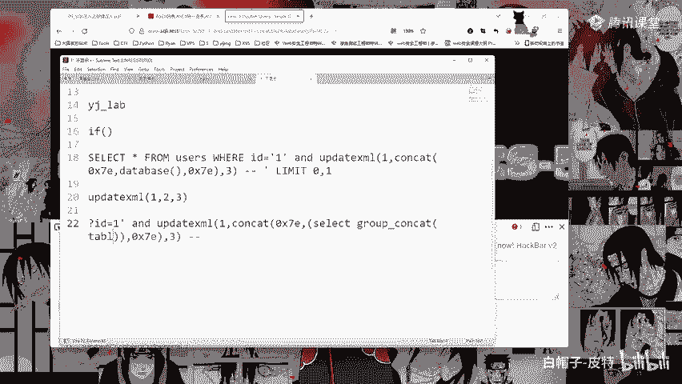
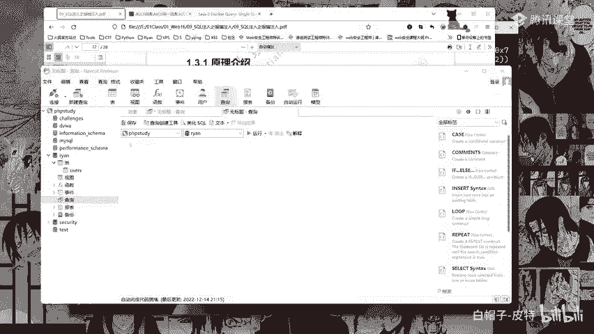
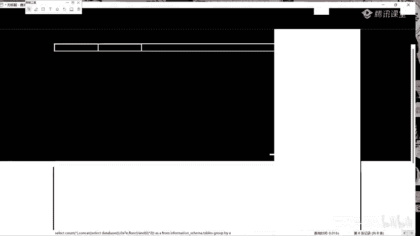

# 2024B站最系统的CTF入门教程！CTF-web,CTF逆向,CTF,misc,CTF-pwn,从基础到赛题实战，手把手带你入门CTF！！ - P38：报错注入攻击流程 - 白帽子-皮特 - BV1m64y157UX

报错注入攻击的流程。首先判断是否存在注入，判断是否存在注入啊。那么这里呢就跟我们这个一样了，这里呢你加个单引号，它就报错，那么就说明呢就可能存在注入点啊，杠杠加对吧？注释一下执行。哎。

能够正常执行啊能够正常执行，这就是啊。页面出现报错，因为单引号不匹配，所以呢它就会报错啊。如果说能引起数据库的报错，说明用户是可以对查询语句进行修改的，说明存在漏洞。啊，然后判断注入类型。那么这边。

判断注入类型涉及到后续注入过程中，需不需要判断闭合方式。通过一。单引号and一等于一井号和一单引号and一等于2进行判断。如果页面有不同的变化，说明是字符形注入字符形注入啊，这个就是刚刚给大家讲的。

我们这里呢可以在这里加个单引号，然后and一等于1。好，它有显示对吧？然后呢，我们and一等于2。它就没有显示，这就说明它是字符型啊。因为前面加了单引号啊，前面加了单引号。如果说不加单引号。

它这个东西它就没有用了。不加单以后呢，他就会显示。啊，没关系。这样的话呢不加单引号，它就会显示啊，这就说明它是一个字符形啊，字符形。所以呢其实就按我这种我这种是最简单的啊，加一串字母，它能够正常显示。

那么就说明它是字符型。好，字符型判断出来了。字符型啊字符型判断出来了，判断出来了之后，获取数据库名，获取数据库名啊。

那么这边呢就需要使用到我们的一个update updated dateate XML啊，update XML我们这边执行一下啊。And。U date， date try。它有三个参数啊有三个参数。

那么这边呢建议大家123把这个东西先写好，1233个参数先给它站好。站好之后，在第二个参数里面写上我们需要我们构造的，需要查询的pay漏的啊，那么这里呢就是。Concact。

conact比如我们那个0叉71啊0叉71逗号，然后dabbase。逗号0叉71啊，为什么为什么这这这这这前面要写上0叉71啊，这个东西呢，因为它报错，他到时候报错，他会报一串报一串的话呢。

这个0叉71就是一个波浪线波浪线这个东西就是为了让我们快速的找到我们所需要查看的内容啊。我们这边执行一下。好，哎，这里就可以看到啊，叉pa语法错误，它这里就有对吧？波浪线波浪线。

那么两个波浪线中间的就是这个dabbase security，这就是我们的一个数据库的名字。这就是我们的一个数据库的名字啊。比如说我们可以看一下这里的查询的语句啊，看一下我的日志。好，来翻一下，哎。

这就是真正的circle执行的circle语句。好。Thank。真正执行的在数据库里面执行的社会语据就是这个东西啊。Oh。这样的话呢你就能够清楚的看到它传入的东西啊。

比如说这个东西其实我们也可以比如说啊在我这个never cat上执行一下，给大家看一下啊，直接在数据库里面进行一个执行。呃，security啊 securitycurity表表查询哎，新建查询直接粘贴。

啊，粘贴啊就这样啊，这就是我们的这语句。哎，它这里也是一样的啊，会有一个报错。这个报错跟我们这个页面上的报错是一样的。跟我们这里的这个报错其实是一样的，叉pa语法错误啊。

这个这就是这个upate叉ML它的一个用法了啊。update叉ML它的一个用法，这就是它执行以后的结果，这中间就是我们所要的一个内容。啊，那么接下来啊这里也是一样的。

这边呢在数据库中它执行的就是这个东西了。在网站中执行的结果就是这里呢会有一个显示。这里它会有一个叉pa语法错误，然后中间呢会把我们的一个dabbase，它的一个名字给它报出来啊。

然后这是在数据库里面执行的一个。用法这个应该执行错了，这个命令不一样。好，思考一下啊，为什么要这么构造攻击语句。对吧这里其实刚刚也给大家讲了，我刚刚我刚刚在写的时候就已经给大家讲了啊。

我们使用update叉 mail，它需要有三个参数，它需要有三个参数。所以我我写的时候啊，我写的时候呢，我就是先写。Update。XML对吧？先写这个东西，然后呢。

中间把它的一个三个参数先全部给它写出来，123对吧？三个参数。需要三个参数啊。这里我们必须在叉pa俊这个参数里面填充叉pa格式的字符串。也就是在这个第二个参数第二个参数这里。

但如果说我们填充的不是一个叉pass格式的字符算，就会产生报错，所以我们就需要在第二个位置写我们自己所需要的。所需要查询的词库语句啊，那么这就是这样的，由于由于叉pa只会对特殊字符进行报错。

所以呢我们这里可以使用这个使用这个波浪线啊，波浪线16进制就是0叉71来进行一个利用。啊，那么这边呢你如果说直接这样写，那么是没有用的。所以呢把它使用concact，把它给拼接起来啊，把它拼接起来。

这就是这个这个配漏的它的一个构造的过程啊。获取数据库表明啊获取数据库表明。那么这个东西除了波浪线可以换成其他的吗？可以可以，像我们这边的一些，你看像这边这边，比如说你可以找一个。找一个什么呃这个横线啊。

这个什么减号也可以啊。其实你这个把它。2D啊。0叉2D这边我们可以试一下试一下0叉2D执行一下。好，这里面呢他就没有了，说明这个不行，他这边呢就只写了这个。我们再找一个。Okay。就找一个啊。

找一个找一个找一个特殊字符。小划线小划线。아Yeah。下划线哎。下划线是5F5F来试一下。哎，5S它也不行。Yeah。你。哎，我记得之前之前我应该是我之前我用过别的，但是我现在想不起来了。

艾服艾服找一下，看一下。今天死活得找出一个来哎，40好40。40。40好像也不行呀。Okay。40它就只变成一个艾特服了。多了福哎，多了福试一下啊试一下，不行的话，就只能用波浪线了。多乐福24。

我记得之前我见过别的，但是我想不起来哎是哪一个了。我想不起来是哪一个了。Yeah。哎，多了福可以多了福可以啊。多了福可以啊啊，多了福可以对吧？它有些是可以有些不可以啊，特殊字符。

那可能这个我怀疑这个多了福它可能不算特殊字符哎。啊，不是这个at符，这个艾符它可能不算是特殊字符，所以呢它不报错。这个这个多乐福可以啊，多了福。多了不可以感叹号不试了不是了啊，就这样就这两个。

反正这些东西呢，反正基本上还是用波浪线用的多啊。0叉71这个东西是用的多的。好，然后获取数据库表明啊获取数据库表明。那么这个东西我这边呢就跟大家讲一下这个到底怎么来写啊，怎么来写。

这个是我们的一个语句啊，语句，我们的一个配load的配load的看一下，配load的应该是问号IE单引号。He。是这个东西啊，问号一等引号等于杠杠加。这里呢它的一个配load应该是ID等于。问号ID。

等于一单引号and叉 update叉L啊，然后这个是我们写的，这边刚刚加就刚刚空格吧。也行，就这样。好，然后这里呢我们直接把这个dabbase删掉啊，看我是怎么写的啊，看我是怎么写的。

这样的话呢你写起来你就不容易出错啊，不容易出错，不容易出错啊。先把这个dabbase删掉。这里呢这个括号留着啊，留着，然后在这个括号里面，在这个括号里面写我们的select语句。

select select查什么呢？group。Yeah。concact然后对吧？conc也是一样的啊，group contact这两个东西，这两个括号也给它写全写全，然后再回来再到中间去写。

table name啊查表名对吧？然后到括号外面from。Information。scammer点tables。where where条件是table schememer。

table schememer等于。啊，然后这里啊这里其实你直接写dabbase也可以啊，然后写这个security是EC。URITY啊security然后我们来复制复制。粘贴一下。好，执行一下。好。

出问题了。这就出问题了啊，看一下。回去哎回去，我直接在这里改，我就不信。Select。字没写错吧，没有，刚刚加刚刚空格是一样的，刚刚加和刚刚空格是一样的。information写错了。

information。information写错了啊，我说呢写错了，这里多了一个。好，我们再来我就不行了，直接这次直接直接复制这里。直接按到后面啊这里。写错了啊，所以说啊还是得多写。

你看我这好久没有写了。他还是不行，哎，为什么不行呢？我们再来看一下。括号不一步一步来投大。是的，所以呢这种东西还是得一步一步写啊，一步一步写。那么我们这边检查一下检查一下。SELECT select。

Group contact， table name。From information。啊现到我发现。skimmer点tableswhere。tableablemer等于se。对。I。奇怪了，没有问题啊。

No。哦，4号有可能。改一下。写杠个家。哎，刚刚加他就可以，那就是这个东西，那就是他这个这是这个hg bug的问题啊，ha个b的问题不是我的问题。h个b的问题啊，ha个b的问题。或者我刚刚空格Q啊Q。

这样应该可以。你看这个就可以，他可能是会把就是这个后面后面你这个空格，他可能会给你给你给你直接自己删除掉。直接自己删除掉。所以还是写杠杠加啊还是写杠杠加。你看刚刚加就没问题啊，不是我的问题啊。

我说我怎么可能写错，我说这玩意我不可能写错呀，这这是吧？23也可以也可以，23比较保险啊，223基本上任何情况下，223都是有用的。好，这就是啊它的一个表表表就出来了。嗯。好。

那么这边啊这边这边这边就是这里呢这里啊这里我们这个东西啊是需要括号括起来的，需要括号括起来的。为什么中间查询的语句外面要用括号括起来？对。Okay。因为concact这个东西啊，它中间不允许有空格。

所以呢需要把括号括起来，把它变成一个整体。也就是呢要把我们这里啊这里这个select到这里。这中间啊这中间我们是有空格的对吧？中间呢这里我们有很多个空格啊，很多个空空格。然后呢。

这个concact它这个东西呢，它里面不能够有空格，有空格它就认为是多个参数。所以呢这里我们就需要把它把这个整个第二个参数，这就相当于是整个的第二个参数把它括起来。

所以这也是为什么我在这里只把这个dabbase删掉了，这个括号我给它留着了的一个原因啊，所以这个东西大家也是可以多学一下啊，这个的保险一些，这样的话不容易出错。好。

这就是这个表明啊表明表明获取完了之后获取库名。那么这个东西就简单了啊，库名呢就直接把这个table name。table改成carCOLUMN啊，没有写错，哎，怎么大写了？COLUMMN。

然后这里也是一样的啊，把这个table把这个table全部给它改成colon COLUMN。然后后面再加上啊and。tableabletable name等于等于users users。啊。

这里呢他应该是不区分大小写。windows下它一般是不区分的，我们可以试一下。colCOLUMNM没有错。Yeah。好，可以看到啊，它不区分，对吧？这这种东西。

这其实也就是windows和linux的一个区别啊。linux它是严格区分大小写的windows它是不区分大小写的。好，继续啊，这就是这就是获取我们的一个字段啊，获取字段。

字段获取完了之后获取表中的一个记录啊，表中的记录就比较简单了。记录的话呢，其实这里我们就直接这个group contact。要吧要要也行，不要也行，要吧。

那么这里呢我们就group contact user name。大写看着不舒服。Use the name啊直接from from后面这些都不要了。Okay。直接from users。

直接from users啊。好，这就是。看到没有看到没有，为什么他这里只有这么一丢丢？一丢丢对吧？这里呢只有一个波浪线，后面这个波浪线没有了，为什么它只有这么一丢丢？这就是我们前面给大家讲的啊。

前面讲的这个叉pa。他 pass这里有一个他只会报出报错32个字符。只会爆出32个字符啊，所以呢你多了的，他这里呢就看不到了，看不到了啊，超过32个字符的呢，他就看不到了。这就是这个东西啊。

所以呢这里就需要使用subus string来进行一个截取了。使用sber string来进行一个截取，那么这又比较麻烦了啊，那么这这又比较麻烦了。那么我们这边呢还是把它给弄出来啊。

and这里把给弄出来。还是用刚刚加啊，就不用刚刚空格了，省得到时候又出问题。那么这里我们需要截取的是什么东西啊，截取的是什么东西，截取的就是我们这个东西，对吧？我们这个select查出来的这个东西。

我们需要给它做一个截取。所以我们就直接在这里写上sber stringsubsber string啊，sber stringSUBSTR啊，然后这里加一个括号，然后把这个东西给它括起来。啊。

这个东西给它括起来啊，为什么我在这里写啊，为什么我在这里写呢？因为这里它有提示啊，它有提示。这样的话呢大家也看得更清楚一些啊，你可以看到我这个这个这个括号下面它是有一根横线的。

然后对应到这个括号下面是有一个横线的啊，这就是编辑器的好处啊，编辑器的好处。好，这里结出来了，截出来了之后，然后萨ber斯郡还是前面给大家讲的萨ber斯郡它有三个参数，有三个参数啊。

那么这个这个东西这就是我们第一个参数，然后第二个参数第三个参数。那么这里我们这里啊就是从一。给他截取到了，因为它只能32个，那么我们就给他截30个吧。截30个接30个，然后我们这边复制一下啊。

看一下有没有问题，看一下有没有问题，粘贴一下走你好，没有问题，没有问题，对吧？可以看到啊，这里呢有两个这个这个波浪线，那么就说明没有问题啊，没有问题，这是30，然后我们再来第二波第二波啊，第二波。

这边我们就先复制，把这个东西复制一下。复制出来。写在这里写在它下面啊，写在这里。是这个啊，然后这里呢我们直接从第30，从第31位开始。截30个，从第31位开始截30个啊，这里直接改吧，从31位。

因为我们刚刚截到了30位嘛，然后还是一样的，截30个执行。好，这里呢也是一样的啊。那么这个就是你一步一步去截啊，一步一步去截，我就不继续了，我就不继续了啊。

就这两个东西这两个东西呢就结成了这样截成了这样呢，你可以把这个给它写在一起。写在一起，哎，它就变成了这个。好，然后我们就先休息一下啊，休息一下。休息休息休息。も。休息，然后我们。21点10上课。

limit这边limit不一定有用啊。Yeah。这边limit不一定有用，我可以操作一下，给你看一下，操作一下给你看一下。找一下找一下找一下哎。走走走走走。找不到了找不到了，找不到了，就自己改一下吧。

找不到了，就自己改吧，改一下，把这个东西不要了。这个东西也不要了。Okay。这框也不要了。好，没有问题了啊，这个括号应该是没有少啊，没有少。然后我们这边limit。点一。啊，我们可以来看一下，看一下。

看一下它行不行啊。但是limit01的话，说实话啊，就算行，它的效率也太低了呀，是吧？limit01你只能一个一个看啊，我这样的话呢直接给它截了。好，没有用啊没有用，少个逗号，哪里少个逗号哦。

这这稍个逗号啊。是是是少个逗号，确实是少个逗号啊。好，发现没有用啊没有用，为什么没有用。是的，就像但是这里啊，比如说把这个group content给它删掉。

这个group content和这个limit不能一起用啊，group content和limit不能一起用啊。好，有用有用。你看它一下只有一个啊，一下只有一个。然后呢，你也可以一样的在这里改一。

一它就变了啊，就是改第二个参数啊，改limit第一个参数啊，这里叫第一个参数，改limit的第一个参数。Yeah。这里给它改掉，哎，这个改这个参数啊，改这个参数。改这个参数0limit从零开始啊。

零就是第一个一就是第二个。零就是第一个一就是第二个。好。还有就是这边跟大家讲一下啊，这个命例是不会发给你们的啊，这个命令是不会发给你们的，这个你就不要想了，这个东西你就自己去敲啊，自己去敲，一定要多敲。

这个是没有办法的。这个是真的没有办法了，你只能自己多敲，你才会熟练，你才能够熟练啊，不然你到时候你如果说我把这个东西发给大家的话，我看可能大部分同学会直接复制粘贴，复制粘贴的话呢，说实话有用。

但是对你自己来说提升不大。为什么啊？因为你自己让你自己去写的话，你可能你写出来就可能少个括号或者少个逗号，可能这里写错，那里写错，所以这个东西大家一定要自己动手去写啊。当你自己写熟练了以后啊。

当你自己写熟练了以后，你就可以去总结相关的配漏的。然后你后面就可以进行一个复制粘贴了。但是你在刚学习的时候是一定要一定一定一定要多动手去写，一定啊一定是的，手敲才有成就感啊，一定要自己手去敲。

SSA可以去多挖啊多挖。SRC呢你先去挖一些可以先去挖一些工艺的。然后我们这边等一下也会讲也会讲怎么去找这些公艺的工艺的一个石头注入的漏洞。嗯。😊，好，然后我们就继续往下。这边呢获取自段中的记录。

刚刚也已经给大家讲了。这边呢你也可以就是直接这样的话，这样的话，像课件上写的这个IDus name passwordword直接把它给group group can给拿出来。这个其实不好看啊不好看。

所以呢我这边我这边就是只只只写了这个user name啊，只写了user name。Yeah。好，然后我们这边啊其他的一些利用方式，这个就是前面给大家讲到的啊。

当然我们主要还是用这个update叉ML这个函数，那么其他的呢也会用得到。像这个什么随机数，加上这个这里呢group by啊，group group by group by就是分组，然后count。

这个东西叫做虚拟表报错啊。然后这个我是给大家加了，这里呢给大家加了这个原理介绍啊，原理介绍。好，这边有这样的一个配漏的，这边呢就是它的一个配漏的，获取数据库名的一个配漏的。比如说我们这边我直接使用嗯。

或者使用CMD嗯。这边连一下。港有。Yeah。Yeah。S database。哎，写错了。然后我们这边柚子DVWA。这个字放大一些些。Yeah。Yeah。好。

然后这里啊我直接复制一下这个payload给大家看一下。Okay。这边就是这个东西啊，大家可以先看一下，它这边就会有一个报错，报错这里呢有1个DVWA。然后有一个一呀。

然后这个等一下后面会给大家讲这个原理，所以呢这里就先直接给大家看一下这个payload的。这边其实主要就是这个这里这个dabbase就是我们这里的这个DVWA。嗯。这个东西啊。

conact的第二个参数就是查询的指令。这里呢就是我们这个DV database，就是这个东西啊这个。concact contact第二个参数就是这个dabbase，就是我们所需要的一个数据库的名字啊。

然后获取表明就是这样的一个payload。这个payload呢，我们也可以我这边也是直接复制啊，先直接复制给大家看一下它的一个情况。好，这里呢gebook就是它的一个表啊，它有两个表嘛。

DVWA有两个表，一个是getbook，一个是一个是users啊，应该是users。然后这边这个limit limit啊，我们可以修改一下。比如说我这边改一下，把这个limit这里啊。

limit这里把它改成1啊0111哎users好，这就是这就是这个啊，然后列名获取列名就不一个一个试了，获取列名这里也有，然后获取数据这边呢也有。这个就是这样的啊，这边就是这个东西。

然后或者使用这个使用这个啊这个第二个这里的这个就看起来更简洁一些啊，更简洁一些。但是效果其实是一样的，获取数据库名。对吧DVWAA杠1这个DVWA就是我们这里的这个dabbase了。

这边就是扫前面前面少了一个这个0叉71啊，前面少了1个0叉71。所以呢他就是这样的。效果是一样的啊效果是一样的。比如说获取表明。对吧Gbook啊gbook，然后我们这边也是一样的。

把这个limit limit limit limit在这里limit把limit改成一对吧users这个东西是一样的效果啊，是一样的效果。然后这个什么获取列名获取数据这边也有。然后原理介绍啊。

原理介绍这边就给大家讲一下flow flow哎，差不多就是这个东西了。是的，所以呢这边我们给大家看一下，使用这个吧，使用这个。然后这里呢用我这个新建的这个rean这个数据库啊，新建查询。呃，这个嗯。

flow的这个东西我。大家不知道不知道这个东西吗？不知道的话。我看一下啊，给大家讲一下，那么就。这个我因为我也不知道大家这些东西没有了解过。嗯。😊，flowlow这个其实就是它的一些函数啊。

就是它的一些函数，一些方法。那么这边我看一下怎么给大家讲怎么给大家讲。嗯。Okay。看一下，我看一下怎么给大家讲好一些啊，因为这个其实flowow的这个就还是得拿我们的这个。直接在这上面讲吧。

呃。这个其实你比如说啊。select，然后我们星号啊星号，然后逗号一个。这就是一个随机数啊，随机数。From users。我们这个这里应该可以放大。这个rale这个东西啊，它是一个随机数。

我们这边执行一下。好，这里呢它其实也是能够查得出来啊，能够查得出来这边这边这个东西哎，这里大家可以看一下它的一个数字啊，它的一个数字。然后我再执行一下，哎，他这个其实每次都是有区别的，有区别的。

Yeah。你看比如说看第一个啊看第一个，第一个这个叫07888啊，07888。然后呢我再执行一下，它变成了0。8。你看它这个每次返回的是0到1之间的随机数啊，0到1之间的随机数啊，这里面呢你也可以写。

比如说这边写个0。运行一下好。好，这里呢对吧？是这样的，这个它就是固定的。你看我这里加了一个零之后，它每一次运行的结果它都是一样的。哎，这边他怎么还报了个错呢？好，你看00。155对吧？我再执行一下0。

155，它就是一样的。然后你看我写个一。执行一下。哎，他怎么怎么好，0。4050。405，你看它这个东西它就是每次都是一样的。就是我这个在这个reddom这样的一个函数里面，我如果说没有写没有写数字。

没有写东西，它就每一次它都是不一样的。这个东西啊，每一次它都是不一样的啊，每一次它都是不一样的。然后呢，你如果说写了东西，它每一次它就是一样的。啊，然后这中间的呢这个东西叫做随机种子参数啊。

这个具体的是什么东西，大家也不用太太去深究啊，就是你只要知道你在里面写了写了数字之后啊，它每一次它的一个运行的结果是不变的，它每一次运行的结果是不变的啊。这就是这个raundle这个东西了。Yeah。

然后我们这个flow啊flow它就是相当于是一个叫做向下取整啊向下取整。什么叫做向下取整啊？什么叫做向下取整？比如说我们这边可以看一下，这边我们写一个。rundle给它乘以1个2乘以1个2。

然后我们来执行一下。好，这边大家可以看一下它的一个结果啊。他这边结果每次也是不一样的，每次也是不一样的。相当于就是把这个rdle，它的一个结果给它乘以一个2乘以一个2啊，为什么乘以2啊，为什么乘以2？

因为rale它返回的是一个0到1之间的随机数，0到1之间的随机数啊，它就不会有不会有超过一的，不会有超过一的。有网上。Yeah。Rundle a。这个东西啊它是返回返回0到1之间的随机数啊。

随机数0到1之间的随机数啊。所以呢我们如果是说。rundle哎乘以一个2，那么它返回。0到2之间的之间的随机数，这就是这个rale乘以2的意思啊。然后我们加上一个flow flow flow flow。

Flow。给它扩起来啊扩起来，然后我们再来执行一下。运行一下。好，这里你可以看到啊，它就变成了11111101有0有1有0有1啊，那么这个一和零是怎么来的啊？一和零是怎么来的？这个flow。Okay。

flowlow这个东西啊，它叫做。Yeah。向下取取整取整向下取整啊，中间这个N中间这里的这个N呢就是就是一个参数。比如说这个N如果说这个N等于0。1。111111随便写什么啊。

或者这个N等于没有四舍五入，它只向下0。9哎，9就99999999什么这两个东西啊，这两个东西你使用flow它的结果都为0，它的结果都为0啊，flow flow N这两个东西它的结果都为0都为0啊。

叫做向下取整啊，向下取整，因为它没有超过一，所以呢就向下向下，那么就是0。如果说N。等于。1。1点多少多少多少多多少啊，1。2它flow flow N，它的结果为一。哪怕你是N等于1。9多少多少哎。1。

9多少多少，它的结果也为一啊，也为一，这就是这就是这个东西啊。所以flow n flow nN等于这个东西啊，这个东西是0到2之间的。所以呢它向下取整之后，它就是零和一，只有这两个东西。

所以我们这边查出来，它就只有零零和一这两个东西，没有别的啊，没有别的，它就只有零和一，但是每次运行的结果都是不一样的。然后比如说我这边加一个0，哎，加个0。好，01101100。

0110110001101100，哎，它就是因为为什么呢？因为我们刚刚也给大家讲了，这个rle0，你中间写了参数的，它就是一个确定的值啊，它就不会变了。所以呢这边它也就是不会变了。

它就是这样的一个东西啊，这就是这个flow和这个和这个这个这个这个这个rale这两个东西的一个作用啊，这两个东西的一个作用。好，那么回到我们这里啊，回到我们这里。

这里首先我们创建了这样的一个users这个数据库啊。比如说我这边查看一下。se life信号from users运行一下，这就是它整个的一个原始的数据库啊，原始的数据库这个有啥用啊。

等一下后面这个有啥用，这不就是我们前面讲的吗？这里啊这里你看这里不是有一个吗？flow。rele0乘以2，这就是这个东西啊。然后为什么这个东西它会报出错误啊，为什么这个东西会报出错误？

这就是这个原理介绍，就是这里就是给大家解释前面这个这个虚拟表啊，虚拟表报错的一个原理。好，这是原始数据，原始数据。然后这边有一个叫做group bygroup by就是分组group by name。

就是根据name进行一个分组，什么叫分组啊。G ROUP group by。name执行一下。好，这边大家可以看到它就变成了这样啊变成了这样。变成了只有一个adminadmin一ga guess一啊。

然后哎这边我们复制一个吧，看一下，看一下没有这个group by的时候啊，没有这个group by的时候，原始的数据是什么样的运行一下好，原始的数据你可以看到它有一个admin有一个gues。

有一个admin有一个gues，有一个admin一有一个ges一有一个admin一admin一看到没有？它这里呢是有重复的啊，是有重复的。还有下。好，这边哎卡住了好，这边放到这里放到这里啊。

然后我们再来执行一下这个。好，这里两个东西大家可以对比一下，不是生序，这个东西其实没有没有什么太大的关系啊哎。好，这边啊大家可以看一下，这里group by分完组之后啊，分完组之后。

它就只剩下admin amin一gues guess一了，对吧？这边呢就是相当于是相当于是去重啊，相当于是去重，就是把重复的东西给它分到了同一组，分到了同一组。哎，不是delete啊。

不是删除这个东西跟删除有区别啊。等一下我们我们你看我接下来再执行一个东西，我再执行一个东西啊。在执行一个东西叫做select。name啊。

然后select name COUNT啊count count这个东西把它写一下啊，count。from user users，然后group by。PG by name。你可以看一下啊。

这边是这边就是Cle个新啊，然后这里呢是加了一个name和countt，我们来执行一下。好，这里大家可以看到nameadmin两个对吧？admin一3个gues两个gues一一个看一下这里。

是不是name是不是有两个一个name两哎adminadmin啊，一个admin两个admin，然后admin一一个admin一两个admin一三个admin一gues一个ges两个gues，对吧？

gues一哎一个ges一，所以呢这就是分组统计啊，就是分组统计。这个就不要了。这就是根据name字段分组，然后这个叫做先根据name字段分组分组之后再计术统计啊。

就是加了一个count加了一个count这个东西，它就会进行一个统计啊，统计。所以这里呢就是在执行group by group by name语句的时候。

my circle会在内部建立一个虚拟表用来存储列的数据。表中会有一个group by group group的 key值作为表的组件。这里的组件就是用来分类。name列中的获取的数据啊。

嫩列中获取的数据。Yeah。这边应该是写错了，获取的数据。当查询数据时，读取数据库中的数据，然后查看虚拟表中是否存在，不存在则插入新的记录。那么这边我们也可以给大家继续讲啊，这个原理呢。

这边我觉得写的还是比较清楚的。所以这边还是给大家讲一下啊，这边呢要注意的就是它有一个key key就是组件组件是以这个name为主件的，也就是我们这里的这个group by name啊。

group by name，你 by name。那么它的一个虚拟表就会有这样的一张表啊，这里有这样的一张表。看一下我的这个这个工具啊，应该有好，它会有这样的一张表。这个表是虚拟的，是虚拟的。

不是一个真实的表，它是一个虚拟的表。那么要注意的就是啊，此时虚拟表的组件是group by指定的name作为主件，然后组件组件组件组件唯一且不为空，唯一且不为空，所以组件的值啊要求不能重复。

如果重复它就会报错啊，重复就会报错。好，那么当读取到第一行去重后排序什么规则，这个就没有什么规则了呀。这个东西啊就相当于你可以看一下AAAAAG就相当于是按照字母的一个呃声序声序排列。

按照字母的一个声序排列。按照这个name，按照这个name值的字母。ask码值进行一个生序排列。因为这个默认它都是生序的啊，默认它都是生序的。Yeah。好，然后这里啊当读取到第一行的数据的时候。

发现name字段的addmin不存在，所以将addmin放入组件列中，一放在ID列中啊，就是这边会有1个ID的列啊，然后呢就放到这里来了。啊，那么这里呢我们把这个拉出来看一下，把这个。

这里就是这个东西啊。这样看一下啊，当它执行的时候执行到第一行，第一行是一个adminadmin。然后它这里呢分两步啊，首先根据name等于admin去虚拟表中查询，对吧？

name等于admin去新虚拟表中一查，哎，发现它没有对吧？没有，那怎么办呢？根据结果不存在就插执行插入操作，好，这里面没有一个叫admin的这个组件啊，这个key没有叫admin的。

所以呢它就会进行一个插入操作，插入操作就把这个admin插入在这个key这个key啊，这里是一个组件K然后一就是这个ID就是前面这个ID啊，这个一就把它给放到这里了，放到这里了，放到这里了。好。

这是第一次，然后。指针下移，哎，往下移往下移，看到第二个第二个是这里的gues，对吧？第二个是这里的gues啊，然后发现gues在虚拟表中也不存在，也不存在。那同样的给它放进去啊，放进去。

然后ID等于2，就是这个ID啊，这个ID等于2，把它放在这个ID值里面，这里也是一样的啊，组件不能够重复重复就会报错。那么这边它也是一样的，分两步，先根据name等于gues去这个虚拟表中查查一下。

发现没有没有就给它进行一个插入操作啊，插入操作，有这两步，然后再下移，再下移发现第三步admin哎，admin有了，对吧？admin已经有了。发现admin。admin在序拟表中已经存在。

那么它就会汇总在一起，也就变成了这样啊汇总在一起。然后这里呢ID1个11个3对吧？3啊，这个ID啊，ID3就把它放在这个一下面了，放在这个ID里面了啊，一和三就放在这里了。那么这样的话呢。

一直循环循环循环到最后啊，循环到最后。最后呢查完之后它就会成这样了。是这样的啊，adadmin13admin一和3guesgues2和4对吧？然后这个admin一admin一就是578。

gues一就是6，对吧？gues一就是6啊，最后的结果就是这样的。那么这里呢我们也可以看一下啊，就是这个这个这个这个结果啊，这个结果。我们也可以执行一下，给大家看一下这边啊它这个就会有点区别啊。

我们这边执行一下select IDD。啊，name吧 name IDD，然后from。users，然后呢group by。Group哎 group by name。执行一下这个东西啊，执行哎哎哎错了啊。

这里多了个多了一个多了一个多了一个。执行好，15261526啊，它就变成了。嗯。1526它就变成了这个啊。是的，只取第一个，然后后面的重复的这个因为这个这个ID啊，它只取第一个，只取第一个1526。

对吧？一admin是一admin一是5ge是2ges一是6，它就会按只取第一个，只取第一个。他就是这样的一个情况啊。ID取最前面的一个。然后接下来接下来啊，当我们加上countt这个函数的时候。

操作过程就变成了查看虚拟表是否存在该主件值，不存在则插入新记录，存在则countt字段直接加一，就相当于是一个统计，相当于是一个统计啊，这样的话就能够对上面的分类结果进行统计，结果将返回是这样的。

是这样的啊，比如说我们这边把这个name给它改成我们的叫做count。抗的信号。然后执行下，哎，这里已经有一个。执行一下。好，他就变成了。2321对吧？这个东西它就是一样的啦。

它就相当于是一个统计啊统计。好，那么这边啊我们这个语句这个语句啊，就是我们刚刚前面给大家看的这个语句哎，这个语句啊这个语句。这个语句它在执行的时候是一个什么情况啊？他在执行的时候呢，首先。

首先这边执行这个东西，他是会直接报错的。报错啊报错，那么报错就对了啊，报错就对了。喂喂喂喂，能听到吗？能听到吗？各位。能听到吗能听到吗能听到吗？喂喂喂喂喂。可以听到吗可以听到吗？刚刚应该是断网了。

断网了，我这边好像。可以听到可以听到。我这边好像网络刚刚应该是断网了，然后我是好哎呀哎呀哎呀哎呀哎呀哎呀。好，刚刚应该是断网了。然后我这边是手机开了个热点啊，手机开了一个热点。好。

我们继续啊继续继续继续。刚刚网络有点问题，他直接给我断网了。然后我是手机开了个热点。好，我们这边就继续啊继续。Yeah。继续看。首先啊我们这样的一个语句啊，这个语句呢它如果是说直接在我们。

这里面给它运行运行一下啊。嗯，直接手机开热点给你们上课。好，这边可以看到啊，这里也是一样的对吧？rearre，这个就是我这个数据库的名字啊，我这个数据库的名字叫做rear。

所以呢它这边报出来就是rear啊，它这边报出来就是rear，这个就是啊它会进行一个报错。那么这个原理是怎么情况啊，它的一个实现的过程是怎么样的，这边我也给大家讲一下啊，它实现的一个过程。

那么这里啊这个语句这个报错就是这样的。那么这一边啊，如果说我们执行这个语句啊，执行这个语句。把这里给他拆分一下拆分一下，我们看一下。这边就放大吧，直接放到最大。然后呢，我们来看一下。

Selectctor。count星号。然后加上我们的一个concact。concact里面select。哦，等一下，万一等下又突然断了。万一等一下又突然断了的话啊。

就可能是我手机没有没有没有设置那个就是最大的一个流量的限额啊。它可能到时候到了那个限额，它可能会断。所以到时候如果说断了的话，大家就也稍等一下啊，稍等一下。FLO OR。因为我不知道我开没开。

我设没设这个东西啊。winow0乘以1个2啊乘以1个2，然后我们把它ad。As a。From。Group by a。啊，这个就是大家啊大家我这边跟大家讲一下啊，如果说以后就是上课突发什么情况。

大家在讨论区说的一些东西，我如果说没有看到的话啊，没有看到的话，大家呢就到我们的一个班级群啊，到我们班级群去说一下。因为像这种断网的话也比较难搞啊。好，这里呢我们它就是这样的一条语句啊。这样的一条语句。

那么这边我们也可以哎这里执行错了，不应该执行这个这个跟上面的是一样的。我们这边再改一下啊，比如说就看1个ID，看一个name。然后这边这个count就先不要了，count先不要了，就这个东西吧。

asus。翻译一下翻译一下，等一下啊，等一下，我先把这个写完。SASA还是要吧要要好，这个group by就不要了。先执行一下，看一下对不对，对，再给你翻译好。这边啊这边大家可以看一下啊。

这里select selectlect ID name对吧？就是这个ID name啊 ID name。然后这里呢concact就是跟我们前面讲到的conc一样啊。

concact里面呢有一个select database啊，这个就是我们这个dabase啊，就是这里。这个select database。就是这个real，然后这个0叉71就是我们这里的这个波浪线啊。

就是这里的这个波浪线。然后这个后面的这个东西啊，后面的这个flowriow0乘以2，就是后面这个01101100啊，就是这个东西啊，就是这个东西。然后这个asA asA就是把把这个东西。

把前面这个东西把它当成是一个A。所以呢它这上面写的就是A啊，所以这就是我们这个ID name IDD name和这个A，这个A指的就是这一串指的就是这一串。指的就是这一串啊，课件上其实也有写啊。

课件上其实也有写。好，然后这里呢我们发现它这里呢01101100，对吧？这个就是我们这里的这个东西啊，就是这个flow。flow Rale0啊，所以呢他这边其实就是这个rale在作怪啊，在作怪。

所以呢它在后面这个011011这个东西是不一样的。那么就是这个啊就是这个。这里呢也是一样的啊，执行这个东西。然后这边呢它这个01101100000这些每次执行呢发现它这个内容不一样。

那么它其实就是这个rele函数，因为它是一个随机数啊，rele函数是一个随机数。好，那么这边啊这个语句这个语句select count。

然后这个conc这些这些0叉7一 flow这个东西as a from usersgroup by a这里group by的对象是A啊，是A，那么这个A呢就等于这个concact这些这些啊。

就等于这里的这个什么concact什么0差select database0叉7一 flow这个东西，所以呢这个as a就是把这个东西叫做它的一个别名啊，把这个东西把这里选中的这个东西叫做是A。

所以group by a就是这个东西了。然后第一次第一次它执行的时候，先查询虚拟表有无A数据。第一次，比如第一次查询的时候为C line呃circleI杠0。啊，那么这里呢就是我这个re啊。

这里就是我这个数据库呢叫做re嘛。所以呢它这里应该就是re波浪线0。当然也有可能是其他的值啊，也有可能是其他的值。查询无对应的结果，执行插入操作，插入时，该语句再次执行。此时A等于。CcleI0。

那么这个它也可能是其他的值，这里呢就像这种啊，它一样的，会有一个A，这个就跟我们前面这里前面这里啊这个这个这个key name是一样的。这个name就是是我们group by name。

所以呢它就是key name。然后我们下面这里呢是group by a，所以它就是keyA，然后count count就是我们这里的这个count啊，就是我们这里的这个count。好。

然后这是第一次啊第一次执行发现它没有没有，那么就插入插入就是circle I0，插入它的一个数字count为一啊为一。然后这是第一。一次第一次，然后第二次也是一样的，先查询这个表里面有没有。

然后这里已经。已经插入了一个已经插入了一个，然后去查询有无A数据。比如如果。哦，他还是。circleI0，如果说还是这个circleI0啊，还是这个东西。那么查询无对应的数据执行插入操作，插入时。

该语句再次执行。如果说此时A还是等于这个东西啊，所以呢它在执行insert操作的时候就会报错，就会报错啊。因为这里组件你可以看到它两个东西都是这个组件组件两个都是同样的了。组件重复它就会报错。组件重复。

它就会报错啊，所以呢这就是为什么我们使用这个东西了。这里你也可以看得到啊，它有1个01101100，对吧？那么这里呢就是第一次是这个run0，然后呢就把这个run0给它插入进去，插入进去呢。

就是就是就是就是re。波浪线0，然后count为一，然后第二次就是rean一 count一对吧？第二次，然后第三次哎，第三次它这里又是rean一，那么它就报错了，组件重复了，所以它就报错了，报错。

它就会把这个组件给它报出来，把组件报出来，就是这个rean01。这里是因为group byA，然后A重复，所以报错。是的。就是这个原因啊就是这个原因。所以呢这就是这样的一个东西啊，这就是这样的一个结果。

因为组件重复，所以它会进行一个报错。那为啥by name name name名不重复，name它里面没有重复的呀。by name他没有重复的。他这边是会进行一个分组统计啊，因为这边呢我们没有使用。

没有使用，没有使用我们的那个flow和那个raow啊，没有使用flowow和raow啊。你可以看到它这边的只有只有countt呀。对吧它只有一个count啊，它并没有使用我们那个select。没有使用。

我们看一下看一下啊，没有使用它的一个语句是不一样的，直接看这里吧。这里面啊这里你看我们这个by name，它就是一个name和count这两个东西啊。而我们这里的这个A的时候啊，A的时候呢。

它这边是使用了flow render。这个主要是这个东西啊，主要是这个东西，因为这个东西它是一个定值。它就是这个01101100，所以呢它一定会有重复的。因为这里你看011哎，第三次就已经重复了。

所以呢这个你这里你写零写一，它的一个结果可能不一样，但是原理是一样的。白 name的时候，你看白 name的时候是没有我们这个flow的呀。我们这个byA的时候加了这个flow，它才会报错。

他才会报错啊，所以我们的这个配漏的是这个东西。那里面哎这个是有两个at的命啊，是有两个at的命，但是他因为是这个东西，它会进行一个统计。他会进行一个统计啊。Okay。他会进行一个统计。

所以呢这个东西是确实比较绕啊比较绕。这个东西呢确实比较绕，所以这个其实。这里就是大家要知道有这一种方式啊，或者说你要知道有这一种 pay漏的，有这种 pay漏的这个因为用的少，它其实用的少，用的不多。

用的很少。这个就到时候大家自己去操作一遍啊，去自己去操作一遍，或者呢你也直接跟我一样的，跟我一样，你可以直接在你的数据库里面新建一个数据库，然后呢建一张表建一张表。然后表里面呢，你自己你可以按照我这样。

你可以按照我这样啊这个什么name，然后这个pass，你可以随便写。然后这个name呢，你可以跟我写一样的。

就是直接给它插入，然后呢去操作一下这些命令啊，去把这些命令操作一下。按照我们课件上的这些命令去操作一下。好，这是这个东西啊。这里使用的东西是不一样的。

前面前面那个主要是为了给大家讲这个group by啊，group by后面这里呢我们这里是使用了这个conact。concact加上这里的这个flow。使用了conact加这个flow。Yeah。

Okay。大家可以去尝试一下啊，课后去尝试一下这个payload。

然后我们就继续往下讲啊，然后这一下这些什么几何函数，这些呢没有没没有去没有去测试啊，以下配load的没有测试。所以呢大家啊你可以去用，也可以不用啊。这个东西你自己看一下就可以了。这些因为都不常用。

常用的还是我们那个update叉M。然后还有呢就是可能就是我们这个东西啊，就是这里给大家讲的这个虚拟表这个东西可能用的这个用的也不多啊。这下面这个就更不多了。

然后这个什么name concept这个东西啊，仅可用于获取数据库版本信息，所以这个东西也没什么用。做这个实验的本质是为了报错，发现重复兼值啊。

这个主要是为了给大家讲一下这个payload的它的一个原理啊，讲一下这个payload的它的一个原理，就是这个虚拟表，这个虚拟表报错它的一个原理。

