# 2024B站最系统的CTF入门教程！CTF-web,CTF逆向,CTF,misc,CTF-pwn,从基础到赛题实战，手把手带你入门CTF！！ - P3：web-设置代理 - 白帽子-皮特 - BV1m64y157UX

那我们b suit它是一个抓包的一个工具，抓包改包的一个工具。那为了实现它这个抓包改造的功能呢，它需有需要配置一个代理。那我们这里看一下如何的设置代理。其代理有两部分。

一部分是我这个浏览器或者是我这个操作系统，它要配置一个概念。第二部分呢是我叫be夫，要监听这个代理的服务气。要设置到你是说我浏览器把这个流量发送到这个代理服务器上。然后是监听呢就是b部来接收这个待理。

就是这个意思。这里呢虽然说是可以在windows系统中设置代点，这样是可以的。但是不推荐大家在windows系统中设置代理。为什么？因为我们在抓包改包的过程中，它会出现非常多的流量。

包括那个windows，它操作系统，它自身也会联网，它也有流量。他会检查更新啊等等，进行很多联网的操作。或者说你使用多个浏览器，你使用这个火狐啊，这是火狐浏览器。你还有还有这个谷歌浏览器啊。

I级浏览器啊。你如果说在windows系统里面设置代理的，你这些流量都会被抓在一起。那么你所抓取的流量。我们这里开先开启一个概念。你会接收到的流量就会非常的多。那我们要分析包的时候。

这些无关的流量就有可能对你造成的干扰。你真正想要找到精确看的包，比如说我要看这个包，我想精确的看一下。你想这是40多条，你你在里面找。如果说你在一个系统里面设置代理的话。

你可能说100条500条都有可能。你再找的话，那难度就大很多。所以推荐大家在浏览器里面啊设置一个代理。这样的话，我在火狐浏览器里面设置代理，我只会抓火狐浏览器的一个流量。那windows系统的流量。

我别的浏览器的流量都不会经过b。这样避一免这个。无关流量对我们一个网络安全工作的一个干扰。那么在浏览器里面怎么设置代理呢？推荐大家使用这个switch欧米伽这个插件啊，这里少打一个Yswitch欧米伽。

这个插件怎么装呢？很简单，我们在火狐里面找到一个扩展，其实在别的地方也是找扩展，在谷歌浏览器也是找扩展。只不过谷歌浏览器的有一些扩展呢需要啊VPN才能够连上去。所以我们一般就推荐火狐。大家都可以连上的。

那么在扩展里面呢，可以搜索。To为欧米伽。

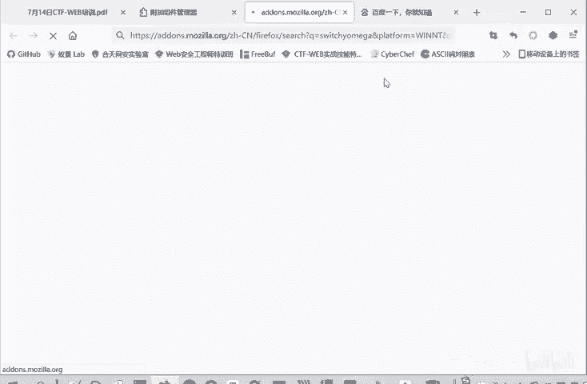

我看我听写的OMGA。

就会出现这个proxy switch warm，然后点击这个插件。

大家没有安装这个插件的，这里就会有个添加。点击添加就会进行安装。如果说已经安装这个插件了，想把这个插件删除，不想用这个插件了，那点击移除就可以了。这个插件请大家装一下。

因为这是一个设计代理非常方便的插件。我们可以看一下这个插件怎么用。但是安装正好之后呢，这个浏览器这个位置右上角这个位置会出现这样一个圆圈的标志。这个圆圈的标志就是我们的switch warming。

然后我们点击它的选项进入这个所有求欧敏感的设置。为什么说他。为什么推荐大家使用呢？因为这个设置带你非常方便，我可以新建一个情景模式。比如说这之前bb就是我建你的一个情景模式，可以自己命名。

这报表代理怎么设置怎么代理呢？代理协议。在我们b抓包，你就默认到协议就可以了。那后但你服务器呢是我们本地的服务器，但你端口呢。这个端口可以设置8080，因为b是默认的是8080监听。你改也可以。

然后不带你的主机列表，它本来有个127。0。1，它就是不带你本地的地址。但是我们这里要把这个信息给删除掉。让让他代理本店地址。这是因为我们现在在学习这个外部安全，很多时候我们需要搭建一个靶场环境。

然后我们要自己做这个靶审上的题。这种情况下，他这个必须要抓我们117。0。1的1个流量。要不然这个很多打卡的题就没法做了。啊，大家安装过程中，如果说有什么问题的话，也请发在聊天里面。

我们下课前的一段时间。来集中看一下问题。你还可以根据不同的需要来设置不同的一个代理。我我第二个代理，我设置代理服务器可以不一样，端口也可不一样。大家有的时候为了学习，要关上梯子。

在这里也可以设置一个代理风险。然后我们使用的时候，根据需要，我直接点击哪一个。点击bp，它就按bip的代理，然后点击这个查瑞就是查瑞的一个代理。它切换代理非常的方便，也可以直接相连。

直接相连呢就是不使用代理。

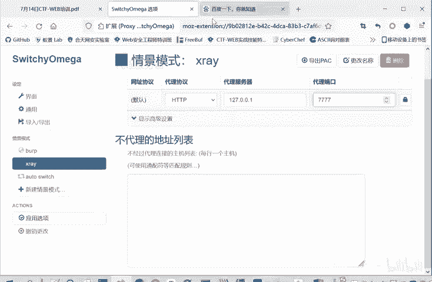

这是一个switch米伽，它是非常好用的。然后再。所谓求wo命卡上设置好代理之后呢，我们要在bap上监听这样一个代理。那我这个是之前已经设计好了，所以我就直接能够抓到流量。监听是在哪呢？

在这个option里面，这个b suit一个proxy代理模块，代理模块下面有四个子板块，我们后面都要讲的。

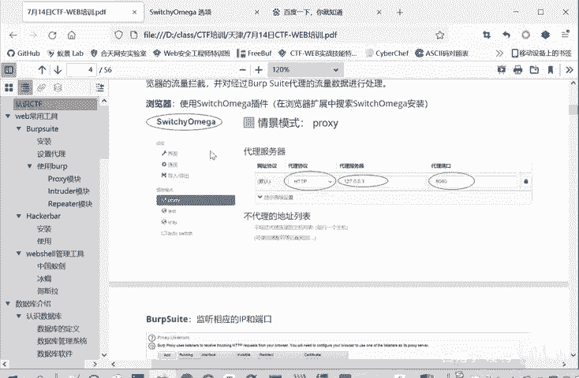

第四个子板块呢，这个option选项。这里面有个代理lister监听监听器。监梯器里面有个IP端口。前面有勾，让后你把它勾上这个IP3可。

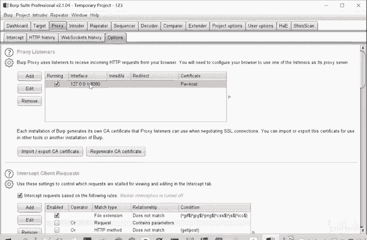

也可以设置，但是要与这个switching欧米伽。

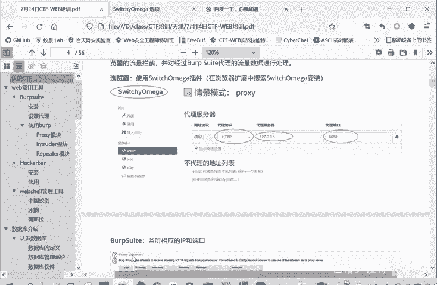

里面保持一致。我们比如说是用这个。bp模式来让bp进行一个。监听的。那么你这里的IP和端口要和bb监听端口保持一致就可以了。这里设成80829091都是可以的。但你最好不要设成那种常用端口，免得冲突。

啊，这是一个代理和监听的事。经过这样的设置呢，bp就能够抓到HTTP的流量，能够进行拦截，能够把这个包的历史给抓抓下来，然后进行一个分析。但是大家可以看到，我们这里面抓了很多HTPS的包。

因为现在HTPS。这个用的是越来越广泛了。如果说只进行刚才的代理和监听呢，是不能抓HTBS的包的。因为我们缺少一个证书。就像这里课件上写的bb上述设置呢，bb速只能抓HTTP的话。

没法抓HTPSSS是secure安全。因为HTPS的安全性增强了，需要证书才能允许抓取。birk suit呢不是一个合法的。数字证书颁发7个CA也就是我们说CA。那为了抓取一些TPS的包呢。

就要让b普伪造一个公效证书，得到客户端的验证和信任。然后操作是怎么操作呢？就是我们。我们开启这个代理。然后我们直接输入。HTTP。

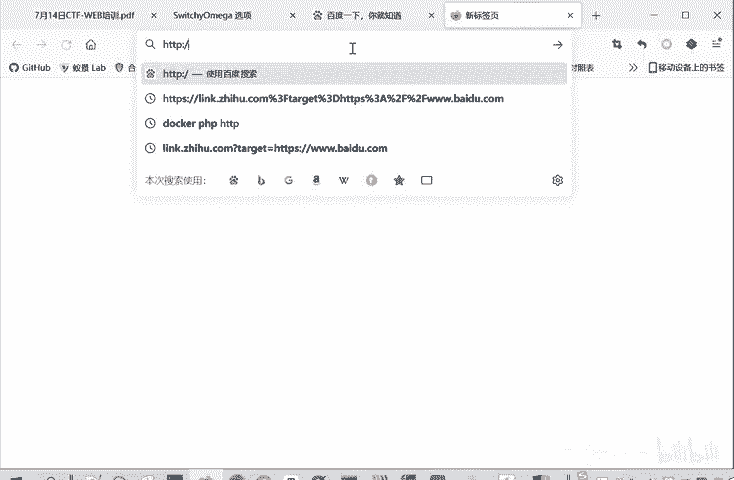

Bp。会出现这样一个界面，然后这里有个CA证书点击就会下载。因为我这里之前下载过，所以它重命名成一了。首先第一步是下载好这个证书。然后第二步呢就是浏览器安装证书。这个火狐浏览器文件就是说在我们的。

隐私安全证书查看证书中导入这个证书。比如说我们证书下载好了，那我们就点击设置。

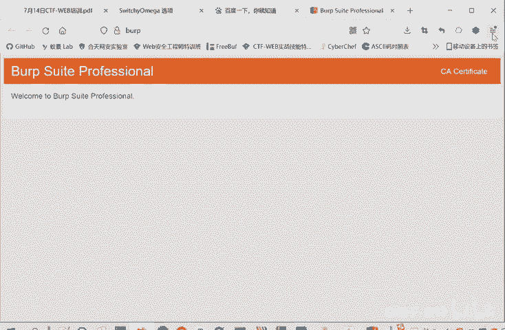

这个设置的路径在哪？在隐私安全里面，这个找不到也没关系。隐私全里面有个证书，有查看证书，找不到，你就直接在这里面搜，也是可以搜到的，就搜索证书。

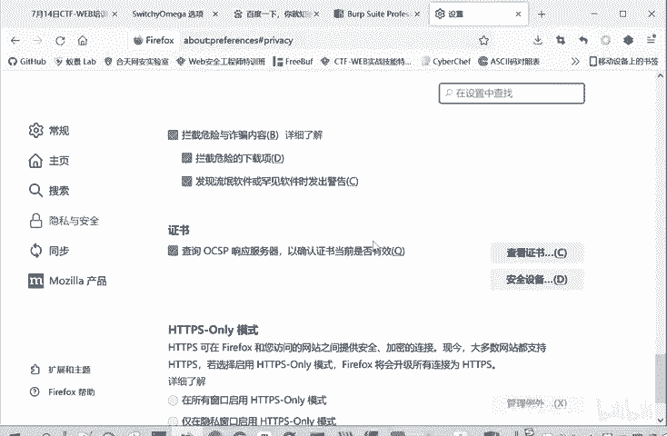

查看证书里面有个证书颁发机构，有个导入。

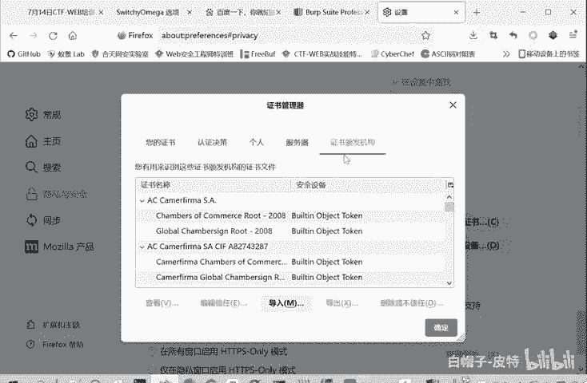

把我们刚才下载的文件进行一个导入。导入进去就可以了，这里我就不重复导入了。因为我之前已经导入过了。

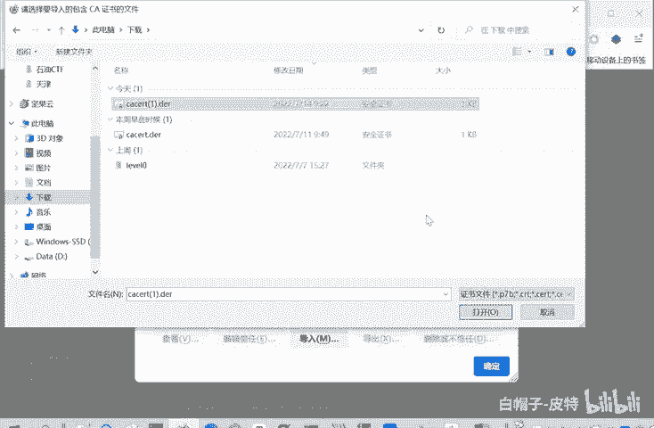

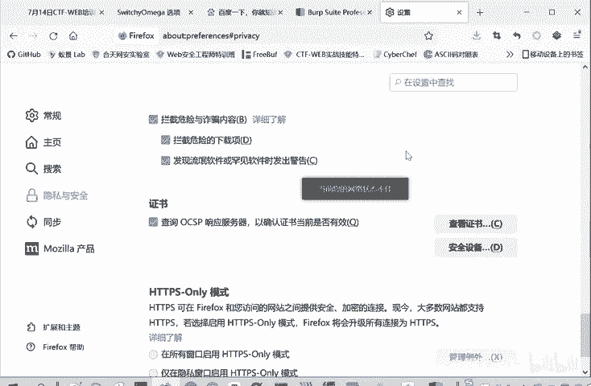

这是一种安装方式。这种安装方式就跟我们代理一样，它是。

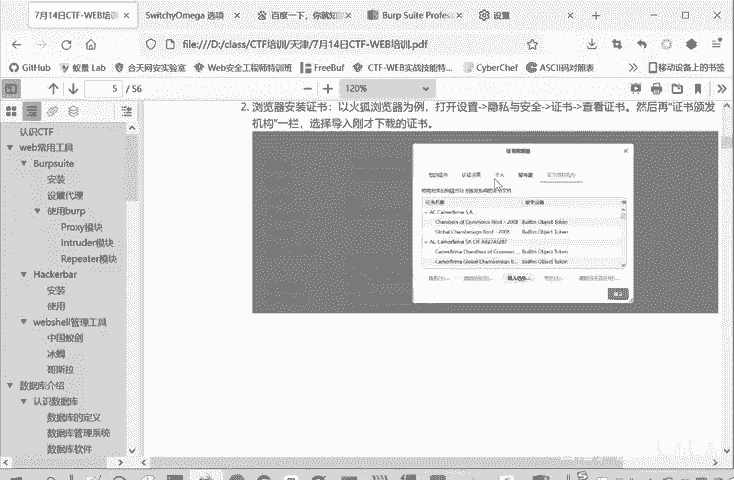

只在我只对我们当前这安装的浏览器生效，我们bb想要抓别的浏览器的8还是抓不到的。那么还有一种安装方式呢，就是直接双击我们下载证书进行安装。双击之后就会打开这个界面。然后直接点击按照证书。

然后证书存储的时候选择。将证书存储为这个受信任的跟证书颁发机构。然后剩下的就默认选择，点击确定下一步就可以了。推荐大家使用这种系统上安装的方式。因为这种安装呢是我们。在整个系统进行了一个证书的安装。

那么我们不管是抓我们这个。

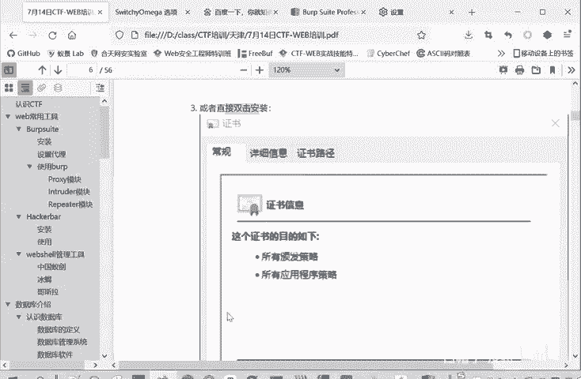

好。火红浏览器还是抓我们这个。

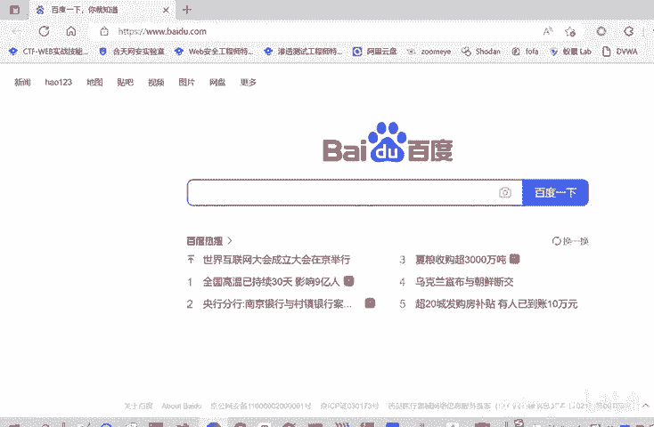

还装我们这个IG浏览器。

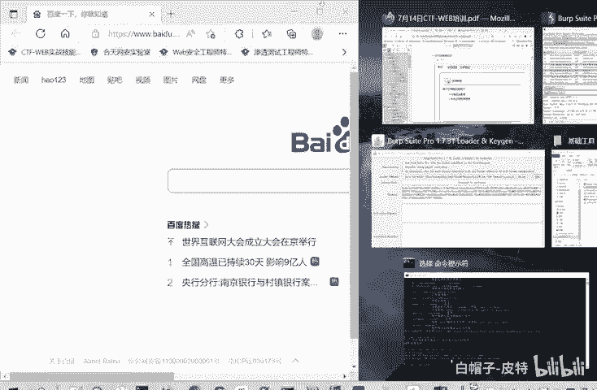

或者抓你的谷歌浏览器，你你想抓哪个的时候切换都非常的方便。而不用在每个浏览器上进行一个分别的安装。啊。

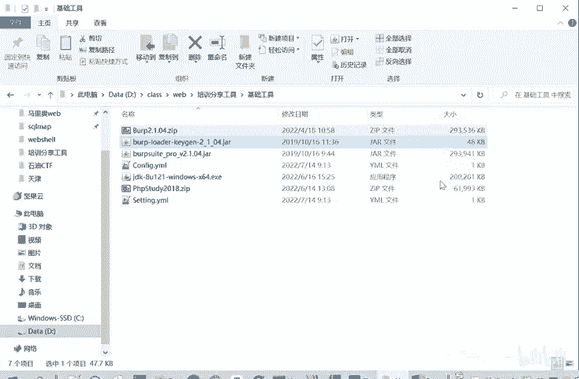

当然你不想在系统安装，用第二种方式在浏览器上导入也是可以的这是两种方法。

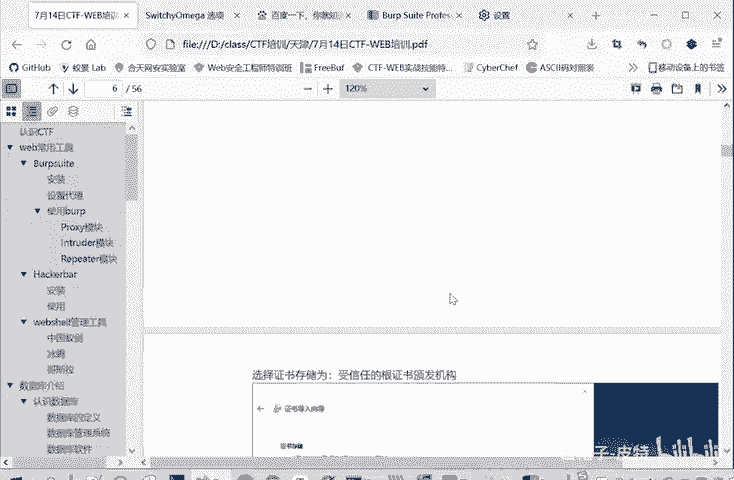

No。