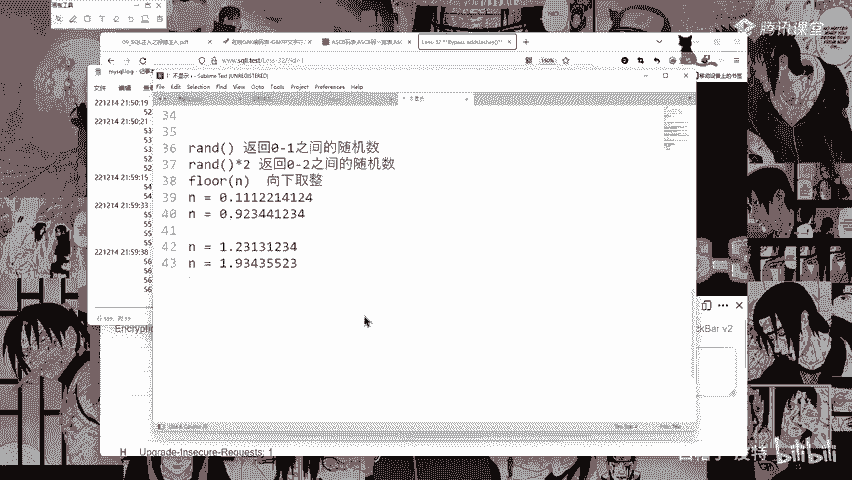
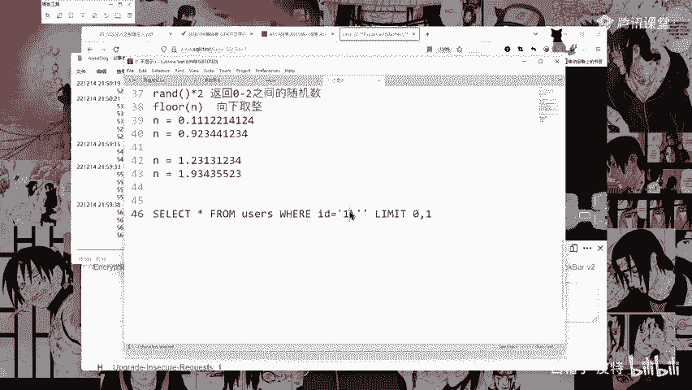

# 2024B站最系统的CTF入门教程！CTF-web,CTF逆向,CTF,misc,CTF-pwn,从基础到赛题实战，手把手带你入门CTF！！ - P40：宽字节注入方法 - 白帽子-皮特 - BV1m64y157UX

宽字节注入主要是源于程序员使用的数据库编码与PHP编码设置不同的两个编码。如果PHP编码为UTF杠8，而my circlecle的编码设置成设置为了GBK设置为了GBK啊，或者设置为了GBK啊。

都是GBK这样配置的话呢就会引发编码转换，从而导致注入漏洞啊，那么像这边后端代码这里my circlecle设置GBK编码设置GBK编码。

然后这里呢circle这就是它的一个circle语言circle语句。啊，四个语句尝试普通注入。普通注入就是你写一个单引号，它这个单引号会直接给你转移转移掉啊，转移掉。转移之后呢。

就相当于是这样斜杠这个单引号，它就相当于是一个纯字符。实际的scle语句就是这样，一单斜杠单引号，所以你这个单引号就闭合不了闭合不了啊。像我们这边我们这里哎这里对吧？本来它是这样的嘛，是这样的。

它这里有一个单引号啊，然后你输入一个一单引号，你的想法，你的想法是通过这个单引号来闭合前面的这个单引号，但是它会给你进行一个转移。转移的话呢，那么这个单引号它就不会跟前面这个单引号闭合。

所以你就没有作用啊，就不起作用。所以这是这个东西啊。那么执行的语句就是这样的，然后属于如果是说使用宽字节啊，宽字节呢就是百分号DF。为什么用百分号DF啊？因为这边呢主要也是它的一个编码了。

它这边这个斜杠这个反斜杠啊，反斜杠我们可以看一下它的一个编码。反斜杠应该是5F。哎，不是5F，是什么来着？反斜杠反斜杠是这个5C啊，百分号5C5C是我们这个百分号啊。啊，是斜杠啊。

反斜杠反斜杠这个反斜杠，它的一个编码是百分号5C啊，是5C啊，是5C。不叫百分号5C就是5C，它就是5C啊。你可以看一下我们这个阿玛5C5C就是这个反斜杠。所以当当前面有一个百分号DF的时候啊。

百分号DF碰到这个5C我们就可以看一下啊，看一下。比如说看一下我们这个GPK啊GBK这边有1个81，然后我们找到我们的一个叫啥DF对吧？ctlF找一下DF好，DF在这里啊。

DF找一下5C5C在这里这里这里这个东西啊，就是这个东西。就是这个东西啊，这个这个字呃应该是念念念念啥念啥，我也不知道他念啥，这个字稀奇古怪，没见过。DF5C。它就变成了这个它就变成了这个啊是念运啊。

事念运嘛，事念运那就没错啊搞得我都不敢说啊，念运那就念运吧，是吧？把DF5C它就变成了这个运字啊就变成这个运字。所以呢这边啊这个百分号DF加上这里的一个东西啊。就是我们输入一个百分号百分号DF单引号。

然后呢，因为它遇到这个单引号，它会给你转译。所以呢转译之后，这个反斜杠就成了5C。然后百分号DF5C就变成了我们这里的这个运字啊，变成了我们这里的这个运字，那么就可以进行一个绕过。这就是啊。

比如说我们这里的32关啊，32关可以看一下看一下。看一下32关。我操32关在第二页。3332。32在这里。32关，哎，我这个怎么报错了呀？不管能用就行了，管他报不报酬。输入一个问号ID。

ID等于一啊等于一执行一下是吧？变成了这个啊加一个单引号。加一个单引号，你看它还是这个它还是这个。他还是这个，然后我们可以看一下这个日志啊，看一下这个日志。再来看一下，把它关掉，看一下这个日志。

看一下能不能看得出来啊。看一下他能不能看出来什么东西，哎哎哎哎，在这里在这里在这里哎在这里有啊有，所以呢这就是这个日志的好处啊。

日志对吧？他就把我们输入的这个单引号转移了。

斜杠反斜杠单引号，这就转移了啊转移了。然后我们来输入一个。百分号DF单引号啊，百分号DF单引号我们来执行一下。哎，他就报错了报错了啊，报错了报错了，看到没有？一哎，这里有个有个这个什么乱码的，他不认识。

他写不出来啊，这个韵字，这就是这个韵字啊，这个韵字这个浏览器写不出来这个韵字，所以呢他就给你给你弄个这个框框，然后我们再来看一下这个日志啊。我们再来看一下这个日志。Yeah。好，对吧？运字啊运字。

看下复制粘贴出来。好，运字。对吧所以呢这样的话这个单引号就可以跟这个单引号闭合了，是吧？这个单引号就可以跟这个单引号闭合了啊，所以呢我们就可以直接给它注释掉。比如你看我在后面加一个杠杠加哎，注释掉走你。

它就正常显示了它就正常显示了啊，这就是这个这就叫做宽字节注入，这就叫做宽字节注入啊。然后我们什么。good bye试一下啊。走你。好，不认识哎，不认识好，看到这个就开心了，对吧？看到这个这就简单了啊。

这就简单了。我们直接删吧。因为这里知道它是删列啊，就不浪费时间了。直接删删完之后呢，union select S1L1T select123。好，这里呢把这个一，这里也一样啊，把这个一改成-一。

Yeah。好，23对吧？2三出来了。A，dabbase。Daabase。好，数据库出来了啊，数据库出来了，这就是啊这就是宽字节注入宽字节注入，这就是这样的啊。

