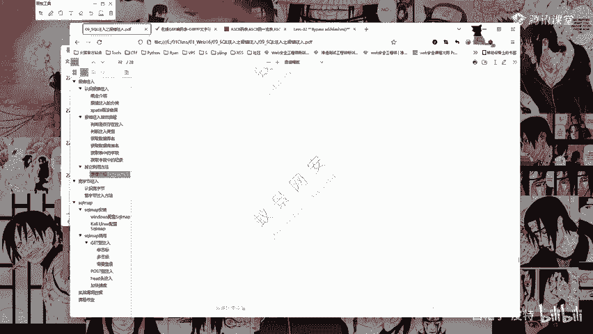
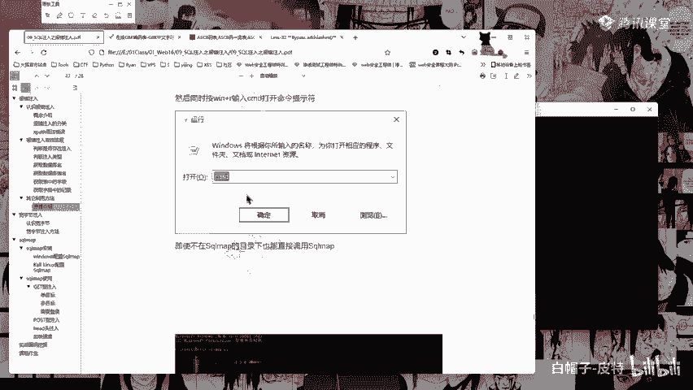
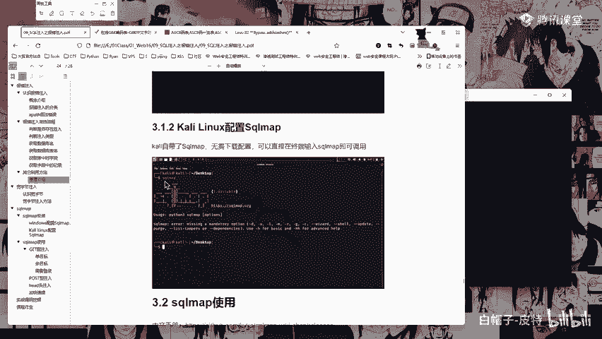

# 2024B站最系统的CTF入门教程！CTF-web,CTF逆向,CTF,misc,CTF-pwn,从基础到赛题实战，手把手带你入门CTF！！ - P41：sqlmap的安装 - 白帽子-皮特 - BV1m64y157UX

然后circle map circlecle map这个东西啊非常简单。它是一个python开发的一个工具啊。那么这边你直接下载，我应该我已经传到传到我们的微盘里面去了，传到我们的微盘里面去了。

我的ciirrcle map应该是在D盘tos下面的circle map这里啊，在这里。Yeah。这里搜cle map啊 circlecle map23为啥就dabase了呢？

这不就直接因为这不是跟我们平常的流程一样啊，你应该是之前的课没有听吧。你看啊我们这里回显位，这个叫做回显位啊，你可以看到页面上它有一个二有一个3，但是你可以看到这边这个一是没有的。一是没有的啊。

所以这就是为什么我们要判断这个回显位。因为我们要看一下我们在哪个位置上写的东西，页面上它能够给我们显示出来。啊，你如果说在这个一这个位置，你看我写一个dabb。我执行一下。啊，它还是23。

实际上这个东西实际上它执行了执行了，但是页面上看不到，看不到的话，那么我们是不是就不知道这个东西了呢？所以我们这里就是为什么我们需要判断这个回显位啊，回显位。那么你写二这个位置写三这个位置都可以啊。

只要你能看得到的位置就行。只要你能看得到的位置就可以。啊。只要你能看得到的位置就可以啊。我上次我上次找到一个网站，他他有有20多个回血位，写的我人都麻了，他20多个回显位。对。啊。

应该不叫20多个回显位啊，它就它有20多个位置，有20多个字段，有20多个字段啊。所以呢我union selectlect123456789101010112到20多到20多来判断它的一个回显位。

看一下它页面上到底几，它能给我显示出来几能显示出来，我就在几那个位置上做一些操作。好，这就是这个东西啊。然后像这边啊，这边我们这个cicle map。DF应该不是强制的吧，可以写成其他的啊。

这个倒没有去考虑过啊。DF这个东西，因为你得有有有哎这个这个东西问的有点意思啊有点意思啊。DF哎5C5C这里它有一个有一个这个东西，对吧？我们可以试一下，改成DE看一下。试一下，哎。

这个问题问的比较有意思啊。改成第一试一下能不能行啊，试一下能不能行。好，发现也可以是吧，发现它也可以他也可以，说明这就不是强制的了。那么这里呢我们再来看一下这个日志啊，看一下这个日志。

看一下这个日志它写的字是啥，哎哎，对吧？就是这个字啊，就是这个字，就是我们这里的这个GPK编码里面这个字。所以你只要有这个GPK编码，你就可以去给它弄一下，给它弄一下。你知道你知道对吧？

我们因为我们知道这个斜杠，反斜杠它是5C反斜杠它是5C。所以呢你去找一个能够跟5C搭起来的，能够跟5C搭起来的就可以。好，circle mapcircle map啊，继续讲讲我们的circle map。

circle map。那么在这里啊，我们你可以直接在这个circle map这个路径下输入1个CMDCMD啊，然后这边呢可以。pythonpython3。python2python3应该都可以啊。

python2python3都可以。python3cicle map杠H查看它的一个帮助文档啊，帮助文档，或者呢你这边也可以直接直接就是这样写，直接就是这样，它会出这样的一个结果，就说明可以啊，这就是。

然后呢如果说你觉得这样麻烦麻烦的话呢，那么你就需要去配置它的一个环境变量啊，配置环境变量。那么配置环境变量这里要有两个注意的地方啊，前提是点PY文件必须是默认使用python程序打开，而不是使用编辑器。

所以如果说你是用你是安装了，比如说py charmm这样的一些python的编辑器，然后你的点PY文件，点PY文件，你默认使用的是py charmm这样的一个编辑器打开的话。

那么这个配置配置这个环境变量是没有用的啊，那么这个东西怎么来看啊，你可以看一下这边这个图标，这个图标它是这样的，那么就说明它是默认是使用python程序打开的。

如果说你的点PY文件是你的什么什么py charm编辑器的图标，那么这个就不行了。还有一点就是python程序不能够改名python程序不能够改名啊，什么意思？

我们在最开始跟大家讲配置python环境变量的时候，不是有python。2。有pyython。3吗？对吧？那么这里呢是说让大家可以修改它的一个名字啊，我们这边看一下python2啊。

我这里pyth2对吧？这里你可以把这个python改成python2，那么你输入你在CMD里面输入python2。在CMD里面输入python2，它就是python2的一个环境啊，我这里因为没有改。

所以呢它就不行。你看我这里呢输入python。PYTGON啊，pyython你看它就是pyython2。9的一个环境。Okay。然后我输入python。python3它就是python3。

8的一个环境啊，我是改了python3的，没有改这个python2的。所以呢这里大家也要注意，所以这边这两个东西这两个条件哎哎哎唉这两个条件都满足了。

那么你就可以去环境变量里面添加啊添加在这个pass里面啊，添加在这个pass里面。然后呢，我这边就先把这个关了，关了，我们再重新开一个。重新开一个文N加R，打开CMD重新开一个，你看我这个路径是这个啊。

然后我直接输入一个python circle map点PY。好家伙，他不行了。他不行了。他不行了，看一下我的配置文件啊。Yeah。看一下我的配置文件，哎，这里哎这里有一个pass。好。

这里有一个pass啊，这里我们把我的这个配置文件给它移上去看一下。把它关掉再来。这就是因为改了名字啊，改了名字它就容易出问题。pyython。Circle。map点PY好，没有用没有用，那就拍死。三。

也不行。好，这就是为什么了啊，这个就是刚刚给大家讲的对吧？改了他的一个名字，它就不行。我再给它移下来，移下来，用python3试一下。啊，是的是的，是路径问题啊是路径问题。系。

所以呢这样的话就只能在他的一个歌目录下打开了啊。

这里呢我们就直接在这里打开啊，直接在这里打开。直接在这里打开CMD，然后我们来继续。看一下它的一个操作啊，这边这边就是配置环节变量了。然后卡里啊卡里ux卡里 Linuxux自带买自带cicle map。

自带circle map啊，自带circle map。所以呢你直接在终端输入circle map就可以了。这个是卡里。

