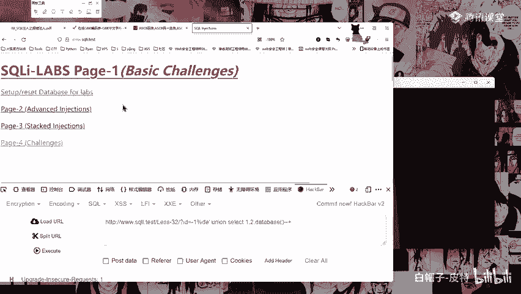
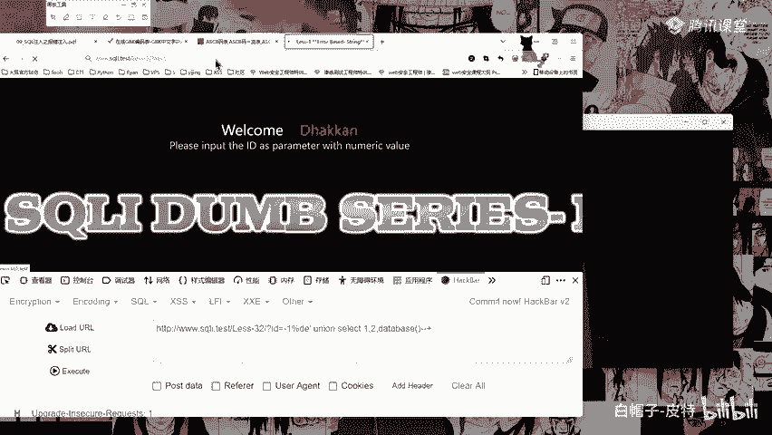
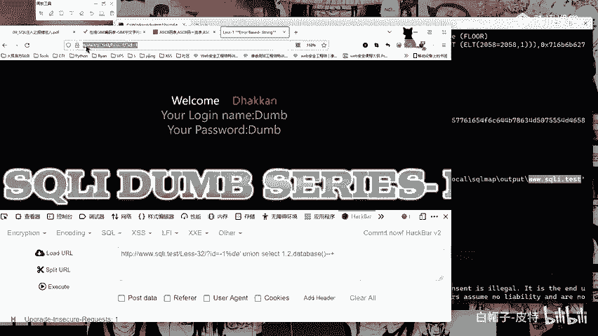
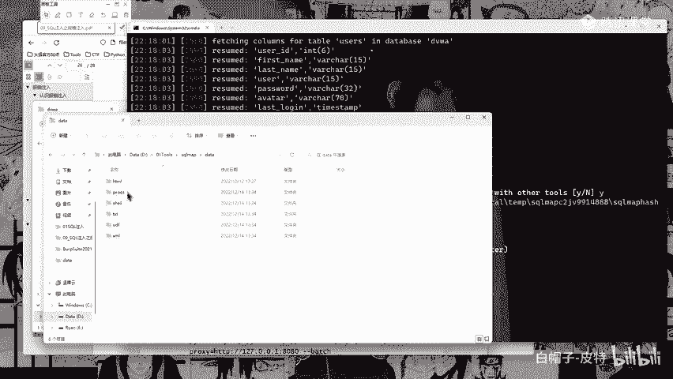
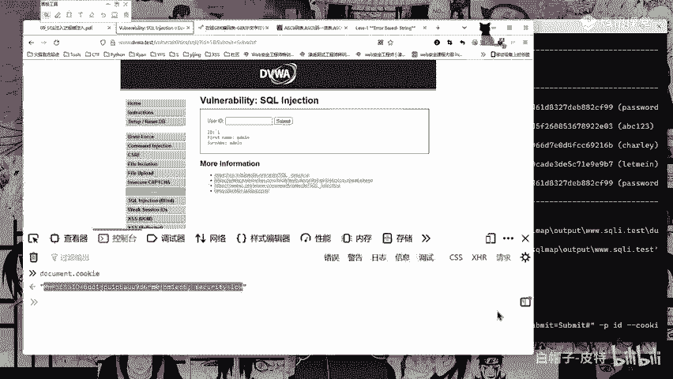
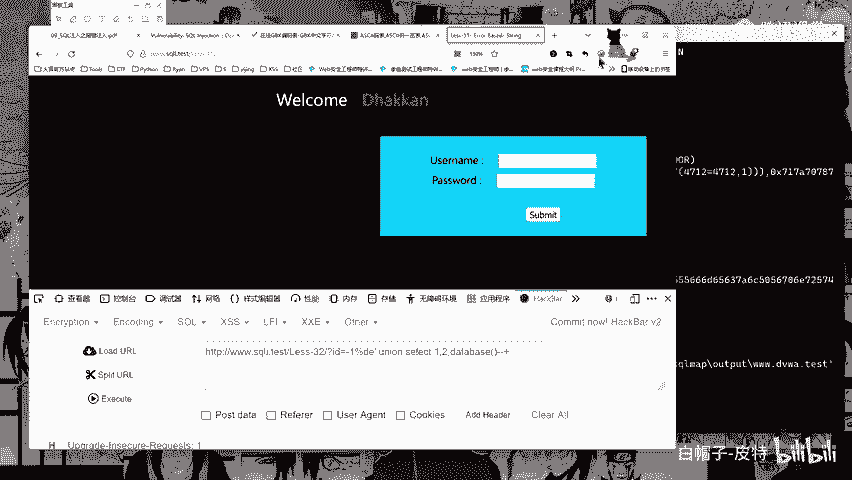
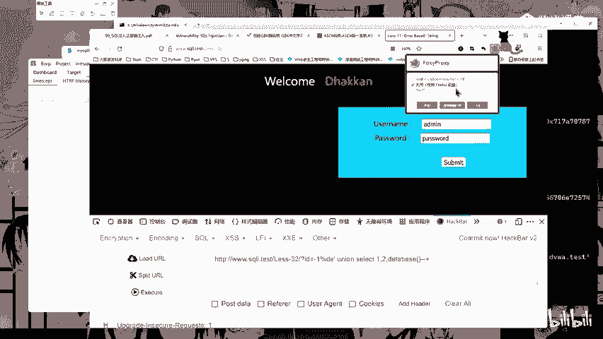
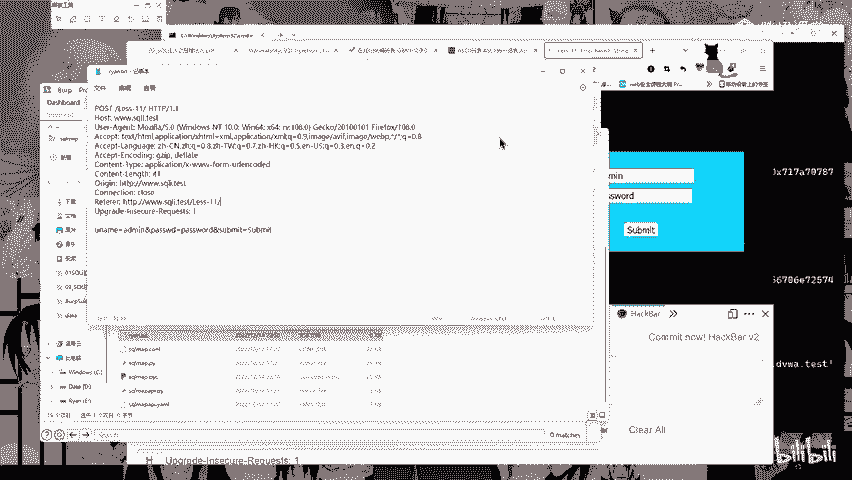

# 2024B站最系统的CTF入门教程！CTF-web,CTF逆向,CTF,misc,CTF-pwn,从基础到赛题实战，手把手带你入门CTF！！ - P42：sqlmap的使用 - 白帽子-皮特 - BV1m64y157UX

然后这边这个。scle map的使用有一个中文手册，中文手册呢也已经给大家发在了我们的那个微盘啊，发在了我们那个微盘。然后这边我们可以看一下啊，单个注入这边拿我们这个第一关。第一关第一关做个测试啊。

这里呢就是需要给他加上一个。问号ID等于1。

好，复制复制。然后这里像这样，我们pythonPYTHONpython。诶。circle map点PY杠U，然后把我们的一个网址给它写进来啊，写进来，然后回车好，它就会进行一个测试啊。

它就会进行一个测试。嗯。这个还是放大一些些。他就会进行一个测试啊，然后这边呢会让你选yes or no啊，选个yesY啊，然后YYYYY。一直给他选yes，然后就让他自己测吧，这是这样的啊，这里。

然后这个是我们的1个IDID等于1。然后这边呢你可以给它指定指定参数。比如说它有多个参数，它有1个ID等于一，有一个配置等于10。然后呢，这个ID它不是注入点，它的一个配置是注入点。

那么你要指定这个参数就使用杠P杠P啊，杠PURL多参数时指定注入点，指定这个配置。他就会只跑这个配置这个地方啊，他就不会去跑这个ID了。然后像这边啊这边有一个杠杠b杠杠b杠杠bs呢就是默认全部为Y啊。

就不用就不用你选嗯，默认全部为Y。怎么跑这么慢？然后这边获取数据啊，这边等他跑吧，先看一下获取数据，这些东西就是一些脚本，非常简单。你直接输入这个对吧？

杠UURLURL然后杠杠DBS杠杠DBS就是获取数据库名啊，获取数据库名，然后获取到数据库名之后，杠大D杠大D指定数据库的名字，杠杠tables获取表明。然后获取到表名到杠D指定库名杠T。

指定表明杠杠collums，获取列名，获取列名完了之后获取列名完了之后，这边什么杠C啊，杠C就是指定字段啊，就是我们这个coom了，杠大C啊，指定字段。

指定字段什么IDus passwordsword是吧，指定这三个字段，然后杠杠dumpdumpdumpdump dumpump啊，获取字段内容就叫做脱库。当脱裤啊脱裤，所以这个杠杠当慎用啊。

各位各位慎用慎用慎用啊，一定要慎用啊。刚刚当普可不好玩啊，你看这边就出来了把什么这是类型啊，type类型。这个什么基于基于布尔的注入啊，然后这个什么报错注入是吧？时间延迟注入union联合查询注入。

这就是它的一个注入的类型。然后这个什么titletitle就是这个东西啊。然后这个什么payload payload就是他测试的，他测试的就是这个问号1I单引号and什么833838388等于8388。

对吧？这就是end一等于一。然后这个东西这个东西也是end一等于一就是一样的，这是它的一个配load的。然后这边我们获取到了之后按一下上啊，然后杠杠DBS。回车这边你第一次跑完了之后啊。

第一次跑完了之后，这边大家可以看到它这边呢会有一个输出输出啊，就是它的一个结果会输出在这个C盘user userer这里有一个，然后这边就是你的一个域名啊，域名。

因为我这边是有一个虚拟域名叫做3W点circleI点test。所以呢如果说你是一个。

比如说是我们移警的靶场，那么它就是我们那个120点什么什么的IP啊，这里就是它这个文件的名字。就会存到这里面去啊，这里就不看了啊不看了，大家可以自己课后自己去看一下。然后这边你跑完一次之后。

它就默认会有一个缓存。所以呢你这边再跑它就快了，对吧？这个数据库数据库啊，DBS数据库就跑出来了。然后比如说我们这边指定一下杠大D，指定我这个DVWA然后杠杠tables。杠杠tables好。

这边呢也也也出来了啊出来了。然后这里呢会进行一个测试。对吧一个表一个表叫做gebook，一个表users。两个表测出来了。一个表两个表，然后继续杠大T大T指定我们的users usersers。

刚刚columCOLUMNScollums哎刚刚collos。好。这边他就会去跑我们这个字段啊，字段users，你看有一个user IDD，有一个first name，有一个last name。

有一个user，还有一个password，还有一个这个头像啊啊这个头像还有一个last login，哎，last log对吧？这就跑出来了啊，跑出来了，这就是字段。然后呢，你也可以直接dnk了。

然后你可以直接当。啊，这里就不当ump了啊就不当ump了，你也可以指定杠T啊，杠C啊，不是杠T杠C指定，比如说指定这里的什么什么first name啊，什么什么last last name啊。

指定这一些东西啊，指定这一些东西，这就是我们的这个。就是这些啊指定，然后刚刚当它就会生成一个东西啊，它就会生成一个东西。比如说我们这边。b一下啊，虽然说慎用，但是我就得用。

是吧我自己的东西怕啥DUMPb一下走你。当步一下啊。他他他。好，他这边。正在跑啊正在跑。Yeah。那么他这边啊执行的结果它会有一个输出啊，这里yes管理。yes，y，yes都是yes。

哦哦哦哦回车回车回车。哦，他这里要进行一个解密啊，他这里呢会有一个解密啊，因为我们这边呢有一个。我们这个密码这个password它是一个加密了的。所以呢这边会让你选择是不是要哪一个字典。

你想使用哪一个字典来进行这个MD5的解密。那么这里呢它会有一个输出啊，输出在这个user这个这个这个这个这个这个下面的这个test。啊，这里呢就是它解密的一个东西啊。

最后它这里呢会有一个DVWA点users down to CSSV fair。这里呢就是它的一个路径啊，有这样的一个users点CSV数据库加密。是的，因为这个DVWA的数据库它是经过了加密的。

我们这边可以看一下啊，C盘。user字典字典circle map默认的circle map自带的。APPda，然后这个APPda啊APAPP data如果你看不到的话，你就这里查看显示隐藏的项目。

把这个勾上啊，勾上就能看到这个APPda了。APP data下面的local local下面的cicle map circlecle map啊， circlecle map。

然后有一个outputoutput下面有一个3W点S circleI点test点进去哎，有一个d，当下面有一个DVWA有一个user users点CSV点开。好，看到没有？跑出来了啊。

user passwordsswordlast name ， first name ，last login ，f login，这些都跑出来了，它就会直接脱裤啊，脱裤，这就叫做脱裤了。

所以这个东西慎用啊慎用慎用。好，这是这个。然后接下来多目标多目标就是把要测试的URL保存在TXT里，然后使用杠M参数执行TXT啊，保存保存在这个TXT里面，然后去进行一个执行啊。

然后需要登录脱库是复制一份嘛？脱库就是把他的一个数据。哎，刚刚不是看了吗？刚刚我给关了。我给关了。刚刚刚刚就是他会存在我们这里啊这里。

用户下面的这个东西APPda下面的loal local下面的circle circlecle mapcircle map下面的output outputput这里有一个你的网站的域名或者IP啊。

网站的域名或者IP点进去，然后呢有一个dumpdump啊，dump当ump下面呢有你的一个DVWA这个就是库名啊，库名叫DVWA点进去就它的一个表。

这个表叫做usersusers这张表里面所有的内容就都在这里了，就都在这里了。是的是的。目标数据库中的数据没影响吧？没有影响没有影响啊，没有影响，这个就相当于是相当于是srcle map，它跑出来了。

跑出来了。然后呢，他给你相当于也是这个乐乐说的，就相当于是把它给复制一份。复制一份之后呢，把它生成1个CSV的文件啊，CSV的文件。但是啊但是。没有授权的情况下。

你获取数据库的数据库的内容是涉嫌涉嫌违法，会触犯国家相关的法律。还加密码，加密啊，这里应该是加了密啊。刚刚刚刚哎我怎么又给关了？牢底戳穿。即系。😊，还是加了密的呀。但是但是你可以看到啊。

这里这里解出来了。解出来了啊，就是我刚刚这边呢使用了这个这里哎这里这里这里这里这里。这里你看他这边跑完之后啊，他会让你问一下你，do you want to check them什么什么什么对吧。

让你检查一下它的一个。加密的方式啊，然后呢我选了Y，所以呢它这边就查出来了它的一个加密方式是MD5的一个加密。然后问你要选择哪个字典，这些数据能直接使用吗？是的，这个是circle map自带的自带的。

你看哪一个字典，你想要使用你想要使用哪一个字典，然后这里呢这个默认的字典，然后什么别的字典什么，然后这个是你要选择的一个一个列表，注意这个字典的名字，所以呢选择这个一啊，一就是它默认的字典。

它默认的字典啊，比如说你可以看一下，这里呢会有circle map下面的data data下面有一个TXT有一个word点TXT这里呢我们也可以看一下，这边DVW它自带了很多东西啊。哎呀。

不是DVWA怎么天天讲DVWA呀？scle maps map它自带了很多东西。这个就大家可以自己去研究啊，到时候你看它这边有一个data，data下面呢有一个有一个TXTTXT下面呢。

你看有一个有一个什么。

word点TXT这里这里是啥？有一个word点TX。就是这个东西就是这个东西啊，这里面都是一些字典啊，这里面都是一些字典。看common columns就是什么公共的列明的一个字典。

然后这个什么公共的文件名，什么什么等等等等。这一些他拥有它自己的一个，以及说它还有一些脚本。有些脚本。脚本脚本应该是在这里面啊，这里面它有一些脚本。所以呢这些东西呢大家就自己去研究一下啊，可以。

有时间的话，有兴趣的话可以自己去研究一下这个。啊，然后需要登录的话啊需要登录的话，比如我们DVWA对吧？我们DVWA它是需要登录的。嗯。😊，3W点DDVWA你看它是要登录的。登录的话呢。

那么我们就需要给他指定他的一个cookie啊，指定它的一个cookie。你看pythoncicle map杠U，然后这里呢接上我们的一个名字啊，就是URL啊URL路径。

然后杠P指定参数为ID杠杠cookie杠杠cookie你需要指定这个cookie才可以啊，需要指定这个cookie才可以。那么这个cookie怎么来弄啊，cookie怎么来弄，你不知道怎么来弄的话呢。

杠UURLURLURL这里这里这里。杠U指定URL。就是你看比如说我们这里啊circle注入circle injection这里啊，对吧？我这里呢写一个一，你看写一个一啊。

写一个一submit提交它这里呢就有这个，然后呢，我就把这个东西复制一下啊，把这个路径复制一下，然后在我的circle map这里。PYJ9Npython circle map点PY杠U杠U杠U啊杠U。

这里粘贴一下，这个就是我们的1个URL啊，那么这边最好啊最好呢你是使用使用引号啊，双引号把它给包起来。双以后把它包起来啊，因为它这边呢有一个and符啊，有一些这些东西可能会导致一些不必要的问题。好。

这边然后杠P指定参数A。杠P指定参数啊指定参数为ID，然后杠杠。cookie等于。双引号引起来啊，刚刚cookie双引号引起来。那么这个cookie怎么看？右键检查检查检查应该是有个啥内存，唉。

内存这里有一个你看cookiecookie啊，或者你直接控制台。控制台这里啊输入一个。Controller did。哎，不对，我都不记得了，叫什么documentDOC。

documentUMENTMENT document点COKIE documentment点cookie回车，哎，它就会把这个cookie输出，然后呢，你就直接复制一下啊，复制一下，复制一下。

然后把它放到这个中间哎，放到这个中间，然后杠杠BATTCH是是是这个吧，设叫BATCH吧，没有记错吧。

BATCHA没有记错。好，回车它就会进行一个测试了啊，它就会进行一个测试了，这就是需要登录的情况啊，需要登录的情况。需要登录的情况。那么杠杠cookie就是测试页面，只要在只有在登录情况下才能访问。

所以需要cookie来指定。然后呢，get型注入user agentUA头会带有明显的ir map标志啊。BRP抓包可以看得到这边它会有一个ciircle map。它会有一个circle map啊。

所以呢这边我们也可以。大家要看嘛？这个其实没有什么好看的啊，可以使用这个randomag参数随机使用UA头。这个为什么要随机使用啊，为什么要随机使用？因为有一些有一些网站它有waf它wa它会自动检测？

比如说它检测到你这个请求包里面，你的UA头里面是这个circle map，它就直接把你拦掉了，把你IP给封掉啊，那么所以呢这边就是可以使用这个杠杠rle aag这个参数来使用随机的UA头。

这样的话就可以绕过它的一个检测啊，绕过它的一个检测。然后po的注入Po的注入呢注入点在posts数据里面称之为po注入。那么这个呢我们就可以抓包抓包啊，然后把请求包抓取并保存在TXT里面啊，TXT里面。

好，这边已经跑完了。然后比如说我们这边也可以抓个包看一下。Po post我们应该怎么来抓啊？诶。😊，这边第几关是post呀。看一下第几关是post啊，第十一关十一关是post的。好，这边哎这边不能这样。

我们这边开一下开一下，然后这里呢输入一个admin，输入一个pass word，然后开启抓包。

提交哎，这里就是这样了这样的啊，然后你可以直接conttrol C，然后呢新建一个东西，但是这个东西啊，你新建的这个文档，最好是直接在circle map。在Ccle唉，不是这里，在在在我找一下。

在这里是这里吗？不是这里。怎么。直接开吧。底一盘tos这里有一个时空 map啊，直接放在这里啊，在这里新建一个。比如说新建一个re点TXT回车啊，然后打开。打开之后给它粘贴进来啊。

把我们这个pos请求包粘贴进来啊，粘贴进来。ctrorlS保存。

保存完了之后，这边来我们再来看一下啊。我们再来看一下保存完了之后。这里保存完了之后，python circle web杠R指定文件指定文件杠P指定参数指定参指定参数啊，注入点杠杠DBS。P为 p。

Crcle map点PY杠R，然后我们是re点TXT。杠皮指定you name your name杠杠DBS跑一下。Yeah。他这边也会检查检测这个wa和这个IPS这些设备这个东西。啊，这边回车回车。

Okay。好，这就是这个啊po型就是这样做。然后had头型cicle map默认测试所有的get post参数。

当这个level值大于等于二的时候也会检测HTTPcHTTP cookie头HTTPcook头的值啊。当大于等于三的时候会检测UA头和refer头的值，最高可以为5，这就是它的一个级别啊，级别越高。

它检测的东西就越多。级别越高，它检测的东西就越多啊，这个就大家可以自己去试一下，然后这边加快速度，加快速度，就是可以调线程调线程了，调线程。条线成我们这边找一下啊。

cicle mapcicle map level level LIB level下面的这个CORE啊，然后这里有一个setting就是设置啊，setting点PY找一下啊。

s哎hir thirteen点PY啊在这里，然后我们使用编辑器打开。编辑器打开，然后里面呢有一个什么东西呢？有一个这个什么max线程啊，max这个最大的线程。找一下。找一下找一下max maxax。

Max。max这是time out超时的。Cookie。max现程现程现程。Yeah。有没有看过了的？看到了的记得跟我说一下。哎呀，直接cttrolF搜一下。Yeah。看去F搜一下，你马上找了。好。

在这里哎这里啊。现程这里默认为1，你给它改成100，它就更快了。这是这个东西啊，然后实战漏洞挖掘实战漏洞挖掘。这边他怎么还在跑，怎么跑的这么慢？好，实战漏洞挖掘，这里就是我们之前给大家讲的售后售后注入。

售后注入啊，然后这边用黑客语法谷歌黑客语法去搜inURL问号ID等于一inURL问号ID等于一公司inURL问号ID等于一产品。然后这里的这个什么一，你可以改你改了之后，他查出来的东西也不一样。

然后这个什么后面的这个公司产品这些你也可以改你改完之后，它查出来的东西也不一样啊也不一样。只是这个。