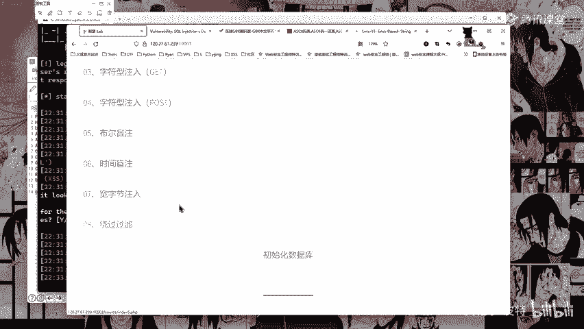
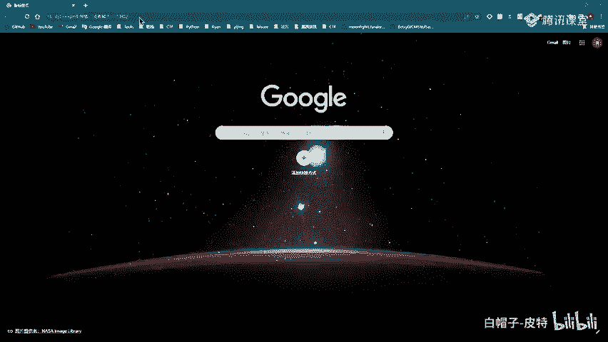
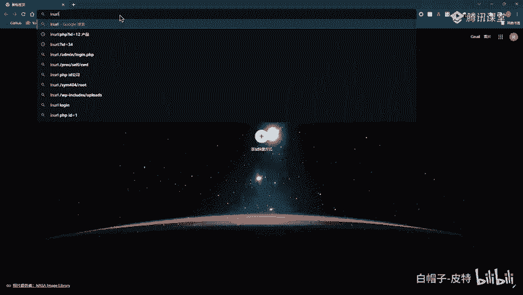
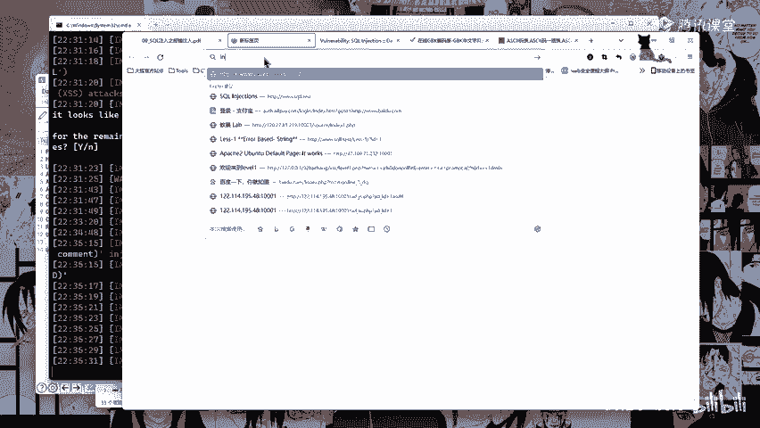

# 2024B站最系统的CTF入门教程！CTF-web,CTF逆向,CTF,misc,CTF-pwn,从基础到赛题实战，手把手带你入门CTF！！ - P43：课后作业 - 白帽子-皮特 - BV1m64y157UX

，然后作业作业作业就是这个7到8题啊，七八题。就是这个2。宽字节注入和绕过过滤。宽字节注入和绕过过滤提交SRRC的时候，提交版本号和数据库名吗？一般你只要有数据库名就可以了，有数据库名就可以。

百度国内的不好用，所以用谷歌啊谷歌。然后预习内容HTM1基础和跨乐脚本攻击基础。谷歌使用百度吗？谷歌呀，谷歌谷歌谷歌这个。这个。Yeah。Yeah。

比如说inURL。

冒号啊问号ID等于一搜一下，哎，你看他这里就会有啊，问号ID等于1。Yeah。翻不明白墙翻不明白墙，那就就百度吧，百度也一样啊，只不过谷歌要科学上网似的，只不过百度它可能因URL问号ID等于一。

就是它的一个过滤呢不是很严格。

呃，这边我到时候找一个，我这边有一个谷歌高级搜索的一个链接啊，等一下课后我找一下，然后。发给大家啊，发发我们群里面。好，然后这就是今天的一个课程内容啊，今天讲的比较多啊，主要是这个原理耽误了一些时间。

好，那么大家有没有什么问题还。这边他还在跑啊，截图工具能分享一下吗？截图工具上次呃呃等一下我我发吧，等一下我发到我们那个微盘里面去啊，发到我们微盘里面去。Yeah。等一下下课，我直接发微盘里。

然后大家呢可以去微盘里面下载。是的是的，就是这个东西就是这个东西啊。就是这个东西。我等一下给大家发一下。Yeah。好的，那我就。Yeah。多去做啊多去做。多去做。多去打靶场，多去打靶场啊。

这个这个DVWA的靶场和我们那个circle i laps的靶场多去打多去打你就懂了。ciircle注入一定要多做啊，多做多做你就明白了。好，那么各位也辛苦了啊，听我唠叨这么久，那我们就下课了啊。

下课了。然后大家也是老规矩啊，有什么问题呢？及时在及时在群里面提问。呃，下节课就讲夸战脚本攻击了。是的，好的，拜拜拜拜，各位也辛苦了。

