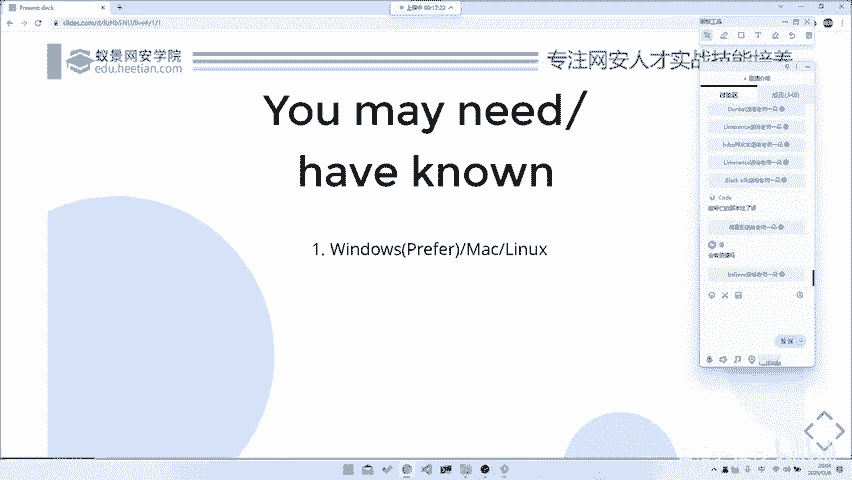
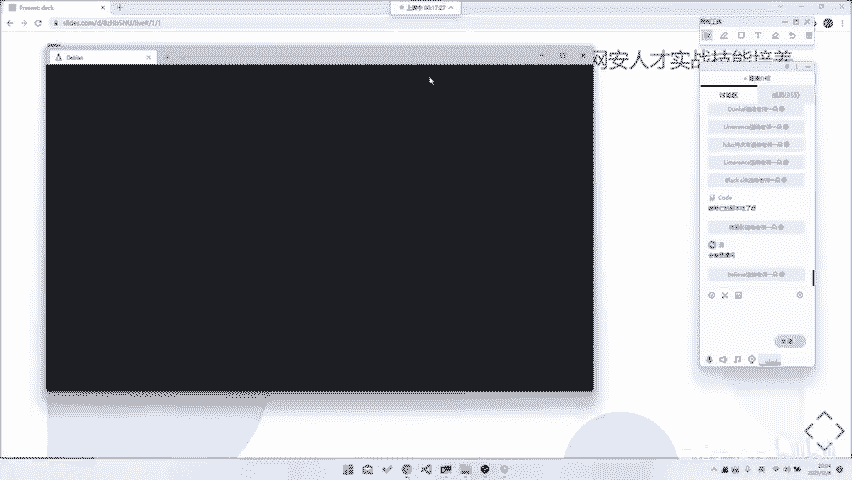
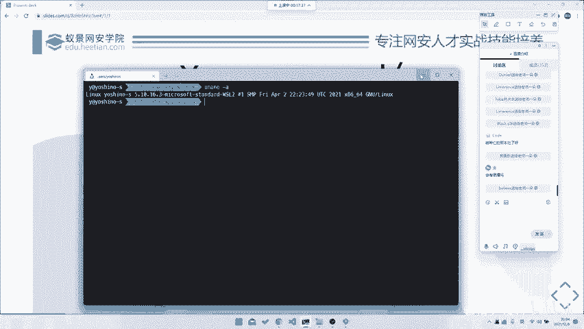
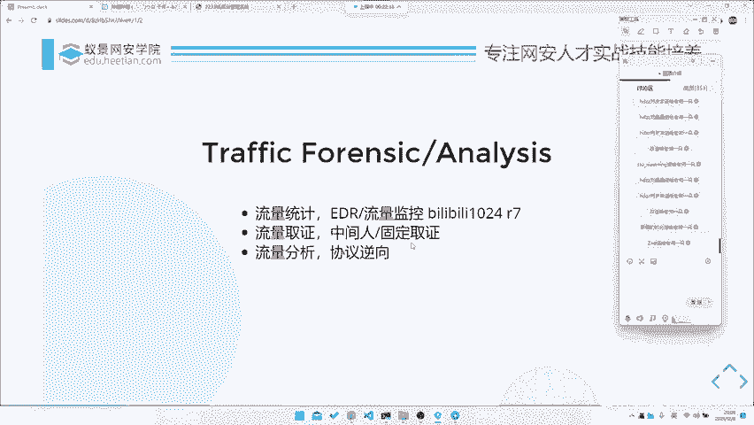

# 2024B站最系统的CTF入门教程！CTF-web,CTF逆向,CTF,misc,CTF-pwn,从基础到赛题实战，手把手带你入门CTF！！ - P44：CTF系列教程视频-misc 流量分析基础认识 - 白帽子-皮特 - BV1m64y157UX

。

首先其实就讲一讲我们这一门这次的课程，因为主要是分成专题，就是流量分析专题嘛，然后的话分成了三节课呃，基础，然后是一个解析，然后最后是一个实战部分。就是首先讲一下我们这个课三个专题，三个部分。

就是主要是今天明天和后天，每天的话大概是45分钟时间。然后话第一节课就是今天的课程，我们主要讲一讲一个基础部分。就是首先是一个工具的介绍，然后是可能是一些流量分析的种类辨析。

然后的话明天的话我们会做一些详细的解析。比如说针对不同协议，如何去给它进行分析啊，或者说不同协议的字段构成啊。当然我们也只是基于一些例题，或者说是去讲一些。呃，比较通用的。

对于针对于如果说是真的要你要去实战去做一些比赛中的题目的话，可能还是会有一定区别的。所以说这个画面有点模糊。呃，所以说这东西其实可能还是需要靠嗯。你最后的话去通过我们这段时间的学习。

理解到他一个做题的精髓。然后的话呢，通过这个精髓的部分去提取这个要点，然后再去最后进行实战。然后呢，最后就是一个最后的实战。实战的话，我会把拿到几道例题，然后给大家做一下分析，然后做一下讲解。

然后包括这些例题可能是比较经典的例题，就是涉及到了一些可能是我们之前有讲到知识点，或者说是它的出题思路比较新颖，或者说就是它的一个出题思路不是很常见，对吧？就是大概是这样一个整体的结构。

今天是我们的基础，明天是解析，后天是实战。然后话呢，我们今天的主要部分就是三个部分，一个是工具介绍，就是讲一讲我们用哪些常用的工具。然后第二个呢就是。呃，种类区分解析就是不同的流量的种类。

比如说我们有网络流量，比如说USB流量，或者说是其他流量。然后还有就是一个基础知识的解析，就是。呃，对于流量分析，你需要去掌握的一些基础知识。呃，因为并不是说是流量分析，你拿来就要可以做的。

可能会需要你有一定的计算机网络基础。比如说或者说是有一些通信协议的基础。这些基础的话，呃，我们这边会稍微讲一讲。当然如果说你要深入学习的话。计算机网络一本书好后的对吧？呃，你要学的话。

其实学起来也挺挺挺久的，所以说要靠你自己去，可能要去课后去做一做。呃，然后我们就继续。就是首先你需要的话，你需要什么东西，就是这个课程，你可能需要准备一些东西嘛。呃，但是因为这个课程是量量分析。

它相对来说是呃对于平台的一个。对于平台的一个依赖不是很高吧。因为我们的工具其实比如说我们最主要的工具玩 sha，或者说是我们用的一些。呃，用的一些比如说脚本工具啊，Tsha，或者说是PRsha之类的。

它可能在全面大家都通用。所以说嗯最好是用windows或者是linux，最好的话是配置一个windows加1个WSL的环境，对吧？呃，这个环境配置的话，我们我们这边就不细讲了，对吧？呃。

这个大家可以自己回去课后，或者说是自己回去呃，当然虚拟机也好，都可以，就是反正只要你是最好是基础是window环境，然后有个lininux虚拟机，或者说你mac的话装有虚拟机也可以，对吧？都是可以的。

然后话呢就是。流量分析就是。就主要讲一讲流量分析。因为我们这个课程本身是CTFm。但其实的话呃到最后我们其实还是要上升到一个最终的一个安网络安全的部分。所以说我们会我们在这里稍微提一提。

就是这个CTFm中这一块流量分析。它最终会上升到或者说它最终的一个发展方向是什么，对吧？就是呃其实流量分析在国内就是我们其实我们之前如果说大家有听过第一节课的话，其实就是最开始那节课。

就是一个m入门介绍的话，其实大家都听过就是。国内的misask分类是很散的，或者说它是一个很乱的，就是很多种类都会放在mask里面。所以它叫杂项嘛。但是国外的话嗯在就是对于这个流量分析的话。

一般来就是放在两个上面，一个就是一个取证，对吧？你对于流量的一个取证，或者说是你对于流量的一个分析，一般来是这两个方向。然后的话就是未来的话，如果说对流量分析，你可以去做什么什么样的进阶发展的。

首先你可以去做这种EDR或者说是这种流量统计流量技术。比如说是呃这道题目就是如果说。之前大家有看过，就是这个比赛的话，就是之前哔哩哔哩ban的1024的那个就是它的最后一道题目。但是这个题目。呃。

不做评价，好吧，no commentment就是。这个题目没有没有正确答案。就是因为他最后答案少给了一个是16个正确答，他其实就15个。然后的话所有能刷到100分的，其实都是通过bug找出来的。

这个我们就不谈了。你看像他这种，他给了大概是当时给了几万条数据吧。然后的话他的目标是让你从几万条数据里面去找到。呃，一些异常的请求。那么其实最后你到了工作中，或者说你去到了流量流量流量分析。

到了最终的一个实践中的运用。其实有有部分就是这样子的就是。用来做这种。啊，就是异常流量检测，比如说去就是看这种攻击流量啊，或者说是看爬虫啊，对吧？都是有可能的。所以说这个是它的一种利用。

就是你去看大量的流量，然后去做这种大规大规模的流量6式分析。是流量取证的，可能是一个方向。第二个方向的话就是取证。取证的话就是。比如说让中间人攻击，或者说是比如说协助警察室办案这种，或者说是这种对吧？

就是。就是你去抓取一些犯罪嫌疑人的一些访问记录，或者说是一些。有网络记录，然后通过他去对犯罪嫌疑人的一些行为举动进行分析，对吧？这也是有可能的。当然最后一种的话就是。逆向协逆向啊，不是。

就是流量分析在其他部分的一个利用，就是一个逆向逆向协议逆向。因为协议的话，当然我们能从直接从。就是应用本身去静态分析它的协议包构成。那当然我们也可以通过中间去抓包，抓完包之后，通过包的辅助。

就是现有包的辅助对它进行一个分析。然后来协助我们对于一个协议的逆向，对吧？这是一个当然也是个最后的方案，然后的话这就是我们m中流量取证这一部分，最终的一个发展方向。

所以说大家可能暂时现阶段我们是去专注于。做一个流量，就是对于某一个流量特定的一个分析，特定在某一个文件包里面。对吧但是的话其实到最后的话，我们是要针对大规模大规模流量，甚至是实时的流量。

就是每一秒几十个G的那种做那种分析。所以说我们现在只是学它的一些技巧，最后的话才有可能上升到一个我们说做所所谓的批量。当然，批量的这种利用的话，在有些题目中也是可以出现的。

比如说我们之前的那个叫最近的1个NECTF。它里面就是有一个测心道，就是他给了一个他给了一个胖极的所有流量。然后让你从这个流量里面，它其实相当于是个盲助一样的。它里面有很多的ci code。

然后呢要你去批量去把ci code提取出来，然后去跑，然后去str获者它的一个最终的flag，对吧？那个题目相对来说比较难。但是的话其实也是印证了就是。

我们最终可能流量分析的发展方向就是去做这种大规模的数据分析，大数据大数据嘛。其实对我们流量分析和大数据还是有一定关系的，这个就是一个流量分析的基础，好吧。

