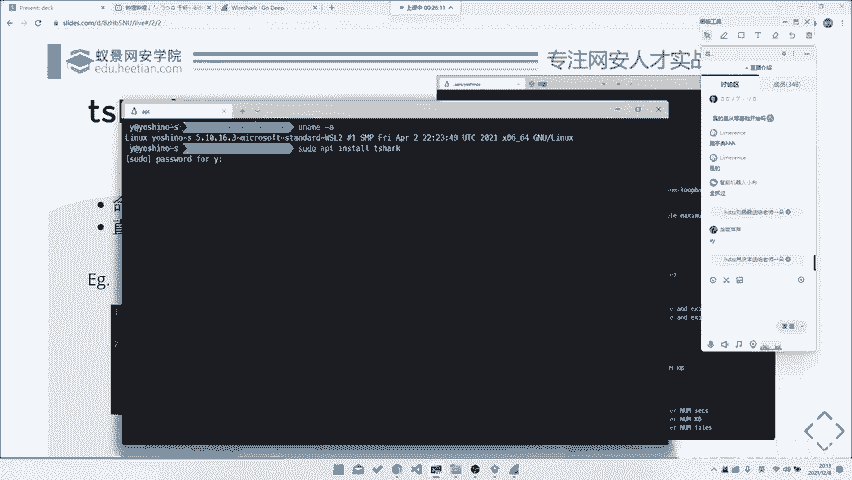
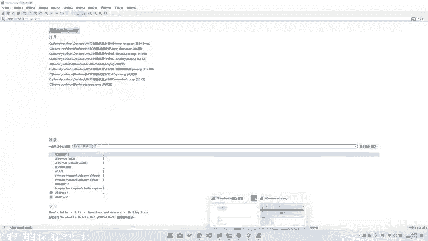
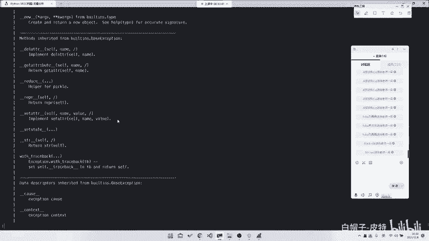
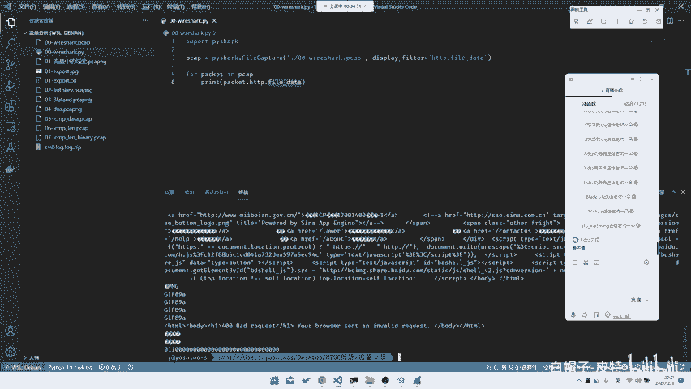
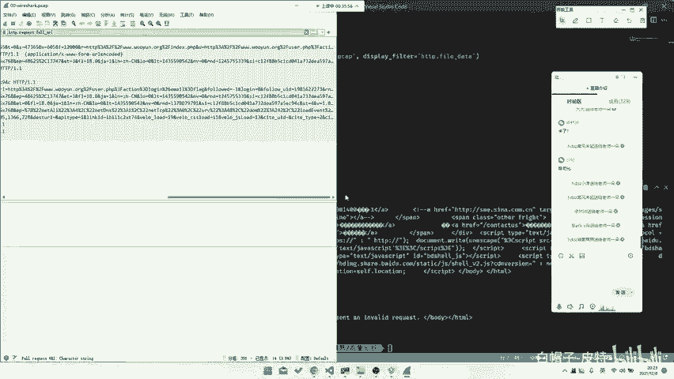
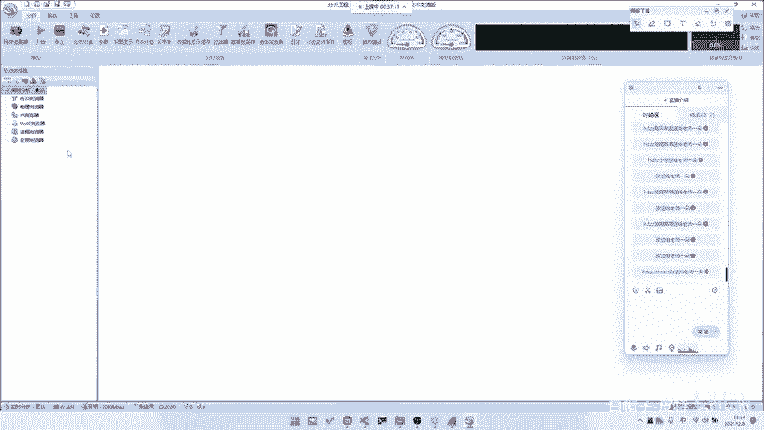

# 2024B站最系统的CTF入门教程！CTF-web,CTF逆向,CTF,misc,CTF-pwn,从基础到赛题实战，手把手带你入门CTF！！ - P45：CTF系列教程视频-misc 流量分析工具篇 - 白帽子-皮特 - BV1m64y157UX

。工具的话，我们首先需要讲一讲我们的流量分析神器玩要shark。就刚刚有有听到了嘛，就是Ylch一把书，对你大部分题目都是可以用Ylsh做出来的。看左边就是Yl check的介绍。呃。

什么is the world foremost and widely used network protocol analyze，对吧？它非常牛逼。😊，他举世闻名，就是他可以分析很多很多种协议。

比如说正常的HTDPTCPIPOSI网络系统模型都可以分析。那再高级一点，比如说它可以分析公共协议，它都可以。比如说是那种model bus啊，SCcom啊，或者说它甚至是做一些iphone C的操作。

它也是可以的。还有包括是可能蓝牙呀，802。11协议书上都可以做分析，包括甚至是有一些。你装了插电之后，它可以装，它可以去监测，它可以去写分析一些USB的协议都是可以的。所以它非常强大。呃。

它可以用来动态抓包呃，比如说我们直接这个东西下载的话，其实都。呃，大家直接去百度百度或者是谷歌搜就可以了。就很简单，就在这里。然后安装的话，你去。找你要的版本，然后去装就行了。

这个安装这部分我们就不讲了，对吧？然后我们就直接讲它这样一个应用。应用的话，其实你还可以去做这些流量包的分析，你也可以去做这种实时的捕货。比如说我这边连的是wifi，那我们直接去抓这个包。

他可以让他所有的所有的协议。你看OSCQOSCQ是什么？OSCQ就是QQ。😊，我看下我的QQ还挂着吗？哦，我的QQ不挂着，它是那个好像是那个叫那个腾讯课堂的协议，也是我的YCQ协议，对吧？

包括这种TCP的，包括是这种，他都可以抓到。所以说它是非常全的。😊，啊，包括我们还可能还能抓到一些。对，都是可以的。比如说MMDSMDDNS这种都是可以的。如果说你去抓了那个叫你去用那个叫修探网卡的话。

他甚至可以直接去抓我们局就是。onL的就是所有的空中的信息，你可以去FTPdaFTP也可以。对哦，我们之后可能会就是最后可能会有甚至会有FTP的这种例题。可以的，甚至你以后装的那种秀探网卡。

它可以直接去抓一个那个叫以太网是去抓那个叫WPA2就是。所有的无线网的包抓了无线网的包之后，你可以去拿来做本地的一些密码包破，对吧？这些都是如果说大家就是如果说大家学校里面会有那种就是。

无线网络安全课的话，一般来其实都是很入门很基础的。第一节课给老师给大家展示的就如何去用。我要 sha去做一些这种流量招包。然后对跑字典这种。那这种我们关掉了，不补活了。然后话呢，当然我们去。呃。

这个Ysha只是一个最基础的工具了，你可它会有一个图形界面，所以说它可能比较我们的它可能比较好用。然后的话对于初学者来说也比较友好。如果说你可能需要去做一些后续的一些分析。

比如说你要去给它导入pyython啊，或者说是去做一些嗯。

或说去对他进行后续的分析，那可能Y下果就不是很。因为它毕竟是重新界面，它没法直接进行个数据导出，或者说数据导出很麻烦嘛。所以说我们后面可能会用到一些T shark t shockrk的话。

它就是一个直接如果说你是deb或者是那个叫。那个叫什么呃，物帮锁的话，你就可以直接问APPinstore就可以了。对吧这个我们就不演示了，这边应该是装好了的。

嗯嗯哎老。对吧装好了的Tshark是什么呢？它就是一个命令行版的w要sh，它也可以在命令行里面抓包，对吧？它也可以在命令行里面通过我们的一些呃一些。

比如说是这种呃指一些这种条件去给它控制它抓出来的是一个什么包，然后做些过滤。比如说我们这边有一个最最最最简单的一个例题。就在这儿。呃，这个例题就是非常简单了，就是。😊。

他的目标是要你去找到一个就找就是找到一个请，就是登录包，登录包的密码就是flag是第一步。那我们最开始我们可以怎么做，就是手翻手动翻一打开Y下课，你直接打开。

这儿就有user action log in。do log in追踪流这个操作的话，大家可以自己去熟悉一下嘛。比如说就是有这种。右急去追踪流，去可以去把这个TCP的HTP追踪出来。对，开裂是自带的。呃。

比如说你也可以直接去在这里去导出对象，去导出个HTTP对象。这些实际操作的话，我们后面用到的话都会都会直接带着讲的。就是基本上你只要操作一遍，跟着我操作一遍，你基本上就可以记住这些操作。

所以说也没有什么嗯不需要特别提什么。或者说你这边还有一些做分析工具，比如说是去分析一个。😊，我可以去做补货，然后去做统啊统计。比如说。就是你他可以去看这种所有统计的数据，这种都是可以看的。

其实蛙下还是很强大。比如说这个包我们去右击追踪流HTTP流。哎，看到看这里它就会有。email等于flag passwordsword等于这个东西。那么这个东西就是我们的flag，对吧？

那么这也就很这就很简单，就你只需要去右击追踪流就可以了。当然这是Y shark的用法，我们也可以直接在这边导出也可以啊。这边我们就不演示了。当然你我们也可以去用T sha去做，那我们T sha怎么做呢？

我们先给它切换到那个目录去。😊，比如说我们这个文件是00Y1sh。PC这个包对吧？然后PC capture。那我们直接去用T shock打开它。杠N2。呃，00档。这个东西过滤过滤是这个这东西就是什么？

这东西就是过滤。这东西过滤呢搁在我们。😡，这个叫做呃YR check里面在这里。😊，其实你刚刚看到我们在这个追踪包的时候。追踪流HTTP流，它已经自动给我们填入了一个过滤，是TCP点stream。

等于EQ2就是什么呢？就是。TCP第二个流是就是我们这个包。那当然我们也可以用其他的过滤了。比如说HTTP它这边是会自动提示的。你看HTTP点它就可以出现它所有的字段。

比如说我们这里要过滤的是所有的有请求URL的字段。只是上这种有get user，或者说是这种post user这种对吧？那我们直接去request for uRI这一条。他就把所有的请求过滤过滤出来了。

那我们再根据题目的意思，我们要去找登录。那我们在这里看有登录action log in do log in。你把它导入导出出来就可以了。那命令行里面也是一样的，你就在这边去填，这个是用来选择文件。呃。

HTTP content flags也可以，但是有的时候flag，比如说它不是铭文。或者说是嗯。或者说是flag或是它被C64，对吧？或所以说这种东西。我们之后会讲到一些解题技巧。

可能就会提到如何去快速的找到flag。但是我们这里就只是先演示一下，在命令行里面的话，就是杠Y是去给它apply一个。我们的一个过滤器，比如说这也就是HTTP的request点 forURI。

然后后面就是用来导出我们的一个包。比如说我们这里去给它导出一个字段。啊，稍等一下啊。比如说我们这里去导出的字段叫做杠。杠什么来着？杠T。Fielt。F Ie， L DS， S。

然后的话他一他要他告诉你要指定一个杠E。杠E的话呢就是我们的一个。比如说我们自己就杠E，然后去给他。其实我们这边直接杠jason就可以了。这杠锥层你会发现他就把整个请求体全部打出来了，对吧？

那我们请求体其实我们不需要这么多，对吧？我们只需要一个这个东西就是。在这里有1个HTTP杠Tfields。field的话，它就是会指定去导出你的一个指定字段。

比如说我们这里去导出1个HTTP点fielda。看还就直接把我们的所有的一个再一个在这句话的命令是什么意思？

就是在所有拥有一个叫做HCDB的quest点 for uRI就是所有的请求字段中去提取出我们的一个fi data，就是在post请求里面就是我们的post这这个body，对吧？所以说就把这条机导出来了。

那我们这条就是正好是我们的密码。所以说你可以用这条命令一键导出也是可以的。那当然了，我们也可以像我们刚刚那样去给它一条一条追踪。如果说一条条追踪的话，我们可以去用什么？我们可以去换一个命。

就是去用这个东西。前面过滤也是一样的对吧？我们就用这个。杠Q是用来给它把原来的输出去掉，杠Z就是去使用某一个流的过滤。比如说我们这边就是过。呃，去follow某个流。

然后是HDDP用HTDP就是在这我们这边有一个。像我们这边的就是追踪流HTTP流ask就是输出模式为ask模式。然后后面就是留就是那个叫stream，就是编号。比如说这是第一个包。这是第二个包。

这是第三个包，对吧？那也是可以一个个导出来的那我们去可以去找在导出来的包里面一个个去找有没有我们的一个登录。吧都是可以的。比如说这是第一个包没有。这是第二个包，我们看一眼。第二包有点大。

因为它在一次TCP连接中，他去发起了好几次新求，在这边有就有了，对吧？也是一样的。所以说这东西其实都是一个嗯。所以这东西其实就是你去不管去用UI也好，UR就是GURZ也好，你去用这种命令行列也好。

都是可以去导出来的。只不过就是看你哪种方式顺手或者说。之后我们就会之后我们后面两天会看到一些例题，就是它不得不用这种方式去导出。然后因为我们要对它进行后续操作嘛。当然这是一种T shark的模式。

就是你去用这种命令行模式去导出。那么再往后的话，我们也可以用第三种方式就是。P完下P完下的话就是一个python的包。呃，这东西因为我们m选m选手嘛。

其实我觉得大家应该都对至少需要对python有一定的基础。呃，PYENBE嗯global我去换一个版本。Thisた。比如说我们这边去import PY shot。

但是PY shock它的1个API写的不是很好看，所以说它有一些东西你可能操作起来没那么直观，可能你还是需要去用T shock配合python去做一些处理。比如还有PY shark。

他就告诉你他就是一个包，它这个包里面有很多东西。比如说我们还是对针对刚刚那个题导出这个题目，我们去写一个这样的脚本，这要本我已经提前写好了啊。

啊，不在这儿，稍等一下。

就是你去用PY下包去写这样一个脚本。在这里。对吧那我们就可以直他去。那我们python的话，我相信在python基础我们这边就不多赘述了。因为如果说还要再讲python基础的话，这边就时间太久了。

浪费时间了。那我们这边python就是他直前去用里面的fi capture去打开了这个文件，然后去displayflatters hTP点fi data。然后对于每个包里面直接输出这东西。

那我们直接跑一下。

他就可以直接把所有东西都输出了，人就会看到这样能串东西，对吧？那这东西其实嗯。就是python基很基础的很基础的一串python而已。呃，这东西的话就是当然你后面不可能会说是直接这么简单了。

就是直接输出来就可以。你可能还是需要去做一些后续的处理分析。所以说python这一块的话，我觉得大家可能还是需要去稍微加强一下。因为呃我们这一整个课程系列其实m课程嘛。

所以说这就是所以说大家可能后面会用到更多的python，你可能后面去做一些嗯。很多问题都会用到pyython，就是很多脚本，包括是同样处理。对，比如说后面会做到一些图片相关的题目，你可能需要。

大量大量大量的去使用python写一些我们的处理脚本。然，在流量里面，python的处理其实相对来说比较简单的还是。呃，所以说这就是一个拍下，当是拍下海还有很多API啊，你直接去help。

或者说你去用这种可以再自动补全的都可以。嗯，但是它自动股权写的不是很好，你看packet它是可以识别出来，然后发HDP发data就识别不了了就是。它的类型写的不是很全。

所以说因为本来python的类型就是跑来pyython的类型的这种lining，它也是一个后续知持的，所以它做的也不是很好，对吧？所以这部分的话我们就呃也只能这样子就是。一般来的话，我们推荐就是开局。

就是使用pifiY sha，你去看一些大体的分析。然后后面的话你再去给它落地到一个T sha，或者说是做一些拍 shark的分析，对吧？是这样子的。

然后的话当然这个是一个工具啊，就是我们的。那个叫Y sha系列。当然除了YR sha我们还是有其他工具的。比如说我们国产的柯莱网络分析系统，但是的话它其实。主要还是专注于一种像我们刚刚说的这种。🎼就是。

他其实也是跟那他也是也是可以抓的嘛。但是的话它其实主要是趋向于我们前面这种做流量统计。就是之前就是比如说有道题目是那什么大数据还是什么的，那道题目就是需要你分析出请求次数最多的1个IP地址。

那你用那个叫我们的一个，或者说是你去找，他要你找一些异常包，你去猫下ck其实也是可以做的。但是就是你可能需要去手动做一些处理啊，或者说过滤啊，看来的话，它是可以去一键帮你去给它做出这种。

就是所有的这种统计都是可以做的。呃，这块的话我们就。呃，就随便看一看吧，就是我们也不做一个。因为主要其实我们大部分题目可能还是主要趋向于。

呃，你看他就这边就可以做出，他可以看到所有的一个。统计流量，包括是所有的都可以，对吧？它它可以实时更新，当然你也可以去用这种回放的也可以。包括是所有的绘画呀，包括都可以。所以说这个是。呃。

克莱的话其实它也是挺好用的，就是在某些情况下，但是我们大部分做题可能还是主要是靠一个。主要是靠一个那个叫什么，主要是靠我们的一个Y下Y下用的比较多。所以说我们最近可就是这两天可能还是主要专注于Y下。

然后的话我们再往后走。