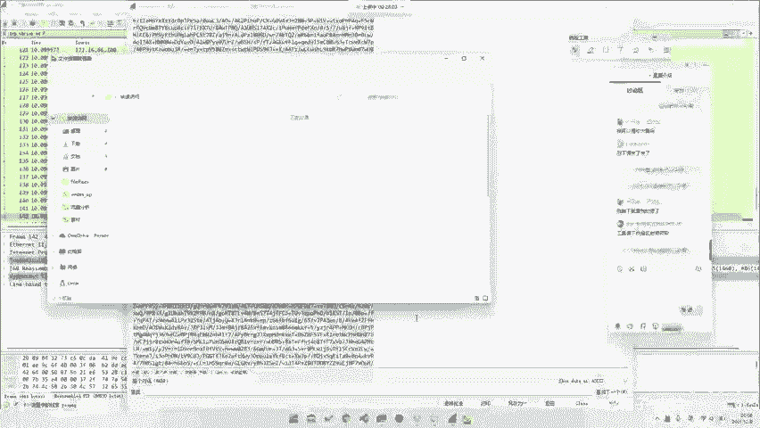
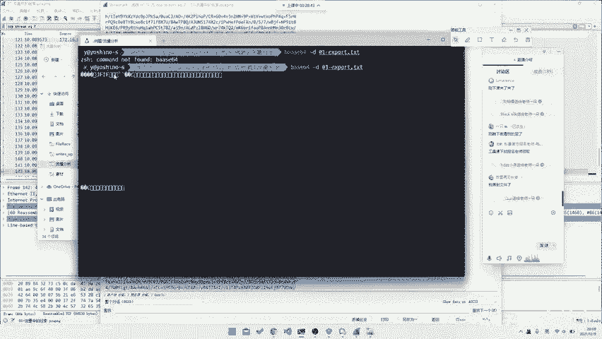

# 2024B站最系统的CTF入门教程！CTF-web,CTF逆向,CTF,misc,CTF-pwn,从基础到赛题实战，手把手带你入门CTF！！ - P47：CTF系列教程视频-misc HTTP流量 请求体中直接有 - 白帽子-皮特 - BV1m64y157UX

。首先是网络流量，网络流量的话，我们主要看它可能会考几个方向，然后以此来哎，这图怎么崩了，稍等一下。一点都不好。哎，他回来了。首先它就首先它可能会涉及到几种类型。我们根据这几种类型去。

我看到赵博任给送给老师一朵花，感谢赵老师，好吧，然后就首先就是我们分为几种类型嘛，首先就是请求提，他会直接有啊，我们就直接掏利提出来，对吧？就是有一句话叫怎么说来的？

talk is cheap show me the code，对吧？😊，所以说我们直接看code就行了。比如说我们。MS08067，我不做我不做渗透，好吧。呃。

渗透的话咱可以去我们我们我们医用网安学院也有渗透的课程。😊，如果说你们想。如果说你们想就是看这个叫渗透的部分的话，也可以去报名我们渗透课程，对吧？😊，然后咱们不讲渗透，咱讲mO。😊，我们不看不看聊天。

不看聊天，到会再说，对吧？然后文件发在微信群里了。呃，微信群可以直接问那个叫上课老师要，对吧？我们直接讲，我们直接讲，我们不耽误时间。就是首先就是这种请求题里面直接有的。比如说这道题，就是你看吧。

它其实就是一个有很多的HTTP请求嘛。然后的话还包括还有当然还会有一些DNS或者说TRSS当然TRSS我们本身是没有一个妙的，所以说我们解不了，包括DNS也有。那我们去看我们的这个叫TCB协议。

就是所有的HTTP协议，对吧？我们直接去追。😊，HTTP流。然后的话就是。你看这里有你随便我们随便追吧。当然我们第一次不一定能追到。比如说我们从一开始追的吧？23这个我都无所谓的对吧？

或者说你也可以直接在这里去导出所的HTTP流都是可以的那首那那不管怎么样，我们不管通过什么途径。😡，对吧你肉肉眼一个个看一下哈，因为这个相对来说比较少，你可以一个个看。

当然你也可以去拿工具去扫什么都可以。你能看到这里面是有一个。这个对吧。有一个分析点PHP那分析点PHP那显然当然当然我们是已经知道要分析这个。

所以我们看到分析点PHP当然你并在你不知道这个叫这个东西到分析点PHP的时候，你也不知道对吧？所以说这也是嗯，反正你就整篇里面找，或者说你直接也可以能找到这样一串b64，那至于至上为什么是b64。

我这就不想解释，就你一看你就知道是b64，你应该作为一个miss时候，你应该拥有的直觉，这叫对吧？那你这东西怎么导出来呢？因为你这东西你当然你就直接复制出来了就行了。

其实我们或者说你可以直接用其他工具啊，或者说是直接这边另存为也可以，那我们这边有一个已经导过的对吧？😊。

我们直接去在这儿。这是包我的贝斯 rose一堆一堆一堆一堆。那我们怎么去给它解码呢？当然你可以去认到sber chief，或者说在线的去解。但是我们这里如果说你所以说我们。

所以说我们这里说是推荐给大家去用1个WCL，因为我们这边就比较方便，就直接facease6杠D。这个叫做export andTXT。哎，打错了，稍等一下。然后它就出来了，虽然它是乱码。

但是我们去看看下它的最头部。😡，你看JFF，那显然这就是个JPG文件了，对吧？那我们直接给他。😊。

重定义到。重新向到1个01点export点JPG。那我们去打开这张JPG照片。叮就有flag对吧？非常非常非常美妙，这道题非常简单，只是5分钟就能呃两分钟就能做出来，对吧？确实是有手就行。😊。

那么这种就是最最最最基础的一分钟，非常棒，就最基础的一个一种就是停留听里面直接有的。那么这种流量的话相对来说会出现，但是出现的不多，对吧？😊。

