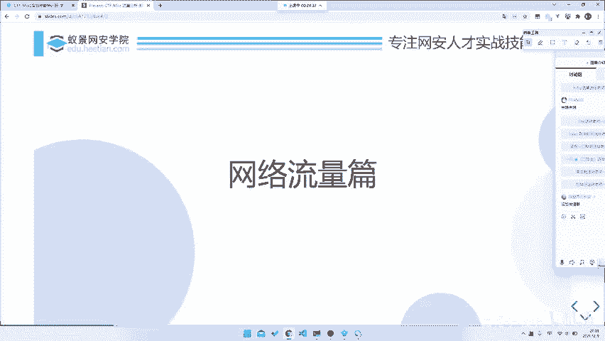

# 2024B站最系统的CTF入门教程！CTF-web,CTF逆向,CTF,misc,CTF-pwn,从基础到赛题实战，手把手带你入门CTF！！ - P48：CTF系列教程视频-misc流量分析 回顾及准备 - 白帽子-皮特 - BV1m64y157UX

。

书接上回我们上我们昨天讲了什么东西？我们昨天讲了一个呃流量分析的基础，包括是工具介绍。然后还有就是流量的种类辨析，对吧？然后的话呢，就是。呃，我们昨天就是只是讲了一下大概的流量类型。

什么网络流量呀、USB流量啊，包括是讲了随便就是稍微提了一题玩要 sha，对吧？这我相信大家已经都应该已经下了玩要 sha了。我们今天上课也会用到。然后因为有几个例题。

然后的话嗯我会同步发在我们的这个叫。我们的那个叫。呃，企业微信就是微信群里面，好吧。然后我们会在企业微信群里面直接发给大家。然后大家如果说感兴趣的话，可以直接跟着做一做，都比较简单嘛，就是。呃。

可以说是有手就行，好吧，就是听完我的课就是有手就行了。所以说接下来还是希望大家跟着一起做一做的。O咱废话不多说，就讲一讲今天的部分。今天的话我们主要讲一讲协议分析和要点提取。😊。

就是我们今天重点放在就是协议本身上面，就是这几种协议，它本身是如何去解析的，或者说我们如何去。看这个协议的内容，我们放在这个上面，而不是说是去放在我们做题技巧上。我们明天会去想就是详细的讲一讲。

就是针对于不同题目怎么入手，或者说是怎么去看它到底怎么做。就是针对解题技巧的分析，释放到明天的。我们今天就只是关注于题目知识点本身，好吧。

是当然当然我们关注知识点本身并不是说是就是以后一定会考这几个知识点，或者说是这几个知识点，就是只有这几个知识点了。都不是的。就是我们看知识点，也只是带大家去看一下如何去看到这个点。

或者说如何去搜索我们这样一个资料。因为其实miss我们昨天说过了，就是我们之前每每多二题，它最重要的其实不是你的说最重要的当然也是积累了。但是你积累在在在你积累不够的情况下，你也是可以做的，怎么做呢？

就是你需要去很好的信息搜集能力。所以说我们今天就去讲一讲协议的分析。😊，然后去看一看步骤是哪几个步骤，然后最后讲一讲几个要点，好吧，然后没加微信群，微信群可以去找那个叫老师，那个叫报名老师要，好吧。

然后今天我们需要的一个准备就是we要。我要下课我要下课的话，我们昨天放发地址了，大家装一装就完事了。你现在来没装的话，现在装装也来得及。😊，然后的话就是一个python。python的话。

因为我们最近这样可能解题会用到一点python，就是说你需要一下python。然后还有的话就是你可能需要一个linux，就是最好是linux。呃，因为有一些脚本或者说是有一些东西。

你最好还是在linux下跑的。所以说这是这三个东西，好吧。然后的话就是就是我们今天需要的。然后的话就进时进入我们的一个例题讲解了，相当于学实不是立题讲解，就是一个知识点分析。

