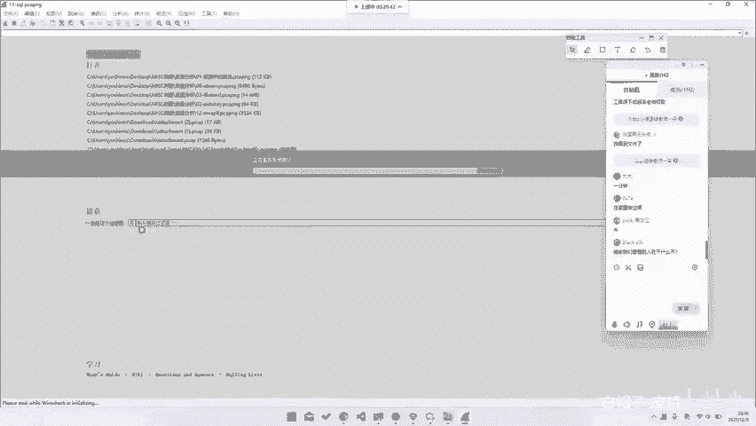
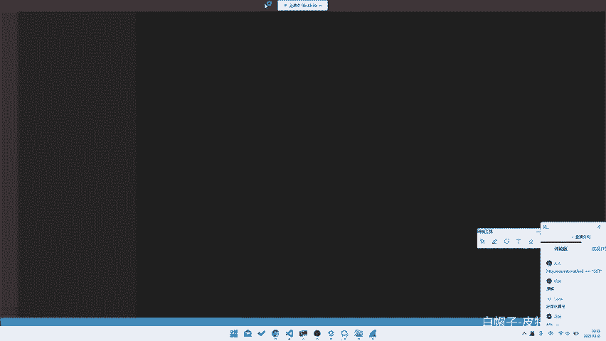
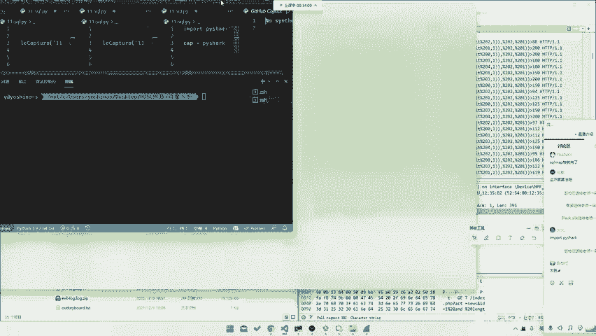
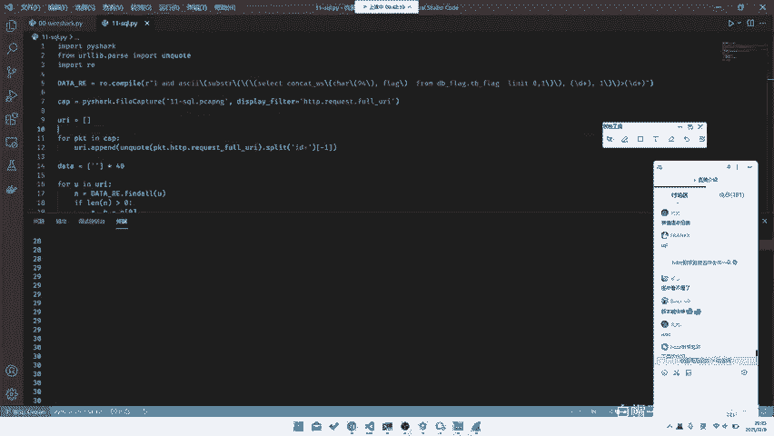

# 2024B站最系统的CTF入门教程！CTF-web,CTF逆向,CTF,misc,CTF-pwn,从基础到赛题实战，手把手带你入门CTF！！ - P49：CTF系列教程视频-misc流量分析 SQL注入 - 白帽子-皮特 - BV1m64y157UX

。如果说我们再更进阶一步，我们可能会出现一些在攻击流量里面的东西。比如说是以CQ注入。那我们这边有一个sqQ入的题目。嗯。我们可以大家一起去看一下。C口去哪儿了？不人。首先他这个包就很大了。

他会有很多很多条。那我们怎么去过滤呢？所以说我们这边就需要我们用这个叫过滤器了。那首先我们肯定是我们随便去观察几条，对吧？又卡了吗？我们随便去观察几条，我们看这边会有一个这样一条，它就已经。

透露出来我们是如何去给他。如何去给他看这个了，对吧？比如说这里index点PP act等于new，并且ID等于什么什么什么。你看这头就显是一个CQ注入的对吧？这个我呃应该做安全。

如果说大家有对安全有一定研究的话，其实呃你肯定还是要知道一点的，或者说没卡就行就是。或者说当然我们这里并不会去说是去转头去讲一讲什么叫CQ注入，对吧？就是。呃，seco注肉这部分如果说大家想去看。

可以去看那个叫seqlslci labci对吧？这我们不讲不讲不讲。😊，然后我们看这样一条，就是在这所有的这种条里面就会有一个CQ注入。那我们这时候就只需要。

这里去给它进行1个HTTP and request等于 forUI。啊进行一个过滤。你就能看到所有的一个请求条请求的这个叫。对，所有的一个请求的一个所有的一个请求的URL。

那么这时候你会发现它其实就是一个盲助啊，就是它为什么是盲助啊，我们这里就不多解释了。就它的原理不管是怎么样，不管你看不看得懂ci口。😡，就是不管你看不看得懂它是什么原，就是他看不看得懂他是什么样子。

那我可以这里告诉你他是什么干什么呢？前面我们不管了，在这里从这里开始。😡，就是它会去用这叫sstr去取到它的这样一就是在这样一个select里面的某一位，对吧？比如这也是1一。那一一之后。

他就会去二分查找。😡，开始有200，就是比如说0到200。那先我比如说是0到200，那我们先比如0到400，他应该是先差200，对吧？再查一再查100再查50，然后给他二分二分查找的话。

我相信大家应该都会，对吧？所以说这样就可以。所以说他你把所有的这种请求条全部提出来。当然这个请求条的话嗯。😊，你会看到就是如何去提它的每一位呢？你看到他这边是在住第一位，然后再住第二位，再住第三位。

再住第四位。那如何去提呢？其实这边是有规律的，就是你去找到每一个Cl注入的最后一条，就是每一位上的最后一条，就是它注成功的那一条。因为注完这条就不再注这一位了。所以说这位就是正好是正确的那个那一位。

对吧？所以说这样的话，我们就可以找到它最终的一个正确flag，那我们这脚本的话，其实。你看看到我这没有时间准备脚本，那我们可以甚至我们可以当场的来写。😊。

这道题目其实也就正好是印证了一种题型，就是。在我们的这这这样一整个做题过程中，就是你可能需要对大量的数据或者说有规律的数据进行一些分析。所以说你就需要去写些脚本。那如何去快速的形成这样一个脚本呢？

那首先我们就首先知道我们需要知道的是他所有的URL对吧？那所以说我们这边先导出它。我们这里随便用什么，我们用拍下吧，拍下稍微好一点，对吧？我们去11-11口点。C口点PY。

然后我们就去给他直接import by sha。CP等于派。这是11杠C口点PCAPPCAP点NG。你可买一把锁。对，这不算是算法。呃，二分查找算是算法吧，对吧？这个对吧？然后我们的。

A display filter。这边是。HTTP then request。😔，ut。QUEST点4UI。😔，然后您稍等一下，这边报多。

然后的话我们再去给他for。哦，比如说URI等于4。嗯PKTNAP URI点 append。我们这时候再print1个URI看看。稍等一下，他这边卡了。I。稍等一下，然后这边其实我们需要找他的一个字段。

哦，这边字段就找到了，对吧？就长在这里，它字段就是这样一个字段。然后的话我们就需要去对每一个提取它的一个。嗯，稍等我们的VScode卡住。

所以说这里我们就需要去对它的每一个这样一个链接去提取它的一个这样一个位数，对吧？所以说我们。首先我们肯定要对它进行URL抵code的，因为它这个是URL编码过的。那我们这边直在这里给他加URL抵扣就行。

我们当然我们这边是需要去split with一，因为我们要把整个账它的这个payload打出来嘛，就是这样一串配load去打出来。所以说我们要先去把它这个。ID对吧？

它ID后面才是我们的这样一个提取的东西。那我们其实直接去给它。Split。通过ID去划分，然后给他取ID后面那一部分对吧？就可以了。对他就把这项东西提取出来了。那我们最后再进行找一个规律，对吧？

比如说我们这边去看。呃，他这样串配套的，我们先复制一个配套的出来看一下。稍亮，这边有点那个叫挡我视线。关掉。哦，我们去复制，随便复制一串出来看一下，找下规律，对吧？对于这条来说。

它所有的都是满足这样一个条件，就是一and ask，然后前面都是一样的，前面都是这样，前面都是一样的。limitlimit01都是一样的，这一位是变的。你看它会从几变到几几变到几几变到几。

然后大于50也是在变的。所以说我们这里需要把这两位提取出来，对吧？那我们去给他先给它设一个data。是用来放我们的数据。然后去给他写这样一个智能表达式。因为我们这里其实智能表达相对来说比较好提嘛。😊。

To import to read。然后的话就是。theta等于瑞点compile。然后这样子，然后的话这一位是我们需要的杠底加。じ。这个也是我们需要的，就是另外一个杠D加对吧？后的话我们去给他。

data等于。😔，For you in you are。呃 dataend data find all。第两个。那我们去看现在德塔长什么样。哦，就是如果说因为因为有的是它是不会出现的。

因为前面几串是那个叫不是住这个的，所以说我们要先去判断一下。对，我们这样子就可以了。嗯。出现一点小问题。哦，想起来了。括号的问题。

因为那个叫CQ里面的那个叫正策表达式里面的括ll是有那个叫有他自己的意思，所以说我们这边选麦上转移。对吧，这个括号是我们自己加的，所以说不需要这个括号是需要转移掉的。就可以了。

你看到就是这边就会看出现所有的一个我们提到的那只要其实我们你看它其实是有规律的，就是15141312对吧？1617181922122324就可以了。

那我们其实只要按照时间顺序把它最后一位提出来放进去就行了。那我们直接data等于比如说我们直接data等于。呃，比如说我们长度看一下它是多少位长度，它是38位长度，那我们就直接长一点。

比如说我们直接给它进行1个39位，其38位就够了。然后呢，我们直接讲，然后N等于。然后是A。哦，我们这边这边就直接加split就行了。AB。B等于这个的第零位。哦，我们还是要那个一下。嗯。

if then n大于0。然后AB等于N。linging。然后dataintA等于B。roprint data对吧？然后我们去跑一下。呃，data我们看一下A，它变成什么东西了。哦，38应该是长度是。

那我们就是40吧。忘记了忘记了。对吧就出来了。那我们其实只要把头上和尾巴这上去掉，然后把中间的这串东西全部转换成ask玛，转成flag就可以了，对吧？那我们直接去给他。If be。我，不需要。对他对。

😔，呃，ORD in B。然后是直接去给他重印起来。嗯 응。but inter in string of E ORD数打错了打错了。这会就出来了。就非常正常，就是这样一个东西。

然后的话其实这道题目其实相对来说，因为其实你如果说在仅在流量方面分析，它就是个纯HTTP的。但是的话，如果说当我们涉及到它的一个真正内部，说要去去拿到flag的时候，就会涉及到一些对于流量的一个处理。

对吧？我们包括我们刚刚那题也是base64拿出来，并不能直接拿到flag。它需要我们通过我们的这样一个呃这样一串给它进行一个。比如说base64解码，然后怎能出来，对吧？就是。脚本能给吗？

脚本之后我会一起给工具，这里没有任何工具啊，就是到现在就是比如说解这道题的时候，我们到现在为止，我们只用了python，其他什么都没有用。就是这样一道题目。就是当然这道题目也是比较简单的。

