# 2024B站最系统的CTF入门教程！CTF-web,CTF逆向,CTF,misc,CTF-pwn,从基础到赛题实战，手把手带你入门CTF！！ - P4：web-使用burp - 白帽子-皮特 - BV1m64y157UX

那么这个b的使用是如何使用的呢？我们来看一下。

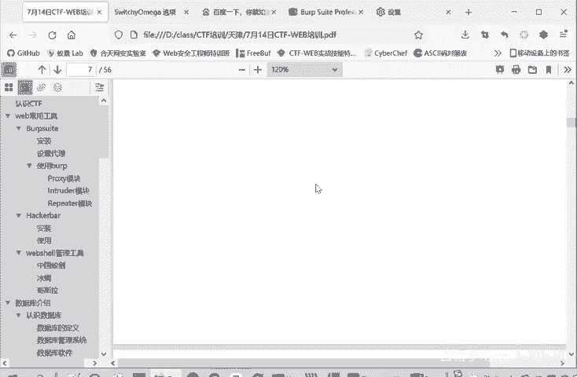

我们这里啊也给大家写了是如何使用的，然后我就不照着这个念了，大家后面可以自己。对着这个看，然后我们今天呢在课堂上就对着这个b它的一个界面，我们过一遍。后面这个文字内容啊。

大家可以对着课件自己再进行一个查看。这是一个dashboard，就是一个面板，是显示bp的一个总体的一个信息。时间呢还有他。的活动抓起了流量什么的，要整体的一些信息。这里是target的。

就是我们抓取的目标。我们刚才访问了一些百度啊。这个一些情况。然后我们这个proxy就是我们最常用的一个模块代理模块。它下面有四部分。一个拦截模块。拦截模块看这里有个incept一个of拦截关闭。

蓝截可以打开。那你再给张小佳解释一下我们这个bb suit的一个工作。

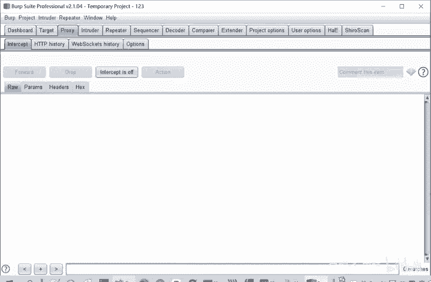

我看一下部。安装的时候是。

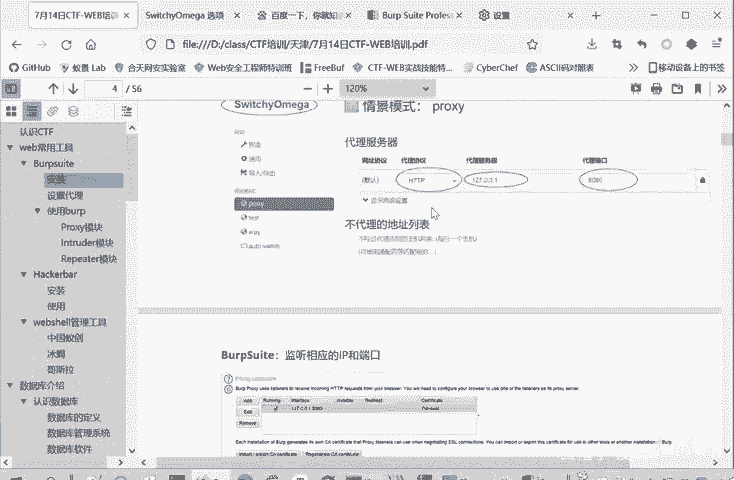

呃。啊，没有把那个它的一个置关系是吧？这个所谓的一个代理呢，就是说我这个浏览器本来说我访问百度，我在百度上。这进行搜索。本来是直接把请求发给百度服务器，然后百度服务器呢响应我的请求。

把响应结果发给浏览器，然后浏览器呢就展现出来，就这个样。但是如果说你进入bb代理之后呢。你这个请求会过半会经过半。你看这是我们刚才发送的请求，我们搜索的是1个CTF这个字段。就是现在因为开启了代理。

在bap上进行监听之后，浏览器就去不直接和服务器进行交流了。他是把他所有的东西都转给。这个bbu再转给这个服务器。相当于说他。b已经插在这个浏览器和服务器中间了。这也是b普，它为什么能够生效？

那插掉它中间啊这些包就能够发送的请求，还有以及浏览器的响应都能够进行一个修改。他现在是一个中间人了。那么这个拦截模块作用就出来了，它既然在浏览器和服务器中间，它就可以选择让浏览器的请求。经过bp一下。

就直接发给你那线，还是说经过bp这的时候停下来。然后再发给你浏览截，这就是拦截不拦截，不拦截，就是流量经过b。从浏览器到b部，直接再到。服务器。它本身不做任何的改变，他只是把这个访问的记过程给记录下来。

如果开启拦截之后呢，我们再看一下。我们就需要再进行一个搜索。大家看是不是这时候就不会出搜索的结果。我们搜索CDF结果不会出，它一直转圈。因为现在这个请求是在bck里面还没有发送到百度服务器。

这不是网速卡，这是请求被b本拦截了。

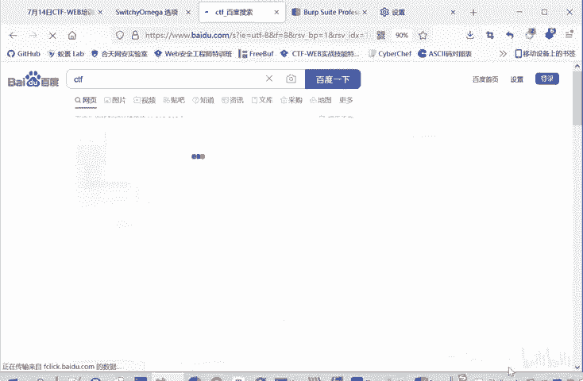

你看这我们访问百度的一个流量。这个时候呢。我们这个使用者就可以选择进行一个修改。可以删除，也可以增加，你可以修改这个请求包的内容。修改完后，你点击forward就是发送。

就是把这个请求包发送到服务器当中去。当然他又会请求。因为你完成一次搜索，需要多次请求百度服写，优惠请节又可以修改。你也可以选择把这个包不发送给百度服务器，把d掉。这个个标作为拦截角d掉也可以。

你也可以把这个包点击action给发送到什么repeer，后面的retroder啊，repeer这些模块。让这些模块来进行应用。这是我们代理这个拦截模块的一个四个功能。

但是不管你拦截是on还是of这个浏览器的记录里面都会有这个访问的记录。都可以在这里面再查看包，再进行分析。

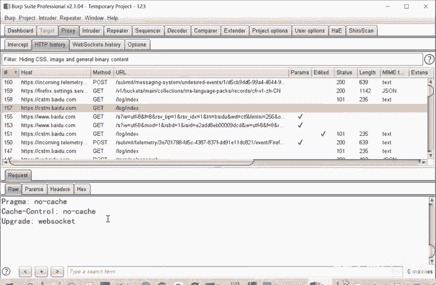

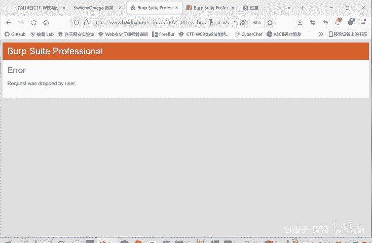

把这个就。完了。所以这是一个proxy模块的一个作用。主要是一个拦截，还有查看这HTP historyory。

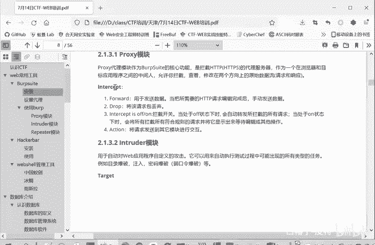

H D B history。虽然叫HTP黑色的，但是HTPS的包也是有的，都是有的。这些百度的这些包都是有的。这个web socket的 historyory这个不用管，一般用的很少。

这个option就是我们刚才监听的设置一个设置的地方。这是第一个模块。

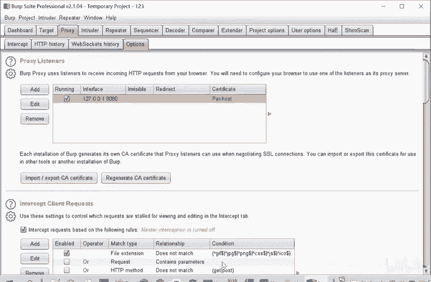

然后第二个重要的模块就是这个引出的模块，它是一个爆破模块。

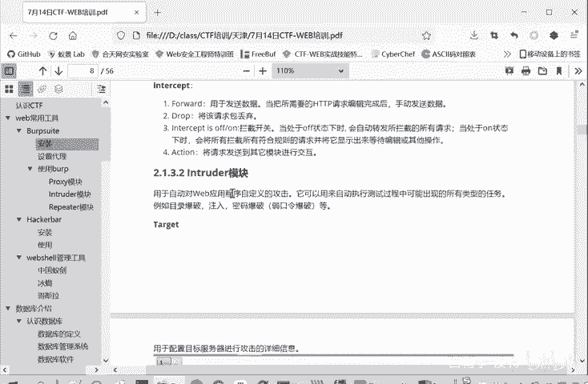

爆破模块我们点击一下怎么用呢？包括模化下面有4个模块。第一个模块，他给的目标。所谓爆破就是。它是入口令呢，是验证码这些。他反复的尝试这些。密码。用看他是否存在绕口令。或者看这个验证码是否能够。被爆破。

被简单的数字啊字母组合爆破。这样的一个功能。那第一个模块呢，他给的目标，你要爆破的。是IP地址是什么？也包括哪个哪个设备吧，或哪个服务，它的IP地址和端口是什么？这是目标标position。

还这些所谓爆破呢就是。啊，比如说这里啊给大家。

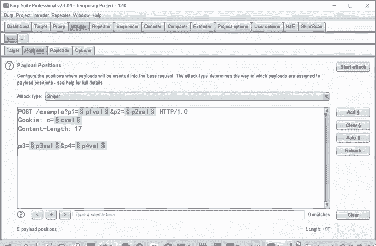

演是一个爆破的一个过程。🎼我们打开这个PCP studyPCP study大家也可以装一下，后面给大家讲一下怎么装。

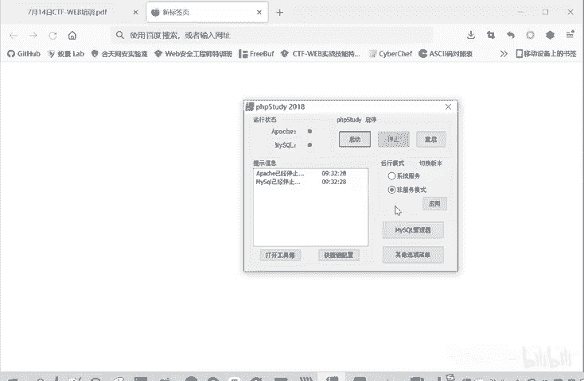

用这个PHP study。

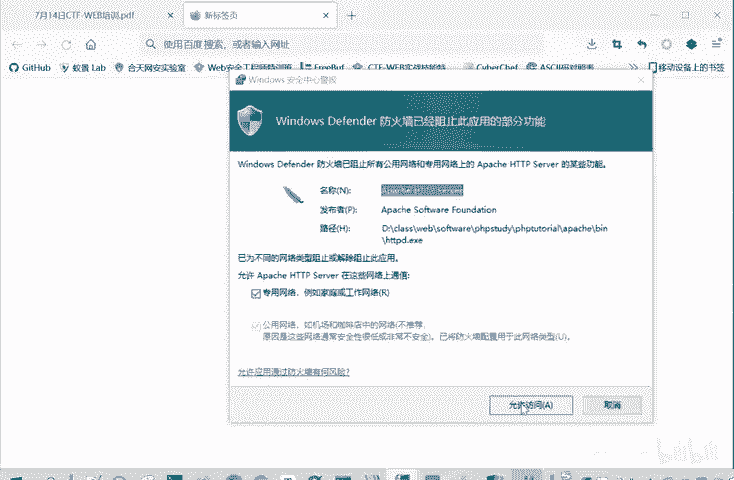

那么P study现在这两个域点就是已经启动成功了。我们本地呢就搭建了一个快部服务器。我们打开这个DVWA这个靶场。然后进行跟录。

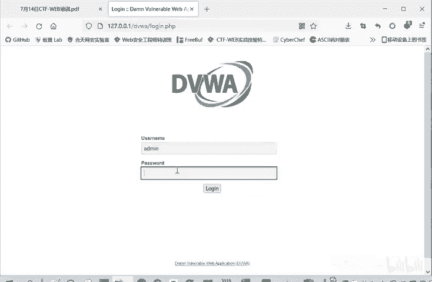

分斗之它这有个安全等级 impossiblepos，就是这本身是一个漏洞靶场。它里面很多漏洞，暴力破解命令执行CSIF文件，包含文件上传等等的。这里面的安全等级impposible就是。

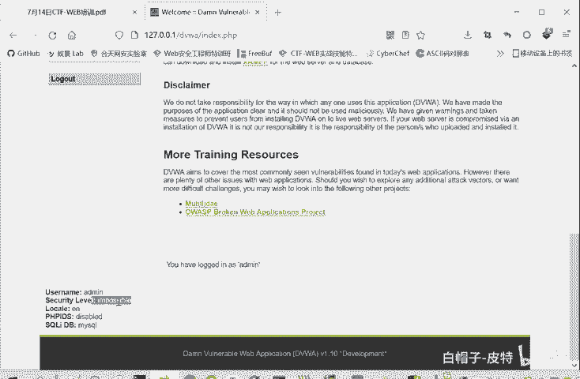

不喜欢那洞。我们把它调成安全等级动，因为我们这里主要是演示一下啊啊，这里安全等级已经改过来了。然后我们叫这报警破解这个模块。我们随便输入一个用户名123。他告诉我们用户名肯定是不正确的。

因为正确的用户名是。With me。肯定是pass word。很正确的说。就放欢迎来到这里，这是一个进行口令爆破的一个测试。那我们怎么进行口令爆破呢？如果说我们不知道正确口令的情况下。

我们易输于addmin。那密码呢就是root啊，做一个测试。然后我们。打开这个代理啊，我们重新输入一下，打开这个代理。我们可以点击一个登录，他会说这个口令不正确。

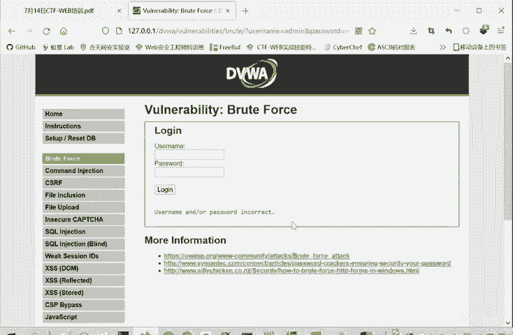

然后我们就在b里面啊，在这个。代你模块1个HPTTP historyory，你看这要求点一点压，是我们刚才抓的包。把我们刚才这个访问包找到，这就是我们刚才的验证猜测这个用户名口令的一个验证包。

这是我们输入的用户名，输入的口令。其他的世界包料头啊这些内容，我们这个先不用管，这个时候呢我们就可以把它发送到引出的模块。这么发送有什么好处？这样这个IP端口就他给的帮我们设置好了，它会自动提取。这个。

😊，所谓发送的请求。所谓进行爆密码这个爆破呢，这是我希望这个请求发送很多次。每次呢这个密码处是不同的值，这次是root啊，下次是个root123。进行各种各样的尝试。这就是我这应个报破的一个目的。

那么怎么实现这个目的呢？我们就通过刚才把这个代理里面，把这个包发送到已出的模块。然后这个请求包就完整的过来了。我们只需要在我们希望变的内容当中把它作为变量，也就加上这个。前后加上这个特殊符号。

你刚开始第一次打开这里的时候，bp呢会给你自动添加一些这个变量符号。就是它认为这些是要变的。我们可以点击这car，把它自动添加的全部去除掉。然后我们自己想加的就是这一个这一部分。这一部分是想变的内容。

我们点击ad。那么这个攻击模式呢，这里有个attack type，有4种模式，sniper。这个工程锤，这个草叉还有。起出炸弹这四个模式。snipper就是它只有个单点嘛，就是一个口令结。

然后不断的替换这个root123的。做root123的一个计划，然后不断的趋试。这这就是class star boom，就是一个行书炸弹。

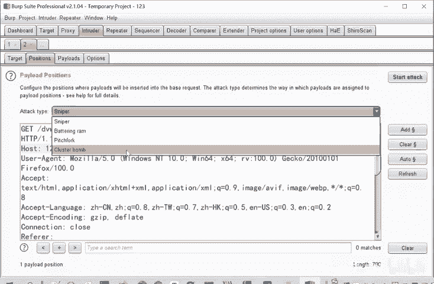

他就是一个爆破，这个意思。嗯，我们这个课件中写的是更清楚的。四种模式snenipper狙击手模式。这工程锤模式。他就是要有。多个位置。然后每个位置呢。都是放着同样的配路的。比如我们这里就是是同样的口令。

这草茶模式呢？就是多个位置，每个位置对应一个字典，然后依次进行测试。这个几肉炸弹的位置就是多个位置，每个变量对应一个字典交叉包括，就是每第一个字典里面的第一个词，要和第二个字典里面所有词进进行组合。

每次都是这样。就是它四种攻击模式。那么我们在这里面呢。

因为它只有一个变量变，我们就选这种snipper狙击手的模式。然后在第三个板块，我们设置pay。pay node这里可以导入，大家可以从get hub上下载一些字典来进行导入。也可以自己手动添加。

这都是我们要测试的一些。密码。你可以从g app上下载字典，直接点击导入就可以了。那这样添加成功之后，这去后面有些option。这些一些进程啊这些设置。按默认的就行了。然后你把这个字典名设置好了之后呢。

字典的内容设置好之后，点击这里的start attack开始攻击。他就会进行一个爆破。那我们在正常情况下会有几千几万个爆破，因为这里点是为了速度快一点，就只搞4个字典进行爆光。

那我们怎么知道哪个是正确的？我们首先我们可以进行一个筛选，比如states进行一个筛选。那么他都是200，这你就看不出来。后面认识呢我们也可以进行筛选。大家发现。哎，有一个是4604，其他都是4650。

那么这个最特殊的一个就很可能是正确。这些都是重复的那肯定都是错误的，不可能。一个用户同时有多个密码。这个n词不一样的，说明它反输入这个密码进行验证的时候，就是相那种发送的情趣包是这个样子。

user name a passwordword等 passwordword，它的响应是不一样的。所以它可能是正确的，然后把这一个拿在我们爆括的网站中进行。

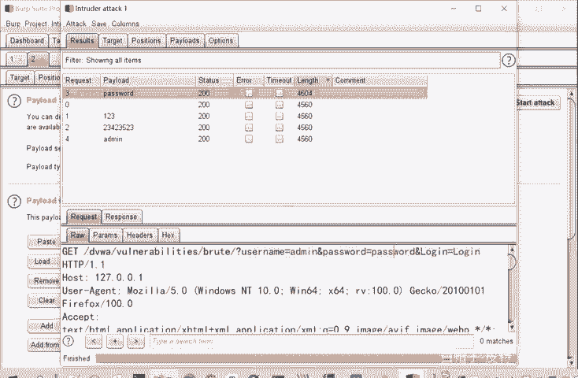

验证，因为这也包括出了个别的。长度不一样的，所以可以进行手工验证。然后就能知道它是不是一个正确的考粒。这是使用bb two进行一个口令爆破的一个方法。

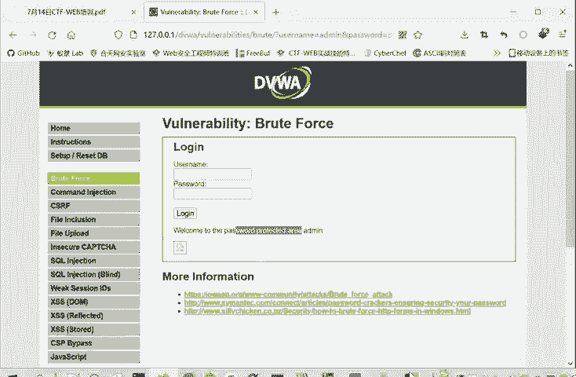

这也是我们引出的这个模块。他的使用方法。他可以爆破口令也可以爆破。这个验证码也可以在circle芒助中进行一个爆破。我们后面讲scle忙住的时候，也会用到这个爆破模块。这是第二个模块。

然后我们这里的包呢还不仅它能够发送到in出的模块，还能发送到repeer模块。有P台模块什么作用？

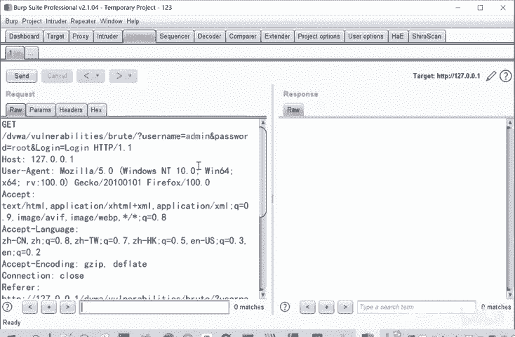

我把这个包。在这里我点击一个send，它就发送了，相当于浏览器进行了一次请求。就相当于我们在这个。页面中啊。点加一么个把用户要肯定输入。为什么在这个reP的模块呢？因为这里进行修改非常方便。

如果说我这里。这里进行一个修改。随便输入一个什么，我再发送就行了。或者说我不修改这里的啊密密码是什么？我修改这个host，修改user agentent。因为大家知道后面在做CTF的题的时候，有的。

题目它会限制你访问的UerAT呢是什么？那我在这里进行一个修改就可以了。然后直接点击发送开始什么结果。如果说发生的结果不是我所想要的一个结果的话，那我可以在这里继续修改，它非常方便。

所以它这个重放叫一个repeater一个模块。这是我们最常用的三个模块，详细给大家讲了。

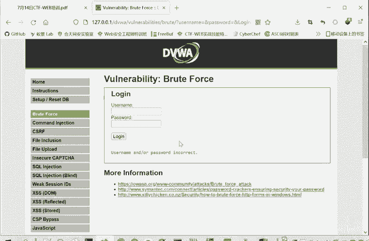

然后其他的模块呢。其实也都有用。这个抵口端是一个解码。各种编码格式的一个解码的模块也能用也也是有用的。

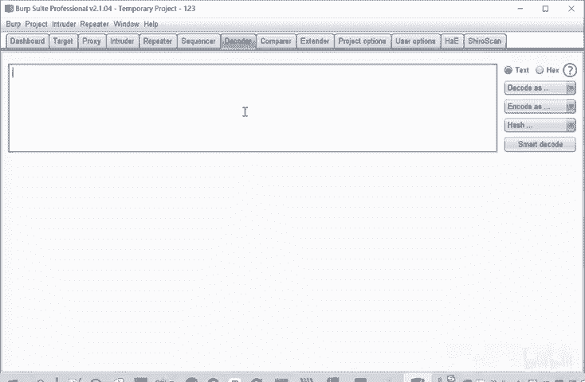

等等就不给大家详述了，最常用的就是这三个模块。proxy in的repeater这三个模块。这是bb suit的一个。安装和使用。

