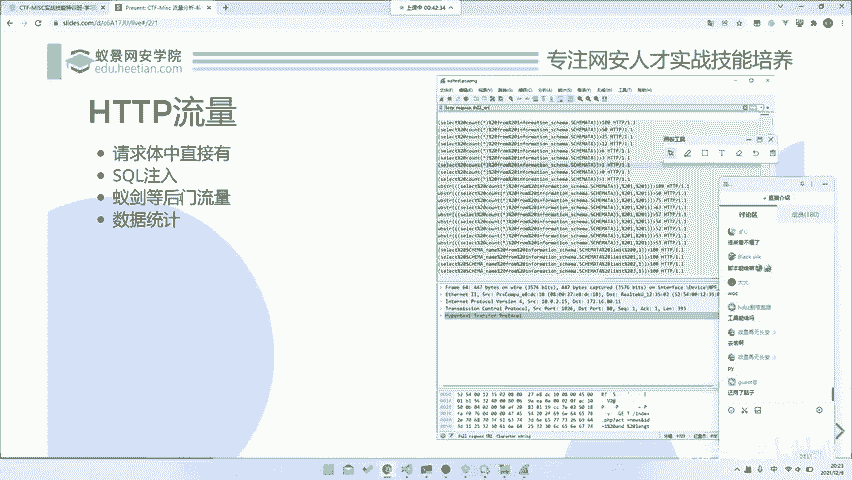
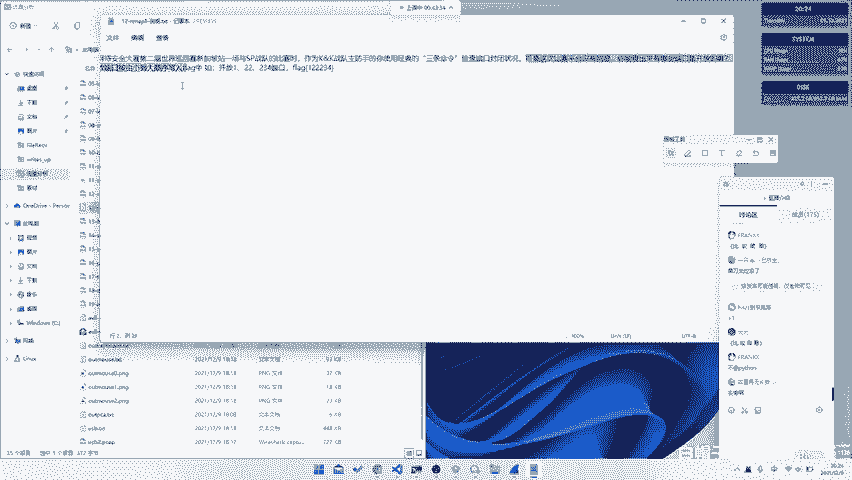
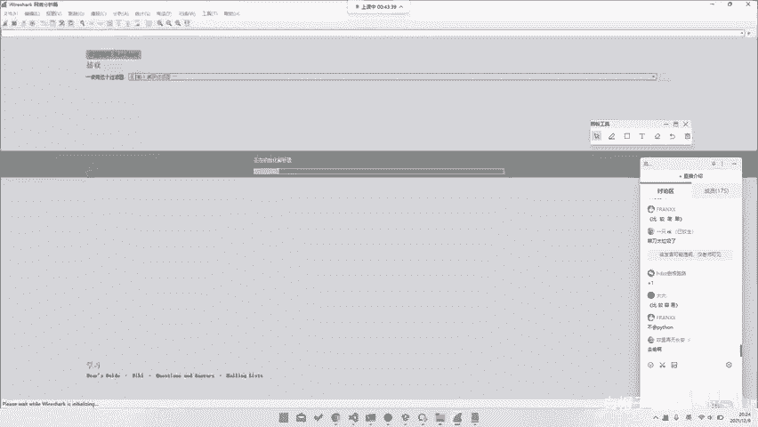
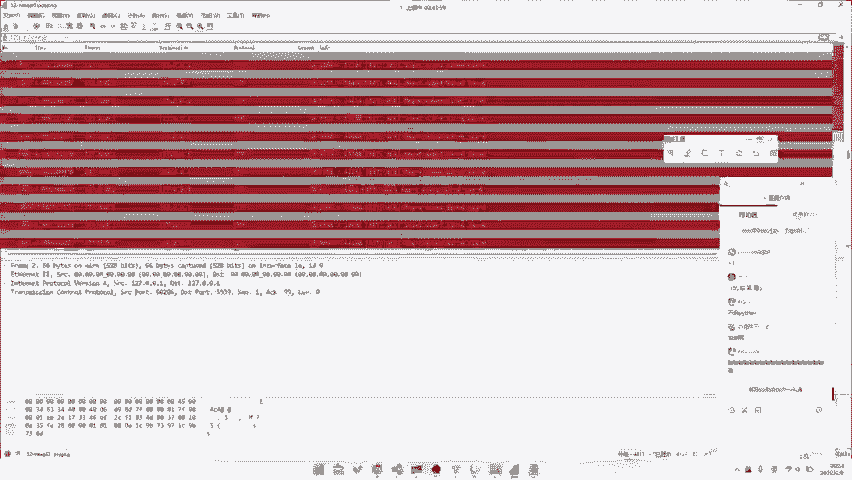
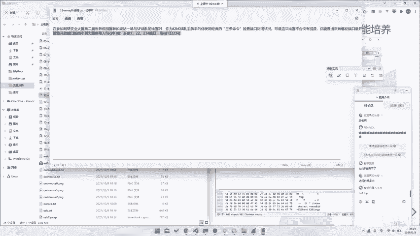

# 2024B站最系统的CTF入门教程！CTF-web,CTF逆向,CTF,misc,CTF-pwn,从基础到赛题实战，手把手带你入门CTF！！ - P50：CTF系列教程视频-misc流量分析 后门流量 数据分析 - 白帽子-皮特 - BV1m64y157UX

。

呃，那我们再往后走的话就是。比如说还有已建的。呃，以建的话，我们今天会留一个小作业给大家，然后会在明天上课前，就是如果说大家想的话，就是明天上课前把它做好，对吧？然后我们明天明天早上明天早上发给大家。

就是在微信群里面。然后大家然后如果说就是明天课前做一做。然后我们课程会稍微讲一讲。包括已建的后门流量，然后包括这种数据统计，数据统计的话，其实我们跟我们昨天讲的一个那个是一样的。

或者说我们再去看这样一道题目，就是。

哦。在这儿。菜刀菜刀菜刀也很简单，现在不用菜刀了，基本上已经菜现在基本上如果说做这这种呃后门分析的话，基本上用的是一件或者说是冰烯，是这样子的。然后你看这个就是这样是这道题目。

就是在参加第二网络安全大赛。第二届世界巡回在新加坡站与SP战队的比赛时，作为KK战队的主房手机使用经典的3条命令检查端口状态。😊，虽然这这个我们这个我们都知这个我们都知道啊。就是N mapap嘛，对吧？

然后或者说是可惜平台没有回信，您的卡很档期当口是开放的嘛，那显然很简单啊就是。

看我们这样一个里面有多少个端口。

比如说我们去看这样一个。呃，其实原理就是我们去看127的0。0。1上有哪几个端口开着嘛，就是。然后你一个个去翻就行了。当然你如果说。就是这一段看到没？就是所有的这一段里面所有有。所有有返回的，你去。

因为这就是一个那个叫什么，这就是一个那个叫n map的一个流量记录。

你所有找到所有他的一个能返回的记录就行了。所以说这东西就是这里我们就不多赘述了。你看就是这条，比如说。像这种631对吧？就可以了。那所以说你去找这样所有这样的流量就行了。你肉眼翻也可以。

你去写我们刚刚所说的过滤也可以。那至于这里的过滤怎么写，对吧？我们这边留一个小问题给大家这道题目，如果说你要去做过滤的话，你会怎么样写这个过滤器，这个是一个小问题，留给大家课后可以去思考一下。

因为过滤器的文档，网上Y要下课都有，对吧？啊，我们这边不可能说是对着文档去一点点讲，这个就没什么意义了。所以说可能需要叫大家自己去研究研究。😊，这也是。哦，TCP对吧？那当然就这是就是知道题。

所以说最对于最简单最简单最简单的这种HDEP纯HTGP的流量。😊。

我们也可以玩出这么多的花。所以说呃当然这只是很小很小的一部分了。那如果说我们再往后走的话，我们还会有什么？😊。

