# 2024B站最系统的CTF入门教程！CTF-web,CTF逆向,CTF,misc,CTF-pwn,从基础到赛题实战，手把手带你入门CTF！！ - P51：CTF系列教程视频-misc流量分析FTP、ICMP流量 - 白帽子-皮特 - BV1m64y157UX

。这种FTP或者说是ICMP这种。当然我们要注意的问题就是呃我们去看一眼。比如说我们刚刚这样我们去分比对比两个。比如说这样一个和我们的刚刚这个ci口 vehicle口cil C口。哦，不开错了。

开成拍了。它其实对于我们昨天讲的东西，它其实是在两个层面上的。这个是在TCP上面跑的HCDP。而这些东西它是在纯TCP上跑的一个纯数据，对吧？呃，SCMP不只是聘包。

只是说聘包是跑在SCMP这个协议上的。当然如果说我们再去看我们的这种pin。ICNP的这种。我们去看一个ICMP。在这儿。对吧当然这个包它里面也会有其他的包，就是会出现这种单纯的。

就是全靠全是这种目标包的。当然也会有这种就是很杂乱的。有什么TCP的TRSS的呀啊，包括是各种各样的，然后是包括什么还有什么UDP的这些都有。那比如说这道题目，它告诉你是SCMP了。

那其实我们过滤就是SMP。忘记关大还锁定了。ICMP。那SCMP包你是跑在什么上面的？你可以看到它是跑在IP上面的对吧？它它跟TCP是它它跟TCP不样，它跟TCP是同一层的。😡。

那么对于这个SCMP包的话，我们要去看，就是比如说这个包我们怎么去看我们的一个flag在哪里。那比如说这样一条，它告诉你是no no response found的，而且它里面的它不没没带任何数据。

你可以看到data4848全是00000没有任何用处。但是这一条里面就就带了。你看这样的它的data。他对他是什么？他对他是张宇川贝斯64。你再往后走的话，这样也是没有。然后这个也是base64。

这个没有，这个是 base64，这个没有这是 base64。那显然我们目标就是导出这样的一个 base64。当然这个是聘了。当然SMP上其实可以保其他协议，或者说是。😊。

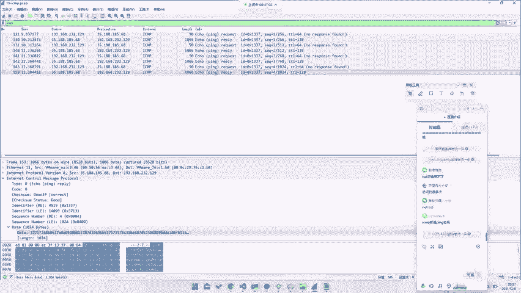

啊，比如说我们这边去给它导出这样一种这样1个SCNP的一个data。那我们这里去去用，比如说我们这里就直接去用T shock吧。

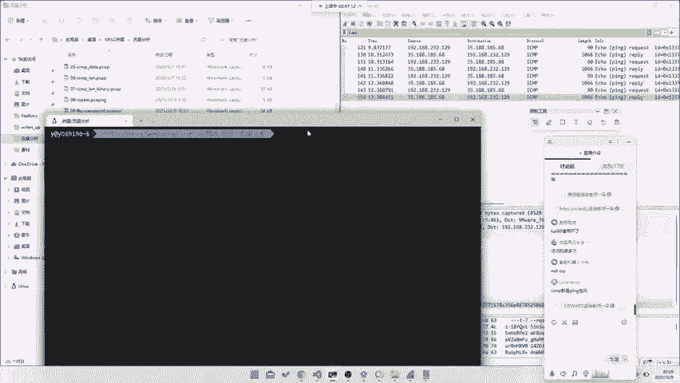

杠N2。诶。19。19杠ICNP对吧？然后就给他杠Y。ICMP点。比如说点data。😔，呃，点什么来着，我看一下啊。

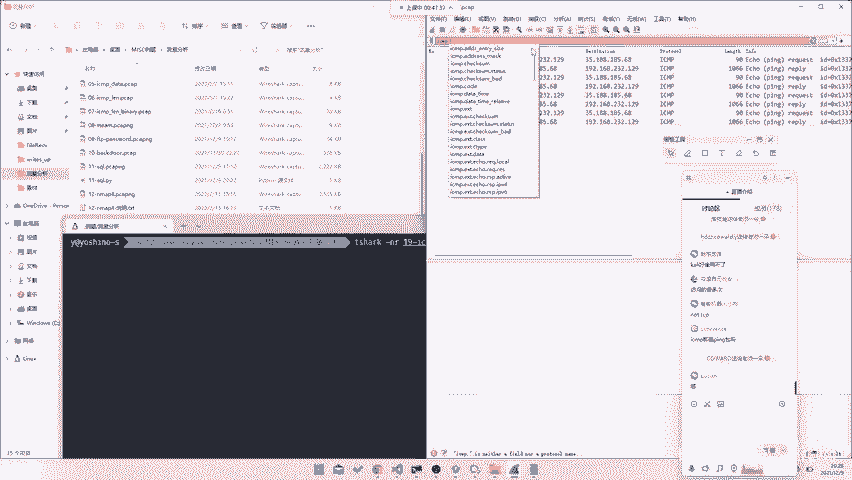

A2K杠杠NRAA杠N杠NR。呃，05。上一条。对。那我们直接去1杠杠Y。ICMP点response，因为他这是resply，reply他也没有response to，所以说你这里也不能用respon。

A点 reply。Response。没有的。所以说你这边要把所有的reply包过滤出来。reply包的话，你要去看这里对吧？type等于0，就SNP点type。

等于等于0就可以过滤到所有过滤出来所有的这种包，这种包里面就是贝思64。那我们就杠诉ICMPrely等于等于0。然后去杠T。呃，杠T，然后导出字段FIELDS fields。

然后杠E去导出我们的data点data。哦，拍错了，我们怎么开到十一上去了？这是哪个帮我看一下19。呃，哎，怎么拍成三去了？我说为什么？命令打错了。Could not杠 N2。杠TFI啊，打错拼错了。

他就把所有的我们的base64的这样一串东西打出来了。😊，我们直接去给他返，就是他这个KX编码嘛，那我们去给他返一下XX解码掉。呃，叫做什么来着？呃，叫做叉叉D杠N杠2。呃，杠什么来着？杠D杠2。嗯。

忘忘了查查地的那个叫叫什么的。啊，看到刚R钢P。杠B杠2，然后就能把每一段打出来，然后我们再去给它备6次解码。告啲。就拿到我们这样一层东西。我们去strs出来一下，看一下它看上什么东西。

它就是一个flag点PNG，看到没有？那我们去给它导出。导出到我们任意一个文件里面去。比如说我们这边去19点export19export。但我们不知道是什么文件了，我们先搞出来再说。🎼fi一下。

他告诉你他是Gzip的那我们直接去给他MV到19点export。点 gZ。然后是A。Egy export on。然后是Gzip。

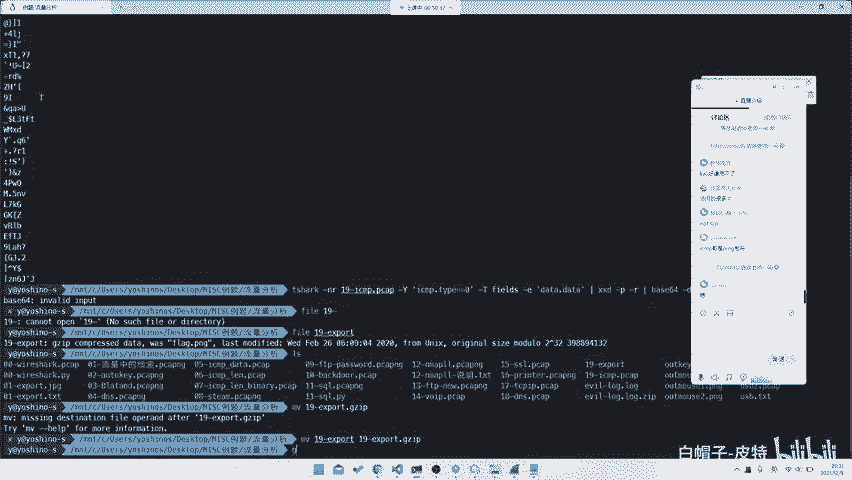

然后去杠地compress，然后依旧export。onmost fix are光依旧。依旧。😔，点橘子就完事了。Unexpected anop。我们之后再说吧，因为这个好像没导全。

之后的话我们会单独扔一个脚本出来。因为我们写的，因为我现在手头嗯好像没有现成的脚本，我们最后会把这道题脚本导出来，对吧？那这样的话我们就能够导出这样一串被似者死编码，然后去给他读这样一个文件。

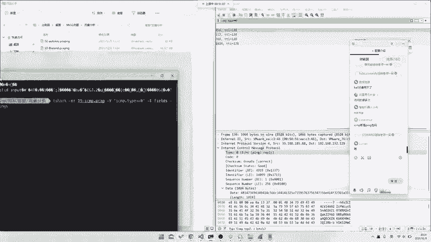

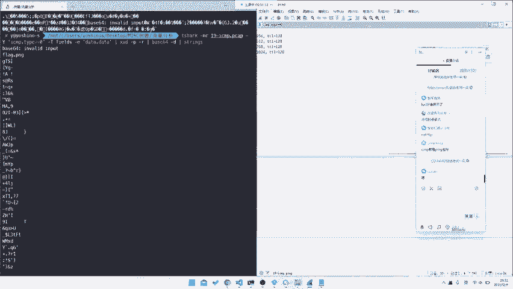

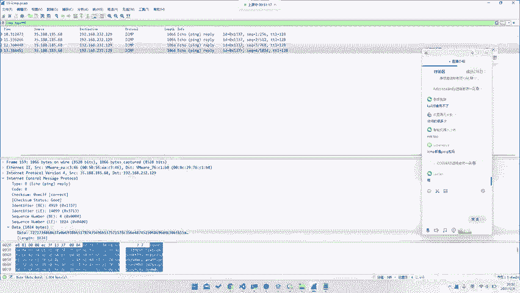

啊，这就是这样一个题。当然你后面如果说。呃，SNP的话，其实我们另外一个题目在这里。呃，都是差不多的。这样的话也是一样。

就是你看所有的ICMP里面的response这个题目跟刚刚那个题目思路其实有一定区别的。刚刚那个题目是整个response都是。那我们这个题目的话，就是它response里面它有一堆response。

你看这里它有一个response，它有两个response，那我们去先所有过滤出所有的respon。ICMP点RESP2。那至于我们为什么能看到这识re，就是我们为什么要过滤这样一个resse to呢？

因为request和response里面，它理论上来说应该是它的值是一样的。当然刚刚那个不一样，是因为他特意设计过，所以这也就是一样。那我们只要去response就可以了。

那我们去看它每个文件里面有什么特征。你看从第一个开始。看看下面这场东西。就我们的data对吧？它每位有什么区别？你看到它只有。😡，当然前面的创烂码我们不管它呢每次变化有一个稳定变化。

就是这样一位是在这里的这一位A后面这位不知道大家看不看得清楚。那如果说每次变的都是这一位的话，那我们每次去给他把这位提取出来，就可以拿到我们的这样一个flag，也许能拿到flag。

你看最后一位正好是后好，所以说确实是的。那我们这里的话其实就只需要去。我们这里设至我们不需要任何工具，我们直接命令好就可以了。😊，对吧。呃，比如说我们这边去给他低下课。杠N2SCMP就张小明。

这个我们我之前试过，所以说可以，然后就是05。调级命令原理是什么？首先第一步它是过滤出来我们的这个。换一条data对吧？把所有的数据过滤出来。然后的话呢再去通过我们的这个叫做AW，就是AWK。

WK是个命令好，用来处理文字的工具。print F。就是print f，就是啊跟python里面就是那个叫跟那个叫C里面的print F是一样的，百分号C就是输出文字，对吧？然后的话就是这样一个东西。

然后我们再去给它sub string。然后是我们的输入。好第几位的话，我们这里的话其实就是数一数他的第几位，就是这一位在第几位。我忘记是第几位了，所以说我们这边就直接去用原来就行了。Okay。

看到这边我们之前是测试过了，是我们的第17位到17位，然后往后的两位。那我们的话我们把它输出出来。就会把每次的这两位输出出来，对吧？你可以去对比一下，就是输出的这两位。

然后我们再把我们这串东西给它叉叉地掉，或者说你可以去TR杠D也可以，就是把它那个叫换行去掉。😊，把它变成一行，然后再去给它插插D嗯。一打。

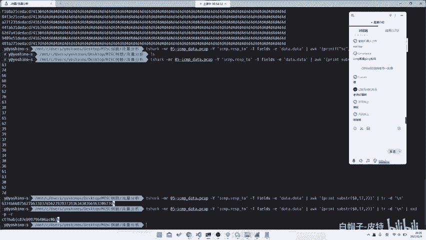

恢复化了，对吧？这是这就是我们的一串flag，对吧？这就是非常就是你用纯命令行工具也是可以把它解出来的那当然如果说这是这是一个字段，你要注意的问题就是对于我们的这种SCMP协议来说。

它其实是不止这一个字段能够藏数据的。那如果说我们藏在其他子段，比如说我们甚至可以藏在它的Lance里面，或者说我们可以它它的TTR里面。那我们再看下一道题目，你就知道了。😡。

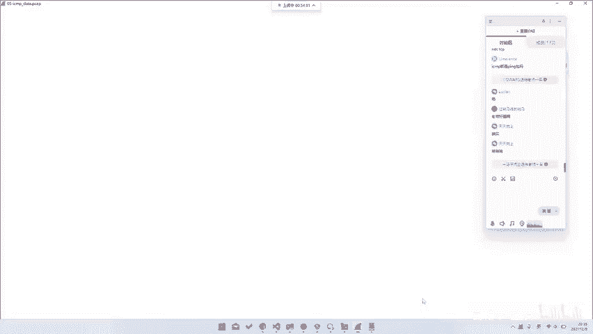

SCMP呢。哦，TTR的话，它没有藏在TTR里面，它主要是藏在一个lence里。那你去看一看它的所有的题目的Lance。你怎么看它的lanance呢？你去看这里的ICMP协议。

当然我们还是要一样的去过滤一个resquest或者response都可以。requesting或者re都可以。你去看它的这个叫做s的这样一个data长度，对吧？你去其他岛。哦。

当然这个题目它主要这个题目，它是你看它这个是99。第二个是116，第三个是102，第四个是104，对吧？这个东西。呃，太快了吗？呃，这个命令行的话，我相信就是大家还是就是技术可能还是要有的。下课的话。

你直接去help就可以。对吧这个这个没什么好这个没什么好讲的。然后AWK的话，你也是一个不这些东西都只是说是如果我们能够最简便的方式，就是在你掌握的很多知识中，最简便的方式能够拿到flag。

当然如果说我们没有这么多fl方式，对吧？那我们去给他先导出来。What。出来之后，你把这样传东西手动去复制出来都可以。或者说你那个叫什么，或者说你去给他用写个python脚本，然后找要还是那个。

然后就是每次读一行。😡，那是我们这边去写一写吧，就是如果说你没有这么多强制技巧的话。呃，我装的实体背。反正能用就行。然后这边比如说是我们去一个output点TXT。呃，是的，我是WCL。咩食啊。

那我们这边去给他开一个。到这儿了。然后我们的文件是哎稍等一下。对呀。

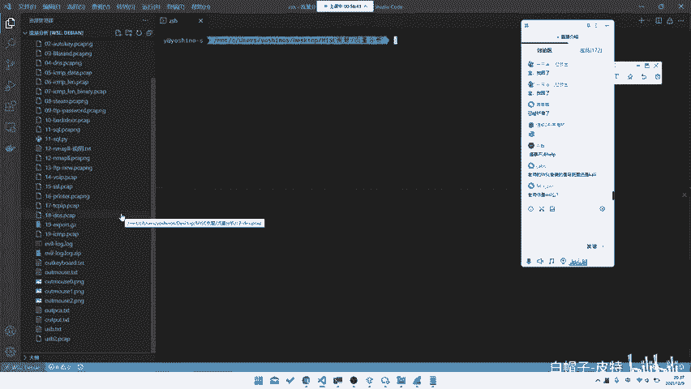

刚电脑忘插电源了。在这儿对吧？这个是我们的整个文件。那我们去给它开一个。对吧。呃，这样一个东西，然后的话其他不要刷无关内容，好吧。呃，比如说我们这边去给他open一个。Output。点TXT。呃，SF。

Data等于F等于read。Data。然后我们去给他，比如说我们先去给他data等于data点split。Gang。然后data就变成了按照回回回车分行。当然你这边这边data，你把最后一个去掉。

2和-一把这后又去掉。对，这样比较好一点。呃，不会，然后data的第0个我们去看，因为我们它的每一位都是在这个同一个位置上的对吧？比如说我们这一定要去找63，因为后面都是4D4D4D4D。

那如果说你不知不想怎么找的话，你就点index。😡，63他告诉你，这是第16位。那我们去试一试data地0的第16位开始的往后的两位，就是到18位，就把刘程提出来了。那然后这样的话。

我们就只接需要把每个geta位上的这样一个东西提出来。那我们可以去用这样一个迭代器I。forI in data对吧？这就把所有东西提出来了。提出来之后也是一样的。比如说我们这边去直接给它装用起来。

就是作印出来了，jo认出来之后，这样出来这样是一双hax，对吧？那我们去给它unhaaxify。😡，那比如说我们这边去用这个叫做be Oscar里面的这个这个库是那个叫python自带的。啊。

比如说unheif。第。就出来了对吧？也是一样的。就是如果说你没有一个命令行工具的，就是如果说你对命令行工具不熟悉的话，你去让样python随便跑一跑也是可以的。

就是你去对他做一个一步一步的分析也是可以的。就是或者说你这边甚至使用拍下都可以，对吧？这是无所谓的。那如果说再往后的话，你去他去看其他字段上的一个信息。比如说这道题。呃，关掉关掉点关掉点在这儿。

他去看的是一个我们所说的这样一个data的 lens，对吧？那我们也是一样的，我们去导出这个data的 lens就可以了。那我们也是比如说我们还是先演示这个。秘密行怎么做？onmap那题还讲吗？

N那题的话，你需要就是我不稍微给大家布置一个往后的任务。就是其实道题目只需要去找过滤器就行了。把所有的那个叫做呃你需要去找一个fall和success过滤器，把所有的success出来就行了。

所以说这东西嗯大家可以自己去找一找这个过滤器在哪里。好吧。哦呃呃呃。那个题目是VN2020的那个叫。

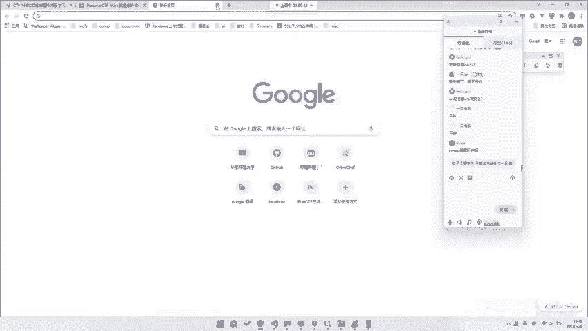

呃，公开赛对公开赛那道题目，在比O这上有。然后当时我想想我做出来没。嗯，好的，到时候我今天今天我那个叫今天我所有讲的题目的话，我在写课结束之后，会发一个打包给大家发一个文文件，好吧。

然后晚时间时间时间时间有点赶，就是今天讲的有点慢。因为时间哎就是这个时间还是有点少，对吧？然后你看这是哎我们去。Tea shock。06这样一个包，然后就给它导出来。呃，哎T下。2-206。

你看data，它所有的data就是它的一个阿斯克玛，那我们只需要把阿斯卡玛转化成我们的这个就行了。那当然也是一样的，我们直接去给它printF就行了。啊，比如说我们这边去print。

就print F百分号C，然后把这东西当做字符输进去一样的对吧？就是变成了CTF hub。但是延时的话，你不能延太久，对吧？延太久就不好了，就是这样也是可以的。当然后面题目我们就直接放立题了。

我们不讲了不讲了不讲了，我们快速过快速过。😊。

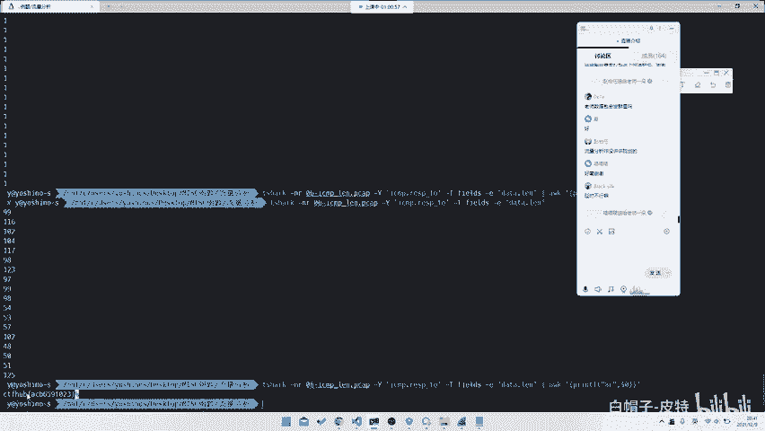

对吧这就是FTPSMP的那再往后的话，其实会有一些其他的协议。就是哎这个我做差了一页，比如说再往后其他的一些协议。比如说我们这里就讲一个比较有趣的协议叫VOIP。这东西呃Y要夏克比他知识比较好。

所以是导致他可以直接做出来。当然之前之前会出现另外一道题目，就是也是一些跟网络上的动态那个叫视频啊，或者说语音相关的。但是那个题目阿下课就没有，你需要去找一些。当然它有现成的工具包。😊。

所以说你要去线网上找一些现成的工具包，然后去给它解析。比如说这个题目。它题目的名字叫VOIP，然后它是RTP传输传输的一个实时语音。你看这边有个电话，这边有个VOIP通话，你直接点。

然后从这里它就实是可以直接放出来的。😊，我们这边去听一下。Hi， listen second I mean our service。

 Please press one to listen to the fly。 press on to magnet。去兰苑。

种你看直接读就这只是interest是它只是有趣的做法而就是它话其实没有任何难度。你后I导出来就当然它会涉及到很其他的东了。说他不用I协议一其话通信协议都所说并不仅仅说我们是基。你看它就是基于UDP的。

或者说不并不仅仅是说是只有TCP或者说只有CMP之类的FTP并不仅仅只有那些它可能还会出现这种。就是这种可能是基于其他协议的一些，比如说SCMP啊，或者说是其他的一些协议都是有可能的。呃。

这就是一些网络流量。但是网络流量的话，当然也会有很多了，就是这些不仅仅是这些了。比如说我们甚至会有一些嗯。😊，比如说这种去看。比如说直接去分析TCPIP的对吧？就是这种你去他他这道题目的话。

需要他这道题目的话，其实就是。你看就是他提的是这一位。😡，看虽然它destination都是8。8。8。8，然后它的TCPUSP还没讲，等会会讲TCP内容的话也是没有任何意义的。

它但是它唯一有一个内容就是。😊。

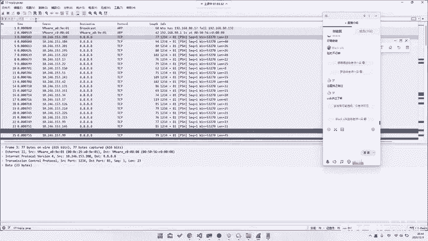

sourcece它的 source的每它 source都同时同一个C段，但是它最后一位有变化。所以说你把这最后一位导出来就可以拿到就我们最后的一个flag，对吧？😊，就是我们的这样一个网络流量。

