# 2024B站最系统的CTF入门教程！CTF-web,CTF逆向,CTF,misc,CTF-pwn,从基础到赛题实战，手把手带你入门CTF！！ - P52：CTF系列教程视频-misc流量 USB流量 - 白帽子-皮特 - BV1m64y157UX

。当然当然网络流量只是我们流量的一部分了。当然我们后面就会还会有一些USB流量。USB流量的话，比如它会有一些键盘流量，包括是有一些嗯。比如说有一些那个叫鼠标流量，键盘鼠标流量的话。

其实我们是有线成工具的。当然键盘鼠标流量是最最最常见的，当然就会有出现其他流量，我们就不多。就是比如说我们去看一眼。呃，你可以去找这样一个工具，就是也是我的一个好朋友写的。GitHub， F。

反正我就是。对吧这是这样一个东西，它可以直接去一键导出我们的这个就是。它可以直接一键导出我们的一个鼠标或者键盘流量，对吧？呃，因为我最近也在改这个项目，就快改好，就是这样一个东西。

比如说我们去看这样一个东西，就是比如说。我们先给它导出来。You P than K N M extract。比如说我们这样东西，他就会把所有的流导出来。当然我们这个。啊。

比如说我们这个市区看到凹 to P这个题，我们就看一下凹 to key。凹凸 key that。😔，在这儿。USB流量它本身就是一个5位长的一个流量。你可以看到所有的这个interrup in里面啊。

8位长就是它所有的都是88位长的。8位长里面，它的每所有的USB所有的键盘流量都是放在它的第三位上面。

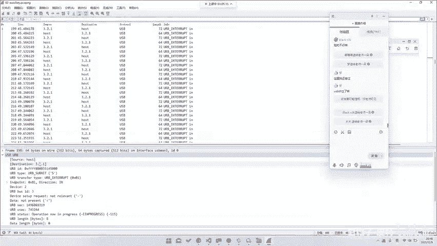

所以说你这样去可以，你这样就可以依次给他把第三位全部导出来，对吧？那这个工具里面也是写的，然后你们大家可以自己去试一下，就是这个USB的这个，然后包括鼠标也是鼠标的话，它直接可以最终是可以画出一张。

就是比如说是我们有一个题目，就是在。

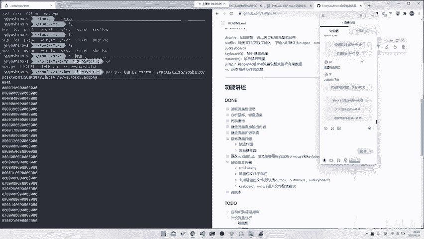

这个题目就是一个鼠标流量，鼠标流量也是一样，它会有一个现成的脚本。你通过去给他把这个叫做interrupt in的就是全部抓起来，然后去给他用那个叫我们的这个工具去写一个包。

是可以直接去导出这样一张图片的，就是去导出一个。

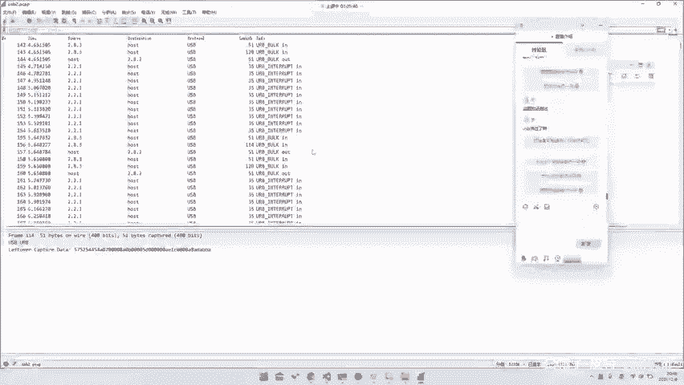

鼠标移动轨迹对吧？github地址。也是可以的，就是直接去给它放出所有的一个左键啊，或者说右键啊，或者说它移动轨迹啊都是可以的。就是比如说这是叉UCA之类的对吧？都是可以的那当然其实这些东西都是。嗯。

怎么说呢？就是呃USB流量并不仅仅说是鼠标键盘，鼠标键盘大家都已经玩烂了就。😊。

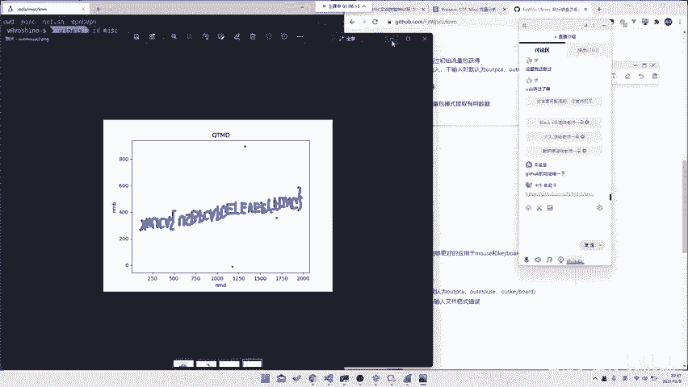

就工具都已经有了，你直接甚至可以一把锁了，对吧？😡，那比如说再往后，它甚置会出现一些什么样的东西，就是最近几年出现的。😊，比如说我们这里会有一些啊，比如说我们这个题就是那个叫做steam。

这个题目是西湖论剑2020的出赛题。他是一个。呃，我找一找能不能看他的那个叫discription的那个叫消息。它是一个sim手柄。对吧他就是一个。它是一个手柄，它是一个手柄流量。它是一个手柄流量的话。

就导致你可能就是你看这样的东西，就是它它虽然很少，但是你。分析数据的话就很难分析。因为它本身你对于这个手柄的流量通信协议，你是不清楚的，你可能需要去看它的一个呃流量手册。

但是这个题目的话其实是看时间间隔就可以了。呃，这个题目的话，我们之后呃明天也会就是拿出来讲一讲，作为一种就是做题手段去讲一讲。对吧打印机也有打印机，比如说是我们去看这样一个printter来着。

print在哪。然后你看这样一个题，这样一个题的话就是一个打印纯打印机的题目。当然打印机的那个叫协议的话，也是呃。打印机也是有专门的协议的，你也可以去专门找这种打印机的协议去看，对吧？

这个的话也是一种文档题，就是流量里面会有一种题目，就叫文档题，就是你要去专门读文档。读了文档之后的话，你才能去做这个题之后，这种题目我也会发给大家。大家有兴趣的话，可以去做一做。啊。

当然如果说这些都是一些。呃，可能是如何看出是打印机流量的这个题目的名字叫做print。就非常非常非常非常简单合理。题目告诉你它是printer，就是printer。😊，当然也可以去通过那个叫做。

去通过他的venerIP通过他的vener IDD去找出来。😡，哦，他这个题目没给vender IDD。如果说他给全一个整个USB协商的话，在USB协商的最前面。

它会给你个vender IDD你可以通过那个叫生产商和那个叫产品的ID去找到他的这个设备的一个类型种类。那当然这些都是一些比较嗯就是比较传统的那当然如果说我们再往新的一点走，就是比如说最近几年的呃。

这个都是我最近打过的比赛的。所以说我们直接把原套right up掏出来就行了。啊，比如说我们这道题去哪儿了？比如说在这儿这个题目，capture这个题目。开这这个题目的话，它其实不是它其实也算是一个标。

也算是个流量分析。它长这样，它文件长这样。就是。这样一口东西。那对于这样一头东西来说，你肯定也是不管是挖下克一样，都是它里面数据都是我们不知道的格式的那我们还是需要对它进行分析格式。

当时这道题目就是我做的，当时是怎么做的呢？就是直接去看出来的，就是看到这边有逗号，然后看到有up and着 down，那就猜测一下up就是抬起来，当时当下去，对吧？这就是一个这些都是一些很新的题目。

当然这个题目最终是一个那个叫公共机的一个流量。😊，但是我并不知道他是我不知道我大在不知道他是工程机的情况下，把它做出来了，也是可以的。😡，那再往后的话，可能也会出现这种就是会有这种后门流量啊。

包括是其他流量都是可以的对吧？就是这些就是一些比较新的一些流量题目。比如说这边还有一些。嗯嗯嗯嗯嗯。这种题目就是。比如说这种SRCPY这种。就是它是一个用来安卓，就是走的ADB协议。

它去在安卓上面控制一个，它可以去通过windows去控制一个安卓。这样一个协议里面可以去拿到它的一个鼠标控制轨迹也是可以的至于这种协议，你怎么知道它是一个。

怎么知道它是一个就说是这个叫SRCPY或者说是之类的呢？只能靠去他的找他的特征，然后去给他找扔到那个叫做那个叫扔到那个叫搜索引擎里面去搜索，都是这样的那明天的话我们就会具体的讲一讲。

就是呃针对于新的新遇到的题目，我们去如何去给它进行。就是在不知道的情况下如何做题，对吧？因为我们这些题目看起来都是知道的。比如说当然还会有这种就是。嗯嗯，比如说在在在在在。稍等一下。哦。嗯，去哪儿了？

switch那个题目好像是呃稍等一下，我找找。呃，在。在这儿。这个题目当时我比较印象比较深刻，它是一个switch的题目。啊，这句话是我写的。他是如何做到同时按下三个按键的？

就是虽然我找到了这样一个分析协议，但是我没有分析出它的最终的一个协议构成。然后后来的话找到了方向感的流量，然后的话最终知道它是数据的第七第八尾代表按键，然后你去把按键的画出来，然后的话最终再去进行做题。

所是这些东西都是你需要去专门去找一些流量啊，或者说去找这种。这道题不就是去找中空的一个协议，都是要你自己去找的对吧？

所以说这个题目的话就这种题目明天我们就会讲如何去在这种在一个在不知道题目怎么做的情况下去找到我们这怎么就是找到一个题目的解题思路，或者找到一个相关的文档，好吧。然后。还是还是还是。

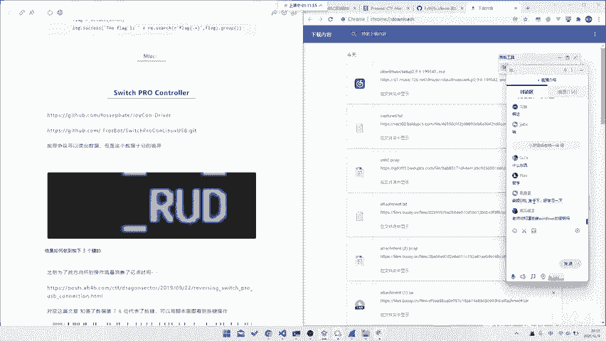

呃，URL链接，今天所有的那个叫资料我之后会整理一份，然后发给大家，然后就是发到群里面，对吧？然后的话就是还是要留给大家一点时间去问问题的嘛。呃，就比如就是现在8点53，大家有问题，赶紧问好吧。

没有问题，我甚至可以回去讲一讲，之前没讲完。python不会怎么办？H。

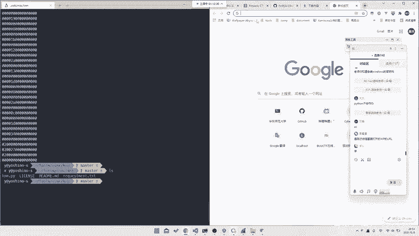

刚才微信里面打开right up的微信里面这个rightite up，你可以去看这个叫这个公众号。百茂一把安全工防实验室。这一个公众号来你可以去搜一下。就是嗯。我现在在这个站里面打比赛嘛。

就大家可以去看一下为安装windows的必钥这个。这个。windows妙不要问我，你去网上搜。怎么溜这么溜的。每天勤写代码。呃呃。我不知道最近这两天。

呃，这个是我大概是近半年的数据吧。就是我这半年打了395个小时代码。就是。只要你去每天倾情做题，打代码，你就可以做这么强。诶，忘记了。我们学CTF的话学，我们做CTF学python的话方向是怎么样的？

就是。😊。

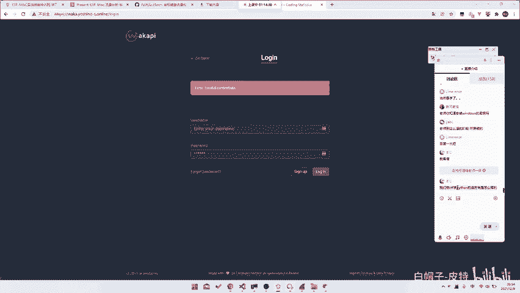

其实你对于python的理解，你仅仅只需要会写它就行，就是只需要理解它的语法就行了。呃，在CTF里面用的很多库的话，其实都是现场。你如果甚至很多都是现场你刚去装的刚学的。

就你甚至你只需要出PILm点open就可以了，对吧？你其他的基本上不需要退，就是就是其他基本上你不基本上不会用到。对你只需要把它当做一个工具就行了。你不会用python，你可以用其他熟悉的语言。

我见过有一个人，他做那个叫什么。😡，呃，他做胖体，胖体，我们知道也是要写脚本，用胖ntts写脚本。他做胖题是拿C写的C写的一叉P也是可以的。像素处理就觉得很难。对于image。

就是你把你用你用你你用PIL打开一张image打开之后，它就是一堆，它就是一个它就是一个三维数组，对吧？你对它三维数组，你有X轴，有Y轴，有一个颜色深度就完事了。那至于它怎么处理。

怎么那个都是全靠你自己的一个。😡。

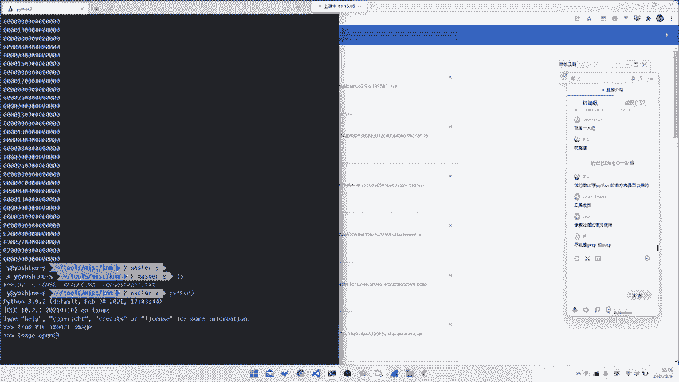

对，就是get pixelix put pixel对吧？那我们之前会有这个这个当然这个都是一些。呃，知乎。呃，知乎。我去找一找那篇。那篇那篇。😔，文章。呃，文章。我很久很久以前在这会上面写过一段时间的。

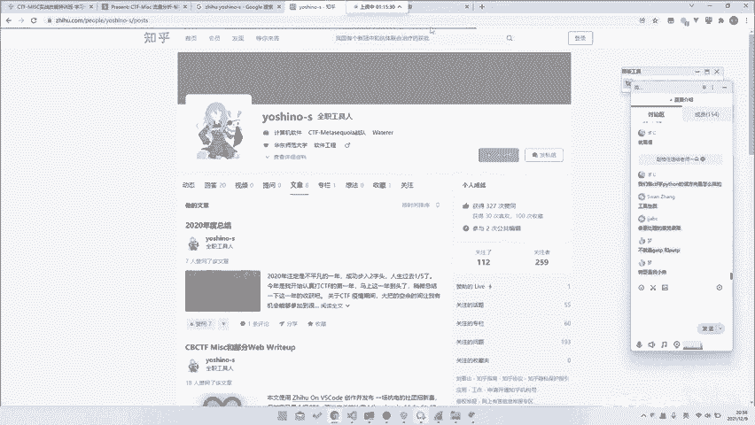

Right up。

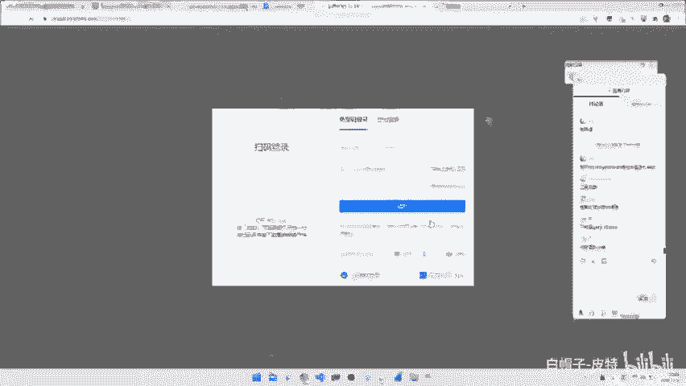

你去看这种题目，就是比如说会有这种就是对图片处理，他就是用了很多图片处理的题目，对吧？这接脚本你可以看到当时我写脚本和现在我写脚本其实甚至就是有区别了。比如说这种你去叠加，或者说是。

他有个题目还挺那个对，就这道题目。就是他先要修宽高，修完宽高之后的话，他看到这样的题目。然后的话你会发现这道题目我做过原体，导致就是它每一列都有一段红线。然后你把整个红线对齐就行了。那至于怎么找红线。

怎么那个就是张断旦吧，那你可以去尝试理解一下。树哥是我小弟。对吧就你就可以通过这样一段代码去给它完成一个，把红线全部堆起来。那具于是怎么完成的，或者说这道代码是什么意思？你可以尝试去理解一下，对吧？

都是嗯。就是你写脚本写多了，你就可以熟能生巧，相当于。感谢赵博任老师送的小黄花。赵博任老师，我相信他也一经写了很多脚本。😊，之后有机会的话也可以对我们的课程，我们又到我们课程的会。

就是大家如果说对这个感兴趣的话，也可以来听我们的这个CTMS实战特训实战技能特训营。呃，就是这位赵博任老师，就是在这边跟我们聊天，这位老师就是我们的另外一位老师。贵不贵，这个就看个人了。那我可以告诉你。

我现在出去打一场比赛，对吧？随随便便。😊，呃，奖金就能有4000多，这个就一一天就能赚4000多。所以说这个只要你真的去认真学了，只要你真的去认真的把这东西给他全部学会了。

那么我相信你以后的成诺也不仅止4000块钱。你之后的话，你肯定能打到的比赛能做到的那个水平，也不是说是这东西能限制的。对吧大家有问题就是对就是还是建议大家可能如果说有感兴趣的话，就来听一听我们课程。

赵老师也很强，赵老师他是天选的队长。然后他的mi视频也很强，然，甚至比我还强。然后他还会区块链，我不会区块链。对吧你们也可以有，就是如果说报名的话，也可以听听赵老师赵老师讲课。对还有什么问题吗？

就是如果相关对于这个叫比如说课程相关，或者说是其他相关的，有什么问题的话也可以问。

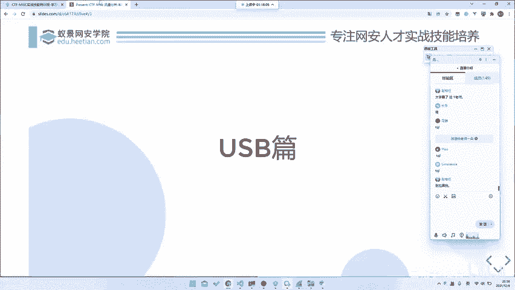