# 2024B站最系统的CTF入门教程！CTF-web,CTF逆向,CTF,misc,CTF-pwn,从基础到赛题实战，手把手带你入门CTF！！ - P53：CTF系列教程视频-misc流量 实战题目 - 白帽子-皮特 - BV1m64y157UX

。然后我们就正式开始今天的这个课程了，我们不讲log for loglog forG好吧，然后我们首先讲一讲。呃，如果说对于拿到一道题目，就是拿到一道新的题目，我们应该。雅科一起上好以。嗯。

如果说学校里面有课，建议去上学校的课啊，我这个课有录屏回放的。就是首先讲一讲我们这个如何去入手一个新的题目。那么对于一个新的题目。拿到手之后，你首先应该做几件事情，对吧？那我们这边大概总结了几个点。

就是预处理。关键点的提取。还有搜索相关的资料。对吧。谢谢大家点亮个啊。那首先我们要看这三个点，为什么要做这三个点，我也会给大家讲一讲为什么要做设这三个点，或者说这三个点怎么用怎么做。

那首先拿到题目的时候，我们肯定是。😊。

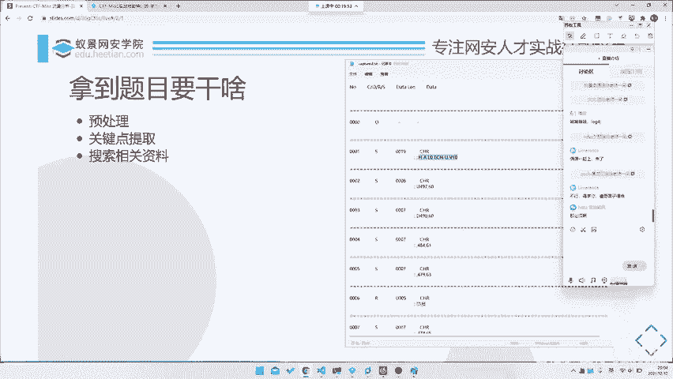

比如说我们就拿昨天这个就是比较比较玄学的这个题。这个题当时我right up写的很简单，大家也一晃而过，就这个题。那我们看这个题，首先它拿到是这样一个文件，对吧？

那首先你肯定是发现这个文件是有一定规律的。比如说他前面加的number啊，什么CORS啊，datalan啊，data之类的。那么对于这一个文件，你显然没有头绪，对吧？

你直接全局搜索flag是没有的这肯定没有，对吧？没那么简单。那所以说我们要对它进行一些处理。唉，那这答到这个题我应该怎么做，对吧？那我们今天就会拿通过这道题来完整的讲一讲。就是一道题目。

从入手到最终做出来，就是一道全新的题目。因为这道题目跟我们以前说的这些HTDP啊什么东西啊没有任何关系，要怎么去做？首先第一步就是预处理预处理什么呢？首先你肯定找到规律了对吧？这个规律是肉眼可见的规律。

😊，那么这个规律肯定不好用，对吧？那我们对于这个有多少行。有23978行的这个文件。那你去不管是去肉眼翻也好，你去做东西，做什么东西也好，都是不现实的，或者说是就是不好搞，对吧？

那所那所以说我们这里需要去先给它进行一个预处理。😊，那么怎么给它预处理呢？就是提取我们所需要的一些。我们看。第一步就是格式转化，或者说是让文件可读。这两个调这两个其实是一样的。比如说这是个TXT。

你可以把它转化成1个jason，或者说转化成一个叉M或者说CBS都可以。反正因为转化转完之后，我们去对它进行一个更加方便的，可以对它进行更加方便操作了。😊。

那我们就按照因为它因为所有的流量数据都是一个相当于是时间序列上的流量，就是在不同的时间点，或者说是按照某个顺序排列的一个流量。那么在这个里面就是从0000，对吧？我们的number就是它的一个时间序列。

一直到我们最终的1个4794，那么这就是一个时间序列。那我们再看每个序列里有什么东西。比如说这里就有1个CRS，然后一个dataline，一个datadata的话这边有个什么CHR，我不知道是什么意思。

但是我们知道下面一行，它每次下面一行都会有一个冒号，一头东西，冒号一头东西。😊，那我们想这头东西是不是也是data，那我们就首先把它的格式理清楚了，对吧？它的格式就是一个。稍等哈。

我想想这东西放哪放方便吧，它的格式就是这样一个有12345个字段，相当于是5个字段。因为这个字段这个字段我们可以分开5个字段的一个数据，对吧？它有多少列，对吧？那我们给它处理起起来。

那首先就是我们要找到这么多列。😊，那怎么找呢？😡，呃，我不知道大家有多少种方法，就是但是我们这里最方便的是什么？我们最方便的就是一个。正能表达式为什么正能表达式比较？😡，比较一个比较说是比较好用的。

因为它的规律是比较比较显而易见的，就是这一个是一个四位数字，这里是一个单个字母，这里又是个四位数字。当然不一定了，你看它也会有出现于比如说这种一个杠，也有可能data datata是一串东西。然后呢。

这样穿东西之后，下面一行可能会出现一个冒号，对吧？这里都是在冒号的冒号后面带一口东西，那这个东西就跟这个东西就是找规律了。我相信大家从小学就开始会做找规律题了，对吧？就是12345下一个数字是什么？

就是6这个这个找规律题，我相信大家都应该是很很会的啦。所以说我们就要找一个会找完规律之后，我们。😊，嗯，稍等一下。Yeah。抱歉，刚刚刚刚有人过来问了个问题，好吧，我们继续回来。啊。

那我们首先我们刚刚说到哪里找规律，对吧？那找完规律之后，我们就要把这个数据按照正的表达式提取出来。😊，那提取的话，我们怎么提取呢？就是我们去写一个python脚本。因为这东西就是怎么说呢？

就是挖下以挖PCAPY也是一样的对吧？它只不过是把字段封装在了一个呃一个文件里面。那如果说我们这样子，这是一个裸的1个TXT也是一样的。那所以说这时候我们就可以直接给它提取出来。

那当然PC也是际样PCAP我们可用PY下，那我们这里就直接就用文本文本处理就行了。那所以这里就正在表达式。那我们对他去写个正能表达式。比如说我们这里去找一个再再再不是这个文件了。

在这儿这串就是我们写的一个正策表达式。那我相信大家应该都是看得懂真的表达式的那我这里就。😡，就是只是说一下他大概说一下他什么意思了，我们就不详细解释了，好吧。呃，如果说大家不懂什么正能表达式的话。😊。

自己去看派送文档。那我们这里的话就首先是一个。杠D数字哎有这是一个什么行的开头，然后是一个数字，然后一串空格，一个字母，一串空格一个，因为它这里有杠，也有可能是数字，所以说这里是用的一串字符。

pyython是什么？这个。这里后面又是成空格，然后的话就是结束，对吧？那只要就是杠R杠N。你首先你为什么要这里是杠R杠2？你看我如果说我们用VScode的话，所以说VScode是一个相对比较好的东西。

比如说你看这里它就会告诉你它是CRF就是杠2杠N了。😊，pyython是蟒蛇队。但是python支付它其实声明过，pyython跟网蛇跟蛇类也没有任何关系。好，在这些题外话咱不讲杠干完之后。

就是下面这行冒号的这一行，因为我们需要的数据只是有带冒号的对吧？那如果说不带冒号的数据，其实我们不是很ca，因为它什么都没有。所以说我们把这个代冒号提取出来。😊，然后后面是一串。

因为你会发现后面是除了除了有字符，还有就是空格。所以说我们就把所有的非空格字符和空格提取出来。然后刚加，因为我们不知道多少个，然后最近结束了。那么这时候我们打开它去读，读完之后就给它打出来，对吧？

那我们这边去给它试试。Friendnce。第查。Exit。Lilay。

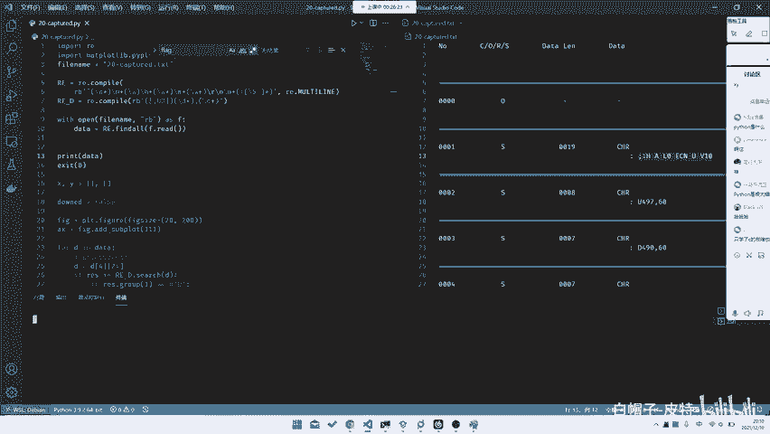

就把一整个数据打出来了，看到没？把所有数据都打出来了。这个数据非也符合我们的预期。前面这一个是一个ID对吧？number这个是什么CRS，然后这个是我们的一个datalan。

这个是我们的一个应其实应该是就就我这里我们不知道，我们不知道，对吧？我们不管它。呃，有人说只学了C，你用C写也可以啊，对吧？C里面又不是没有真的表达式。😊，啊，当然C里面没有DI加里面有了，对吧？

那我们到就是最后一这函是我们的data。那我拿这两程东西之后，相当于是预处理完成了，对吧？那当然你可以把这个data去写到某一个jason文件里，也可以方便以后处理。当然你保留在这也可以。

你直接python以后往后写在运行里面就完事了。这就是我们的一个预处理或者是让文件可读，主要为了就是让方便后续的处理。因为我们要对这个数数据进行一些后续的统计啊，或者说是其他处理的话。

就需要我们有一个很好的格式。在这里。比如说这里就是个很好的格式。😊，对吧那么在这一步里面你需要是哪些能力？首先你需要有高超的python编码能力。但这的高超其实并不需要非常高超了。

就基本上只要你会写代码就可以。咱也咱也咱也不是什么开发是吧？对，咱也不需要什么非常牛逼的能力。😊，python开发嗯。不管了，咱就python这个能力还是一要要有一定的就是。python不能太弱。

python弱了之后，别人都写完了，你还搁这儿查语法呢，那肯定不好，对吧？那第二点就是智能表达式。智能表达式的话，我有一个就是智能表达式，它在mask里用处非常大。😊，很多地方都会出现这种表达式。

所以说我推荐大家去好好学学这种的表达式。

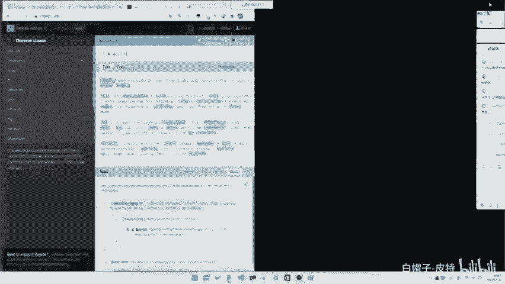

有一个网站推荐给大家。😡，就是。不需要打卡。😡，就你看它有一个网站，它就是有一个用来去可以，它可以去要查查这种heet，就是reference，对吧？或者说它可以记录一些my pattern。

或者说其系的这种告诉你是什么东西，什么东西，什么东西，各种分组呀，或者说是各种的那个叫qufin啊都可以。然后他也可以去可视化的一个匹配。比如说这里我们去其实用那个PCRE会稍微好一点。

就比如说你去看explan，它可以去解释这是什么意思，对吧？然后每个到上面它会移到上面，他会告诉你第一个group是什么。比如说这里它就是比如获了所有的以大写字母开头的数字，大写字母开头的。呃。

单词的第一个字母，比如说这里他就会告诉你捕获第一个groupG，这个是M，这个是T都可以。所以说我们可以拿这东西去测试我们的一个正能表达式，对吧？那比如说我们这里其实是可以用自动去去编制的表达式的。

比如说我们去复制几行。比如说就这几行吧，随便便复制几行过来。然后我们去给它把这个正动表达师编出来。首先它是一行的开头啊，我们要设置一下它的flags。是多行的。对啊。首先是开头。

它必须是以数就是以行的开头，然后是杠D。杠地。对吧。它就匹配到了。那杠B的话其实是四个字母，我们可以这么写。然后后面是空格空格数数量我们不确定，对吧？我们可以直接这里使用那个叫。呃，T系里面这个东西。

E在ai。在在reference这里，然后是group。呃，character class在这里。它有一个wite space or not white space。那我们这里其实可以空格。

因为我们这里其实并不知道它是空格还是杠T或者说什么东西的。其实我们这边是使用witespace时会稍微好一点，然后加。然后是一个字母。对吧比如说这里点就行了。那当然你这当然为什么我们这里要加括号？

因为我们要把这几个group提取出来。那比如说我一到这里，它就会告诉你这个group0004，加个group是S。那这样的话我们可以把这种数据提出来了，对吧？再往后的话是杠X加。😡。

然后的话又是一头东西，就这里的话我们不确定是什么了，对吧？比如说我们这一周直接杠S加就行了。然后我们这边是杠S加。😊，然后最后面又是一传杠S。答。我后面讲下刚啊。那为什么这里啊这里就有杠N了？😡，啊。

当然你要注意个问题，就是这里是杠了，但是其实那里是杠2杠的，这个你这个事情可能需要改一改，杠完完了之后是什么？杠S加。然后是我们把这东西匹配进来冒号。然后后面是东西，这头东西里没有什么有空格，有杠S。

啊。然后最后是就结束了，对吧？那这就是我们的一个，当然我们这里加不加尾尾尾都可以了。那这就是我们的一个正能表达式。那我们去测试一下。

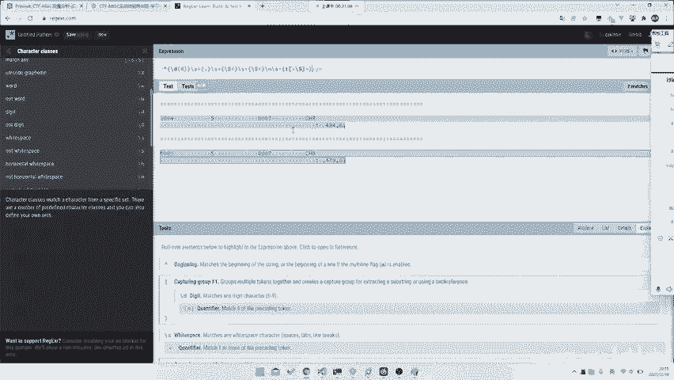

是不我们这个写的跟刚刚那个不一样了，没有发现，但是其实应该也是可以的。如果说没出什么岔子的话。哦，我们去试试。哎，他没有。因为这里。你知道为什么没有吗？因为有的地方太哦，因为这也是杠啊杠，那没事。

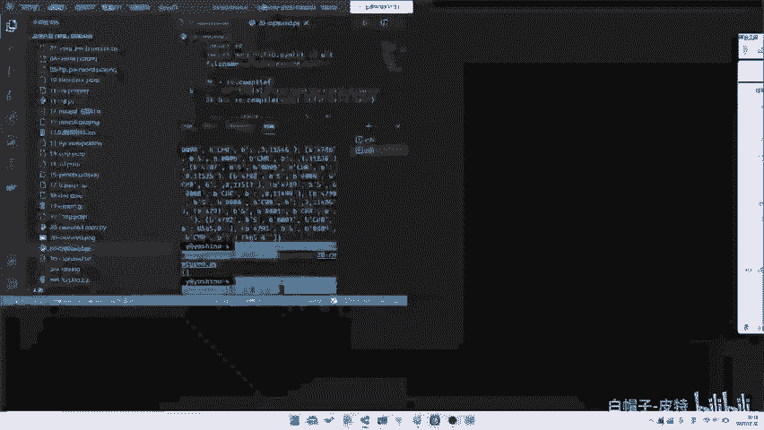

又没有，因为他有的有的地方就会会有个空格，所以说这个东西是要去掉的。你看这样就也有了，对吧？刚刚那个其实是一样的。那么这样的话，我们就把这东西剔出来了。所以这是智能表达式。真能表达式的话非常重要。

所以说大家要去学学正能表达式。智能表达式的话，这也就可以学，对吧？那么第二步是什么呢？第二步就是还有最后一就是归纳能力，就是你需要通过里面找规律，我相信找规律这一步其实大案问题都不在是很大了。

那么就是预处理的这一步。那第二步是什么？就是关键点提取。什么叫关键点提取呢？就是你需要去找去看数据里面有几种我们需要去call的数据。因为。一个时间序列上的数据可能很多很多很多。比如说这里可能还好一点。

就是可能就只有9000多行。那如果说多起来的话，那么显然不可能每个东西我们都去想办法给他。当然每个东西肯定都是要的啦，因为它可能是在时间序列上变化，拿到flag。但是的话你要去通分析某些要点的时候。

不可能是所有数据都是你的要点。所以说你要提关键词叫什么划重点。那么哪些部分是重点？第一部分就是提取出来的数据中的一些敏感部分。或者说其实说是变化的部分。比如说这我们这个数据里面。

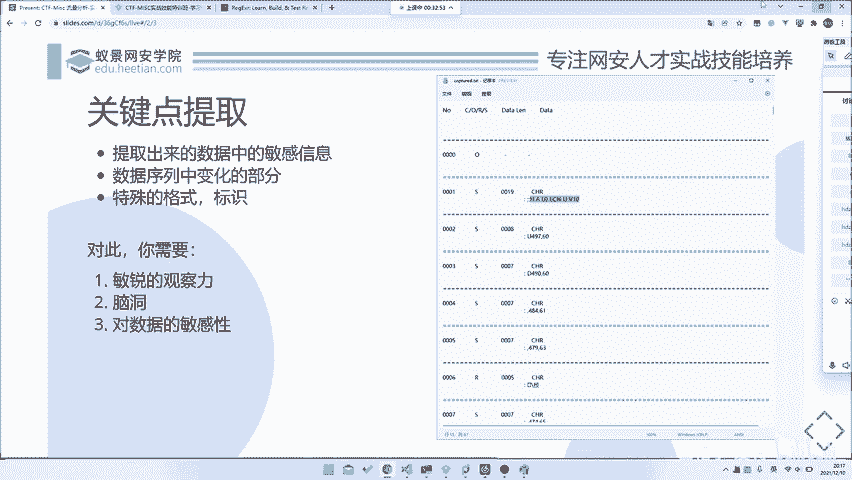

从头到尾。它有这么多东西，对吧？那么它变化的是什么？首先第一个是它的这个I，就是这个叫什么numbernumber是一个呃递增递增递增变化的。没有我们不是很care这种东西。然后呢。

这个CORS我们这里不理解是什么东西，那这他看上去好像都是S，那我们也不ca。那最后的这个datalan。和我们这个data，那我们去对应一下。比如说这里是19，你去数一数这里是不是16个字符。😡。

对吧08你说这里是8个字符，比如说这里去标数12345678，哎，对吧？正好，就以说哎它是不是就是指这个的长度。那我们显然重要的是什么？重要的就是这个data了。那。

所以说我们重要的东西这个data也许是我们的要点。然后就是还有就是一点，就是它里面的一些关键词或者说关键特征，也是我们需要去call的。我们为什么需要去call这些关键词，就是特殊的格式呢？

因为这些特殊格式很有可能帮助我们去。

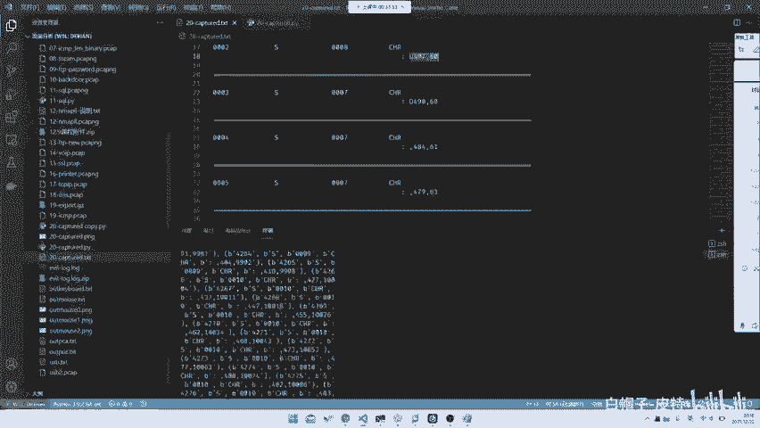

找到它是一个什么什么流量。比如说这里其实我们是不知道它是什么种类人量的，对吧？因为我们这里并不知道他是跑的一个什么东西。但是的话我们是能够搜索出来的。那搜索你肯定关键词，对吧？

那所以说你这里可能需要去拿某些东西做关键词。所以说最后搜索的话，就考需要考察到我们最后一个点，就是我们的信息搜集能力。啊，当然这里也会去说到，就是如果说你要做关键词提取的话，你需要哪些具备哪些能力。

首先就是你要敏锐的观察能力，对吧？你至少需要看出来，它什么在变，什么不在变，或者说哪个A，你看这东西A是不是可能是重要点东西。还有就是你需要脑洞。有这道题目其实相对来说比较简单。

就是可能是你稍微看看就可以了。但是有的题目你真的需要一点点的脑洞才能把它给它搞出来，对吧？或者说你需要正好和出题人思路对上才可以做出来。🎼最后一种就是对数据的敏感能力。

就是你需要对这串数据有很敏感很敏感。比如说你看到比如说你看到flag的那比如说你你你们大家能背下来flag base6字是什么吗？你看到这块东西，就是看到什么ZM叉HZ这个东西。

你就很应该很敏感的了解到它是不是我们的一个flag。比如说我们的flag的16进制666C6167是不是对吧？就所以说你需要对数据有一定的敏感能力。

当然这里的话其实呃跟我们这个叫阿斯克玛之类的没有任何关系，还没有什么关系了。

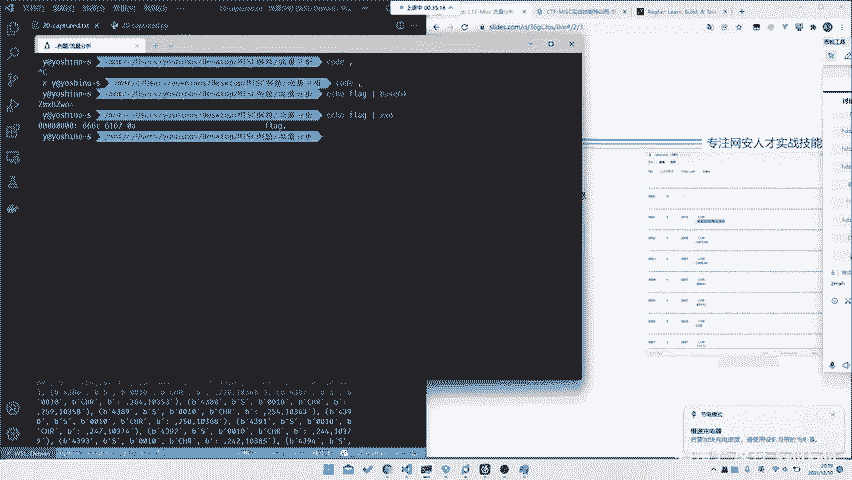

所以说你需要去这里的话，其实我们对数据的敏感能力不放在这里，是放在这个地方。就是我们需要看这个特殊格式，对吧？那我们这个特殊格式是什么？因为我们要把这个特殊格式扔进我们的浏览器里面扫，对吧？

所以说我们这边要去看最后一个点就是。😊，信息搜集。就是你对于上述提取到的所有的关键信息，我们去招进行一个信息搜集。因为你纯就是什么就什么不要重复造轮子。如果说前人哎，你甚至帮你写好了这个题。

甚至说是原题，那我们是不是能够直接通过搜索就能拿到了。显然会快多了。所以说我们这里需要先去进行一个信息搜集。😡，那么信息搜集的话，我们就需要去把上述的关键词提取出来收集。

那就是又又又涉及到了如何提取关键词。那信息搜集我们要搜集什么内容查找。比如说是这种协议协议分析题，你可能需要查找这些协议的详情。或者说查找这个协议的内容。或者说查找我们是否有这个协议的。

直接有一个那个叫文档对吧？或者说你去看是否会有一些嗯比如说是原题啊，或者说类似的题目啊，PPT啊PPT。嗯，大家看录屏吧，没有PPT就暂时不分享了。然后的话对此的话，其实你需要有一定的能力。

比如说你有需要有一些搜索能力。就是你需要有一些就是搜索技巧，你有特殊的搜索技巧吗？你比呃直接百度搜，其实大部分都搜不到。然后还有就是脑洞，你需要还是也需要一定脑洞去。比如说正好捕获到这个点。

就是要缩的点，还有就是你需要有丰富的网络资源，就是不知道大家有没有个收藏夹，在家里面藏了各种宝藏网址，对吧？啊，还有最后就是你需要有一定的音语能力。当然你这里甚至不是不只是英语。

你课是需要有韩语、日语之别的能力。呃，可以说个小故事，就是之前有一个比赛的某个题目。然后那个题目。中文搜不到英文搜不到。但是如果说你用韩文一搜，就可以搜到韩韩有一个韩国人的比赛。是个原体。对吧所以说。

所以说这种东西这种东西其实你也没办法说，因为。呃，因为这东西嗯不可能说是必备某种原则思导，所以说你多掌握几门外也是很有必要的。好吧，那这也就涉及到这个题目，我们该怎么搜。呃，我忘了那个题目是什么了。

反正那个题目反正就是反正是web题，然后反正只有韩国人的网站上才有啊。我忘记了，反正他那个题目最终是韩国人出的对吧？对吧？咱咱咱不说了，咱不说了，咱就是看那这个里面我们能搜什么，那这个东西我们是否能搜。

比如说这个什么CRS之类的那我们直接扔进。😊，啊，我们所我们就完整的模拟一下一个搜索的过程，好吧。比如说我们先扔进百度里头。百度里你搜了半天，你啥都搜不到，对吧？这个是CO他说是转域之类的，这个搜不到。

那我们再看其他的字段，那这些字段肯定都没什么用处了。那这个data字段里面是否是我们有我们一可能想要的东西，后面都是代数字的，一串不知道什么东西，对吧？那我们不知道，但是你看第一头东西。😊，哎。

它是否是有一些什么比较神奇的格式，要一定要放在第一位。那我们所以说把它给你归在群里面搜一搜。哎，还是做不到。哎，你看这里对吧？一模一样的一串东西在这儿了。那是不是说唉这东西我们是不是有用？😡。

我们再去看这个题。诶。这什么串口DMPL指令刻字机自动识别图形轮廓并刻回PY。

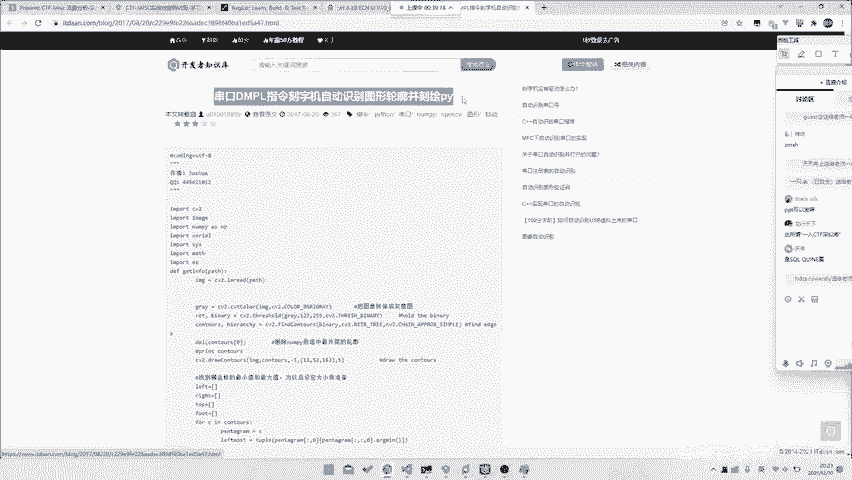

哎，你看什么，由于家里开了印刷厂，近几年改了改了什么方法。哎，你看对对不对？那是不是就是印刷厂，比如说是那个什么刻制机的一个什么协议。😊。

那我们是不是。哎，对吧我们找到了，那我们现在需要找什么？我们需要找这个题目。其实你它这个文它这个它这个还是有一定帮助的了。就是你应该其实已经差不多知道这个它的格式协议是什么样子了。

但这东西其实还不是很明确。那我们如果说就要继续往下找，比如说它更加复杂，或者说他这个协议里面涉及的不止这些东西，那我们是不是可能需要去找一下它的协议的一个呃文档，那我们直接去搜。

比如说这个这个协议叫DMPR协议，对吧？那我们直接去搜，比如说我们还是百度。串口DMPL。协议。你看啊，其实你不管怎么搜，其实你们都只能知道这篇这一篇文章。所以说你这一想哎，是不是我自我方法错了。

我们扔骨骼里去试试。也是一样的，他告诉你刻字机，它只有刻字机，其他什么都没有，对吧？DMPR语言支持什么刻字机绘制机刻字机。😡，这个DMP啊，什么HPG啊之类的对吧？都有，但是它就是没有文档协议。

那怎么办？这个时候就要涉及到我们最后一个点。就是你需要有英语能力，为什么？DMPR协议就是DMPLproto。丁他就有了。在这儿。

套作 digitalital microprocessor plot language对吧？它是一个什么向量图文件格式。并且是用来什么from什么houston instruments，右键翻译词好。

给大家翻译一下。当然你这里如果说直接搜DNP协议是不行的，所以说你一定要搜DNP protocol，所以说你需要一定的英语能力。😡，你知道协议是prologo吗？你不知道，那你就记了那DMP的谁议。

你看。😡，什么司机司机，咱司机应该是原文是driver吧，对driver驱动其语源于什么什么什么HPG而不见容器，参阅其一构定义。哦，定义在这写了。

比如说什么reset是什么with是什么hat是什么re X什么re y是什么什么penlect是什么什么东西，对吧？就这样的。

所以说这里又看到了是什么pen select pen speed是用来设置比的大小和什么比的那个叫速度，然后就是move对吧？移动到什么地方？然后joaw是什么down是什么东西。

然后什么pen circlecle什么东西，对吧？这就是一个指令。那我们再看这儿设DPR文件DNPR命令。

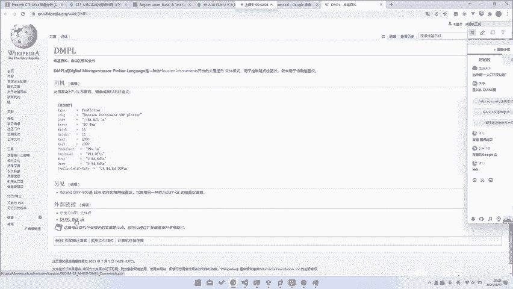

恭喜你找到了他的一个文档。那么基于文档的话，我们就可以做了，对吧？我们就完整的理解它是什么意思。就非常棒了。哎，那这里我们是不是就是进行到了一个搜索，或者说你拿着这个文档。

其实这个题目就其实相当于是结束。你不管说是以后你后面怎么做，你或者说你花时间分析啊也好，你去想办法给他写脚本也好，那我们这里就。我们就不care你到底是怎么做的。但是因为你搜到这篇文章。

所以说你就肯定能做出来了，对吧？就可以了。所以说这里就是涉及到了我们的一个搜索能力，它非常好的印证了这几个点啊。😊。

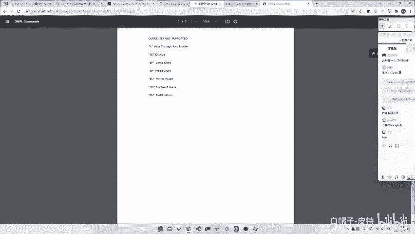

我觉得这个题真的非常好，就是它虽然很简单，但是他对我们的这个每个点都提到了它有这个他需要我们有强大搜索能力，也需要你去有一定的脑洞。当然也需要你去有一些丰富的网络资源。

比如说你至少有百度google你之类的要会吧。当然最终就是你需要英语，你没有一定能力，你打死都投不到。那这样的话我们再回到我们的这个题目本身来看怎么做。那我们把数据提取出来之后，我们知道了up是抬起来。

down时down海去，然后其他东西都是移动。那我们这也就其实只要对这个数据进行处理就行了。那么我们对于这些数据处理中，我们其他数据我们不call，我们只ca这几部分数据。就是冒号后面这个上逗号开头的。

或者说up开头或者是当开头的那我们再去写上这个表啊，是在这里逗号或者是up或者是down，对吧？拿出来。拿出来之后，我们去给他画。那至于它怎么画呢？那显然很简单，我们就无所谓了。我们不管拿什么画都可以。

比如说我们这里其实我们这里如果说不管这个阿按 down的话，我们可以试一试。比如说嗯。这里我们去给他。这差我们东西不管它了，我们就重新写一下脚本，我们去试一试。如果说我们没有。

我们并不知道upend down是什么东西，但是我们因为看到我们后面是有一串点的对吧？其实这样也是可以做的。就是如果说你并不知道upend down是什么意思的话。比如说这里你去给他找一个嗯。想一想啊。

我并不确定这里这里能不能做，但是呃应该是可以的。哎，忘记了，这边要EXIT掉。那我们这里试一下，我不确定这个可不可以啊，我们先把图画出来再说。图在在在这。你看哎，其实我们如果说我们什么都不处理。

我们不处理ipad down的话也是可以的那这里它比较歪头，就是头脖子不大好啊。王老师脖子也不大好，那我们。Yeah。我们给它调个个儿，然后看一眼。哦。

当然你会发现就是如果说我们这里不做这个叫fiix size这些调整的话，如果说你直接画的话。其实你会发现它会坨成一坨，因为它的那个叫横坐标和纵坐标差距很大。当然是它的横坐标和纵坐标比例很大。

大概是1比1的关系。所以说我们这边去调整一下。那至于为什么要调整，为什么那个那我们这里就不是很ca，就是你做题过程中，你会自己去发现，然后你去调整。那如果那我们只关心我们的前面这个步骤，对吧？

你看哎它是不是就画出来了。😊，这个虽然他要倒过来，那我们倒过来我也不开心，所以说我们再换一个方向。比如说这里的话就是那个角，它是在。Y轴上倒过来，那我么Y轴去变一变，我们看Y轴它的范围是多少。

I的那我们就算到600吧，我们就600减1减。比如说这是XY上面600减，那就600减。其实负的也行啊，因为这边是他没说是坐标是那个我们直接负的也行。那我们不管了，我们就看这按600减1减。

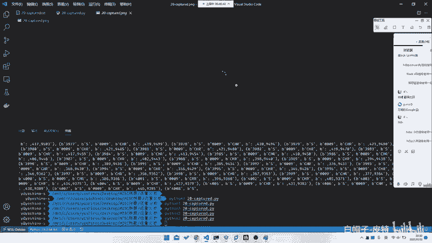

诶。😊，诶。哦。不应该在这不应该在X上浮。我们看一眼。哎，他是不是又好了？就我们甚至不需要管，就如说我们甚至不需要call，就是说它到底是怎么up怎么当的那我们这里是不是就可以直接拿到这个flag了。

比是直接ACT什么33FB对吧？非常好看，虽然它虽然它这个点点点击不是很完整，但是的话他把整个flag画出来了，对吧？那么这样子是不是我们就能拿到，就是其使我们不知道ipad down。

我们只是把数据提取出来了，我们也是可以拿到的。所以说呃拿到你up down之后，其实我们更就是更重要的就是我们彻底理解了这个协议。然后我们可以如果说这道题如果说没那么简单，它会做一些。

就是它这里没有任何混淆啊，那它没有移动到什么其他题外的地方去。那如果说我们这里做一些混淆，就是什么它抬起来之后又移到了其他什么地方，然后移下移下移下移移完之后再画，对吧？也是有可能的那这里的话没有移。

所以说这边就可以直接做画出来的，那是不是就可以做出来我们这个题目了，对吧？所以说这个题目从头到尾不知道大家有没有仔细思考一遍，就是哪几个步骤。就是首先你需要去给他进行数据的初步分析。然后就是比如预处理。

然后就是你要对它进行一个关键词提取。然后最后的话就是把这些关键词或者是数据扔进我们的搜索搜索引擎里面，然后去搜索一下，就拿到我们最终的这个flag。所以说这三个步骤就是不管是应对任何题目，简单题也好。

难题也好。这个题目其实相对来说还是简单的。因为它本身没有涉及到一些比较复杂的一些其他知识。是有的题目，比如说嗯让我想一想那个题目叫什么。嗯，那个题目。不知道大家有没有打过，就是冷箭杯那个题目。

龙肩碑里面有一个那个叫。呃，在这一个文件。就是他用的是一个。呃，是这个吗？呃，IOS对，就是这个。他用的是一个那个叫什么，就是一个。一个home叫什么什么什么什么scatter。

什么什么什么skycrapper还是什么东西的？我看看叫什么了。啊，哎，我忘记了啊，这个叫什么store story，对吧？storeoryway，我忘了我不知道怎么读啊。然后为了纠正一下发音。

不给大家带来错的错的。教大家错的东西，我们学一学怎么发音。tay away storyaway对吧？这这东西偷渡者，他拿这个东西做的那这东西的话，他是一个勾写的，然后这东西还挺这东西当时我还。呃。

这个这个比赛我没打，我后最后后来做了一做，对吧？啊，哎，那他怎么回去啊回去了？在这t away，我看之前还搜过。他这东西就很烦，他这东西够起来。然后他的协议分装，其他协议分装不繁不繁琐。

所以说你这边如果说你要去拟的话，你就需要去完整的把这个协议分装拟出来，去看它的这个叫完去从它的源码里面偷它的协议封装。比如在这个proto里面。在这个ptoco店搞吧，好像是。对他就是定义了各种字段名。

然后是定义了各种就是文件包的协议。所以说你这里需要去逆他的逆他的整个协议，然后才能拿到这个东西。所以这个时候如就是你就是必须要走完三个步骤。比如说你先去给他呃分析，然后提关键词，然后填完关键词之后。

然后最后再去给他这样进行一个搜协议的完整立项，对吧？所以说这就是一个呃标准的题目。所以说这里的话，其实我们是说说就是说的这三个步骤。就是对任何题目都是适用的。不知道大家有没有理解一下。

所以说今这节课其实我们不会讲很多难题嘛，就是很难很难题目。但是的话就是我们会给大家讲，就是任何题目都是有这三个步骤构成的O。那其实的话我们并不是说所有题目都需要我们这么做很多题目很多题目。

我们事实上不知道他的协议，或者说甚至是我们啥都没干，甚至都有可能做出来。比如说这个题。这个题呃X10这个题。呃，这个题目就是那个叫那个叫是这个叫CBRSES里面的一个题目。

但这个题目我没找到他的那个叫就是附件，我电脑重新清空，当时打了，但是就是。

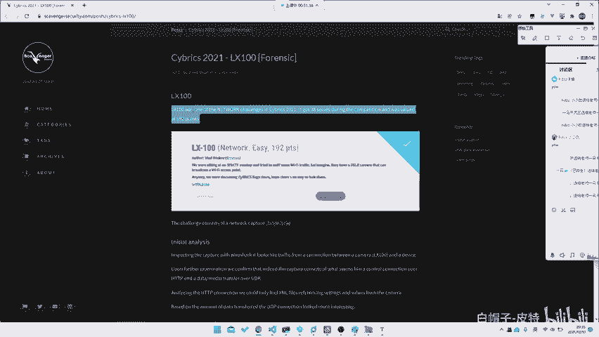

看一眼C of time这个题目。就这个题目，当时我打，当时虽然当时不是我做的对吧？然后就是就是今年的一场比赛，就当时还是打的挺挺挺那个的。打第二把。然后就是这个题目的话。

它就是一个基本上我们我们的right也是这么写的。你可以去看看我们队伍的rap也是这么写的，就。你虽然可以搜索到，比如说说你去搜索一些资料，比如搜索它是什么摄像头啊。

或者说是什么视频流啊之类的那其实我们只需要干什么，就是你蠢蠢的什么都不知道，你把它的所有UDP都导出来，然后直接可以给它fomost。他就只直接出到我们GPG了。所以说你甚至不需要做任何的处理。

就是可以拿到的。就是你甚至不需要理解它的这个叫传输是怎么传输的呀，它的包针构成是什么构成的呀，不需都不需要知道，你只需要知道我们你只需要知道JPG的头是什么。比如说这这里JPG头就是。

B50叉B50叉2200F就这全东西。并且他的那个叫什么哦，不在这里就是只要是他的那个叫什么？pose啊，它这里没写，就是FFD8嘛，就是FFD8之后，然后你把他的所有的那个叫。

所有的按照这个位置上提取出来，提取完之后全部给他依次看一遍，哎，你就能看到这张图片了，对吧？就非常的。非常的怎么说呢？就是。就是其实不需要任何其实没有任何难度。就是即使你不知道这个文件协议。

你不知道这是个像头，什么都不知道。你说你直接fomost都是可以fomost出来的，对吧？啊，当然你直接对于整个包fofo出来的，你必须要进行一个就是导出之后再进行。因为它是分分分。因为它是那个叫什么？

因为它是分包的，因为它IP因为它包包包大还有过大，它在IP上面分那个。然后都分包了，所以说这就是这样一个题目，就是你甚至什么都不需要知道。那比如说你看这它怎么写的啊。😡。

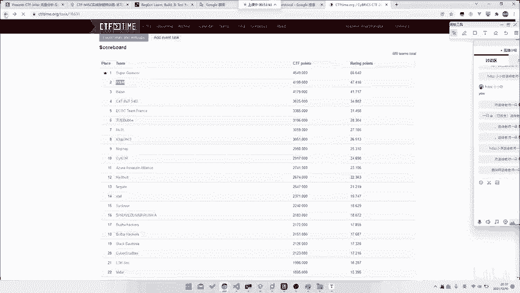

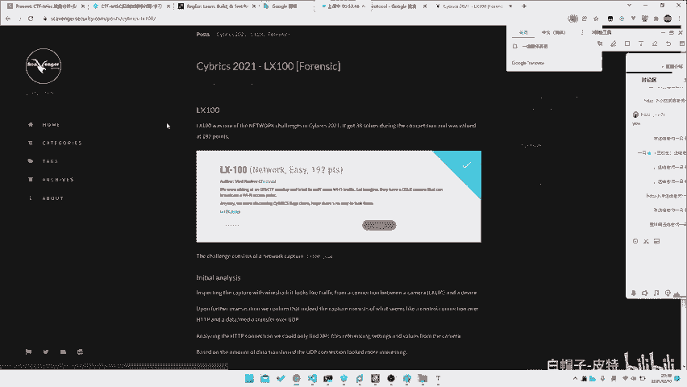

他就告诉你的initial analyze什么什么traffic from condition，你不管它呃，不知道大家看看我们还是翻译成中文吧，照顾一下大多数人。哎呀，无法翻译。啊，好对吧？

经过进一步检查知道是什么有DP分析什么，我们只能通过找到查描根根据数据的传出来，由DP起来更有趣。然后我们专注于属据DP提取的链接上第一个包并开始分析它什么在16性质中检查常用的文件。

有一些有一些自己的，然后似乎是JPG文件，删除相机数据我们留下了一个有效的JPG对吧？由于超过一共400个代单个JPG，我们制作一个脚本从什么时提取出来，对吧？然后就其中某一帧就A出来了，对吧？

那显然的话这就是。呃，这算不算是intal的一个solution呢，就是算不算预期检呢，其实也说不准，对吧？那其实你说可能它这个预期也就是不需要你分析，你直接去formmost就可以。

就是这种题目就是并没有并不说是。其实看似能直接出来，其实的话它也需要你有一定的一个搜索能力，或者说是你有一定脑洞。就是你必须要知道它是A是否是UDP。

就是你首先需要把目光聚集到UDP上面才能做出来这个题目，对吧？所以说这就是这样一道题目。所以说其实对于所有的Mi题目来说，并不是说呃都是一个很难很难。

或者说难题目并不是都是需要你去可你并不是那种都是需要你去什么呃什么掌握各种miss技巧啊之类的。你只需要有。怎么说呢？重点核心部分是什么？就是mask的核心是什么？就是一。你需要有很强的脑洞。

因为脑洞对不上的话就没用，对吧？2。🤢，你需要有很强的搜索能力。如果说你没有搜索能力的话，你什么你光靠你现有的知识肯定是学不会的。3。你需要有很强大的学习能力。对于任何新的知识，对于任何刚接受到的知识。

你甚至需要5分钟，甚至是10分钟啊，甚至是或者说你刚看到你就需要去会，对吧？这个协议还相对来说比较简单的就是。他可能是嗯。就是它就只有1个PDF文件。那如果说对于一些更加复杂的协议来说的话。

它的它的协议内容就不单单是说是。不单单说是几页只那么简单了，它会有一个完整的一个，甚不至是60几页，或者说是直接是一个什么HOE的一个呃标准文档呢抄出来给你做。那么这时候你也需要去很快速的学会它。😡。

所以说这个时候就需要很非常考验我们的学习能力。所以说大家需要有，如果说真的要去做mik，或者说话m做的很好的话，这几点能力是不可或缺的。

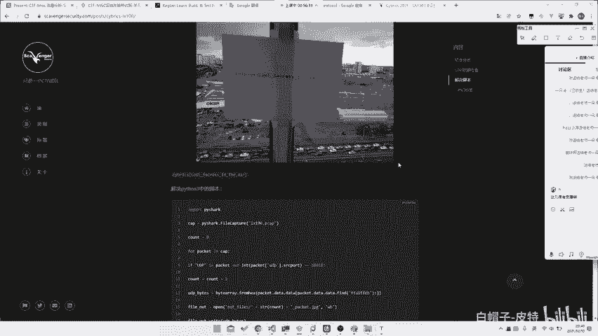

那当然回到我们的这个流量分析上面来，流量分析其实说白了呃，我们能讲的其实也不是很多。我们只能把就是把这个叫完整的一个，比如说HDP流量，或者说USB流量，或者说之类给你大家提一提。

那至于说流量里面它这个流量协议本身那请你去学计网，也不需要去学我们的这个。呃，不需要去学我们的这个叫什么之类，就是既往上面都会讲到。那所以说对于这种题目来说，best solution是什么？

就是你要去不断的做一个进行一个做题。做题不是为了去做为了能够争取以后做到原题，而是为了啊我们在做题过程中去吸取这样的一个经验教训。比如说这次你做题没做出来。事后你看了玩别人的rite up，发现哦。

别人是因为用英语搜索了，我没有用英语搜索。那么这样子以后从此以后你就要得到一个教训，就是以后用这几节课都有录播的。从此以后你就又需要去试否用其他语言去搜索一下。比如说这次你做出来了，你别人没做出来。

你做出来了，那你去看别人写的rite up哦，他说他怎么分析怎么分析怎么分析。而你又恰巧哎看到了某一个文章，对吧？那所以说你就要去看哎，当时我是怎么看到这篇文章的对吧？那么这里面有哪个点比较好。

就是哪个点是我们应该去记住的，或者说是哪个点是我们应该去。哪个点是我们应该去以后去一直用的，甚至说可能是你某个无意之举，就是无意间哎，你去想了一想脑洞某脑对上了某个脑洞，A就做出来了。

所以说大家需要去总结规律，在做题的过程中，不断去学习，不断去掌握新的一个。学习方法其实相当于是学习不是为其是授人以鱼，不如授人以鱼吗？就是你通过掌握好的学习方法，比掌握一些更多的知更多的知识更有必要。

对吧？嗯，但是如果说你想掌握的更多知识。你也可以去上我们的课，我们课上也会讲很多的点，就是会给大家把这种点都挨个给大家提一遍。但是如果说你真但是如果说你想成为独立成长。

或者说是你想去嗯提高到一个相对来说很高的境界，那就需要你去花费自己的时间去思考出你自己的一套学习思路，去思考出你自己的一套做题策略。对吧所以说这个东西是我我可能是我比较想教给大家的就是。

如果说大家想去学这种知识点之类的，大家直接刷题好了，没必要听我讲，对吧？那我那我在这边有什么可以给大家就是去做一个重点提醒，或者说是分享的呢？就可能是就是这种学习方法，就是呃我也可以给大家讲一讲。

就是当时那个叫就是我一开始一开始就是纯刷题。刷题刷了有半年，但是那半年时间其实并对我来说并没有增长多少，我只是把基础部分掌握掌握下来了。那面对新的题目我还是不会做。所以后来我干什么？就是我去去打比赛。

我直接去做新的题目，我去做只是做在做新的题目的过程中，因为没有任何rite up可查。所以在整个思考的过程中，就1。1点的通过对比自己和队友的差距，对比自己和别的队伍的差距。那1。

1点的就把我们的这个做题能力训练出来。所以说这个点，所以说我觉得可能还是嗯。相对来说比较重要的一个部分，对吧？希望大家也能够以后能够记住这个点，对吧？miss课。

我们这个流量分析三节课就就其实就到这里就已经因为我们说老师自主文中一节课嘛，三个天才只有90135分钟，135分钟。很少了。如果说你把它作为一个专题，你讲一天8个小时都不为过。😡。

但是更何况说可能我们甚至需要讲一个礼拜之类的，都可都都可以讲到。那当然你甚至说你要学这么多知识，学一年都不为过。那1个11说135分钟能讲什么东西，其实也就只能把我们刚刚之前讲的几些内容讲一讲。

就是稍微大家挨入个门，然后大家看一看怎么做题。然后大家再家带一带知识点。然后最后看一看大家去如何去给他就这种纯做题型的技巧。那当然最后还是希望告诉大家，就是希望大家能有一个嗯比较好的一个学习方法。

学习策略。

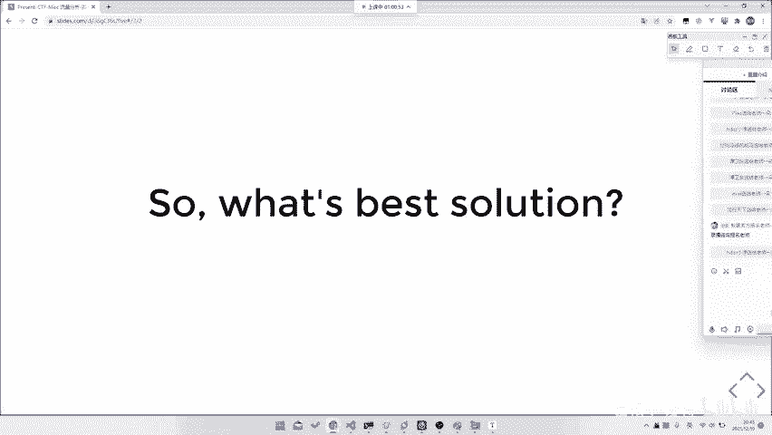