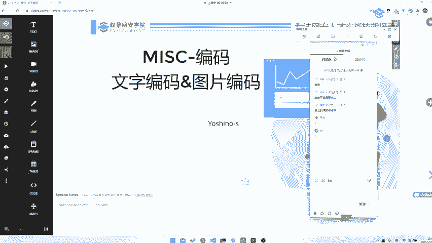
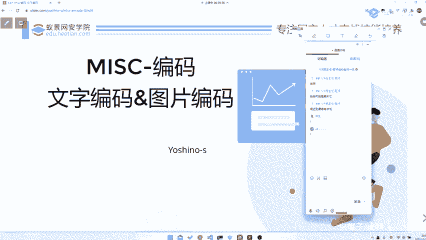

# 2024B站最系统的CTF入门教程！CTF-web,CTF逆向,CTF,misc,CTF-pwn,从基础到赛题实战，手把手带你入门CTF！！ - P54：CTF系列教程视频 — misc 文本编码（序言福利） - 白帽子-皮特 - BV1m64y157UX

。

然后今天开始我们就正式开始一个呃miss里面的编码，就是一个详细的一个部分。编码。6哦，就是我们今天就主要讲一讲编码里面的一些比较呃比较悲悲基础的部分，就是一个文字编码，还有一图片编码。然后的话就是嗯。

我不知道你们之前有没有上过我的课，就是因为我之前开过一节公开课，然后也上在特训营那边上过两节课。然后的话呃应该是有同学之前上过的。然后的话没有上过的话，给大家讲一讲就是。呃，我自我介绍之类的就不说了啊。

就是讲一讲我上课的一个习惯吧，就是。😊，就是呃我可能就是会主去注重，可能会去讲一下就是。去大家去了解一下，就是这个编码或者就是这种题型背后的一个原理，包括是。因为我平常的话。

因为现在已经嗯比赛打的相对来说比较少了，就是可能是出题会多一点。所以说我也会给大家讲一讲如何从出题人的思路去涉及到题目。这样的话也有方便于你去理解。就是。从源头去剖析这道题是嗯怎么出出来的，怎么做。

对吧？我觉得其实这样子的话，其实比相对于比那种什么纯直接去讲那些。啊，工具使用啊或者说套路性的东西啊，当然套路性东西也是有必要讲的，因为没有套路性的东西，你也不会做题，对吧？

但是我感觉比纯去讲套路性的东西是可以给你更多的思考的。😊。

就是纯套路性的东西谁都可以讲，谁都可以去学。但是我觉得嗯可能我就是如果说你们就是毕大到是候花钱过来听课了嘛，就是。我比比起听我的课。

可能比起其他直接去看直播里面去看看一些博客里面的更多的就是一些我做了这么多题之后的一些思考，一些总结下来的一些。呃，一些包括就是。呃，也没有纯套路性的，就是一些对于题目的思考。

我觉得这部分思考是比较重要的，好吧，然后就。然后就是大家如果有反馈的话，就直接在那个叫聊天里面发好了。然后我这边都是可以看到的。然后。咱就直接开始了，先来。😊。

玩个小游戏，我不知道大家在不在线，对吧？在线的话，大家可以玩一玩这个小游戏。😊，然后。呃，这是一个。这确实是我的电话，然后你们可以尝试去搞一搞，对吧？如果能搞出来的话，我们给大家嗯几分钟5分钟的时间。

😊，我手机放在边上，等大家一个给大家可以过来发个短信，或者说是给我打个电话也可以。😊，然后第一个发短信的同学可以。加我微信名10块钱红包好吧。😊，然后手机放便上了，然后等拿他电话了。😊，大家可以先玩一。

玩不出无所谓，对吧？那你如果说你都直接能够出来了，其实。😊，那其实我相信你的水平还是挺有的，就是。至少一些基础编码是有基础编码能力是有的。呃，大家可以去尝试玩一玩。各位同学要学会学会学会手看懂手写。

看懂手写字母啊。😊，这个。指不定哪天你看到一页纸密密麻麻写了256位has，让你手动抄下来，这也是一个能力之一。嗨好了，我们收到了第一条短信。😊，然后。请这位同学把你的。

请这位同学把你的微信号发再发发给我，我等一会儿给你发10块钱红包，好吧。然后好，那我们这个游戏就结束了，就恭喜这位同学不知道是哪位同学啊。😊，对，这个我我这位同学好像水平还挺高的啊。

就是我觉得他应该可能很多东西都了解了。😊，那我们开始讲，对吧？😊。