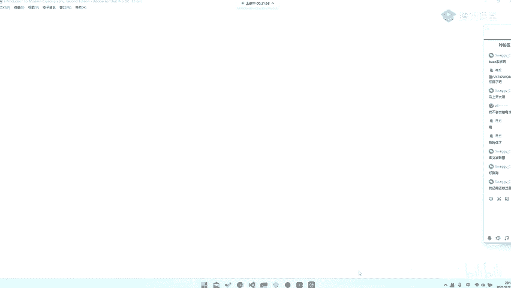
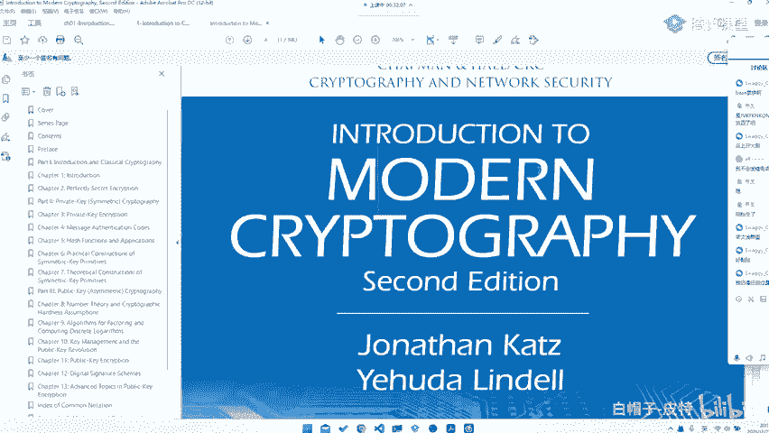
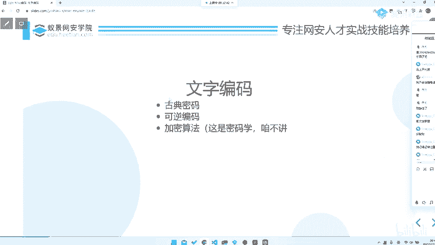

# 2024B站最系统的CTF入门教程！CTF-web,CTF逆向,CTF,misc,CTF-pwn,从基础到赛题实战，手把手带你入门CTF！！ - P55：CTF系列教程视频 — misc文字编码类型 - 白帽子-皮特 - BV1m64y157UX

。刚刚这个题目就是一个非常经典的文本编码。那么文本编码呢其实。那我们首先看看什么是文本编码。😊，编码就是这个编码的定义之类的，我们就。为什么要在这边贴到这个东西？

就是为了告诉大家编码定义是这种很规范性的那其实对于我们来说，文本编码其实通俗来讲就是从一种文本变成另一种文本，或者说从一种信息格式变成一种通过文本的形式表达出来，对吧？那么比如说我们这边右边贴一张图。

那你虽然你大虽然可能你看不懂这是什么东西。呃，就是那个叫安全多方计算里面的，就是一个遥气制的一个协议。但是我们这个我们不call，但是我们可以知道，这就是一种编码形式。😊，他通过这种编码形式。

比如他去用这些混淆电路啊，或者说是这种不经意传输啊，去把这个信息编码发送计算，最终拿到了我们需要的一个多方计算的一个结果，对吧？那这就是一个编码。那么在ms里面。我们这个编码是什么呢？就是文本编码的话。

其实就是主要是看这三个部分。呃，mask其实我知道大家相信我大家之前看到过。啊，也应该也听过很多入门介绍了，就是。我我这我这边为什么要讲这些东西，就是我为了给大家一个概念，就是告诉大家什么是最基本。

什么是这个东西的本源。我相信这是有助于大家去理解题目的啊。😡，就是。它最基本的东西是什么？就是文文字。那么我在文字上我们可以做什么手脚。比如说我们去可以给它替换啊，比如说我们去给它通过换一种编码形式啊。

或者说我们去考虑文字在一个电脑里面的储存形式是二进制，对不对？😡，比如说我们的英文字母，它是的阿斯克玛中文字母，它是有TF8，当然有可能GBKGB2312之类的。😡，这些东西但是它归根结底都是二进制。

那它只不过是在这个二进制上做一些编码和解码，就是信息层面上的编码解码，然后最终再进行一个表达输出。😊，那么我们最重要关心的是哪一部分？就是在二进制层面，或者说是在信息层面的编码和解码。

才是我们需要去关注的。它的表达形式只不过是。它的表现出来的东西而已。所以说我们要抛开剖析，剖析它的表面的样子就是。你这什么之前说是之前有一个什么说是看山是山，看水是水，看山不是山，看水不是水。

看山还是山，看水还是水，对吧？那这就是其实跟差不多，你要看到文字想到文字背后的那些东西，才是一个真正到了一个说是m炉火纯青的地步了。那文字编码主要分成哪几类呢？一般来就是古典密码。

就是可能是呃密码学里面就是那种纯粹的古典密码，还有就是一些可逆的编码，呃，还有就是最终的有一些加密算法。当然加密算法的话，这部分的话，比AES啊RSA啊之类的，你可以去直接看。如果说你想学。😡。

你可以去看我们的。

Introduction to modern。craptography对吧？我们的密码学介绍这本书非常的好。然后。😊。

他去。这就是密码学教材，你可以自己去看，对吧？就所以说这部分我们不是很care，我们主要call的就是前面这两部分，就是可能是古典密码可逆编码，或者说其实主要就是古典密码和编码这两部分。😊。

那么编码里面其实可能还有其他类型的编码，对吧？所以说这就是一个文字编码。那其实图片编码也是差不多的，就是也是这几个部分，就是可能是一些古典里面用的一些常见的套路。然后还有就是一些。

现代现在去基于古典的一些东西去开发的一些新的东西，就是文字编码。

