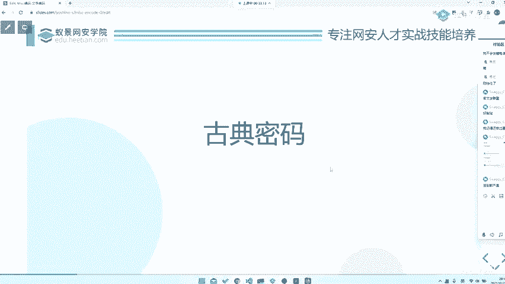
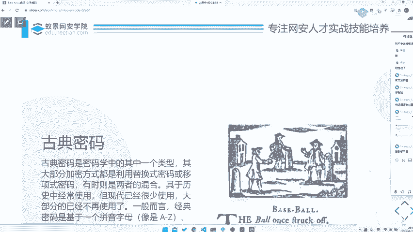

# 2024B站最系统的CTF入门教程！CTF-web,CTF逆向,CTF,misc,CTF-pwn,从基础到赛题实战，手把手带你入门CTF！！ - P56：CTF系列教程视频 — misc文字古典密码 - 白帽子-皮特 - BV1m64y157UX

。

那首先我们去讲一讲古典密码的部分。对啦。但是这位同学可能手速慢了啊。这个这种题目在我可以稍微给大家说一下，这种题目在大部分比赛里面都是签到题。😊，签道题它存在的意义是什么？就是确实签到都不是。

就是抢手速。就是你需要在很快很快的时间内做出来。所以说你要对它进行一个很敏感的分析。

呃，古典密码的话其实。呃，就是它其实就是密码学中的一个类型。就是比如说我们去就是它就是现代密码学古典密码学中的古典密码那一部分嘛。呃它其实大部分的话就是用的替换或者说是移位。那么替换和移位就会造成什么？

就会造成它的不可区分性是。它是有具有可区分性的。呃，可区分性、不可区分性这部分的话也是密码学教材里面的东西了，我们也不会过多的提到。但是的话呢你需要注意一个问题，就是。一般来的话，它是一种基于一个字母。

就是或者说是然后他去对它进行一些简单的操作。比如说对它进行一些嗯。四驱啊或者说是其他上面的一个。次序上的替换，或者说是就是直接把整个字母替换，对吧？那么。😡，稍等一下啊。我看到有个同学加了我的微信。

但是我不知道是哪一位同学，再说吧。😊，然后这就是一个古典密码学。那古典密码学它也要注意一个问题，就是它是它是一种很简单的密码学，它是基本是基于手动操作的。

这就导致它的可逆性其实是非常就是它的可破解性其实非常高的。所以说你可以通过一些简单的操作，就会给它破解掉。你甚至你可能对最简最简单的你去做一些词频分析也好，你复杂一点的，你去做一些爆破啊。

或者说之类的呀。😊，呃，都是可以会对它进行一个很快的输出的对吧？对，频率分析。