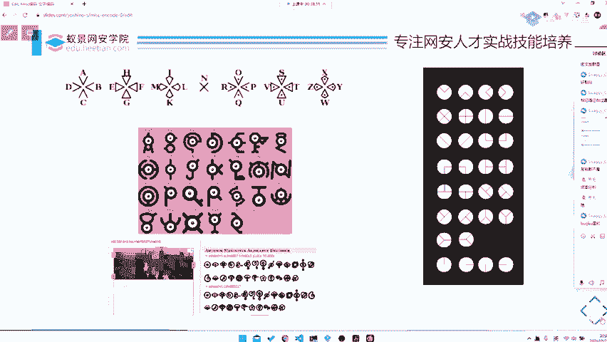
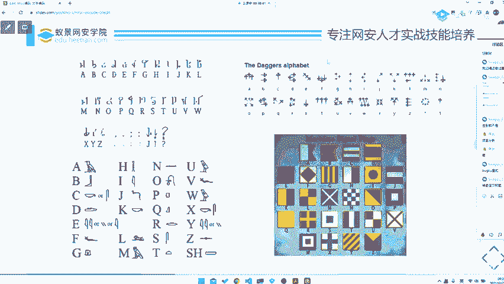
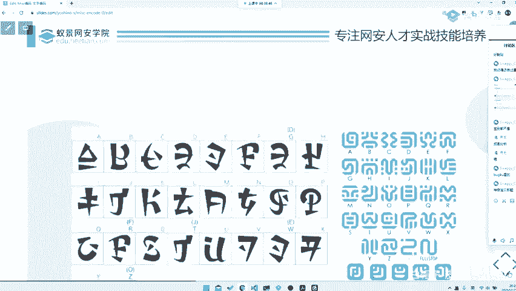
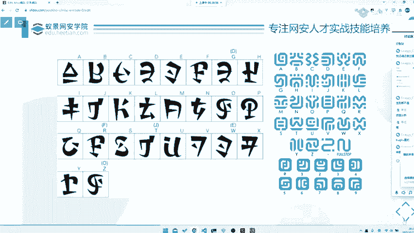
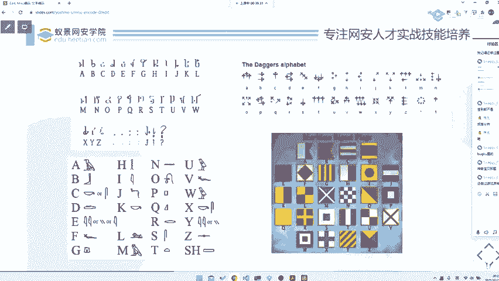
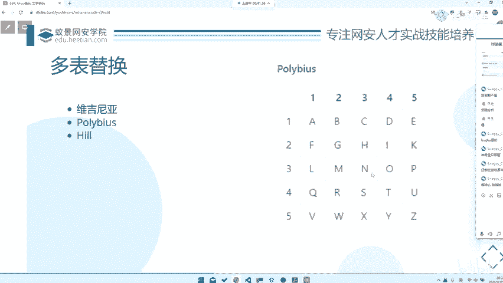

# 2024B站最系统的CTF入门教程！CTF-web,CTF逆向,CTF,misc,CTF-pwn,从基础到赛题实战，手把手带你入门CTF！！ - P57：CTF系列教程视频 — misc替换式编码 - 白帽子-皮特 - BV1m64y157UX

。

然后的话替换密码，替换密码的话就是一个最常见最常见的，相当于就是什么呢？把A替换成一个字母，把B替换成一个字母。比如凯撒。凯撒的话，我相信大家都是很了解的吧，就是。😊，凯特的话。那么它其实就是ROT3。

对吧？那ROT3的话，其实。大家也知道知道怎么解了，就是因为大家可能大家应该都知道，就是英文里面出现最高频率就是E，对吧？E这个字母出现频率最高的。然后你去如果说你的样本是够广的。

如果说你的样本是够广的，或者说是你的呃你的密文是足够足够足够大的。那么你是可以直接去对它进行一个词名分析，然后拿到的。那当然还会有一些其他的一些替换密码，比如像右边这种猪圈，对吧？

那这种密码就是一些很它是它的密码表是固定的。替换密码有个东西叫做密码表，就是它会去把密文和铭文进行一个对进行一个对照，对吧？那比如说右边这个就是一个。😊，主卷密码。所以说这种密码的话，其实就怎么去解题。

😡，背下来，或者说是你去熟悉这种每一种编码，就是每一种这种替换密码的格式，或者说特征。那比如说你看到类似于这种点啊，框框之类的，它可能是不是这种间框框，可能是圆框框，这是有可能的。那么你就需要去知道。

哎，这是不是朱圈密码，然后你去拿到密码表去尝试。那么一般来这种题目的话，它会在什么地方做手脚，就是会在这种图形的样式上做手脚。它大部分情况下是不会去替换密码表的。就是如果说你把整个密码表全部打乱了。

或者说替换掉了，那么这题不可做，对吧？呃，这个出题人也也也。😊，说白了水平也不高。那如果说他是他是一个真正高水平的出题人，他可以去。在前面去做一些。图像上的一些嗯技巧转化。

比如说把一些把图片一些LSB啊之类的，然后再去提取出来我们这样一张朱俊亚的图，然后你再去拿图去做替换。所以说这种可能才是一个比较好的一个说是替换编码的一个出题方式。当然了，出题人想出什么题。

或者说你能遇到什么题，都得看出题人心态。所以说有一个点可以建议大家就是不要去打一些垃圾比赛。呃，也不要去做一些垃圾题，那种题目毁脑子会智商。就建议还是去做一些质量比较高的比赛。

那边题目可能会开拓大家的一些思路吧。然后包括这些还有一些其他的一些密码表之类的。这个我们。那你其实你也不需要说是去。你可以把这些东西都记下，就是不需要完全记下来，背下来。你说是A等于什么。

就是B就是什么，C就是什么？你看到这个图形就必须想到什么。但是你需要知道它的一个特征。😡，就比如说这边跳舞小人啊，或者说是这种银河密码呀，你需要知道的。哎，你看到的话，你能够对照起来就可以了。😊。

然后包括还有后面这种就是神奇宝贝里面的，还有包括就是这种圣殿骑士之类的。这种的话其实都是啊怎么说呢？就是你至你至少需要对它的图形比较敏感，就是知道它大概长什么样子。那么到时候你遇到的时候。

你才会有一个对照，对吧？拔合库里的。

嗯。确实。当然嗯我觉得一些一个好的比赛，它是不应该出，它是不应该出现这种图形编码的，就就是这种就是这种图形编码。其实这种图形替换编码的那个这种题目是不应该出现在一个好的比赛，好的题目里面的。

因为这种题目就纯粹考你的一个记忆，就其实没有什么意义了。真正好的题目，它可能会去，那我们之后会讲到一些东西，就是嗯后面会讲到我们再讲到那边再说。

这种也是他这种其实就没什么意义，就是它都是一些你知道密码表很好解，但是你不知道密码表，你就解不出来，就是这样子。然后。

这种就是单表替换，就是它只有一张表，你去直接给它进行一个。对。原神对改更新 impactact里面，它也它的那个language，它也可以去做一些替换。这种的话其实。你说他要考吧。

其实就考了你一个信息搜集能力。但是其实。信息搜集能力嗯，他是他是在mus分类里面，但是他可能以这样的形式考不是很好吧。可能我觉得呃我是这么觉得的，那可能出题人觉得那样好，那我也不能说他什么，对吧？

那毕竟他出的题，他他说了算。

接下来的话就是一些多表替色。多表替换。多表替换的话，其实它主要就是为了破破掉我们之前说的一个词屏分析。就是如果说你单纯的以一张表去替换的话，那么它的词频分析最最多出现哪个符号，最多出现那个sm必定是E。

所以说他会去做一些多表替换。比如说弗吉尼亚弗吉尼亚的话，我相信大家也是可能比较了解它的原理的对吧？那或者说是还有一些那只是一些这种填表形式的去拿这种表去给它，然后对照出这样的一个行列号码。

然后去给它输出出来。包括还有希尔加密。西尔加密的话就是嗯它是一种基于矩阵的矩阵转化的一个加密。大家如果说想去知道的话，也可以去。自己去就是去看一看这种小药品之类的算法。但是的话你要注意个问题，就是。

像很多希尔加密啊，或者说弗吉尼亚加密啊，或者说是我们之后说的一个提换设计之类的栅栏加密，它出来的东西它其实是没有很明显的特征的就是。输输入的是一串单词，输入的是段ask克玛，就是一串字符。

输来的还是段字符。它没有像我们之前说单表题环那样子会出来一些特征符号。所以说这部分的话就是需要你可能需要你去。😊，没有什么取消的办法，就是去一个个尝试。可能这才是嗯，所以说我觉得这种题目如果说出来的话。

都不是很好。就是。特别是有一些出题人特别喜欢套娃。就一层套一层一层套一层，解完之后下一层换继续换个密码，继续套，或者说什么或者什么ROT13完了再炸了，栅完完了再进行什么加密。😊，我没有针对谁。😡。

这是我不说啊，这是但是我真的很讨厌套挖题。那大家也是知道的，我是会给大家出出给一些。一些一些地方出题的对吧？那我是知道的，有些地方确实是明令禁止套娃题的，套题一律不收拉黑。对吧。呃，所以说大家。😊。

我觉得套话题就是低质量的题目，没有任何意义。