# 2024B站最系统的CTF入门教程！CTF-web,CTF逆向,CTF,misc,CTF-pwn,从基础到赛题实战，手把手带你入门CTF！！ - P58：CTF系列教程视频 — misc移位式编码 - 白帽子-皮特 - BV1m64y157UX

。

那么我们当然最后还有会就这种有这种栅栏密码，就是栅栏密码啊，或者说是培根密码之类的，它就去相当于是一个移位式的，就是字母还是那些字母，它只不过把顺序变了，对吧？那这就是一个移位密码。

那么对于我们这么多的一个。古典密码来说，我们怎么去解？那么我们首先从原理层面去讲一讲怎么解。对吧那我们就需要去知道一些。

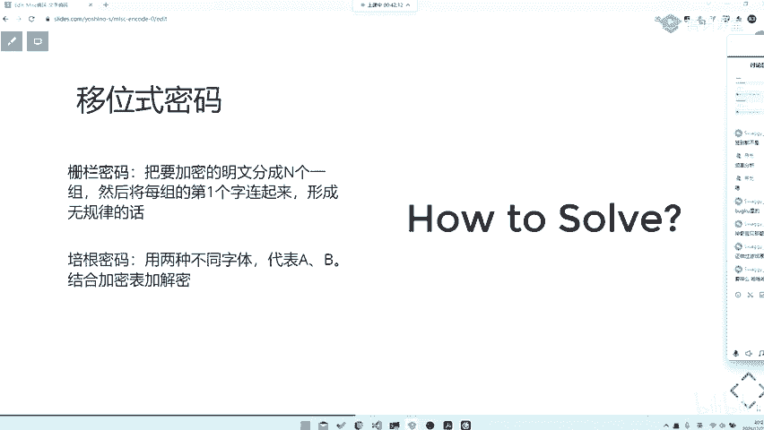

做一些密码学的学习了。😊。

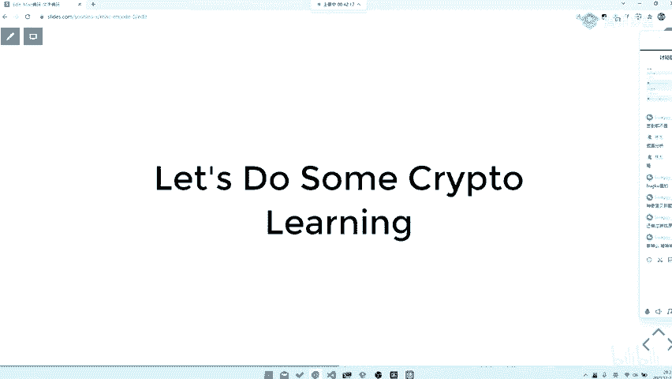

当然我不会去带大家直接去看这个。😊，这本书啊这本书这个确实挺难的，就。😊，就就就也不是，如果说你是这个相关专业的话，你可能会去学过这个东西。但是如果说不是相关专业的话，其实这东西还是挺困难的。

但是我们做一些简单的一个分析，对吧？呃，这个是我直接把我们就是直接把。

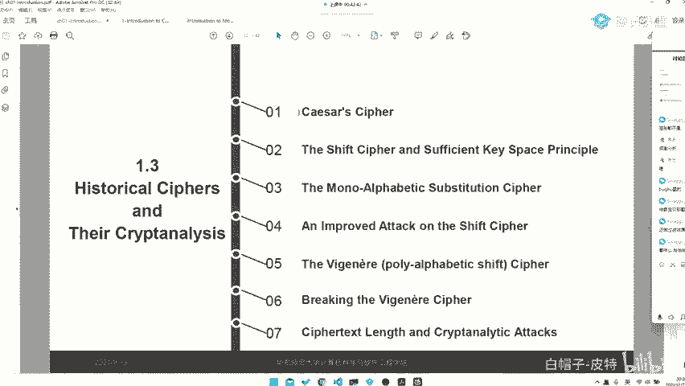

课程PPT掏过来了，但是也是差不多的。就是我们稍微借动它里面的一些东西去看一看。😊。

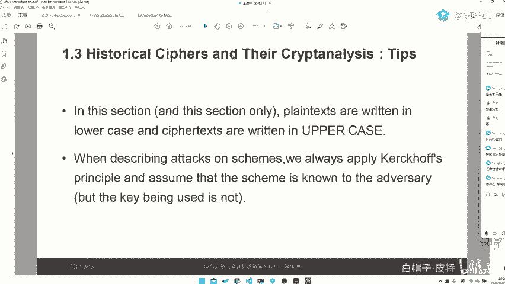

就是。你去看这些凯撒加密，凯撒加密的话，我们东都知道就是这种替换替换嘛，对吧？😊。

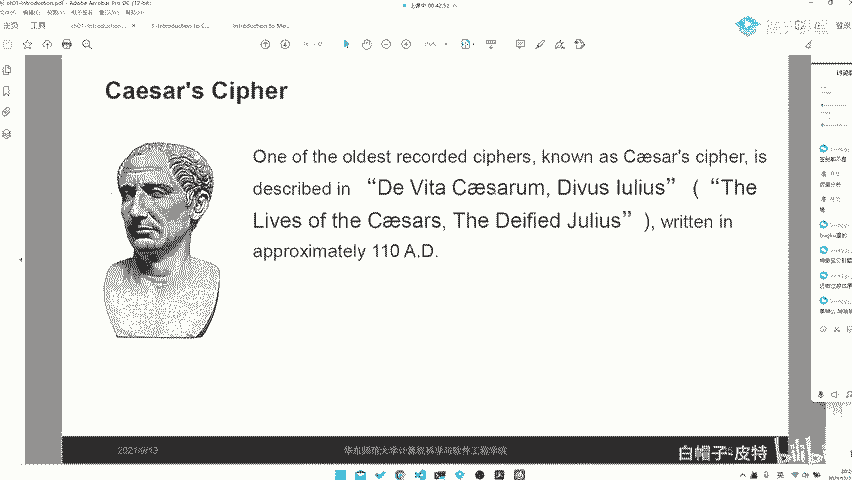

就是比如说这种就是就是铭文，就是密文之类的。当然ROT时代之类的也是一个。😊。

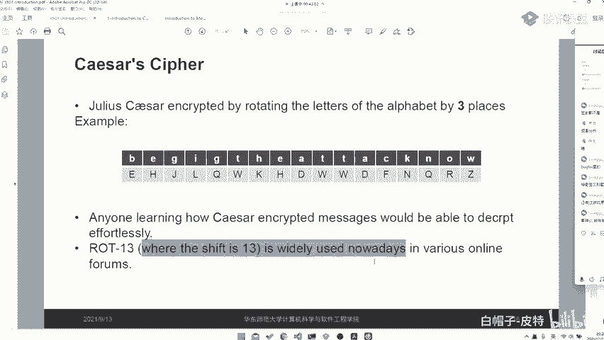

那么当然你续往后看的话，就是。一位加米其实就是这样1个ENC和DEC函数，对吧？这个的话就是一个比较formal的表达形式了。😊。

啊，当然的话当然的话，你可能看这边去会做一个。它会有一个key space，就是对于每一个key，它会有一个移位表。那么再去拿从这个移位表里面去拿到，就这边会有个K参数。😊。

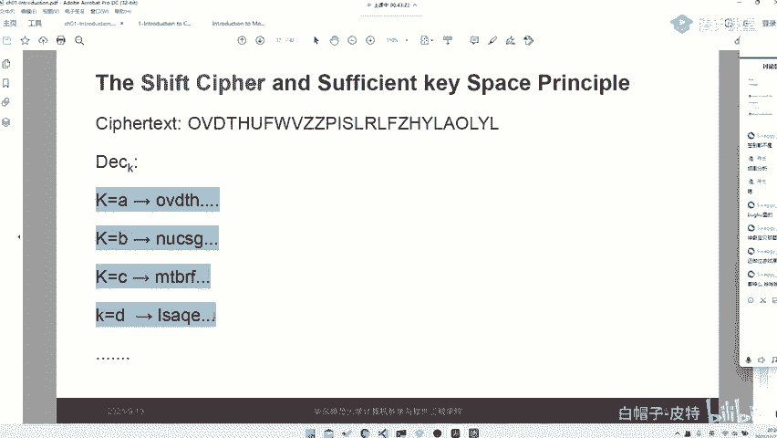

那么这是一个最简单的凯撒的一个移位加密，对吧？😊，那么你要注意个问题就是。你需要有个足够大的一个keyspace principle，就是你要足够大的一个密钥空间。如果说你没有一个密钥空间的话。

那么他最那么他最快玩法就是直接去给他。

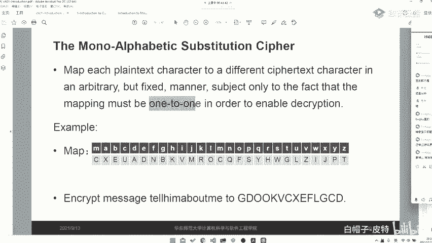

一味破解掉。

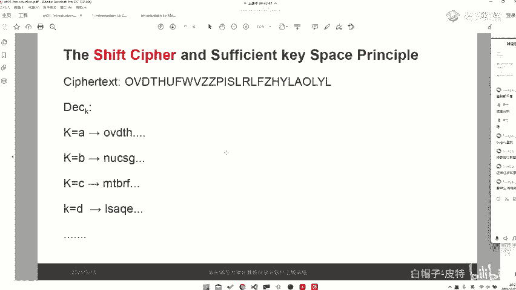

当然的话，你会发现这个密钥空间还是挺大，这26的阶层还是挺大的。所以说它并不代表它它其实还是相对来说是没法直接去暴力破解的。但是呢它并不代表它这个这个这个加密是安全的，因为它可以去做一些对吧？次频分析。

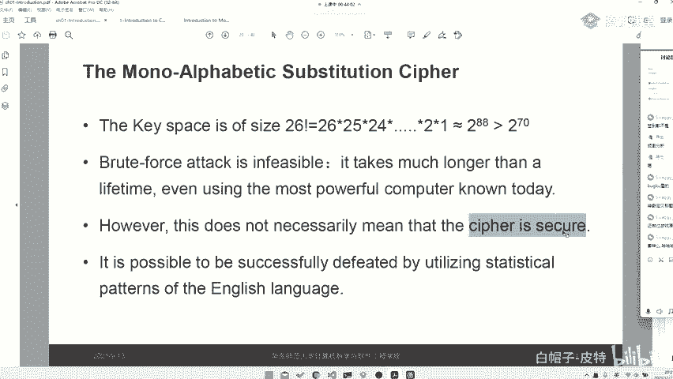

你看这就是一张词面分析的表，E是远远领先的。所以说我们要去做E，就是还有就是可能会有一些对它有一个。😊。

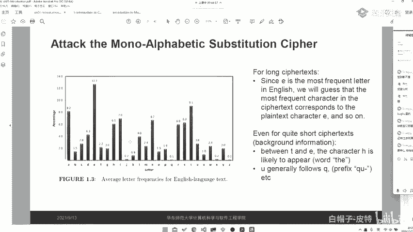

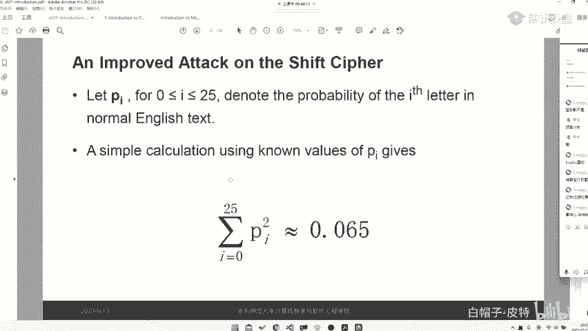

它有一种它有一种那个叫总结规，就是一种统计学上的规律，就是。

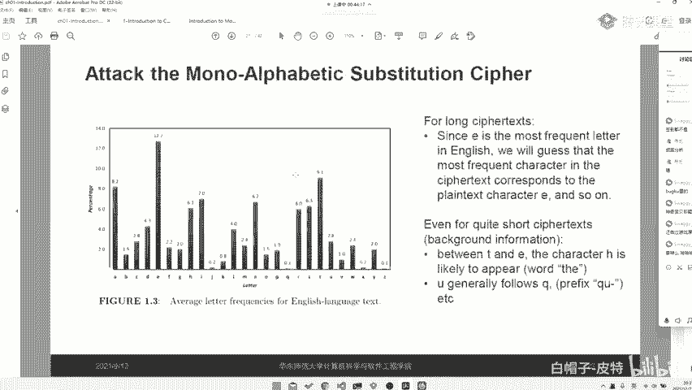

0到25每个字母的平方，每个字母出现的概率的平方加起来约等于0。00650。0。065，这个是统计学上的一个获得的一个古经验。

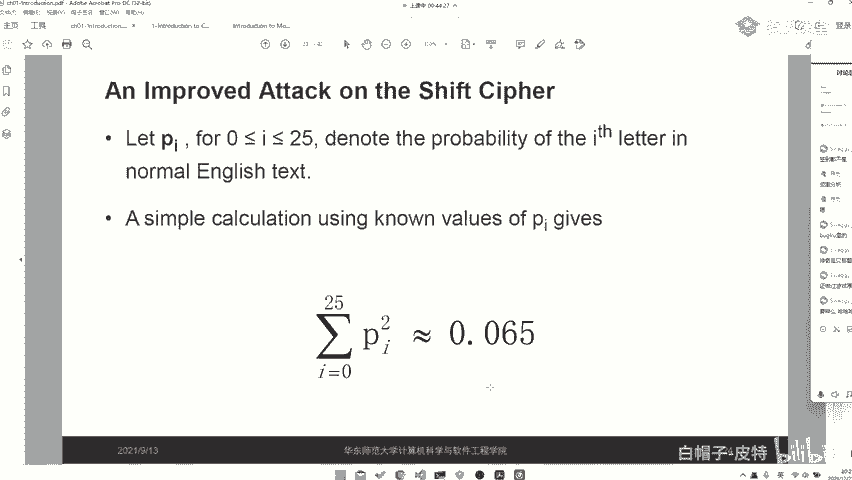

所以说你可以去做一个对他做一个attack。就是比如说你去做这样的一个。就是你去做一个全排列偏了，排列完之后，你去找到K约等于0。6。5%的地方。那么K就是一个K，对吧？那么这样的话。

K就是其实就很简单去爆破了。那么其实就是25次，你去每次计算一下，那么就可以算到哪个是最接近0。065的那么就可以了。那么这就是一个最简单的一个词平分析的一个报攻击。

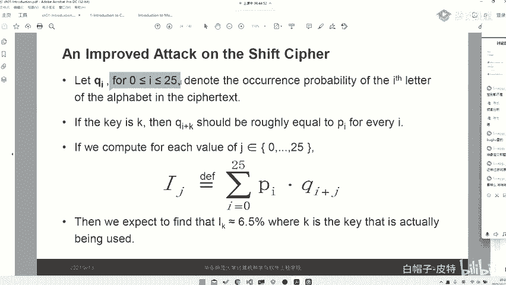

当然这些工具的话嗯，你可以去手写啊，当然你也可以去做一些工具上的一些使用都是可以的。因为有很多工具都是可以直接帮你aumate的。

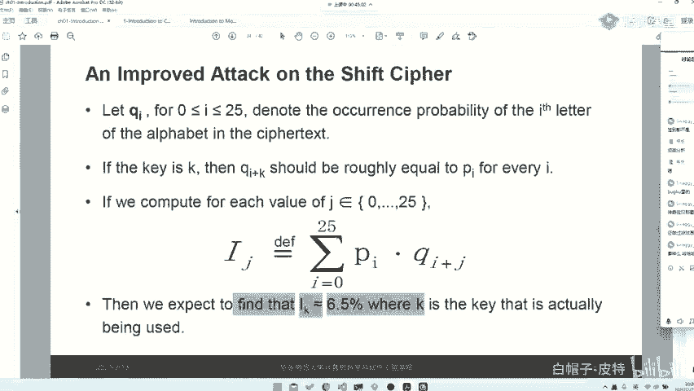

对吧 easy调ultimate。那当然还有这种exercise之类的，那我相信大家都比较了解就不是很不解了。那还有就是这种弗吉尼亚的，就是多表的一种多表的一种shift。😊。

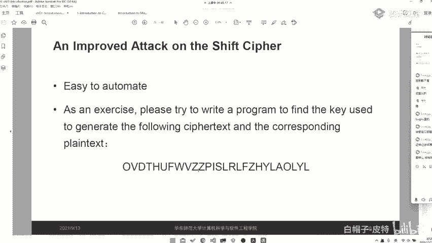

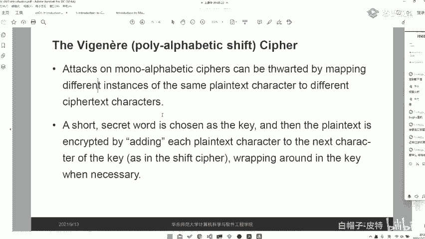

比如说你去看它就是它对于每一个key，对吧？它都会有一张表。

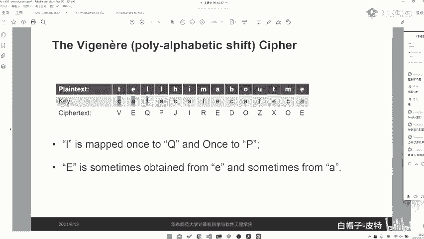

所以说他。所以说对于他的他就是说对于他的这个密钥空间的话是更大的。因为他是把整个ki当做他的密钥了。所以说他就是。你看到他是一个。它是在第1616世纪就发发明的一种算法，但是对它的一种系统性的攻击。

这种攻击就是涉及到了一些嗯。密码学里面的一些基础就是密码学里面的一些东西。就比如说敌手啊、模拟环境啊之类的那我们不讲那么复杂，我们就只是简单讲一讲他去如何做到攻击的。

那么不然话比如说它这个iskey length is no，就是K的长度是 node的话，那么这个任务是相对来说比较简单的那如果说它的是T的话，那么它就可以把它扔放置就是如果说它长度是T的话。

那么可以把它拆分成一个T，就是按T长度拆分成N组，那么每一组的第零位，它就是一个它就是一个那个叫什么，它就是一个凯拉加密，第一位也是个凯拉加密。第二位也是个凯达加密。那么它可以单独去这样。

我们去这样做解。那如果说key长度是位置的。

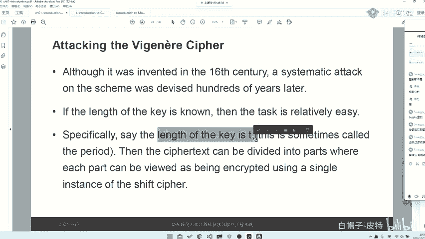

对吧这就是一个就是那个一样的对吧？如果说就是比如说这种是一个常见的一个。你比如说你看这里K，那么对于所有的K一就是这一位，这一位，这一位这一位可以去拿来做。

我们做一个去找这样通过去这样的一个原理去找到一个K1对吧？都是一样的那暴力破解的话，其实是26的T次方，T的长度就是T的就是密钥的长度。那其实这个复杂度是可以在接合范围内的比如说大部分情况下。

我们的密钥长度可能是5A之类的那也是它是make sense的对吧？那是有道理的。😊。

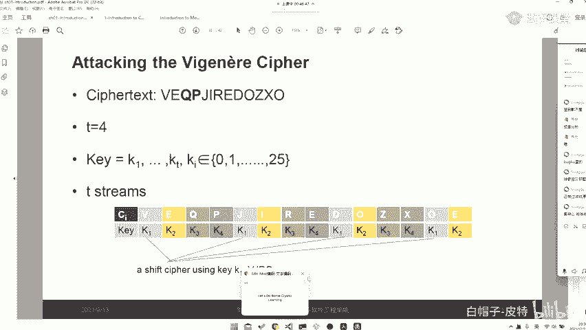

但是如果说我们的长度是位置的话，那么它就可能是并没有。它可能就是攻击难度就会相对来说会上升一点。

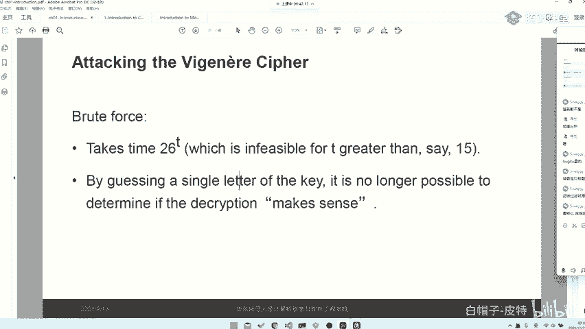

那所以说我们还会有一些统计学的方法，或者说是你看就是对于每一个流来说。我们去把每个的26位移位都去给他。

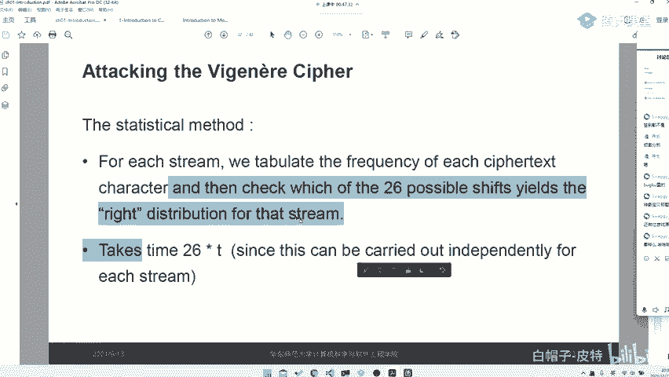

找出来。那么当然它这样的话，其实就是1个26乘T的复杂度了。所以说当然你还会有一些。

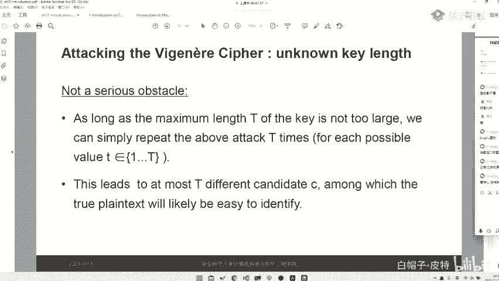

其他的一些。供给，比如说他会有一些。呃，kaski的一些攻击。当然这些攻击都是可能是一些嗯，我们不我们不是做几这种解释。比如说这种thethe这个单词在英文中出现很多，对吧？或者说是这种A啊。

或者说E啊这种他去统计这样的单词的出现的位置，然后去做一些特定的解答。😊。

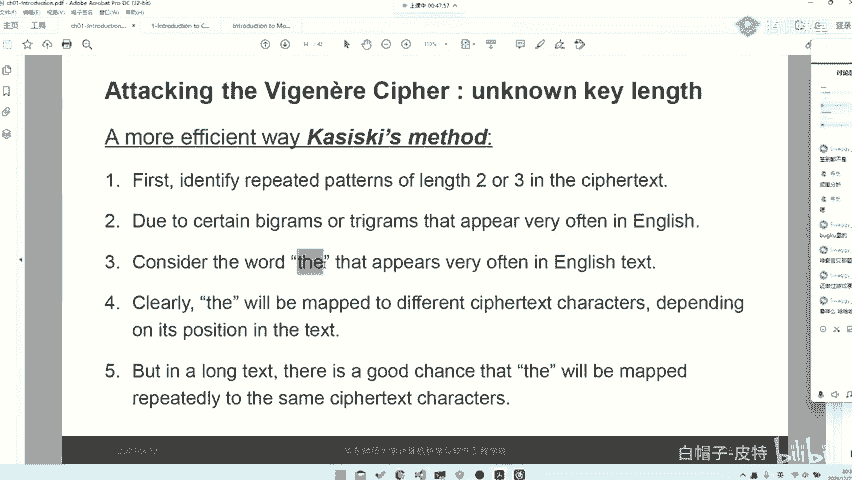

那当然比如说我们还会有这种。后面的这种一些其他的加减名方式了，就是其他的一些。

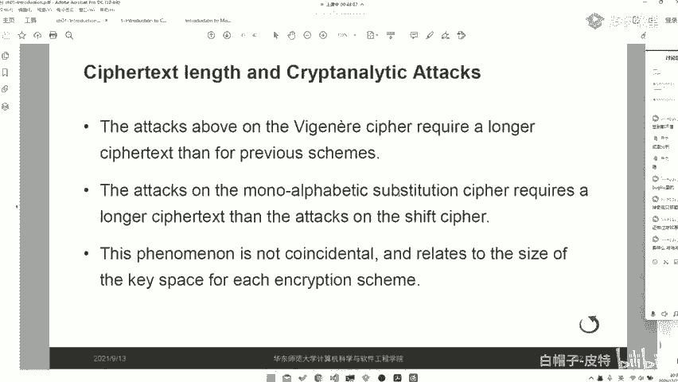

攻击方式这些我们就不是讲不不不需要讲太多了。那比如说他会有其实像这种很多很多的一些。😊，呃，后面的一些密码学的尝试我们就不是很不需要去了解了。但是我们唯一要知道的就是。一种编码我们的入手手段是什么？

就是对于古典密码来说，入手手段是什么？就是去找到它的一些特征。比如说像我们之前说的那种。呃，替换密码的一些符号特征，或者说像我们这种做一些词频分析。

当然工具都是有的那到时候我会之后我会给大家讲一讲工具的一些嗯使用之类的。但是你要唯一需要知道的就是。这些东西它的原理上是怎么样的，或者说它的一些基础，就是它的一些基础是什么？基础其实就是一些简单的算法。

对吧？那么所以说你这对于这些算法，你是需要去熟悉的。那么然后后面的话可能才会去如果说遇到那种很傻逼的套耳题，那你才有机会去给它做出来。😊，那么这就是。

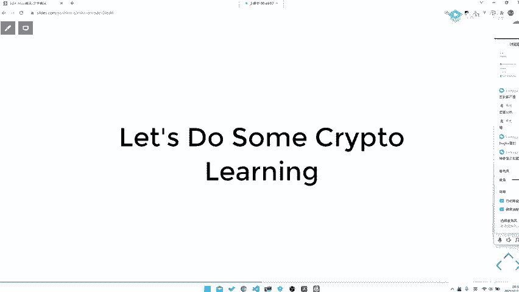

就是这种最简单的古典密码。😊。