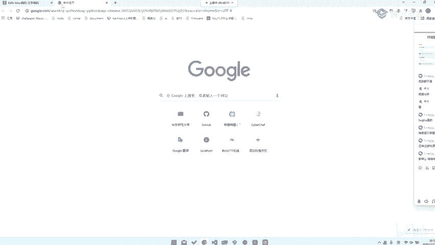
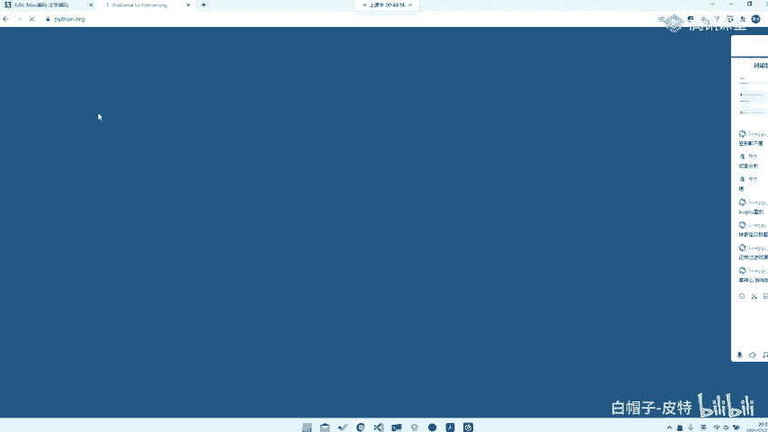
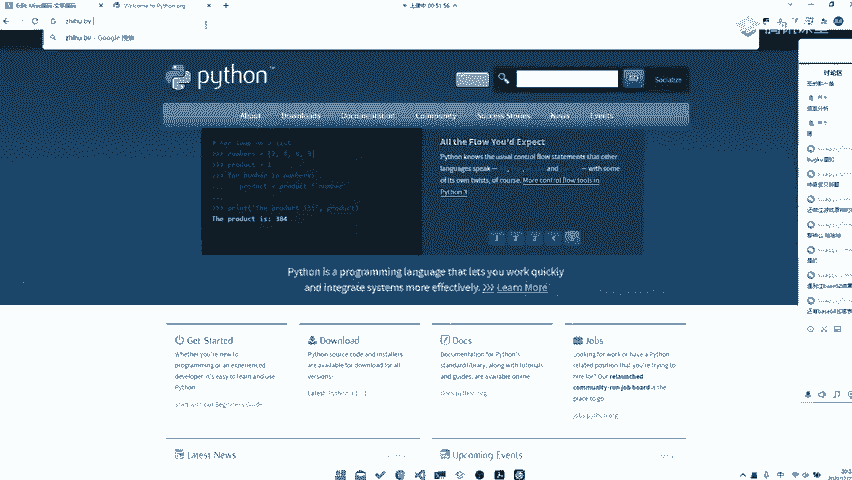
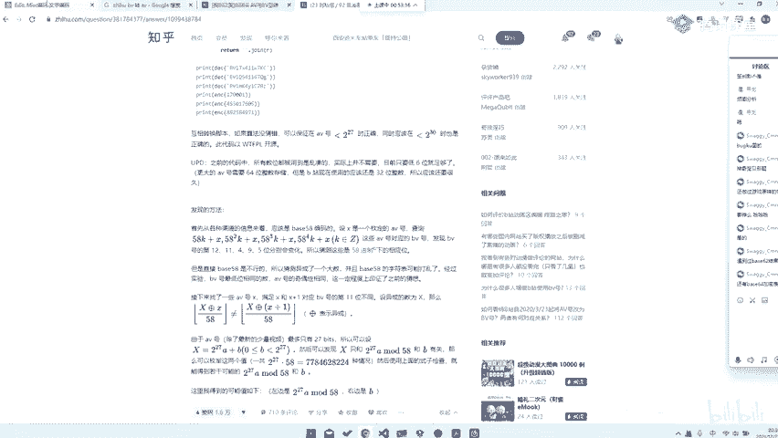
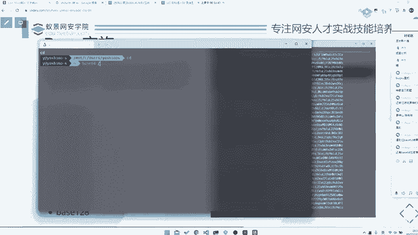

# 2024B站最系统的CTF入门教程！CTF-web,CTF逆向,CTF,misc,CTF-pwn,从基础到赛题实战，手把手带你入门CTF！！ - P59：CTF系列教程视频 — misc base家族编码 - 白帽子-皮特 - BV1m64y157UX

。肯定编码是什么？就是。啊啊。比如说像我们之前说的那种贝斯家族，其实就是那种可尼鞭嘛，对吧？它其实为什么他为什么会发明出来，就是为了。😡，base64是什么意思？😡，就是。把我们的文件以64个字符。

就是以64个字符的字符集去表达。那么它编码的形式又是什么样的呢？那你可以自己去看一些所有的base64编码都有，对吧？那你可以自己去看一些python之类的实现哦，对，这边再提一句。😊，就是上这个课。

请大家务必提前学习python，好吧。

可能这两节课用python用的不是很多，但是到后面的话我们会用到很多的pyython，就是你要去你就是用python去写一些脚本去给他解答题目。

当然今天有一道题目就是问到pyython，到时候我也会带大家去尝试使用一下。就如果说大家没有学过pyython，或者说是呃如果说对pyython不是很熟悉的话，就建议大家多学习学习。好吧。

你python你至少需要熟练到什么程度呢？就是。😊，非常熟练。好吧，那我们这就是那我们继续回来讲贝ase家族。那贝ase家族有贝ase很多了，贝ase32贝ase64最常见的那贝ase16，包括是一些。

😊，非常贵的数字558呀，91呀、92啊、36啊。😡，还上面还有贝s59啊，就是。😡，你能想到的数字基本都有，对吧？那至于他是。这这边还有一个很奇怪的问题了，就是。😊。

可能是你定义的b58和我定义的base58是不一样的。出体人用的那个base58呢，他可能是从不知道哪个网站上找来的。😡，然后当然后你做题的时候，就是你不管用你想的哪个贝斯58库去解都解不出来。

所以说这就是也是很傻逼的一个对吧？那当然这种题目。😊，也是也是也是也是不好的题目之一，我不推荐大家去做。遇到过贝ase63，结果不一样。是的，这就很这就很尴尬，对吧？那你明知道它是b62。

但是你解出来就是不一样。😡，那其实。那你说出体人能过吗？那出体人到时候拉top100，对吧？我用的这个b62。😡，哎，就是。B64加密表不一样，那这就是另外一种考法了。😡，facease64。

你不知道表的情况下，其实你也是可以解的。😡，这个点嗯不知道大家有没有遇到过，对吧？那之后再说，那比如像之前我们那个。😊，我不知道知乎上面还有没有，就是那个就是那个呃BV转AV那个。

我觉得那个东西它就非常的棒。😊，对吧。就是。我不知道还能不能看到这个问题。对，这样一篇文这样一篇文这样一篇文章。他就非常牛逼，就是。😊，他去。当时他是当时大家是没有当时大家是没有一个算法出来的。

然后他就去。他要去通过一些他自己的分析。去给他把这样1个BB号解出来了，看到没？他其实能够发现他是b58编码，然后他就对他进行做了一些分析之类的。然后反正他就去猜测，他甚至能够猜测出抑或出来个大数字。

然后打乱了。所以说呃这篇这这个这个人我觉得觉得挺牛逼的，就是他。😊，这个这个这一篇分析还是挺牛的，就是嗯。这种当然也是我这边码，甚至你可能是后面会出现什么CV转BV啊，CV转AB啊之类的，对吧？

都是可以，都是。😊，不不妨是一种出题思路，但是这种题目已经出过了，再出就是再出就是。😊，叫什么炒冷饭了啊，这个所以说也不是很建议大家再去玩这种题目了。但是你要注意知道的问题就是。😊。

啊啊啊，你至少需要知道这些编码的特征。比如说贝斯64什么特征，贝32什么特征？那比如说嗯贝斯64有什么特征，就是后面会有等号，但是你也会遇到后面没有等号的。😊，就是。比如说我们去。

我觉得实际演示才是比较比较。比较令大家幸福的facease64，比如说杠不们随便杠并杠SH。

那你看到后面就等号了，对吧？那如果说我们去。但是也有可能出现没有等号的情况。比如说我们这样类似64。Ecle。快点又灯好了。但是你要注意问，就是像这种没有等号，或者说甚至有等号的话，它只给你前面半段。

😡，也是可以解的。比如说我们去。比如说PHP它就是可以减没有等号的。它是可以，它不带等号也是可以解的。那当然等号是为什么存在的，或者说等号存在的作用是什么？

你可以去看base64的编码原理去解去解释它其实是用来padding的。其实它有没有都是无所谓的。那么贝ase32特征是什么？就是全大S字模。😡，就是对它是它是用来做padding的。

所以说这种东西你可以去看它的源码去知道它是怎么用的。那当然会有一种情况，就是它直接换表，它不用等号，它用其他符号也是可能的。那么这时候你就要去爆破他的表，或者说是尝试去替换一些表。或者说其实有一种。

很取少的方式。那我们后面也会讲对吧？我们后面去讲到一些技巧性的东西的时候会讲到。😊，那么包括其他一些b编码的话，可能大家就是嗯。也没有什么办法，就是出就是有一种情况，就是题目会有提示你是b什么编码。

那么你可以去试一试。那如果说题目没有提示你b似什么编码的话，没有办法，你只能去一个尝试。😡。