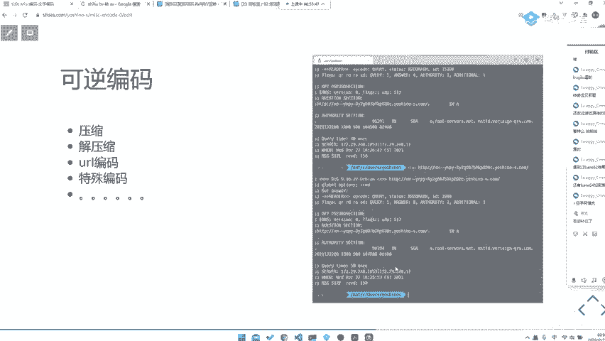
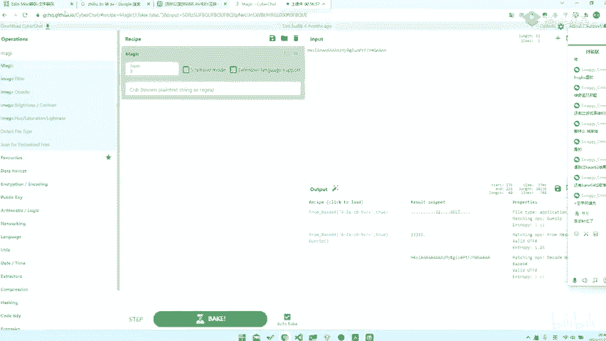
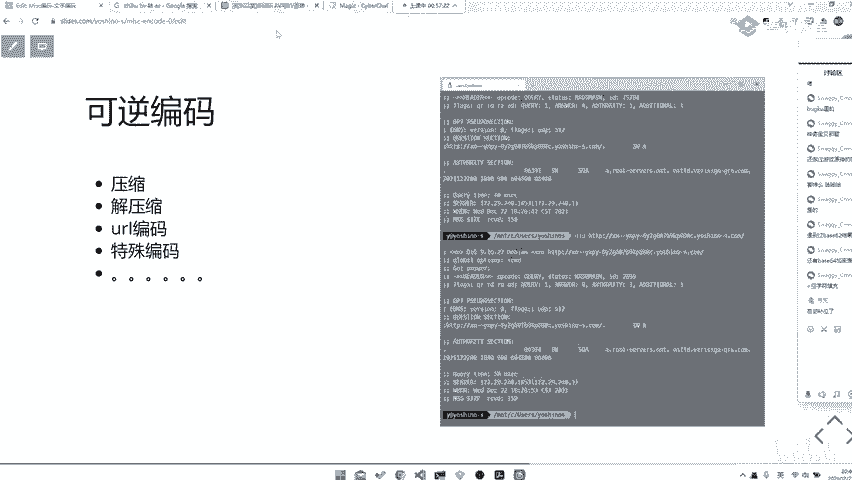
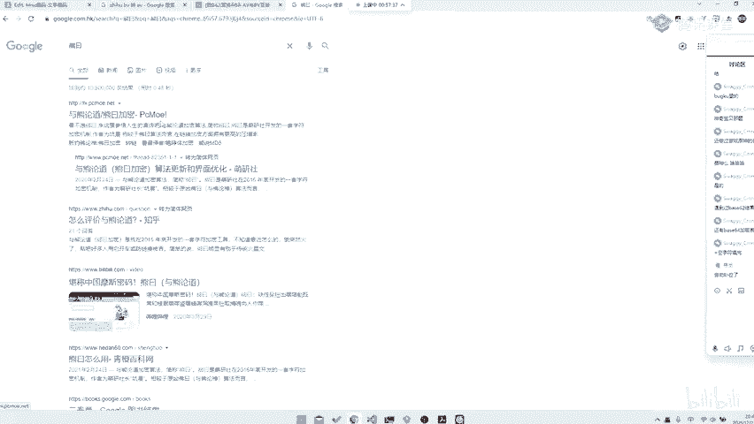
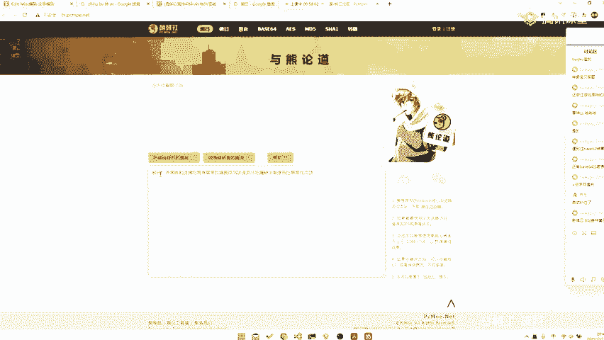
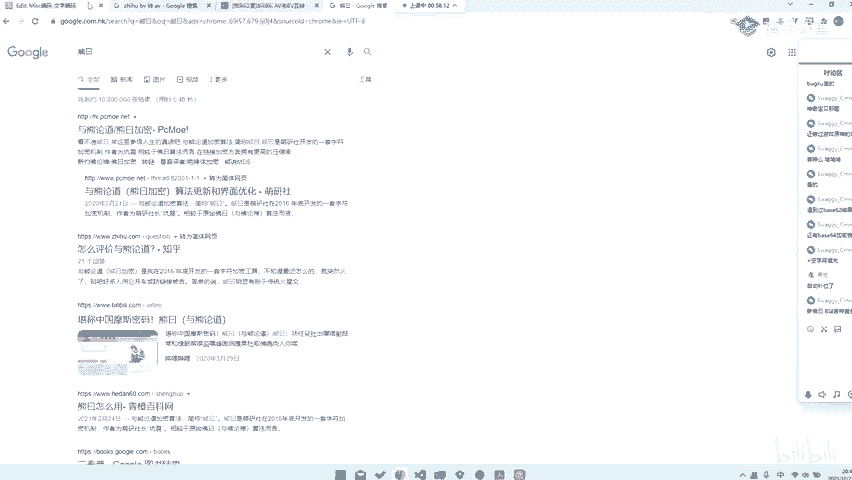
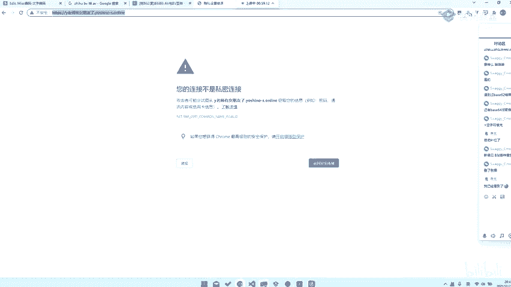
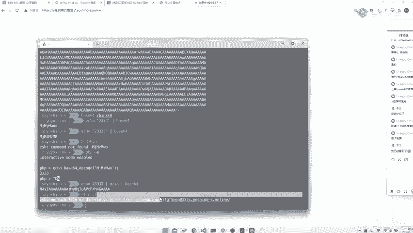
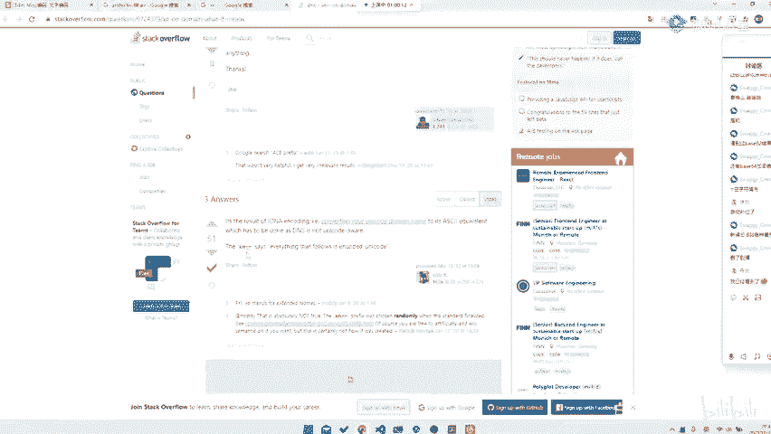

# 2024B站最系统的CTF入门教程！CTF-web,CTF逆向,CTF,misc,CTF-pwn,从基础到赛题实战，手把手带你入门CTF！！ - P60：CTF系列教程视频 — misc 可逆编码 - 白帽子-皮特 - BV1m64y157UX

。

然后当然还会有一些其他编码，就是比如说这种。

呃，我不知道大家有没有遇到过，就是。这种的话就是比如说你去看。这样的形式e233，然后你去个Gzip，然后比如说base64，对吧？出来这样上东西。那当然这样是东西的话，你直接去扔进。

比如说我们提前透露一下，比如说你去扔进sber chief里面。下边7负也许能解。我不确定是什么。对吧你看他就解出来这样串乱码了。😊，你知道对于这种乱码形式的话，它其实可能就是有一些其他形式的编码了。

当然你也有可能是这种形式，可能是一般来可能会存在于一些。比如说是AESDS也是有可能的。比如说这边是更多zep。看他就出来了。是吧。当然你要注意一个问题就是。他因为为什么他因为为什么他这边可以。

那当然你也可以去。我们可以这边去提前给大家演示一下，它是非常magic的。😊，你甚至什么都不需要放。他直接magic就能magic出来。对吧你甚至什么都不需要解。

对这种题目你可以直接扔进sber chief做magic。那我们后面会讲到sber chief，那我们再说。😊。

它这种压缩夹压缩，它会让它你的编码不以文字型出现，以就是就是0到0叉FF吧。就是这种形式出现。那当然编码检查说当然还会有一些其他编码，比如说URL编码之类的那当然还会有一些嗯。😊，URL编码号。

我相信大家也是理解的，当还会有其他特殊编码。这种特殊编码的话就数不胜数了，对吧？那比如说我们甚至会有一些。😊。

呃，什么熊约啊之类的，但是这种题呃。比如说我们去找熊约这种。呃，我相信如果说大家去经常去看逛一些论坛之类的。

经常会出现这种东西，就是比如说我们随便打一串，比如说随便打一串。今天你刷题了吗？叮它就会出来这这的东西。这上东西你其实他你看到前面熊院，你就知道是熊院，那我们直接去复制过来，然后去直接给他。

领悟就可以了。当然还有会有什么活约啊、新活约啊之类的。那么其实做情况就是你直接说把熊约复制过来搜索就完事了。

当然还会有什么什么什么什么授予，什么授予、加米之类的，就对就。这种编码的话，其实你看到一些特征，其实你很明显了，就不需要去。

请合约。这位师傅很懂啊，但是你要这个问题，我们在录屏啊。😡，这个你发的话被我们录屏录下来了，以后录播都能看到啊。😊，然后当然还会有。当然还会有其他的一些。😊，其他的一些编码。

比如说我们这边去测试一个东西删了别播。

比如说我们去访问，因为这边是另外一种其他的用法，就是我给大大大家去看一下。歪老师有女朋友了。比如说点com。啊。啊，我这边没有设置那个，但是反正你不管就是这样个东西。哎，我们不管它，就是这样一个东西。

它是可以去访问的。那么他访问的情况下是什么样的呢？收我们片这样显示这样子吧，我们复制过来。😊。

我们找个地方。粘贴哎，它就变成这样一串东西。😊。

然后你去直接去访问这样称东西的话呢。😡，它又会变成中文，这是什么编码呢？这其实是另一种编码呢，叫做什么ponny code，对吧？那这种之类的其实都是。😊，一些你当然你这种比如说我们遇到刚刚这种问题。

怎么怎么怎么去搜，对吧？😡，那当然你要注意问题，就是你要去这个课这这个东西我之前也提到过，大家自己去里面看就知道了。你把这东西扔进。XN杠杠。比如说插安刚刚这种。看到没？它就出来这么插安刚刚 on左面。

what is what it what it means？那你去看。it a result of IDDNA encoding，那么你就知道它是什么编码了，然后认你去找个东工具去解码一下，哎。

这就完事儿了，对吧？那么这就是一些比较特殊编码的一些那个。

