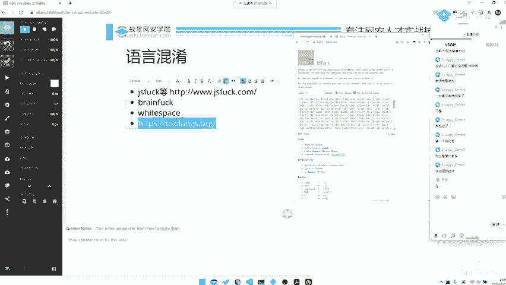
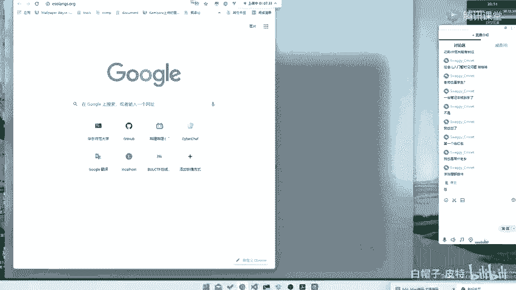
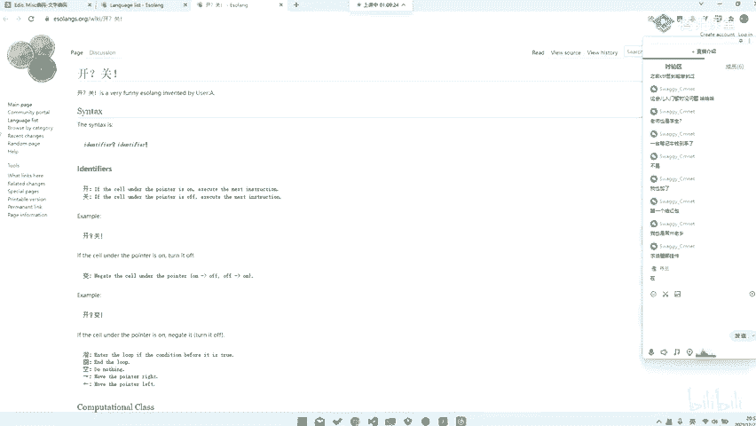
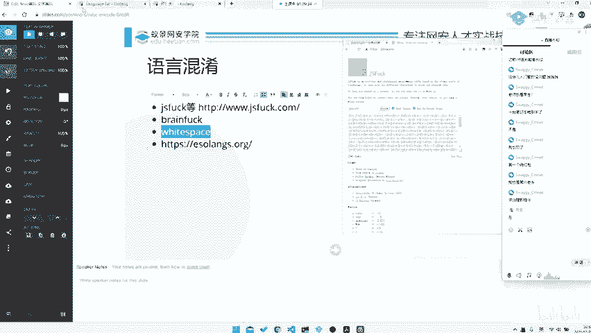
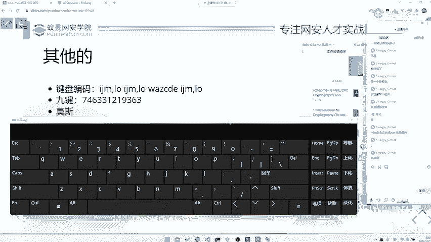
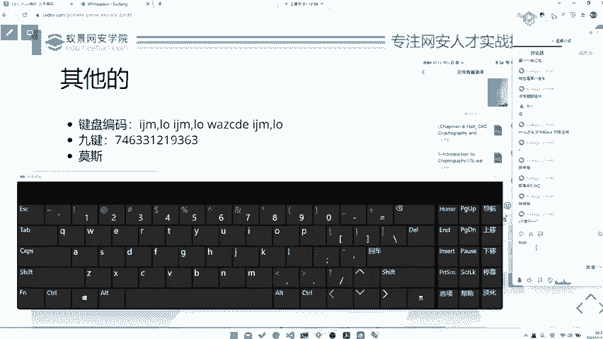
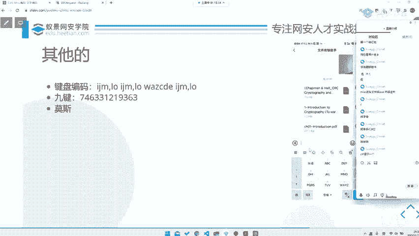

# 2024B站最系统的CTF入门教程！CTF-web,CTF逆向,CTF,misc,CTF-pwn,从基础到赛题实战，手把手带你入门CTF！！ - P61：CTF系列教程视频 — misc 其他语言混淆 - 白帽子-皮特 - BV1m64y157UX

。

其他类型的编码，比如种语言混淆，我不知道大家有没有玩过这种之类的东西，就是JS fuck啊，或者说是一些Sollan之类，就是一些SOlan的东西。😊，这种东西也很有趣，就是。Jf是什么呢？

就是它是一个可以用。哎呀，时间快到了。我们把这发讲完吧。对，但是你要追个问题，就是。比如说啊我先先给大家演示一下，比如说这边alert。😊，23333。enco那他就可以出来这了。

这些东西至于怎么怎么怎么让它去显示呢？那你直接去conl里面，FRcl里面打一下，然后就出来了。但是有这个问题如果它不是alert的话，比如说if。😊，啊，比如说什么呢？啊，F0等于等于1。

然后alert。bllaack之类的。那么。这种情况下。他就是不输错，对不对？那怎么办呢？哎，他就出来了。原理是什么？他就是把EVAL这个函，它用是EVAL去给他把这个东西出来。

你看到EVALsource。😊，然后的话呢，他把它转成为ccl点log就可以了。当然你不这样也是可以的。如果说不这样的话，他就没法。那如果说你这样的话再去用。😡，就没用了，对吧？啊，也是可以的。

没有什么办法。因为只要我把一边开。你看。也是可以的，他会去直接把这东西给它输出出来也是可以的。所以这种东西其实都是可以用来。去给他破解了。CDF签到看到过这些东西。对，当然JSpar是最简单的啦。

你试试可以把这些东西给它搞掉，就是让它一笔一个出不来之类的。然后还有其他加密。那我们下节课再讲，对吧？我们8点45了。😊，然后给大家5分钟时间休息。😊，OK50了，我们这就继续回来啊。

这5分钟休息有跟没有一样。😊，那我们继续开始我们的讲课，好吧。然后。有确认一下直播之类的还在进行，对吧？没没有不出现什么意外。在OK可以。呃，OK那我们继续吧，就JS park之类的。

它就是把它变译到JS。那比如说他把一个文字编码去编码成这样的东西，你扔给你。那你看到它只有这种。😊，中括号啊引号就中括号啊、加号啊、小括号啊这种，它就是一个JS fuck的标准的语言。

那比如说它还会出现一些什么东西，就是brand fuck之类的这种东西你怎么去判断呢？😡。

有这样一个网站。

哎，他怎么卡住了，可恶。可恶。😔，哎，出来了。他就是去。搜集了世界上几乎很多的一些各种奇奇怪怪的语言都有。😊，甚至会有这种。对吧。

之类的什么if the sale under the pointer is on， execute the next instruction。什么衣服的。

if the corner under made off对吧？但这个。反正他是一个他就跟braendf之类一样，它就是一种以很少的一个字符形式。😊，去制造了一个图灵完备的语言。那么这种情况下。

我们不管怎么样，就是。😊，你去找哈哈的一个可能是一个编译器啊ID啊之类的都可以。那么你给它运行一下，说不定就可以。当然你实在不行的话。如果说他不行的话，那可能你就要对他做一些反变译。就是。

如果说要涉及到反编译的话，那么可能这个题目就不是一个ms题目了，可能就会涉及到一些逆向。当然了就是。要是要扯去条话，就是。miss这种东西嘛。😡，你一个题目，如果是又有mis，又有又有逆向，又有胖。

又有外部，又有又有又有密码，那么它支使到mi题。所以说你作为一个miss的时候，如果说真正到了最高的境点，你需要什么都会，你才能做出来这个题。因为不乏那种。对吧就是纯粹为了恶心人的出题人。

他就把了什么逆向体之类的扔进M可以让你做，那也是无可厚非，因为毕竟都是杂项，对吧？😊。

所以说还挺惨的。当然这种就是当然你还会有直些w space啊，就是这种像我们这种。啊，我们刚刚说的那个wspace的那个ID。

在这边也会有看到white space，然后在这儿。你看它会有一些。对吧都有一些东西，它的一些控制符啊之类的那这些的东西反正就。你去看就完事了，对吧？

它甚至会有专门写了一个专门去用那个叫hasco写了一个witespace asemler，就是一个编译语言中间语言，然后去给它编译到witespace的一个工具。反正这种东西就。对吧就是一些。

一些一些一些一些人就是闲人无聊，做一些编译器之类的。嘿miss改头文件成一差异，然后你想确实。😊，对吧这种题目不乏。什么解包之后是一个什么EF可执行文件，然后扔给逆向选逻去做。

对吧这都是出现都最不能出现，对吧？那当然我们继续啦。😊，但我们还会有其他的一些编码。比如说这种它去用这种。键盘去编码。那比如说这样一串东西。你看上去是乱吧。我给大家一点点时间去猜一猜这是什么东西，对吧？

键盘编码。😊，大家低头看一看你的键盘你就知道了。😊。

确实就这位同学套路很多啊。😡，一看就是。Hello。已经被miss摧残过很久的同学了啊。那比如说这个题目，那我们就。就比如说这个题目就是。这个题目就是I什么，我们不管它是我们看它字母在上面什么位置。

IJM逗号LO哎，你看它是不是又圈成了一个圈，中间有个字母K。😊，对吧。那我们再看第二个也是K。第三个是WAZXCD。E那原来是什么？S就是KKSK扣co斯G对吧？就是。😊，就是这样一个加密。

那当然下面比如说这种九键，那至于九键是什么呢？我不知道大家用不用九键输入法。😊。

我这边给大家张例图嘛，试试看这样张图。你看74什么什么这上的东西，你干什么用呢？你去看。😡，7、上的第4个。6、下面的第三个。然后是三上面第一个对吧？那你去把这个东西给它一个个对出来，结会出来是什么呢？

搜出来是。😊，骚打哟对吧？那这当然这些东西都是一些看起来很interesting，但其实就纯靠脑洞的东西，你知道了，你觉得爱他好有趣哦，你不知道他就你就就是想破哪都想不出来，对吧？😡，哎。

刚刚有还像有一位新的同学哦，我原是我们赵老师来了。😊，我们的赵老师。我们赵老师没事干上线干啥呢，对吧？那我们当然还会有一些其他的一些编码，比如说是我们的模斯编码之类的。当然摩斯编码就是最常见的了。

当然还会有一些其他类型的一些就是奇奇怪怪的一些基于音频啊，或者说说基于这种啊就是。就是那种频率上的一些做一些东西。比如说这种SSTV啊之类的，就那我们之后再讲，对吧？那我们不要把后面东西讲掉了。

那我们根据课时安排来。😊。

