# 2024B站最系统的CTF入门教程！CTF-web,CTF逆向,CTF,misc,CTF-pwn,从基础到赛题实战，手把手带你入门CTF！！ - P62：CTF系列教程视频 — misc编码 工具篇及实战项目 - 白帽子-皮特 - BV1m64y157UX

。当然还会有一些就是一些常见的工具，对吧？这边就是给大家讲一讲如何去解这些题目了。😊，比如说我们这边会有。好几个网站。比如说这个网站。芊芊字绣字对吧？它非常的。😊，他会有一个东西叫做。字符加密解密啊。

或者说是这种。或者是他会有那个叫ROT就是那叫栅栏之类看门可逆加密。他这个东西嗯反正这东西有的时候就会有点用处，而且就是栅栏加面这东西就很玄学。😊，就是你用不同的工具去做大假米是不一样的。

因为它有这种Z字，有V字形的。😊，还有什么M字型的都是有的对吧？W栅栏型或者说是奇怪的栅栏型，都会有很多栅栏，对吧？那。😊，至于什么是障碍加密呢？就是你可以直接去看嘛，就是。

他这个就是这是他定义的一种栅栏，那的话会有其他栅栏，就是比如说coder上面的栅栏，对吧？这览嘉宾是什么？大家可以自己去嗯去找一找之类的定义，对吧？那当然会有不同种类的。

只是当然我们去看另外一个网站上的。呃，这个网站。这是一个呃大家可能需要去备一个代理，就是这是国外的一个网站，大家可能要去。这个东西。然后你去找找一个叫做。找一个叫做。呃，deder我们直接去搜吧，fs。

这样不好。对吧real fence，vicig log。哎，怎么卡住了呢？哎，怎么还connection failed了呢？好。知道他可能现在网络暂时出了点问题，有波动啊。那咱不管他了。😊，嗯。

Too many redirect。估计是它网络有波动嘛，那我们不管了，那我们看这当然这也是一个解，就是用来做一个。唉，稍等一下，我还是得打开看。啊，有点儿。你哋话尴尬。网络波动，而，他回来了。

直接连接就可以吗？他会有上面有很多这种的加密，比如说是。嗯。算了，卡住了，我们再说吧。之后等网过一会儿网就说不定就恢复了。当然还会有一些甚其他的一些神奇网站，比如说像这种东西。他是一个。看到没？

automated cryptoogramsver，它是一个自动化的一个解密。就是你看这样不管是什么一串奇奇怪怪的一些字东西，你扔进去，你什么都不说都可以，你直接扔进去solve一下。😡，他是他就可以。

看到没？success is not have having having a key success对吧？那当然他就可以直接去给他，直接给它解出来这样串东西。那你甚至不那甚那你甚至。😡。

不需要知道它是怎么加密的，你甚至不需要知道它是怎么搞的，但是你就可以直接解密出来，就是非常简单。就但是这些工具非常magic，它的背后都是一些我们之前说的一些数学原理。

就是统计上的一些统计学上的一些东西。😊，比如说他这东西都可以比较好的去解一些。附吉尼亚密码之类的，你扔进去就可以解。当然这些东西还会有，当然下一个工具就更加神奇了。😊。

这是我们刚给大家稍微看过一点的sber chief。😊，这东西叫。叫什么网络神厨。😡，对吧我觉得这个发音非常好。😊，它可以干什么呢？你可以去看它的所有的东西。

data format它可以去做hax dump，就是把它变成16进制，然后去给它做这种查扣的。然后from插扣也可以，然后去做转成十进制，从十进制过来，然后去二进是二进制，然后八进制。

然后所有的base编码一部分base编码，它上面会有，然后或者说是你自定义些base，然后去做一些BCD，然后做一些URL实体编码解码，然后URL encode的。😊，然或者说这种编编码解码。

然后或者说是其他ponnic code，比如说ponnic code，就是我们之前说的那个Y老师有女朋友那个东西，对吧？就ponny code什么YY老师。有女朋友啦。B co。

对吧他就可以直接编译出来，都是可以的。然后包括还有其他的一些，比如说他可以做一些其他的东西的编码。就是比如说这种叉609格式的一些690格式的一些。就是一些编码，就是一些密加密的呀，或者说是这种。😊。

它会有一些呃inqui就是密码学上的AES啊DES啊，或者说是一些其他东西，比如弗吉尼亚啊。他附近家可他的附近家抵扣的是可以。猜抵扣的，但是的话它效率不高，还有这种培根加密啊，或者说是各种奇怪的东西。

就比如说什么JWT啊，或者说什么。centriccentricx加密啊，或者说这种都可以，对吧？所以说你去恩格玛加密机器也有做公钥加密的也有，然后去做一些。数上统计的也有，这个东西大就真的很多，就是。

😊，它是有一个最奇特的功能是什么？就是我们之前说的那个。Magic。就是你不管什么样的一个东西，就比如说我们随便去找一串东西，嗯，就。

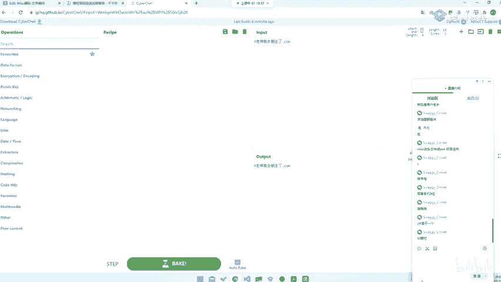

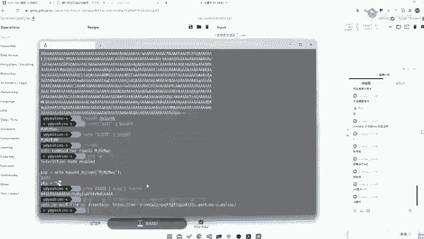

找上什么呢？找一串就我们之前说的这个吧。这个题目。我们先给大家演示一下如何一步到位，好吧。比如说这边去哎呀，在这儿。JVKFKNKO NJCTATTRMN5E6R7BHU。然后他出不来对吧？

那我们直接给它扔进magic。Magic。哦，他没有，为什么呢？因为它缺等号。哎，哎，有了。再加个等号。他就可以直接。它就可以直接出来这样成东西了。那我们再对它进行，把这个东西拿出来，看到没？

它直接可以第一步就可以出来了，看到没有？😊，from base32，然后再from base64定它就有我们的电话了，对吧？就很神奇。当然ds之类的。当然这种其他设置的话，你可以自己去看看。

研究研究对吧？都是可以的那大家应该是有一定英语水平的对吧？这个东西都是看得懂的。然后就这就是一个非常神奇的工具。你会有其当然会有其他的一些功能，就是。

大部分的文字编码题都可以直接扔进sber chief里做，对吧？这东西真的很神奇。😊，当然还会有一些其他的东西，就比如说。呃，还会有一些其他工具。比如说这个东西crpitalq crital。我吵屎。

这东西嗯它是一个相对来说比较专业性的东西啊，就是他去做。它其实是用于密码学教学的。它里面也会有一些很常见的功能。比如说。卡住了。比如说他有些密码分析，古典密码之类的，他是会具有启发式分析。

就比如说这种凯撒爆破。或者说什么就是他会的攻击会有很多。比如说之类就类各种各种各种攻击。都是可以的。如果说你去。如果说你去看不懂的话，就是如果说你不知道他是干什么的话，你甚至可以去这里面直接去学。

比如说这里。他我去看。就是根据什么密码分析方法，加一份东西，然后你去怎么做分析之类的。然后就是这就是一个对吧？当然这些东西都是。你可以自己去看着学的，比如说这边play我就play出来了，对吧？

双品分析也是一样的，你就可以分析完之后。你可以发现它的意义排名是最高的，然后什么东西什么东，什么东西什么东西，对吧？这种东西它就是一个用来给你，其实相当于是教学类的了，可以去学这种。😊，比如说这种。

听说过是什么东西？这个发音有点问题啊。😊，你比如说这种。呃，经典密码或者说凯撒之类的那多帮人比较啥弗吉尼亚之类的。呃，比如说我们看这个。弗吉尼亚的那个。比如这种。直接去了play。啊，他就可以直接去。

他甚至可以去做这样一种图形式的编码，对吧？然后就能够拿到我们这样的一个输出。哦，就输出完了，还没有还差一点点。哎，这东西是完全免费的。稍等一下，这边还要他还会过一会儿。他做一些什么分析啊。

然后单字母替换呀，然后移位啊，然后就拿到这样一个结果。这个软件。我。这个软件要翻强不，不要它是一个离线的软件。呃，但是下载他好像需要。在这里pp to。在这儿这个工具。

它就是一个用来做密码学教学的一个工具，但是它也确实那么Elearning program，但是它也可以做很多这种密码学的分析。猫是黑的，是因为我这边直接走了这个嗯这个这个这个这个话题我们不讨论啊。😊。

然后就能出来这样一串东西了，对吧？当然都是。那，当然这是一些都是一些比较简单的一些东西。比如说你像vissa的之类的，他可以直接去给他做一些。😊，他可以直接去给你做一些就是比如说这种什么密码分析。

然后下一步。然后你去找一些什么经典现代经典密码，然后下一步。然后比如这种弗吉尼亚，然后下一步。然后密文是什么？比如说我们这边去随便测一段吧。叫。呃，比如是这种VVE。我仅仅en code。

比如说我们这边串测一串。Today is a。so那比如说打个什么呢？诶。呃，打一个什么呢？😊，嗯。Hello。word但有点短了。From。From。那就这样吧。hello world，比如说。

那比如说key是什么？比如说key指定一个mask。不一定太短了，可能不一定分析的出来啊。😊，但是我们先看看吧。德语英文弗吉尼亚经典弗吉尼亚下一步。哎，他没有分析出来，为什么呢？就是因为太短了。

那比如说我们再去给他做一个back。我们放个长点的啊。比如说我们去复制上东西。啊，比如说。啊，我找了串场景的样本给大家玩玩。比如说我们就福吉ia Virginiarginiainclo。呃，比如说。

比如说什么呢？弗吉尼亚。然后你去给它切成，但它甚至可以支持其他语言。那我们这个暂时不管它，比如我们多来点，就是说这么一长段。然后人就我们不金加硬扣的利息。然后key就保持m。我后给他复制过来。

英文界典附定加下一步。看到没？其实就已经出来了。他已经在他已经在循环跳节commm了。这上就是我们的一个解密的一个结结果是吧？都所以说都是可以出来的。当然的话我们就不演示这个东西，其他的。

这种东西就是一些工具的使用。那当然，工具的使用期前提建立在你需要知道它是什么编码的情况下，对吧？如果说你不知道它是什么编码，那你工具你都不知道它干什么用。那，对于一些。呃，对于一些简单的工具呢。

对于一些简单的东西呢，你可以直接去给它进行一个爆破啊，或者说是你直接去看出规律来。但是对于一些死的东西，可能就是你需要去加一些。😊，脑洞啊。当然这个脑洞也确实没有什么办法，就是你只能脑洞。得看出。

因为出庭人如果说确实不给你这个叫提示的话，你也没有什么办法，对吧？只能脑洞了。这部分东西。然后这个大概就是一个文本加文本编码。当然文本编码的话，这些东西都是一些很常见的啊。

就是呃我觉得可能是一个最最最最最入门的吧。😊，就是meask泥境了，或者说是m最吸引人的地方是什么？就是给你段稀奇古怪的文字，然后让你就能解出一个flag之类的，这也是最基础的一个入门的。😊，游戏玩法。

甚至我觉得这不不能称之为题目，它一般来大部分情况下都会在某些套娃上面，社会主义编码对富强民主文明和谐啊之类的。甚至那种东西你直接学人进古上一搜就有了。当然这种东西就要。😊，单纯出这种题没有什么意义。😡。

呃，套娃套上去也没有什么意义。那比如说有点意义的是什么呢？就可能就是后面你要去做一些。呃，就是在一些就是比如说一些图片，或者说是一些其他的一些misss上面加上这样一个编码。

或者说中间某个步骤要用到这个编码，那可能还稍微好一点，对吧？那这个编码是为什有这么多，我们怎么去，其实也没有什么办法去完全记住。其实主要还是嗯。我不知道大家有没有之前听过我们我们之前说的一个。哦。我。

唔。这大家有没有上过我们那个特训营那边的一个课，就是。这一个。柳页PPT我觉得可以放在任何一个地方。题目入手怎么做？就是预处理关键点提取和搜索相关资料。预处理就是把这个东西，然后。

搜索关键点就是你去做一些这个敏感，就是做一些提取出来的数据中的敏感信息，然后去拿这些敏感信息去做一些东西。然后最后的话就是信息搜索。所以这三页PPT我觉得放在哪里都可以。我觉得非常好，然后大家也可以去。

如果说大家没有听过这个课的话，大家可以去听一听。要为这个课好像公开课，对吧？都可以听到的。😊，所以说这种东西也是嗯。其实做什么题目都是一样，就是这些套路。😡，那么后面的话我们举一个。图像编码的例子。

图像编码的话，其实我们这边嗯为什么说说的很少？因为图像编码其实大部分都是银写，或者说是一些。呃，图像操作上的东西。那我们后面会有一个专题，就是引写专题。所以说我们这边就不多赘述一些图片编码上的东西了。

就是图就是图片影响上的东西了。我怕之后再讲，但是我们这些可能需要去讲一下，就是。图片与处理。比如说加F分针这种。当然还会有其他东西了，就比如说。啊，这个我们再说。😊，就是像GI分针这道题目的话。

其实我觉得是一个。还是一个挺好的题目，就。哦，我已经下下来过了，这之后我会把这个题目。

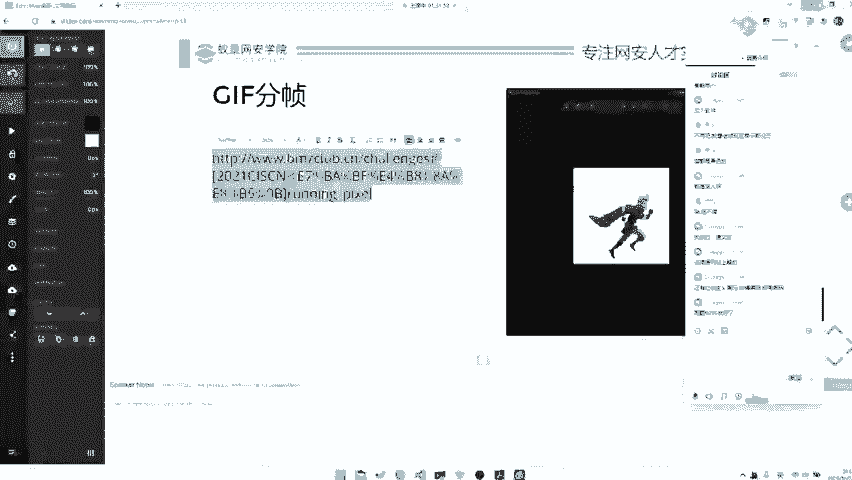

他就是个GIF，我不知道大家有没有打过，就是今年国赛题。😡。

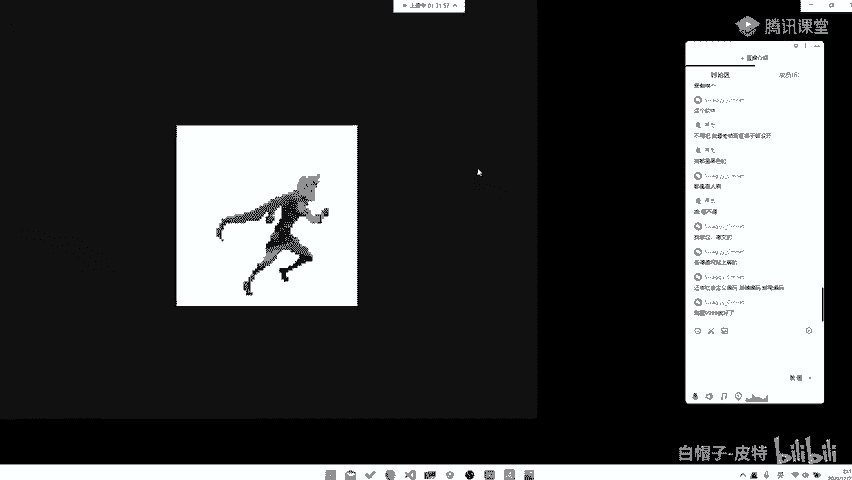

呃，当时我应该是实时做了这个题的。

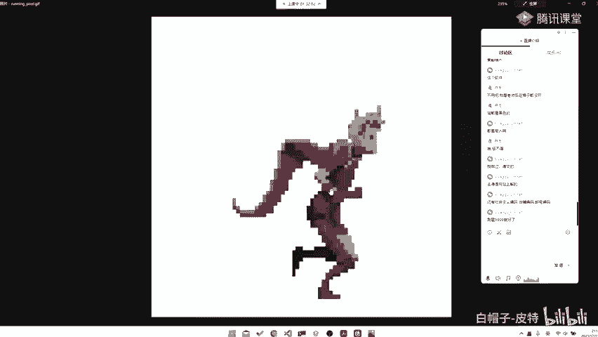

就是这样一张图，他就是给了你个GIF，然后什么都没干，对吧？😡。

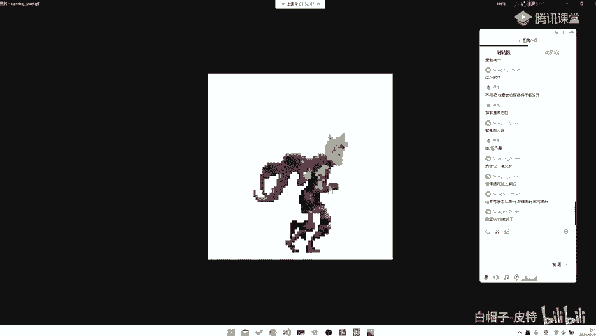

那你要对这张GF做一些图片分析啊之类的。那么它就是就用的其他工具。这些工具的话。为什么我这节课不讲，就是因为嗯。😊，这些工具可能去放到那个叫。银线里面去做会比较好一点。所以说我们这边就只是简单提一提。

然后给大家稍微看两个题目就。先过的，然后之后引写的部分我们再去讲一讲，详细讲一讲，就是关于这个叫。这种图片边图片引写的题目怎么做？比如说你去看这样一张图，对吧？你去看它的一个。

去看每个编码都去每个每个通话都去看一遍。210。不知道大家有没有注到个问题，就是。😊，你去看这儿。对，自动嚣装这DK你去看这儿。

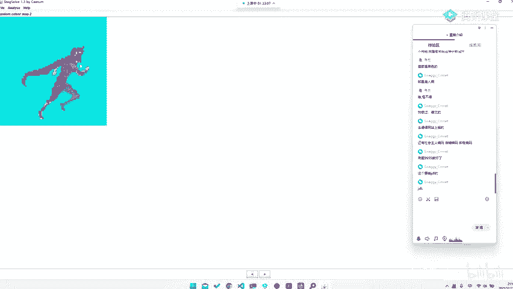

呃，这边看不太清啊，我去。我们去给它尝试，让大家看得更清楚一点。呃，这个tacklo之类的东西的话，我们也放在之后会去给大家讲。但是我们就只是给大家简单借看一看。😊，就是如果说我们出现一些非引写的题目。

我们如图片编码会怎么出，就是或者说对图片处理怎么出，对吧？Running pixel。这个题目当时也挺当时也挺那个叫。我记当时出来的人不多，我好像当时还拿了一血。就是今年国赛。

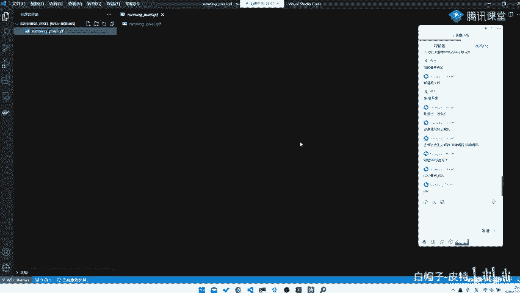

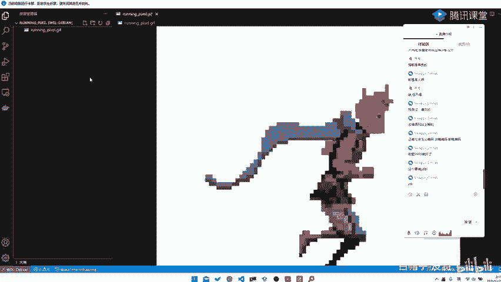

我们先给他把针抽出来。抽帧是什么？就是把GIF东西给它转化成一个偏G，对吧？有点卡，convert。rununning pixelel，running pixel点PNG。

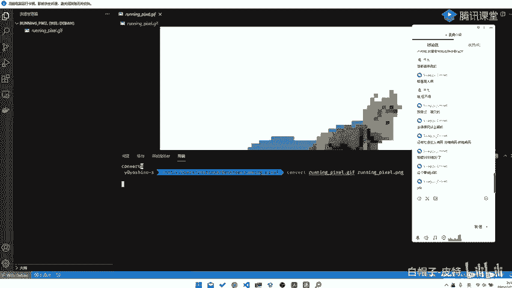

然后可能有一点点点卡，因为我们这边又开了那个又开了那个。诶。😊，诶。稍等一下。呃，有脚本的吧。是的，确实呃，我这个题目。哦，稍等一下，python我记得有。呃，可以用python去做，但是稍等一下。

我去。嗯，稍等一下，我去找一找我当时写的right up。嗯，嗯。时间有点久远，我这边可能要稍微找一找。不知道大家当时打没打，就是嗯这个题。我可以先给大家讲一讲这个题目当时是怎么做的，就是。😊。

对于他的每一帧。都会有一个像素点。尤且只有一个像素点，它是244。哦，我们直接去写一个脚本试一下嘛，就E叉P点PY。From PI PIPPI。嗯。我们直接去给他提一个notebook吧。

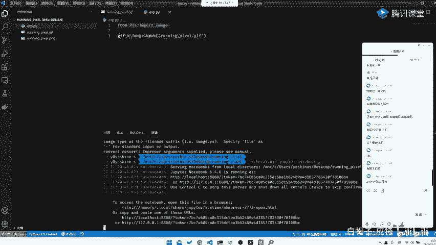

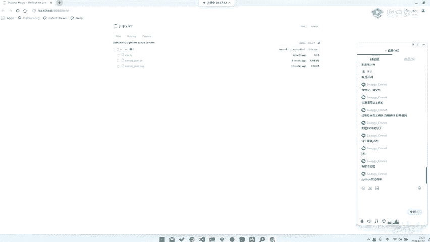

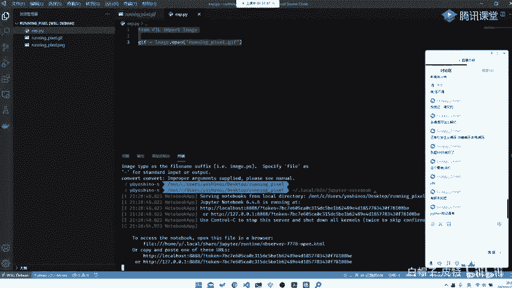

女。

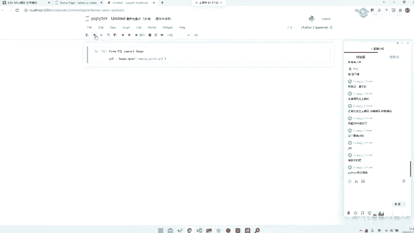

呃，简F点 frame吧，我觉得是。

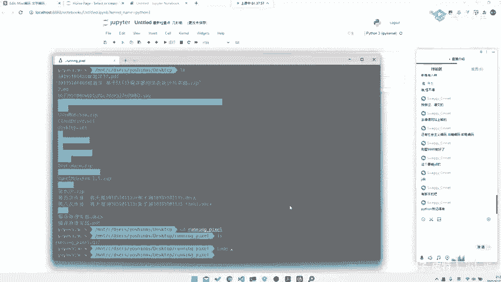

Oh。叫什么来着？呃哦sick吧，好像是我记得是。对，sick。啊，比如说PNG等于。GIF点C0。然后你去把PNG里面的。ge啲茶。诶，好啊。Get。待会可能要用n派去处理，就是n派去处理print。

呃，要去给他转list。这就是它的一个整个的那个叫。GF data，然后你去给他做一个统计。嗯。比如说我们这边去给他做一个。呃，比如说我们给他做一个去虫吧，直接去做一个。

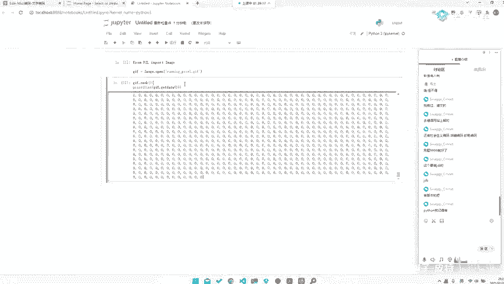

呃，有我觉得有个count。R房。你叫什么来着？

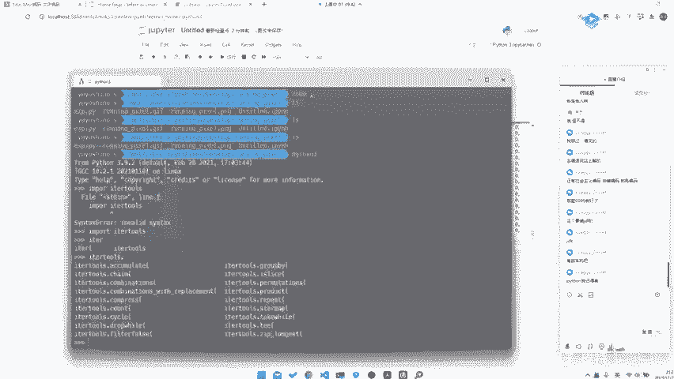

关。我居然也有忘记这东西的一天哦colions里面的。有。Brong collections。In counter。然后CTR等于。😔，count，然后去GIF点get data。的第。

Data等于GI then get data。List。re等于 datata的第零位。😔，那我们去看下red。Right。地头。那我们直接去给他countr吧。TR等于count。Data。CTR。

对吧他就告诉你所有的一个统计的结果。然后的话其实这道题目的话，最后的一个解答方式是什么啊？RGBA呃，其实他就是那个叫什么，它会在那个叫所有的那个叫GIF的背景图里面，就是他说的背景里面。

会有一张会有一个像素点是。呃，我看一下啊，get data。哦，我想起来了，他是因为他是那个叫。GIF点0。J点 convert。语音二题要convert种片子。呃 convertvert rGB。

可以了。啊，好像还是不行，我要先把它convert成AGRGB才可以。再说。Convert G IFQPNG。查授给他先conver出来。I。这样的东西。呃 convertvert。

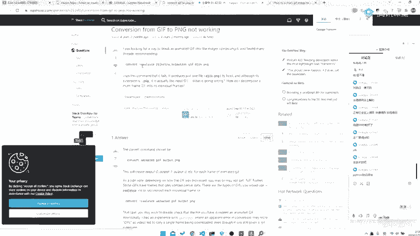

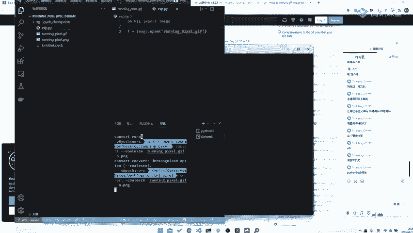

等一下，他可能卡住了。嗯，他为什么只出来一张啊？那估计是我的coverver题有问题再说吧。

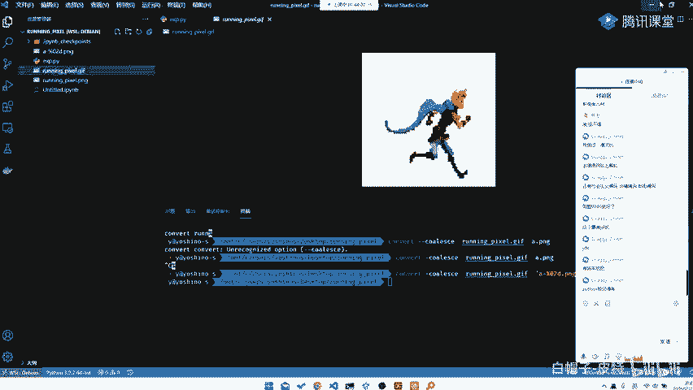

然后反正就是他最终出来commer出来之后，我去找一找。这样一个。稍等一下，我把。rap up发过了。嗯。微信。😔，我不跟我我现在所有的ra up我是不更新的，就是。因为我最近打比赛打少。

所以说就不怎么写了。呃，一般来打比赛的话就是跟队里面打，所以说都会在队里面的软场。

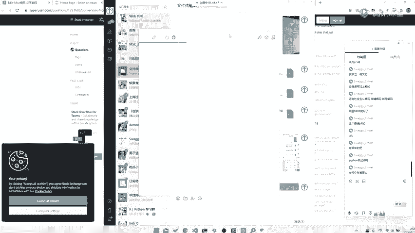

这是我一个朋友，那我正好掏过来用一用。其实这道题目的话就是。他去把每一张图片去打开之后，去给它cont成RGB。因为它本来是那个叫画板模式吧，com成RGB之后。然后去给他。哎。

对他就是直接去给他做了一个IMent，然后去出来出来之后直接去给它convert， convertvert完了之后去给它。进行一个替换。那我们这边其实也是可以解的那我们直接去给他尝试去解一些吧。

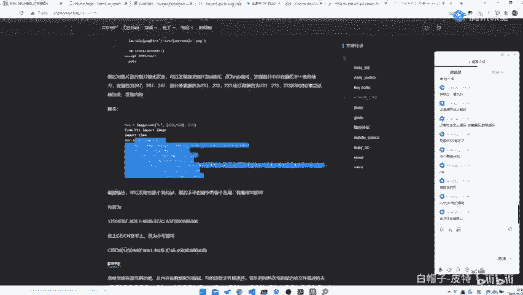

啊，s0PNG等于。singPNG等于GIF点tel。然后。PNG点converseCND等于PNG点get data。嗯。😊。

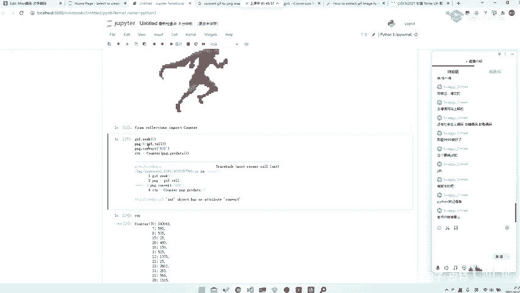

不是跳样吗？

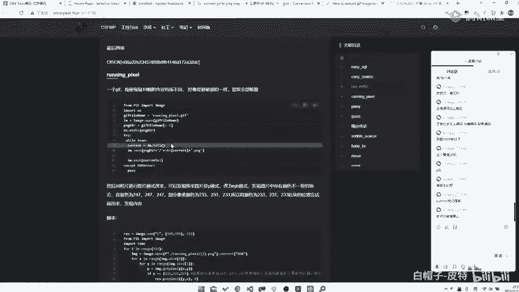

哦，但是Current你要去给他。保存出来才能那个。1F点CF。0点PNG。0。PNG。然后PNG等于。Open。IMA点欧en。0点PNG点coververt。呃。

他之前没convert或者convert。然后你去看CTR。然后就拿到这样一个数据，然后的话你再去对进行一个分析，然后就可以了。APNG啊PNG等于PNG点comt。CT2。然后就可以了。

你会看到他所有这个是他的所有的背景，最常见的背景就是247247247。那么其实他还有一种背景，就是在。

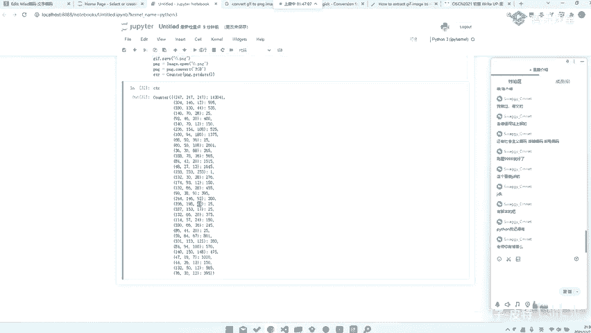

还有一种是233233233的背景，第一张好像没有我看一眼啊。

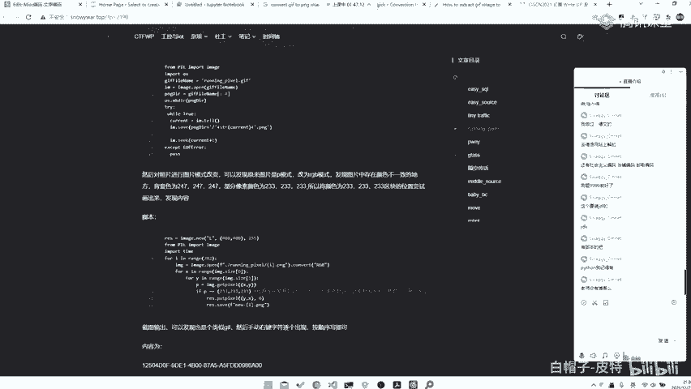

好，有在这儿。他所有的里面它会有一帧是233233，就是有一个像素是233233233的。比如说我们这边去给他。呃，CK一试试。你看它也是只会有一针，233233233是1。

你把所有是233233233的这个针提取出来。它就可你这一个像素点提取出来，然后把它拼接起来，就是出来我们最终的那样一个flag。哎，这个flag还挺难找的，就是。😊，它是逐个出现的。

你需要照它出现的顺序去给它找出来。那比如说我们这边去。嗯，这边去给他也没有什么办法，到时候因为这个题目当时确实挺复杂的，大家有空的话，可以回去自己试一下这个题目。

然后的话嗯因为这个题目相对来说可能也是就是我唯一一个能找到，可能是跟影写没有关系的图片书相关的编码。因为其他大部分的题目其实跟图片涉计的话，其实大部分都是编，就是影写之类的了。就我们之后会有一个。

我们切换到下一张。我们赵老师走了，我们正好。😊，对吧过来吹一吹赵老师。之后的话会有赵老师来给我们讲一讲。图片里面的包括影写，包括是在结构里面去做一些隐藏，或者说是做一些数据的东西，这就是。

今天的话其实大部分就是讲了这么多吧，因为可能还是比较基础的部分，所以说不想给大家带太多后面的东西。之后的话，我们也会有就是特别去的专题去讲一下引写。然后去讲一些嗯就是一些比较全新的编码，就是比如说。

比如说什么呢？我想想啊。啊，就是反正就是最近出现的一些新的编码吧，或者说是一些新的题型，就是没有不靠这种纯粹记忆背诵的东西能够做出来的，可能需要靠你自己去做一些。啊，后面的分析对吧？说句题外话。

AWD老师会吗？会呀。这个这个这个AWD就收到我的。😊，我想想啊，我有AWD，我有做过公开的培训资料吗？好像没有，但是我确实。给大家讲过给讲过很多次AWD，但是可能都是一些内部课程吧。

你们可以去催催我们的和天。

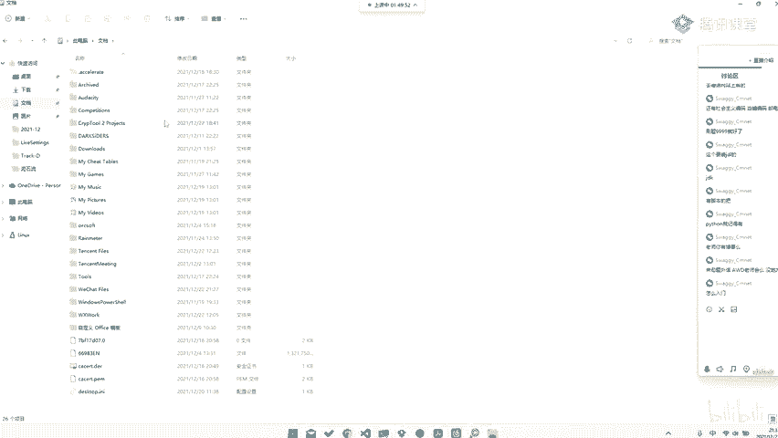

有链接吗？

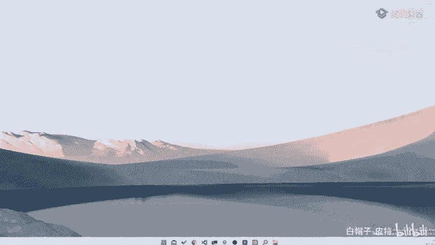

没有。我好像没有公开讲AWD的课程。确实没有。我就有一些introduction的东西。但是反正应该是没有什么。我没有公开课程，但是我确实做过很多AWD的。东西，然后的话嗯你们可以去找何天的。

你们可以去找何天的。😊，那个让他们看一节AWD的课程，但是AW其实没有什么好讲的。😊，这个全靠就反正提完话嘛，就快结束了，也关键经济已经快结束了，就上周末上上周末还上周末的时候。

在成都有一场安巡杯AWD嘛。然后反正。大家如果说感，其实当然AWD的话，大部分情况下就是你去多练习就可以了，去多大线下赛。😊，比如说上海是在线下就是AWD，然后安询杯线下也是AWD打多了就知道了。

打多了你会不被暴打了。😡，然后你会AW现来看到我，然后被我暴打。啊，就很多。有一个。有一个很大概很简单的1个AWD的introduction在这里我去稍微做了一做就是。大概写了一个东西。大家可以去看看。

那我们不讲AWD啊，我们今天的课程其实也差不多到这儿了，对吧？9点35了。😊。

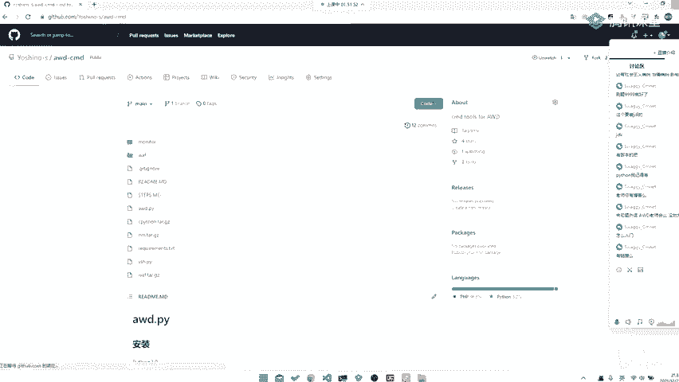

然后大家有什么问题吗？😡。

也录了。一个多小时了，下课上steam。😊。

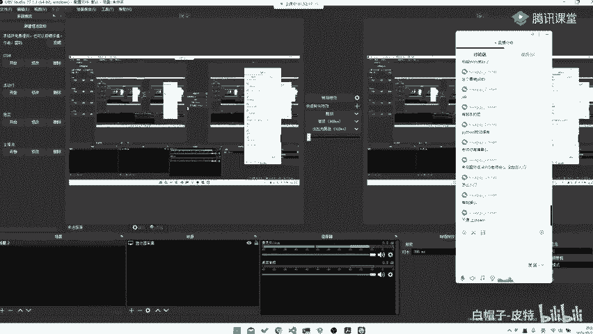

就大概大家没什么问题的话，就今天的课程就到这里就结束了，对吧？😊，然后之后的话嗯。这个课后应该。我会给大家放两道题目吧，大家可以课后去做一做练习。然后的话之后的安排的话，我们之后再说。好吧。

然后今天对于今天的内容，大家还有什么问题吗？嗯，反正大家也是第一次见面嘛，就。确实今天是我第一次。确实我第一次给大家讲课，然后没有就就有大家有什么问题尽管提嘛，对吧？我们还有好多节课呢。😊。

然后如果说大家觉得有什么那个叫还有什么其他方面的问题，就是反正是m嘛，m这部分都可以问，或者说你其他CTF安全相关的问题也可以问。就你可以如果你有看我介绍的话。

现也知道我其实主要是做外部方面的白合审计的嘛，就外部这些问题也可以都来问嘛，就是群里面都可以问。😊。