# 2024B站最系统的CTF入门教程！CTF-web,CTF逆向,CTF,misc,CTF-pwn,从基础到赛题实战，手把手带你入门CTF！！ - P63：CTF系列教程视频 — misc 基于文本内容隐藏信息 - 白帽子-皮特 - BV1m64y157UX

。然后咱们先说一说这个SCTF吧。

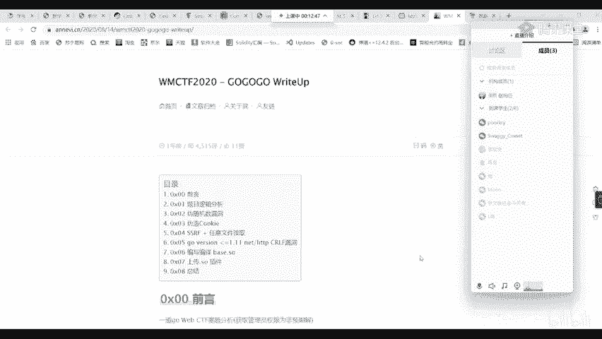

整个来CTF我觉得相对来说还是很高质量。哦，可能这个这个第一道题，我觉得对于今天的课程就是一个很好的。因为咱们今天讲的主要就是呃我找一下。😊。

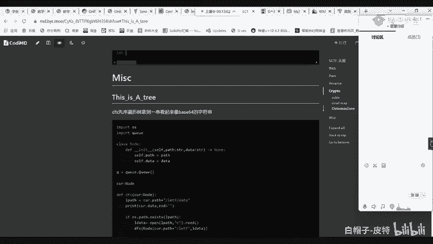

第三次课。今天就主要讲这些内容吧，文本内容隐藏信息NTF文件系统引写，然后常见的凑殊编码隐藏转化，然后奇怪的一些编码。然后全新编码的统计学分析，还有python作为分析工具的使用。

今天主要讲解就是这些东西。然后首先就是说一说这种。啊，基于文本内容隐藏信息吧。这种东西其实相对来说。呃，先先不说这sno in写，大家可以先不看，就是你基于文本内容隐藏信息。首先有两点吧，我这里写文档。

😊，除的内容隐藏信息。嗯嗯，第一点就是他文字就是信息。然后这个我觉得应该在上一节课，咱们那个呃如果同学听了的话，Y老师就已经讲解过了，就是一些图像编码。然后什么什么什么银河什么什么。

然后还有什么什么啊就一些古典编码，然后。😊，然后还有一些什么怎么说？呃，比如。嗯，图像的编码。也就是相当于替换。就比如我那什么猪圈。啊，对对对，是这个意思，就什么猪圈，是这个意思。😊，找文字编码。啊。

佛约这是最最比较鬼畜的一些东西。然后还有什么呃佛约，什么新佛约。😊，啊，叫什么。😔，啊，反正一些奇奇怪怪的，我这也不多说了。😊，这里就我不多说了。然后第二点。文字就是信息这这个点啊啊是的。

受受音啊受音这个是一个比较那啥的。😊，嗯，还有什么抽象文学，这我也了解过。然后第二点，你这文本内容隐藏信息，咱们还能想到什么？就是你不光通过可见的字符。😊，能够去隐藏信息，你通过不可见样的字符。

也可以去隐藏信息。就比如咱们的哦凌宽字节你也懂嗯，那挺好的，就是凌宽字节今天也会讲。😊，然后就是呃不可见嗯嗯。😊，那这个不可见，其实它也分为几种，就一个是。物理意义上就完全是不可见的。

还有一种就是它设置的不可见，就比如你word伦的。他这个可以设置这个文件，设置文字隐藏这个功能大家应该都知道的。然后。呃，可能大家有做过web的，还有这种什么点PPP点ba。

什么点PP点swope这种文件它是被损坏的，你需要meam杠R啊。对，备份文件，mam杠R才能恢复这个。😊，才能恢复这个文件，也就是正常阅读。然后还有呢还有就是我说的一些snowsnow引险。

磁动引血它这个原理就是在这种，我这里也写了磁动引血，它是在HML中嵌入引血信息。😊，然后包括现在我看到的不光是在HML，包括一些比赛中。

他会在这个呃就是直接利用snow点ESE对任何的文本类内文本类内容都可以进行操作。比如你随便上CPF搜snow点ESE。嗯。我好。他这里就有相关的内容吧。🎼There个 snow， snow。

 see have toolss。然后。啊，就这个。啊，这是介绍了一个用法，大也不细看了。这里我也就是介绍一下，大家知道就好。然后以便就是遇到一些不可见字符，咱们能及时的去想到用什么方法去测试去解决它。

😊，自动引许，然后下一步就是white space。这个哦我说两种吧，一个是就是简单说的这种白呃，就是空白空格字符和制表字符，这个大家应该都懂制表符和空格符，这个可以代表用来代表摩斯。😊，嗯嗯。

然后01啊，包括敲金码开扣的。这些都可以代表。只要是能用两个东西代表的这种什么制表符啊，它都可以用来代表。😊，你看这里就很能清晰看到我这个。打印的东西啊，悲恨悲恨这种就是完全是这种文字级别的编码。

它不能完全的意义上说是引写。😊，嗯嗯，当然我这个其实也相对来是那种编码。摩那个培根的话呃，可能下一节课也学过了，然后你这种零1的开扣的，尤其是他愿意把这个出在哪，他愿意出在那种压缩包的备份里备注里头。

😊，就是你打用VI呀。随便开一个压缩包呃，随便开一个。嗯嗯。系啊。鸡。哦，对对对。就是这种东西，他愿意藏在这边。就是如果有备份的话，他愿意把这个藏在这边，然后他还完全空白的，很多人就会忽略这点。😊。

这是一个需要注意的点。然后包括一些文件，就是我所有进入文版文件，我第一件事就是摁conttrol去全选它，看是否是后面还有一些，比如呃包括你word里设置设置这种字体变为白色，把这个字体直接设置为白色。

这也是一种啊隐藏它的方式。😊，然后这个说到这儿，然后yspace它还有一种意义，就是它也是一种代码。这个大家可以去上网搜搜，就是wspace。好嗯嗯。哎呀，哎要 program。我看。😊，我们可以在。

百度甚至都可以搜索到这个giit上有一个相关项目，就是一种编程用的语言。然后这种编程语言我后续也做了一个。呃，怎么说总结吧，就是有很多东西他会用到这些，然后大家可以。😊，呃，相对应去大概去记忆一下。

就比如你遇到什么，然后就就会第一想法就去对应什么。这里我没开梯子，可能暂时还上不去，我先不开了，大家知道就好。也要如果想看的话呃。😊，呃，一会儿自己尝试搜索一下可以了。然后这也是一个点。

就是包括你这些所有的一些呃。😊，编程语言啊，它也可以作为一种音写方式。包括前一段美团，他也出过一道题，是那个eoji的，完全利用imoji来实现的一个代码啊，中间也有一些英文英文字符吧，咱不多。

基本都是用imoG实现。哎，是有还是没有，反正我忘记了。😊，可能有可能没有。然后那个eoG的话就是需要上gitthub搜索一下原项目，然后再给它编译出来运行就好。反正题目倒不是很难。

一般这种类型题目它一般都会出成套娃题，然后防止你这种。哎，就防止你做的太简单，做的太没意思。😊，而且套娃起来可能嗯就套着套着，你就不知道从哪开始找了。😊，也就是加大他难度嘛。

感觉也是现在出咱乡的一种弊端。然后第三种第三种就是利用文件结构。然后。文件系统结构来引响。这个也就是STSCTF这里就出了一道这样的一道题，找一下WP。😊。

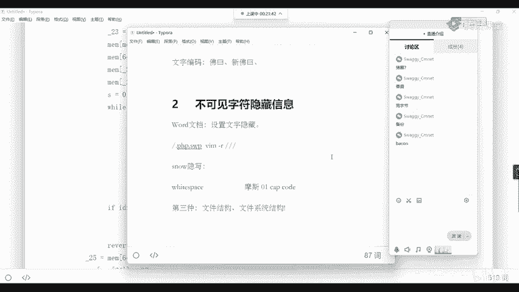

哎呀，好像被挡住了，拿出一下。😔。

然后这是我们的一个答答题，大家可以看一下，这这道题啊，我找一下看有没有问题嗯。😊。

啊。可能是这个。啊，对对对，就这个。就这个我们可以看到它有left right，就是当时压缩包解完，解压完就是这样。然后它每个le right有一个搭塔，那我们就可以比较合理的想到它就是一个数嘛。😊。

就他就是这样的，一个树。😔，然后嗯嗯。这啊。这样啊。然后叫有值，比如哎呦呦。你有职业，像比如说23。你2124。哦，对对对，就是前中后续。那这个题其实我们如果想知道它到底是什么什么序变历的话。

我们大可以尝试。因为他给的这个打塔我们可以看一下。😊，你可以看到这个这Q2HP吗，我们一扣。😊，这64皇低，还有。S64钢面。你看这已经出来什么拆。那就代表他肯定是这个。前续的。就是他需要从头往下走。

啊啊。就是再往left，然后最后到left leftft一直left下去，然后再往回right往上一个。就大概是这样吧，换一下换一下。这可能有那个不知道大家对这个数据结构还学还会不会。

那个数学路还是比较重要的。嗯嗯，就是你前序就是这样吗，读完，然后读这个读这个再读回来这样的。112345。这就是他前虚便利。这肯定没有问题吧，大家都应该都能听懂。😊，是吧。这个可以回复我一下。

这道题应该都能听懂吧。嗯嗯，其实这道题呃比较难以编写代码的点，基本也就是这个了。其实其他的点就不是很难了。😊，大家能听懂吗？哦。喂。😊，能否给一个回应？嗯嗯对对对，如果当时你没解出这道题的话。

我觉得还值得复鉴一下。毕竟这是里面最简单一道题应该是。😊。

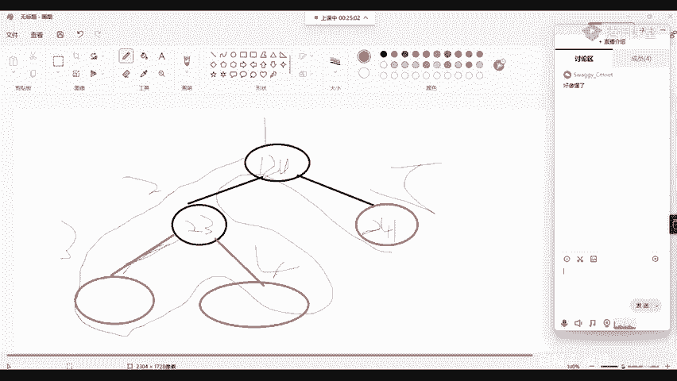

然后你看我这里。我这里整了一个这样的脚本，它是一个利直接就是相当于我就生成了一个数嘛。😊，就是我用1个DFS，首先我去匹配的left，然后我就去打印。然后如果还有这个left，我就再把这个。😊，呃。

这个L pass里头。再加一个le。这个能懂吧。嗯う。这个懂吗？嗯，这个代码我发给大家一下，我看这里能发还有。😊。

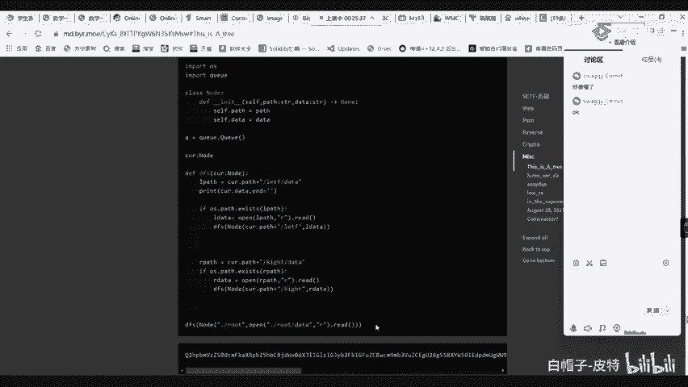

那我就发微信里。这大家可以试一试，后续可以试一试，这代码挺好用的。😊，然后他就直接出了一个这样的。

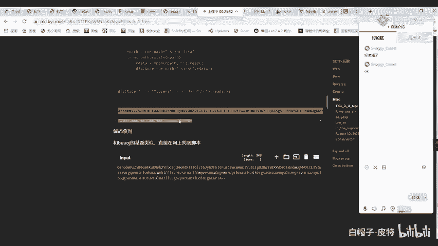

出了一个这样的东西了。然后这里就呃。

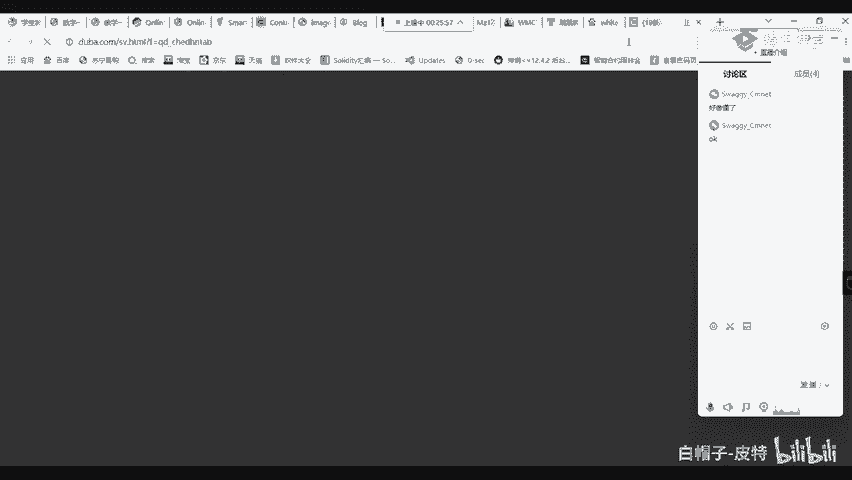

你看就是贝斯64嘛。原题能在哪找到？我发一下。我发我发我发。还有。收到了吗？我发这个文件。But。OOK然后咱接着讲。😊，就是他这样一步之后还完事儿，就是我们可以看到这个。😊。

什么chinese traditional culture is broad and profound， so I wantt give you my flag。

 but you need deco it enjoyy the flag。然后他有这个诗对复损，叫什么转镇禁购太大过送诗科诗客镇恒婕玉。那我们。😊，就能知道他这东西肯定是一种编码。

当然这个可能就哎你看我直接把这个打出来，他直接搜着异景了，这就不用多说了，我就搜CPF异晶。😊，解码。啊，就直接看着了，刚才OK。一经吧，你看那什么伏羲六十四卦。😊。

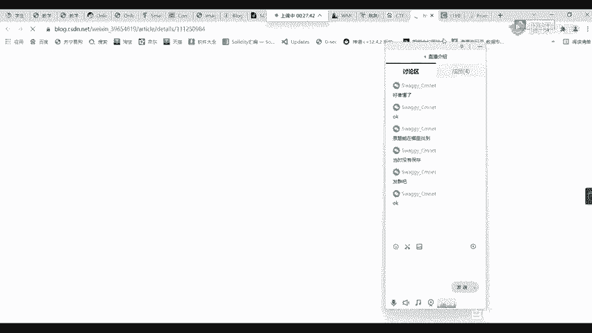

嗯嗯。没有。うん。这这这什么什么东西。😔，你们不来点正常东西。嗯。啊，这这个对嗯嗯。Yes。

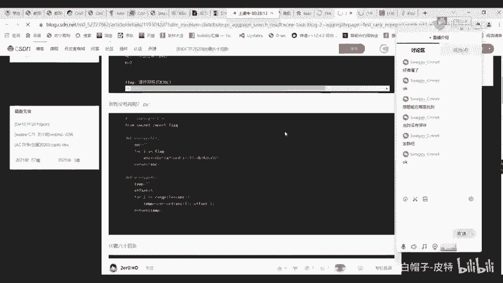

啊，你看这里就有了。这里就有解密代码，咱直接把这个拿过来用。我这里就不再跑一遍教问了，我这应该也有吧，我看一下。啊都。啊，对，然后你看我这上面就那啥的吗？然后你看是零。那我们直接就。😔。

给他整出来就完了。啊，china永远的神。然后。嗯，blag就是这个包裹一下就行了。然后其太了。ha flag就这个。是一个标较简单问题。胎唱长期破解老师私聊一下呃。因为我是学生，所以用的教育优惠。

有一说一，不是教育优惠，就是教育教育版的那个。所以我你要硬说长期破解版，我还真没有，这我真没有。😊，只是因为还是学生，就暂时呢还能用。😊，属以是白嫖。Yeah。🤧嗯。你这道题的思路大家完全能理解了吧。

这道题其实就我也说了嘛，就是针对于咱这课特别好的一道题。😊。

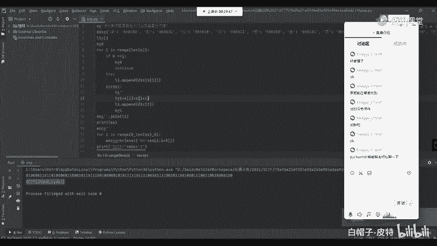

因为咱这次讲就是这个啊。基于文本内容隐藏信息嘛，然后包括一些特特殊编码隐藏转换技术，然后这正好还python工具使用，属于是结合了咱这整课的这个知识点。😊，对这题还挺不好找的这种题目。

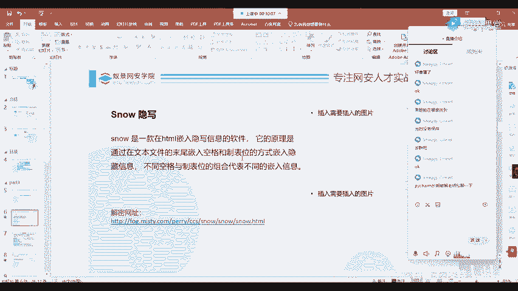

虽然是呃有点套玩，感觉有点没意思，但是他这个作为签到题来说还是比较好的。😊。

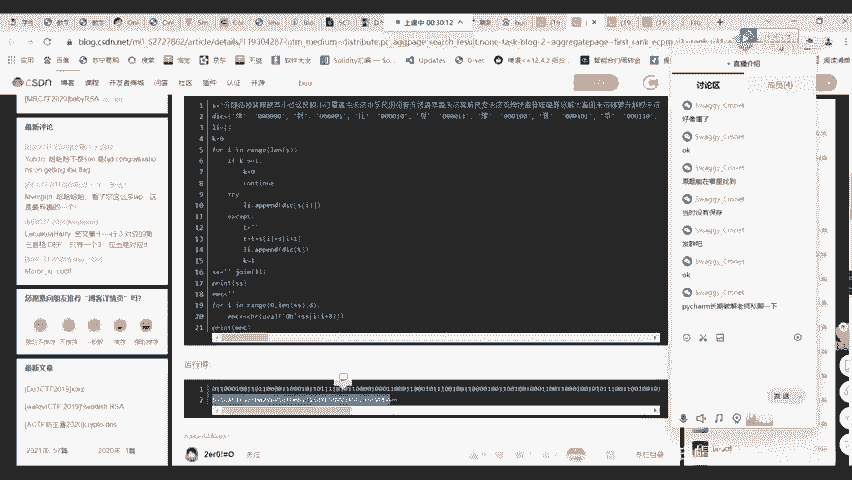

哪个？哪个是V斯64，就是那个data吗？嗯嗯。你说的是那个data吗？啊，对对对，就这个。因为你这个V斯64里面有这种unicode，因为你汉字都是unicode变的。

所以你最好是用这个sber check它能自动识别，然后不会给写成乱码。这个你要是用。😊，这个CMD里头的我就不太确定了。试试啊。好，他这也可以正常记，那就问题不大了，那这都可以正常接。😊，那问题不大。

用什么解都行。嗯，没问题了吧。

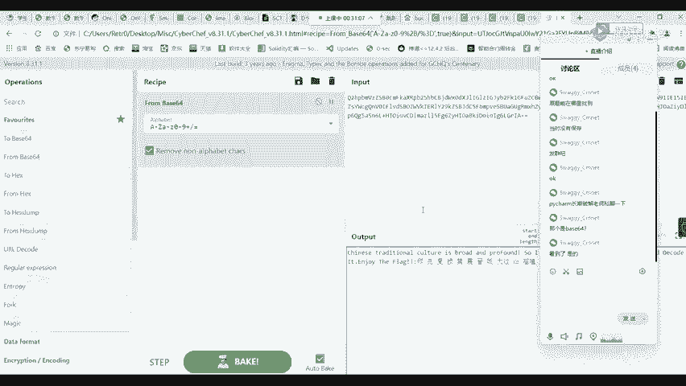

啊，包括就是我们找到了这个东西，就是我当时看到也是没见过，因为我也没做过当时什么BJDCTF这个我也没有没有遇，我也没有做过。所以这个东西我也得去自己来搜，然后搜到。😊，发现是什么啊什么易经编码。

然后再再那啥再解密。😊。

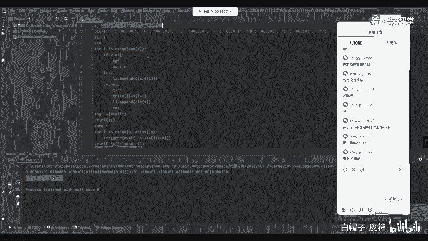

然后得到一个什么什么什么。然后再跑。

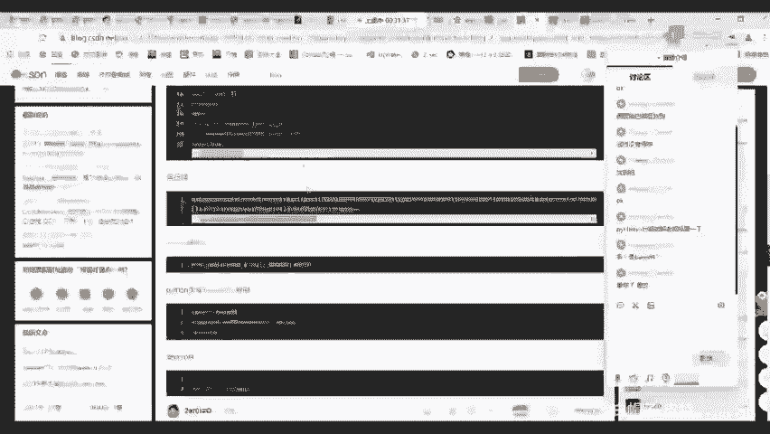

这个大家。能理解吧？这正好也结合了很多，就是我们现在CTF肯定是要结合很多知识点去做的，包括这种信息收集，然后这种python的代码的基础，这都是很重要的嗯。😊，嗯。😊，うう。那么这道题还有问题吗？

这道题。讲了呃知识点还是不少的，大家可以现在去实验一下，因为我这里代码基本能够给出来了，我把那个代码也发一下。😊。

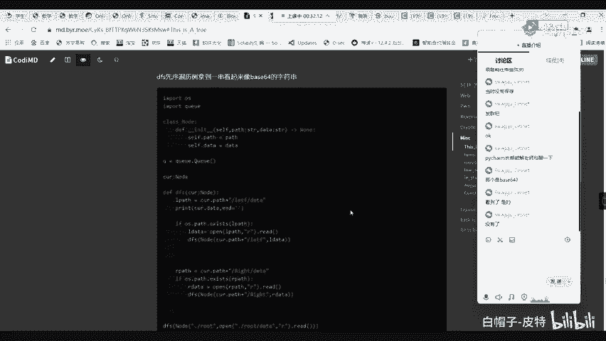

把这代码发下现代码。没有。Yeah。把这代码也发一下啊。没有，嘿以嘿以。其他同学呢？我看又到了俩。暂时没有啥那啥吗？暂时没啥问题了嗯。😊，引炮的派thon包，你说哪个后面哪个后面是各种引炮，哪个后面。

就包括你刚才说那个拍唱的话，其实你VS code也完全可以替代。就是我我我也用过一段VS code。就当时呃虚拟机里头我用的就是VS code，我感觉VS code呃也不是很难用吧，虽然有点有点别扭。

我用着还是有点别扭，但我觉得就是不是很难用。😊，正常使用来说。还是没啥大问题的。TXT。

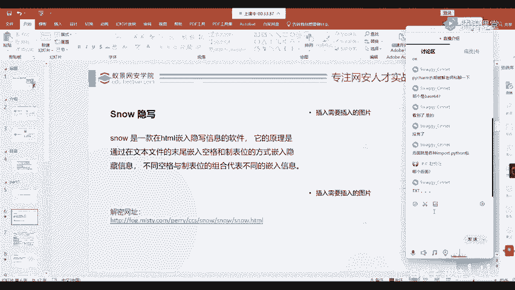

啊，什么意思？你说哪个TSC？有点没懂。哦，直接TST写拍thon哦，那这样的话主要是没有那啥。😊，其实我还挺依赖这个代码补全的，还有这种报错查错。啊，我还挺依赖这些东西的。那好好好，那我们接着往下走。

😊。

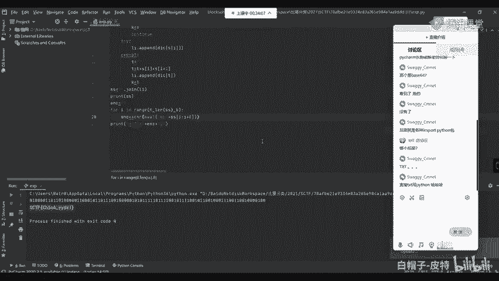

啊，这个。然后你包括文件系统结构，这里说完了。这里就不得不提到。除了这种还有一些文件性结构，除了我这种它特地的造成这种树形。还有这种。就是。单一的。给你套1000层压缩包，而且。而且每种压缩包。

形式不一样。这也是一个非常那啥的点。😊，呃，就是为了恶心人而恶心人，为了出题而出题，我感觉这种题是没有什么含金量的。他除了锻炼了呃代码能力。😊，啊啊这个也不叫套身题吧。这个呃我看我看CFO出的题。

有的题还是相对来说挺有比较有意思，但就是有点套，就感觉一般。😊，嗯嗯。反正就是呃这种题咱们虽然知道他这个没啥意思，但咱们得会做。😊，就是你10千0层压缩包，你怎么去解？我一般使用的办法是呃。

比如你inport和OS，然后你去OS点stem或者是OS点。😊。

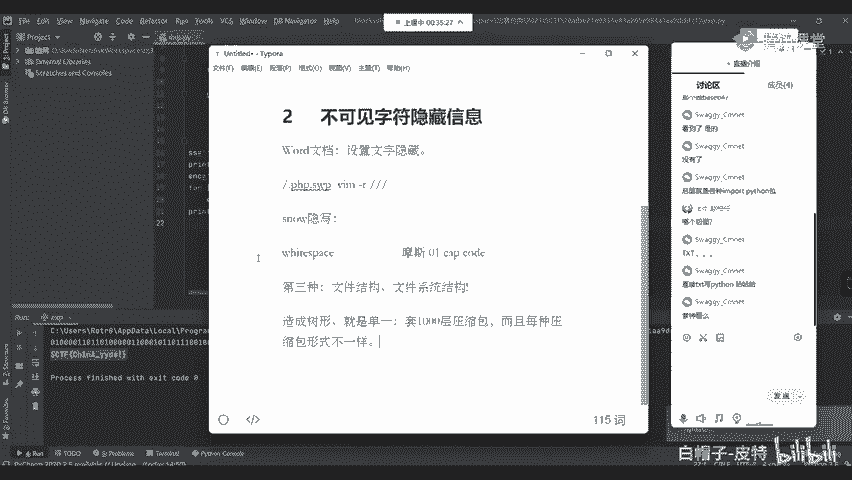

去执行命令，就不乱你去执行什么fill，你可以去找一下他这个。文件名。发我店名，点瑞的。然后你把这个结果拿出来之后就是看看。然后衣服t讨里面有什么什么然衣服就比如我的是点地方跟探讨。嗯嗯。

那么我这个就得用这个unz呗，点 system。按这。然后这个文件名。也就是用这种方法不断去解压。然后包括他如果需要一些什么目录的话。啊，对对对，就是写脚本。如果这个大家熟的话，我这里就不写了。

然后你就是呃特定题型特定解法。就是如果你强的话，我见过写blash脚本那种那种脚本要比pathy脚本快很多，你可以写blash脚本，blash脚本是非常强，就点点SH。😊，嗯嗯。这是摇门妙快。

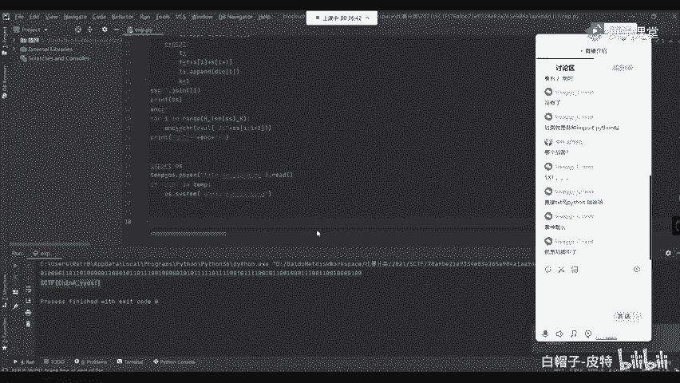

嗯，我之前见过一种，我看一眼，我搜一搜。S脚本。啊缩包姐你。こ怖。嗯嗯嗯。算了找不着了，之后之后有了再说，之后我找着再说。😊。

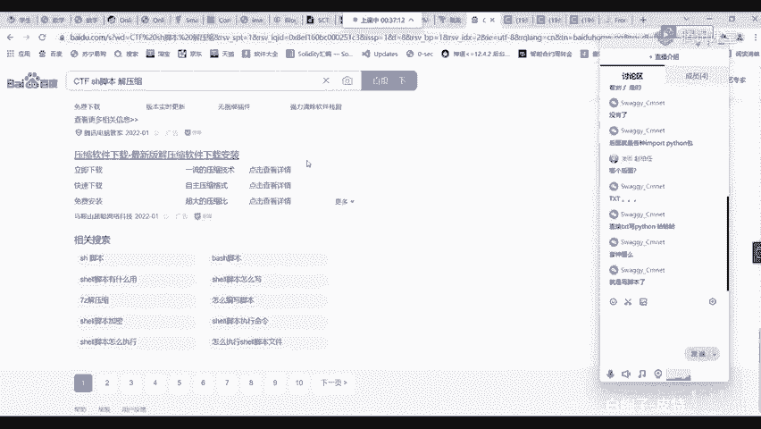

反正写点点再H是特别快的。然后你正常就是写python来调用系统命令，然后包括用一些zep包，还有一些什么zeepimport，zeeptel这个东西它也可以去进行了这个解压缩功能。

或者好像它直接就是声命力种zeep play，它里面就是有一种zeep play。你看它这个。😊，他就会去尝试。这一种Cplay，然后进行相应的这种。解密手段它也是一个比较不错的使用东西。

然后那这里就差不多。这个就讲完了，哎呀，河表挨打了。😊。

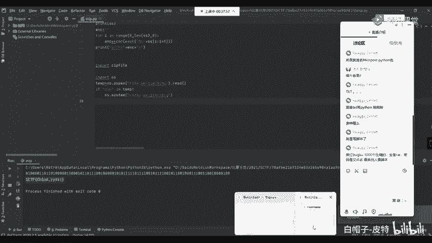

啊，密码是文件名，这种密码文件名，其实呃就用Z file这个东西。😊。

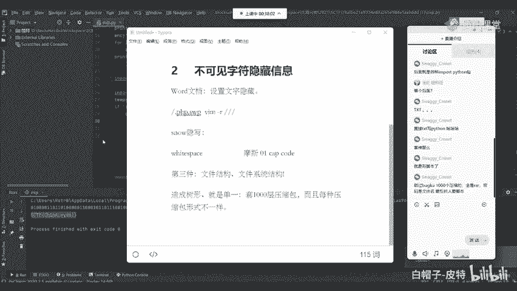

嗯嗯，它是可以解密这个带文件名密码，包括按z，它是有这个我记得是有杠P参数的，我看一眼啊。😊。

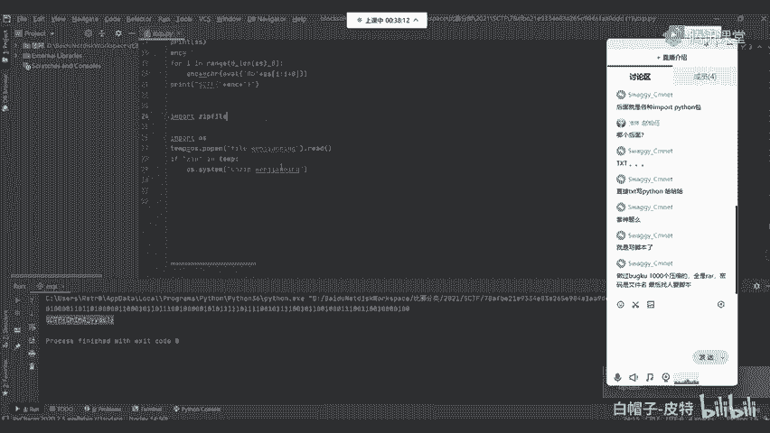

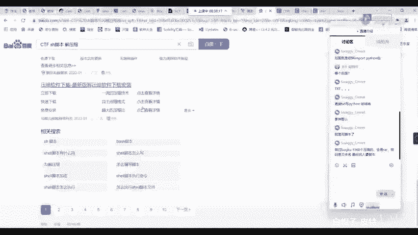

你这种东西出现这种问题又。嗯嗯。然后就是按静码甲。好，就是俺这巴刚批。可以看到吗？就是按这个杠P，那你这个就相当于你这个按这个杠P，然后把这文件名。😊，帮麦他文件名。然后把后面那几个去掉，什么复4啊。

点zip，反正就把点zip给那啥掉就行了。这个能理解吧？你用zep file好像能也能获取什么zip file点什么什么name嗯zip。😊，Gep file点 zip name有这个都有这个修饰器。

还有这种函数类，我觉得都是比较好弄的。😊。

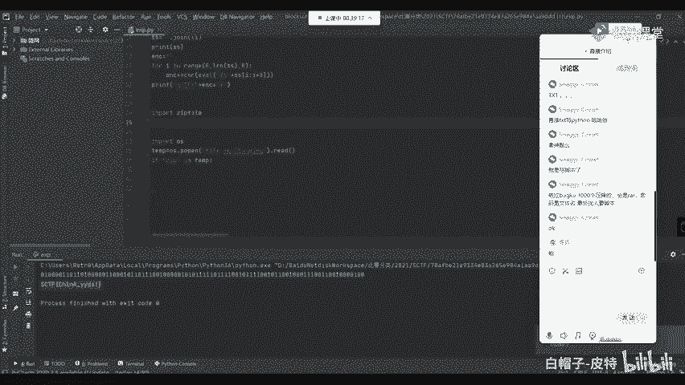

然后再往下走。再往下走，你不可见字符隐藏信息就差不多到这里了。然后你现在就是来找一找更高级别的更高级别可能是文件系统。然后还有这种。呃，除了文件系统之外，可能还存在一些呃嗯内存上的内存上的咱先不说了。

这里就呃先带过，因为这个就比较难了。😊，但是没有必要。嗯嗯，先讲讲文件系统，文件系统这里我也是想着重讲的一个东西嘛。文件系统这里要着重讲的就是一个呃哦咱灵宽度还没讲，咱先把灵宽度讲灵宽度。😊。

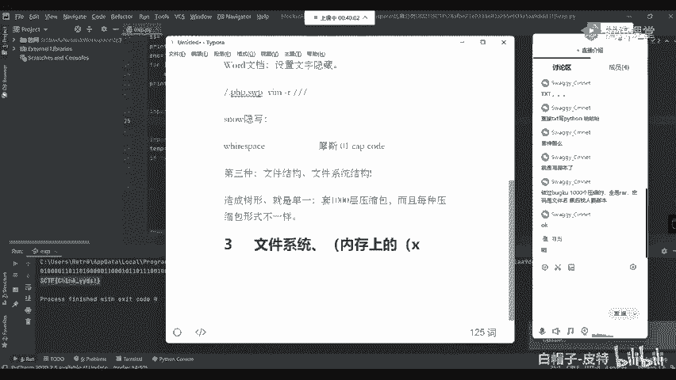

流恒度字分音写，其实他这个我觉得大家应该都遇到过很多。这里我也给出了一个非常好的一个介绍的博客。😊，咱们点击用这个博客来讲。哎，不用不用爱着。我怕嗯嗯。就是你怎第一个就是识别内蒙汉豆字符，怎么去识别？

😊，一般。😔，就是你出现了零宽度字符。他会上你的这个，就比如你随便新建1个TST。没有。就是这样。如果它是填满文本，就天满文本的1个TIT它这个列。就是如果他没没分行的话，它这个略会显特别多。

它会远超你这个。😊，这个现在的这个字符长度，你一眼就能看出来，就是你这个时候它是可能已经显示70了，那一看就是不对的，这个我们就完全可以。然后那怎么再进一步验证，这这是我推荐的，为啥大家装一个子系统。

不用特别麻烦，就是咱们这接切子系统，然后直接看面码ISD。😊，还有。他没那啥料。嗯嗯。你看如果他这里有他这个就能显现出来，就是像这样，就像这样就显现出来了。😊，然后这就是我们如何去找这个零宽度字符音写。

然后你这个连宽度字负音写的话，你应该怎么去解密，也是用这种提供的。我们可以看到这有很多选项，就是很多人就又会疑惑这个我到底该怎么选。😊，这个怎么选？我们需要去看他的字符集。

就是我们可以看到这里有200B，然后有这个FEFF有200C有200D。😊，然后咱再大致瞅一眼啊，就大概有这几种，那我们就需要在这上选200B200C200D，还有FEFF进行解密。你这个多选我不知道。

反正录选肯定是无法解密成功，或者说会解密出来一堆乱码，这是很正常的。😊，这是第一个要注意的点。第二个就是呃你这个进行复制制粘贴的时候，千万不要用一个什么呃载体发出去之后再进行复制粘贴。

你需要直接呃到那个原始的那个文件里头进行复制粘贴，这样才能保证这个灵宽度字符没有被优化掉吧。😊，嗯，反正相对来说比较那啥。嗯嗯。这个大家都能了解吧，这就是比较需比较需要两个需要注注意的点吧。😊。

包括这道题大家可以去尝试一下。然后现在我。😊，这道题。这道题大家可以现在去尝试一下，然后包括现在也出现了pyython解灵宽度。你看。python中也是有这种灵宽度字符解密。啊。嗯。

我记得python中是有个裤子。哎。爱上谷歌。嗯嗯。哎。还得上工，确实还得上。你看他这就是。啊，但是他是直接那啥的。他直接呃在线就解了。😊，但是我记得是存在一种pyth森库哦，对对对。

就什么ZWSPtPY这个大家可以去下载一下。嗯，嗯。比较简单吧。

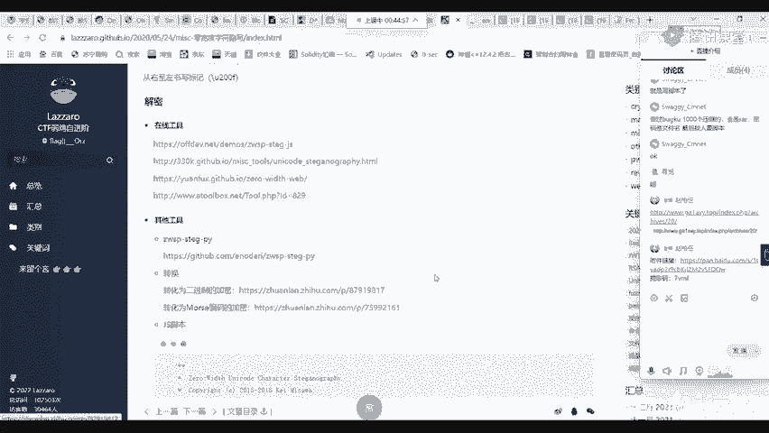

然后你可以看一下用法，就是incoded等于这个incode然后decode等于decode。然后用相应的一些解码方式就可以了。什么moodeGWPm for。

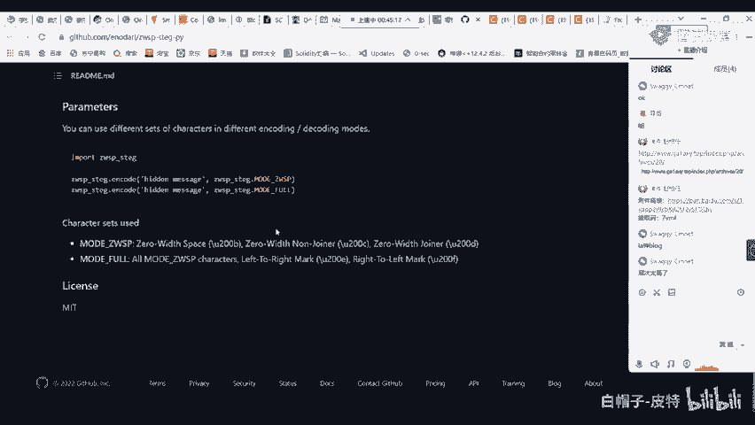

嗯，他我也知道，我觉得他的密码学学的挺好。我正常能看到一些密码学的题目，他能做出来。

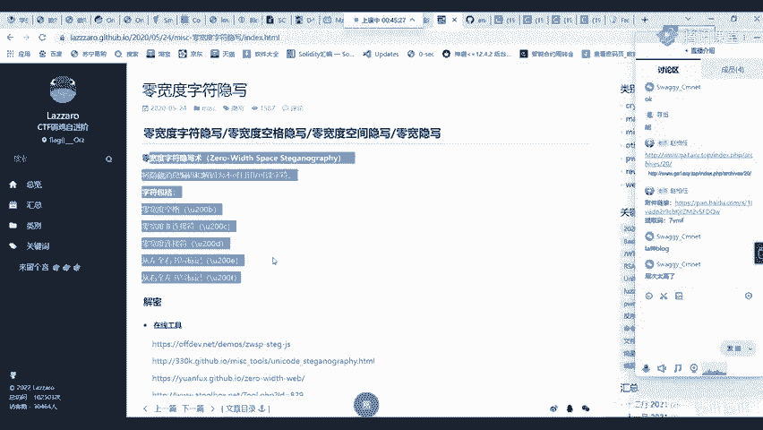

啊，确实。嗯嗯。然后包括咱接下来后续也有一些密码学相关内容，可能但是后续用的是我校的一些人肉博克。反正这这就是介绍一种那啥嘛，就是你看他用一些字符集，就是U200B200C200D啊，200F什么什么。

但是他这个模式不全，这是他的一个最大问题。😊，就是他模式不全，有时候他那个模式不不足以它解密。所以我也在考虑怎么把这个那个东西当下来，就是那个在线的，应该可以荡。应该我觉得他那个是JJS实现。

可能都是前端前端在弄。😊，然后这里就跳过了，灵宽度可能大家也有一个大概的掌握了。

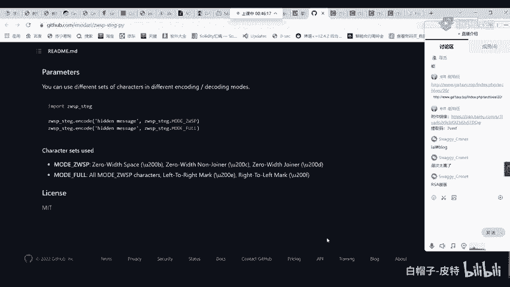

然后咱们接着往下说。我们接着上PPT看吧。然后下一个就是说一些这种奇怪的编程语言，这个编程语言在CTFT里确实没少考，而且它至今也是在保持一种新鲜的状态，包括什么音频啦、图片了，现在还没有视频的。😮。

然后有一些什么各种字符，这已经是非常常见的了。然后我们直接上次这个来看一看，因为这上总结的已经非常全了。😊，我这也就不做赘述了。就是他这里那这里头显示就是OOK它也是一种呃图灵完美语言吧。😊。

然后这个REmo它就有点像一种摩尔斯马，然后他通过这种来定义所有的这种语言。然后这种东西是这写词汇你的施瓦辛格啊，这里头就就大概过一下呃，JSbu这是值得提一下的。GSf还是非常实用。

它也是一种图联网魅免，他用这种。😊，呃，极端段6个字符才可以实现所有字符的编码，然后就可以实现所有的呃代码编写了，然后以及相关的东西。然后它是在JGS引擎上是可以运行的。所以我们可以考虑使用这个浏览器。

直接可以运行它。😊，还有这个米拉to，这是一个我个人是出过题目的。这个最早是在这个20年的小米杯，它出现了。然后嗯就是利用这种密D文件，也就是一种。一频谱文件，他用这种音乐模式最决定程序命的。

就比如说什么哒哒哒滴答，然后这种节奏再加上这个音高音调，它会决定一个程序内容，然后用来打印一些东西。然后这就是一个hello world的Vlato语言版本。😊，然后这里gss它是一种函数式编程。

只有WW和比。然后他这个就是一种打印W，这我也不多说了，这都是比较那啥的了。然后bring fuck这是一个特别著名的，而且bring fuck不光在这个杂项里面出现非常多。

它在这个逆向里头出现也特别多。因为你这个逆向里面可以利用这个这bring fuck做一些机这个编码器的使用，然后可以加大这个程序逆向的难度，相对来说。😊，呃。

就包括逆向的人员需要去了解他每一个这个字符都代表啥。咱们可能就知道怎么去啊知就是识别它。就是我看看到这个东西，嗯，我知道它是brare fuck，然后我们找到一个能解密的东西去进行解密，但逆向不可以呃。

包括他这个东西其实都是在基于内存去。😊，基于内存去实现一些内容的，就是它不光光可能是在这种输出的地方做出这种加密啊，就比如输出一个flag，它可能是在内存中写了一个flag，这个可能都是咱们需要这个。

啊，怎么说，咱们需要注意的，就不不一定要非得是让他输出出来。可能他那内存里已经写好了，他就是通过那什么加加加，就是什么下一个指令集，然后括号什么那啥就是。😊，呃，是加是给当前的那个计算器加吧。

好像是这么个意思，然后一直往下走，他是挺挺有意思的一个人。😊，然后再往下下再往下一下。😊，就是撇T这个我也要说一下，那么PT作为一种编程语言，他也他也经常出题吧。尤其是在去年去年是出了很多这次类似的题。

然后包括撇T呃还有一种也不能叫做它的辨识的，就是也是利用这种图像色块进行加密。那个呃也是一种图像加密，大家如果搜这种什么color block programming，应该也能搜到，也是一个gi的项目。

呃，去年的安寻就出了这么一道题。当时一度以为是PT，但是怎么解密都没有用。😊，这个大起就是呃了解知道就可以了。😊，然后这就是我刚才说的w space了，他就只用空格键编写。

然后它可以轻松的将这个嵌入到CCI加，还有其他语言编写程序中，这也是一个非常牛的语言，而且它也可以用来做一些逆向。😊，然后这是我刚才说的OOK。😊，然后这个mbo，还有这个chicken的话。

相对来说它就类似一个重复次数的决定了，这个感觉就是。比较那啥了。感觉比较。呃呃不好评价。然后大概这种程序进行一些引写，就说到这里。然后包括去年我也说了这个什么美团上出现了这个。和，一毛几厚的嗯。😔。

找一下吧。嗯嗯。猫巾啊。嗯。好慢。什么情况？就这个。嗯嗯。

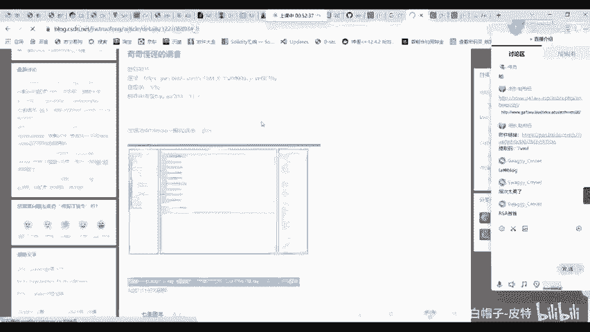

啊，就包括他这道题也是一个很好的这个。😊，测试题目，这个大家也可以做一下。😊，这个这几个我发的都留微作业啊，我发的都留微作业。😊，就是你可以看到它这上面有这个WS，它都告诉你的够够明显Yspace。

然后编程语言，它有个504B504B大家应该都知道就是一个压缩包，然后变成压缩包文件。然后就能看到这个那这个我们通过不断的搜索，不断的搜索，发现它是个do子 code点码。这个当时我也搜了好久好久。😊。

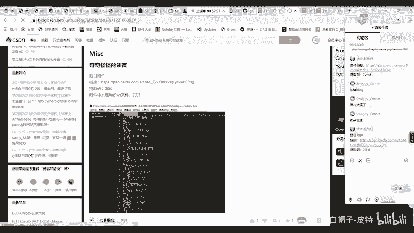

然后扫描得到了什么this is hard password。然后就能解这个KGEKGE是1个KGB啊 achievever，呃，相当于说说的是这个比种比较早的一种压缩形式。😊。

这个比较早的压缩形式就自然有它这种单独的解密的工具。然后就是下这个KGB了achie就是你搜这个点儿KGE文件，我们应该用什么去打开，它应该用什么去操作它。😊，然后就能得到这个。然后就解密到fin点R。

然后找到hit与m，然后看这什么奇怪Emojif VM6，然后发现一个EoG语言就可以啊这里显示不太清楚，但大概可以看清吧。😊，然后我们这里就能找到相关的什么giub，然后。😊，就是去编译它。

然后直接运行就完事儿。难度不是很难。大家可以好好看一看这这这两道题。🎼这道题作为作业，一会儿我发一下。😊，嗯，我也不嗯下一课我就不多留了，然后现在也到了这个休息时间，然后这里我拖堂了一两分钟。

咱就晚一两分钟上吧，5152，然后咱再重新开始上课进，然后咱先进行这个休息。😊，先先到这儿。一会儿一会儿接着上，一会儿接着叫嗯嗯。😊，🎼，🎼あ。🎼Don I dream about you。

 You're still so beautiful。 You really still so beautiful。 You really still so beautiful。

🎼Listen to theby the album， walking through the heaven of music， when our words and known to work。

🎼I will never forget you。🎼Some我玩戏盆。🎼Some more完了。🎼Wasしわし the sunlightラ。🎼Soundssh and sway。

 I think of here to get in and thrills around you， but I can tell to spell to you What I be It like you。

 What a I be， What I be What a I be What I。🎼you baby girl知。

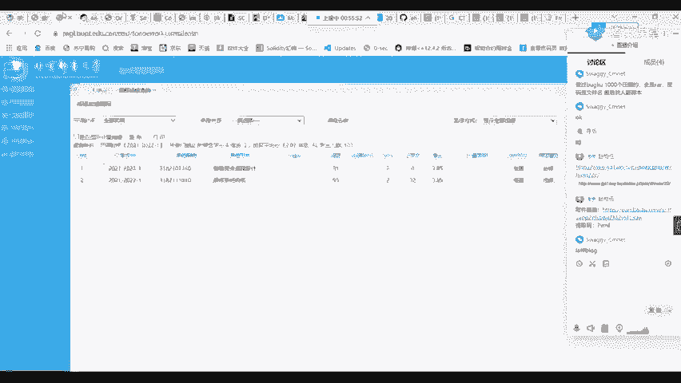

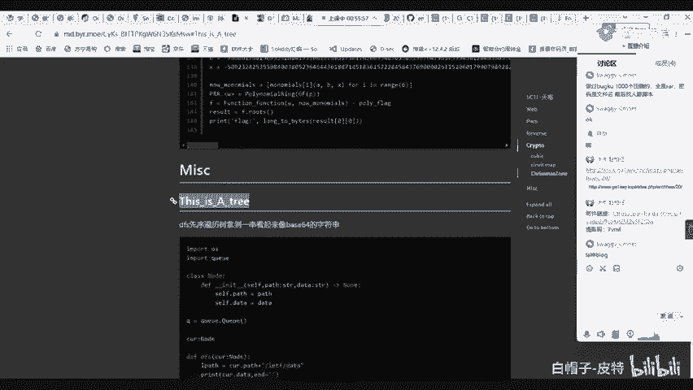

🎼听 so远方。🎼It really is still so beautiful walking no music to。🎼I will never forget you。🎼向往关cier。

🎼Some么完世了。

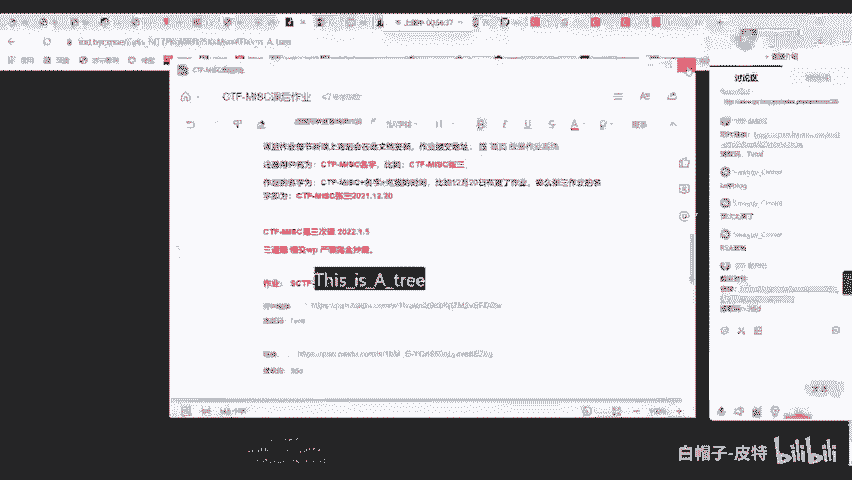

🎼忘ちけでわしたさ。🎼Sometimes when a think of you， the good things thrills around the youth。

 but I can tell the to you What like you like sometimes。

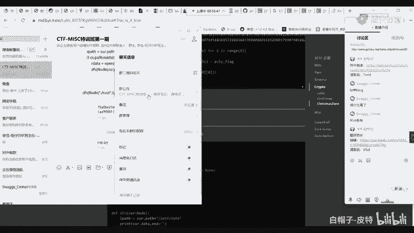

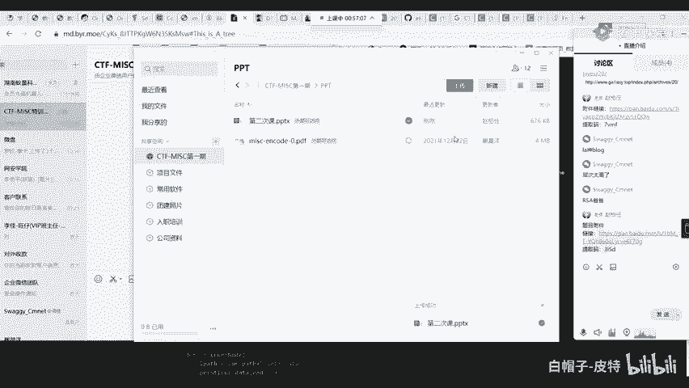

🎼大家可以先休息一下啊。🎼Why does I a I could。🎼Ha me， I drink I need know， I want to place with no time。

 Don it feeling and letting you in。🎼画面 the room有 to。

