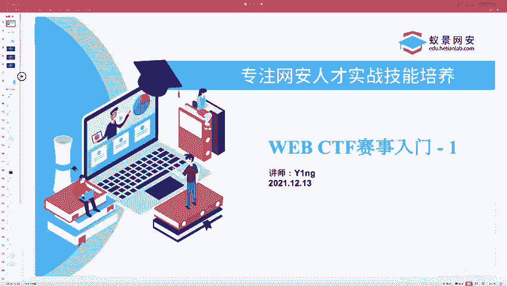
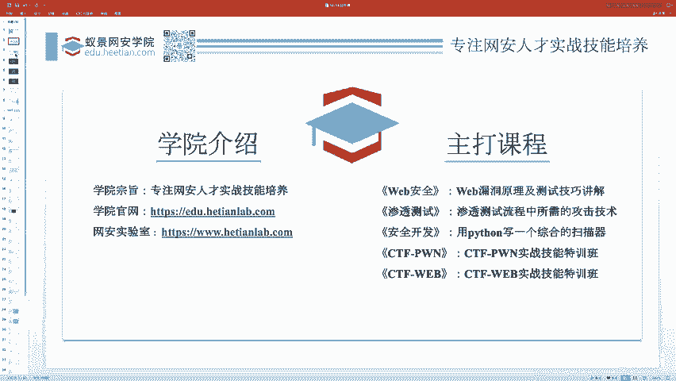
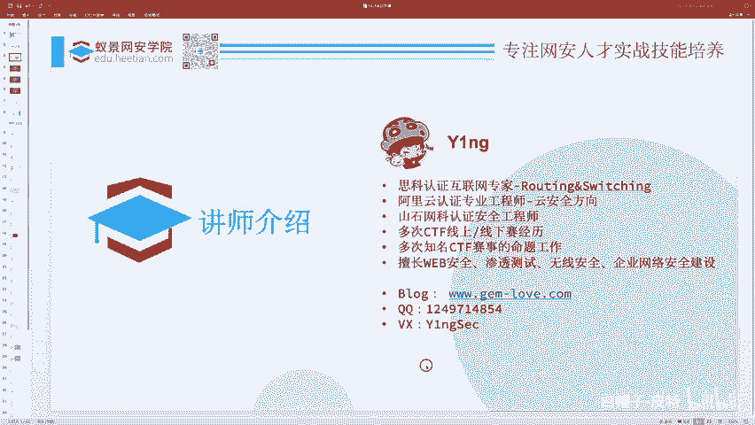
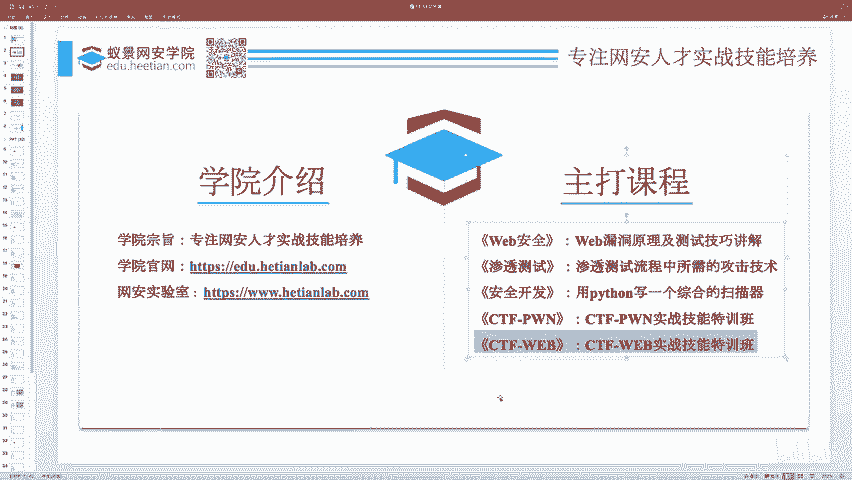
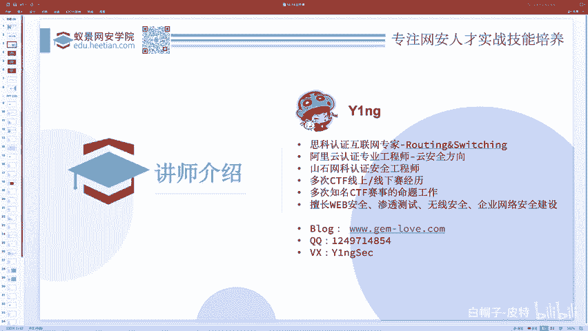
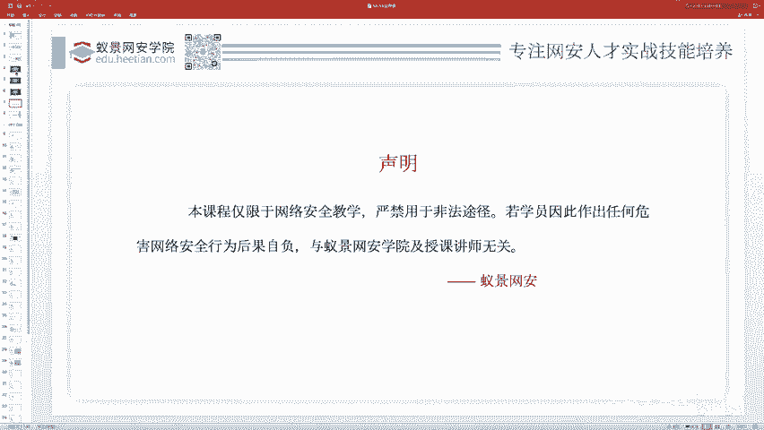
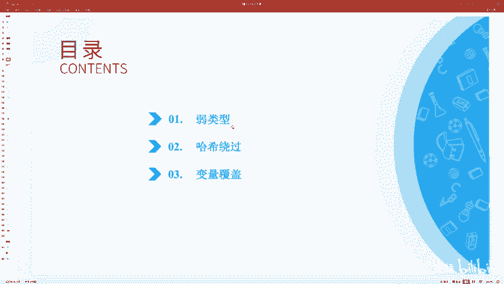

# 2024B站最系统的CTF入门教程！CTF-web,CTF逆向,CTF,misc,CTF-pwn,从基础到赛题实战，手把手带你入门CTF！！ - P64：CTF web赛事基础 - 简介及课程类别 - 白帽子-皮特 - BV1m64y157UX

。

首先欢迎大家来到我们的这个。😊，CTF基础入门课程，这是一个公开课。所以我们的课呢。呃，也是比较简单的，主要还是呃方便大家入门，然后讲一些技巧性的东西。啊，今天也不难啊，一共45分钟我们会讲。嗯。

三三个小部分其实都是比较简单的内容。

首先呢介绍一下我们的学院。这是我们学院的官网和我们的网安实验室啊，我们学院是专注于网安人才实践技能的培养啊，我们这个学院啊有很多重大的课程，大家可以来到我们的这个腾讯课堂的首页啊，官网啊等等。

都可以去看到。啊，比如说呃我这PPT。别更新啊，我们除了CTF胖啊，we部以外，还有这个miss的课程，对吧？前两天大家应该上过了。

啊，然后我是今天和明天两天的讲师。呃，关于我的个人记录，我个人介绍我不在这里念了，大家简单扫一下就可以了。下面的呢是我的一个个人联系方式。然后因为我们学院的主打课程，有一门CTF web实战技能特训班。

然后我是这个实战技能特训班的主讲讲师。

同时嗯也负责讲一些外部CTF方面的这种公开课呀等等之类的东西。那么关于呃课程也好，还是不不是课程也好，不管您报名不报名啊，就是只要是和这个CTF啊、外部安全等等差不多的这个我所研究的方向有关的啊。

交流也好啊，问题也好，都可以。欢迎大家。啊，加我的联系方式啊，和我沟通交流。

那么剩下的我不多说了啊，还有就是我们的这个课程呢啊有些地方会涉及到一些攻击行为啊，只用于这个教学和演示，请勿用于其他用途，否则啊后果自负。这是。

呃，希望大家遵守一下相关的法律法规这个。呃，没有什么别的。然后这是我们今天的三个目录。弱类型问题，然后哈西绕过问题和电量覆盖问题都都很很简单的那种啊外部CTF的内容。

可能就是因为你知道CTF它是有不同的水平的比赛，对吧？有专门针对于新生的，有专门针对于企业的，有专门针对于那种很难的老鸟啊，有有世界级的质量很高的那不同的比赛这个。难度是不同的对吧？

不管你是一个什么水平的人，那么啊只要你想涉足这个行业呃，涉足这一个方向，涉足这个领域，那么没有人下城市就会跑的，都需要去从零开始，从最简单的那些东西开始，慢慢的成长起来。每个人都是这样的。

那么我们今天要讲的内容就是一些比较简单的这种比赛。你比如说你们学校可能办一些什么招新赛啊，新生赛等等这种东西，他可能会比较喜欢考的一些知识点啊，弱类型问题啊等等这些。

