# 2024B站最系统的CTF入门教程！CTF-web,CTF逆向,CTF,misc,CTF-pwn,从基础到赛题实战，手把手带你入门CTF！！ - P6：web-webshell管理工具 - 白帽子-皮特 - BV1m64y157UX

然后我们看第三部分工具，就是一个web shell的一个管理工具。啊，我攻击者来黑客在入侵网站的时候呢，通常是以各种方式写入weshop。也就是我们说的网络木马，从而获取服器的控制权限。

那么为了方便对这些we进行管理。但是呢各种各样的外需管理工具。就是我们大家比如常见的有那种啊一句话木马。比如说我们。我之前的这个we里面有很多这个一句话木马我。看一下之前写的一句话木马。

这就是一个以句换目嘛。把这个上传到目标服务器，如果它能够解析这个文件。那么我们通过这个管理软件就能够控制目标复习。就一句话木满什么意思给大家解释一下。这是PHP语言，这不用管。然后们这是结束。

这这个这个部嘛，我们真正要看的就是中间这一句话。所以大家一句话不管，这是中间真正的命密。这是什么意思呢？多了post就是以post的形式来传递参数。参数就有变量名，变量值，变量名是什么？

 passwords word这里是自己设置的。就像我们刚才b里面抓包。用这个这是传递参数的变量离，这是变量值。参数的变量比变量值变量比变量值。这样一个关系。这是变量米。这句话意思是说。

获取posts传输数据中past word这个变量名面的值。这整块就是它的值。然后这e呢就是把里面的内容当成PHP的语言语句来执行。就是这个传入的值。会当成PHP的语句来执行。这是以往函是的作用。

然后前面的艾特呢就是不显示报错信息。因为黑客嘛他就为了控制服务权限，他一般不会显显要显示报错信息。因为报速信息是显示在他攻击的机器上的。打击上的。这一句话木马，那么如果这一句话木马上传上去了之后。

我们怎么进行利用啊？主要是有三种工具可以进行利用。分别是这个中国乙建、冰心和哥斯拉。我们重点讲这个中国已建这一种。

中国已建这个怎么用呢？我们在我们的分享工具里面也给大家有一个文件夹，是这个web share管理工具，里面有个已键，还里面有两个压缩文件。我们首先把它提取出来，解压出来，也就是。

添加个空间ent sword就已键它的源代码。这里呢loader是它的一个加载器。我们要使用这个已键呢，就要使用这个loader，打开这个loader里面进入这个under word这个程序。

直接双击打开就可以了。第一次打开的时候是这个样子，他会说让你选择以键的一个工作目录进行一个初始化。这个工作目录呢就是刚才源代码的那个目录。源代码步能就and word这个步录。我们选择。这个文件夹。

他就会。完成初始化。完全初始化之后，你再次打开ner当中的andword这个。程序。就可以正常使用这个一键了。这里面就可以添加数据，目标的网址连接密码。等等。那我们在后面文件上传的过程中呢。

会再讲到这个。

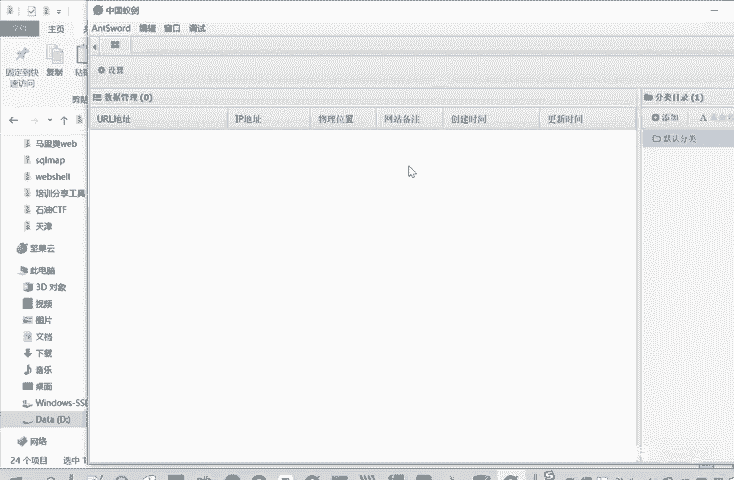

再讲怎么用中微已键来进行一个连接。怎么用中国已建来进行。管理这个外部线。可以看到它是一个非常强大有用的一个工具。这都是啊之前添加的一个数据，添加数据之后呢，你就。测试成功了。

这个目标服务器就可以被你控制。你可以查看文件，执习命令都可以。然后还有一种就这个中一件类似的工具呢，就是叫冰烯。冰烯呢是通信过程中使到AES这个高级加密算法。

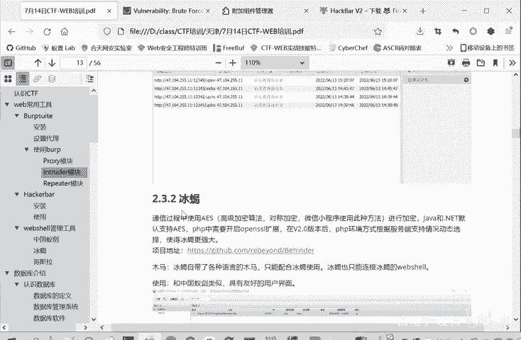

所以它的加密性能就更好。这个冰靴也是。在我们的外部线管理工具中，就是这个。第一打开。把它解压缩掉。们可以提取。然后在这里面这是一个java文件，所以它是一个基于Java，它需要一个java的环境。然后。

直接打开就可以进行一个使用。不过冰邪有点特殊的地方在于什么呢？它不能够上传。我们刚才给大家看的这个一句话木马，它有自己专门的马。ASP的嘛SPX的GSP的PHP的。

这个马和这个冰邪的这个工具是基一个一一对应的一个关系。冰C的码只能用冰烯的工具，这个工具进行管理。然后冰烯这个工具呢，它也只能管理他自己这个码。就这样一个关系。其实这个使用起来也是一样的。

你不管上传一句话木马，还是上传这个冰线木马，就是把这个P。比如说是一个后端语言是PHP的，就是把这个文件给上传上去。然后用这个兵线来进行连接就可以了。这里需要给大家提示的一点是什么？就拼接拼接连接。

比如说我们这个引线连接的密码呢，就是这个参数的名称。这里写的是passor，就pasor跟且CMD啊写A呀，就是相应的CMDA。然后冰夕这里的密码是多少呢？是在这里设置这个K这里设置。

大家看这里是一个哈希值。这不是我们要输入的密码，密码是什么？比如说你把它初始密码是这个rebd。rebd呢计算它的32位MD5值去前16位放在这儿，那密码就是reb。同同学们。

如果说你想把密码设置成别的，把密码设置成test，那你就计算。这里。计算test这个字符串的M组值，把前十6位放在这儿。然后上传这个木板，那么连接的密码呢就是test，这连接密码的修改方法。

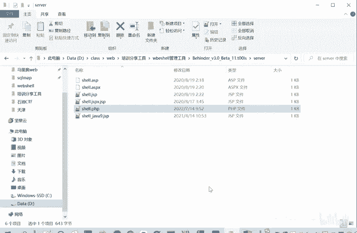

他们三种工具是事实上就功能是很很类似的，这个互为替代的作用。我们看第三种工具，哥斯拉。哥斯拉卡。利用也是直接打开就上传木马就能利用。它不是专用的木马，通用的木马就可以了。我们介绍这三种工具。

它的功能都是类似的。为什么介绍这三种工具呢？因为总是会出现某种工具被封的情况。然后介绍这三种主流的工具的话，大家以后在做题的时候，适用性就更广一些。不是说某一种工具被封了。那就上传木马没法管理了。

主要不能出现这种情况。所谓的管理就是利用这个上传的木马，你没法利用的话，那你这个木马就是吧？白上传这到企业就做不出来。啊，前面是我们的一些基础的一些知识，CTF的概念，还有一些常用的工具啊。

最后再给大家介绍一个工具就是。

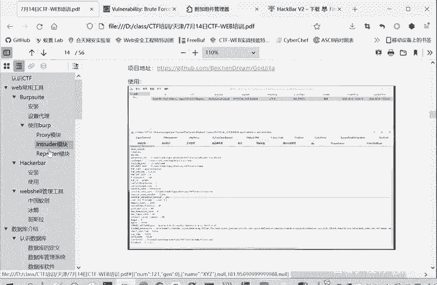

我们分享工具里面有个基础工具里面啊。有PP study。这个直接解压就行了。解压了就是这样一个程序。这个程序呢直接双击打开，然后进行一个安装，但是不能有汉字和空格。进行入安装之后呢。

就能得到我们一个本地的一个网络环境。大家打开就是这样。这里启动两个预点，就是阿帕奇服务器和mysq数据库，就启动就可以启动成功了。就是预点。如果是不成功的时候，就是红点，点击停止，它们就变红了。

或者点击重启。你这样把PHP study成功启动之后呢。我们在本地呢就有了一个web的服务器。我们本地就相当于一个web服务器了。这我们本机的地址，HTDP80这个都是审阅的，默认的。

直接访问能访问这个。How。他的word是在哪呢？是在这个h study这里面它会生成个3W目录。三W位目录下有个index点PHB文件，它这个输出就一库hello world。你可以进行修改。

什么i love study，那么重新进行访问呢。我们刷新一下。给我信行修改。因为这时候我们本机是个服务器，这相当于是网站里面的一个文件。然后通过浏览器访问这个网站。这是我们本地搭建外部服务器。

那么有了这个培训 study之后呢，我们后面再搭建别的一些靶场。比如说DVWA这个靶场啊。还有文件上传里面的一个upload maps这个靶场。灾后注入的一个白卡。这是非常方便的。

只要把这个把手键放进来就行了。

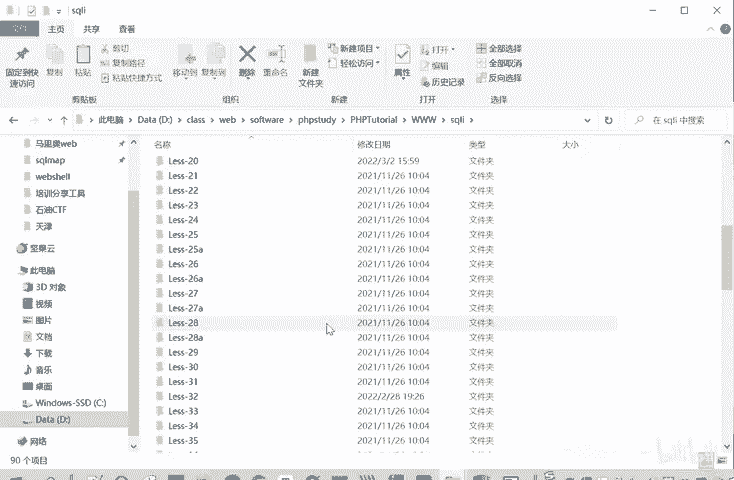

这是个PP打点。这个大家要装一下，因为装好这个之后，你买s数据库也就装好了。后面我们再进行一个。Ccle注入的一个学习的时候，也会用了myC个数据框。那我们DVW靶场刚才给大家演示了这个靶场缩小，哎。

怎么放这么大？

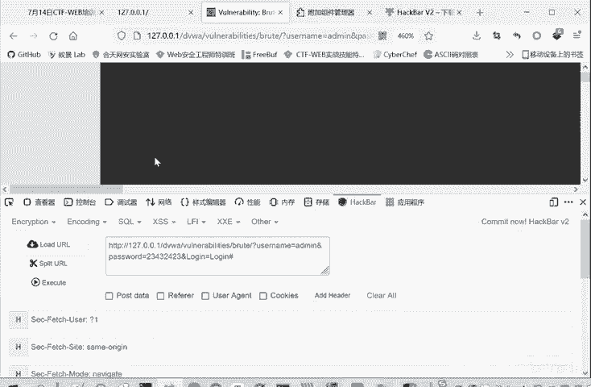

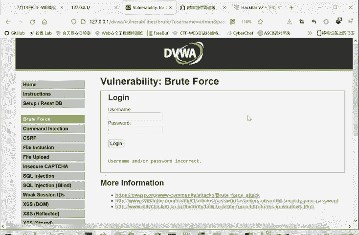

去打场。其实也是搭建在我们PHP study这个集成环境当中的。

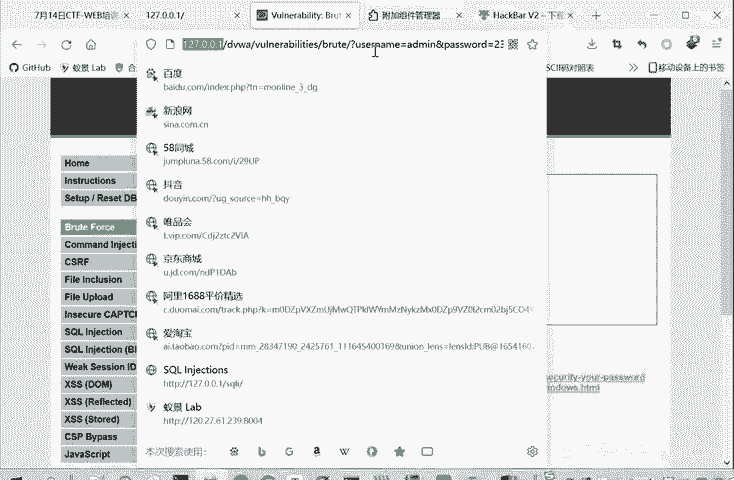

啊，117。0。1就相当于我们本地的一个。

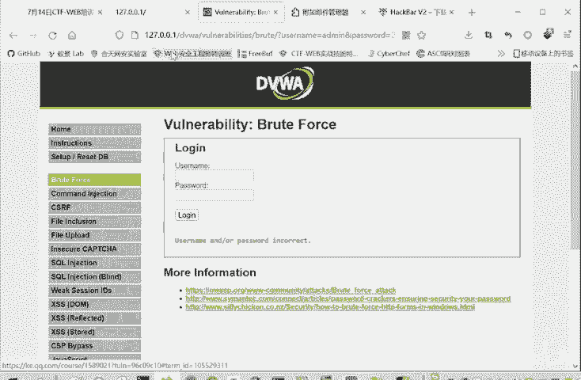

3W目录了，然后再访问DVWA。

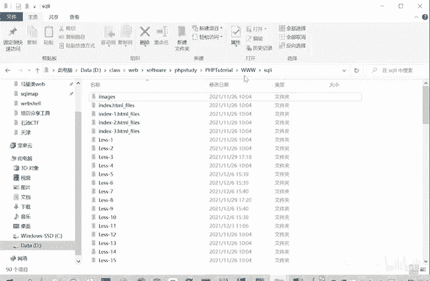

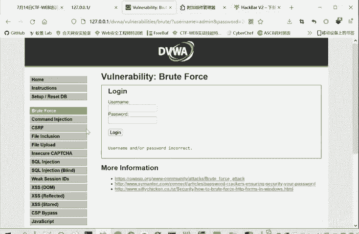

这有很多白场。