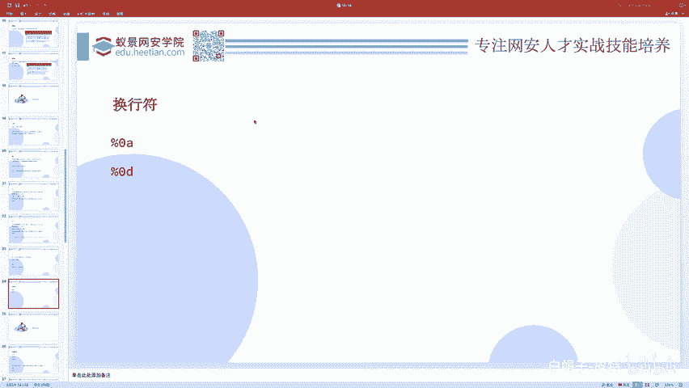
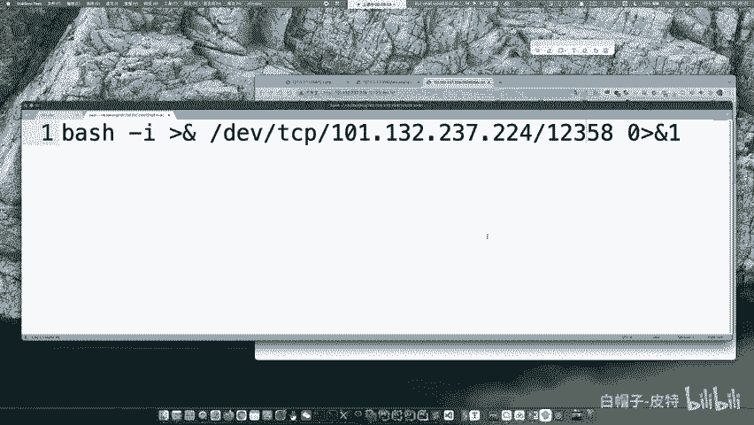
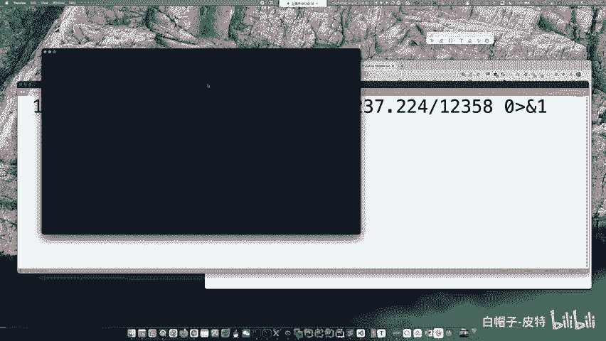
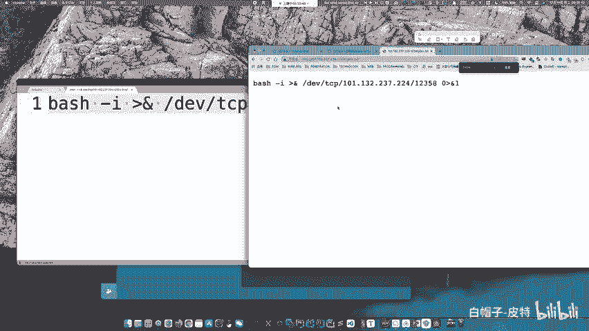
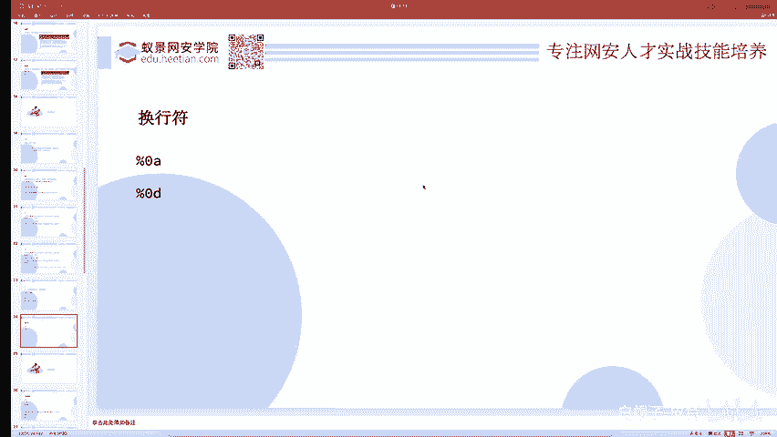
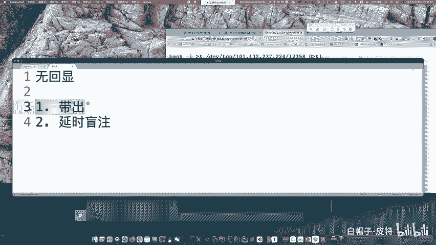
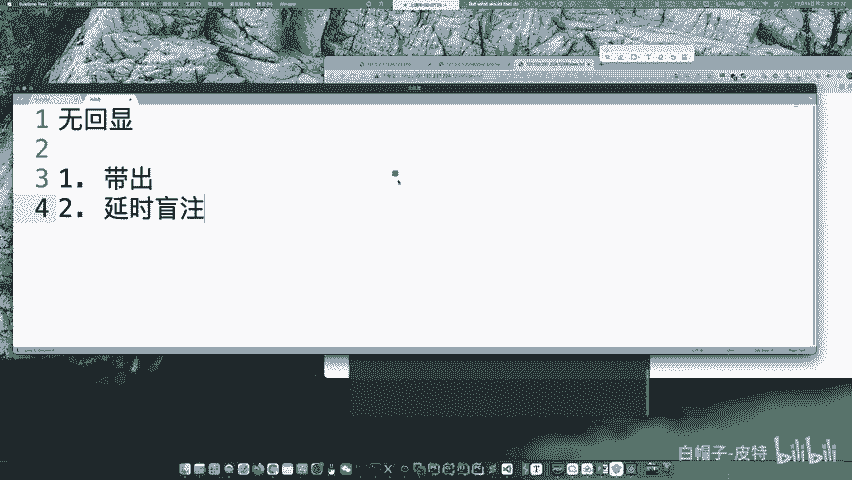
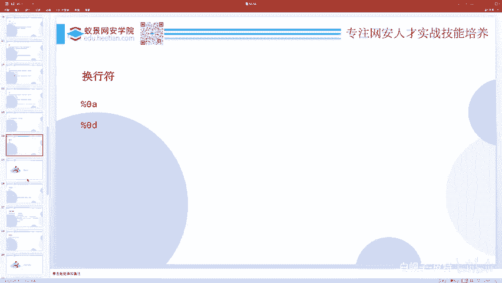

# 2024B站最系统的CTF入门教程！CTF-web,CTF逆向,CTF,misc,CTF-pwn,从基础到赛题实战，手把手带你入门CTF！！ - P73：CTF系列教程-ctf-web 联合执行 - 白帽子-皮特 - BV1m64y157UX

AW比赛时，现场齐全。现实吗？呃，一般不现实，为什么呢？因为呃提全往往需要连外网，有那种批量的那种一键测试齐全的脚本，叫什么呃呃linux什么privige。

suggesure之类的那种呃github上有相关的那个。呃，那个仓库就是专门这种工具，那个叫什么，大概是叫什个名字，吧，具体的我也拼不起来，但是他都要连外网。但是比赛的时候。

那那比赛平台那是上不去外网的，所以就不太行。但是你可以试一下那什么SU度提全那种工具。你如果自己本地有，那个倒是有可能成功。但是不提权益，也不影响你打比赛。只要你的框架到位，你的手速快。

你的这个手轮打的好就可以了。AWD类似于红队攻击吗？是完全不一样的东西。呃，可以说是没有没有任何联系，除了他们都考验一些呃外部安全的东西。呃，我记得你们有一次AWD全防御了，别人打不进来是啥情况啊？呃。

是因为我们把交换机给日下来了，然后加了ACLACL把所有选手的网段进来的流量全都给屏蔽掉了。因为ACL叫访问控制列表嘛，访问控制的嘛。就就所有的选手都打不进来了呀。所以就是防御。

接着我们说一下这个联合执行。因为你看刚才我们实际上是执行了两条命令，对吧？一个拼命令，1个RS杠L命令。那么用的是什么呀？用的是分号。

那现在我们其实就可以看一下到底有哪些东西都可以把两条命令执行在一起呢。首先第一个就是分号，分号也是最好用的，一个，因为它是一个无条件的命令的联合。不管你这个命令执行成功与否，你都不干扰其他的命令。

你们三个就是互不干扰的东西，我只是把你们一起执行。至于哪个能执行成功，哪个执行失败，根本不会影响到其他人。😊，这是最好用的一东西。除了这个以外呢，还有一些别的，比如说按end的是前面一个东西执行成功。

后边一个就呃财政执行。然后货呢是前面一个执行的不成功，后边一个才执行。😊，那一个货呢，还有一个and的都都是有的，它的对回显不一样。然后这个一个货表示是前一个命令的结果变成后一个命令的参数了。

比如说呃我们L一口1个1123AABC之类的东西，然后管道付MD5MD5命令。是算一个东西的MD5吧，那他应该接收到一个一个参数，而这参数在哪来呢？在管道符前面呢。

前面这个一口ABC这个ABC就给了MD5。哎，他就是这个东西啊。还有就是换航符，换航符也是比较好用的，因为相当于你直接回车了呀。但是换行符并不是所有编程语言里边都可以用来命令呃联合执行。具体的你要测试。

除了联合执行以外，还有还有内联执行。内联执行我们呃等下再说。嗯，这里边就是一些命令执行的东西啊。如果说大家呃想要去做一些简单的题，可以去。做一个叫做ACTF2020。然后。EXEC。

这个题应该是叫这个名字，可能是大写的EXEC。在那个BOU平台上。就可以那个什么就可以直接开一个环境，蛮简单的一道题，就是最基本的命令执行。你们可以去做一做，但是那题比较简单，就呃就是一个拼命令。

直接输入1个127。0。0。1分号ca当flag就可以拿flag了，我就不再开环境，带大家自己看。呃，sell反射什么什么是sell反射，反弹se吗？你是说。

反弹赛一般就。执行那个。反弹少的命令就可以了。一般在无回险的时候，你可以反弹下。其实阿里云最近很讨厌，把括这微没被按的流量就全都给。干掉了。你比如说你有这个IP地址，这个端口号，你就可以去反弹啊。

这就是我的那个地址和端口。

你去执行一下这个，然后就可以了。

一定要有VPM？一定要有啊，不然你你反弹给谁呢？这边是你的IP地址，这边是你的端口号。比如说现在12358嘛，所以我就监听12358。打错了NC。然后去执行这个，但是呃一般来讲可以执接执行。

但并不保证能执行成功。你比如说我现在执行它是不是就没执行成功啊，那这个时候一般怎么办呢？你可以把它放到一个呃那个web网站上1个T叉T文件，就像我现在这个文件。

然后我们CYL它你看CYL它是不是得到这个命令，知道得到这个命令，然后管道符BSH管道服我们知道把前面的这个东西作为后面的一个参数。😊。

哎，你看现在是不是又弹过来了？😊，这就是一个呃命令执行。我在这边反弹了我本机的sll，然后我执行了open点。那你看是不是就把当前就弹出来，这是一种办法。还有一种办法呢。

我们可以先把这东西进行base64。然后怎么办呢？eal base64就得到这贝ase64，然后管道符贝64。呃，杠D杠D就是本儿。baseSE答错了，表示是decode解码。

然后你就解出来这个命令了吧。哎，不是这个网址啊，搞错了。是这个是这个东西。一口这个东西，然后贝死6死当地。你是不是就把它给解出来了，这又又多了一行，这这是这哪来的，重新搞一下。然后贝斯优斯杠D之后呢。

你就得到这个命令，得到这个命令之后，你在后面再管道斧呃。😊，1个BSH。这不就又弹过来了。这就是反弹 shell，一般就这么搞就可以了。除此之外，还有用PP代码去反弹 shell。

用python代码去反弹 shell。你可以往上搜一搜，有好多好多的，还有直接用NC去主动连接，把那个BSH并BSH去呃给传出去的。但是并不保证所有的题都有NC但这东西只要是lin有。

有BSA是这个东西。就可以用了，所以这是比较万能的方法。反弹shall一般用在呃无回险的情况下，就比如说这个东西它确实会执行命令，但是它只执行了命令，但是不告诉我们回显，这就有无回险的东西。

无回险的问题不一定是命令执行无回险，还有一些别的无回险。比如sQ注入的无回险。😊。

都有两种解决办法。第一个就是请求代除。第二个呢是延时盲址。

呃，请求的代出呢，所谓的请求代出就是。把这个结果你不是不能直接给我显示出来吗？你不是个无悔显的吗？你就给我带出到我自己的we部服务器上，我可以在这边监听，然后你直接COL什么之类的，给我发起个请求。

我在这边接受包也可以。我也可以监听，你直接把你的sll送给我，我得到你的反弹 shellll也可以。这种呢都叫带出。那如果说带不出怎么办呢？😊，其实有一种有一种问题就是现在我允许你去执行系统命令。

但是我不告诉你命令执行的结果，我还不出网，你想要带出。哎，不好意思，我这个只能你连给我，但是我不能连你，就是有IP table之类的东西。呃，把这个流量干掉了。那这时候你就只能去做延时忙助了。诶。

就像这个CQ注入有时间忙住，对吧？所谓的延时忙助就是那除了CQ语句以外，我们这个hell是不是也可以啊？只要你用shall去执行嗯，这个一个条件。如果说这个命令执行的结果。第一位等于A，那就sep5秒。

大概的意思都是一样的，只不过它换了一种编程语言，就相就相当于是你好和hello的区别一样，呃换了一种语言而已都是一样的，所无危险的问题有这么两种解决手段。😊，要不咱直接讲AWD吧。

我们的课程是有安排AWD的，但是没有安排在公开课里。

