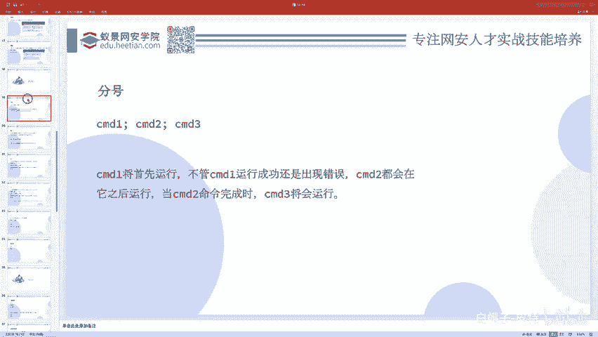
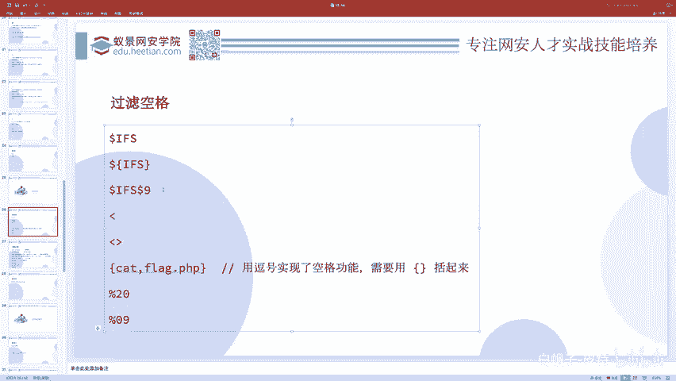
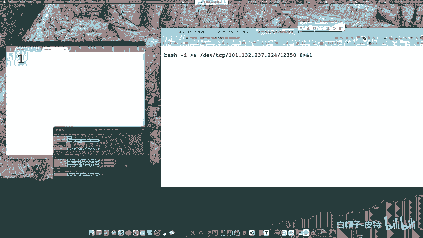
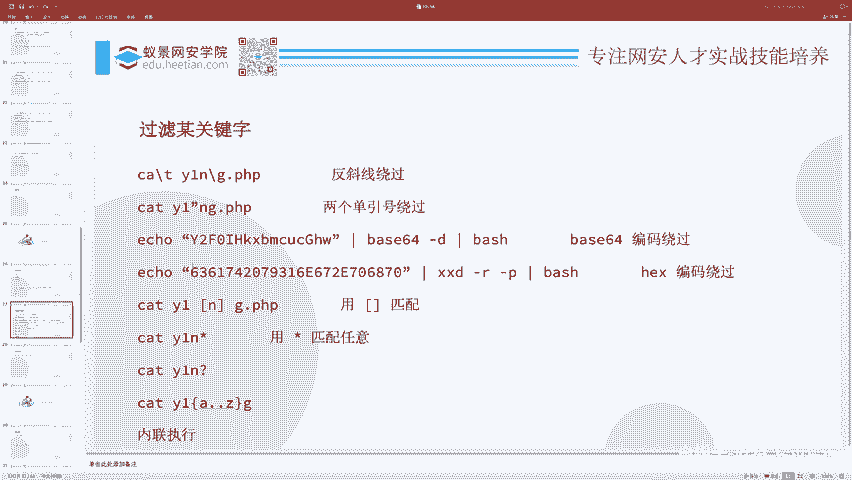
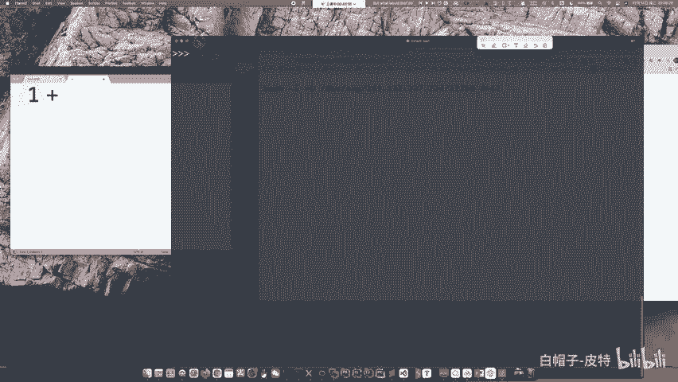
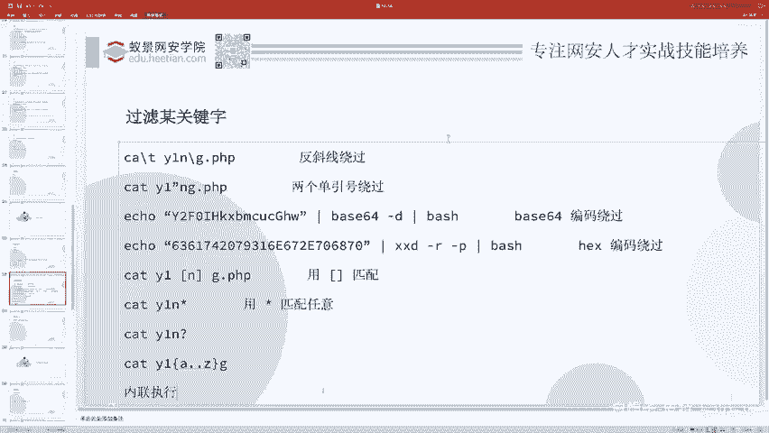
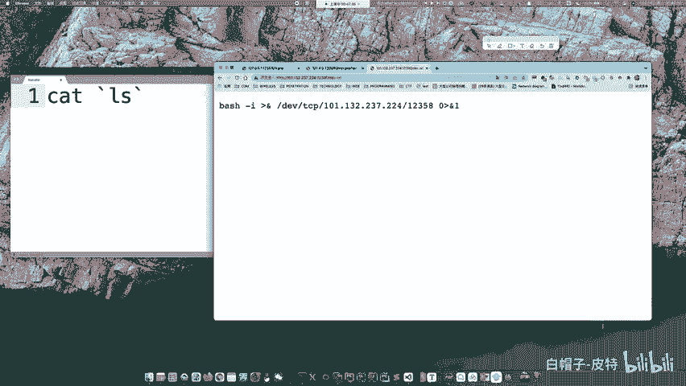
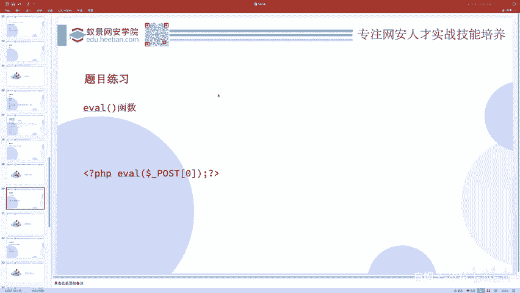

# 2024B站最系统的CTF入门教程！CTF-web,CTF逆向,CTF,misc,CTF-pwn,从基础到赛题实战，手把手带你入门CTF！！ - P74：CTF系列教程-ctf-web Bypass - 白帽子-皮特 - BV1m64y157UX

接着呢我们讲一些这个绕过过滤的东西，前面讲的都太基础了。这太简单了，一听就会，这这题出理也没没啥意思，对吧？所以说他一般会给你加一些过滤。就是说比如说嗯你现在不是很喜欢嗯cat flag吗？😊。

cat杠 flagag那ca不能用，不好意思，空格不好意思不能用杠 flagag不好意思不能用。那这些关键字如果说不能用的情况下，我怎么样还去执行这个cat杠 flagag呢？

这其实应该是CTF本质更要研究的东西。因为你你刚才讲的那些那都太简单了。😊。

所以下面我们看一下怎么样去呃做这些事情。首先呢呃过滤空格。有这些解决办法。嗯，我们一个一个来看吧。

我在这里面写一个flag点P1P好吧。dollar flag等于flag哎随便写点东西。好，这就是cat flag的结果，我把它放大一点。

那么如果说空格不允许用怎么办呢？我们可以有这么多种解决办法。首先，doller按FS，然后flag点皮是P。但是现在。出错了，为什么出错了？他说。😊，cat点PPnot found为什么是这样的呢？

因为dollarIFS它表示的是一个变量哎。而你这么一写。他怎么知道你写的是dollFS还是FSF还是FFL还是FSFLA还是IFSFLAG呢？你没有一个区分符号。

所以说他以为你这FSFLAG才是这个变量的，而很明显没有这个变量，所以是空的这个变量是空的，是点PP那你执行了一个点PP当然没有这个命令。所以这样直接写是不行的那怎么办呢？我们可以来加点区分呀。😊，啊。

这个我我要用背来做啊，ca dollar IFS dollar9，然后flag连PP，你看是不是就可以了。或者说你ca dollar IFS，你把这IFS给括起来。bllaack name PP。

是不是也可以啊？除此之外呢，我们还可以cat。然后一个这个东西flag点PPca一个这个东西flag点PP。是不是都可以啊？因为这个表示是导入这个表示是导出在linux里边，导入的意思。

把fag点PPP文件内容导入导进来啊。它因为你像像一个箭头，往左箭头，这个表示往右的箭头嘛，导入给谁，导入给cat，那是不是就相当于ca flag点PPP就发生了？😊。

还有啊我们可以用逗号来实现空格的功能。但是你逗号直接实现空格的功能。不太行。我们需要给它括起来。用这个代替空格可以不？这当然不可以啊。看到没？这当然不行，因为这是mysq的这个内联注释嘛，这是杠星。😊。

杠星，然后你可以写一些注释啊，巴拉巴拉巴拉，然后星杠，这表示的是一个行内注释。这些编程语言里面确实有这些东西。你比如说P是P。还有什么C语言，还什mycycll之类的东西。可以用这种东西。做注射服。

在shall里边不支持这这语句啊，所以肯定不行。除此之外呢呃20%，这一般就是看你编码之类的东西了。209是那个制表符，就是我们通常写代码那个tab键，一个t，一个大缩进，就那个东西用它来代替空格。

这都是UR编码。这是空格的过滤。哎，除了空格过滤，接着呢我们还有关键字的过滤。哪些关键字呢？呃，比如说k就是一个关键词，flag就是一个关键字。cat不能用，flag不能用，这时候怎么办啊？

首先第一种办法，我们可以转移cat flagag点PPP。😊。

反斜线转移。但是你反斜线加到一个正常的字符里边，那相当于还是那个表示的正常字符。😊，它转你对它转移和不转移实际上都是一样的。所以说你加了一个反斜线，那这个反斜线表示转移符的意思。

但是你有没有改变它的本本身的意思？因为你这个正常的一个英文字母对它做转移还等于它本身，所以我们就呃没有影响这个语句的执行。这个命令的执行。但是呢。😊，因为转移符的存在。

我们没有匹配到这个FLAG这个关键字了吧，而是匹配到什么FLA斜线这那你是不是就绕过了FLAG这个关键词过滤啊？这个是转移符，哎，除了转移符呢，还有你比如说可以用。一个带东西。嗯，说到这个。

其实我就想起了一个python的一个特性。其实很多人。😊，呃，他都不知道的一个特性。呃，首先就是呃我们需要知道一个思路。当一个关键字不能用的时候，我们可以把它进行一个关键字的拼接来使用。什么意思呢？

比如说你在做python SSSTI的时候，那么呃flag这个关键字不能用，呃，我们可以怎么办呢？我们可以把这个flag给拆开FLA加上一个这这是拼接思想，你把它给拆分，然后再重组。

那相当于就绕过了关键字的过滤。很多时候STI你都需要用这种技术，但是有的题呀。😊，他会专门把加号过滤，甚至这个加号的过滤会难到好多好多人。就就我看到过的好多rice up里面。

大家都都对这个加号就呃直接就用了一些其他的手段去过滤。但实际上加号的过滤非常的简单。但是这个特性很多人都不知道，就在python里边都不说什么模板，就是python自己它就有这么一个特性。

我们知道python做这个字符串的拼接，就呃字符串的一个加法，那就是A加B就等于AB，对吧？但其实。😊。

字符串的拼接可以不用加号，就除了加号，你还能想到什么别的吗？做字符串的拼接吗？😊，实际上。在python里边。你只需要把这两个字符串贴贴，你把它俩挨在一起，它俩就加到一块了。看到没有？A是个字符串。

B是个字符串吧，中间是不是有个这玩意儿？😊，他俩一贴贴是不是变成AB了？什么点那肯定这是不行的。点是表示PP里边的那个拼接。我我现在说是python。😊，python都没有再点入运算了。

所以在P在python里边。😊，你虽然这这这这里头。一个字符串里头加了一个两个这个单引号，但是对它根本不影响。本质是因为这表示一个字符串，后面又表示一个字符串，两个字符串在贴贴的时候会呃。

一个字符串拼接的效果，尽管他们两个不一定非要提贴，中间有空格也没问题。所以这是python的特性。一用这个特性，你看加号的过滤是不是就。太轻松的就绕过了，你不用不让我用加号，我不用加号就可以了嘛。

对吧这是因为这是python最底层的特性。那模板当然也会继承python这个特性。😊，所以这个呃和和我们这个现在写的是不是呃有点异曲同工之妙啊，我怎么把它给关了？那我再重新打开。

是吧所以我们在这个flag里头也写一个这个两个单引号，相当于。这个单引号就没发生，没有一样，就绕过了flag的过滤吧。除此之外呢，我们还可以把它像刚才讲反弹sha一样。

先给贝64了贝64杠D还有就是我也可以先把它进行一些hax编码，然后用叉叉D杠2杠P解hax，然后再BSH。😊，除此之外呢，我们还可以用通配符来匹配。通配符有这么几种。FLAG点星星表示任意长度的任意。

然后呃问号呢表示的是单个长度的任意。除此之外，我们还可以写管道辅G把G呃ABCD以FGFY到H。那这个中块F到H，它是一个glo同配符说F到H之间的。除此之外，我们还可以写呃大括号F点点H。😊。

那这个大括号和中括号的区别在哪里呢？大括号F点点H就是F到H。😊，之间的所有啊大于等于F小于等于H分别有三种情况。FGH这三个字母我全都贴在这儿，然后把这个命令执行一遍，不管你这个能否执行成功。

我全执行一遍。你看所以FAFFLAGFLAX全执行了一遍。其中呢FLAG执行成功了，并输出结果，这是这种东西的。😊，除此之外呀，我们还可以选择使用内联执行。

内联执行就是说呃把一个东西的一个命令的执行结果放到另一个命令里头。比如说我们LSgra1个FLA是不是能得到flag呀？然后我现在可以把它反引号引起来，反引号就表示先把这个反引号里边的命令执行。

然后把里面命令的一个结果放在这儿。于是这样就得到了flag本质发生的一个顺序是先执行LScFLA得到的是FLA点P1P，然后把FLA点PP放在这，然后开FLA点PP就得到这个除了反引号以外呢。

还可以用一些别的。比如说doer括号也是内联执行的意思，这是内联执行的方法。那一般来讲我们就直接ca，然后翻译号L就把当前目录下的所有东西都ca了一遍，都查了一遍。那flag点PP自然也被我们查到了。

所以说这个是内联执行的方式，这是过滤关键字的。

啊，然后这里边呢有一道题目，高血压CTF2019也叫拼平拼的题。大家可以自己去网上搜一些环境，然后做一做。基本上有我们讲过的这两页PPT里面的绕过方法。呃，这里面除了除了这些，还有还有其实还有一个。

我把它放上一遍。就是变量。用变量。比如说我可以给A等于。FL。嗯，然后B呢等于AG。接着啊ca dollar A dollar B。点PP。A到了A是FLB呢是AD，那就是FLAD点P是P。

这是定义变量，然后做拼接的一种方法。PPT里边忘记写了。啊，变量的方式。好，这是一个题啊，你可以去练一练。呃，接着一些时间呢，我们去讲一些代码执行的东西。代码执行漏洞就是执行PHP的代码。

命令之行就啊告一万段落吧。其实讲到这，基本上简单的中等的就都讲的差不多了。嗯，代码执行里边呢，我们先看点最简单的。就是EVL函数。文件包含吗？和和文件包含有啥关系？

这个EVL函数呢就是说把一个字符串当做PHP的代码来执行。这个意思。那么大家应该听说过一种东西叫一句话木马，就是我现在。屏幕上显示的这个，然后你用一键什么去连接一句话，木马会有一个所谓的连接密码。

那个密码是什么呢？就是这个中括号里边那个纸，为什么这个东西就是密码，为什么这个一句话木马就可以做那么多的事情呢？😊，难道P2P就专门为他开发了一个一句话木马，专门而让这些黑客去黑他们的网站吗？

实际上不是这样的那之所以这个东西叫一句话木马，因为它使用了EVAL函数，而EVL函数会把所有接收到的字符串当做代码来执行。而这个呃执行的代码呢又是一个完全可控的一个参数。

所以说为什么一键能帮你做那么多事情，能帮你呃列目录，能帮你读文件，下下载文件，写文件之类的那是因为一键帮你生成了各种各样的命令，然后EVL去执行了。😊，所以这是呃一句话木马的本质。

那么如果有1个EVL函数，或者说一些别的什么函数，它接收到了一些参数，这个参数是你可控的那就是这个参数这个字符串会当做代码执行，这个时候它就可能存在这样的一个漏洞。

