# 2024B站最系统的CTF入门教程！CTF-web,CTF逆向,CTF,misc,CTF-pwn,从基础到赛题实战，手把手带你入门CTF！！ - P76：CTF系列教程-CTF web sql注入入门之联合查询注入的作用 - 白帽子-皮特 - BV1m64y157UX

那么接下来我们就来看看所谓的联合查询记到底是一个什么东西，以及怎么样来利用。这里呢啊我们可以看一段代码，这个代码其实就是DVWA它的这个sick注入的靶场。然后你可以看到代码。因为尼当你点进去之后。

然后看到没有？这有一个vi source，对不对？这个vivo source呢，你点啊你就可以看到里面的一些它的源代码了。然后我们现在来看这个源代码，这个代码说什么呢？他说我现在接收到一个叫ID的参数。

然后这个ID。呃，这个参数呢放到er ID了，他没有对这个doller ID进行任何的安全检查。他也没有说你这个ID到底是不是一个ID是不是一个字母数字，是不是一个什么符号，是不是什么东西。

它什么都没有管，我就接收到用户的输入接收到输入之后呢，就直接把它放到了这里这是一个Q语句lect first name name from ID等于等于这个 ID它直接拼接到了一个叫做doll query点Q语句里边。

然后你看他接着干嘛了。他接着就直接对这个语句进行了一个知识行进行查询。查询之后，然后呃如果说你查出来结果，我对你每行的结果进行一个输出。所以大家可以看到这个代码呢，它没有对用户的输入进行安全检查。

并且用户的输入拼接进了CQ语机里边。那么不知道大家还有有没有记记得我们刚才讲CQ注入是什么的时候，那那几段话，那几段特别泛泛的泛泛的那个空话里边就说了CQ注入产生的条件是什么？是这个外b程序啊。

它要接收用户的输入，并且呢用户的输入不再是原本的那个参数，而是变成了CQ语句中合法的一个语法的一部分，这个时候才会产生CQ注入，对不对啊？这是我们刚才那样说的那你看现在是不是符合这个条件呢？😊。

要接受一个用户的输入这个ID而这个ID并不再不再是原来那个参数，本来它应该是ID应该是个数字，但它不再是数字，它可以是别的东西，然后呢并且被拼接到这个CQ语句里边。这要一拼接之后。

那就符合它的语法就完全都OK了，然后就执行。所以说用户的输入变成了你这个呃CQ语句语法的一部分。然后那CQ输入实上就完全可以发生的。😊，具体怎么发生呢？然后我要怎么样才可以进行测个注入呢？啊。

大家还不要着急，我们可以慢慢来。首先我们直接输入一，那这个刀 IDD就是一，对吧？刀ll IDD就是一呢，你看这个ID一就会放在这里放在这里。

它就它这个意思就是说我要查询查询从user表里边查first name和last name。😊，满足条件是啥？满足条件是usC IDD是一的那个人的first name和last name于是。啊。

这是OK的，他就查出来first nameadmin他那个last name也admin。然后接着呢我们进行一个sqQ注入的判断，我要判断注入的是字符型还是数字型。但现在这道题啊。

我们刚才已经看到源码了，对吧？但正常的情况下，sqQ注入是你是不知道源码的，你根本不知道它这个呃执行的是什么东西。所以我们要测试。首先我测试一下，它是什么类型的呢。这个字符型还是数字型是个什么意思呢？

呃，有一个比较简单的理解，就是我现在不是whereuser IDD等于。😊。

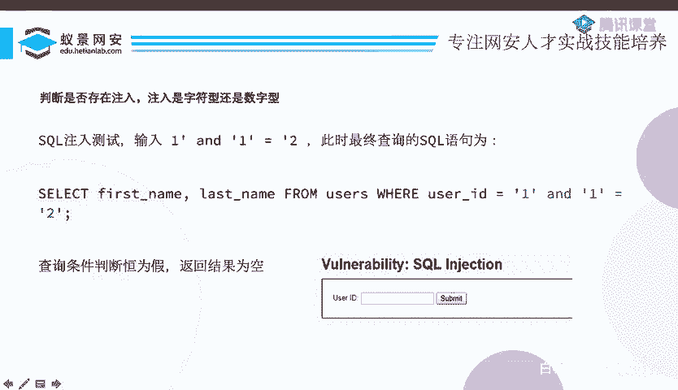

什么doller IDD嘛，对不对啊？它是不是这个外就是这样写的吧。那么现在这就是一个字符型，为什么是字符型呢？因为doller IDD是你的输入，你的输入被单引号所包裹。

单引号包裹的应该是个字符串对吧？所以说你现在就是字符型。😊，那你比如说到了ID是ABC那你就是这样的ABC是个字符号。那什么是数字型呢？数字型就是说没有这个单引号。你看这个UID等于ID。😊。

是个ID是123OK吗？OK了，因为123是数字，它不一定是字符串的123，它数字1个3就可以了。那如果说你变成了这种ABC没有单元号包裹，那就不行了。那ABC他就不认识了。

所以说呃我们现在说的要判断是字符型还是数字型。实际上意思就是说我要判断一下，我这个用户输入的这个刀 IDD这个变量，这个参数有没有被单引号包裹。😊。

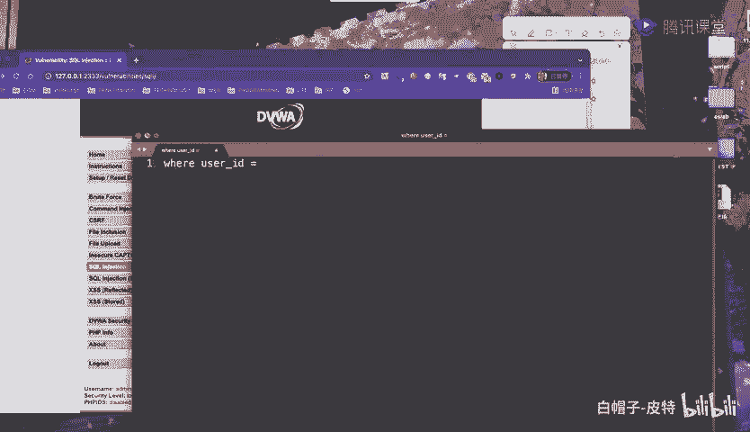

那现在我输入了一个这个东西。输入一个这个东西之后呢，我们可以看一下这个语句变成什么东西了。我们的语句变成了userID等于等于啥呢？等于一。and一等于2。那你看现在就。查不出东西了。

为什么查不出东西了呢？虽然你这个绿色的东西是我的输入的1个ID，对不对？它被这个绿色两边的这两个红色的单引号所包裹。但是呢当它拼接之后再去查询。当它拼接成这个CQ语句，然后执行CQ语句的时候。

这个CQ语句可就不知道你这到底是什么绿色红色了，他根本都不认识，没有这个颜色了。那么这个语句变成什么呢？这个语句呃就就变成了us IDD等于哎么总是变化usus IDD等于一，并且一等于2。😊，那。

这就有意思了。我要查first name和 last name条件是啥？条件是这个人的ID必须是一，并且一要等于2，而一是不可能等于2的，所以说查不出东西来。结果返回为空，但现在结果返回为空。

我们还不能说明不能说明任何问题。因为我现在根本就不知道我这个查不出的东西是一等于二不成立导致的，还是说这个sQ语句有问题导致的，还是说什么别的问题导致的对吧？他都有可能查不出来。只要是你你这个不满足。

他就查不出来，这是很正常的。😊，所以现在还不能说明任何问题。但是呢接下来我输了一点别的东西，我输入了21234等于1234。那这个时候这这个这个语句变成什么东西啊？

他说我要查for namelast name条件是你的usC IDD要等于一，或者你的1234等于1234。你看这个这个条件就变得有意思了。然后我们能查出来这么多东西。为什么会发生这一件事呢？

就是因为我的条件是你必须要满足UUCID等于1或者1234等于1234。因为1234和1234或者什么一等于12等于20等于0。那我这个PPT为什么？😊，冻。就这个是一个恒等式，并且是个货吧。

货大家都知道有真则为真，对不对？所以我不管你这个。这一行数据这个人你的ID是不是等于11234都永远等于1234的。所以这时候我把所有的东西都返回出来。当有了这样的一个回险的时候。

那我现在什么事情就都明白了。首先我知道CQ注入是存在的，因为1234等于1234212上这个东西。很明显，他生效了。它让本来应该查出来1个UCID等于一的结果，结果查出来好多人。

第二个呢就是我现在的输入是啊认为你前面有个单引号，后面有一个单引号，所以说我才中间输了一些这个东西的。然后它执行成功了。那我也知道了啊，原来你是一个字符型的。

你中你你这个呃把我的输入用单引号给包裹起来了。所以现在。我什么都知道了啊，我知道这里有主肉点了。😊，那有了注入点，我们接下来。就可以进行实战的注入了。但它实上注入大家都知道啊。

C口注入的目的不就是获取数据库中存在的信息嘛，对不对啊？那获取数据库中存在信息，那不就是哪个表里哪个列哪一行存了什么数据嘛，对不对啊？但现在我们为什么不开始去做这些东西，我们要干嘛？

我们在PPT里面写要查询CQ语句中的字段数，这要干嘛呢？这好像和我们要的数据没有任何关系？😊，呃，等一下大家就应该知道了，等我们讲到什么是uni的时候，大家就知道为什么我们要这样做了。

首先啊我们先先不说，我们就就就就就来做就好了。怎么样查询字段数呢？我先弄一个or的语句，让它能查询成功，或者说我不动也没关系。你只要能查询成功就行。然后我接着写all by一。😊，井哎，这里有个井号。

井号的意思是说注释为什么要呃有一个井号呢？你看一下我这个输入啊，我给大家分析一下，我我这后面应该是一个where，对吧？whereuser IDD。😊。

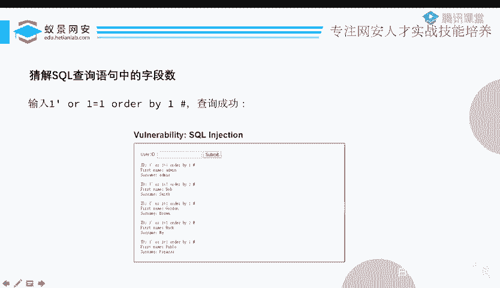

等于等于一个单引号，对不对？等于一个单引号包裹的里边的东西，而里边的东西是啥呢？有一个单引号，然后。一单元号2一等于1。Order by。一井对不对啊？他现在是一个这个结果。

然后把这个结果呢给你放到这里边来。然后我让他语法高亮一下。首先我需要用一个我输入的单引号，把你前面这个单引号闭合。那只有闭合之后，我后面输入什么2一等于一才是它的语法。如果说我不闭合的话。

你看这是什么东西，都是红色的，都是一个字符串的，没有任何意义的。我的s口注是要让我输入的东西变成CqQ语法的一部分才可以。所以说我首先要把你前面单引号给你闭合了才行吗。你后面才不是字符串。

才是它的标准的语法，然后out by一，如果说我不写这个井号会怎么样，你看这这这是不是还有一个单引号，因为它这是它自带的，这是它自带的，你看到没有？就多了一个单引号。😊，这孤苦伶仃的一个单引号呃。

这整个语句就不通顺了，它就不对了，它就是有错误的，不符合语法，它就报错了。那么为了不让它报错怎么办呢？我们写一个井号，井号就是单行注释的话，你只要学过编程的话，有一点编程语言的话，大家都知道，对吧？

就把后面的东西就注释一下，不管你后面写什么。😊，所有的东西就全都是注释了，都已经不管你了。所以说是不是这个单引号现在就不影响我们的语法了呀。所以我我在这里要写上一个井号，哎，这个意思。

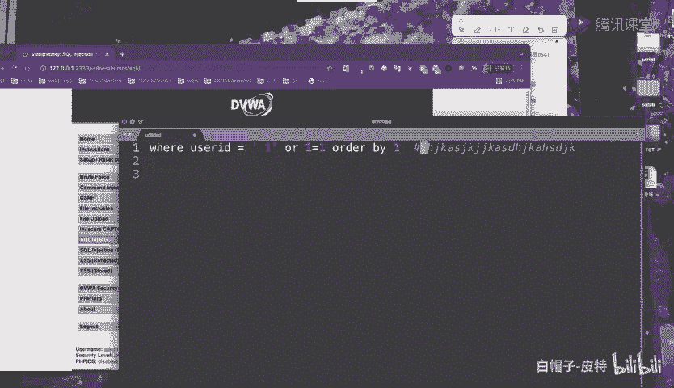

然后。你看这样的话，是不是还可以查询出来东西？啊能查询出来的东西，然后outder by一之后，我们接着写啊，我们接着写alder by2也能查出出来东查询出来的东西。

然后一直到outder by3的时候。😊，他突然报错了，他说an know column three in order clause。他要报错了，那于是就说明有两列。

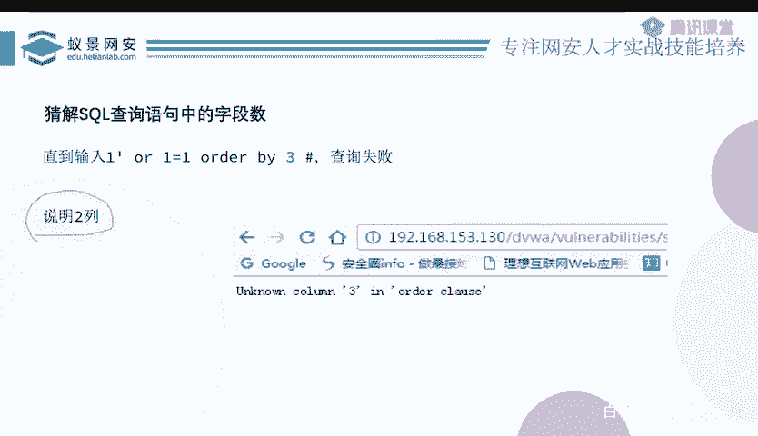

这个东西是个怎么回事呢？首先我我们需要先解释一下这个拆解sqQ语查询语句中的字段是是干嘛？它这里边有个同学说这个另一个注释符也可以啊。是的，没错啊，就是mysql里边有两种单行注释。

我们说这个查询这个语句中的字段数是啥呢？我们现来看一下这个sQ语句吧，它是select first name。和last name。from name from这个users这个表，对吧？where。

Y后面是条件。那么这个字段数呢就是first name last name，这每一个都是一个字段。到底你这个select语句，select了几个东西呢。

你比如说我除了first name last name，还可以select1个ID，我可以select一个什么你好，乱七八糟的东西。😊，就是这个select语句里边，这里到底一共有几个字段呢？

我现在是在拆解这个东西。而我我们刚才看过代码了，我们知道它有Firstrst name，last name是两个，对吧？

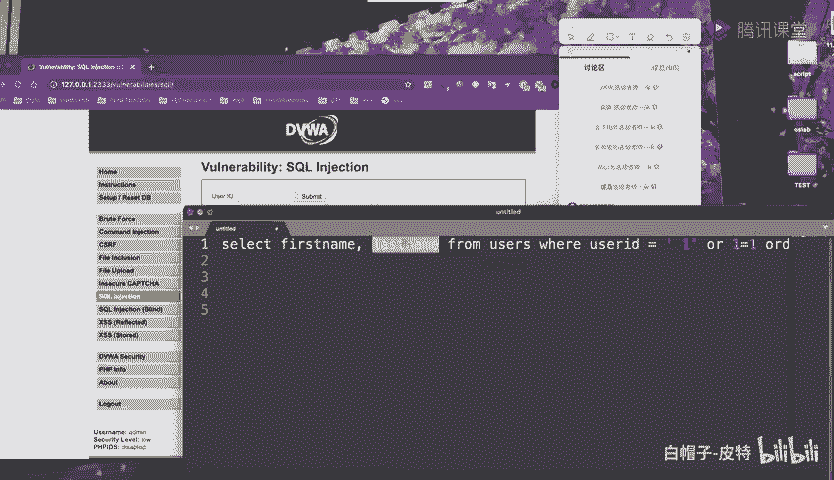

然后我们用out by也说明是两列。这个是怎么说明的呢？就是当我all by一个数字，这个数字不行了，它报错了，那就说明这个数字减一就是3减1等于2，就是它的列数。

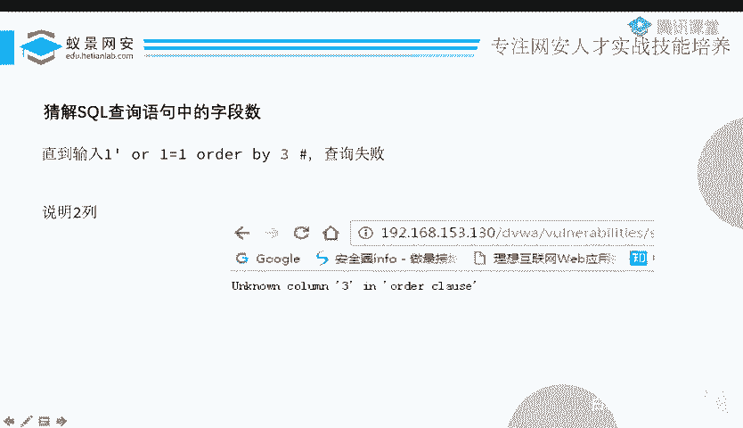

这是因为out by这个语句，它是表示排序的。out by一就是说我以第一列为基准，对你这个查询出来结果这个表啊进行一个排序。那为excel表什么的，也有排序的对吧？你你你比如说你是成绩单。

我用语文成绩作为标准来排序，用数学那一列成绩作为标准来排序，对不对啊？那数据库也是可以的out一是说以第一列为基准来排序out2就是以第二列为基准来排序。那到了out by3的时候呢。

他就说以第三列为基准进行排序。而我的这个字段啊，也就是个列啊，一共只有两列，你又要以第三列为基准来排序，那我就根本不知道你这个第三列是什么东西了，所以说他说an column3，这我不认识你这个三了。

😊。

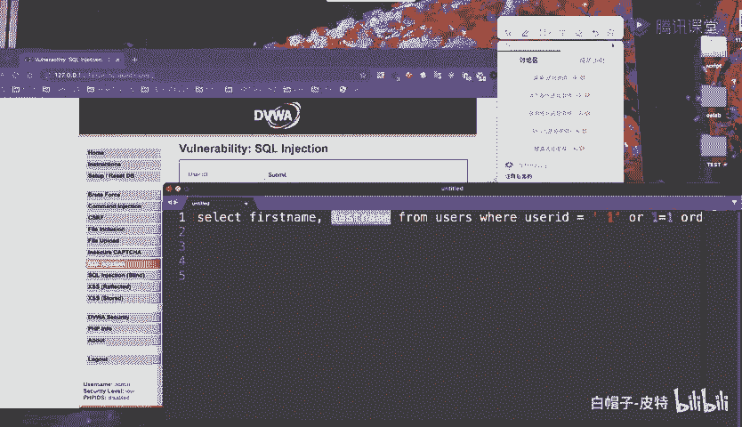

那你从12345这样按顺序来到一个数，这个数没有了，是不是就说明这个数减一就是它的一个列数啊。你看到三的时候没有了，是不是就说明三减一等于2就是两列吧，对不对啊？这是裁解它的列列数。

也就是字段数的一个方法，用alder版。当然呢，除了out by以外，还可以使用这个limit。但是这个limit呢呃基本上不会用到，它不好使，所以我们也不说了。当我们知道一个字段数之后。

我们还需要知道一件事情，这都是对我们做注入前期做准备的。除了知道字段数以外，我们还需要知道显示的字段的顺序。什么意思呢？就是说你比如说我这个CQ语句，它可能查了8列。

除了first name last name，还有ID，还有age啊，还有一些什么乱七八糟的东西，但是呢这些列里边我只输出了first name和last name。虽然说我查了5列。

但是我只输出其中的某一列或者某几列。

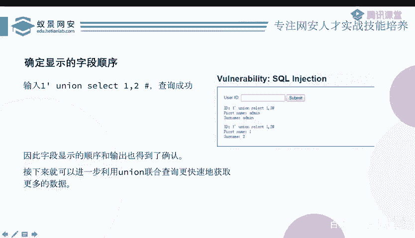

那这样的话，我就必须要知道你到底是第几个列输出的结果。然后我才可以构造相应的语句去查询。要不然的话，你比如说我现在不知道你是第一列和第二列输出结果。然后我在构造的一个语句里边。

把第三列和第四列写成了我想要查的东西。而第三列第四列根本就不会输出呀，那不会输出的话，那你查了不就白查了吗？对不对？所以说啊为了我们后期方便啊，前期要做一个这个准备。😊。

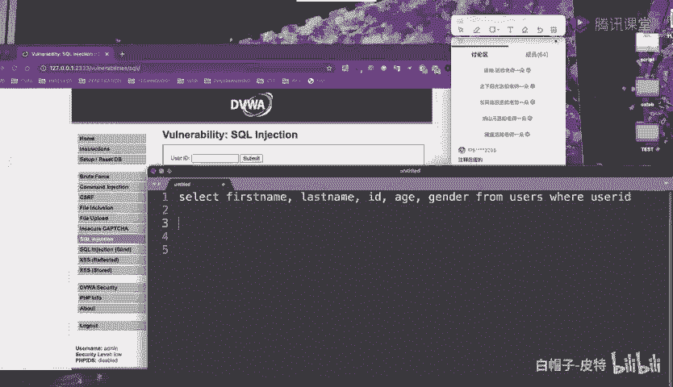

怎么做呢？非常简单，就像这样。从现在开始，我们就正式接触了幽您这个东西了。uni这个东西呢就是联合的意思。那我们说的这个联合查询啊，联合就是uni的意思。呃，比如说我现在可以。连上myCl给大家看一下。

大家可以看到我select新 from users是一个查询吧。那我还可以啥呢？select一。😊，2。🤢，也是一个查询嘛，虽然说我查的只是一和2，对不对？那么这是两个查询。

我想把这两个查询放到一个表里边去，怎么办呢？我就把第一个查询拿过来，然后union上第二个查询，我把第二个查询也拿过来。就这么简单，你看两个结果是不是就放到一起去了。而除了你你说我觉得两个不太够啊。

我还可以union select34。你想要几个就要几个，没有任何问题。并且呢这个uni它是按照顺序来，第一个slect结果放在前面，第二个s结果放在后面接着。然后第三个sleag又在后面接着。

所以这就是联合查询。那我们刚才为什么要去呃判断它这个列数呢？因很明显，这个uni，还有uni后面的东西都是我们通过CQ true去写进去的对吧？啊，这个同学就得非常聪明，他说两个字段数要相同，没错。

就是这就是这个意思。😊，为什么两个字段数要相同呢？😊，前面这个sla什么么东西，这肯定是题目他自己写好的。

就是代码里面就写写死了这s first namelast name from users那个东西，这是他已经写死的代码，我们改不了，我们只能改uni后面这些是我们自己注入进去的。😊。

而uni后边有个select，这个select呢，你要写几列，你要写几列，你必须要和前面那个匹配。你比如说我select新 firm users是有两列，对吧？然后我后面select一。

那select一就有一列。😊，那你就想吧，你把一个两列的表格和一个一列的表格，你把它放到一起。这mys就直接不会了。他说你这两个不同的一个select的表达式有不同的列数，你的列数不匹配。

我没有办法把你放到一起去。所以说啊我如果说我们想要让这个uni这个表达式这个CQ语句OK的话，那一定要知道它的这个呃列数才可以。你比像前面是有多少个，我测出来。然后我后面跟着也有多少个。

这样这个语句才是OK的。😊，所以现在啊我测算来，我知道你是两列，所以我写个页行。😊，就可以了，对不对呀？然后呢，你看我写uni select12，那就有如果有几列就写1212几呗，就是怎么说呢？

有几列就就uni select几呗。你比如说有5连的就uni selectlect一逗号2、逗号3、逗号4逗号5没问题。然后我看这个12345到底哪些数字在我的回旋里面输出了。😊，你看到没有？

这个first name是是不是一输出了罢了啊，这个这个东西呢二是不是输出了？😊，那我select一和2，而这个一2呢全都输出了，那我就说明哦，原来你这个第一列和第二列全都输出了。

你比如说如果说我这里有5列，12345，而12345里边呢，只有一和2在这个结果里面回显了。那我就是哦原来你这个是第一列和第二列是回显的结果。而345呢是不回显的那不回显的，我就啊让他当个工具人嘛。

就没有什么意思了。好，所以说现在为止我们基本上已经做足了这个前期的准备，接下来就可以真正的来获取数据库里边具体的信息了。那么怎么样干呢？我们最开始讲数据库的基础的时候，我们说它的一个结构是有一个数据库。

数据库下面有表，表下面有列，也就是字段，然后字段下面是一行一行的数据，对不对啊？它是一个这样的结构，四层的一个结构。那我就从最外层开始喽。最层是啥呢？数据库，那我怎么样获得数据库名呢？有一个函数啊。

不用你啊浪这个大非洲章。myciq里边给你给你封装了一个这个dabase函数。这个dabase函数就获取当前的数据库的意思。所以我直接select database就好了。但是呢你要记得这是两两列对吧？

两列，那我uni后边呢也要有两列，对吧？所以uni select一列也两列。那其中一列是我需要的数据，那另一列没什么意思，但是我必须有，所以我随便写个123就完事了。

然后我们仔细看一下这个输这个输入这个整体全部的东西，其实也比较好理解。首先我输入一个一，然后随便来一个单引号，把你前面的单引号闭合，然后闭合之后呢。

uni selectlect这些东西就从那个字符串里面逃逸出来了，变成CQ一句的语法。然后我想执行什么uni还是什么别的东西。我想要怎么执行，就怎么执行。执行完之后呢。

你不要忘了它后面还有一个孤0零的单引号，这个单引号会影响我们的语法结构。我们刚才说了，所以说我来一个井号，或者来一个那个。别的那个剪剪把它给。注释掉啊，不要让他来影响我，是不是这个语句就OK了。

那这这样的话，你看我这么一执行，他输出了啥呀，他是不是就把这个DVWA这个东西就输出了。另一个first name这里输入啥的是一，因为这里我就查了一个一。那我们可以看一下delect一逗号dbase。

是不是返回一个两列的结果呀？第一点就是那个select一，他啥也没说。第二个呢是这个database一个结果。你看我这里dabbase数据共名是什么？是CTCTFG，所以他就把这就给输入出来了。好。

然后数据库有了之后，有了数据库呢，我们就开始查表，怎么样查表呢？select group contact table name from information schema的 tables where table schema等于 database。

我现在要uni selectlect select一个这么长的东西，这么长的东西之后呢，就会把它的表查出来。有两个表，一个叫gas book，一个叫users。那么这个到底是什么意思呢？

好像蛮蛮难理解的。因为这个语句突然就从一个dabase，一个小函数变成了这么长的一个语句了。以及为什么我执行这么长的一个依据，他就会把这个里边的所有的表都给给我显示出来呢？

这里啊我们可以看到啊有两个关键的部分需要大家研究，一个就是group慷慨。是group contact呃，table name应该是一个列，对吧？

那为什么要把这个table name这个列用group contact这个函数给括起来呢？还有就是information sma点tables又是什么东西？😊。

首先我们先看这个group contact。他的意思就是说，把所有的这个查出来的东西，然后给他啊弄到一块儿去。你比如说这里面有一个图片。

大家可以看select username from users就是从us里边查所有的username，他就把这个所有的username一个一个的结果就给输出了，对吧？但是我嫌你这个太多了。

我想把你弄到一起去，一口气给我输出来。那么group一下之后呢，它就变成了addmin逗号这个YENG，所以说group contact的意思就是说我把这呃一列下面所有行的结果全都放到一行去。

然后把它们用逗号分个开搞到一起一口气输出来很方便，对吧？这是一个好习惯，就是能用它的时候，尽量全都用它。然后就是information sma点tables到底是什么东西？

为什么我从里边查table name就可以把它查出来呢？这里啊我们来看一下，在mysql里边。😊，我们把information sma看作一个数据库。确切的来讲，它是信息数据库。

它保存着关于mysq数服务器所维护的所有其他数据库的信息。这个其实就像呃图书馆的管理员一样，你去一个图书馆，你找那个管理员说呃，我想借一本计算机什么网络原理书，这个书在哪呢？

然后你可以问他你这个图书馆都有哪些分区呢？你这个。计算机技术这一个分区都有哪些书架呢？哪些模块呢？你去问他，然后他就告诉你啊，我们这个计算机这个书架，这里边有关于网络信息，有关于网络安全的。

有关于这个编程的等等。对吧其实information s就是干这件事的。你去问他说我这个数据库下面有哪些表呢？然后他就把这些表就全都告诉你了。哎，这里边information scale是一个数据库。

那数据库下面有不同的表，对吧？有什么表呢？😊，啊，有呃skimma上有tables，有column。然后这些不同的表里边记录着不同的信息，大家可以简单看一下，我就不在这念了。所以现在我们就知道了啊。

原来你这个informationSma就是一个数据库的这个图书馆管理员，我就向你问就完事了。所以接着我们就。去问你这个表下面有哪些列就完事了。

所以说我就colum name从 information scheme us。schema点colums里边去查，并且呢table name等于us条件是啥？

条件是我要查user这个表下面的一个colum name。你可以看到这里边它就把这个user下面的这个列。就是字段呀给查出来，一共有这8个。那么呃刚才我们还提到了一个东西。

就是group contact，对不对？group contact我是说把这不同的一个一列一列的结果给放到同一列里边去。你比如说这里啊如果说。而，我们不写这个group慷慨会怎么样呢？我先把它拿出来。

然后我们来试一试。就如果说我现在不写这个group contact了。我把你删掉。然后继续查询，好像没有什么问题，因为它会把每一个每一行的结果，它是便利的，就所有给你输出出来，对不对？

你看这一个一个一个一个的。这好像没有什么问题，但是有一些题目呀，它可不像现在这个靶场这么友好，他不会把你这个一行一行的结果给你输出出来，它可能只输出一行，就下面这些都没有。这时候你就麻烦了。

你你就想你只能看到其中一行的个结果。并且现在呢好像如果说是只输出第一行数据的话，你好像什么都看不到。因为第一行数据它是前面的那个select firstrs namelast name from users where IDD等于一它的那个结果。

下面这些你什么都看不见。😊，这个时候我们应该怎么办呢？我们刚才说了，对于uni的联合查询，它的结果的顺序是第一个select在上面。第二个呢就是在下面跟着，第三个select又在下面跟着。

第四个selectide又在下面跟着，对不对？而第一行的一个结果，那一定是头一个先来的select才那个结果呗。😊，而我们的slaack一定是在后面的，至少是第二个最最最前面它也是排第二个了。

那第二个它就不是不是最开始的那。而这道题呢又只能回显出第一条的结果。那我们怎么让后面的select它的结果跑到前面去呢？首先大家可能想到会用al buy吧，但是al buy好像。不太不是特别的万能。

还还要排序，万一你这个呃排序排来排序还排乱了也不好说。怎么办呢？一个非常好的办法，就是你不是先来第一个select结果，后来后面的select什么？那是不是第一个select，如果说没有查询出来东西。

那后面的select结果就变成前面就变成第一条了。大家能理解这个意思吗？就是我先让一个空表拼接上一个不空的表。那不空的表的第一行是不是还是第一行。大家可以看一下select呃星。😊，From。有ers。

然后欧怪了。Useer name。等于123好吧，你看这是不是就是一个。😊，空的查询什么都查不出来。然后我在uni上一个select。那你看这个后面的select的结果是不是变成了第一行了。

因为前面没有东西。那现在我们怎么样让前面没有东西呢？我是不是可以在这写个按一等于2就完事了？因为你这前面是一个where条件，whereus IDD等于一and一等于2。意思是说，条件满足ID等于一。

并且一要等于2。很明显一等于2是不可能成立的。所以说前面这个select是一定查不出东西的那查不出东西了，太好了，前面就没东西了。那我后面的select是不是就变成。就变成第一行了，对不对？

那么这就是一个解决办法。呃，但是呢如果说这道题它不允许我用group contact，那这些所有的结果好像。分为好几好几行输出的，而我现在只能看到其中第一行，那后面这些东西怎么办呢？

group看一下的话，我就可以全部看出来。但这道题他可能不不想让我们用group看，就把这个group看。😊，给过滤掉了，那这时候好像就没有办法了。大家也不用担心，我们还可以使用一个呃别的东西。

就是用limit。limit零逗号一的意思是说，从第零行开始输出一行的数据。比如呃我们来写一下。你现在不是能查出来好多东西吗？但是我可以让你有选择性的输出第几行第几行。你比如说我想要让第五行的。

这个数据变成了第一行结果，那我就。呃，limit51就好了。limit5的话也就是说从第五行开始回显一个结果，那现在就查出来是第五行的结果了。所以说啊如果说你没有group contact。

那么替代的方法就是这种limit。但是一般不会有人这么无聊去过滤这种东西。所以我我现在也不演饰了，大家知道就好。那我们就接着看吧，现在是实际上是已经呃获取到了它的数据库名表明和列名了，对不对？

接下来干嘛？接下来才是重最重要的，就是获取它的一个数据，具体的数据。那其实就很简单了呀，我只需要呃select一个。列from一个表就可以了，select什么列呢？这些列。

然后from这个表是不是就把具体的数据就给查出来了。具至至于你想要查哪一列，你就select它呗。你你要查哪个表里面的东西，你就from哪个表呗，select列 from表，就把这个具体的数据就查到了。

啊，所以说这是一个查数据的方法，到目前为止基本上就完事了。因为我们已经可以呃获取到数据库中的所有信息了。

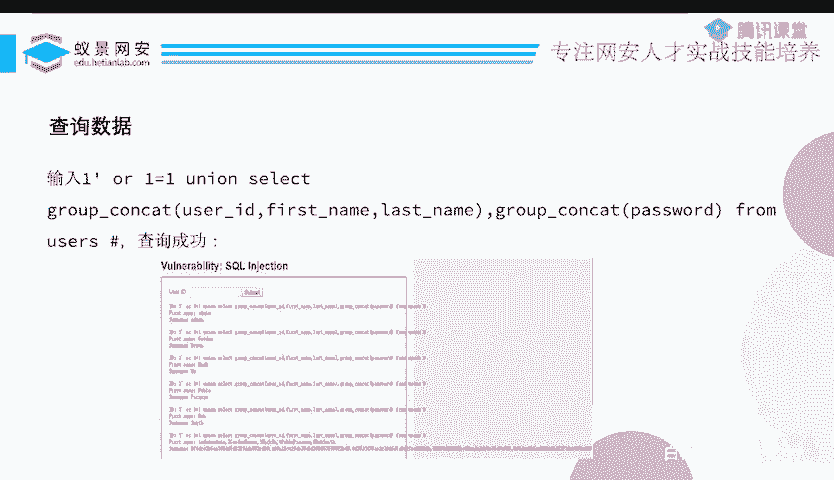

啊，这个limit呢我们刚才也说了。

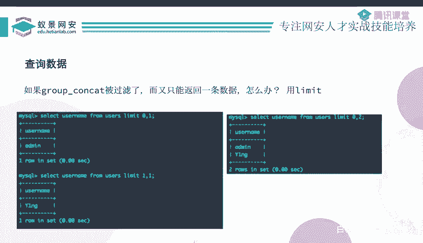

所以现在来总结一下吧，其实蛮简单的，对不对？就就算你没有接受过，我觉得基本上看一看PPT都不用我讲，就你就自己看一看PPT基本上都可以把这个东西学会，这非常简单，联合查询。就是首先你out by猜列数。

猜到前面的select一共有几列。然后呢，我用uni select有几列，我就呃几个数呗，五列就一逗号2、逗号3逗号4逗号5。

然后我来这些数看回显里边有哪些数是回显出来的那我就知道哪一列是一个具体的回显。😊，我有了具体风险之后呢，我就可以去查数据库名，查表名，查列名，然后select列from表去查具体的数据。

把它给查出来就完事了。所以这个就是联合查询。

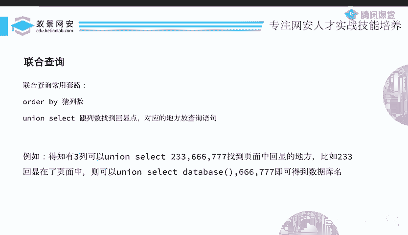