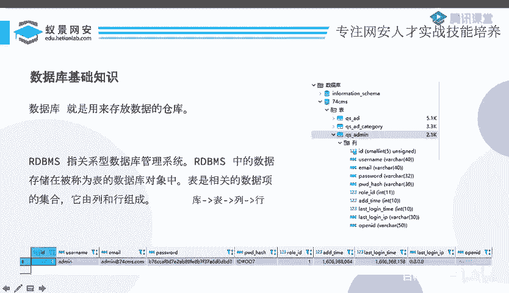
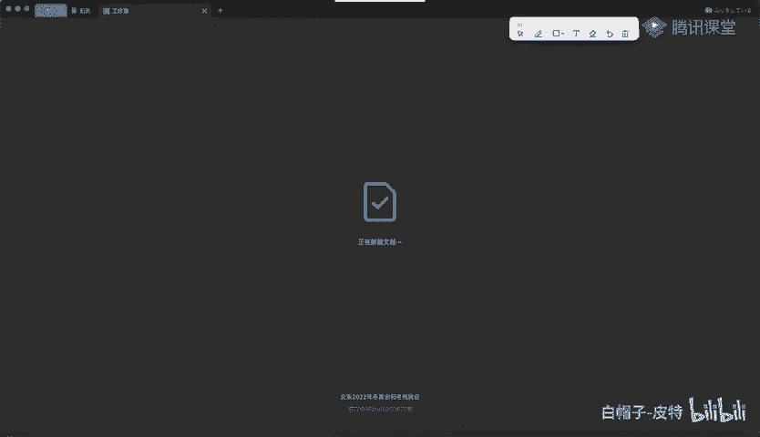
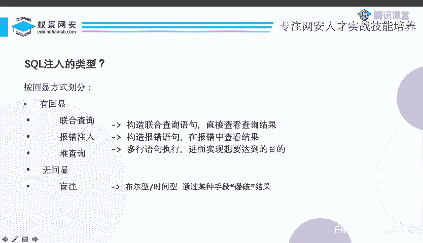

# 2024B站最系统的CTF入门教程！CTF-web,CTF逆向,CTF,misc,CTF-pwn,从基础到赛题实战，手把手带你入门CTF！！ - P77：CTF系列教程-CTF web sql注入入门之MySQL基础 - 白帽子-皮特 - BV1m64y157UX

说正式开始，今天一共有三大部分吧，一共一个小时的时间。我们要讲它的基础，还有联合查询组以及简单的一个报错组。首先第一部分呢就是mysql的基础。

因为我们今天主要讲的是mysl的主但sq主数据库的一些就数据库有多种多样的对吧？各种各样的数据库。但是呢在CTF里边，如果说你参加过CTF比赛，你会发现基本上90%以上的题，那它都是mysql的。

所以说mysql呢是我们主要学习的东西啊，当然在正式的课程里边，就是收费的一些课程，我们也会讲一些别的数据库。但是但是呢。那我觉得myCl可能让大家更容易理解一些。

所以说我们这个免费的分享就全部都是用用mysql来讲。首先我们先学一学简单的数据库的知识啊，那什么是数据库呢？它就是存放数据的仓库，就是这么简单，就是有一个仓库里面存储了好多数据，这个东西就是数据库。

那么下面。下面有说啊RDBMS这个是关系性数据库管理系统的一个简称。这里边的数据呢存储在被称为表的数据库对象中，表示相关的数据项的集合，它由列和行组成。呃，没有声音吗？有有人说没声音。

这两位同学说已经开始上课了吗？怎么没有声音没声音？我自己我自己挺有的呀。你没声音，应该是你那边的问题吧。因为大家大家都说有的。那我们就接着说了啊，虽然这句话呢，这一段话听起来比较绕。

但是我们有一个简单的总结，就是库，然后有表有列有行。这里边呢给大家呃列出了一个数据库的一个介绍。你比如说这数据库有哪些数据库呢？有informationma，有什么74CMS，我们就以这74CMS。

它就是一个库，库下面是下一层是什么东西啊？下一层是表，对吧？有哪些表呢？有QSADQSAD呃，这什么东西不会读QSadmin等等这些表对吧？😊，那我表下面是啥？表下面是列，你看这里边有什么列呢？

有IDusernameemail password等等。然后列下面是行啊，这这就是一行数据，还有username设那IDCemail是这个，然后密码是这个等等等等。其实这个东西。呃。

如果说你没有接触过的话，你肯定也接触过类似的东西，就是excel。那excel的话，你想一个文件，对不对？那个文件呢我们就可以把它类比成一个数据库。然后一个文件下面有一个个的heet啊。

我们可以打开一个试试。

你比如说这里边我新建一个excel的表格。这一个文件呢，我们就可以把它理解成一个数据库。然后你看这左下角是不是一个一个heet，一个一个的表，对吧？那么这个呢我们就可以把它理解为这个表。

然后表下面是什么呀？是列吧，对不对？那我这里也可以有列，比如说我这这一列就叫ID这一列就叫user name。😊。

这一列呢就就就就叫一个什么password的对吧？这就是一个个的列。那列下面就一行一行的数据和第一个ID是一，它是张三，ID42，他是李四，ID是3是小明，对不对？这是不是和数据库其实是一样的一个结构？

那么我们知道了数据库。那我们就想吧，你就比如说是这个excel的表格，然后你想让你这个公司的一个什么小姐姐，对吧？去修改一下这个表格里面存的东西。

你比如说你看这个小姐姐说我把这个ID等于一的那个人的用户名改成张三。啊，你让这个人去这么做，他就这么做了。但是你让数据库去这么做那数据库他是听不懂你说的这句话的，他就不知道该怎么做。

所以说我们必须要有有一种能让数据库听懂的语言去帮助我们完成这个。呃，对数据的一个操作。那么这个语言呢就是结构化查询语言。也就是我们说的这个CQ。它呢是用来管理关系型数据库管理系统。

它的一个范围呢包括数据的插入。查询、更新、删除等等等等。这其实就我们说的这个什么增删改查中的这些操作都是由随后语句来完成的。所以说最后一句是操作数据库的一个语言啊，数据库是可以听懂它的一些指令的。

那么这里呢给到了一些简单的呃数据库操作的随后语据。比如说怎么显示怎么样使用啊。然后看表啊等等这种。这里面我们不详细说了。那么我们还是讲我们专门的东西，就是ci口猪ci口猪是什么东西呢？

它是指将CQ代码插入或添加到应用的输入参数中的攻击之后，再将这些参数传递给后台的CQ服务加以解析并执行。其实这个啊语句其实这个对这个s柱的一个定义啊，这里边的语句大家可以发现比较不容易理解。其实很简单。

就是你要让数据库进行一些操作，你怎么让他操作，他听得懂是CQ语言，对不对？所以说你要用一个CQ语句，然后让他进行相应的操作。而这个CQ语句呢，里边某一部分某一些参数是呃外部的这个用户他能控制的。

比如说我要把这个表里面ID等于一的那个人改为张三，这个张三这个ID等于一，实际上就是外边的那个人这个老板或者是一个用户去操作的。😊，这就是它的一个数的参数。

那么如果说这个数的参数并不是合法的IDID就是数字，那它不是数字，或者说这个us侧name是张三，它并不是一个张三，它并不是一个合法的一个用户名的话，那么这些参数被放到一个CQ语句里边。

这个CQ语句就有问题了。这里边有说，凡是构造CQ渔句的步骤均存在被潜在攻击的风险。因为你只要是构造CQ渔句，那么构造CQ渔句的过程中，构造这个CQ句的那一部分某一部分是用户可控的。

然后它它这个可控的部分没有经过足够的安全检查，就有可能造成一个CQ注入。然后攻击者呢把sQ命令语句作为输入给服务器，CQ解释器正确的执行，然后把查询的结果呢再返回服务器，然后呈现给攻击者。

那么攻击者呢最后就获得了数据库内的数据信息。所以说最后一段话告诉我们sQ注入能干嘛呢？能获取数据库内的数据信息。这是对他的一些介绍啊。但是这些介绍呢呃比较泛泛。😊。

然后我们可以看这个第一行第一行它有说是将sqQ代码插入和添加到应用的输入参数中。这个应用的输入参数，我们根据这里给出了这样的一个sqQ注入产生的条件，就是用户控制了sQ语句的一部分。

并且呢用户的输入并不是并不只是输入的一个普通的参数，而是成为了符合语法的sQ语句，就是说你用户的输入可以是个ID可以是U name可以是什么什么东西对吧？本来它是一个很正常的东西。

但是你用户的输入不是我想要的那个正常的东西，而是满足这个CQ语法的一些东西。那么它进行一个拼接的时候，他可不知道你这个东西到底是用户的输入，还是一个正常的语法。它执行的时候就就按照正常的语法执行。

那这样下去的话，是不是就产生了Q输入了。😊，啊，所以说基本上c个猪就是这么一个东西。那么这个注入有哪些类型呢？我们可以按照不同的一个类型来划分。你比如说有人会喜欢用呃变量的类型来划分参数的类型。

可以分为什么数字型啊，字符型，但是那些没有太大的意义。主流的划分方式呢是利用回显的方式来划分。回显的方式就是呃我们这里面其实刚才的这个PP这也说，他说把这个结果呈现给攻击者攻击者获得数据库内的数据信息。

对不对？那这个呈现给攻击者，它有着不同的呈现形式。😊，可能是把所有的这个具体的内容就呈现给你，也可能是呈现了一部分，也可能是呈现给你一种状态。比如说查询成功查询失败，但我并不告诉你查询出来是什么东西。

也可能我完全就不告诉你查询的任何的一些信息，我就告诉你查询成功，或者说我什么都不说等等，这都是一些不同的回险。所以根据各种各样不同的回险，我们可以把它分成两大类。第一种是有回险的。第二种是无回险的。

有危险呢你就可以分成以下这么几种无危险的呢，那就是盲助忙助是我们明天明天的这个课程会着重讲的东西。忙助也是呃CTF里边最喜欢考的。像是今天要讲的这些入门的东西呢，它都比较简单，尤其是今天要讲的联合查询。

所以说没有什么太大的技术含量。你做题的话，基本上正式的比赛里边是不会遇到的。那么联合查询它到底是什么东西呢？联合查询你去。诶。你就去品一下他这个名字吧，联合就是把两个东西或者多个东西搞到一起，对不对啊？

那么查联合的啥呢？联合的是查询查询就是fllect。所以说联合查询意思就是说我把多个查询联合到一起。本来你只有一个，但是我手工让你查多个，然后把多个的东西回显出来，这就是联合查询组。

然后报错注入是什么呢？报错注入就是说我去呃想办法让你构造一个报错，并且我看你这个报错的内容。然后呢，在这个报错的内容中，你不是不能是瞎报错，你瞎报错，那没有意义。我要把一些我想要的信息。

让你在这个报错的一个log里边给我呃报错出来。那这样的话，我就知道了我想要查的东西。然后呢，还有一个堆叠注入，堆叠注入就是执行多个CK依据。但是一般呢这个用不了，这就看题是不是想考的东西了。

