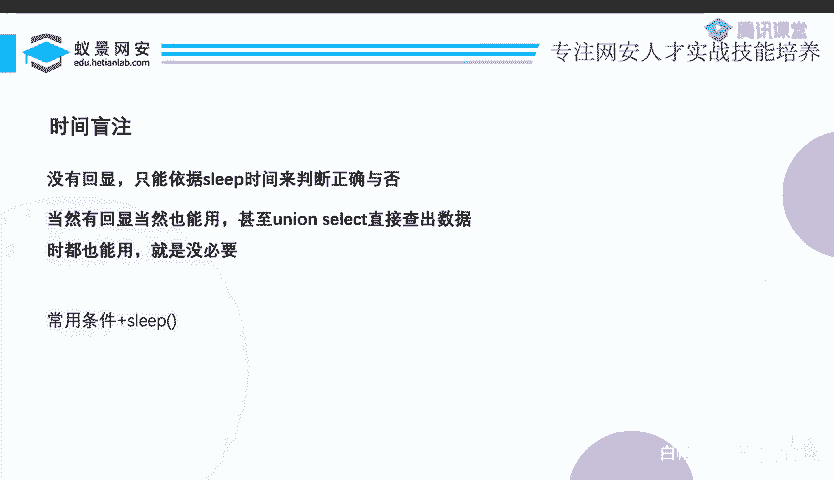
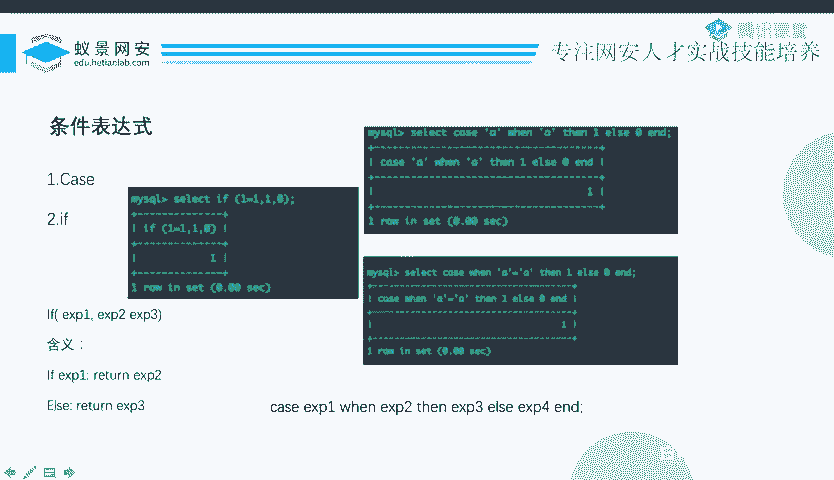
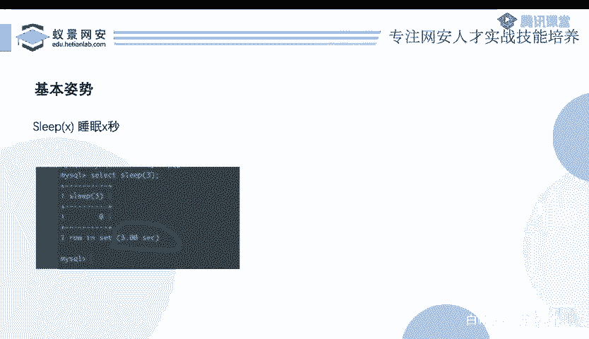

# 2024B站最系统的CTF入门教程！CTF-web,CTF逆向,CTF,misc,CTF-pwn,从基础到赛题实战，手把手带你入门CTF！！ - P82：CTF系列教程-玩转SQL盲注之延时盲注 - 白帽子-皮特 - BV1m64y157UX

再捋一遍。那么到此为止啊，这个呃布尔型的盲助就讲的差不多了。延时盲助呢呃在这里。我基本上会说的非常快，因为延时注入它考的挺少的。延时呢是什么意思呢？就是说这道题本来刚刚不是不尔型的帮助吗。

一个查询查询给你有两种回显，查询成功和查询失败，或者说一个登录框，有两种不同的回答，登录成功，登录失败。那现在就这道题啊不给你这种不尔型的一个状态了。布尔状态你找不到了。不管你查什么东西。

我都告诉你查询成功。😡，就是查询成功，这时候你就没有办法判断。不管这个查询是否成功，这个语句是不是OK的，那个表达式是不是真是不是假，他都告诉你查询完成，查询成功。就一种危险。那这样的情况下呢。

我们还有别的办法，就是延时。那么延时呢我们可以使用条件表达式加sleep。

呃，条件表达式呢你可以使用if或者是case，也都比较简单。if的使用方法呢是if，然后一个表达式，一个表达式，一个表达式中间有个逗号，就是三个表达式。意思是说，如果说表达式一成立，那么就返回表达式2。

否则返回表达式3。然后case呢有两种写法，case什么问什么表示的是这个case后面和问后面这两个什么是否相等。如果是的话，返回z后面的东西，否则返回alse后面的东西，它也可以case后面不接东西。

case后面直接接问，而case when后面要接上一个表达式，意思是说这个表达式，它是真还是假。如果是真的话呢，就会返回z后面的东西，否则呢会返回alse后面。😊，那先是这么个东西啊。

哎，这是它的条件，然后使用的方法呢就是sleep最基本的。如果这个表达式成立Zsep5秒ilsep0秒and是不是可以啊？case win一个表达式，或者说你用if if也表达式。

然后逗号sleep5逗号0，是不是可以啊，就是这个表达式如果说okK的话，那它会sleep5秒。因为什么呀？因为你的这个题目，这个PP什么外部服务器会对你的数据库进行一个查询。

而你的数据库因为你的操作现在在那sleep呢。他没有给回回来结果呢，那这个外部服务器，这个PHP是不是就得等他呀？那等他的话，你这个网页你必须得等他把这个结果输出出来，我这个网页才能OK加载完成。

所以说数据库的延时对于用户来讲表现在哪里呢？表现在这个网页是不是一直在加载中，他在加载的时长。所以说我只需要去构造这种呃条件表达式。如果说条件满足，就让它延时。

然后看这个网页在那里转圈圈转的转圈的时间长短，我就可以知道啊，原来你这个。延时成功还啊还是没有成功，然后进而呃去判断那个表达式它的真和假。然后呃通过表达式的真假，就可以把数据给注出来。哎。

这就是岩时盟助。

呃。除了这个sleep以外啊，还有一些别的东西，比如说bench mark呀，比如说迪卡尔机啊，比如说这个getlock啊、政则表这几种方法。但是这些东西考的都挺少的。呃。

PPT的话到时候呢大家可以去联系班主任老师拿大家拿到PPT之后自己看一眼，就能懂的，我在这里不念了，我我也是我我讲的话，我也就是把它念一遍，我也没什么可说的。

