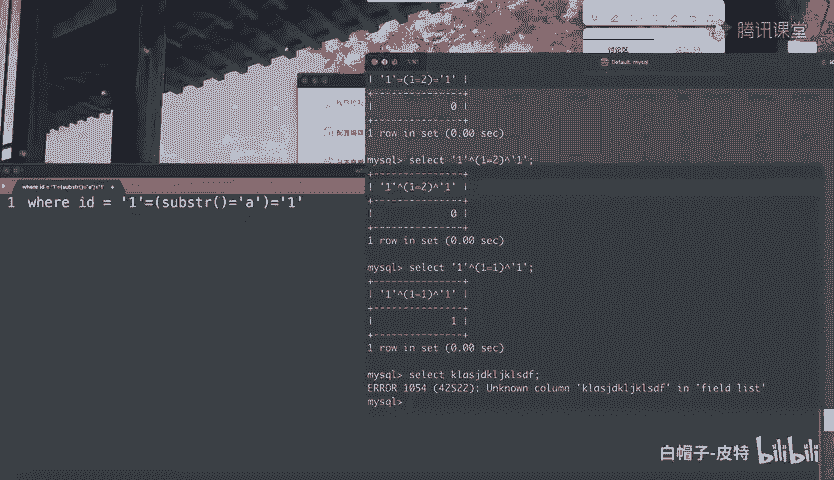
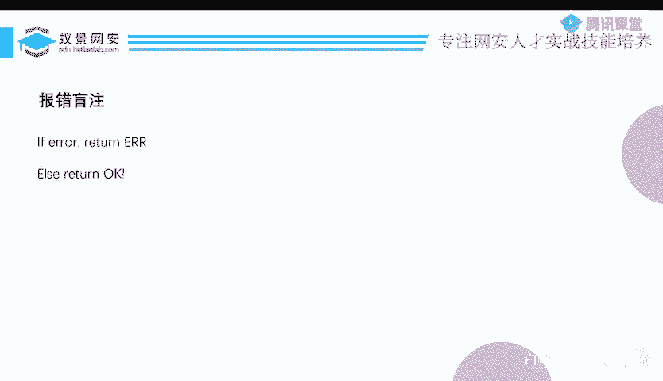
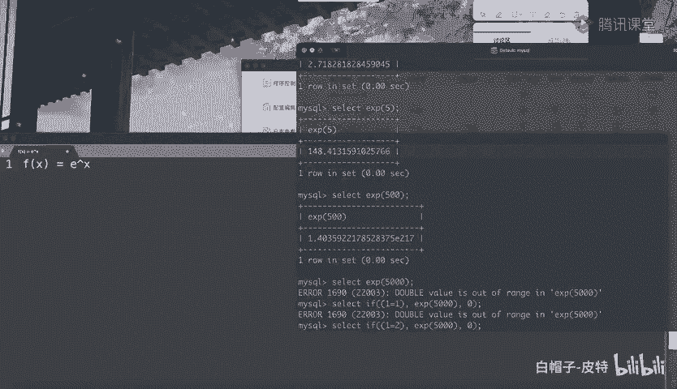

# 2024B站最系统的CTF入门教程！CTF-web,CTF逆向,CTF,misc,CTF-pwn,从基础到赛题实战，手把手带你入门CTF！！ - P83：CTF系列教程-玩转SQL盲注之报错盲注 - 白帽子-皮特 - BV1m64y157UX

接着呢我们主要讲点特殊的东西，就是这个报错盲助。这个实际上是一个布尔行忙助的一个小分支。但是为什么还要把它拿出来讲呢？就是因为他考考的挺特别的。什么叫做报错盲助呢？就是说如果这个mysq查询出错了。

那么我就给你返回一个错出错，否则我就给你返回OK就没了，它就是只有这么一点东西。那基于这种情况下，我要怎么样进行盲助呢？因为你想吧呃只要这个语句它不出错，那它最后返回的都是OK的那如果说都是OK。

那我们首选应该是选择延时盲助。但是延时忙助就那么几种方法，这种方法都被过滤掉了。那没办法了，我只能呃硬着头皮做别的。而做别的话呢呃你要么就是出错，要么就是OK。😊。

想让mysq出错也很简单。比如说sack一个什么什么玩意儿。这就是出错，因为我这输的东西他不认识。但是这种错误没有意义。包括我们昨天其实也有讲过报错注入。

用那个after插面还有extract value，可以把我也想要查的东西给从报错里边。给显示出来。但是现在我们说的这个报错盲助和昨天不一样的地方是昨天这个错误是啥，他会把这个错误的内容给你显示出来。

但是现在不一样了，现在出错了，就告诉你，不好意思，出错了。然后如果说没出错，那就是说查询完成你没出错。具体这个错误是啥，他是不会告诉你的，既然不告诉你具体的内容，那昨天讲的那些报错注就完全没有没有意义。

😊，而昨天的那个报错呢是一定会报错的。包括就是你在这里啊随便输点乱七八糟的东西，他也一定会报错，那他就会一定会返回一个。不好意思，你出错了，这好像也没有意义。对吧如果说我们想要利用他这个条件。

如果出错了就返回一个错误，否则就返回一个不错误。这个错误和不错误作为一个布尔条件的话，我一定事实上这个报错有选择性的出现的，你想想是不是这这么一回事。如果说这个报错一定会出现，或者一定不会出现。

那这题你怎么做，没得没得做的，这都没得说了。

我一定是。让这个报错选择性的出现，我构造一个表达式，这个表达式为真，那么你就给我报个错，构造表达式，表达式为假就不报错。实际上是和我们刚才说的这个呃岩时盲助有有点像。刚才我们延时盟助怎么写的呢？

这是一个表达式，这个表达式是一个s string是不是等于A啊，这样如果是的话，你就给我slip5秒。

不是的话呢，你就不给我sleep，这是刚才说的那现在我其实只要把这个进行一个简单的变化就好了。如果说你这个表达式满足，那么你给我执行一个。执行一一个东西，执行某个函数。执行过程中。汇报错。否则的话就。

不报错。因为你这个东西首先必须是语法要满足的。然后你只有语法满足，它才会执行这个if，执行if之后呢，走到你这个条件执行你这个函数，然后这个时候再报错，而不是说我这里随便给你输点乱七八糟的字符。

那这个整个语法直接就报错了，根本就没执行就报错了。那也不行的，大家能不能理解这个意思。😊，反正就是说我现在要解决的问题是怎么样能够找到这样的一个函数。这个函数能够让我们有条件的进行报错。

这是我们要解决的问题。那，这里呢就也不卖关子了，因为时间马上也到了，我们可以选择使用这么两个函数。第一个呢叫做E叉P。E叉P这个函数它会返回什么呢？它会返回自然对数E呃，自然对数的底就是那个E。呃。

它的一个多少次方？隔一的1次方就是。大家写那个对数的时候，不是有有那个什么log，以啥为底什么的对数吗？你可以你不是可以写成log啥嘛？就log就是以E为底，对吧？就是那个E啊，它是2点7几。

它的1次方就是2。7，它的5次方就是148，对不对？那么这时候就就有办法了，说是它的500次方是多少？😊，是这么多是1。4乘上个10的217次方，这还是很大。那我说你的5000次方是多少？啊。

这个时候就就就不行了，这太大了。因为你你想一下这个E的X次方。😊，这个函数。它的一个增长率，你你对它求一次导数，你会发现它的这个增长是特别特别快的。所以说指数的增长。

意味着当你把这个500提到5000的时候，它已经变得特别特别大了。它特别大的话是不是就。嗯，你计算机总有处理不了的那个界限吗？太大了，他就说你这个value已经超过我能允许的，我能处理的最大范围了。

这个时候呢，它就报错了。所以说你看我现在是不是有了一个非常不错的东西。那现在我们不妨来试一下，有一个if。如果说这个条件呢是满足的，现在是一等于1，那么你就给我执行一次这个E叉P500。

不不是5005000，如果你这个条件不成立，那啥也不要，我就来个零。你看现在是不是报错了，因为一等于一是成立的。如果说一等于2，但是不成立的呢，那就不会执行E叉P5000，那么它是不是就不报错呀？

所以现在我是不是就有条件的构造了一个错误，然后我把这一等于一等于2换成那个sus那个截取比较，是不是就可以进行盲助了？布尔型的盲助是不是就有了？只不过这是布尔型的盲助呢，是在构造了报错的条件下来进行的。

所以啊我把它分出来叫做报错盲助，实际上它只是布尔盲助的一个小分支罢了。但是呃因为它考的。思路呢比较清晰，所以把它给呃拿出来讲，这是E叉P。这E叉P呢，我们还可以用另一个这个呃叫什么cot。

就是一个三角函数，这个三角函数不能处理0，具体为什么我不记得了，反正可能我觉得和什么零不能做分母一类的那种呃那种原因有关嘛，它就会跑到一个极限去跑一个特别大的那无穷去，然后它就也说那个outfr了。

其实基于此啊，你可以去找一点别的东西，只要是那种数学运算的，然后算出来特别大。😊，然后都可以，比如说你想办法让他去操作一个一除零，然后是不是他也可以输出这个value啊，它不是你这类似的吧。呃。

我我也没试过，你可以去尝试一下，基于这个思路，你去找这种数学运算的好多都可以的。所以啊这个就是呃报错盲助。那到此为止呢，我们就把这个盲助的部分讲的差不多了。呃，虽然没有像昨天一样。搞题嘛主要是时间不够。

因为忙住事实上你要想往细着讲，讲个两三个小时，三五个小时都可以。现在我们就是呃时间不多啊，呃呃目的呢主要还是尽量的让大家在入入门的情况下，能更快的去入门这个东西。至于。呃，要怎么实战的操作。

你写写两次脚本就明白了。基本上盲住的脚本做一道题，还有100道题，还是100道题，还是一万道题。他的脚本写的基本上大框架都没太大变化，大同小异的。

，那我们这个课程呢讲到。