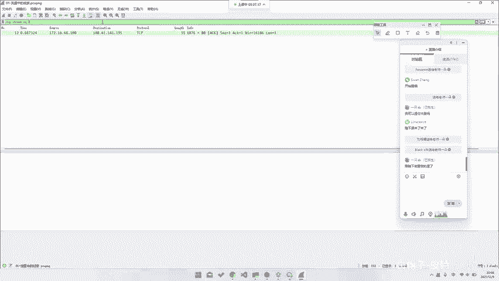
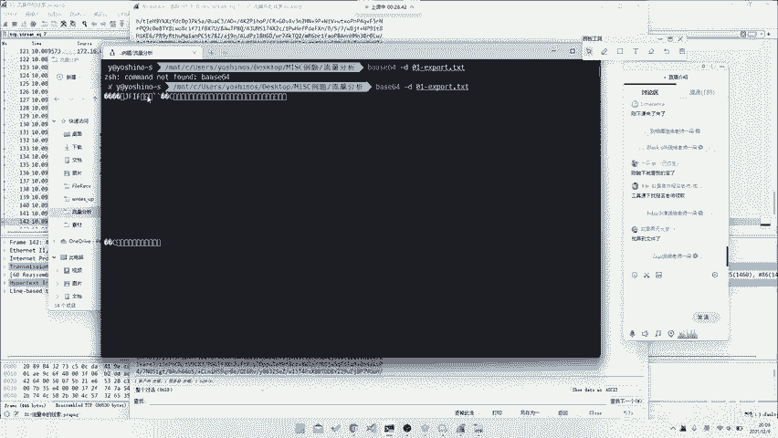
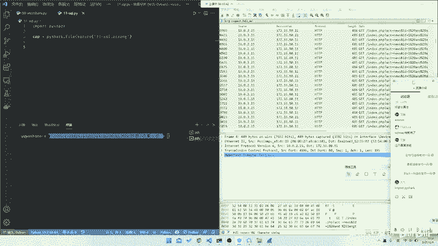
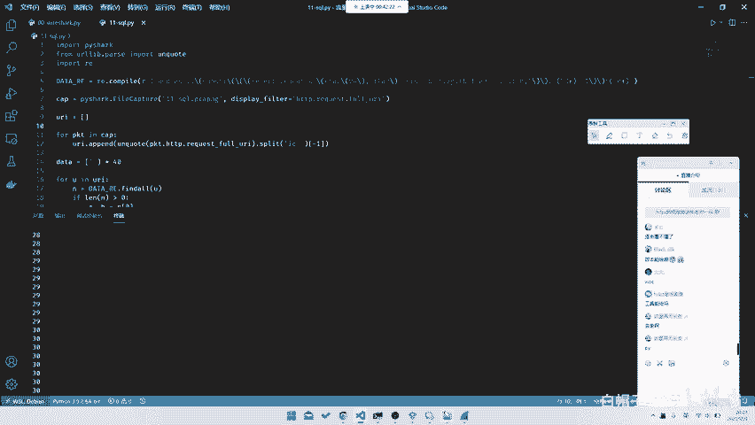
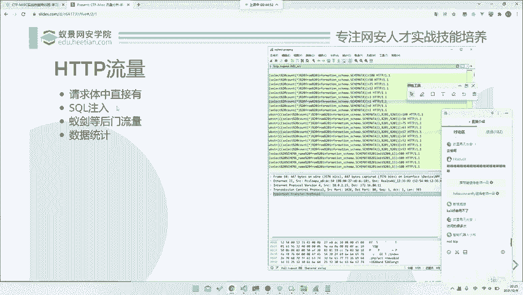

# 2024B站最系统的CTF入门教程！CTF-web,CTF逆向,CTF,misc,CTF-pwn,从基础到赛题实战，手把手带你入门CTF！！ - P88：CTF系列教程-ctf-misc 网络流量篇之HTTP流量 - 白帽子-皮特 - BV1m64y157UX

稍等一下。一点都不好，哎，他回来了。首先它就首先它可能会涉及到几种类型。我们根据这几种类型去。我看到赵博任给送给老师一朵花，感谢赵老师，好吧。然后就首先就是我们分为几种类型嘛，首先就是请求提名。

他会直接有啊，我们就直接掏利提出来，对吧？就是有一句话叫怎么说来的？talk is cheap show me the code，对吧？😊，所以说我们直接看code就行了。比如说我们。MS08067。

我不做我不做渗透，好吧。呃，渗透的话，咱可以去我们我们我们一经网安学院也有渗透的课程。😊，如果说你们想。如果说你们想就是看这个叫渗透的部分的话，也可以去报名我们渗透课程，对吧？😊，然后咱不讲渗透。

咱讲mO。😊，我们不看不看聊天，不看聊天，到会再说，对吧？然后文件发在微信群里了。我发在我在课堂也发一个吧。我不知道课堂能不能发。어。呃，好像整不了，我们再说吧再说吧。呃。

微信群可以直接问那个叫上课老师要对吧？我们直接讲，我们直接讲，我们不耽误时间。就是首先就是这种请求题里面直接有的。比如说这道题，就是你看吧，它其实就是一个有很多的HTTP请求嘛。

然后的话还包括还有当然还会有一些DNS或者说TRSS当然TS我们本身是没有一个密的，所以说我们解不了，包括DNS也有。那我们去看我们的这个叫TCB协议，就是所有的HTTP协议，对吧？我们直接去追。😊。

HTTP流。然后的话就是。你看这里有你随便我们随便追嘛。当然我们第一次不一定能追到，比如说我们从一开始追的吧？23这个我都无所谓的对吧？

或者说你也可以直接在这里去导出所有的HTTP流都是可以的那首那那不管怎么样，我们不管通过什么途径。😡，对吧你肉肉眼一个个看一下好，因为这个相对来说比较少，你可以一个个看。

当然你也可以去拿工具去扫什么都可以。你能看到这里面是有一个。

这个对吧。有一个分析点PHP那分析点PHP那显然当然当然我们是已经知道要分析这个。所以我们看到分析点PHP当然你并在你不知道这个叫这个东西叫分析点PHP的时候，你也不知道，对吧？

所以说这也是嗯反正你就整篇里面找，或者说你直接也可以能找到这样一串b64，那至于至上为什么是b64，我这就不想解释，就你一看你就知道是b64，你应该作为一个miss时候，你应该拥有的直觉，这叫对吧？

那你这东西怎么导出来呢？因为你这个东西你当然你就直接复制出来了就行了。其实我们或者说你可以直接用其他工具啊，或者说是直接这边另存为也可以。那我们这边有一个已经导过的对吧？😊，我们直接去在这儿。

这是饱的贝死肉s一堆一堆一堆一堆。那我们怎么去给它解码呢？当然你可以去认到sber chief，或者说在线的去解。但是我们这里如果说你所以说我们。所以说我们这里说是推荐给大家去用1个WL。

因为我们这边就比较方便，就直接facease6杠D。这个叫做Xport andTXT。哎，打错了，稍等一下。然后它就出来了，虽然它是乱码，但是我们去看看下它的最头部。😡。

你看JFF那显然这就是个JPG文件了，对吧？那我们直接给他。😊。

重定义道。重定向到1个01点export点JPG。那我们去打开这张JPG照片。叮就有flag对吧？非常非常非常美妙，这道题非常简单，只是5分钟就能呃两分钟就能做出来，对吧？确实是有手就行。😊。

那么这种就是最最最最基础的一分钟，非常棒，就最基础的一个一种就是停球题里面直接有的。那么这种流量的话相对来说会出现，但是出现的不多，对吧？那当然往后的话，我们可能会出现。😊，如果说我们再更进阶一步。

我们可能会出现一些在攻击流量里面的东西。比如说是以Cco注入。那我们这边有一个CQ入的题目。我们可以大家一起去看一下。C口去哪儿了？Good人。首先他这个包就很大了。😡，他会有很多很多条。

那我们怎么去过滤呢？所以说我们这边就需要我们用这个叫过滤器了。那首先我们肯定是我们随便去观察几条，对吧？又卡了吗？我们随便去观察几条，我们看这边会有一个这样一条，它就已经。透露出来我们是如何去给他。

如何去给他看这个了对吧？比如说这里index等PHP act等于newos，并且ID等于什么什么什么。你看这头就显然是一个CQ注入的对吧？这个我呃应该做安全。如果说大家有对安全有一定研究的话。

其实呃你肯定还是要知道一点的，或者说没卡就行就是。或者说当然我们这里并不会去说是去转头去讲一讲什么叫CQ注入，对吧？就是。呃，seco注肉这部分如果说大家想去看。

可以去看那个叫seqlslci labci对吧？这我们不讲不讲不讲。😊，然后我们看这样一条，就是在这所有的这种条里面就会有一个CQ注入。那我们这时候就只需要。这里去给它进行1个HTTP。

And request then for U。啊，进行一个过滤。你就能看到所有的一个请求条请求的这个叫。对，所有的一个请求的一个所有的一个请求的URL。那么这时候你会发现它其实就是一个盲助啊。

就是它为什么是盲助啊，我们这里就不多解释了。就它的原理不管是怎么样，不管你看不看得懂ci口。😡，就是不管你看不看得懂他是什么原，就是他看不看得懂他是什么样子。那我可以这里告诉你他是什么干什么呢？

前面我们不管了，在这里从这里开始。😡，就是它会去用这叫substr去取到它的这样一就是在这样一个select里面的某一位，对吧？比如这也是1一。那一一之后，他就会去二分查找。😡，开是有200。

就是比如说0到200。那先我比如说是0到200，那我们先比如0到400，他应该是先差200，对吧？再查一再查100再查50，然后给他二分二分查找的话，我相信大家应该都会，对吧？所以说这样就可以。

所以说他你把所有的这种请求条全部提出来。当然这个请求条的话嗯。😊，你会看到就是如何去提它的每一位呢？你看到他这边是在住第一位，然后再住第二位，再住第三位，再住第四位。那如何去提呢？其实这边是有规律的。

就是你去找到每一个CQ注入的最后一条，就是每一位上的最后一条，就是它注成功的那一条。因为注完这条就不再注这一位了。所以说这位就是正好是正确的那对那一位，对吧？所以说这样的话。

我们就可以找到它最终的一个正确flag。那我们这里脚本的话，其实。你看看我这没有时间准备脚本，那我们可以甚至我们可以当场用来写。😊。

这道题目其实也就正好是印证了一种题型，就是。在我们的这这这样一整个做题过程中，就是你可能需要对大量的数据或者说有规律的数据进行一些分析。所以说你就需要去写一些脚本。那如何去快速的形成这样一个脚本呢？

那首先我们就首先知道我们需要知道的是他所有的URL对吧？那所以说我们这边先导出它。我们这里随便用什么，我们用拍下吧，拍下稍微好一点，对吧？我们去11-11口点。C扣点PY。

然后我们就去给他直接import by sha。CP等于派 shark。这是11杠C口点PCAPPCAP点NG。你 call map一把锁。对，这不算是算法。呃，二分查找算是算法吧，对吧？这个对吧？

然后我们的。

A display filter。这边是。H T TP then request。ut。QUEST点UI。😔，然后唉稍等一下，这边报读我。然后的话我们再去给他for。哦，比如说URI等于错。

嗯PKTNAP UI点 append。我们这时候再print1个URI看看。稍等一下，他这边卡了。I。稍等一下，然后这边其实我们需要找他的一个字段。哦，这边字段就找到了，对吧？就长在这里。

它字段就是这样一个字段。然后的话我们就需要去对每一个提取它的一个。嗯，稍等我们的VScode卡住了。所以说这里我们就需要去对它的每一个这样一个链接去提取它的一个这样一个位数，对吧？所以说我们。

首先我们肯定要对它进行URL抵扣的，因为它这个是URL编码过的。Yeah。那我们这边直在这里给他加U2L抵扣就行。我们当然我们这边是需要去split with一。

因为我们要把整个账样它的这个payload打出来嘛，就是这样一串配load去打出来。所以说我们要先去把它这个ID对吧？它ID后面才是我们的这样一个提取的东西。那我们其实直接去给它。Split。

通过ID去划分，然后给他取ID后面那一部分对吧？就可以了。对他就把这项东西剔取出来了。那我们最后再进行找一个规律，对吧？比如说我们这边去看。呃，他这样串配套的，我们先复制一个配load的出来看一下。亮。

这边有点那个叫挡我视线。关掉。哦，我们去复制，随便复制一串出来看一下，找下规律，对吧？对于这条来说，它所有的都是满足这样一个条件，就是一and ask，然后前面都是一样的，前面都是这样，前面都是一样的。

limitlimit零1都是一样的，这一位是变的。你看它会从几变到几几变到几几变到几，然后大于50也是在变的。所以说我们这里需要把这两位提取出来，对吧？那我们去给他先给它设一个data。

是用来放我们的数据。然后去给他写这样一个智能表达式。因为我们这里其实智能表达相对来说比较好提嘛。😊，To import to read。然后的话就是。Da read等于re点compil。然后这样子。

然后的话这一位是我们需要的杠底加。じあ。这个也是我们需要的，就是另外一个杠D加对吧？后的话我们去给他。data等于。😔，For you in you are。呃 dataend data final。

第两个。那我们去看一现在data长什么样。哦，就是如果说因为因为有的是它是不会出现的，因为前面几川是那个叫不是住这个的，所以说我们要先去判断一下。Yeah。对，我们这样子就可以了。嗯。出现一点小问题。

哦，想起来了。括号的问题。因为那个叫CQ里面的那个叫正策表达式面的括ll是有那个叫有他自己的意思，所以说我们这边选麦上转移。对吧这个括号是我们自己加的，所以说不需要这个括号是需要转移掉的。就可以了。

你看到就是这边就会看出现所有的一个我们提到的那只要其实我们你看它其实是有规律的，就是15141312对吧？1617181922122324就可以了。

那我们其实只要按照时间顺序把它最后一位提出来放进去就行了。那我们直接data等于比如说我们直接data等于。呃，比如说我们长度看一下它是多少位长度，它是38位长度，那我们就直接长一点。

比如说我们直接给它进行1个39位，其实38位就够了。然后呢我们直接这，然后N等于。然后是A。哦，我们这边这边就直接这样split就行了。AB。B等于这个的第零位。哦，我们还是要那个一下。嗯。

if plan n大于0。然后AB等于N。linging。然后dataint A等于B。roprint data对吧？然后我们去跑一下。呃，data我们看一下A，它变成什么东西了。哦，38应该是长度市。

那我们就是40吧。忘记了忘记了。对吧就出来了。那我们其实只要把头上和尾巴置上去掉，然后把中间的这串东西全部转换成ask玛，转成flag就可以了，对吧？让我们直接去给他。If be。啊，不需要。对他对。

呃ORD in B。然后是直接去给它中印起来。嗯 응。but inter in of E ORDC数打错了打错了。这就出来了。就非常正常，就是这样一个东西。然后的话其实这道题目其实相对来说。

因为其实你如果说在仅在流量方面分析，它就是个纯HTTP的。但是的话，如果说当我们涉及到它的一个真正内部说要去去拿到flag的时候，就会涉及到一些对于流量的一个处理，对吧？

我们包括我们刚刚那题也是base64拿出来，并不能直接拿到flag。它需要我们通过我们的这样一个呃这样一串给它进行一个，比如说base64解码，然后才能出来，对吧？就是。脚本能给吗？

脚本之后我会一起给的工具，这里没有任何工具啊。就是到现在就是比如说解这道题的时候，我们到现在为止，我们只用了python，其他什么都没有用。这是这样一道题目。就是当然这道题目也是比较简单的。呃。

那我们再往后走的话就是。

比如说还有已建的。呃，以建的话，我们今天会留一个小作业给大家，然后会在明天上课前，就是如果说大家想的话，就是明天上课前把它做好，对吧？然后我们明天明天早上明天早上发给大家，就是在微信群里面。

然后大家然后如果说就是明天课前做一做。然后我们课程会稍微讲一讲，包括以建的后门流量，然后包括这种数据统计，数据统计的话，其实我们跟我们昨天讲的一个那个是一样的，或者说我们再去看这样一道题目，就是。哦。

在这。菜刀菜刀菜刀也很简单，现在不用菜刀了，基本上已经菜线上基本上如果说做这这种呃后门分析的话，基本上用的是一件或者说是冰烯，是这样子的。然后你看这个就是这样是这道题目，就是在参加第二网络安全大赛。

第二届世界巡回在新加坡站与SP战队的比赛时，作为KK战队的主房手机使用经典的3条命令检查端口状态。😊，虽然这这个我们这个我们都知这个我们都知道啊。就是n mapap嘛，对吧？

然后或者说是可惜平台没有回信，你的开很短期当会是开放的嘛。那显然很简单就是。看我们这样一个里面有多少个端口。比如说我们去看这样一个。呃，其实原理就是我们去看127的0。0。1上有哪几个端口开着嘛，就是。

然后你一个个去翻就行了。当然你如果说。就这一段看到没？就是所有的这一段里面所有有。所有有返回的。你去因为这就是一个那个叫什么，这就是一个那个叫n map的一个流量记录。

你所有找到所有它的一个能返回的记录就行了。所以说这东西就是这里我们就不多赘述了。你看就是这条，比如说。像这种631对吧？就可以了。那所以说你去找这样所有这样的流量就行了。你肉眼翻也可以。

你去写我们刚刚所说的过滤也可以。那至于这里的过滤怎么写，对吧？我们这边留一个小问题给大家这道题目，如果说你要去做过滤的话，你会怎么样写这个过滤器，这个是一个小问题，留给大家课后可以去思考一下。

因为过滤器的文档，网上Y要下课都有对吧？啊，我们这边不可能说是对着文档去一点点讲，这个就没什么意义了。所以说可能需要叫大家自己去研究研究。😊，这也是。那TCP对吧？那当然就这是就知道题。

所以说最对于最简单最简单最简单的这种HDEP纯HTDP的流量，我们也可以玩出这么多的花。所以说呃。😊。

