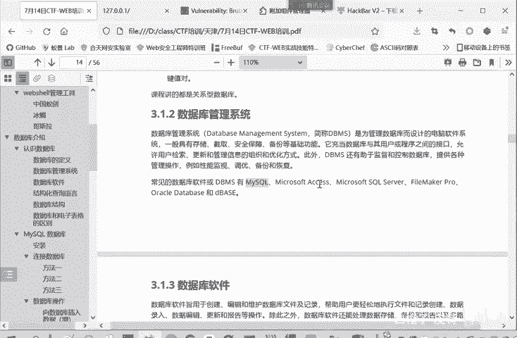

# 2024B站最系统的CTF入门教程！CTF-web,CTF逆向,CTF,misc,CTF-pwn,从基础到赛题实战，手把手带你入门CTF！！ - P8：web-数据库管理系统 - 白帽子-皮特 - BV1m64y157UX

可以讲的都是一个关系性数据库。下面再介绍一下这个数据库管理系统。他是为了管理数据库而涉及到电脑软件系统。它具有存储啊、截取、安全保障和备份等基础功能。它实际上是充当数据库和用户或者是程序之间接口。

就用户或者程序通过数据库管理系统来使用数据库来控制数据库。那常见的这数据库管理系统就有mysq，这是我们课程重点讲的。

还有微软的ss server等等workic的一些。

