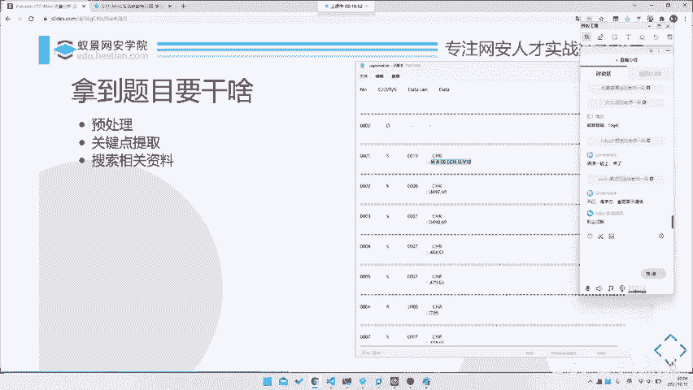
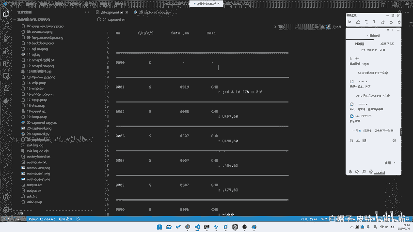
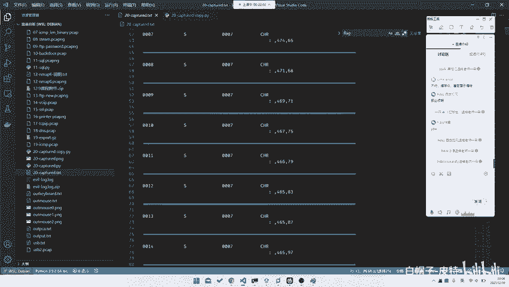
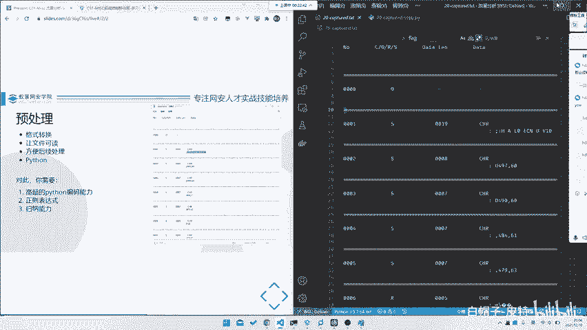
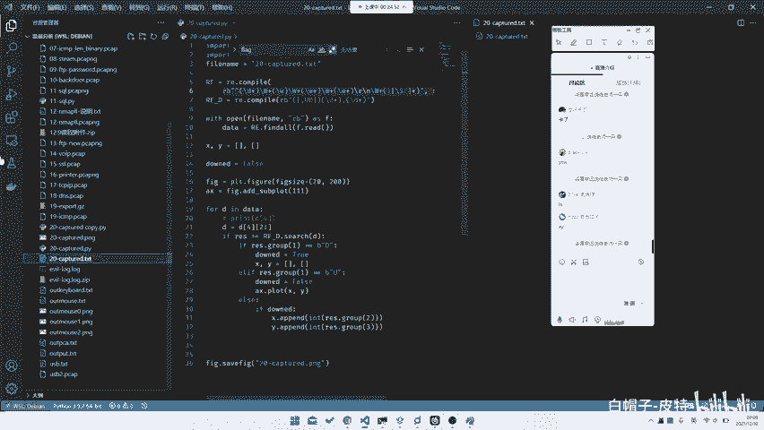
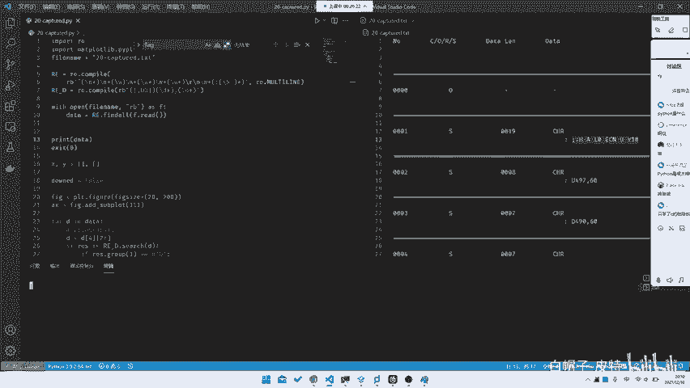
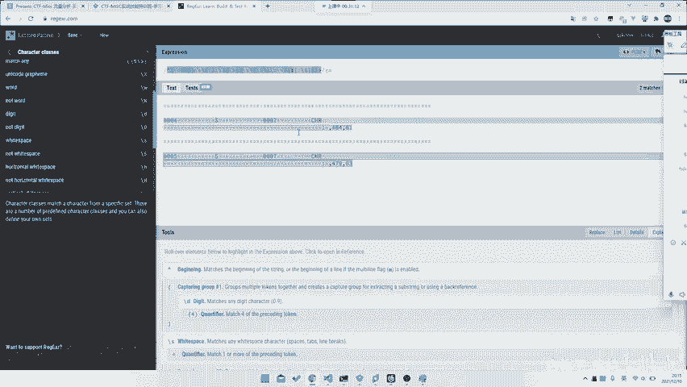
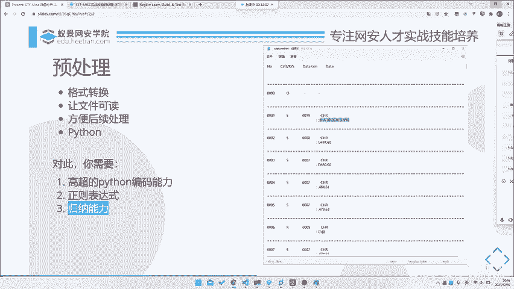

# 2024B站最系统的CTF入门教程！CTF-web,CTF逆向,CTF,misc,CTF-pwn,从基础到赛题实战，手把手带你入门CTF！！ - P91：CTF系列教程-ctf-misc 拿到题目该做什么之预处理 - 白帽子-皮特 - BV1m64y157UX

就是首先讲一讲我们这个如何去入手一个新的题目。那么对于一个新的题目。拿到手之后，你首先应该做几件事情，对吧？那我们这边大概总结了几个点，就是预处理。关键点的提取。还有搜索相关的资料。对吧。

谢谢大家给面子啊。那首先我们要看这三个点，为什么要做这三个点，我也会给大家讲一讲为什么要做设这三个点，或者说这三个点怎么用怎么做。那首先拿到题目的时候，我们肯定是。😊。

比如说我们就拿昨天这个就是比较比较玄学的这个题。这个题当时我right up写的很简单，大家也一晃而过，也就这个题。那我们看这个题，首先它拿到是这样一个文件，对吧？

那首先你肯定是发现这个文件是有一定规律的。比如说他前面加的number啊，什么CORS，datalan啊，data之类的。那么对于这一个文件，你显然没有头绪，对吧？

你直接全局搜索flag是没有的这肯定没有对吧？没那么简单。那所以说我们要对它进行一些处理。唉，那就拿到这个题我应该怎么做，对吧？那我们今天就会拿通过这道题来完整的讲一讲。就是一道题目。

从入手到最终做出来，就是一道全新的题目。因为这道题目跟我们以前说的这些HTDP啊什么东西啊没有任何关系，要怎么去做？首先第一步就是预处理预处理什么呢？首先你肯定找到规律了对吧？这个规律是肉眼可见的规律。

😊，那么这个规律肯定不好用，对吧？那我们对于这个有多少行。有23978行的这个文件。那你去不管是去肉眼翻也好，你去做东西，做什么东西也好，都是不现实的，或者说是就是不好搞，对吧？

那所那所以说我们这里需要去先给它进行一个预处理。😊，那么怎么给它预处理呢？就是提取我们所需要的一些。

我门卡。

第一步就是格式转化，或者说是让文件可读。这两个调，这两个其实是一样的。比如说这是个TXT，你可以把它转化成1个jason，或者说转化成一1个叉M或者说CBS都可以。反正因为转化转完之后。

我们去对它进行一个更加方便的，可以对它进行更加方便操作了。😊，那我们就按照因为它因为所有的流量数据都是一个相当于是时间序列上的流量，就是在不同的时间点，或者说是按照某个顺序排列的一个流量。

那么在这个里面就是从0000，对吧？我们的number就是它的一个时间序列，一直到我们最终的1个4794，那么这就是一个时间序列。那我们再看每个序列里有什么东西。比如说这里就有1个CORS。

然后一个dataline，一个datadata的话这边有个什么CHR，我不知道是什么意思。但是我们知道下面一行，它每次下面一行都会有个冒号，一头东西，冒号一头东西。😊。

那我们想这头东西是不是也是data，那我们就首先把它的格式理清楚了，对吧？它的格式就是一个。稍等哈，我想想这东西放哪放方边吧，它的格式就是这样一个有12345个字段，相当于是5个字段。

因为这个字段这个字段我们可以分开5个字段的一个数据，对吧？它有多少列，对吧？那我们给它处理起起来。那首先就是我们要找到这么多列。😊，那怎么找呢？😡，呃，我不知道大家有多少种方法。

就是但是我们这里最方便的是什么？我们最方便的就是一个。正能表达式为什么正能表达式比较？😡，比较一个比较说是比较好用的。因为它的规律是比较比较显而易见的，就是这一个是一个四位数字，这里是一个单个字母。

这里又是个四位数字。当然不一定了，你看它也会有出现于比如说这种一个杠，也有可能data datata是一串东西。

然后呢，这样传东西之后，下面一行可能会出现一个冒号，对吧？这里都是带冒号的冒号后面带一口东西，那这个东西就跟这个东西就是找规律了。我相信大家从小学就开始会做找规律题了，对吧？

就是12345下一个数字是什么？就是6这个这个找规律题，我相信大家都应该是很很会的啦。所以说我们就要找一个会找规律之后，我们。😊，嗯，稍等一下。Yeah。抱歉，刚刚刚刚有人过来问了个问题，好吧。

我们继续回来。啊，那我们首先我们刚刚说到哪里找规律，对吧？那找完规律之后，我们就要把这个数据按照正能表达式提取出来。😊，那提取的话，我们怎么提取呢？就是我们去写一个python脚本。

因为这东西就是怎么说呢？就是挖下可挖下PCAPY也是一样的对吧？它只不过是把字段封装在了一个呃一个文件里面。那如果说我们这样子，这是一个裸的1个TXT也是一样的。

那所以说这时候我们就可以直接给它提取出来。那当然PCAP也是一样PC我们可用PY下，那我们这里就直接就用文本文本处理就行了。那所以这里就正在表达式。那我们对他去写个正能表达式。

比如说我们这里去找一个再再再不是这个文件了。在这儿这串就是我们写的一个正在表达式。那我相信大家应该都是看得懂真的表达式的那我这里就。😡，就是只是说一下他大概说一下他什么意思了，我们就不详细解释了。好吧。

呃，如果说大家不懂什么正能表达式的话。😊。

自己去看派送文档。那我们这里的话就首先是一个。杠D数字啊有这是一个什什么行的开头，然后是一个数字，然后一串空格，一个字母，一串空格一个，因为它这里有杠，也有可能是数字，所以说这里是用的一串字符。

python是什么？这个。这里后面又写成空格，然后的话就是结束，对吧？那只要就是杠R杠N，你首先你为什么要这里是杠R杠2？你看我如果说我们用VScode的话，所以说VScode是一个相对比较好的东西。

比如说你看这里它就会告诉你它是CRF就是杠R杠N了。😊，pyython是蟒蛇队。但是python支付它其实声明过pyython跟网上跟蛇类也没有任何关系。好，在这些题外话咱不讲干刚干完之后。

就是下面这行冒号的这一行，因为我们需要的数据只是有带冒号的对吧？那如果说不带冒号的数据，其实我们不是很ca，因为它什么都没有。所以说我们把这个代冒号提取出来。😊，然后后面是一串。

因为你会发现后面是除了除了有字符，还有就是空格。所以说我们就把所有的非空格字符和空格提取出来。然后刚加，因为我们不知道多少个，然后最近结束了。那么这时候我们打开它去读，读完之后就给它打出来，对吧？

那我们这边去给它试试。Prince。第查。Exent。lay。

就把一整个数据打出来了，看到没？把所有数据都打出来了。这个数据非也符合我们的预期。前面这一个是一个ID对吧？number这个是什么CRS，然后这个是我们的一个datalan。

这个是我们的一个应该其实应该是就是就我这里我们不知道，我们不知道，对吧？我们不管它。😊，呃，有人说只学了C，你用C写也可以啊，对吧？C里面又不是没有真的表达式。😊，啊，当然C里面没有DI加里面有了。

对吧？那我们到就是最后就函是我们的data，那完了这两程东西之后，相当于是预处理完成了，对吧？那当然你可以把这个data去写到某一个jason文件里，也可以方便以后处理。当然你保留在这也可以。

你直接pyon以后往后写在运行里面就完事了，这就是我们的一个预处理或者是让文件可读，主要为了就是让方便后续的处理。因为我们要对这个数数据进行一些后续的统计啊，或者说是其他处理的话。

就需要我们有一个很好的格式在这里。比如说这里就是个很好的格式。😊，对吧那么在这一步里面你需要是哪些能力？首先你需要有高超的python编码能力。但这的高超其实并不需要非常高超了。

就基本上只要你会写代码就可以。咱也咱也咱也不是什么开发是吧？对，咱也不需要什么非常牛逼的能力。😊，pyython开发嗯。不管了，咱就python这个能力还是一要要有一定的就是。python不能太弱。

python弱了之后，别人都写完了，你还搁这儿查语法呢，那肯定不好，对吧？那第二点就是智能表达式。智能表达式的话，我有一个就是智能表达式，它在mask里用处非常大。😊，很多地方都会出现这种表达式。

所以说我推荐大家去好好学学这种的表达式。有一个网站推荐给大家。😡，就是。不需要打卡。😡，就你看它有一个网站，它就是有一个用来去可以，它可以去要查查这种heet，就是reference，对吧？

或者说它可以记录一些my pattern，或者说其器的这种告诉你是什么东西什么东西，什么东西，各种分组呀，或者说是各种的那个叫quantfin啊都可以。然后它也可以去可视化的一个匹配。

比如说这里我们去其实用那个叫PCRE会稍微好一点。就比如说你去看explan，它可以去解释这是什么意思，对吧？然后每个到上面，它会移到上面，它会告诉你第一个group是什么。

比如说这里它就是捕获了所有的以大写字母开头的数字，大写字母开头的呃单词的第一个字母，比如说这里它就会告诉你捕获第一个groupG，这个是M，这个是T都可以。

所以说我们可以拿自动西去测试我们的一个正能表达式，对吧？那比如说我们这里其实是可以用自动西去编制的表达式的。😊，比如说我们去复制几行。比如说就这几行吧，随便便复制几行过来。

然后我们去给他把这个正动表达师编出来。首先它是一行的开头啊，我们要设置一下它的flags。他是多行的。对啊。首先是开头，它必须是以数就是以行的开头，然后是杠D。当D。对吧。

它就匹配到了那杠B的话其实是四个字母，我们可以这么写。然后后面是空格空格数数量我们不确定，对吧？我们可以直接这里使用那个叫。呃，P系统里面这个东西。E在ai。在在reference这里。

然后是group。呃，charact class在这里。它有一个wite space or not white space。那我们这里其实可以空格。

因为我们这里其实并不知道它是空格还是杠T或者说什么东西的。其实我们这边是使用witespace时会稍微好一点，然后加。然后是一个字母。对吧比如说这里点就行了。那当然你这当然为什么我们这里要加括号？

因为我们要把这几个group提取出来。那比如说我一到这里，它就会告诉你这个group0004，第个group是S，那这样的话我们可以把这样数据提出来了，对吧？再往后的话是杠S加。😡。

然后的话又是一头东西，就这里的话我们不确定是什么了，对吧？比如说我们这一周直接杠S加就行了。然后我们这边是杠S加。😊，然后最后面又是一串杠S。打。我后咪讲下讲啊。那为什么这里啊这里就有杠恩了？😡，啊。

当然你要注意个问题，就是这里是杠了，但是其实那里是杠2杠，这里你这个事情可能需要改一改。杠完完了之后是什么？杠S加。然后是我们把这东西匹配进来冒号。然后后面这东西这套东西没有什么有空格，有杠S。Oh。

然后最后是就结束了，对吧？那这就是我们的一个，当然我们这里加不加尾尾尾都可以了。那这就是我们的一个正的表达式。那我们去测试一下。

是不我们这个写的跟刚刚那个不一样了，有有发现，但是其实应该也是可以的。如果说没出什么叉子的话。嗯，我们去试试。哎，他没有。因为这里。你知道为什么没有吗？因为有的地方太凹，因为这也是杠啊杠，那没事。

又没有，因为他有的有的地方就会会有个空格，所以说这个东西是要去掉的。你看这就也有了，对吧？刚刚那个其实是一样的。那么这样的话，我们就把这东西剔出来了。所以这是智能表达式。正能表达式的话非常重要。

就是说大家要去学学正能表达式。智能表达式的话，这也就可以学，对吧？那么第二步是什么呢？第二步就是还有最后一就是归纳能力，就是你需要通过里面找规律，我相信找规律这一步其实大家问题都不在是很大了。

那么这是预处理的这一步。

