# 2024B站最系统的CTF入门教程！CTF-web,CTF逆向,CTF,misc,CTF-pwn,从基础到赛题实战，手把手带你入门CTF！！ - P98：CTF web赛事基础 -远程代码执行 联合执行 - 白帽子-皮特 - BV1m64y157UX

。接着我们说一下这个联合执行。因为你看刚才我们实际上是执行了两条命令，对吧？一个拼命令，1个RS杠L命令。那么用的是什么呀？用的是分号。

那现在我们其实就可以看一下到底有哪些东西都可以把两条命令执行在一起呢。首先第一个就是分号，分号也是最好用的一个，因为它是一个无条件的命令的联合。不管你这个命令执行成功与否，你都不干扰其他的命令。

你们三个就是互不干扰的东西，我只是把你们一起执行。至于哪个能执行成功，哪个执行失败，根本不会影响到其他人，这是最好用的一东西。除了这个以外呢，还有一些别的，比如说按的按的是前面一个东西执行成功。

后边一个就呃财政执行。然后或呢是前面一个执行的不成功，后边一个才执行。😊，那一个货呢，还有一个and的都都是有的，它的对回弦不一样。然后这个一个货表示是前一个命令的结果变成后一个命令的参数了。

比如说呃我们L啊一口1个123AABC之类的东西，然后管道付MD5MD5命令。是算一个东西的MD5吧，那他应该接收到一个一个参数，而这参数在哪来呢？在管道符前面呢。

前面这个一口ABC这个ABC就给了MD5。哎，他就是这个东西啊。还有就是换行符，换行符也是比较好用的，因为相当于你直接回车了呀。但是换行符并不是所有编程语言里边都可以用来命令呃联合执行。具体的你要测试。

除了联合执行以外，还有还有内联执行。内联执行我们呃等下再说。嗯，这里边就是一些命令执行的东西啊。如果说大家呃想要去做一些简单的题，可以去。做一个叫做ACTF2020。然后。EXEC。

这个题应该是叫这个名字，可能是大写的EXEC。在那个BOU平台上。就可以那个什么就可以直接开一个环节，蛮简单的这道题，就是最基本的命令执行。你们可以去做一做，但是那题比较简单，就呃就是一个拼命的人。

直接输入1个127。0。0。1分号ca当flag就可以拿flag了，我就不再开环境，带大家自己看。呃，sell反射什么什么是s反射，反弹se吗？你是说。

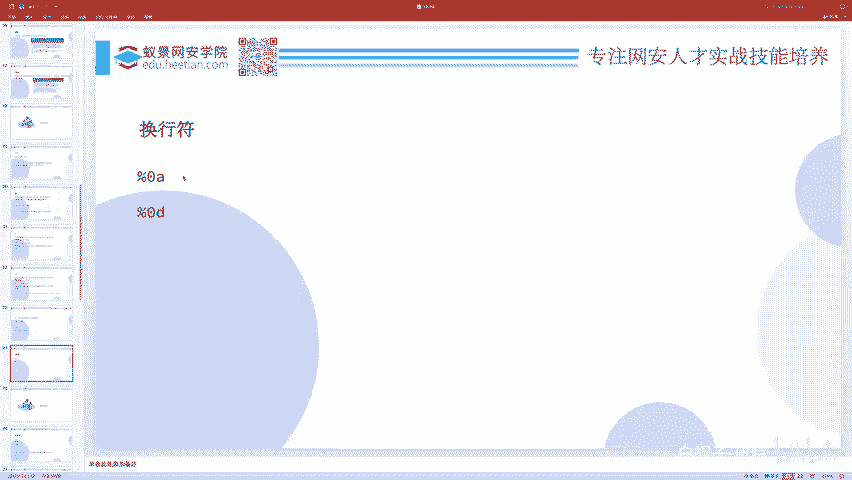

反弹赛一般就。执行那个。反弹少的命令就可以了。一般在无回险的时候，你可以反弹是。其实阿里云最近很讨厌，把括这微没被按的流量就全都给。干掉了。你比如说你有这个IP地址，这个端口号，你就可以去反弹啊。

这就是我的那个地址和端口。你去执行一下这个，然后就可以了。一定要有VPM一定要有啊，不然你你反弹给谁呢？这边是你的IP地址，这边是你的端口号。比如说现在12358嘛，所以我就监听12358。打错了NC。

然后去执行这个，但是呃一般来讲可以执接执行，但并不保证能执行成功。你比如说我现在执行它是不是就没执行成功啊，那这个时候一般怎么办呢？你可以把它放到一个呃那个外b网站上1个T叉T文件，就像我现在这个文件。

然后我们C1L它你看CYL它是不是得到这个命令，知道得到这个命令，然后管道符BSH管道服我们知道把前面的这个东西作为后面的一个参数。😊，哎，你看现在是不是又弹过来了？这就是一个呃命令执行。

我在这边反弹了我本机的sll，然后我执行了open点。那你看是不是就把当前就弹出来，这是一种办法。还有一种办法呢，我们可以先把这东西进行base64。然后怎么办呢？eal base64就得到这贝64。

然后管道符贝64。呃，杠D杠D就是本儿。baseSE答错了，表示是decode的解码，然后你就解出来这个命令了吧。哎，不是这个网址啊，搞错了。是这个是这个东西。一口这个东西，然后贝死6死当地。

你是不是就把它给解出来了，这又又多了一行，这这是这哪来的，重新搞一下。然后贝优杠D之后呢，你就得到这个命令，得到这个命令之后，你在后面再管道付呃。😊，1个BSH。这不就又弹过来了。这就是反弹。

一般就这么搞就可以了。除此之外，还有用PP代码去反弹，用python代码去反弹。你可以往上搜一搜，有好多好多的，还有直接用NC去主动连接，把那个BSH并BSH去呃给传出去的。

但是并不保证所有的题都有NC。但这东西只要是lin有。😊，有BSA是这个东西。就可以用了，所以这是比较万能的方法。反弹sha一般用在呃无回险的情况下，就比如说这个东西它确实会执行命令。

但是它只执行了命令，但是不告诉我们回显，就这种无回险的东西。无回险的问题不一定是命令执行无回险，还有一些别的无回险。比如sco注入的无回险。都有两种解决办法。第一个就是请求待除。第二个呢是延时芒址。呃。

请求的代出呢，所谓的请求代出就是。把这个结果你不是不能直接给我显示出来吗？你不是个无悔显的吗？你就给我带出到我自己的外部服务器上，我可以在这边监听，然后你直接COL什么之类的，对我发起个请求。

我在这边接受包也可以。我也可以监听，你直接把你的sll送给我，我得到你的反弹 shellll也可以。这种呢都叫带出。那如果说带不出怎么办呢？😊，其实有一种有一种问题就是现在我允许你去执行系统命令。

但是我不告诉你命令执行的结果，我还不出网，你想要带出。哎，不好意思，我这个只能你连给我，但是我不能连你就是有IP table之类的东西。呃，把这个流量干掉了。那这时候你就只能去做延时忙助了。诶。

就像这个CQ注入有时间忙住，对吧？所谓的延时忙助，就是那除了CQ语句以外，我们这个shall是不是也可以啊？只要你用shall去执行嗯，这个一个条件，如果说呃这个命令执行的结果。第一位等于A。

那就sleep5秒，大概的意思都是一样的。只不过它换了一种编程语言，就相就相当于是你好和hello的区别一样，呃，换了一种语言而已都是一样的，所以无危显的问题，有这么两种解决手段。😊。

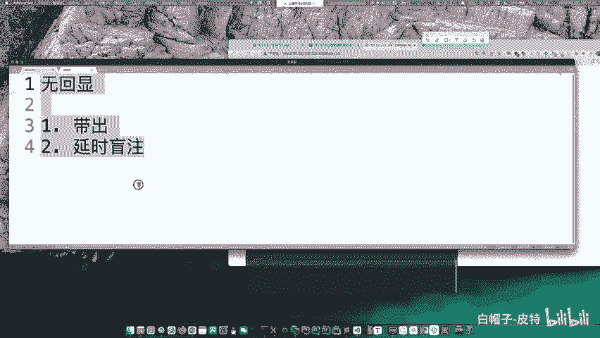

要不咱直接讲AWD吧。我们的课程是有安排AWD的，但是没有安排在公开课里边。接着呢我们讲一些这个绕过过滤的东西，前面讲的都太基础了。这太简单了，一听就会，这这题出理也没没啥意思，对吧？

所以说他一般会给你加一些过滤。就是说比如说嗯你现在不是很喜欢嗯cat flag吗？😊。

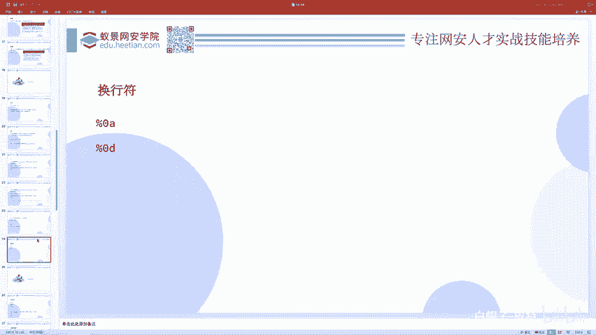

cat杠 flagag那ca不能用，不好意思，空格不好意思不能用杠 flagag不好意思不能用。那这些关键字如果说不能用情况下，我怎么样还去执行这个cat杠 flagag呢？

这其实应该是CTF本质更要研究的东西。因为你你刚才讲的那些那都太简单了。😊。

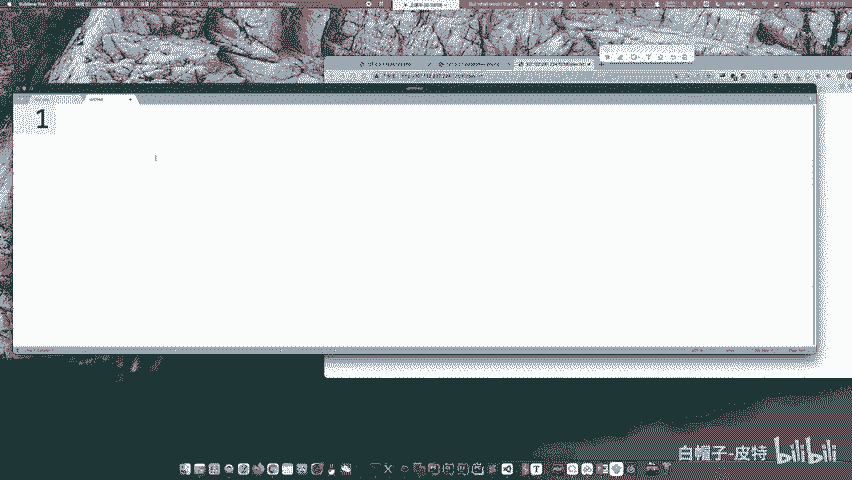

所以下面我们看一下怎么样去呃做这些事情。首先呢呃过滤空格。

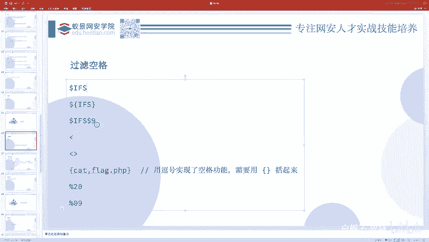

有这些解决办法。嗯，我们一个一个来看吧。我在这里面写一个flag点P2P好吧。dollar flag等于flag哎随便写点东西。

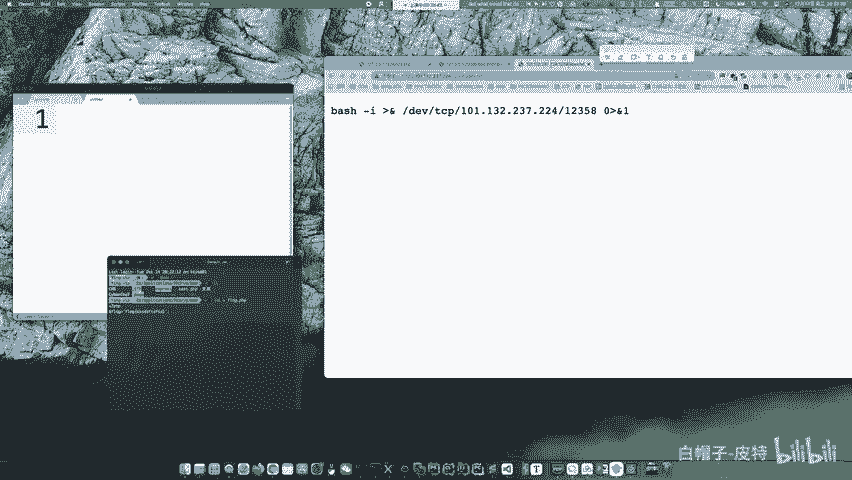

好，这就是cat flag的结果，我把它放大一点。那么如果说空格不允许用怎么办呢？我们可以有这么多种解决办法。首先，doller按FS，然后flag点皮是P。但是现在。出错了，为什么出错了？他说。😊。

cat点PPnot found为什么是这样的呢？因为dollerIFS它表示的是一个变量哎。而你这么一写。他怎么知道你写的是FS还是FSF还是FL还是SFLA还是IFSFLAG呢？你没有一个区分符号。

所以说他以为你这FSFLAG才是这个变量的，而很明显没有这个变量，所以是空的这个变量是空的是点PP那你执行了一个点P当然没有这命令，所以这样直接写是不行的那怎么办呢？我们可以来加点区分呀。😊，啊。

这个我我要用b来做啊，cat dollar IFS dollar9，然后flag连PP你看是不是就可以了。或者说你cat dollarIFS，你把这IFS给括起来。bllack name PP。

是不是也可以啊？除此之外呢，我们还可以ca。然后一个这个东西flag点PPca一个这个东西flag点PP。是不是都可以啊？因为这个表示是导入这个表示是导出在linux里边，导入的意思。

把fag点PP文件内容导入导进来啊，它因为你像像一个箭头，往左箭头，这个表示往右的箭头嘛，导入给谁，导入给cat，那是不是就相当于ca flag点PPP就发生了？😊。

还有啊我们可以用逗号来实现空格的功能。但是你逗号直接实现空格的功能。不太行。我们需要给它括起来。用这个代替空格可以不？这当然不可以啊。看到没？这当然不行，因为这是mysq的这个内联注释嘛，这是杠星。😊。

杠星，然后你可以写一些注释啊，巴拉巴拉巴拉，然后星杠，这表示的是一个行内注释。这些编程语言里面确实有这些东西。你比如说P是P。还有什么C语言，还有什mysq之类的东西。可以用这种东西。做注射服。

在shall里边不支持这这语句啊，所以肯定不行。除此之外呢呃20%这一般就是看你编码之类的东西了。209是那个制表符，就是我们通常写代码那个t键，一个t一个大缩记，就那个东西用它来代替空格。

这都是UR编码。这是空格的过滤。哎，除了空格过滤，接着呢我们还有关键字的过滤。哪些关键字呢？呃，比如说k就是一个关键词，flag就是一个关键字。

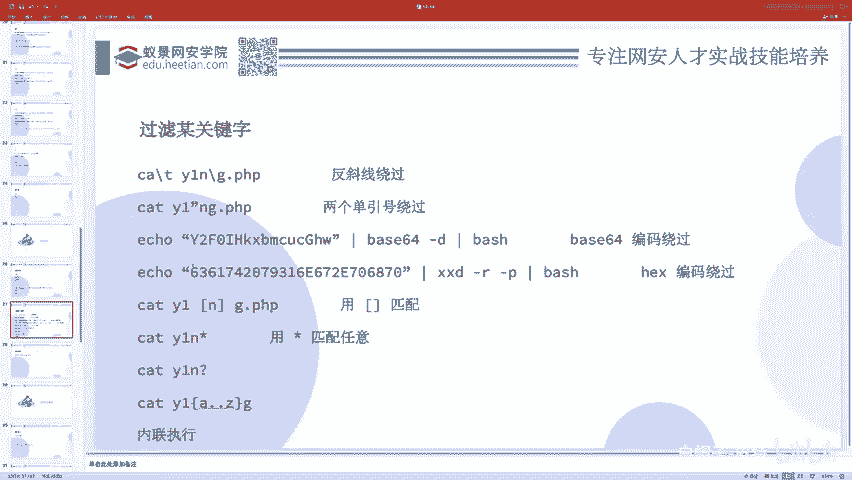

cat不能用flag不能用，这时候怎么办啊？首先第一种方法，我们可以转移ca flag点PPP。反斜线转移。但是你反斜线加到一个正常的字符里边，那相当于还是那个表示的正常字符。😊。

他转你对它转移和不转移实际上都是一样的。所以说你加了一个反斜线，那这个反斜线表示转移符的意思。但是你有没有改变它的本本身的意思？因为你这个正常的一个英文字母对它做转移还等于它本身。

所以我们就呃没有影响这个语句的执行这个命令的执行。但是呢。😊，因为转移符的存在。我没有匹配到这个FLAJ这个关键字了吧，而是匹配到什么FLA斜线这那你是不是就绕过了FLAJ这个关键词过滤啊？

这个是转移符哎，除了转移符呢，还有你比如说可以用。一个带东西。嗯，说到这个，其实我就想起了一个python的一个特性。其实很多人。呃，他都不知道的一个特性。呃，首先就是呃我们需要知道一个思路。

当一个关键字不能用的时候，我们可以把它进行一个关键字的拼接来使用。什么意思呢？比如说你在做pythonSSTI的时候，那么呃flag这个关键字不能用，呃，我们可以怎么办呢？

我们可以把这个flag给拆开FLA加上一个这这是拼接思想，你把它给拆分，然后再重组，那相当于就绕过了关键字的过滤。很多时候S4TI你都需要用这种技术。但是有的题呀。😊，他会专门把加号过滤。

甚至这个加号的过滤会难到好多好多人。就就我看到过的好多rice up里面，大家都都对这个加号就呃直接就用了一些其他的手段去过滤。但实际上加号的过滤非常的简单。但是这个特性很多人都不知道。

就在python里边都不说什么模板，就是python自己它就有这么一个特性。我们知道python做这个字符串的拼接，就呃字符串的一个加法，那就是A加B就等于AB，对吧？但其实。😊。

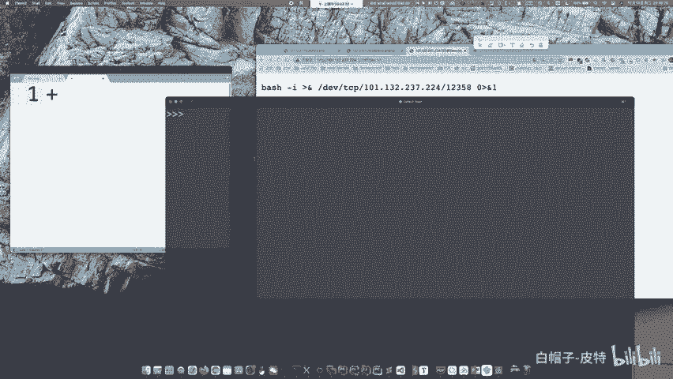

字符串的拼接可以不用加号，就除了加号，你还能想到什么别的吗？做字符串的拼接吗？😊，实际上。在pyython里边。你只需要把这两个字符串贴贴。你把它俩挨在一起，他俩就加到一块了。看到没有？A是个字符串。

B是个字符串吧，中间是不是有个这玩意儿？😊，他俩一贴贴是不是变成AB了？什么点儿那肯定这是不行的。点是表示的PP里边的那个拼接。我我现在说是python。😊，python都没有再点入运算啊。

所以在P在python里边。😊，你虽然这这这这里头。一个字符串里头加了一个两个这个单引号，但是对它根本不影响。本质是因为这表示一个字符串，后面又表示一个字符串，两个字符串在贴贴的时候会呃。

一个字符串拼接的效果，尽管他们两个不一定非要体贴，中间有空格也没问题。所以这是python的特性。一用这个特性，你看加号的过滤是不是就。太轻松的就绕过了，你不用不让我用加号，我不用加号就可以了嘛。

对吧这是因为这是python最底层的特性。那模板当然也会继承python这个特性。😊。

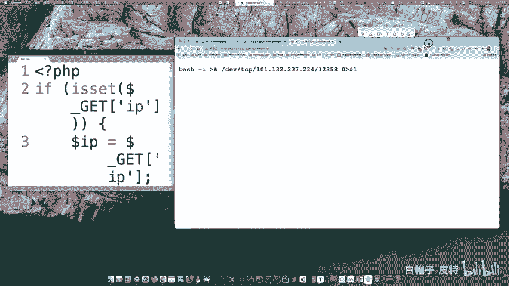

所以这个呃和和我们这个现在写的是不是呃有点异曲同工之妙啊，我怎么把它给关了？那我再重新打开。是吧所以我们在这个flag里头也写一个这个两个单引号，相当于这个单引号就没发生，没有一样。

就绕过了flag的过滤吧。除此之外呢，我们还可以把它像刚才讲反弹sha一样，先给贝斯64了贝64杠D。还有就是我也可以先把它进行一些hax编码，然后用叉叉D杠2杠P解hax，然后再BSH。😊。

除此之外呢，我们还可以用通配符来匹配。通配符有这么几种。FLAG点星星表示任意长度的任意，然后呃问号呢表示的是单个长度的任意。除此之外，我们还可以写管道辅G把G呃ABCD以FGF尾到H。

那这个中块F到H，它是一个glo同配符说F到H之间的。除此之外，我们还可以写呃大括号F点点H。😊，那这个大括号和中括号的区别在哪里呢？大括号F点点H就是F到H。😊。

之间的所有啊大于等于F小于等于H分别有三种情况。FGH这三个字母我全都贴在这儿，然后把这个命令执行一遍，不管你这个能否执行成功，我全执行一遍。你看所以FAFFLAGFLAH全执行了一遍。

其中呢FLAG执行成功了，并输出了结果，这是这种东西的。😊，除此之外呀，我们还可以选择使用内联执行。内联执行就是说呃把一个东西的一个命令的执行结果放到另一个命令里头。

比如说我们Lgra1个FLA是不是能得到flag呀？然后我现在可以把它反引号引起来，反引号就边示先把这个反引号里边的命令执行。然后把里面命令的一个结果放在这儿。于是这样就得到了flag。

本质发生的一个顺序是先执行LS出FLA得到的是FLA点PP，然后把FLA点PP放在这，然后开FLA点PP就得到这个除了反引号以外呢，还可以用一些别的。比如说doller括号也是内联执行的意思。

这是内联执行的方法。那一般来讲我们就直接ca，然后翻译号LOS就把当前目录下的所有东西都cat了一遍，都查了一遍。那flag点PP自然也被我们查到了。所以说这个是内联执行的方式，这是过滤关键字的。啊。

然后这里边呢有一道题目，高血压CTF2019也叫拼平拼的题。大家可以自己去网上搜一些环境，然后做一做。基本上有我们讲过的这两页PPT里面的绕过方法。呃，这里面除了除了这些，还有还有其实还有一个。😊。

我把它放上一点。就是变量。用变量。比如说我可以给A等于。FL。嗯，然后B呢等于AG。接着啊ca dollar A dollar B点P是P。A到了A是FLB呢是AG，那就是FLAG点P是P这是定义变量。

然后做拼接的一种方法。PPT里边忘记写了。啊，变量的方式。好，这是一个题啊，你可以去练一练。呃，接着一些时间呢，我们去讲一些代码执行的东西。代码执行漏洞就是执行PHP的代码。命令之行就啊告一万段落吧。

其实讲到这，基本上简单的中等的就都讲的差不多了。嗯，代码执行里边呢，我们先看点最简单的。就是EVL函数。文件包含吗？和和文件包含有啥关系？这个EVL函数呢就是说把一个字符串当做PHP的代码来执行。

这个意思。那么大家应该听说过一种东西叫一句话木马，就是我现在。屏幕上显示的这个，然后你用一键什么去连接一句话，木马会有一个所谓的连接密码。这个密码是什么呢？就是这个中括号里边这个纸。

为什么这个东西就是密码，为什么这个一句话木满就可以做那么多的事情呢？😊，难道P2P就专门为他开发了一个一句话木马，专门而让这些黑客去黑他们的网站吗？实际上不是这样的那之所以这个东西叫一句话木马。

因为它使用了EVAL函数，而EVL函数会把所有接收到的字符串当做代码来执行。而这个呃执行的代码呢又是一个完全可控的一个参数。所以说为什么一键能帮你做那么多事情，能帮你呃列目录，能帮你读文件下下载文件。

写文件之类的那是因为已键帮你生成了各种各样的命令，然后EVL去执行了。😊，所以这是呃一句话木马的本质。那么如果有1个EVL函数或者说一些别的什么函数，它接收到了一些参数。

这个参数是你可控的那就是这个参数这个字符串会当做代码执行，这个时候它就可能存在这样的一个漏洞。呃，那么这个漏洞啊一般就比较简单了。但是啊出题的时候不会考的这么简单，他一般会怎么考呢？他一般。

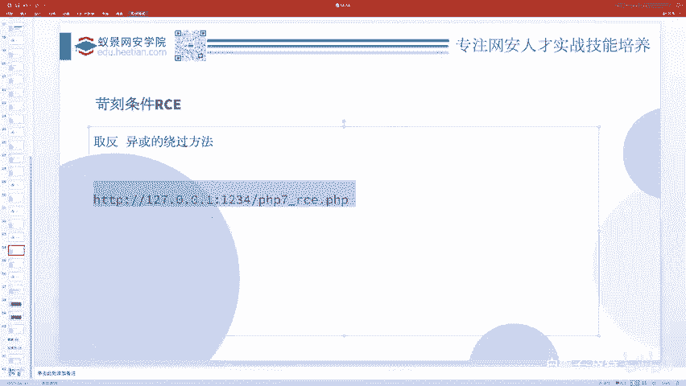

会给你搞一些绕过，就是搞一些限制。就像刚刚我们说的，你这个cat flag点PP那cat不让用，flag不让用。那这个。现在这道题呃是一个比较呃常见的题型。这里边也是EVL1个用户可控的一个参数。

但是呢对你加了一个过滤，什么过滤啊？如果说你这个。code参数里边。有字母或者数字的话，那么不行。那它其实并不是对关键字过滤，而是把所有的字母和数字全给过滤了。所以这就是一个无字母数字的weshop。

那对于这种无字母数字的东西怎么样啊去解决呢？因为我们知道你要指行PP代码，那没有字母，没有数字，都乱乱七八糟符号，这肯定是不行的对吧？没有人写代码，那一个代码里面全是符号，一个字母，一个数字。

没有没有这种东西。😊，呃，代码执行是一个很很大很广的方面，就是这种各种各样的变换呀，它这个限制可以出各种各样的题，但是那种东西就。😊，呃，很难。所以说我们这个基础课里边没有安排特别特别的过滤。

给他只是给大家讲了一些最简单的就是过滤字母和数字。当然我们正式的课里边会讲很多特别特别难的题。😊，基本上目的就是当你遇到一个呃这种命令执行代码执行的题，不管他出的多难，我们都会把这个呃难度都给覆盖掉。

cat等于more cat呃more确实是可以替代ca的，但是它俩有有一个区别，就是呃多行的文件的时候，你可以就是你可以自己试一下，你可以弄一个有好多行的一个文件。然后你用cat和more去比较一下。

它俩其实有有一点点区别。但是呃反正都可以读文件，除了more以外，还有很多东西可以读文件的。😊，你比如说用用base64是不是也可以啊，base64一个文件，对吧？😊，也有很多这种去替代他的方法。

接着我们看一下这个呃，就现在举的这个例子，没有字母，没有数字怎么办呢？我们就以PP7为例，因为我现在用的是PP7的版本，5和7还是有一些区别的。😊，在PP7里边，我们想要执行一个命令。

执行是执执行一个代码，但是这个代码又没有办法包含字母和数字。那其实就是需要你使用到一种变换的思想。怎么样通过一种变换，把一个本来不属于字母和数字的东西，然后经过某种运算变成字母和数字。

那PP里边有这种运算吗？当然有就是什么就是未运算。😊，啊，那在这里边呢呃我这里边准备了两个代码，一个叫叉R点PP它是一个专门做易货的东西。我们可以看一下open。长玩点PP。

这个代码就是你要把什么字符抑惑，你就把这字符放在这儿。比如说我要现在通过易货获取1个P1Pin，那么我就把P1Pin写在这。然后P1P叉2点P1P，我就得到了一个这个东西，这就是抑获得到P10P的。

在讲义惑之前呢，我呃我们需要先知道1个PP的特性。其实昨天。也提到了，就是昨天我们不是讲变量覆盖嘛？变量覆盖有例讲了这么个东西，就是变量覆盖先extract。😊，Dollar get AR R。

然后我们就dollarDdollarpo0。对吧我们昨天是不是讲了这个这么个代码，讲变量覆盖的时候。😊，然后当时有个同学就问，就说这个do了D括号到了po0，他不理解是什么意思啊。

然后我说这是PP7的一种特性，叫做呃函数的动态调用。你可以先搞一个字符串PP info这个字符串，然后你把这个字符串呢加一括号。那么就相当于利用这个字符串去调用这个字符串同名的那个函数了。

所以你看是不是PP音符就执行了呀。那现在我其实只需要通过某种手段来得到一个这个PPPin的这个字符串。这PPin字符串可以是呃P是P点in这样拼接得到的对吧？你看是不是也可以啊，除了拼接以外。

还有各种运算得到的，你只要得到一个这个字符串，然后你把它扩起来，然后后面再套一括号是不是就执行了呀。😊。

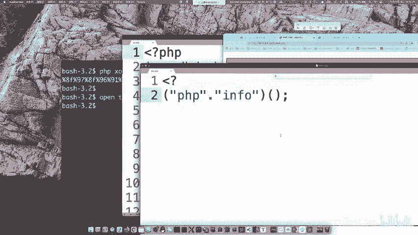

那么啊易货运算的本质呢就是。去得到这样的一个字符串。你看所以我现在得到1个PPin字符串，然后在这里边要要执行一个code。那我就col等于。首先我要给它括起来吧，然后括起来加括号是不是就执行了？😊。

看到没有？虽然他这里边报了一些 warningning，说你这个呃呃百分号就是这个UL编码的这两个东西，它是一个没有被定义的。但是没关系，它确实能运算出来PP in，然后PP in就执行了。

那如果说我想要执行点别的呢，你比如说我想执行sstem L，那你要你就先构造一个stem呗。这就是一个sstem。我把C们放在这儿，放这括号里边。然后现在。有了sstem。

然后他说system expectpect at least one parameter0 given expect呃，就是期望至少有一个参数。但是呢你一个参数都没给，那ssem函数至少触发了吧。

你看对吧？只不过他报错了，那你要执行什么参数呢？你的参数也是相同的办法喽，我执行L。😊，那我搞1个L的一个抑惑，然后把这个放一头。

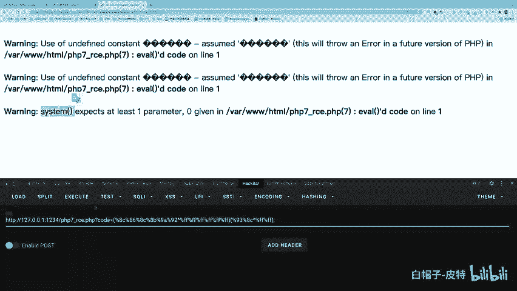

啊，你看这就是LOS的结果。在这儿呢，尽管他报了一些 warningning，但至少LOS被执行了，对吧？这是呃，在没有字母和数字的情况下，我们是不是也把它给搞出来了？这是取反啊，不是不是取反。

这是抑惑。生成PP抑惑。嗯，字不串。点PP。上。嗯。除了抑惑以外，我们还可以用取反来搞啊，这里边有一个取反。比如说把要得到一个。

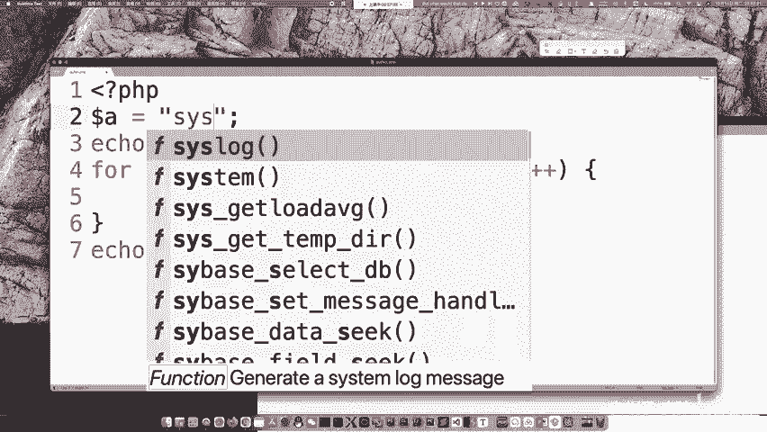

不生産？那么我就P1P这个取反点P1P，我就得到了这样的一个取反。这取反呢，你这中间是有个括号，对吧？把它整体取反。那其实如果说你不加这括号没问题。把它写在这儿，然后后面还是这L。

那你看这L是不是也触发了，甚至说这个里里头的这层括号亏没有没关系，就是这个括号没有没关系，你看它是不是也成功了呀。那你这个疑惑的，你你把这L应用区烦搞一下。

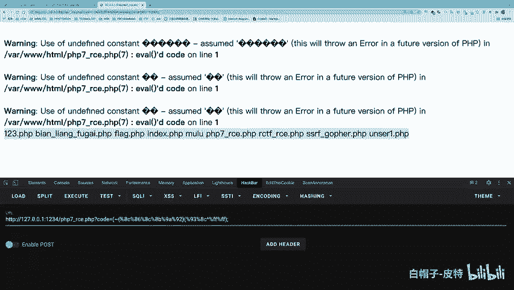

这是。生成PP抑或是取反都串。取返和抑或是比较常用的，绕过这个。无字母数字we shop，但是这种东西相当于是比较基础的一种绕过方式。还有一些比较难的呃。

就我们就不在这个基础课里边嗯给大家再灌输特别难的知识了。大家因为毕竟还是呃刚入门吧，对吧？所以我们先讲一些简单的东西。😊，那CTF里边它会呃简单题会出一些这种。那难的题呢可能要比这个要复杂，一些。

你要构造好久好久才可以构造出来。

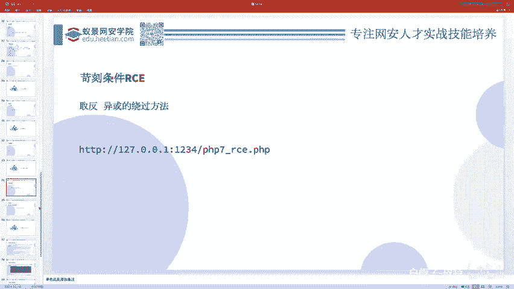

接着我们看一个这个题，啊这个这个这个打不开呀，我我还得那个什么，还得把它这个解析成那个。呃，解析成IP地址。本来之前都可以打开的，本来之前是阿里云的服务器，你只要不是80端口。

8080端口中常用端口不不不备案，没关系。其实我这域名备案过了Y因这点VIP。😊，但是他很讨厌，所以现在子域名也得备案A点什么B点什么。😊，C点什么，这些都得子域名都要接着备案，就特别的恶心。

之前就是一个备案，然后他的子域名都可以随便用，然后现在是子域名得备案，但是呢子域名备案，但是你不是什么80端口之类的，这种2005端口还随便用，现在又恶心人了。就从这两天开始，从昨天开始吧，就你。😊。

这种端口都不行了，都都都不能用域名了，就就是恶心人。所以只能输输这个IP地址了。本来搞个域名，希望访问的方便一点。那这个题目的话呃看上去难啊，因为它过滤了好多好多符号，好多好多的东西。

首先长度不能大于18。他说you are really long，but I don't like more than18，然后杠W是表示什么呢？杠W表示是字母数字下划线不能有。然后接着这些and或呀。

抑或呀取反呃，取飞这些符号stop calculating就是不能做这种微运算，然后括号不能用说call function is not不能用括号。呃，这里又多写了一遍，这是没用的。

然后大括号中括号就是呃bracks是那个括号的意思吗？不能用，还有doller啊。艾点儿不能用，说这些都不能用的情况下。还不能大于18个字符，我就给你译为AL就这么个题，就这么这么呃苛刻的一道题。

做起来竟然是如此的简单啊，你只需要执行这么一个东西就好了。😊。

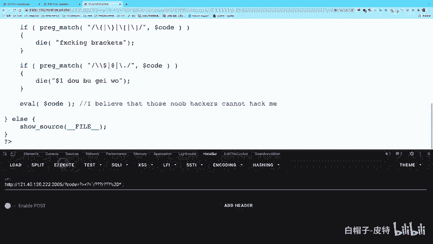

但他会执行好慢好慢好慢。太多了。Flaag。大括号。

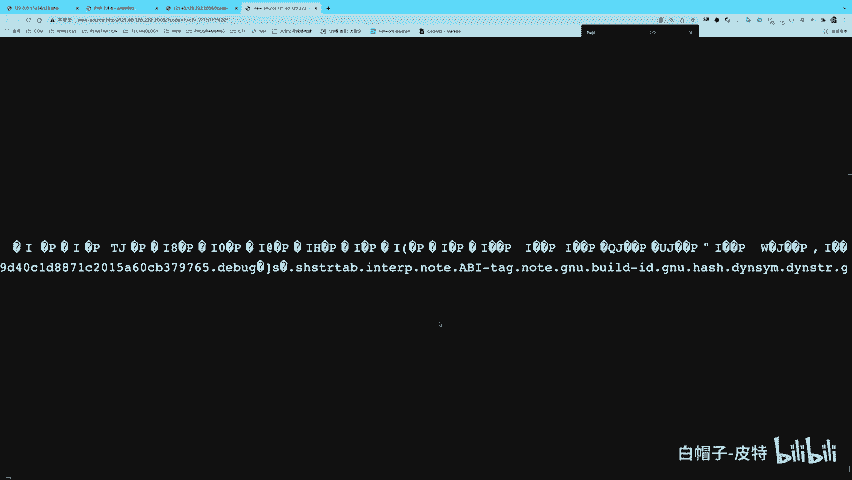

这都找不到了。在这。这是一个flag，就是就取到了，大家看到了吧？就有太多了太卡了，我把它给关了啊。那么为什么会发生这样一件事情呢？就是为什么我输入一个这个就可以把这道题做出来呢？😊。

首先这个东西表示先把你这个PP结束，这，然后后1个PP7始，然后这是1个PP的短标签。就PVP标签一般不是这个吗？然后我们可以不写这PVP，这就叫short tag短标签，不写这个PVP这三个字。

然后在这短标签基础上加一个等号，它表示了什么呢？😊，表示的是。依口。这个东西是方便开发者写代码的。所以比如说你这个呃问号等于1个ABC，那就相当于是一口1个ABC就会输出。那我现在等号一口输出啥呢？

输是反引号，反引号我们刚才讲过了吧，反引号表示什么呀？表示shallEXDC吧，是不是执行系统命令啊？😊，而执行什么系统命令啊，执行的是里头这个系统命令吧。😊，这里边摆放20是空格。他就执行了这个。

而星号是什么？星号表示任意吧，星表示任意，然后问号表示单个长度的任意。所以这个东西其实就表示什么东西呢？并开。行，所以他最后相当于是执行了病 cat的星。当然因为它太太匹配太平常。

他还可以匹配好多其他的东西。所以说啊在结果里面我们看到的太多太多的结果，因为它能匹配到的东西太多了。但是最后它确实匹配到bin cat的星。然后这个星呢也可以表示flag点PP吧。

所以说就宾 cat flagag点PP就发生了。那我们就拿到了flag点PP的结果。😊，这个就是呃。

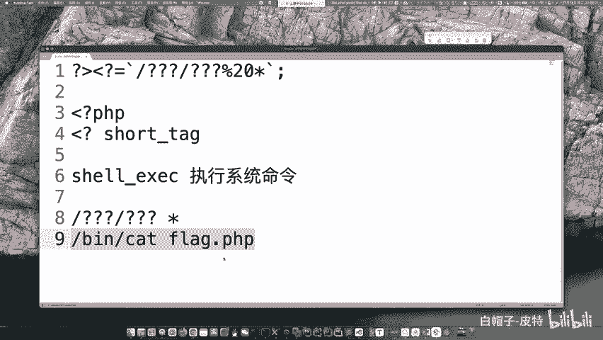

这个题的解法。因为我们要执行并输出嘛，所以说你你要输出的话，你就只能用什么eco之类的东西去输出。但是那个还不行。如果说你去调别的函数，这里边也没有办法去呃进行一种未运算的。

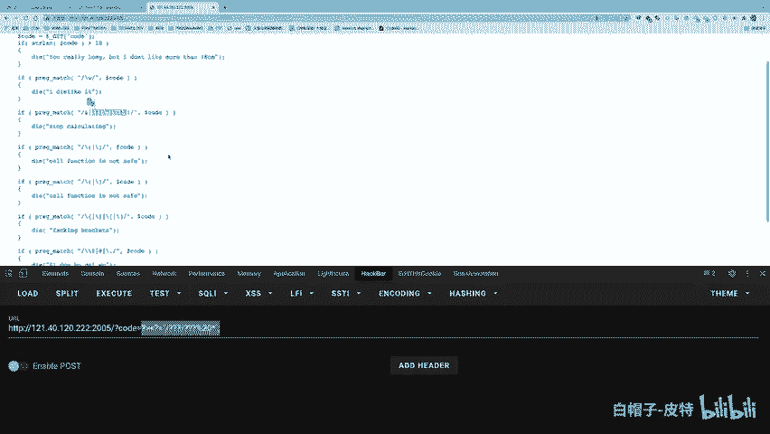

构造。所以说我们只能调用这个反引号这个函数，它是shaEXEC的别名，但是它不需要字母数字下划线，它就可以执行。那么这个东西又不能输出，怎么输出呢？啊，依口什么又太长了也不能用。所以我们用短标签输出。

但是你想要用短标签的时候，那一个标签开始必须要先把一个标签结束。所以说我要先把它结束了，然后再起始。所以这个东西其实本质上并不是我去找什么闭合。因为你这里前面也没有东西，就是一个doer code。

你直接执行就好了。😊。

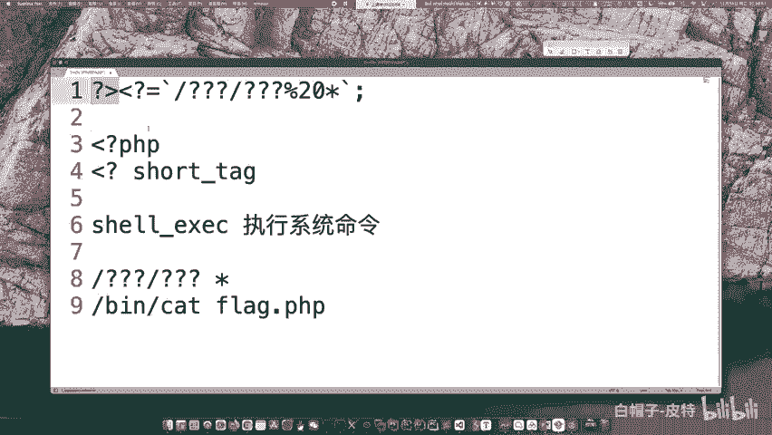

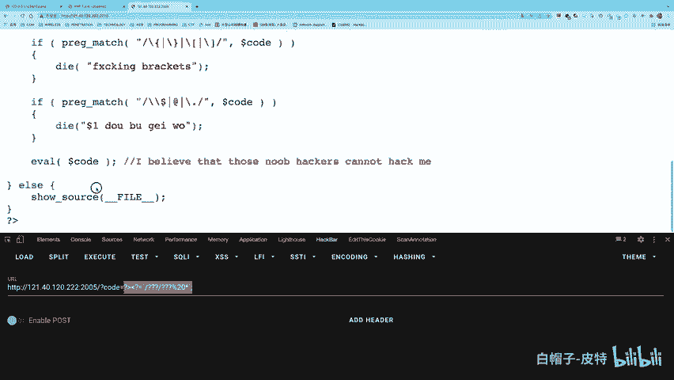

这本质上你就算直接这么写也没问题，它也可以执行，但是没有输出呀。为了输出啊，我们给他加了一个这东西。😊。

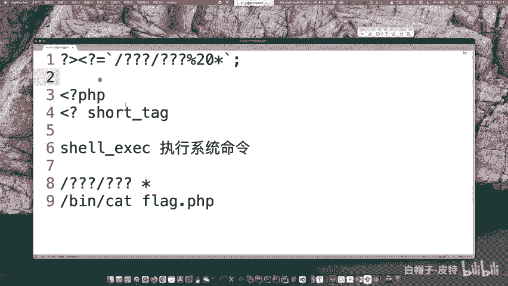

所以说大概呃思路是这样的。那这个是一个呃。比较看起来难，但实际上不难得提。接着呢再讲一个知识点。叫做create function。create function有时候会考。它是去创建一个函数的。

比如说你给一个doer A dollarB值参数下一个函数体，然后就会创建一个函数。但是这个创建函数的过程中呢，它存在着一个呃代码的注入啊，就是你可以在里边先用一个大括号，把这个函数闭合了。闭合之后。

后面你就可以去注入你自己的代码了。但是它后面还有个大括号啊，然后你就用这个注释符把这个给注释掉。这个其实相当于是先闭合，然后然后再注入东西，然后再把这个闭合给注释掉。这些和CQ注入差不多。

这就是create function的一个呃利用方式。但是这种东西呃考的不多了，因为create function已经渐渐被淘汰了。好，那讲到这里呢，我们这个课程啊就讲完了。大家有问题的话呢，可以去呃。

在这个讨论区里边留言。然后就是我们正式的课程。

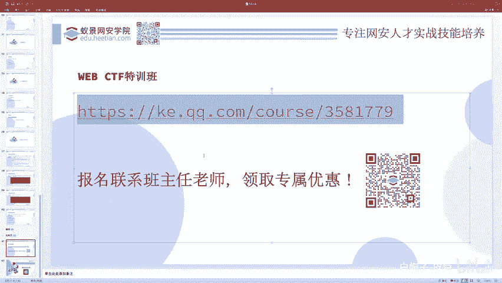

课程的链接。啊，在这里。

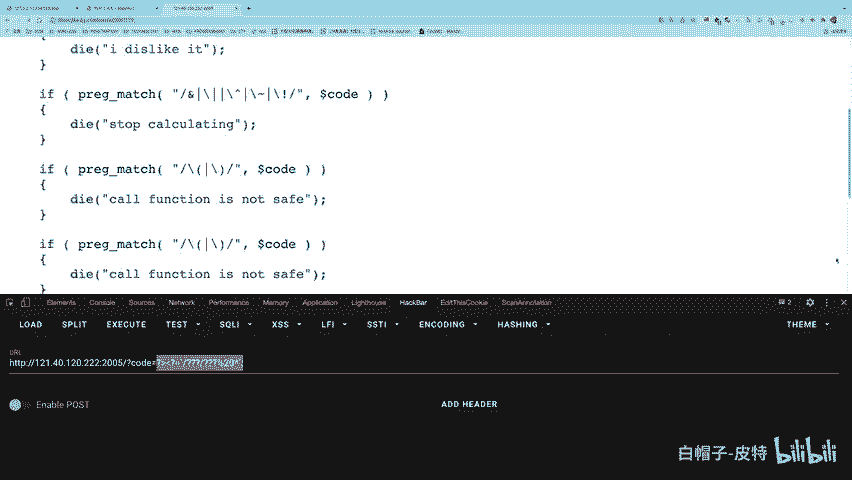

啊，在正式的课程里边也是有由我主讲的。然后这边是呃直播安排。呃，在正式的课程里面会讲的东西比较啊比较难一些。就包括刚才的代码执行，我们这里面其实讲的比较基础，但是一种。😊，呃。

在我们正式课程会讲一些特别难的东西，包包括一些嗯高质量的那种国际赛出过的很复杂的题目，怎么样利用思想啊什么之类的。还有就是呃呃之前不是有同学说AWD相关的问题，对吧？

我们这个课程里边也专门有一个线下赛专题，一共有123456，一共有6个课时。专门讲AWD基本上6个课时就可以让你实现从一个零基础到打个前几的这种水平。因为AWD本身并不是什么特别难的东西。

就主要考考察你的工具，考察你的框架，考察你的自动化这方面的事情。啊，然后后面还有一些专门的这种高质量题目等等。如果说啊大家对这个正式的课程。嗯嗯，有兴趣可以联系各自的班主任老师领取优惠。

因为现在是双十二期间嘛，虽然已经过去两天了，但是还是在这个呃双十二期间，大家可以抓紧时间抓住双十二的尾巴去呃联系呃各自的班主任老师，领取这个优惠优惠的力度还是蛮大的。PPT今天还发吗？

PPT的话是会发的。呃，等我讲完课，我会发给班主任老师，然后你们去找班主任老师去领取PDF版本就可以了。呃，正式课程优惠后的价格是多少。呃，这个你可以呃私下啊联系我，或者说联系这个呃这个这个报名老师啊。

班主任老师都可以。

大家也可以扫这个二维码，这里有二维码，包括上面这个我们的学院logo旁边也有一个二维码都可以去联系呃。学院的一个报名老师，或者说大家自己私聊各自的班主任都可以。那没有其他的问题呃。

我们今天的课程就到此为止啊，就正式结束了。