# 2024【防破解教学】易语言软件作者，如何利用themida保护软件不被破解【游戏安全，网络安全，CTF比赛必备基础】小白软件反汇编逆向安全2024最新 - P1 - 小迪xiaodi老师游戏逆向 - BV1TT421k7fm

hello，大家好，我是小刘老师哈。今天呢收到粉丝的留言说什么呢？他说自己写了一个小软件，然后呢，没几天就被破解了啊，那么他是一个E语言的软件作者。那么今天呢我们就来讲一下E言软件作者，如何去防破解？

我们用到的工具呢是TMD它是一款保护壳，如何用TMD保护壳保护软件不被破解啊，更大可能性的不被破解啊，不可能说百分之百不被破解。因为这个攻防是无绝对的啊，攻防无绝对，没有绝对安全的系统，懂我意思吧？来。

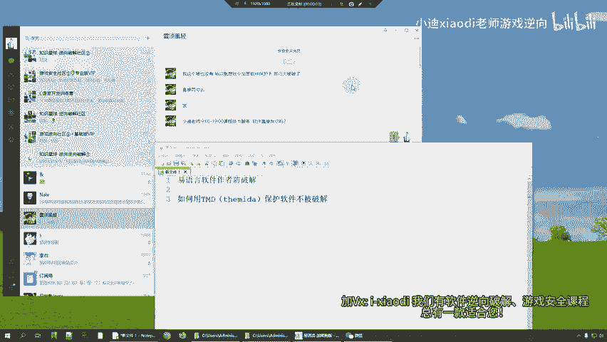

首先呢它是一个议言的软件作者。我们先来看一下啊，先来看一下这个现象。这个呢是没有保护的一个程序，这是一个议言程序。那这个呢是保护了的议言程序。我们去分析一下，从攻击的角度，哎，咱们从攻击的角度去看一下。

首先我们看一下这个没有保护的程序。首先呢打开我们的调试工具。

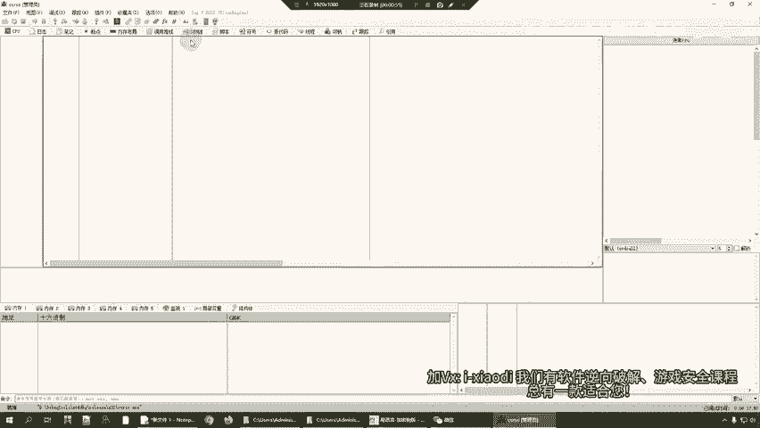

一般来说呢，我们是先运行程序，然后呢点击文件，点击附加。好。那这个时候呢大家会发现一个问题，这边呢所有的功能启动看到没有？所有的这个字符串呢都能够看到啊，它这个功能到底在干什么啊，都能看到。

然后呢我们去搜索一下当前模块的字符串。可以看到功能发挥成功，功能启动成功，或者说登录成功啊等等等等。所有的信息呢都能在这儿这个一览无余，对吧？

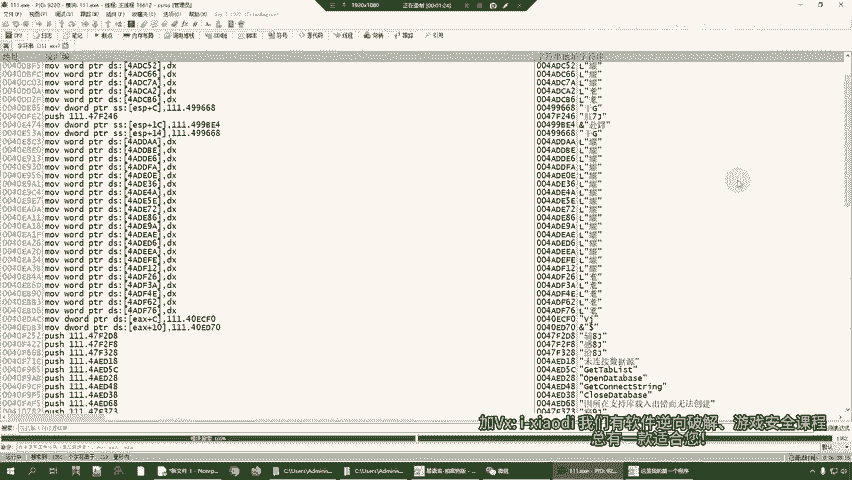

那么这就给这个攻击者哈提供了非常大的一个便利性。看到字符串看到没有？比如说我搜字符串，我看到字符串之后呢，我双击就来到了相对应的一个代码段。然后呢，我在啊比如说我在这边呢就是函数头部吧。

push是1BP目EPESB这边呢就是函数头。那我在函数头下段进行一个分析，点击我断下来了，对不对？断下来了。好。然后呢。我再看一下，这边是功能启动成功，对吧？功能启动成功，我看一下来F8单步走一下。

这边温馨提示了啊，温馨提示。好，共能启动成功了。看到没有？功能启动成功。好，那这边呢是功能启动成功，那么可不可以改成别的呢？比如说改成这个攻击者，想改成自己的一个信息，可不可以呢？当然是可以的。

我们试一下啊，那我们重新运行一下这个程序。😊，来呛过来，您看这边是功能启动成功，对吧？我随便改一改啊，咱们随便改一改，功能启动成功，这个启动成功。来，我们二进制编辑编辑一下啊，功能系统成功。这个小迪。

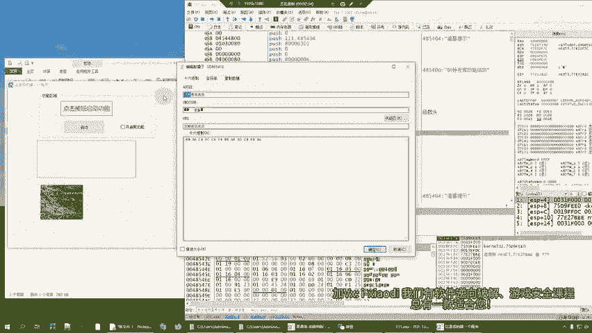

小离启动成功可不可以呢？可以来试一下，点击启动啊，断下来了来走起。😊，看到没有？我们就作为一个攻击者，咱们改成了小迪启动成功，是不是非常可怕，对吧？所有的东西都是一览无余的，所以说你想怎么改就怎么改。

对吧？然后我们再来看一下什么呢？咱们再来看一下保护了的程序能不能实现这样的操作来。😊，我保护了什么呢？我就保护了这个启动按钮啊，这个功能按钮的这个功能来，我们去试一下，点击文件，点击附加。

然后呢也是打开这个程序符号切换到主模块。那这个时候呢大家会发现啊，这边我没有保护啊，来大家会发现这边是之前咱们看到一个函数头部吧，对不对？函数头部来。

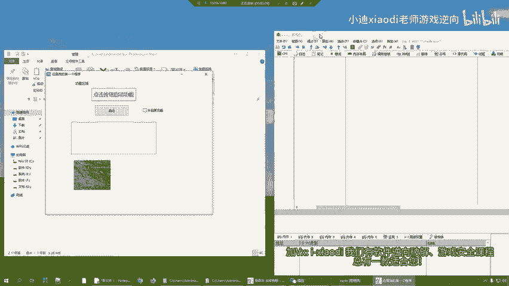

函数头部。那么大家会发现一个问题啊，那这个函哎呀怎么打错了，函数头部啊，来函数头部对吧？那么函数头部下面你能不能看懂呢？你是不是看不懂啊？那你这个时候再去修改，能不能实现修改呢？不能吧，来。

我们去搜索一下当前模块的字物串。😊，你连自乎串都做不到，对不对？所以说我们就直接从这一层面啊给了这个攻击者一个。非常大的一个打击，对吧？心里边可能就失衡了。哎呀，这个软件怎么这样啊，对吧？😊。

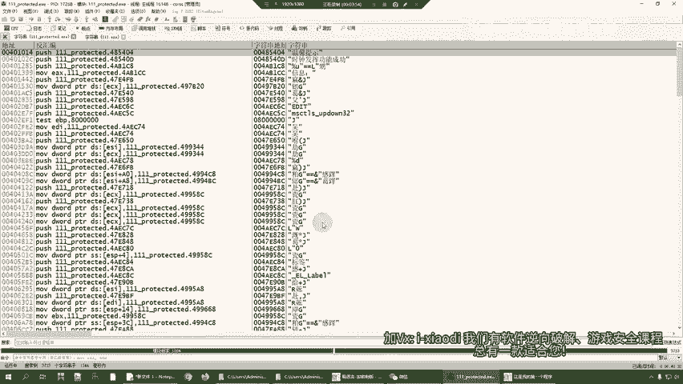

行，那么这种东西怎么去实现呢？我们来讲一下啊，因为咱们今天的这个内容呢是针对议元软件作者的啊，意元软件作者怎么去防破解？首先呢你是一个作者，你有什么呢？你有源代码，咱们是从源代码层面去。源代码啊。

源代码层面去解决这样一个问题。来，我们先把程序关掉，我们去打开我们的语源代码来。

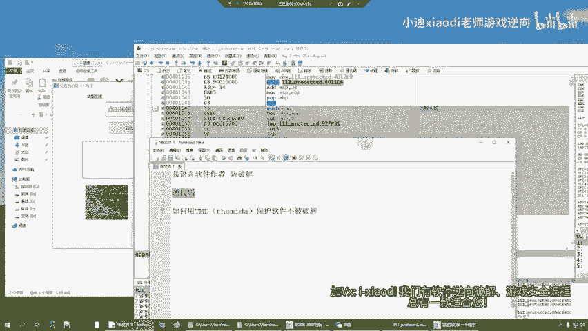

我们看一下我们这个代码怎么写的。😊，非常简单哈，我们要准备两个东西啊，一个呢就是咱们的这个议言啊，只有一个。😊，啊，我我已经打开了，好像啊，在这儿来点击启动。比如说我们想要保护这个按钮一。😊。

想要保护我怎么办呢？好，第一步先添加这样一个东西。有就时说候呢在函数的头部，你看这边就是第一行，这函数头吧，这边有函数的尾部吧，在函数的头部和尾部呢加上这两句代码，懂意思吧？先加上这两句代码。

那么加上这两句代码之后呢，我们先静态编译一下，来，我们编译到这个里边。

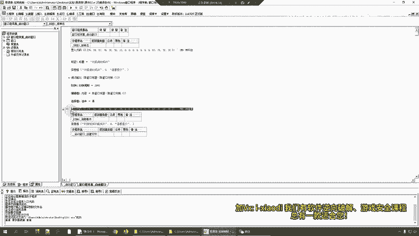

来，我们给他起个名字叫什么呢？叫这个222。😊，来给它起个名字叫做222。好，这个就是我们的222程序。222程序比1一程序多什么呢？多了这个东西置入代码看到没有？置入代码。好。

这个这一步啊我们就完成了。好，这是第一步啊，来第二步，第二步呢，打开我们准备的这个保护壳，这是我们的保护壳啊。

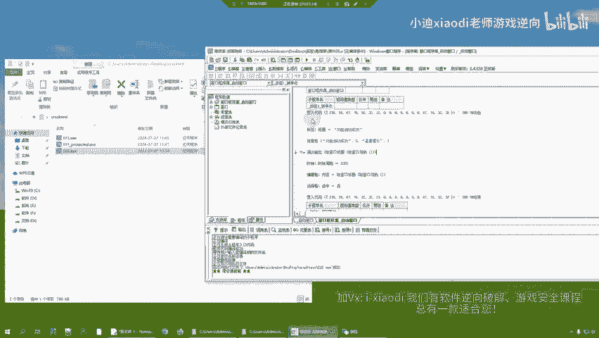

来怎么去保护？我们先运行，运行起来之后呢，把它拖过来，看到没有？直接拖过来就可以了。那拖过来之后呢，点击这个。点击什么呢？点击这个，然后呢，把123把这三个保护上，这这几个保护选项勾选上勾选上之后呢。

点击这个。点击protection macros，如果说出现了YM，这有一个对号，就一个okK，那么就可以了。其他的不用管，直接点击什么呢？点击protect来，这个时候呢就开始保护了。它保护的是谁呢？

保护的是你刚才那个函数。来，我们先运行一下。好，程序运行是没有问题的，看到没有？没有问题，我们关掉啊，重新来来运行。然后呢，这个时候我们打开我们的调试工具啊，攻击者就这样去攻击的啊，点击文件，点击文件。

点击附加来附加过来。

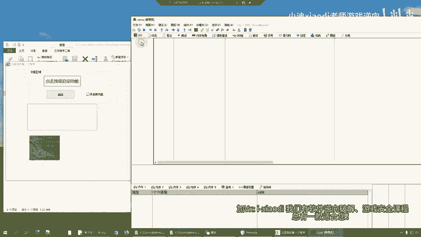

看到没有？是不是这边就被保护起来了，对不对？O。😊，那么这是第一步哈。好，那么。😊，它为什么能够识别出来这个东西呢？来为什么能够识别出这有一个VM的东西？因为我们在代码里边呢添加了什么呢？

我们在代码在函数的头部和尾部添加了这个。如果说你想混淆这个。你想混淆这个这个函数，你就在这个函数的。头和尾啊添加上这个。如果说你你想混淆这个，比如说时钟发挥功能成功，如果说我想把这个也混淆呢。

那你就这样来。这开始吧。你把结束来来一个结束，这是个结束看到没有？来，我们在静态编译来改成1个333。

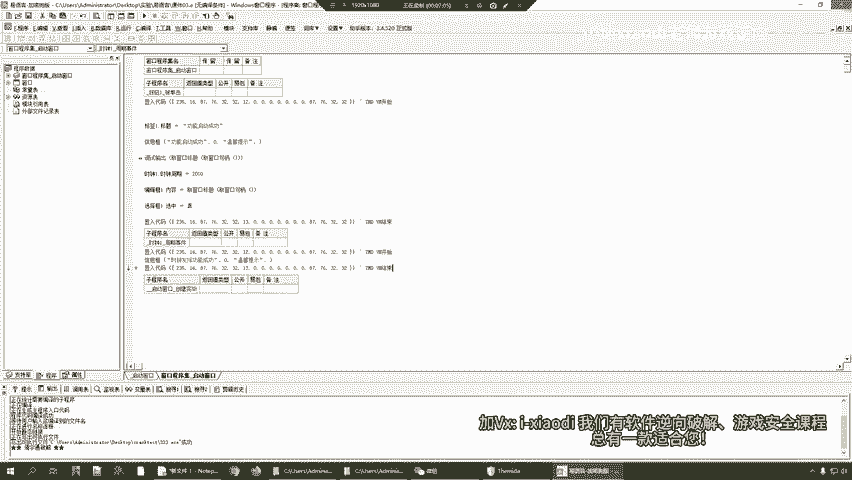

好。杉杉来了。把这个333拖过来。错来了是吧？然后呢，这边选项勾选上，这边不要选，一选这个程序啊就跑不动了啊。来看到没有？两处是不是两个函数啊，我们混淆要两个函数来protect保护一下。😊。

okK点击close关掉我们程序运行。看一下程序的功能有没有问题，看一下啊。嗯，程序的功能没有任何问题。好，看一下破解的问题来破解。

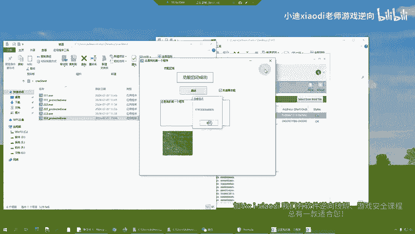

点击调试工具来。看一下能不能破解，点击文件，点击附加过来，符号双击过来，看到没有所有东西全部看不到啊，全部都看不到。那这样的话你就没有办法从本地进行一个分析了，懂意思吧？

所以说这对寓言作者来说是一个非常非常好的什么呢？保护的一个方法啊，今天呢我们就科普一下。如果说你用了这样的一个保护的一个方式啊，百分之。

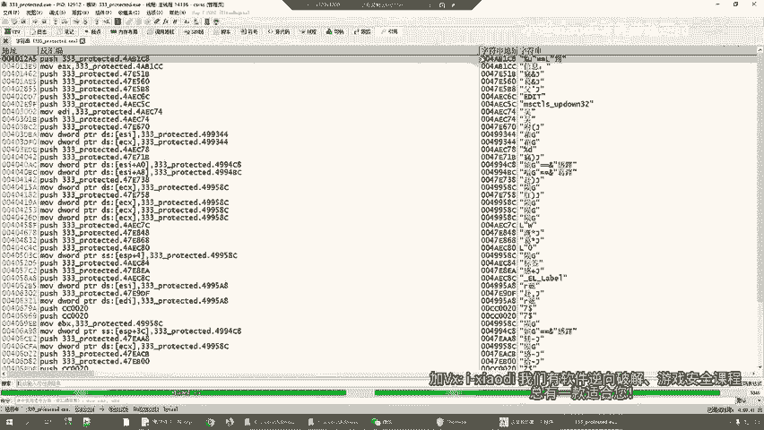

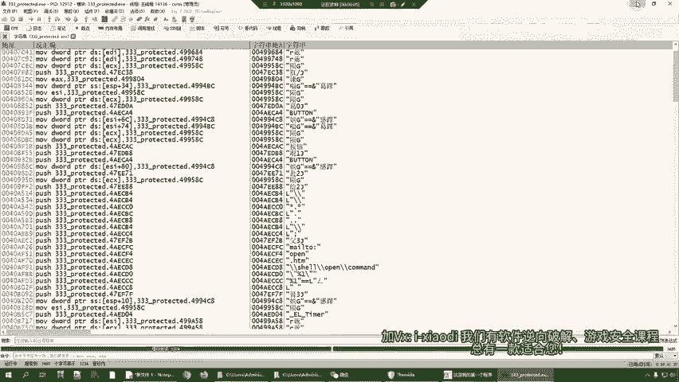

80的人都破不开啊，因为80%的人都是菜鸟啊，小白级别的。当然这个这个东西能不能破开呢？啊，当然也是可以的当然也是可以的。😊，只不过呢需要一定的这个呃更高的技术水准才可以啊。

但是呢你可以防80%的这个破解点了。懂我意思吧。行。😊，那这个就是咱们今天的一个内容啊，想要学习软件逆向的啊，软件逆向破解啊，可以联系我们的微信啊。I杠小D微信I杠小迪，这是我们的微信啊。

我们这边有软件逆向破解以及游戏安全辅助开发的一个内容，欢迎大家学习。好，我们下期再见，拜拜。😊。

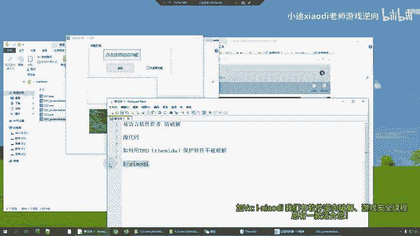