# 2024年最强Kali渗透教程／网络安全／kali破解／web安全／渗透测试／黑客教程 ／代码审计／DDoS攻击／漏洞挖掘／CTF - P10：4.linux开关机重启 - 网络安全系统教学合集 - BV1Pe411C7Zb

好的，下面我们来给大家讲解就是linux的命令行关机重启。其实在对于我们的一个linux操作系统来说的话，其实啊。我们在这里也可以看到。点击关机，这里有对应的一个电源键。

然后在这里我们可以看到系统将在60秒号自动关机。其实啊就是我们在。ED克操作系统里面，它这一个渗透S默认的一个关机时间，其实是是60秒钟的一个时间。那。他每一次执行关键默认是要去添加60秒的一个延迟。

我们在这可以选择取消，或者说选择重启。或者说选择关机。那这一些的话选择关机就是立即关机的意思。那如果说目标的一个操作系统，或者说我使用的这一台snoS操作系统，它没有图形化界面呢？我应该怎么操作？

那这个时候啊，其实我们就要用到命令行的一个开关机重启的一个命令。天哪嗯。我们可以在命令行输入IEBOT去重启的这一台操作系统。

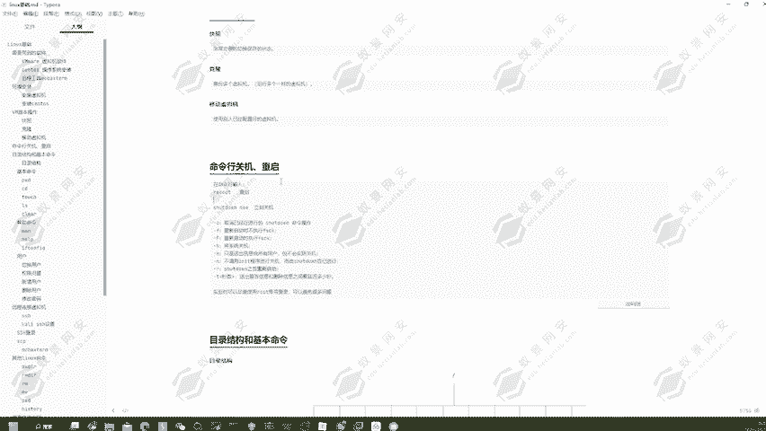

REDOT重启这一个操作系统。当然，如果说我们不用这一个命令的话，我们也可以使用到s down的一个命令去进行一个重启，或者说关机、定时关机等这一些操作。

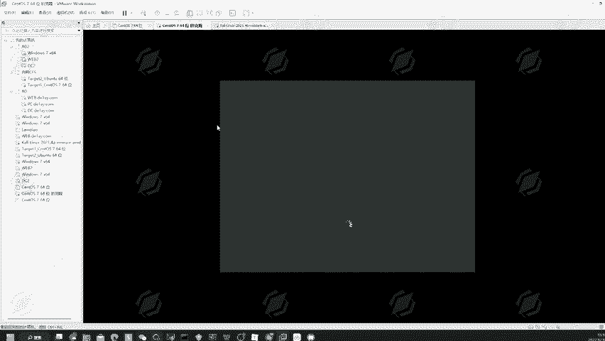

好，稍微等待一下它的一个启动。好，可以看到它已经重新的出现在登录页面了。然后我们在这里输入到123456去进行一个登录。然后登录完成之后可以看到在这里我们又可以去执行到对应的一个操作。

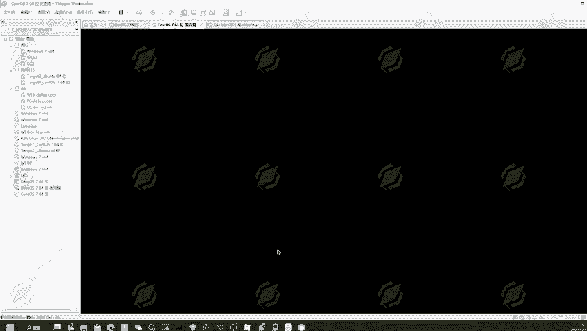

我们可以去选择使用到s downMOW，也就是立即关机的一个命一个命令。

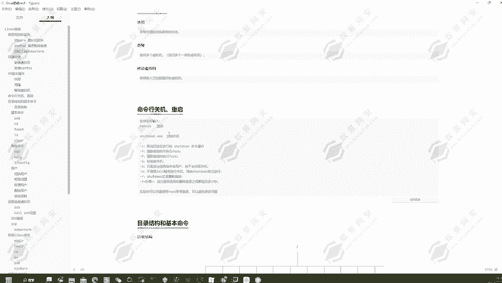

我们不想给它设置延迟时间，我们就直接的使用到。下下蛋LOW直接的去进行一个强制关机。好，然后我们再重新的对它去进行一个启动。

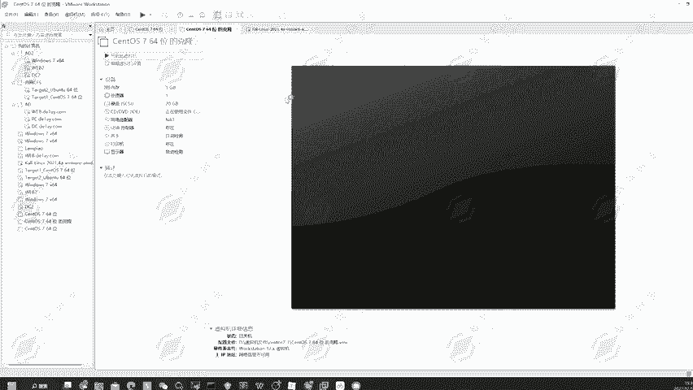

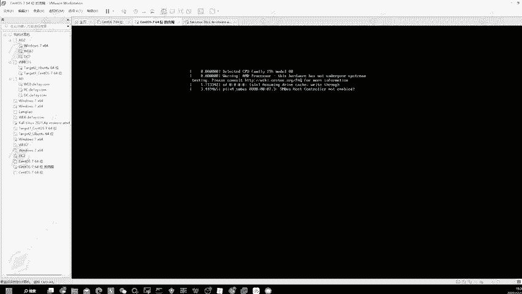

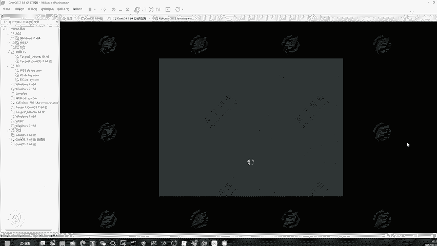

然后我们可以使用到下车档，对它去进行一个定时开关机。也可以去进行一个重启的一个操作。可以看到。那如果说我在这里对它去进行了一个定时关机。然后我想要取消怎么办？

我们可以使用到下车档杠C的一个参数去进行一个取消。那下面给大家演示一下，比如说我现在要给他去使用到下蛋杠H。他一分钟之后会去进行关机。那可以看到我现在执行下车档杠H，它提示我需要用到root用户。

其实啊对于这一个问题啊，在我们使用到linkux操作系统去进行一个学习，或者说在我们使用到开y操作系统的时候啊，我们一定要注意，就是很多的一些文件，很多的一些命令啊，并不是我们普通用户。

也就是我这一个E页用户能够去执行的一个操作。可能他需要管理员用户，可能他需要root用户。那这个时候啊，其实我们对他的话去进行切换root用户是最好的一个解决方式。也能避免我们出现很多不必要的一个麻烦。

因为在linux里面，root用户它其实是一个最高权限管理员用户。也就是我想要执行什么操作，在root用户里面是不会被拦截，也不会被拒绝的。所以说啊随到用root用户去进行一个学习的话。

是可以帮助我们去解决很多不必要出现的一些麻烦问题。好的，那下面在这里我们可以去切换为root用户，我们输入命令速root去进行切换，然后输入密码123456，切换为root用户。

然后我们再执行sha down。嗯。杠H可以看到系统提示我就是在一分钟之后，然后才会去进行一个关机。然后在这里的话，我们可以按住。我们这里随便去选择一条命令。

可以看到它这边是告诉了我一分钟之后然后会去进行一个关机。然后我们在这里可以去执行一条命令，叫做上当。杠C结束它的一个关机的一个选项可以到。这边已经设置好的一个定时关机，一分钟以后会去继续关机。

然后我们输入到 shuttter down杠C就可以结束到这一条命令。然后我们也可以使用到 shuttter down。我们在这里我们也可以使用到Se down去给它去进行一个定时关机。

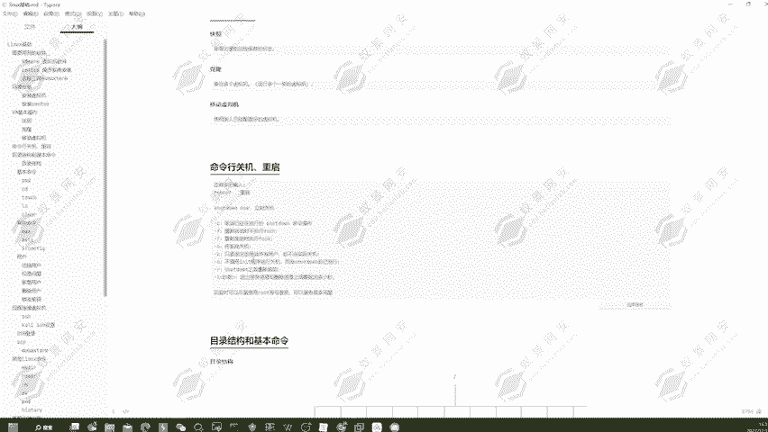

下蛋。杠H，然后我们定一个时间。比如说现在这里是23点38，那我就给它定义为23点39。可以看到它这边设置为23点39，然后会去进行关机。然后现在一个时间是23点38。09。

那它在这个39分的时候会去进行关机。那我们可以稍微等待一下，等待它的一个关机。然后如果说我在途中然后不想关机了，怎么办呢？我就可以使用到sha down杠C去进行一个取消。那现在我们等待几十秒钟。

然后等待它的一个关机啊。稍微等待一下，这里还有应该还有十0多秒钟的一个时间。可以看到它已经关机了，然后我们现在要对它去进行一个取消，我们就可以继续打开。然后我执行这条命令，我来看一下它还能不能关机。

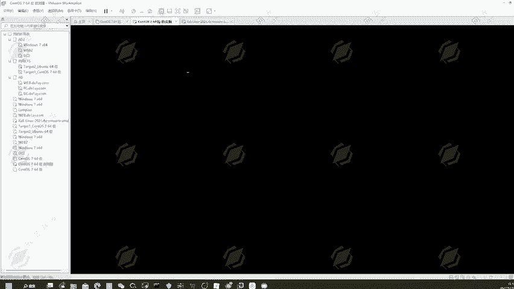

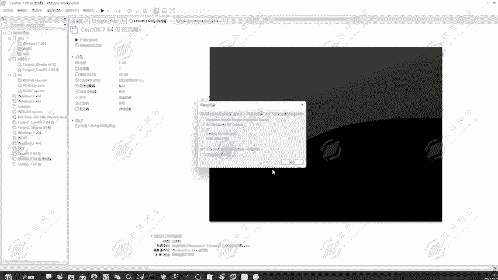

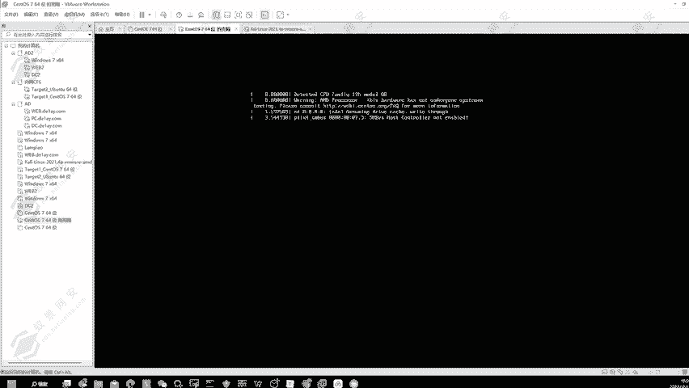

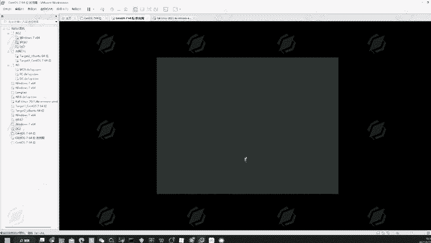

好的，等下它的一个启动哎。好，我再去进行一个登录。

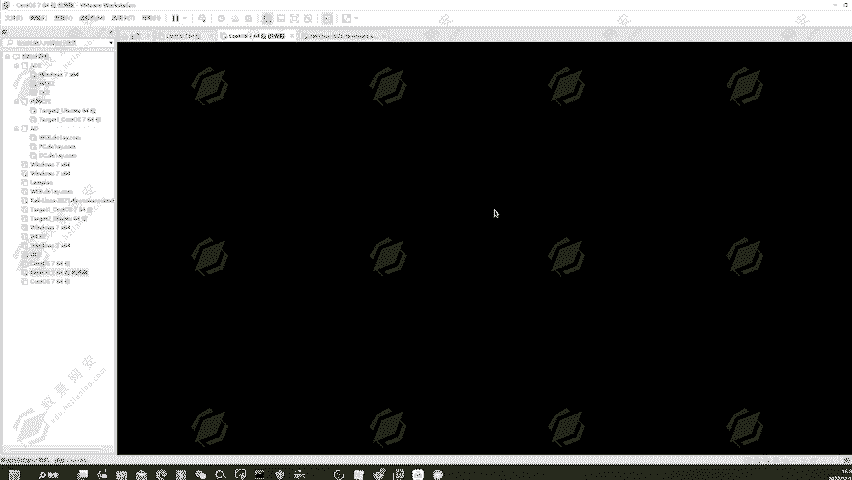

好的，那现在我们点击右击，然后打开一个终端。然后切换为入手用户。然后我们再执行下蛋。割H。23点41。好，我现在在这里执行刹车弹杠C，然后给它取消到这一个取消掉这一个关机，我给它取消掉了。

然后我们现在可以去继续的执行操作，可以看到它到41分的时候是不会关机的。然后我们也可以使用到杀车弹杠R的一个方式。嗯可以看到稍当嘎嘎的一个方式，就是重启。好，稍蛋。

杠R重启命令可以看到它在23点41点41会去进行重启的一个操作。那同样的我们也可以使用到杀毒蛋。杠C给它取消到重启的一个命令。我们可以给他去进行一个取消。然后。我们还可以使用到杠K的一个参数，就是只是。

送出信息给所有用户，但不会实际关机。也就是我们在对登录到我们系统的一个用户去发起警告，禁止他进行个登录。然后告诉他我这个系统马上就要重启了。可以看到现在已经41分了，我们并没有去进行一个关机。

可以看到它会发出对应的一个警告，但是它实际上是不会去进行一个重启的。我们可以稍微等待一下。这实是杀猪弹的一个命令的一个解析。可以看到实际实验的时候啊，可以尽量使用到root账户。

可以避免很多不必要的一个问题，还有出现的一些麻烦。所以说啊我们使用到root用户，可以避免我们出现很多不必要的一个问题啊。

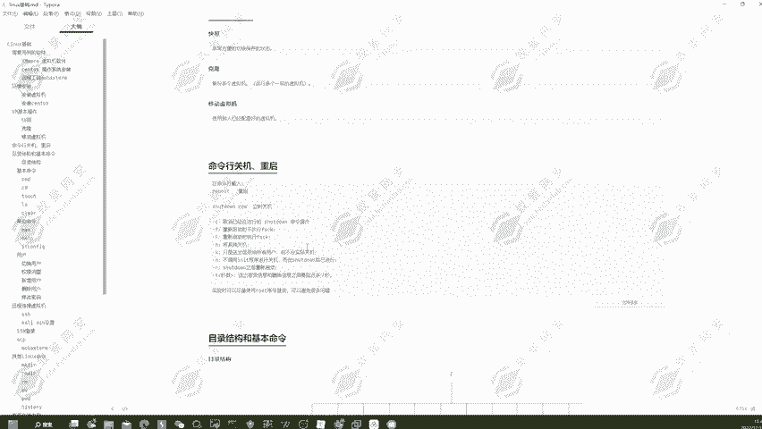

然后怎么去使用到root用户去进行登录呢？那这台我们先放到这里，我们使用到这台机器给大家演示怎么使用到root用户去进行一个登录。体验到42了，它还没有去进行一个重启。好，我们点击这一个域未列出。

然后输入用户名root。下一步密码，123456回车登录。可以看到，现在我们就是以root用户登录的这一台操作系统。

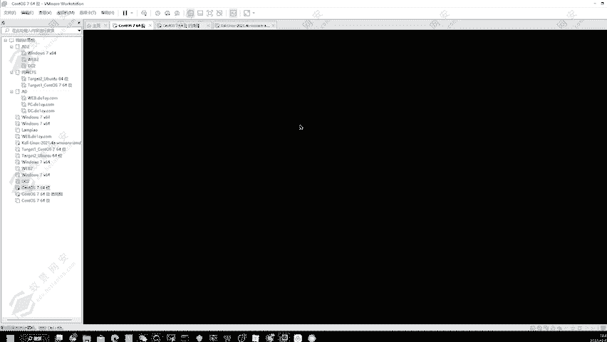

可以看到已经42分了，快43了，它这边还没有启动，还没有重启，证明我们刚才已经。我们刚才已经把它所有的一个重启的一个命令全部给注销掉了。好，可以看到这里就是root用户了。我们现在随便打开一个终端。

可以看到它的一个前缀就是root了。好了，那这一节课就到这里，我们下一课再就为大家去进行一个继续讲解。

