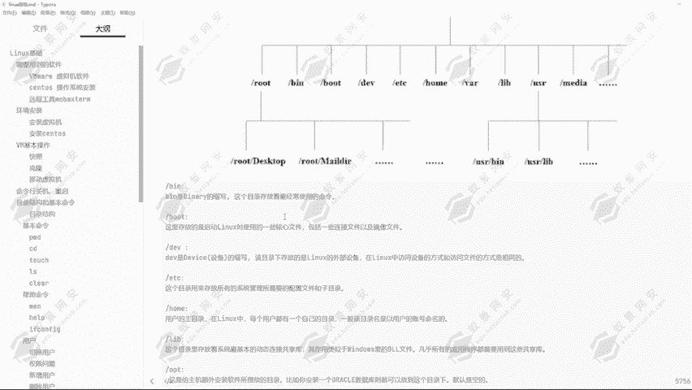
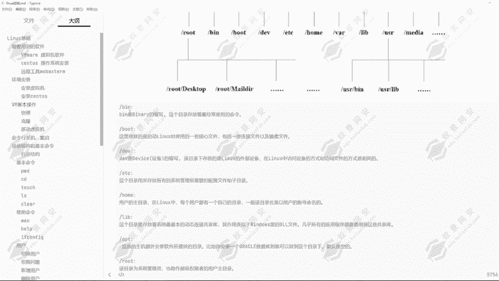
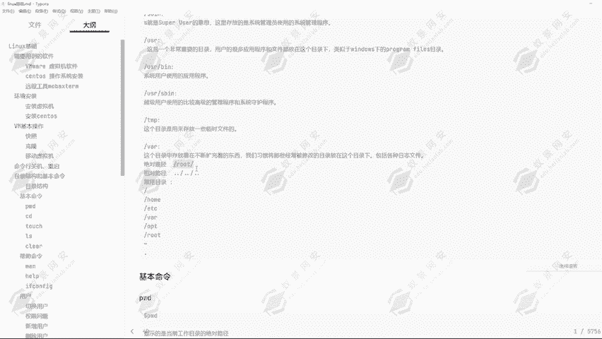
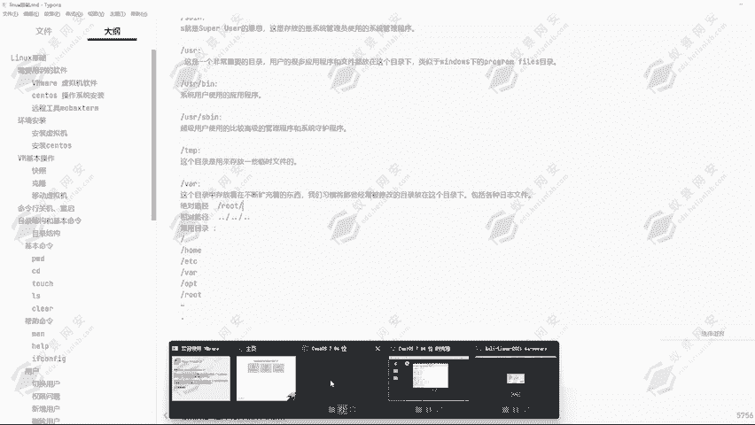
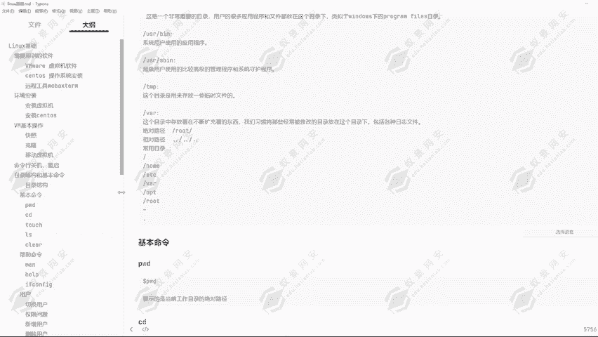

# 2024年最强Kali渗透教程／网络安全／kali破解／web安全／渗透测试／黑客教程 ／代码审计／DDoS攻击／漏洞挖掘／CTF - P11：5.linux目录结构 - 网络安全系统教学合集 - BV1Pe411C7Zb

好的，我们下面来看到这一个linux的目录结构和它的一个基本命令。首先我们来看到linux的一个目录结构啊，linux它是由一个根目录，然后再到多个二级目录，可以看到root目录。

这是root的一个加目录，然后还有B目录bo目录，还有DEVETC号目录和VR还有liUSR和MEDIIDIA的一个目录啊，其实还有很多的目录，只是没有一一的列举出来。然后在这一些目录下。

它分别又有它的一个子目录。比如说root目录下有一个桌面目录。然后这个root目录下还有一个叫做。MAL当然这个目录是自己创建的，也是存在的一些目录，然后还有其他的一些子目录，都是你自己可以创建。

还有它默认携带的。还有在USR目录下也有一个默认的目录叫做USRB，还有USR的1个LIB的目录。那这一些目录啊，我们可以看到它分别对应的都是不同的一个意思啊。比如说第一个B目录。

它是这一个的缩写这个目录存放着最经常使用到的一些命令，还有bo目录，这里存放的是linux是启动linux使用的一些核心文件，包括一些链接文件以及进线文件的。如果说这一个目录，然后出现的损坏。

就它里面的一些文件，或者说这个目录里面缺少了一些东西，那就会导致你无法启动linux机器。所以说啊这个目录下的一个。

应用或者说它的一些文件不要擅自的去进行一个修改。这个不录下是它的一些常用命令。如果说你删除一个对应的一些文件的话，可能会导致这个命令无法运行。然后还有DV目录，它是设备的一个目录啊。

可以看到是设备的一个缩写。该目录下存放的是linux的一个外部设备。在linux中访问设备的方式和访问文件的方式啊是相同的。因为在D系统里面一切皆为文件。

然后ETC目录这个目录是用来存放所有的系统管理所需要的配置文件和子目录，这里就是我们所有的一些配置文件存放的一个目录。当然你自己安装的一些文件或者说一些软件，可能它的一个配置文件不在这个目录下。

但是基本上linux启动默认的一些配置文件都在这个目录之下。然后ho目录用的用户的一个主目录，在linux中，每个用户都有一个记录自己的一个日志，一个目录。一般该目录名就是以用户的一个账号命名的。

比如说root它其实是一个用户，但是它不属于这个how目录。root它是属于一个单独的一个用户独立出来的，它有自己的一个根目录。然后我们创建的用户，比如说我创建的一页，那就是在这个号目录下。

等会带大家来去进行一个查看，还有另一部目录。这个目录里存放着系统最基本的一些动态链接共享库，其作用类似于windows里面的d文件，几乎所有的应用程序都需要用到这一些共享库啊。

因为我们在windows里面安装的一些软件，可能它会去寻找你本地机器的一些d文件。如果说没有这个文件，会导致这一个软件启动失败，或者说找不到对应的文件无法启动。然后这一个内部目录下的一些动态链接共享库。

也是这一个功能啊，就是我们安装的一些软件，或者说一些功能的时候，它会导致无法启动。然后OPT目录就是给主机额外安装软件所摆放的目录啊。比如说你安装了一个克数据库则可以放到这个目录下，默认它是空的。

比如说我们安装的mys克，还有安装的一些其他工具都可以放到这一个目录下。还有root目录，该目录为系统管理员，也称之为超级权限者的一个用户主目录。这就是和我们的一些普通用户的一个目录是相同的一个概念。

但是它是属于系统管理员的一个用户，一个目录，不存在于号目录下。我们普通用户存在于号目录下。然后SB目录。这里存放的是系统管理员使用的一些系统管理程序啊，也就是root用户使用到的一些程序。

然后U怎目录USR目录也是一个非常重要的目录。用户很多的应用程序和文件都放在这一个目录下，那类似于windows的一个。我们平常在windows里面默认安装文件的话，它都会存在C盘的这个目录下。

这个USR目录就相当于这个目录一样的，我们所安装的一些软件，它可能默认就会存在这一个目录下。然后USB目录B目录啊就是系统用户使用的一些应用程序存放的一个目录。我们安装的一些命令啊，一些指令啊。

去存放到这个目录。比如说我要安装一个my搜狗，那我可以放到这个目录。我要安装一个ipad7的MVN也可以安装到这个目录。那我安装的一个java，一个python，同样的也可以放到这一个目录。

这是超级用户所。可以看到超级用户使用的比较高级的管理程序和系统守护程序，还有TMP目录这个目录是用来存放一些临时文件的。而且这一个目录的权限是所有用户都可以去进行一个修改，或者说删除等。

任意用户的一个权限都可以在这里面去进行创建删除目录删除文件的一个操作。还有UVR目录VR目录啊，这目录存放的是在不断扩充着的一个东西。我们习惯将那些经常被修改的目录放在这个目录下。

包括各种日志文件基本上都是存在于。VR目录。然后我们来看一下，对于linux操作系统来说的话，这一些目录啊是从根目录开始给大家命名的那有根目录，那肯定是。可以从根目录起始，那这种就叫做绝对路径。

那如果说我不从根目录起始呢，我们来看一下，刚才给大家讲解过的号目录。我们首先给它切换到根目录。然后在公录下，我们可以看到有这一些目录结构。比如说B目录DV号目录，还有对应的root目录。

可以看到都是在这里面。然后OPE目录我们可以看到。它默认啊是没有的。但其实啊我们在安装一些应用程序的时候，它会生成一个目录。可看到这个目录也是空的。🤧。

然而root目录就是我们在使用到root用户的时候，然后创建的一些文件啊，创建的一些。文件或者说安装的一些程序，可能就存在在root目录下。然后号目录也就是我们创建的用户，我们可以看到CD到号目录下。

我们可以看到有一页这一个文件夹。那一页这个文件夹其实就是我们的一个用户叫做一页。导我们创建用户啊，就会默认存放在号目录下。这就是这对应的一些目录啊。然后我们可以看到这些目录下，我们要去进行一个进入的话。

可以看到有通过几种方式进入。比如说绝对路径，那绝对路径是什么意思呢？从对应的根目录开始算，这一种就叫做绝对路径。比如说我现在要去到root目录。

我现在是在ho目录下，可以看到我现在是在ho目录下，然后我要去到root目录，我直接CDroot能进去吗？很明显不进不能进去，为什么呢？因为当前目录下没有root这一个目录。

那我想要进入到root用户root目录应该有怎么去进行一个进入呢？那我们可以CD从根目录开始，因为我们的root用目录啊，它就是在根目录下的，所以说从根目录开始输入到根目录2号root回车。

我们现在就进入到了root目录。可以看到我们就接现在现在就进入到了root目录。那我现在又要进入到哈尔目录呢，那我们现在LS看一下有没有哈尔目录没有，那我应该怎么进入呢？

我们可以使用到相对路径的一个方式。比如说点点。我们可以看一下点点是什么意思啊，LS杠LLA我们可看到点点，它的意思就是上一级目录。那我们现在通过CD点点，我们来看一下我们会移动到哪里。

我们现在是在root目录下，然后我通过CD点点的一个方式回车。我们来看一下我是不是移动到了根目录，我是不是移动到了根目录啊，然后我们重新的进入到root目录，然后再通过点点杠。

那现在我的一个起始目录就是在how目录，然后是在那个根目录啊，不是how目录。然后现在我要进入到how目录，在这里输入的how回车可以看到我同样能够进入到how目录，这是为什么呢？

这就是对应的linux的一个叫做相对路径的一个东西。这就是对应的一个相对路径。相对路径用点或者说点点杠去进行一个表示。绝对路径通过根目录的一个方式去进行一个表示，这就是它的一个绝对路径和相对路径。

然后常用的目录啊，我们经常常用到的一个目录。比如说这一个根目录，比如说号目录。比如说ETC目录，还有VR就是查看日志的一个地方，EDC目录，我们配置文件的一个地方，还有OPE目录。

我们安装软件的一个地方，还有root目录，我们一般使用的一个权限，就是root权限。我们一般都是使用的root用户去进行一个操作。我们对应的一个操作系统的。还有这一个这一个就是对应的一个加布鲁。

可以看到我们使用到这条命令。然后我们可以看到我们现在到哪里了，是不是又到root目录了？这个就是我们对应的用户的加目录。好，然后对应的相对路径啊，我们现在就进入到how目录。进入到号目进入到一页。

可以看到，那现在我进入了两层目录，我不仅进入了how目录，我还进入了一页这一个目录。那现在我要去进入到root目录，我应该怎么办呢？点点杠代表的是上一级目录，上一级目录是什么目录啊，是不是号目录。

然后号目录能够进入到root目录吗？明显是不能的，为什么呢？因为how目录下没有root目录这一个文件夹。然后how目录上一级目录是什么啊？是不是根目录，那跟目录下有没有root这一个目录呢？

很明显是有的。那现在我在输入root，然后回车可以看到我又进入到了root用户，root的一个目录啊，那这就是对应的一个相对路径切换的一个方式？还有就是我们可以通过到这点点，我们回到根目录啊。

然后我们通过CD点杠的一个方式。先呢通过。斜杠它是一个绝对路径。那现在我进入到ho目录，我想要进入到页目录，但是我不想用通过绝对路径的一个方式，我想通过相对路径的一个方式怎么去进行一个切换呢？

我们可以通过CD点杠。一。可以看到我同样的进入到了一页的一个目录，这就是对应的一个相对路径切换的一个方式。点杠代表的是当前目录。可以看到CD点杠我并没有离开。点杠是当前目录，点点杠是上一层目录。

这就是对应的伊历克斯的一个相对路径和绝对路径的一个区别。好的，那这一节课的话我们就讲到这里。下一节课带大家来了解利的一些基本命令。

