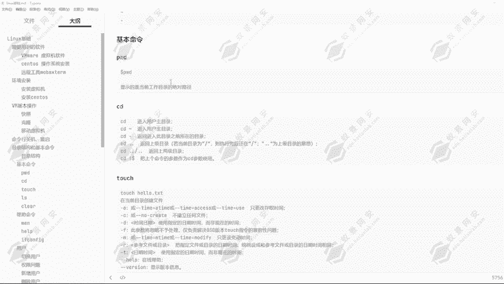
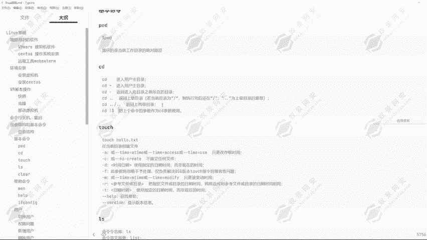
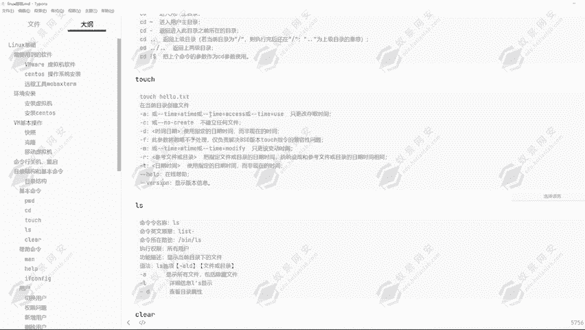
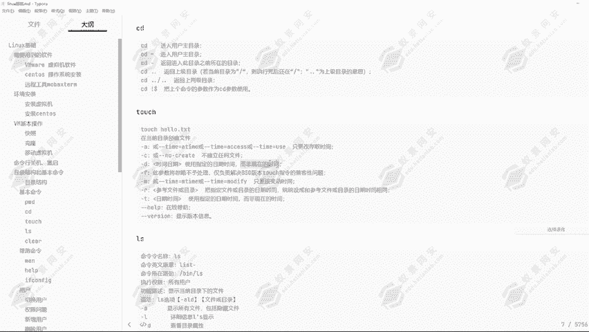
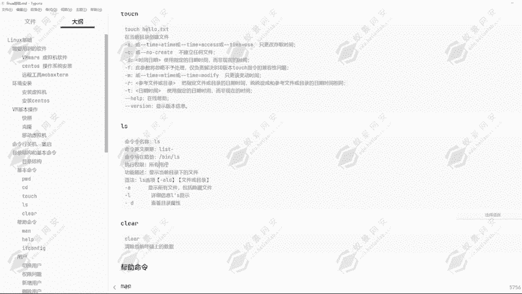
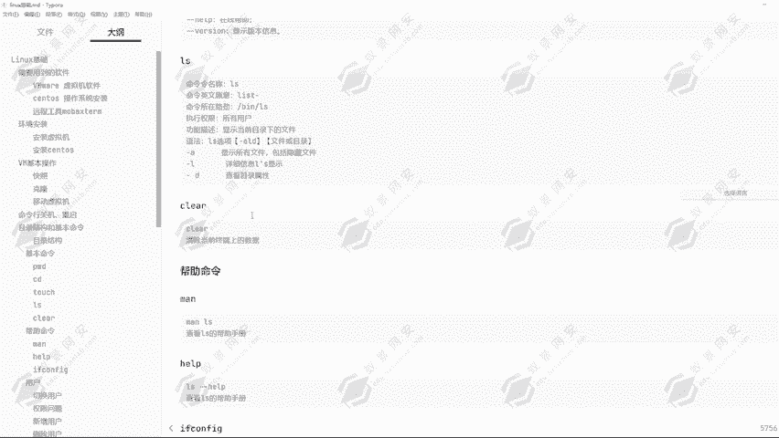
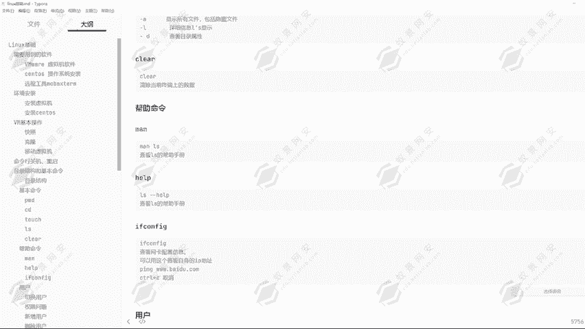

# 2024年最强Kali渗透教程／网络安全／kali破解／web安全／渗透测试／黑客教程 ／代码审计／DDoS攻击／漏洞挖掘／CTF - P12：6.linux基本命令 - 网络安全系统教学合集 - BV1Pe411C7Zb

好，我们来看到linux的一个基本命令，该怎么去进行使用。我们来看到第一条命令PWD命令显示的是当前工作的一个目录的绝对路径。那我们就可以使用到这条命令啊，查看到我现在在哪里，我现在是在哪个位置。

那可以看到啊，现在我这里是在哪个位置，大家能猜到吗？那猜不到怎么办呢？

我们可以使用到PWD命令去进行查看，可以看到我现在号目录的一页的桌面目录下。那现在我要想给它切换到一个root目录，我现在给它切换到root目录啊。然后我怎么知道我现在已经到root目录呢？

当然有同学说会说就是LS命令，我可以查看到当前目录下的一个文件来确定它在哪个目录。但是如果说我现在拿了不是我这台机器呢，我不知道这个目录下有哪些文件呢？我怎么确定我们可以通过PWD命令去进行一个确定啊。

通过PWD命令，我们就能够知道我现在在哪里，我现在是在root目录下，那现在我也要给它进入到。ETC目录。然后ETC的亚目目录，然后VAIS目录下。然后我进入到这个目录，我要去进行查看。

我就会通过PWD命令去进行查看我现在在哪里，在ETC的亚目目录，然后VAIS目录下。这就是PWD命令的一个使用方式，还有CD命令。那CD命令可以看到，通过CD不加任何参数。

它的意思是进入到用户的一个主目录，然后CD加上一个波浪号，然后它的意思是进入到用户的主目录啊。它们两个命令其实是一样的一个意思。我们可以看到，通过CD我们现在到哪里呢？是不是到root blue录了？

那我现在给它切换为一个入用户，我们现在给它切换为一页用户。好，然后我再通过CD的一个方式，我可以看到我在哪里呢？PWD。我现在是不是在hom的一页目录下？这就是它能够直接切换到你的一个用户的主目录。

也就是所谓的用户加布录像，通过CD不加任何参数，或者说CD。波浪号的一个方式可以看到我现在在哪里呀？是不是在rootam录像呢？就通过这种方式，我们可以植入到自己的一个用户主目录。

然要CD点点返回上一级目录。若当前目录为。跟目录的话，这执询完之后还是在跟目录点点为上级目录的意思啊，这也是我们刚才给大家讲解过的，上节课给大家讲解过的一个。相对路径使用的一个方式。然后CD点点杠点点。

它是它的意思就是返回上两级目录。因为我这里用了两个点点，两个点点的意思就是代表了两层目录，然后还有CD到道符，然后加上感叹号，把上个命令的参数作为CD参数使用。

然后tlk toch命令就是创建文件的一个命令。在我们想要去在虚拟机，或者说linkux机上面想要创建一个文件，那我应该怎么创建呢？我就可以通过现在我是在这一个。入ot不下，然后我现在创建一个文件。

创建文件叫什么？张三。点TST这个文件可以看到，刚才通过LISS只看到了一页点TST这一个文件。那现在我要创建一个叫做张三点TST一个文件，我就可以这样通过toch张三点TST回车。

A查看一下张三点TST这个文件就已经创建成功了。那这就是toch命令的一个方式啊。那torch命令它有很多的一个参数可以看到。他的意思啊就是在当前目录创建一个文件。

当然我们也可以使用到绝对路径的一个方式，对它去创建所有任意目录下的一个文件。比如说我想要创建一个。我想在业务下创建一个文件，就可以通过toch。然后ho。一页。

在他目录下创建一个叫做一页点TST的一个文件回车。那我现在CD到号目录，然后一页这个用户，然后下面可以看到是不是存在了一个一页点TST这个文件，那就证明了我们已经创建成功了。这是toch命令创建。

文件的一个作用啊，还有它有很多的一个参数啊，可以看到。通过杠A这个参数只更改存储时间，然后杠C的这个参数不建立任何文件，杠D的一个参数使用指定的日期时间，而非现在的一个时间。还有杠F的一个参数。

此参数将忽略不予存除列。

可以看到还有杠M杠R杠T杠help，还有杠版本信息的一个参数。那这里的话都是根据大家想要去达到一个效果。比如说我入侵到了目标的一个机器，然后我要生成一个木板文件。

那这个时候哈我就可以通过toch命令去修改它的一个时间，可以看到可以修改它的一个创建时间。

嗯。😊，然后还有L命令L命令啊，它的意思就是list list就是列出所就是列表的意思嘛。所以说啊它的一个功能就是显示当前目录下所谓的一个文件，然后直径的权限也是所有用户。

然后这些命令啊基本上都是存在并目录下的。然后它的一个语法我们可以看到，通过LL然后杠上我们所需要用到的一些选项参数。那这也选项参数的话，杠A杠L杠D，还有接上目录或者说文件名字。

那如果说我不接目录或者说不接文件名字呢，我们可以看到通过LS我现在不接任何的一个东西，它就会显示出来。它前目录下所有的一个文件或目录。那如果说我接一个参数呢？

杠A我们可以看到它隐藏的一个文件也会显示出来。那什么叫做隐藏文件呢？其实啊这前面加上了一个点的，它就叫做隐藏文件，不管是目录还是文件，只要加上了名字，前面加了一个点，它就是隐藏文件，我们通过LLS命令。

或者说我们直接在桌面上去进行一个查看是看不到的。我们现在可以CD到桌面目录给大家去演示一下。

好，我们现在进入了桌面目录，然后我创建一个文件叫做点一页。点TST这个文件。然后我们现在可以看到桌面目录下出现的一页点点一页点TST这个文件吗？并没有出现。但是我们可以看到通过LS也没有看到。

但是我们通过LS杠LA我们就可以看到点一页点TST文件已经出现在了这一个目录下。然后我们的桌面上面也是看不到的。所以啊这就是创建隐藏文件的一个方式。然后我们想要去查看到对应的一个文件，可以看到通过LS。

DS。杠LA我们就可以查看一下查看桌面下所有文件的一个详细属性，还有隐藏的一个文件。然后我要想要指定一个文件去进行查看呢，通过LS杠LA然后指定点。一页点TST，我来查看它的一个文件属性。

可以看到在1分09秒创建的，可以看到1分09秒，刚才是。1。091。09分啊，然后刚才是1点09分，现在是1点10分。好，这就是LS命令的一个使用啊。那我们来看到还有一个命令叫做CLE。

AR这条命令啊就是清除当前终端上的一个数据。可以看到我们现在桌面上有这么多的一个数据。那现在我要对它去进行一个清除，我就可以使用到这项命令。可以看到刚才我们输入的所有命令，还有显示的所有结果。

它就已经不存在了，被我们清除掉了。这是这项命令的一个作用。当显示终端上面显示的数据过多的时候，我不想看到就可以使用到CLEAR命令去进行一个清除。然后还有帮助命令。

可以看到卖命令卖LS就查看LS的一个帮助手册，通过卖LS查看LLS的一个帮助手册。然后在这里的话，我们可以通过回车键一行一行的查看，也可以通过空格键一页一页的去进行一个查看。

可以看到一页一页的去进行一个查看。

然后想要退出的话，我们随便按住一个键，按住按住Q键就可以退出了。我们按住Q键就能退出了。然后在每一个。命令它其实一般都带了一个帮助手册，就是叫做help帮助的意思。AOS杠杠help回车可以看到。

同样能够查看我们LS的一个帮助手册。然后我们也可以看到，还有一条命令可以查看到我们的一个网卡配置。通过Iif卡fi可以查看我们的一个网络配置。现在我这台机器它是什么IP地址啊，它是。

它的PIP地址是多少，还有它的网段是多少，我们就可以通过e付卡 fake去进行一个查看。可以看到我现在这台电脑它没有IP地址，这个ENS33就是我们初网的一个网卡。那这个网卡上面它没有任何的一个地址。

为什么呢？因为我现在还没有给他配网络，所以说没有对应的一个地址连接。嗯哼。然后这里是我对应的一个序拟网口的一个地址，叫做192。168。122。1。那等会儿我给它配置完网络之后。

这边就会出现1个IP地址。这是一con fake的作的一个作用，还可以查看到我这一个网卡的一个mark地址。可以看到。这也是伊坎 fake克这项命令的一个作用。好的，那我们的一个基本命令就讲到这里。

我们下节课给大家讲解用户的一个切换方式，还有对应的用户权限问题。

