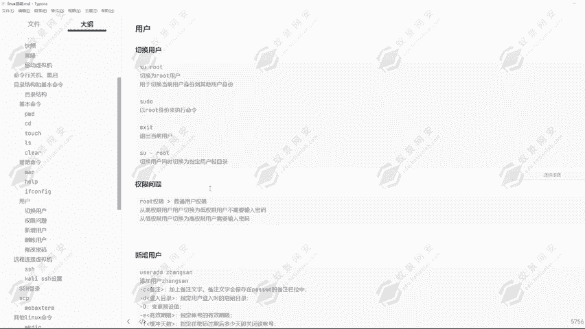
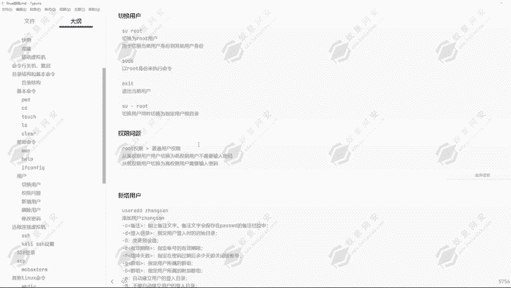
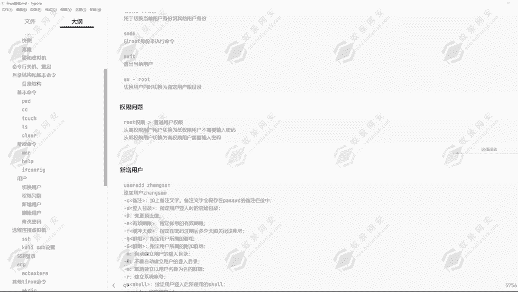
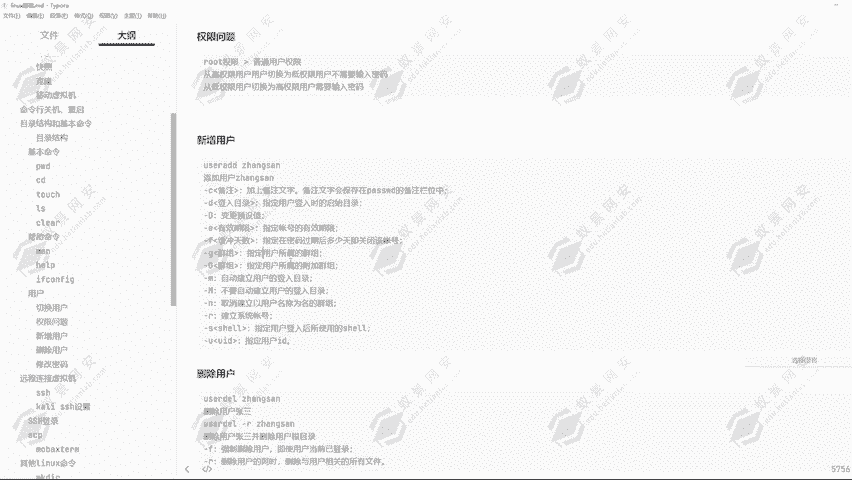
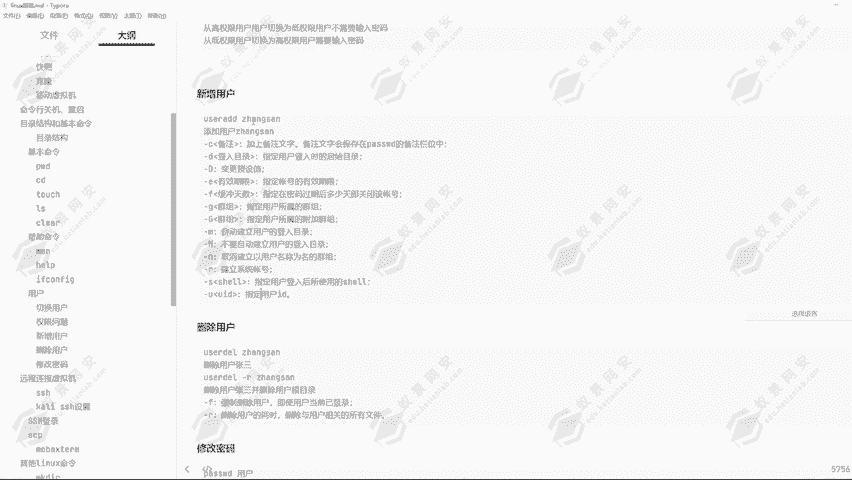
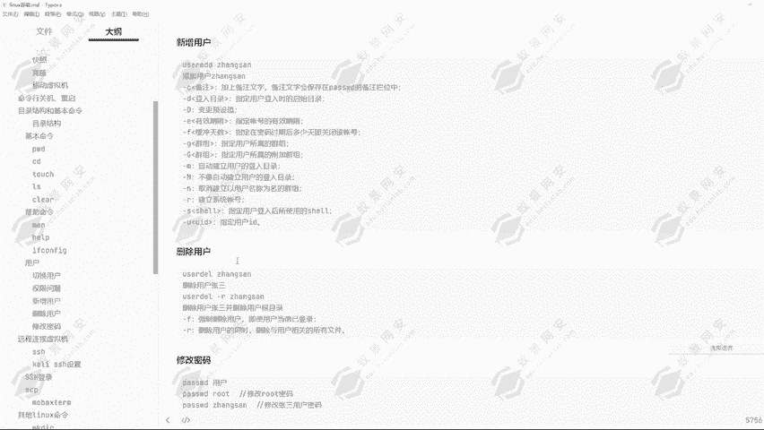
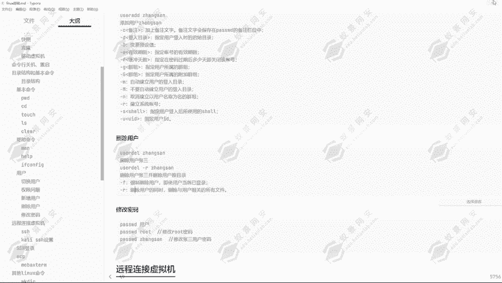
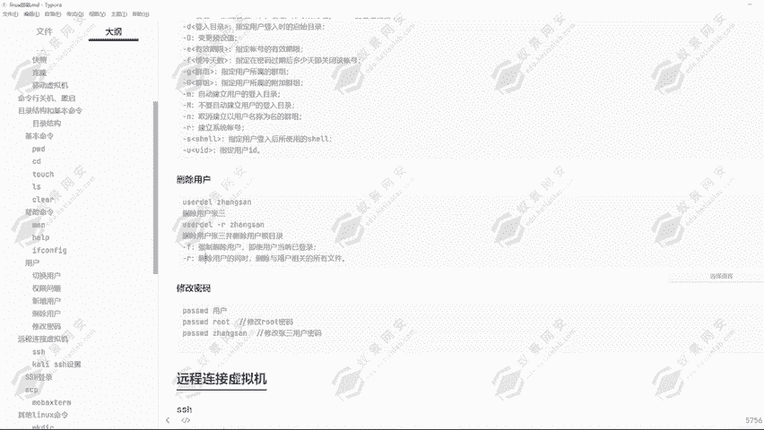
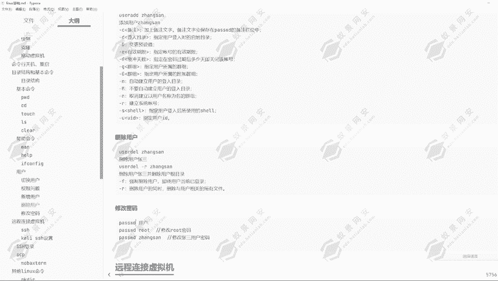

# 2024年最强Kali渗透教程／网络安全／kali破解／web安全／渗透测试／黑客教程 ／代码审计／DDoS攻击／漏洞挖掘／CTF - P13：7.linux用户操作 - 网络安全系统教学合集 - BV1Pe411C7Zb

好的，我们现在来看一下linux的一个用户问题啊。linux切换用户的一个方式啊，通过数命令去进行个切换。那刚才我们也是在前面几课给大家去做了一个演示，就是通过s命令切换到了一页用户。

那可以看到我们现在是root用户。我现在通过速命令切换为一页用户。好，切换为一页用户之后，我们可以看到现在这里的一个标签啊，从root改变为了一页。可以看到改变我的E页。

但是我们从E夜用户再切换为root用户呢，可以看到它要输入密码。但是我刚才从root用户切换为E夜用户需输入了密码吗？并没有。那这是为什么呢？其实就是对应的一个权限问题。

而可以看到我现在又切换为了root用户。然后我想要退出用户回到一夜用户呢？其实我是从一夜用户切换到的root用户。所以说我通过EXIT退出命令就可以退出到一夜用户了，可以看到我现在又变回了E夜用户。

但是由于我们这一个E夜用户又是从root用户切换过来的。所以说啊我在这里再输入EXI命令，我就可以切换为root用户。这里可能说大家有一点没搞清楚啊，这其实就是对应的一个权限问题。可以看到。

通过速命令可以切换为root用户，用来切换当前用户身份到其他用户身份的一个方式啊，还有通过速度的一个方式，以root用户身份来执行命令。那这里的话我们就可以看到，通过速度命令。

我们可以执行到我们一页用户无法执行的命令。比如说之前给大家去演示过的下 down命令。down命令，然后我们是无法直接通过杠S命令去运行的。但是现在我通过添加了一个速度。好，我现在还是给它关一下。

现在我是root用户啊，我千换为一页用户。好，我现在在这里要执行杀弹这条命令。杠也是。可以看到它这里会提示我输入到医院的一个密码，123456回车。好，他告诉我。

医院用户不在SUDOERS文件中这个速度命令啊其实就是依靠这个文件来去进行的一个。验用户其实我们普通用户啊就是用靠依靠的这一个速度文件，然后去进行的一个操作。可以看到E验用户也没有权限查看到这一个文件。

因为啊我们的一个验用户不在这一个文件中，那导致我们无法使用到速度这条命令。那如果说我们的医验用户在这个文档中呢，那我们就可以去使用到速度命令。那这里的话其实对于我们在使用的卡里操作系统的话。

一般的我们使用的卡卡里操作系统。他的一个开用户是默认有速度这条权限的，我们就可以执行对应的一些命令。但是我这里没有速度权限，所以说无法执行这条命令。它可以帮助我们以root身份来执行这条命令。

然后exXAT命令就是退出当前用户，然后通过速杠root切换用户同时切换为指定用户根目录。那这条命令我们可以看到现在我在哪里？

我现在在页的一个桌面目录像，那现在我要切换为root用户，然后同时切换到root目录像，应该怎么操作？通过输。一个斜杠，然后再root回车输入root的一个密码。

可以看到我现在在哪里PWD我现在就在root录下呢，通过这一个参数，一个斜杠的一个参数。我们通过一个杠的一个参数啊，我们可以切换到指定用户的一个指定目录。指定用户的一个跟目录啊，通过速干的一个方式。

然后这里就涉及到一个权限问题啊。因为刚才我们通过root用户切换到一页用户，我们不需要输入密码。但是我们从一页用户切换为root用户需要输入密码。那这里啊其实就是因为这个问题。

root用户他到普通用户权限。

root的权限切换为普通用户权限，它其实是大于普通用户权限的。从高权限用户。切换为低权限用户是不需要输入密码的，但是从低权限用户切换为高权限用户是需要输入密码的。

因为我们的root权限比我们一页用这一个用户的权限要大，所以说root用户切换为一夜用户不需要输入密码。但是一夜用户的权限比root用户比比root用户要低。所以说啊我们通过一夜用户切换为root用户。

是需要输入root密码才能够去进行一个切换。

然后这里新增用户，新增用户同样的肯定是只有入同用户拥有这个权限。那新增用户的一个方式啊，可以看到通过优载AD去进行一个创建。可以看到这里也有创建的一些选项参数。杠C加上备注文字，杠D登录目录。

指定用户登录时的一个起始目录，就是它的一个根目录。杠D变更预指预设值，还有杠一有效期限，指定账号的一个有效期限。杠F缓冲天数指定在密码过去后多少天即将关闭这个用户，也就是这个用户所存在的一个密码。

密码过期之后，它所能够存在的一个期限，还杠G就是指定它的一个组群。那这里的话其实就是涉及我们后续所讲到的用户组的一个问题。

然后还有杠S指定用户登录后使用的ex个shall，还有建立系统的一个账号，杠有指定用户的1个ID那这些啊我们后续都会去进行一个理解的。首先我们先来考虑一下该怎么去新增一个用户。

我们知道啊就是号目录，它是用来存复存放用户的一个根目录。那现在我在这里输入头用户，我通过优子ADD创建一个用户叫做张三。好，我把张三用户已经创建好了，那我们可以在ho目录去进行一个查看。

可以看到是不是多了一个张三。是不是多了一个张三，这个意思就是我们在创建用户的时候，同时创建了他的一个加目录。那现在这个账三这个用户就可以去进行一个登录了。然后同样的，我们可以去删除用户张三。

我们现在可以去继续登录张三这个用户了，通过速张三去进行一个登录，可以看到就登录到张三用户，然后ESI退出。然后我们想要删除这个用户呢，同样的通过user对。去进行一个删除。张三。好，我们删除掉了张三。

但是我们可以看一下张三的目录还在这里。那这是为什么？因为我们只是删除了张三这个用户，我们现在想要登录张三，我们可以看一下。可以看到没有张三这个目录这个用户了无法登录，但是张三的根目录又还在这里。

这是为什么呢？因为我们在删除用户的时候，没有删除它的一个根目录。可以看到，我们可以通过userDEL的一个方式去删除掉杠R去删除掉用户张三，同时删除它的一个用户跟目录杠F强制删除用户。

即使用户当前已经登录杠R删除用户同同时删除与用户相关的所有文件。

然后我们就可以通过优er。当然现在这个张三用户啊，他已经没有了。所以说啊我们通过这个方式啊，它会提示我张三用户已经不存在。所以说啊我们现在在这里又得重新的创建一个张三用户。然后我们再使用到优er。第二。

嘎R删除伤残。嗯。😊，可以看到张三的一个目录就已经不存在了。这是删除用户的一个操作啊，还有修改密码的一个方式。那修改密码的话，我们可以直接通过password去进行一个修改。但是这里啊我们一定要注意。

我现在是root用户，我要修改一夜用户的一个密码。新的密码123123可以看到已经更新成功，它这边虽然提示我无效的密码，密码少于8个字符，但是没有关系。因为我们是root用户，root用户。

你修改用户的密码是完全不用考虑到密码的一个复杂性的。你随便输入什么密码都是可以的，都是没有问题的。但是如果说我是一夜用户呢。可以看到我现在切换为一页。我只要输入可以看到切换为一页用户，然后我要更改密码。

我要更改谁的，我要更改root的。那大家可以想一下能不能行，不能行，可以看到只有跟用户才能指定用户名。那我要修改对应的一个密码，我应该怎么操作呢？其实啊我们在验用户想要修改密码。

就只能输入pasor的这一条命令。然后回车可以看到它会提示我当前的一个密码123。新的密码123456。无限的密码。可以看到它就会提示我无效的密码，然后我们也无法继续下一步。

那在这里我就必须输入8个字符。12345678，可以看到过于简单，还是无法去进行一个创建修改。所以说啊在我们这里。普通用户要修改密码，他要满足密码的一个复杂度。好的。

可以看到满足了对应的密码的一个复杂度，才可以去进行一个修改密码。但是root用户他要考虑到这一些吗？很明显他不需要考虑。可以到我现在切换为入程用户。然后我要去给。一用户改密码。

我需要输入它的一个初始密码吗？并不需要我直接给它改成123123可以看到就更改成功了。这就是root用户和普通用户修改密码的一个方式。普通用户只能够使用到pasword修改，不能指定用户名。

root用户能够指定用户名，而且不在意密码的一个复杂度。好，这就是用户的一个操作。那我们下节课告诉大家该怎么去远程连接到虚拟机，该怎么去进行一个远程连接SSH。

