# 2024年最强Kali渗透教程／网络安全／kali破解／web安全／渗透测试／黑客教程 ／代码审计／DDoS攻击／漏洞挖掘／CTF - P14：8.linux远程链接 - 网络安全系统教学合集 - BV1Pe411C7Zb

好的，同学们，下面我们来看到就是这个远程连接虚拟机。我们平时在去对虚拟机去进行操作的时候，每一次都需要打开到微末尔才能够去进行操作。但是当我们配置好这一个SSH之后啊，我们就可以通过远程的一个管理工具。

可以直接的远程连接去进行一个管理，可以方便我们的一个操作。而且这一个对于我们以后要购买的一个VPS来说的话，都是有很大的一个帮助的。所以说在这里我给大家去讲解到SSH的一个远程连接工具的一个使用。

还有尼克机器该怎么开启对应的一个远程连接，它的一个方式。好，可以看到。我们可以在自己的物理机上面输入到SSHroot，然后艾特IP地址。那这个IP地址啊，其实就是我们在上面讲到的一些常用命令。

这一个if confi的时候给大家讲解到的可以通过if confi查看到你网卡的1个IP地址，然后在这里填入去进行一个连接。下面我们就开始去进行一个操作。好，我们首先啊打开这个V的一个虚拟机。

然后打开到我们的一个s透S，在这里点击右击打开一个终端。那还记得我们上一节课所说到的吗？就是在我们操作对应的linux机器的时候，我们一定要注意啊，就是我们在使用到linux机器，一定在自己学习的时候。

一定需要使用到对应的一个root用户。切换为root用户再去进行操作。如果说没有切换为root用户，那我们ETC下的一些配置文件，我们是无法去进行更改的。所以说啊必须切换为root用户。

那在这里我们要用到一个编辑工具，也就是YIM。那这个YIM啊在我们后期课程会为大家去进行一个讲解。YM然后ETCSSHSSHD杠config就这个文件。然后在这个文件里面我们需要修改的一个点。

就是在这里我们可以找到。我们可以按上下左右键找到这1个PERMIT rootot login。yes，在这里它前面有一个井号键，意思就是注释。那现在我们不要对它注释。

因为我们要允许入线用户远程去进行一个登录，所以说给它去去掉，然后按住ESC键给它去取消，然后再按住shift，还有一个冒号键。在这里我们输入WQ回车WQ的意思就是保存，然后保存退出。

这样我们的一个SSH的一个配置文件就已经配置成功了。然后在这里啊，我们需要去用到一个东西叫做SYSTMCTL也就是系统服务的一个命令。然后在这里我们输入到STARTSSH去进行一个启动。好。

可以看到SSH没有对应的服务，那就SSHD。因为刚才我们修改的一个配置文件，是SSSD的一个配置文件。所以说在这里我们启动SSSD的一个服务。启动成功之后，我们可以通过一条命令叫做NETSTAT。

杠ANO去NOUTLP。去查看到我们的22号端口是不是已经开放连接了。我们这就可以看到在我的1个0。0。0。0上面，有1个22号端口已经开放在外面可以去进行一个连连接。这边我们已经开启了监听的一个状态。

可以看到。已经开启了监听状态。那这个时候我就可以去进行连接了。但是在我们连接的一个过程中啊，我们要注意到一点，我们需要用到一个远程工具，或者说用自己的一个windows机器。

那下面我们在这里打开1个CMT窗口。

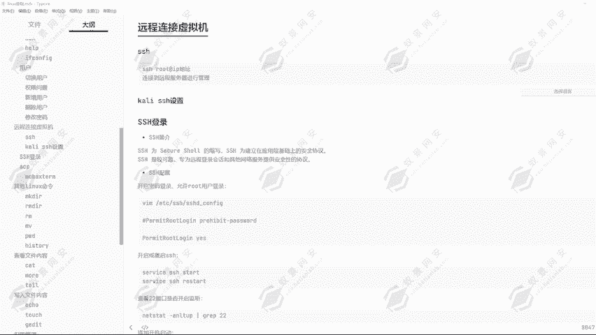

好，打开1个CMD窗口，然后我们在这里输入到SSH。Root。艾特那这里的1个IP地址啊，就是我们要在虚拟机里面去进行一个查看的。

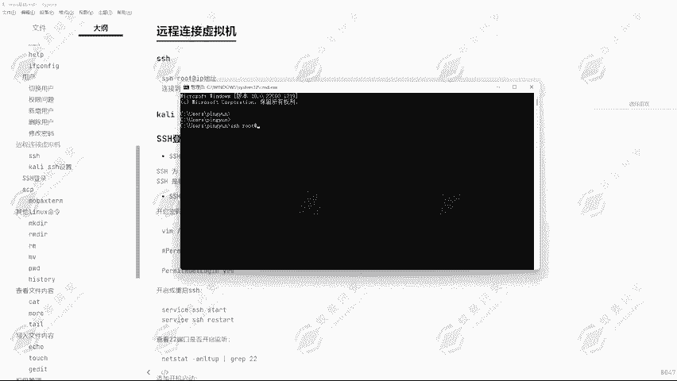

通过if confi去进行一个查看。嗯。他的IP地址啊，这一台机器它的IP地址没有去进行一个连接。那我们现在开启。然后开启连接之后，我们再来看一下对应的1个IP地址是多少。要求I。168。234。5。

好，下面我们是用到这个CMD窗口去进行一个连接。192。168。234。5。回车可以看到它会提示我输入到yes，然后密码密码是多少呢？123456回车。

可以看到我们现在就已经连接到了这个申通S7的一个终端。在这里我们输入L命令，输入PWD命令。可以看到我们都能够去显示出来，现在我们所在的位置，还有我们能够通过L命令得到它当前目录下所有的一个文件。

那怎么确定我们已经连接上去了呢？我们可以通过if fake查看一下我的1个IP地址是192。168。234。5。这样我们的1个SSH就已经配置成功了。但是这样的话，它的一个使用是非常不方便的。

所以说为了我们能够更好的去进行一个管理啊，我们可以使用到一个工具叫做。MOBAXTERM这个工具我们可以去进行一个远程管理。好的，下面我们打开这个工具。

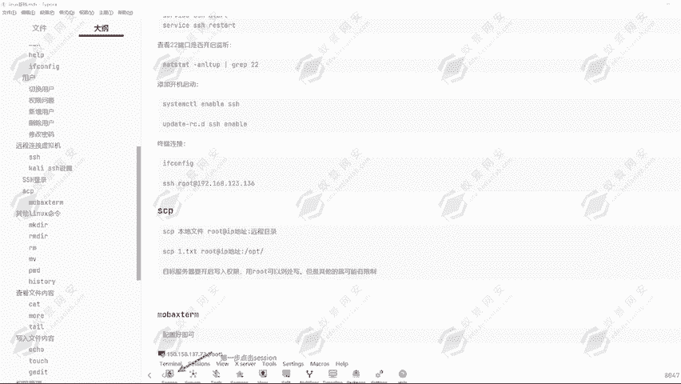

好，当我们打开这个工具的时候，我们可以看到，这是我这个工具上面原本连接到的一些服务器啊。那我们第一次使用的时候，它是没有这些东西的。我们点击sction。

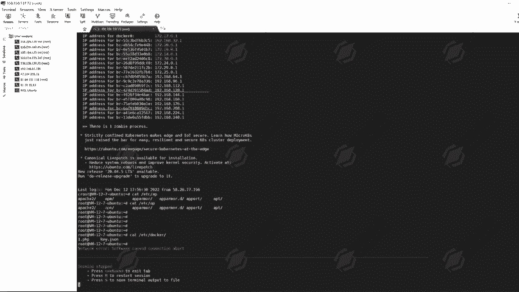

然后这里有个SSH，我们点击SSH那这里让我们输入一个hosthos的话就是目标机器的地址，192。168点S34。5。然后这里要我们指定一个用户名，那我们就指定为root。

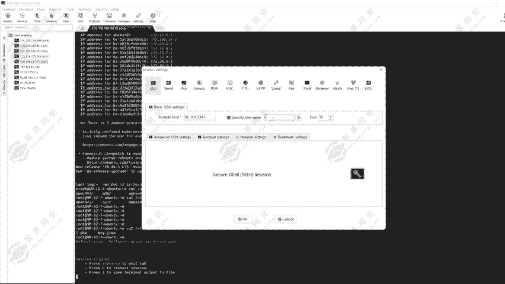

然后点击OK去进行一个连接。可以看到让我们输入密码，123456回车。点击y保存密码，可以看到我们就连接上去，可以去进行管理了。然后这里左边可以看到，就是我们这一个当前目录下所谓的一些文件。

那后续我们要上传文件，我们应该怎么操作呢？这里的话我就随便的选择一个文件，然后去进行一个上传。

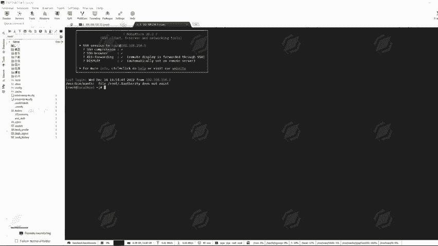

好，我就随便的找一个文件，找一个。嗯哼。😊，好，找一个图片文件，然后我现在给它上传进去。拖拽，然后点击可以看到这边正在上传这个1点PEGPG就已经上传成功了。那我们通过LS可以查看到。

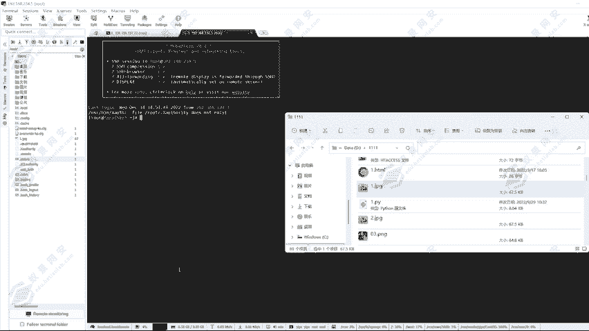

一点GPG就已经存在在这里了。这就是这一个工具的一个使用啊，可以方便我们去进行一个管理，而且可以直接的去进行一个上传下载，还可以复制粘贴，就可以方便我们不需要再打开到虚拟机就可以去进行一个管理了。

那当然还可以通过命令的一个方式去传输对应的一个文件。我们可以看到可以通过SCP的一个命令去传输本地的文件，然后到我们的一个汕透S7的一个机器里面去。比如说我现在要上传1个1点TST的一个文件。

那我就在一一目录下去上。

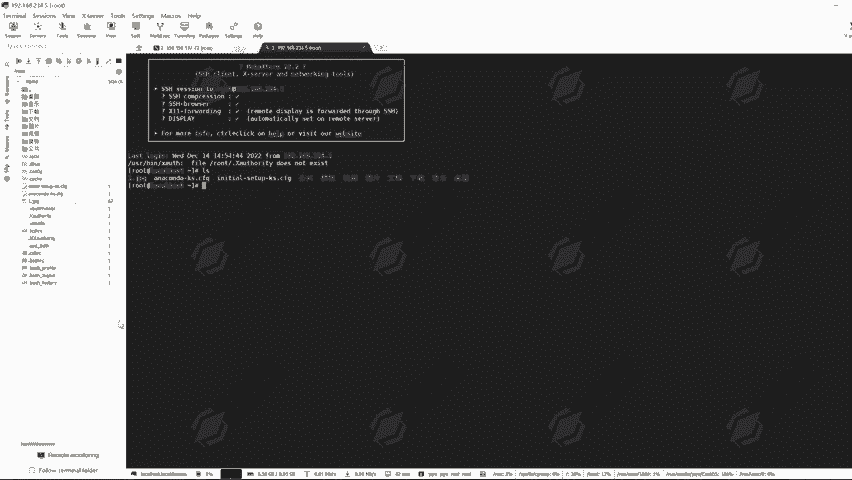

去创建1个1点TST的一个文件。好，稍等一下，我这里是出现了一个问题。我把我的一个病毒防护给开启了，导致我一些文件被删除掉了，问题不大。好，我们在这里创建一个。1点TST的一个文件1点TST的一个文件。

然后现在我要给它传输到我的一个listlinux机器上面去，我就在这里。

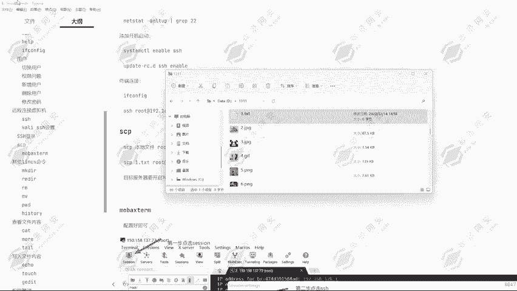

可以通过SCP的命令，然后本地的一点TST文件。然后我要上传到目标机械root艾。192。168。234。5。回车。哦，我要上传到它对应的一个。我要上传到他对应的目录里面去，可以看到。

还要给他选定对应的一个目录，但是目标服务器必须要开启对应的一个写入权限。OPT好，回车可以看到它要我输入对应的一个密码。那密码的话，123456回车可以看到已经传输成功了那现在我怎么去进行一个查看呢？

我就可以打开到我们那个虚拟机。

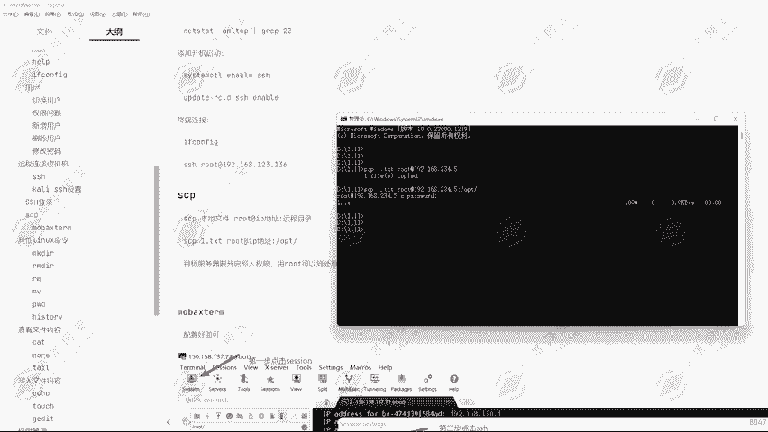

然后进入到我的一个。好，进入到我的一个根目录啊。🤧嗯。好，现在我们是在主文件夹下，然后我们要给它回到根目录。然后进入到OPT目录。可以看到1点TST这一个文件就已经写入成功了。

可以看到这个1点TST文件就已经写入成功了。但可能有些同学会说，就是我可能就是自己创建的1个1点TST文件，但是我们可以去进行一个写入内容。可以看到它现在这里面只有1个1点TST文件。

那现在我给它写入内容叫做一页666。然后去进行一个保存。然后给他改个名字，改成2点PHP2点TST我们来看一下。好的，现在我们重新的对它去进行一个传入啊。SCP。2点TST。然后root。艾特。192。

168。234。5，然后我们给他选定到OPT目录。回车。输入密码，123456回车可以看到就已经传输成功了。然后我们再次打开到这一个目录下，然后AOS看一下2。TST再查看一下它的内容。

可以看到EA666它就已经出现了。我们可以通过这种方式给预远端的一个服务器去传入对应的一些文件内容，去通过这种方式。好，这就是我们这节课的一个课程内容。可以看到通过SSH连接到远端服务器。

然后去进行一个操作，可以去进行一个上传文件，或者说下载文件，还有去执行对应的一些命令终端的一个命令，都是可以在这里去进行完成的。好的，那我们下节课为大家讲解其他的一些linux命令。比如说创建文件。

创建文件夹，还有删除和对应的一些其他命令。

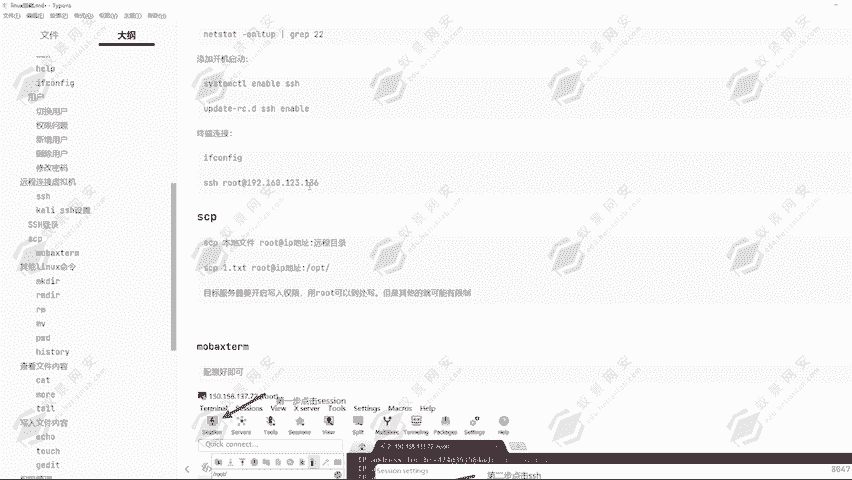