# 2024年最强Kali渗透教程／网络安全／kali破解／web安全／渗透测试／黑客教程 ／代码审计／DDoS攻击／漏洞挖掘／CTF - P15：9.Linux其他基本命令 - 网络安全系统教学合集 - BV1Pe411C7Zb

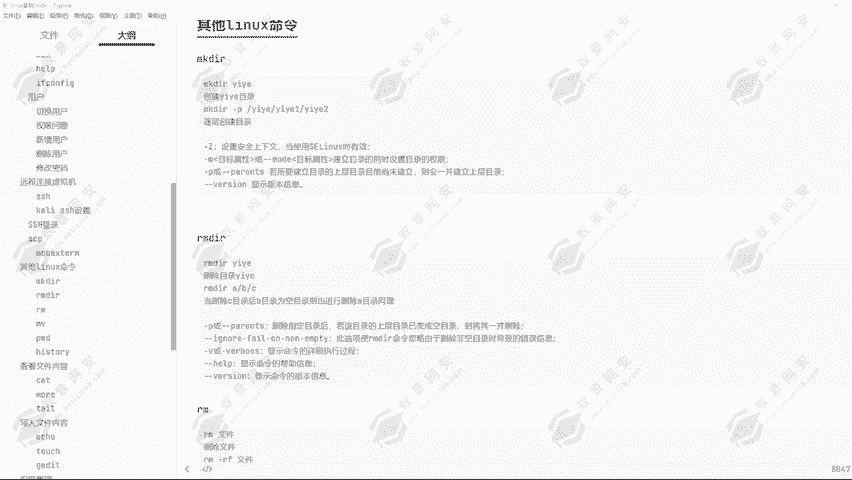

好的，在之前我们已经给大家讲过，就是创建文件的命令，但是创建文件它只能创建文件。但是我们要想创建目录应该怎么办呢？那这个时候啊我们就可以去来看一看一下这1个MKDIR。

它的一个作用就是能够帮助我们去创建对应的一个目录。比如说我要创建以用我名字为名的一个目录，就是一页目录，我就可以通过MKDIR去创建一页这一个目录。当然这一个功能肯定不止这一点。

我们可以去进行一个逐层的创建目录。也就是我现在想要去在EDC下创建一个一页目录。那一页下面我又想给它创建一个一页一的一个目录。那一页一目录下，我又可想给它创建一个一页1一页2的一个目录。

那这个时候的话我就可以使用到杠P的一个参数去进行逐层的去进行一个创建。然后可以通过杠Z的一个参数设置安全全上下文。当使用到SElinux的时候，就是有效的那现在我们使用到这个操作系统啊。

就是这一个那杠M就是指定目标的一个属性。或杠杠杠末的目标属性是一样的一个道理啊。建立目录的同时设置目录的一个权限，还有杠P就是逐层创建目录，还有杠V。EIN就是显示它的一个版本信息。

那下面我们就给大家去进行一个创建。

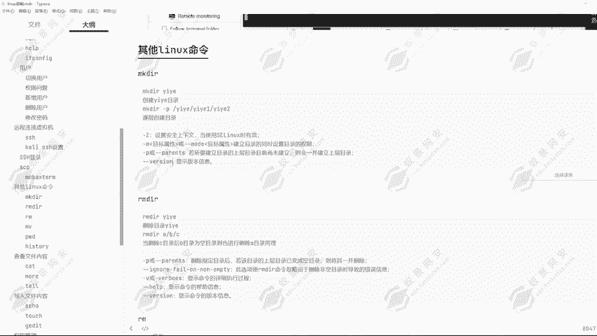

嗯，好的，现在我们在这里。我们现在是在OPT目录下，然后现在我想要创建一个目录，叫做一。通过MKDR创建。毕业这一个目录回车。可以看到它提示我权限不够，那这里又回答了我们之前的一个问题。

就是我们在去使用到linkux服务器的时候啊，要用root权限速度通过速root切换为root用户。好，下面我们通过MKDR去创建对应的一个一页这个目录。回车我们可以看到。

一页这个目录就已经存在在我们的一个根目录下了。我们就可以进入到一页这个部落。然后在一页这个部落，我又可以去创建到对应的一个文件。创建一个密码文件。可以看到密码文件就已经创建成功了。

但是现在我不想这样去进行创建，我想要一次性创建四五个目录，我应该怎么做呢？可以看到我们在这里通过MK点R。我现在已经创建好了一个E页目录。

但是我想在E页目录下创建一个E页1页一下创建1个E2E2下创建一个E3。那这个时候的话我就会使用到杠P这个参数。一页。一。Yeah。一3。嗯，好，我现在创建成功了。那现在可以看到。

在我当前目录下出现了一个一页一的一个目录。然后一页一目录下又有一个一页二的一个目录，一页二目录下又有一个一页三的一个目录。可以看到这就是MKDR创建目录的一个方式。让我们来看到IMDR。

也就是删除目录的一个方式。

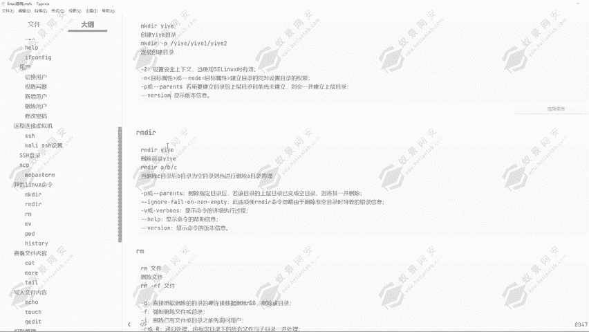

既然能够创建目录，那我肯定也能够删除目录。那删除目录应该怎么删除呢？我们就可以通过MRMDR去进行一个删除，可以看到。好，现在我们是再到我们现在给它退回到我们的一个根目录。那我们根目录下有一个一页目录。

那我现在对它去进行一个删除IMDRE页，那我能不能删除掉呢？可以看到删除失败失败，为什么呢？因为在一页目录下，它有一个一页一的一个目录。然后在一页一目录下，它又有一个一页2的一个目录。

因为在每一个目录下，它都有对应的一个文件，所以说啊它会导致删除失败。那我现在回到一页3目录，一页3目录下面有文件吗？没有，那这个时候我能不能删除呢？我们可以尝试一下IMDR一页3可以看到能够正常删除。

这是为什么呢？就是因为一页三目录下，它没有任何的文件，所以说我们可以直接的去进行一个删除，并不需要添加任何的一个参数。然后我们也可以通过IMDR去删除到我们的一个递归目录。

就是在我们同时想要删除到多个目录的时候，它就可以使用到这种方式，跟创建目录时使用的是一样的一个方式啊。

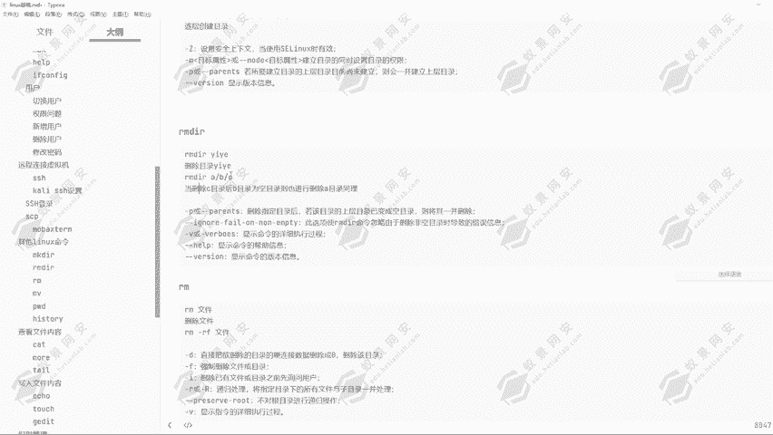

我们能够一次性创建主层目录12112123，但是我们也可以通过IMDR同时删除掉1111221233个目录。

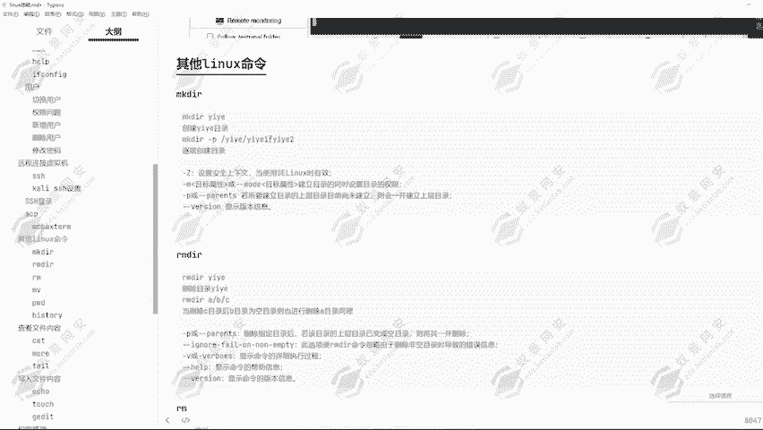

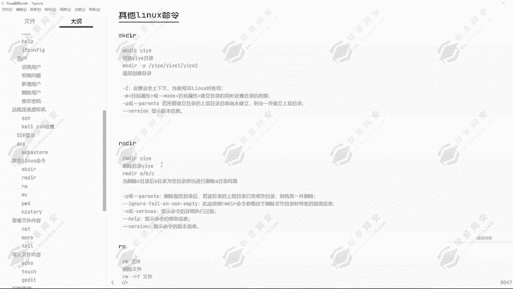

当然肯定是要目录为空的一个情况。可呢使用到刚P的一个参数啊。然后刚唯一的一个参数啊同样是显示版本信息啊。那下面我们就来去进行一个删除，我们回到登目录。

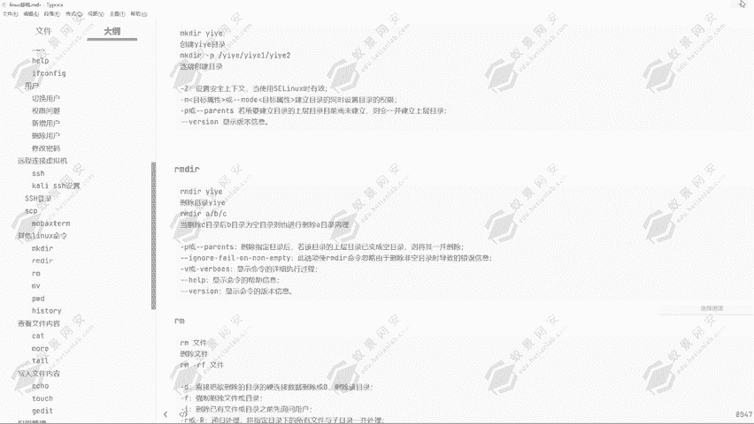

使用到MDR去杠P的一个参数去进行逐层的删除。一。野一野回车。好的，它这边提示我一页目录删除失败，为什么呢？我们可以看到一页目录下它有1个E码的1个TST文件，所以说导致它删除失败了。

但是一页目录下的一个E页一，它已经删除成功了吗？已经删除成功了。E2呢肯定也是已经被删除了。那如果说我们的这里面没有为空的话，我把这一个命把这一个文件给它删除掉。然后我再去使用到这条命令去进行删除。

它就能够正常的去进行删除了。好，这样我们的一个一页目录就已经删除成功了。这就是RIMDIR的一个命令，然后还有IM命令删除文件，可以看到通过IM。选定对应的一个文件去进行删除。那这里的话。

刚才那个密码文件我也给大家演示了，就通过IM能够直接删除对应的一个文件内容。能够直接删除对应的一个文件，然后通过IM杠FIM杠F的意思啊，可以看到。杠RDV处理将指定目录下的所有文件与子目录一并删除。

所以说啊我们只要使用到IM杠R的一个参数，不管它是目录还是文件，都可以去进行一个强制的全部删除。杠F就强制删除文件或目录。

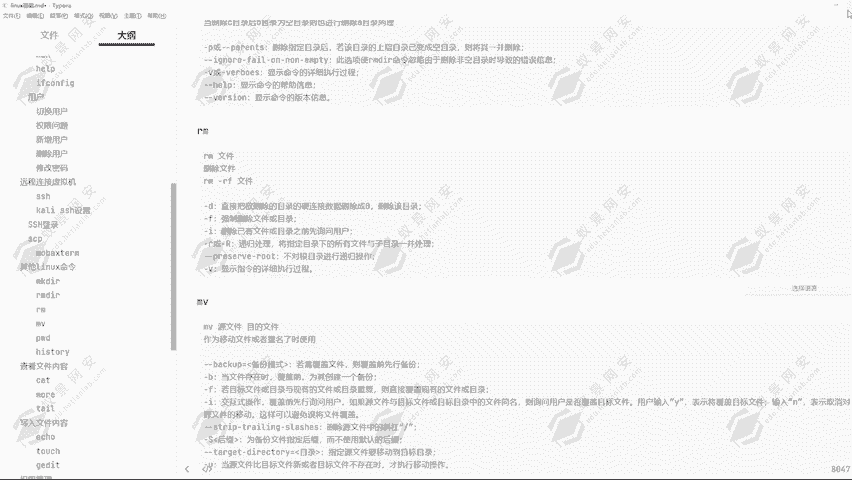

好，下面给大家演示一下。同样的我通过这一个方式创建一个逐层目录。MK点。杠P创建一个一页。一页一。一页2好，然后我们进入到一页一。给他创建一个文件嗯。一点TST，然后我再进入到12。给它创建一个文件。

就做2点TST。那现在我们给他切换到。一页目录，我再给他创建一个文件，叫做一页。点TST然后现在我要去进行一个删除IM命令肯定是能够直接删除对应的文件的。但是我想要删除目录呢。

这个时候的话我就可以使用到IM。杠IF通过IM杠F这一条命令，我们可以把一页目录下所有的一个文件，所有的一个目录全部删除。可以看到。一页这个目录就已经全部没有了。

他也不会去进行一个询问这里面的一些文件是否去进行删除，它就会直接的全部去进行删除啊。所以说我们一定要注意到IM杠IF星号斜杠7号这条命令我们不要去进行一个运行。因为这一条命令运行完成之后。

它的意思就是把根目录下所谓的一个内容全部删除。这一条是我们不允许去进行一个执行的。不管你是做什么的，不管是你是做运维还是做安全的，我们在入侵到对应端的一个服务器之后，不允许执行这一条命令。

会导致它的系统崩溃。这是M命令的一个作用。

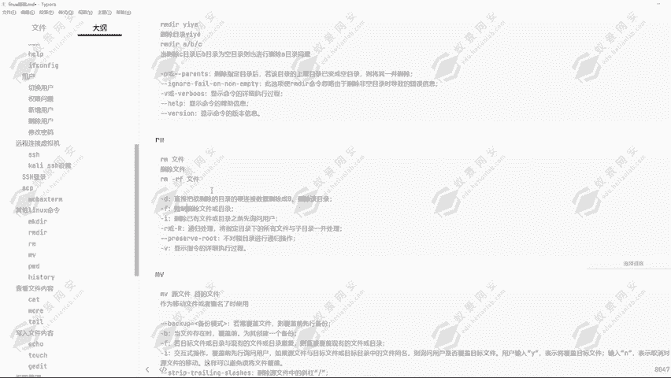

那我们来看到对应的1个MV命令。MV命令我们一般是用来做重命名的一个操作，它就相当于我们在windows操作系统里面的一个剪切。剪切命令能够把我们的一个文件去进行一个复制，然后去在同时销毁这个文件。

同时销毁这个文件，然后移动到指定的一个目录啊，也就是剪切版剪切的一个意思。通过这个命令，我们可以去进行一个重命名。好了，下面给大家去进行一个演示。好，在这里我要创建一个文件叫做嗯。一页点TST这个文件。

然后现在我在这个目录下已经有一个一页点TST文件了。那我可以通过一条命令叫做CP命令，通过一页点TSE给它移动到OBD目录下。回车。可以看到当我当前目录下有一页点TSD这个文件。

然后在我的OPT目录下也有一页点EXE这一个文件。但是现在我不允许我的一个根目录下，有一页点TST这个文件，我想给它直接的移动到其他的一个地方。那这个时候我就可以使用到。MV mini。

那同时我要想给他改个名字，我要改改成什么名字呢？然后我们给它移动到TMP幕下，同样的我想给它去进行一个更改名字的一个操作。我给它改成对应的一页666点TST。回车，那下面我们可以看到。

一页点TST这个文件已经不存在了。然后我们进入到tap目录。可以看到这边就会出现一个叫做E页66点点TST啊，刚才小少打了一个6啊，就是E页66点TST这个文件就已经存在了，这就是MV命令的一个作用。

我们可以用它去更改名字。比如说在这里我们输入的一页66点TST改名为一夜点TST。可以看到文件并没有移动，但是它的名字已经去进行了一个更改。这就是MV mini令我们日常使用到的一个操作。

当然它有很多的一些指念啊，可以看到很多的一些参数，我们可以去进行一选择。

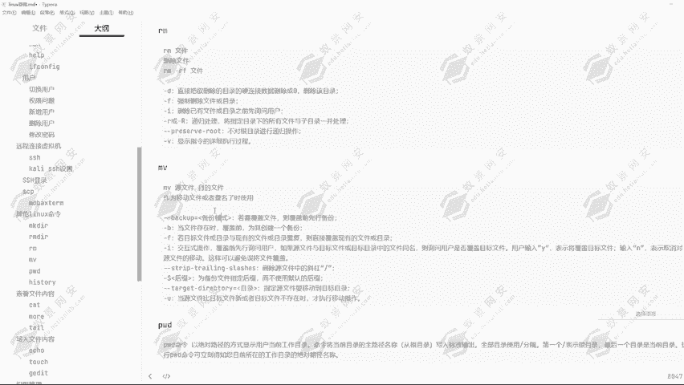

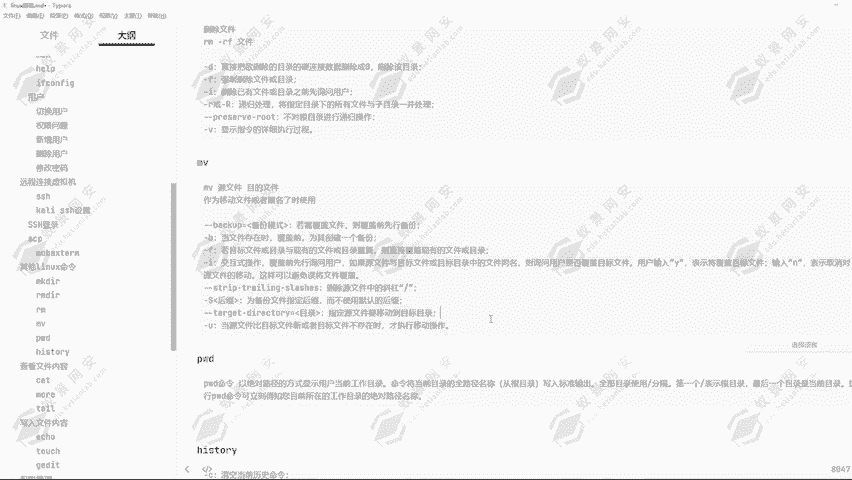

PWD命令显示当前所在的路径，还有这1个HISTORY命令就是显示我们当前的一个历史命令。可以看到它杠C的一个参数清空当前历史命令，杠A的参数将一些历史命令缓冲区中命令写入历史命令文件中。

那杠R将历史命令文件中的命令读入当前历史命令缓冲区，还有杠W将当前历史命令缓冲区命令写入历史命令文件中。好的，其实啊这些参数，我们不经常使用的。我们只要是用来它看我们之前输入的一些命令。

通过这条命令我们就可以看到，在之前我们运行过的一些命令有哪一些？可以看到在这里面我们就可以详细的看到。

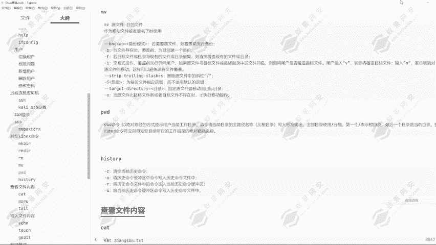

这就是这一条命令的一个作用。可以看到我们在以前输入的一些历史命令。这个在我们做应急排查的时候，也是有一定的一个重要性的。因为别人入侵之后，可能没有清楚我们的一个历史操作命令。

那这个时候我们就能够知道他在我们电脑上面做了什么，运行了哪些命令，操作了哪些手段。好的，这是我们的一些其他命令的一个讲解。那下节课我们为大家讲解对应的一个。查看文件内容的一个方式。

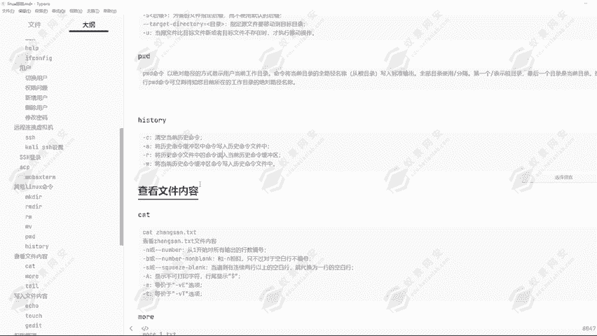

好的，那我们这课就到这里。