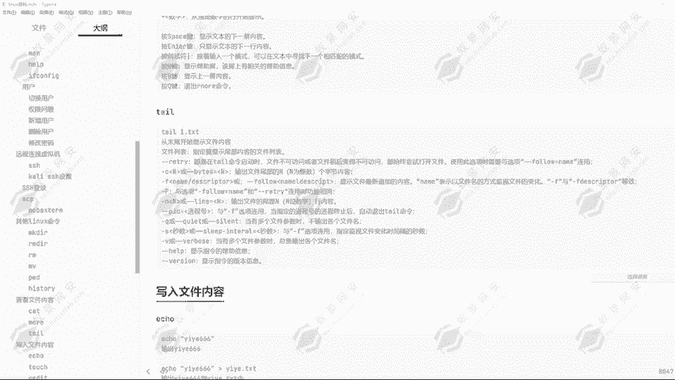
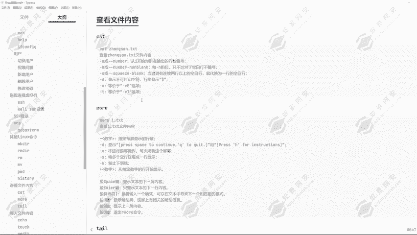
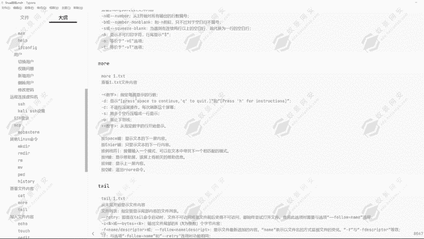
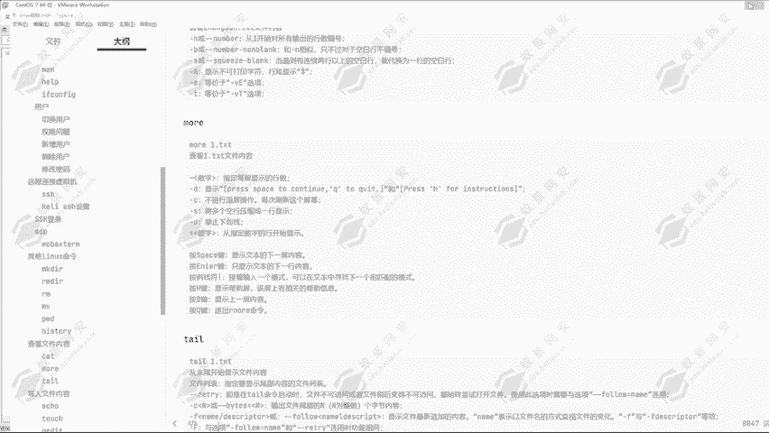
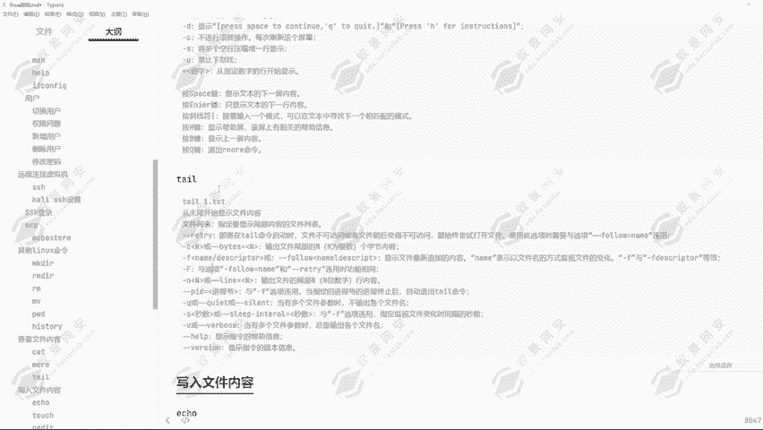
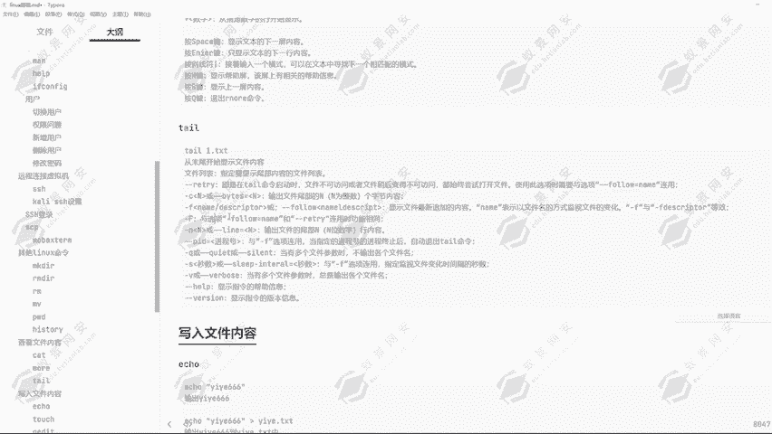
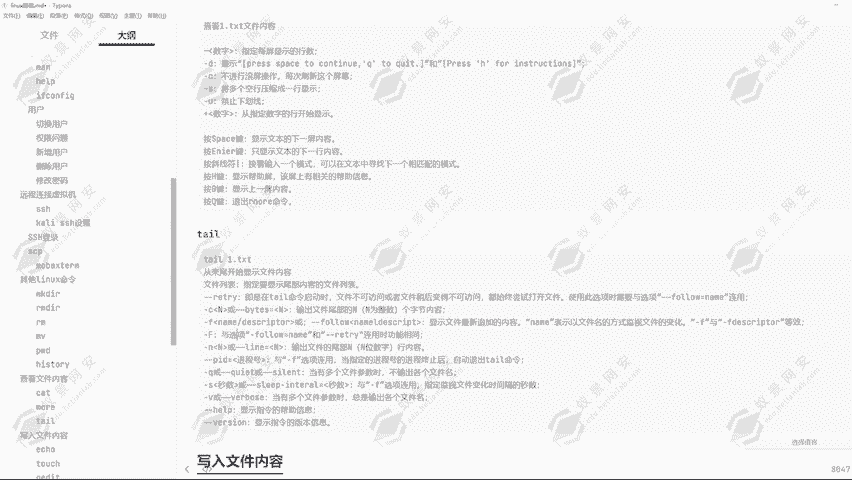

# 2024年最强Kali渗透教程／网络安全／kali破解／web安全／渗透测试／黑客教程 ／代码审计／DDoS攻击／漏洞挖掘／CTF - P16：10.查看文件内容命令 - 网络安全系统教学合集 - BV1Pe411C7Zb

好的，同学们这一节课给大家来讲解查看文件内容的一些命令。比如说第一个ca命令。那这一个ca命令啊能够帮助我们去查看到指定文件的一个文件内容。那这个时候我们也可以使用到对应的杠的一个参数。

比如说言的一个参数，从第一行开始就是去进行一个编号。然后对每一行去进行一个编号并输出对应的一个行号。如果说我们的一个文件内容过多的话。

我们就可以使用到这个参数来帮我们分辨我们现在看到的是哪一行的一个数据，它就会去进行一个显示。可以看到这也是多余的一些参数的一个使用方式，那大家可以自行的去进行一个了解。那可以看到在我们的1个O目录下。

我创建的一个一页点TSD的一个文件。那这个文件里面的一个文件内容，我怎么查看呢？我就可以使用到cat一页点TSD去进行查看，那现在查看它有两行数据，那现在只有两行嘛。

所以说我们能够去很方便的看到能够分清楚。那如果说文件内容过多呢？我应该怎么去进行查看。我就可以使用到cat大言的一个参数，然后再输入到一页点TST可以看到它就会去把它标上行号来去进行一个显示。

而且开命令它是能够支持到对应的一个。绝对路径和相对路径去进行查看的一个方式啊，可以看到通过caOPDE页点TST这个文件内容，我们就可以去进行一个显示了。然后相对路径通过点杠OPD。好，现在我是在。

root目录。所以说啊我要通过点点杠OPT，然后一页点TST这一个文件，然后去进行查看它的一个内容。那这就是cat查看文件内容的一个方法。然后我们来看一下第二个参数，第二个命令就是这个MOIE。

它同样能够帮助我们去查看文件内容。那为什么呢？有了ca，我还要学这个MREMORE啊这条命令其实很简单，ca我们如果说查看到的一个内容过多，我们现在给大家去演示一下，查看一个对应的日志文件。

那日志文件它显示内容过多，那怎么办呢？可以看到它的内容有这么多，那我要怎么才能够去区分出来，怎么才能够去查看到我想要查看到的一个东西呢？这个时候的话我们就可以使用到MO。MR一，然后查看到这个文件。

VMSS好，我们要查看这个文件内容，回车可以看到它就会去。每一页每一页的显示到我们的个屏幕上，可以看到我们执行命令在这里，然后它显示的内容就在这里。那我们想要查看到下一页的一个内容呢。

回车可以看到它就会帮我们翻页的一个形式显示在我们的屏幕上。然后再按回车，可以看到它又翻了一页，再按回车，它又翻了一页，再按回车，它又翻了一页，但是翻页显示，我怕我看不太清楚。然后我想要去更好的看清。

应该怎么办呢？我就每一行的输出显示，回车键可以看到它会一行一行的显示在我们的屏幕上。这就是这1个MIE的一个命令，可以帮助我们更好的去处理到对应的文件内容的一个结果。我们可以去更好的查看，可以看到。

也可以通过杠数字的一个方式指定每屏显示的一个函数，就是这一屏幕它会去显示的时候，它是按照满屏去进行显示的那我怕我自己看不明白怎么办呢？我就可以在这里添加一个。

我就可以在这里添加杠。可以添加杠数字的一个方式，然后去显示指定的一个行号杠8可以看到它每一个就只显示八行的1234。

5678它就会只示显示八行，然后回车它也只会八行八行的去翻。这就是这一个命令的一个作用。然后我们来看一下第三条命令，也就是TAIL命令TAIL命令是从文件末尾开始显示文件内容。

好，我们现在在这里去进行修改，我们改成这一个。TV。哎呀从文件末末尾开始显示，可以看到它就是从最文件最后的一个内容开始显示对应的一个内容。从文件最后开始显示对应的一个内容啊。刚才的k还有MOIE。

它都是从文件头开始显示，从文件初始开始显示文件内容。那我们要去审查自己的一个日志的时候，我们肯定要看到报错的日志在哪里。那肯定是报错了，我才会去进行一个检查。所以说啊前面没有报错的信息，我想看吗？

很明显我不想看，所以说啊我就可以通过这条命令去排查文件最后日志文件最后出现的一些日志内容，就可以通过这条命令去进行一个查看。嗯。但是它这条命令有一个问题啊。

也就是默认通过TAIL命令只能查看到文件末尾的十行，默认是十行啊。那我想要显示更多的一个行数怎么办呢？我们就可以通过TIL，然后杠M。加。20行就一次显示30行。可以看到它就会显示30行的一个数据。

通过在这里我们要加多少行，它就会多显示多少行的一个数据。当然它有很多其他的一个参数啊，比如说杠C。输出文件末尾的连个字节内容，也就是输出对应的一些字符串。它文件末尾的一个内容啊。

可以看到DEVSDAL那我们就可以通过杠C的一个参数。我们显示30个，然后我们看到它能够显示到多少啊。可以看到它就只能显示这么几个字符串出来，这就是后续的30位字符。通过杠C的一个参数。

然后去进行一个显示。当然它还有其他的一些选项。那这里的话大家可以在课后自己的去进行一个了解。然后在下节课我会为大家讲解写入文件内容的一个方式。

