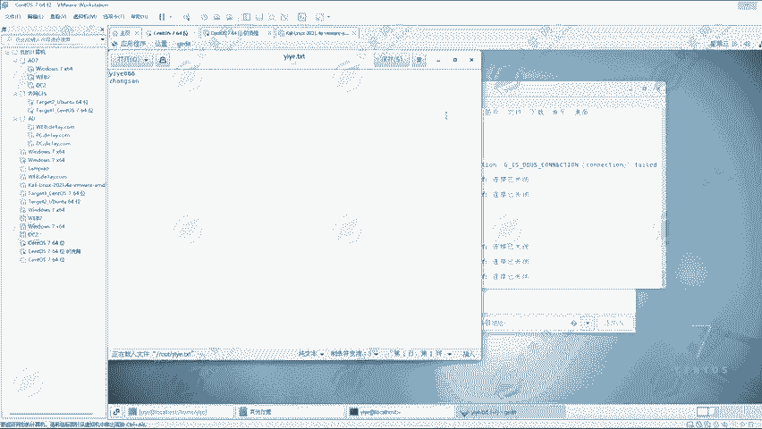
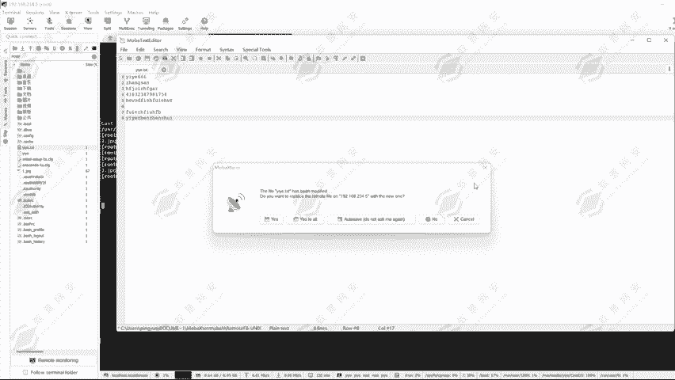
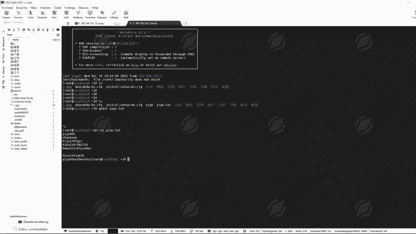
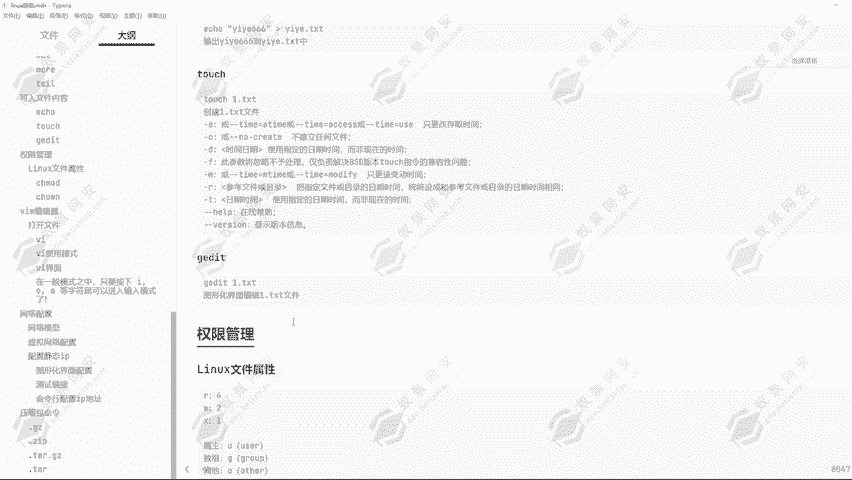

# 2024年最强Kali渗透教程／网络安全／kali破解／web安全／渗透测试／黑客教程 ／代码审计／DDoS攻击／漏洞挖掘／CTF - P17：11.写入文件内容 - 网络安全系统教学合集 - BV1Pe411C7Zb

好，同学们这一节课给大家讲解写入文件的一些命令，写入文章内文件内容的一些命令。比如说第一个echo echo啊，它可以把指定的一个周串打印到我们的屏幕中去进行一个显示。

但是同时它也可以支持我们把指定内容写入到指定的文件中去。如果说文件不存在，它同样的也是可以帮助我们去创建这一个文件，这就是ele命令的一个作用啊。下面给大家去进行一个演示啊。

可以看到这里我们是使用到的iccho命令，然后输入E页。666。可以看到，通过ic命令打印E页666，在下方的一个显示栏中，它就会显示出来E页666的一个字符串。这是我们这条命令的一个作用。

然后我们可以看到。下面我们可以用到这一个重定像符，然后把我们想要打印的内容给它输入到对应的一个文件中去。这里的一个重定方重定像符啊，也就是一个监控哈，它有一个作用，我们来给大家演示一下，通过ECHO。

一夜666。给它重定向到一页点TST文件中，可以看到这是目录下面生成了一个一页点TST的一个文件。可以看到在之前我们通过L它并没有一页点TST这么一个文件。但是我们通过输入了这条命令之后。

它生成了这么一个文件。然后我们来看一下这个文件的一个内容。伊的能量。可以看到它就已经正常的显示出来了。这就是我们可以通过ic命令把对应的一个指定内容给它输入到指定文件中去。当然这个文件它可以是存在的。

也可以是不存在的。比如说现在这个一页点TST它是存在的那我们重新的给它去进行一个指定。比如说我这个时候要给它去弄一个。张三。然后给它输出到我们的一个一页点TST中。那现在我们再来看一下E点TST。

可以他可以看到它的文件内容啊也就变成。变成了张三，给个到从1。666变成了张3。那这是为什么呢？我们知道这是ic命令，它可以把指定内容写入到指定的文件中。但是我们如果说是直接写入的话。

很显然肯定是EA666是存在的。然后张三肯定也是存在的，它应该存在两条信息，而不是一个张三。1666就不见了，这是为什么呢？其实就是因为我们用到的这一个重定向符务的一个作用啊。

一个重定像符务就是一个监控号，它的意思是会去进行一个覆盖，把指定内容输入到指定的文件中，然后会去进行一个覆盖的操作。可以看到我们现在这里再同样的输入到icle。第一页666。

🤧然后给它指向到我们的一页点TST这个文件。那现在我们再看页内TST，它又变成了1页666。那我们应该怎么让它们两条信息同时存在呢？这个时候的话我们可以考虑到一条命令叫做echo一页。好。

这里已经存在1666了。那这个时候我给他插入一条命令叫做。张三插入一个助串，叫做张三。然后在这里我使用到两个重定相符的一个作用。一页点TST回车。那现在我们再来看一下一页点TST它的一个内容。

可以看到在E页66下面添加了一个叫做张三的。那通过两个斜杠，两个指向符，可以看到我们就可以把这个内容追加进去。这就是这。一个重击像符和两个重击线符它的一个区别。一个重击像符。

它会把当前的内容去进行一个覆盖，把当前文件的内容去进行一个覆盖。那两个重击像符就是追加的意思，在原有的一个内容之下，然后追加我们想要输入的一个内容。这就是icle命令，它有对应的一个重定相符的一个作用。

那下面我们来看一下touchch命令。toch命令，它可以去创建一个文件，可以看到杠A的一个参数，只更改存储的一个时间。我们可以通过杠A的参数给它去修改对应的存储的时间，还有杠C不建立任何文件。

杠D使用指定的时间日期，然后去进行一个创建。还有杠F。杠M还有杠R杠T，那这一些每一个的一个参数啊都是有它的一个意义。当然我们平常使用的话是不会使用到这些参数的。我们直接在这里通过torch命令一页。

电。这里的话我们就随便创一个名字啊，去创建一个叫一页的一个文件。好家可以看到一页这个文件就已经存在了。然后这里的话我们可以看到一页文件里面它是没有任何的一个内容的。

然后就可以通过ic命令给它追加对应的内容，一页666给它追加进去。好，我们现在再来查看一下一页这一个文件，它就有对应的一个内容了。那这是toch命令可以去创建对应的指定的一个文件。

然后这一些文件的一个创建啊，我们想要去进行一个更改的话，可以使用到一个叫做GEDIT的一个命令。这个命令啊是图形化界面去更改文件内容的一个命令。然后我们输入到一页点TST。

可以看到它会打开一个窗口。那在这里面我们就可以去写入文件内容，或者说我们给它去进行修改。那这里的话我们去进行一个保存。好，保存完成之后，我们给它擦掉。那我们现在再来看一页。点TST文件内容可以看到。

就我们刚才输入的了，这是只有图形化界面才有的一个功能。那如果说我不是图形化界面呢，我是使用的这个连接上去的呢。那我们可以试一下。通过GEDIT。我们看一下当前目录下有个一页点TST的文件。

通过GEDIT，然后一页点TST。我们看一下能否打开，可以看到它这里是。好，我们稍微等待一下，可以看到它这边没有任何的一个显示啊。可看到没有任何的一个显示，它打不开对应的一个文件内容。

不过这一种工具的话，它可以帮助我们去做更好的一个更改。那下面我们切换到root目录。好，现在我们就在root录像，我们刷新一下。可以看到这里有个一夜点TST，我们直接双击运行。

他就会在这里打开一个终端，然后在这里面我们就可以编辑文件，我们随便给它编辑一些内容。比如说一叶真衰。好，我们去进行一个保存。

嗯好，保存完成之后，我们现在来看一下这一个。页点TST的一个内容。可以看到我们刚才所进入的这一些东西，它都已经保存进去了。那这就是我们使用到远程工具去编辑文件的一个方式。

还有使用到命令编辑文件的一个方式。

好，这节课我们就讲到这里，然后下一节课给大家讲解对应的linux里面的权限管理问题。

