# 2024年最强Kali渗透教程／网络安全／kali破解／web安全／渗透测试／黑客教程 ／代码审计／DDoS攻击／漏洞挖掘／CTF - P18：12.Linux文件权限操作 - 网络安全系统教学合集 - BV1Pe411C7Zb

好的，我们来看到这一课给大家讲解linux的一个权限问题啊。linux文件里面它是有对应的一些属性的。可以看到在这里也是给大家列举出来了，它分为三个属性RWX这三个属性分别代表的是读写执行。

那读是什么意思呢？就是读书的意思啊，就是我们读取这个文件，我们能够去看这个文件能够去读这个文件，那写又是什么意思呢？就是我们能够对这个文件去进行写入，就相当于我们自己写笔记本一样的。

我们可以在这己笔记本上面写入任何的一个内容。那这一个就是写的一个权限。然后X执行，那执行权限啊就是我们能否执行这个文件，比如说二进制文件我们能够执行腾讯课堂我们能够直接打开。

那这一个文档我们也能够直接打开。那这个就叫做对应的一个执行权限。那RWX分别对应的就是读写执行。然后他们还有对应的一个数字编号，也就是在这里421分别代表的就是四代。的是R，也就是读二代表的是W。

也就是写一代表的是执行，也就是X。然后它这里还有对应的一个所属者的一个权限。比如说属组就是U代表的就是所属的一个人是谁，谁创建的这一个文件。那这个属主就是谁。

然后属组就是这一个创建这个用户的创建这个文件的时候，当前用户所在的一个组，那这。

创建那个用户，他所在哪个组，他的一个属组基本上就是那一个。当然这一些我们都在后续都可以去进行更改的。然后还有一个其他人，这里啊就分别代表了的三个权限的一个界定。其他人就是O。用O区进行一个表示。

一个文件它其实是分为三段的，可以看到第一段。第二段。第三段它是分为三段的这是第一段。这第二段，这第三段，它是分为三段的。然后这三段分别代表的就是这一个。第一段代表的是属主，也就是这一个文件创建的一个人。

第二个就是属主，也就是这一个创建这个文件人所在的一个组。第三个就是其他人，就是所有人能够去对他去执行的一个操作执行的一个权限。那这里面这三段分别代表的可以看到RW又也就是属主属主。

就这一个人所这个文件创建的一个人，他拥有了读和写的一个权限。然后第二个也就是代表的属主。🎼就是这一个组他拥有的一个权限，也就是一个读的权限，并没有写和执行的权限。然后所有人就是其他人啊。

所有人他只拥有了一个读的一个权限，就是所有人只能够对这一个文件去进行一个读取的一个操作。那下面给大家去进行一个演示啊。因为这样去进行理解，可能大家无法的去能够很好的理解出来。

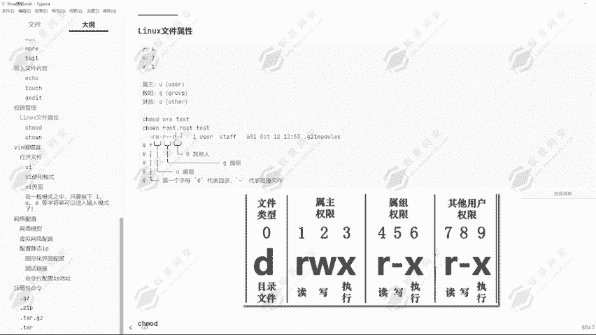

好，现在我们通过LS看一下有一页点TST这个文件。那现在我们给它去通过LS杠LA1页点TST。嗯。😊，我们来看一下这里分别代表的第一个。所书者他拥有了读写的一个权限，并没有执行权限。然后第二个。

所出组他拥有了读的权限，没有写和执行的权限。然后其他人他只有一个读的权限。那这里的意思就代表了除了root用户以外的所有人，他并没有写入的一个权限。那下面我们可以对它去进行一个切换用户。

我们现在切换为一页用户。好，然后我们来看一下这个文件，一页点TST。好，因为这个目录啊我们没有权限，所以说导致无法执行。那下面我们切换为typeap目录，因为t目录下也有一个夜点TST啊。

但是这个DS1页点TST文件里面没有对应的一个内容。没有关系，我们现在来去进行查看一页点TST。可以看到这里是root权限，root用户创建的一个文件，它root用户拥有了一个读写的一个权限。

那其他人是没有任何的权限的，只有读的权限的。所以说我使用到页用户，我能不能查看这个文件呢？很明显我能够查看。但是这个文件里面并没有任何的一个内容。那我能不能写这个文件呢？

那现在我可以使用到VI命令去打开这个文件去查看一下，我能不能写入好，我随便写入一个数字啊。好，保存可以看到我并不能够去进行保存。WQ加上一个感叹号，可以看到我无法打开并写入文件。那就证明了我是个用户。

他是没有这个权限的那下面我就只有去进行一个退出，强制退出。好，现在我再给它切换为root用户。好，刚才已经看到了，我E页用户，因为这个文件是root用户创建的那我使用一页用户不属于他的一个创建人。

所以说我没有对应的一个读和写的一个权限。然后其他人啊可以看到这一个O，也就是其他人，他并没有一个写入权限，只有一个读取权限。所以说我能够看到这个文件的内容。好，下面我使用root用户对这个文件写入一个。

我就随便写一点内容，就写个一页666。好，然后我现在再切换为一页用户。好，我再来去进行查看一页点TST，可以看到我能够看到它文件里面的一个内容啊，那就证明了这个读的权限我是有的。

写的权限我是没有的那我使用到root用户给他更改一下权限，我再看一下能不能去进行一个使用啊。好的。可以看到现在我们是只有一个读的权限。那下面我要给他一个写入权限，那怎么给呢？我们可以看到对应的一个命令。

嗯对应的一个命令啊，通过抄mo的，我们可以给予这一个通过窗mo的，我们可以给予这一个文件对应的一个权限。比如说刚才我们已经看到了，就是其他人。

也就是所有人他是一个O来代表的那我想要给这个O加一个写入的一个权限，我应该怎么给呢？可以看到这里有对应的一个命令啊，就是通过窗mo的。

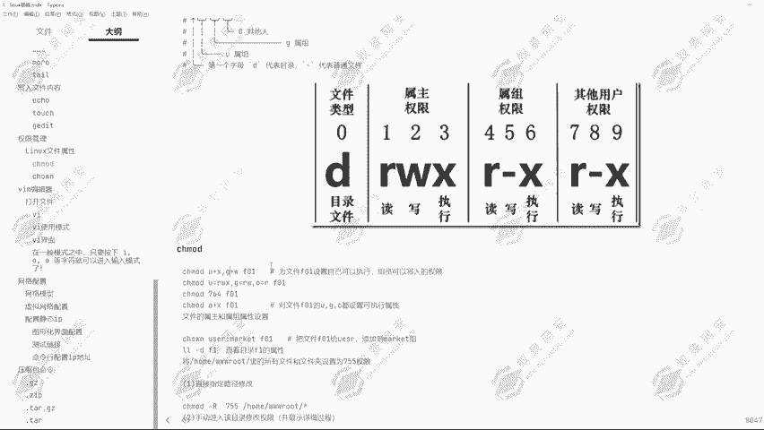

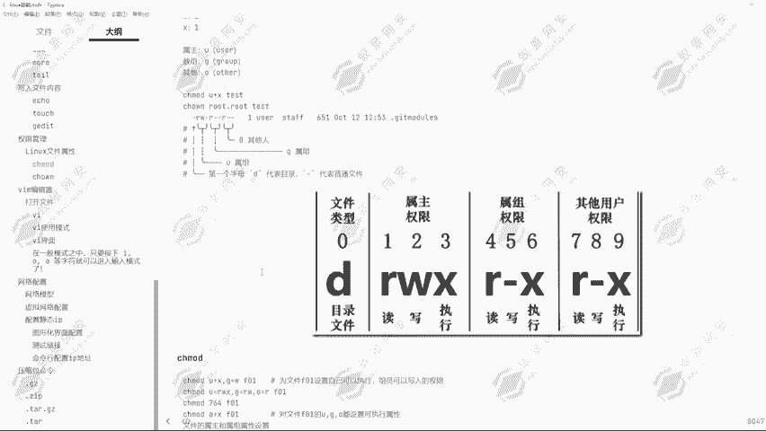

O等于R，或者说O加U加可以看到U加X就是所属者加上一个执行权限。然后奇G就代表的所属组，那所属组它加了一个读写，这就是写的一个权限，加上一个写的权限。然后现在我要给所有人加上一个写的权限。

应该怎么给呢？

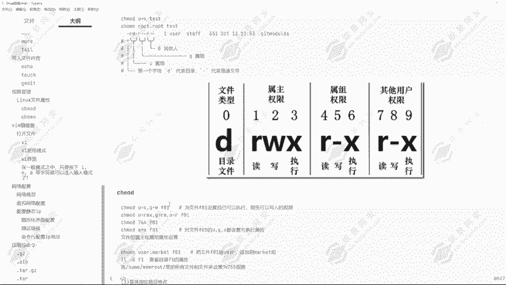

给大家去进行一个示范，通过触墨的。嗯哼。然后O。加。W。一页点TT好的，现在我们来看一下它的一个权限设置。可以看到所有人有一个写入权限的那现在我再给它切换为一页用户。然后现在我要写入这个文件内容。

我来看一下能不能写入。我给它写入一个一页，然后去进行保存，可以看到我能不能写入进去啊，我已经能够写入进去了，那就是给予了他一个写入的权限。那想要执行的话，那这一个文件是没有执行权限的，所以说无法执行。

那这里的一个给予权限的权限的一个方式，我相信大家应该学会了。然后这里的话就是大家。要能够看懂这里所代表的一个东西啊嗯。

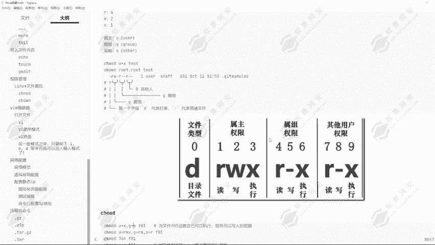

这里能够所代表的一个东西啊，也就是第一个，它是所书者。第二个是所述。是所属主，这个呀是属主主。所组的话就是创建文件的这一个用户。然后所属组的话，也就是这个文件属于是哪一个组里面的一个用户创建的。

就是所属组。那在Lux里面它是有对应的一个组的就是你这个用户在哪一个组，那你就拥有了这个组对应的一个权限。假设我E页用户在管理员组。那在管理员组，他这里所属组的话，它是一个管理员组。

这个文件是管理员组的他这里有有一个W的一个权限，也就是有写入的一个权限的话，那即使这一个O这里。他没有一个写入权限，我也能够对这个文件去进行一个更改。这就是所属组的意思。然后前面这里还有一杠。

这一杠啊代表的是。

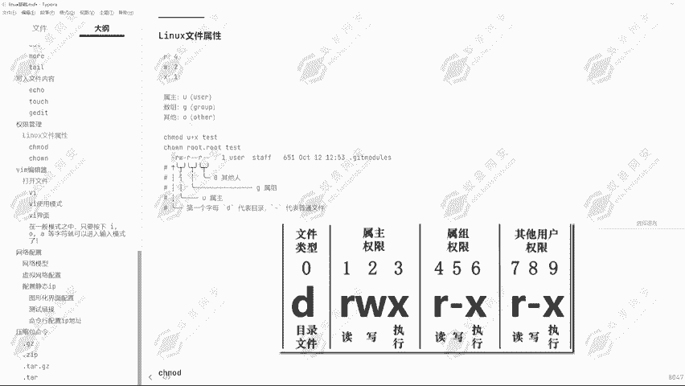

这个文件它是目录还是软软链接，还是一个普通文件，就从这里去进行一个表示的一个横杠代表的是它是一个文件。如果说是个D，它就是代表的是目录。

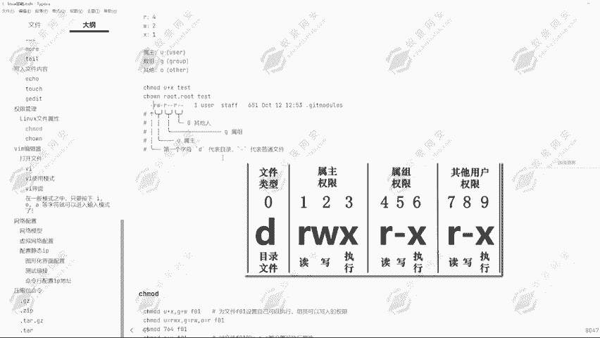

然后从通过窗报的，我们也可以去给它去进行一个。可以看到我们可以通过troode去给它去定义到数字的一个权限。因为刚才我们已经给大家讲过了啊代表的是读，然后W代表的是写，也就是421。

那我们也可以同样的通过数字的一个方式给予对应的一个权限。那数字的方式怎么给呢？我们可以通过troode764，那764代表的什么意思啊？七等于是多少。

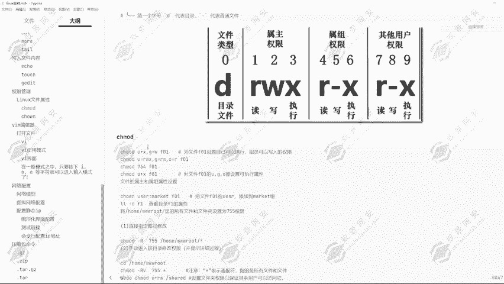

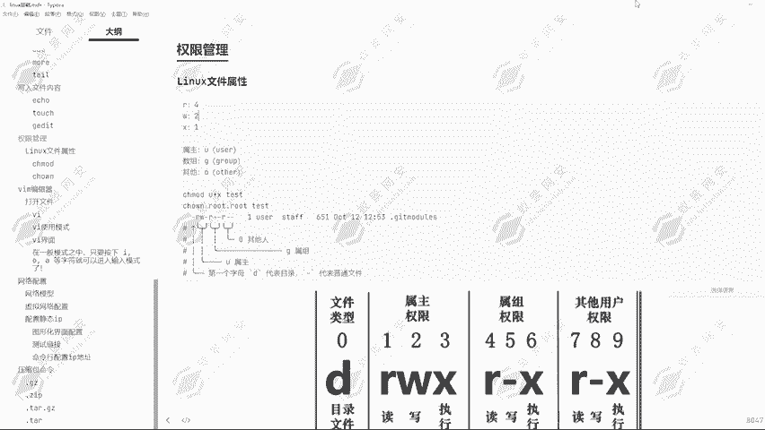

7、我们是不是。4加2加1等于多少，是不是等于7啊？是不是等于7，那我们给予它一个7的一个权限。比如说在这里我们给予700，然后一页点TST我们来看一下效果。好的，我现在更改不了，因为我是一验用户。好。

我通过root用户。给他去给1个700的一个权限，第页点TST。然后我们现在来通过LS杠AL，然后查看一下E页这个用户的一个权限，可以看到。所书者，也就是我们的一个root用户。

他拥有了读写执行的一个权限。但是我们的一个所书组，还有对应的一个任意人所有人，他并没有任何的一个权限。因为我这里给的是7007代表的是读写之行。可读可写可执行。然后零代表的没有任何权限。

那现在我要给它改一下，我要给它改成所属者所属组，它拥有读和执行的一个权限，应该怎么给呢？4加1等于多少？4加1等于5，那现在我给他给1个750，那我再来看一下它的一个权限。嗯哼。😊，听到。

所书者他拥有了读写执行权限，然后所书组他拥有了读和执行的权限。然后所有人呢他还是没有任何权限，因为我没有给权限。而，下面我要给他一个不给他读的权限，我只给他写入和执行的权限，应该怎么给呢？

我就给他一个3。只给他写入和执行的权限，我不给他读的权限，然后回车。那现在我们来看一下。他只有写入和执径的权限，它并没有读的权限。那现在我们切换为root用户呃，切换为一页用户。

那我还能够看这一个文件吗？可以看到我看不了了，权限不够。那我能不能写入这个文件呢？可以看到，因为我无法读，所以说我也无法去进行通过VI去进行一个编译编辑。然后我通过icle命令，我能不能写入进去呢？

那这个时候的话我可以切换为内存用户来查看一下。可以看到一页一就已经被我更改了。那这是为什么呢？因为我有写入权限呀，大家一定要记住，因为我有写入权限，所以说我可以通过icle命令写入一页一这一个。

字符串给它写入到这个文件里面去。虽然说我不能够查看，但是我能够写入，能够更改这个文件，那这就是写的一个权限。嗯这是它权限给予的一个方式啊，通过我们这里也可以通过U等于多少，G等于多少，O等于多少。

给予它对应的一个权限，也可以通过A加XU加X，还有对应的O加X的一个方式，对它去进行更改对应的一个属性，给它加一个属性给它去去除一个属性，就可以通过这种方式去进行更改。

然后我们也可以通过数字的一个方式给予它对应的一个权限。

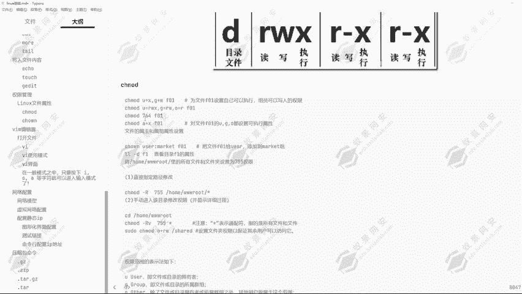

还有可以直接的可以看到我们可以直接指定路径去进行一个修改，修改这一个目录下所有文件的一个权限。这里的话我们加上个星号，就可以把所有文件的权限去进行一个整体的修改。

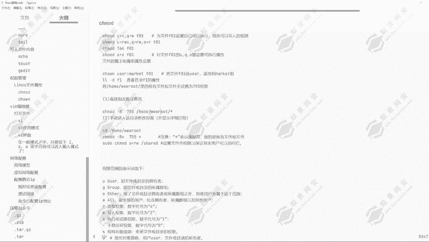

好，我们来看一下这个目录下，它所有的一个权限可以看到基本上是都没有一个执行或者读的一个权限的那下面我要把这个目录下的所有文件给他一个。当然我要给他一个执行权限，我要给他一个写入的权限。不给血入吧。

给一个。🤧。读取权限。给他一个读取权限，那我就是通过O。加。W哦给他O加R。给他一个读的权限，通过O加2。给他一个读的权限，然后他的一个目录是在哪里呢？TMP目录。信号所有文件回车。

那现在我们进入到TMP目录，然后我们在这里通过LLS杠LA查看一下。可以看到所有的文件都拥有了读的一个权限，除了目录，还有一些隐藏文件，隐藏目录啊，除了目录，那所有的文件都拥有了一个读的一个权限了。

可以看到都拥有读的一个权限了。这就是这一个命令的一个作用。通过刚案的一个参数，可以指定目录下所谓的一个文件。

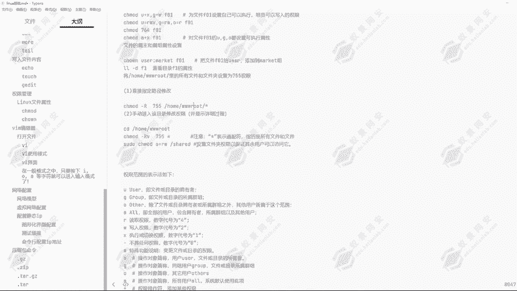

好，这就是权限范围的一个表示法。通过U可以看到，就文件或目录的一个拥有者G就是文件或目录的所属群组，还有O，就是所有除了文件或目录拥有者或所属群组之外，其他用户都是在这个范围之内就是所有人。

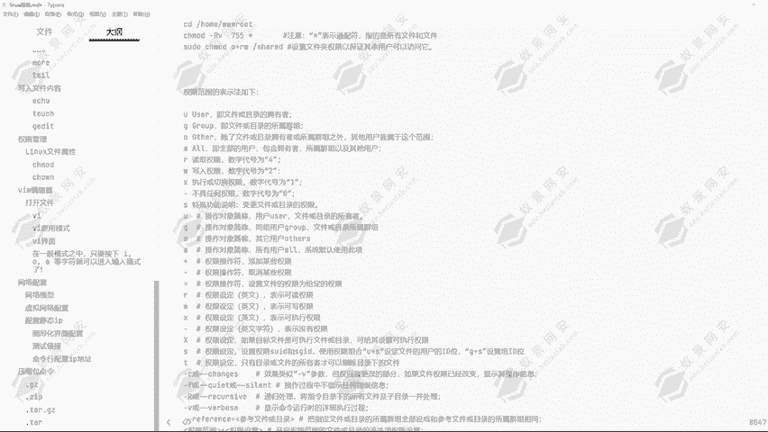

然后A即代表的是全部用户，包含了拥有者所属左以及其他用户。这用A去进行表示的话，就是修改所有的一个权限。

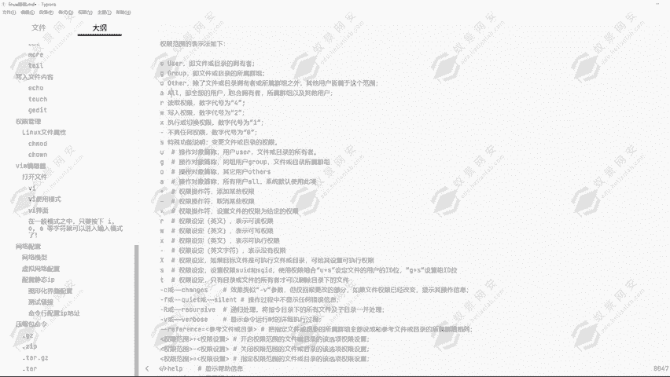

还有RWX可以看到。

还有一个SIS是特殊权限，它可以变更文件或目录的一个权限，这就是S的。可以看到这就是这一个文件权限的一个。

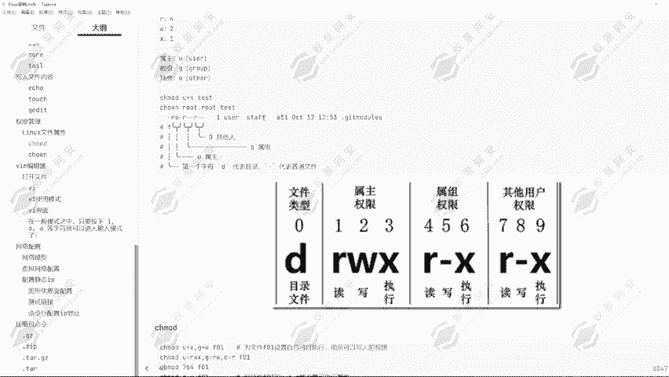

修改方式还有对应的一个查看方式。然后还有对应的修改所属的一个所有者，通过命令去进行一个修改。

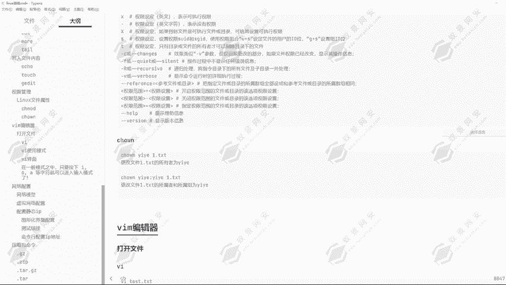

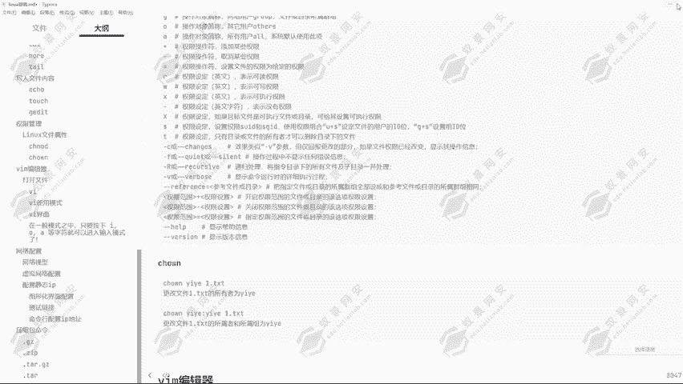

那所有者是在哪里呢？我们可以通过LS杠1A1页点TC我们来看一下，这里有一个root，这里就是所属者，然后这里又有一个root，它就是所属组的意思。那这两个我们可以去进行一个修改。啊。

这就是对应的一个所有者，还有对应的所属组这两个root，一个是root用户，一个是root组。当我们创建用户的时候，它会默认的创建一个用户组。可以看到这里我们是弄的一页用户，然后创建一页中用户之后。

它会默认的生成一个一页组。那我们怎么去更改这个所有者，还有所属组呢？我们就可以通过这么一条命令。CHOWN然后去进行一个更改。那我只想更改它的一个所有者呢，我就在这里通过CHO可以看到WN。

然后再加上对应的一个E页。再加上一页点TST这个文件回车。我们现在来看一下它的一个所有者是不是已经更改为页了，可以看到就已经更改为一页了。然后现在我又想把它的所有书组也可以给也给它改掉，应该怎么改呢？

当然它是有两条命令的，可以通过。W，然后一页。然后一页给它更改为一页的一个所属组，然后再加上这个用户的这一个文件的名字。那现在我们再来看一下，通过LS杠LA1页。可以看到就已经给它更改完成了。

当然我们也可以通过一条命令，就是CSG。RP然后对他去进行一个更改。Root。然后现在我们再来看一下。可以看到这个所属组，它又变更改为了root，那这就是更改所属组的一个方式，还有所有者的一个方式。

这就是通过这一条命令去进行一个更改。好，那这节课内容我们就讲到这里，然后我们下节课给大家讲解VIM编辑器的一个使用。

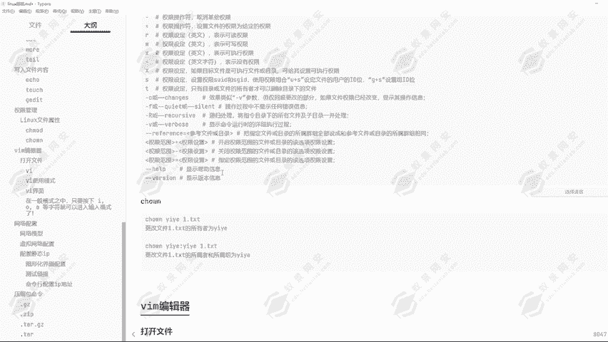