# 2024年最强Kali渗透教程／网络安全／kali破解／web安全／渗透测试／黑客教程 ／代码审计／DDoS攻击／漏洞挖掘／CTF - P19：13.vim基础使用 - 网络安全系统教学合集 - BV1Pe411C7Zb

好的，这节课给大家讲解VIM编辑器的一个操作啊。当我们想要去编辑这一个软件，或者说这一个文件的时候，我们可以使用到GEDIT，然后去进行编辑，然后直接打开去进行编辑。当然这是一种可行的方式。

但如果说我们没有对应的一个图形化界面的。那这个时候的话，我们就只能通过VIM的一个方式去进行一个编译编辑。但是VIM它分为两种，一个是VI一个是VIM这两个个的一个使用方式，其实没有多大的一个区别。好。

我们来看到这是它的一个使用说明手手册啊，通过VI去编辑到test点TST或者说一页点TST，我们就可以去编辑这一个文件的内容。嗯，可以看到那这里是它的一些参数啊。通过加号加上行号的一个方式。

从指定行号的一个行开始先示文本内容。然后杠B的一个参数，以二进制模式打开文件，用于编辑二进制文件和可执行的一个文件。所以说啊YIM它是可以去编辑到对应的一个文本文档也可以编辑二进制文件。比如说图片。

比如说应用程序都可以通过这个方式去进行一个编辑。然杠C在完成第一个文件编辑任务后执行给出的一个指令，还有杠D杠LL可以看到这么多一个参数都是我们可以去进行一个编辑的。然后这是它的一些使用方式。

ctrl加U像文件首。像文件少翻半屏，然后看数加低，然后向文件尾部翻半屏。那这里都是它的一些使用方式，我们就不做过多的一个讲解。我们来看到这是VI还有VIM的一个键盘图。

就是每一个键盘一个键值代表的一个意思。

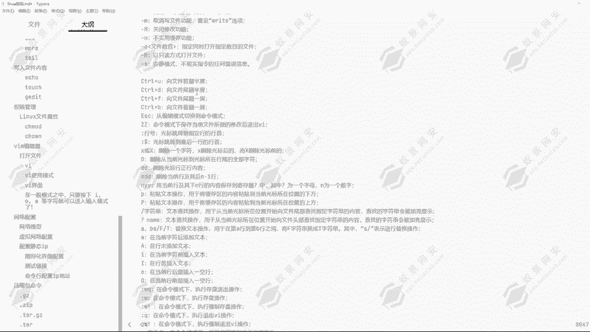

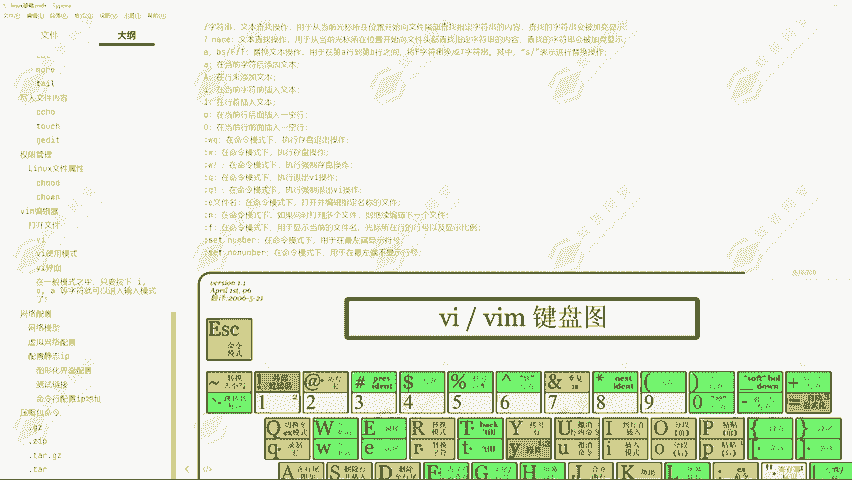

可以看到它的一个熟练使用是非常复杂的。但是我们去进行一个日常的编写，其实必须不并不需要这么复杂。我们需要理解三个模式。它在这里可以分为三个模式啊，第一个是命令模式，第二个是输入模式。

第三个是底线命令模式。这三个模式分别带表的是什么意思呢？我们通过VI加上文件，然后去进入。进入完成之后，我们是不能够编辑的那这一个模式叫做命令模式。然后在命令模式这里我们可以去输入到对应的命令。

比如说这一些。

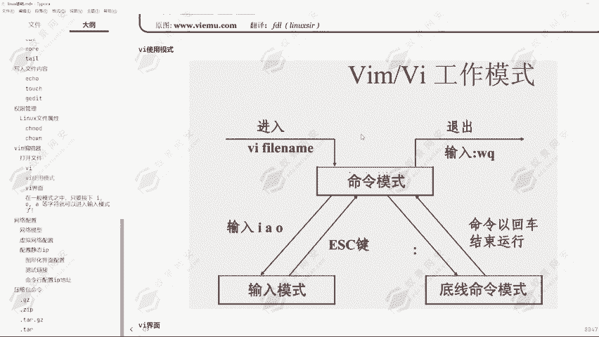

可以看到。嗯EESCZZ命令还有D，还有冒号，还有对应的冒号加多了福。那这一些就是我们在命令模式里面可以输入到的一些值。

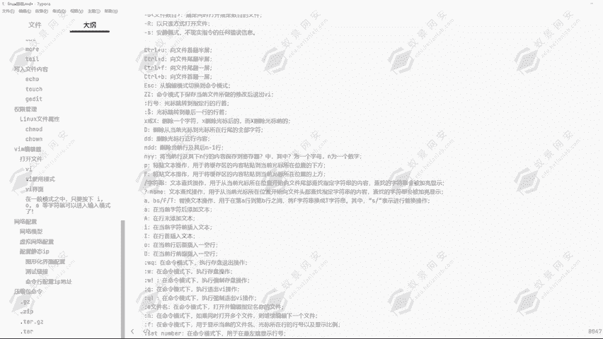

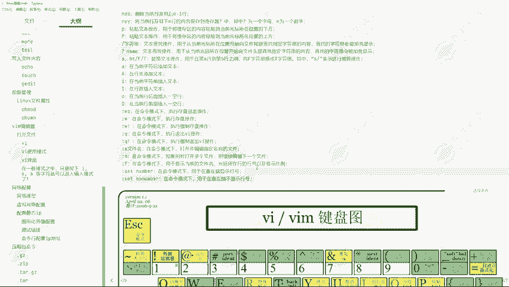

这就是我们在命令模式里面可以输入到的一个值。然后我们来看到就是这个输入模式。那输入模式里面我们可以做哪些操作呢？我们就可以去输入到对应的一些内容。

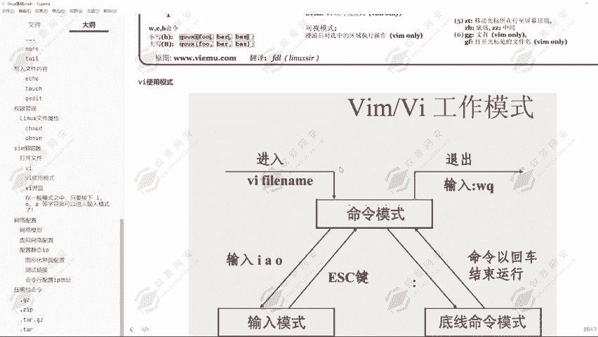

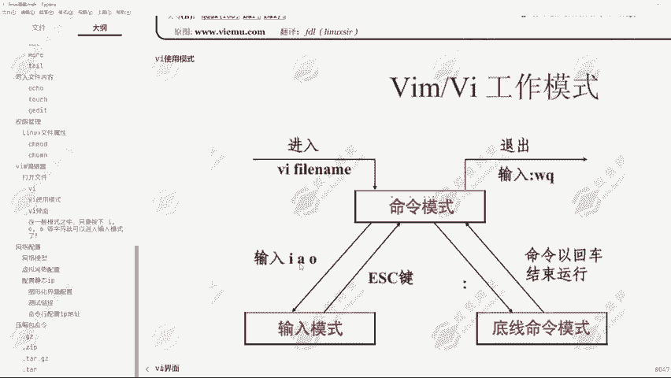

比如说我要更改这个文件，一页点1页66，我要更改为张三，那我就在输入模式里面把所有的一个内容去进行一个删除，然后再去进行编辑。这就是输入模式。然后底线模拟模式呢。

底线命令模式是我们在命令模式这里是我们在输入模式这里按住ESC键，然后退出到命令模式之后。然后我们就可以通过输入到冒号进入到底线命令模式。那底线命令模式啊，这里面我们可以输入到了命令有哪些呢？

可以看到冒号WKWQ等于。

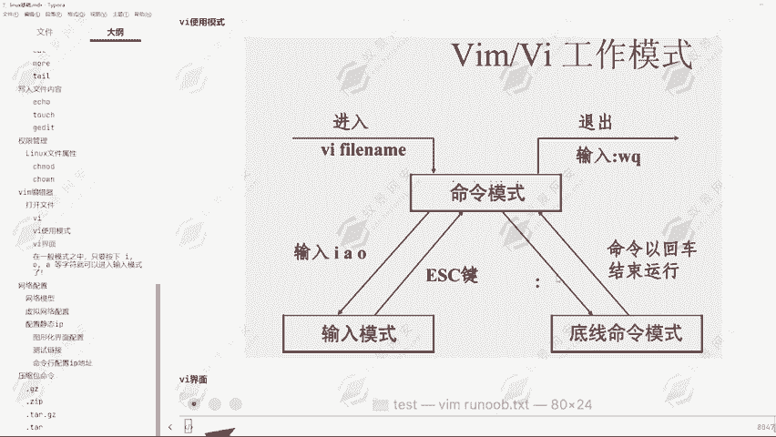

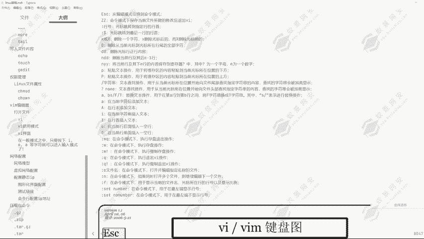

退出操作，黑到冒号W。执行存盘的一个操作就是存储。然后W井号键，那W感叹号键意思就是强制保存。可以看到这里就是我们能够去进行操作的。

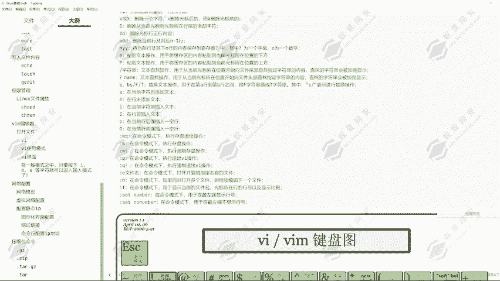

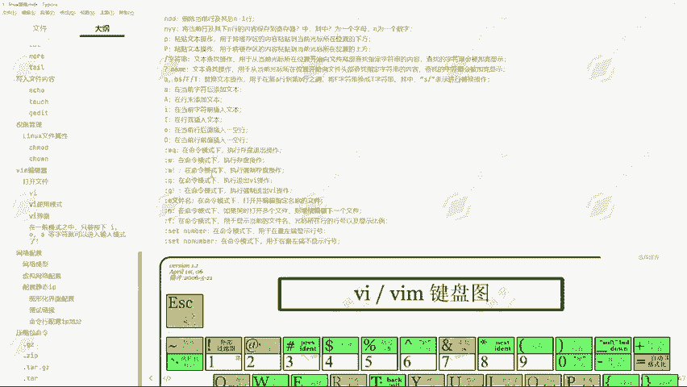

显示行号的通过set，然后去显示对应的一个行号，而不显示行号。

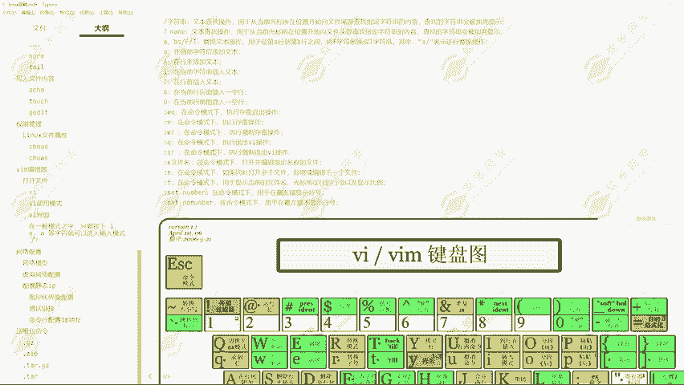

嗯。然后我们也可以去进行一个查找。我们也可以去进行一个查找，也就是通过一个斜杠，然后字符串在文本文本查找操作去查找对应的一个指定内容，指定字符串，还有文本的一个查找操作，可以看到问号加上名字。

然后去进行一个查找。那这里就是我们能够在底线命令模式里面去执行的一个操作。而命令模式里面的话，我们就只能执行到这一些英文字符可以看到DDDNDD还有NYY那这些都是我们是在这一个命令模式里面去进行一个输入的那这三个模式可以看到通过VI界面。

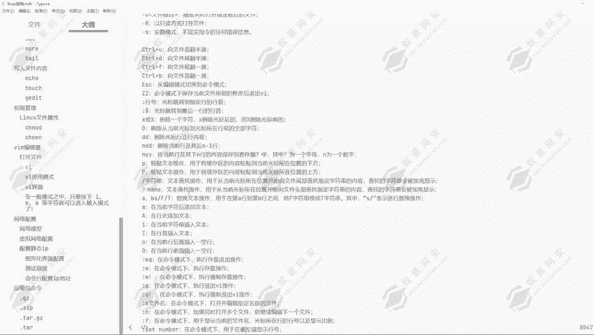

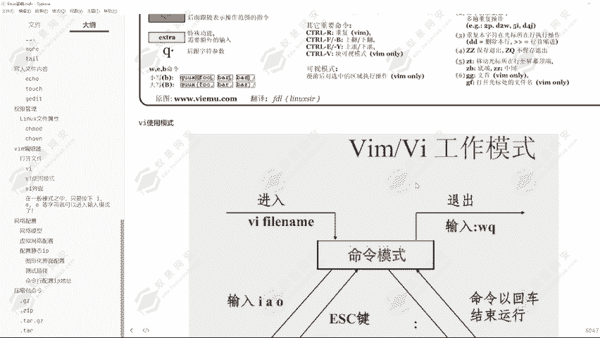

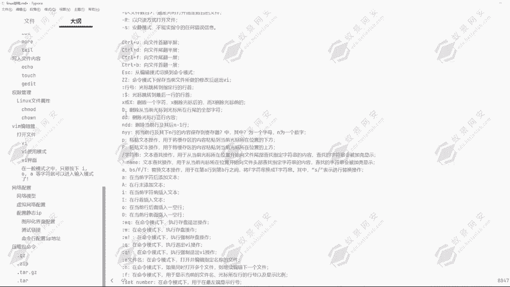

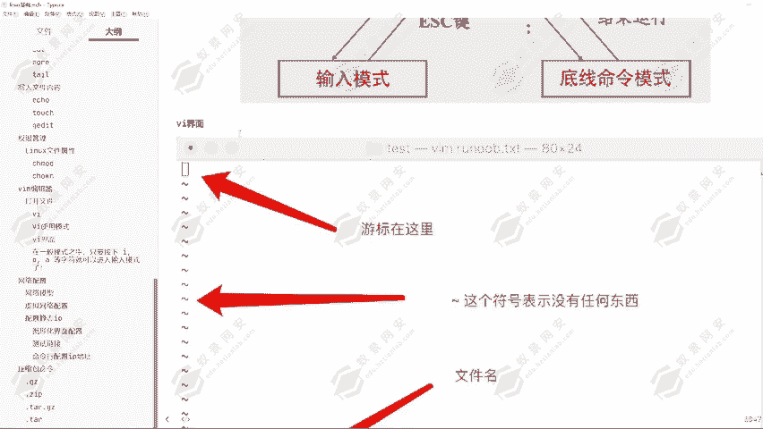

这里的一个游标，也就是我们的一个能够操作的地点，就是在这里会去进行一个显示。然后这一个波浪号它代表的是没有任何东西，就是没有任何数据。然后这里是文件的一个名字，然后我们要去进行一个操作。

可以看到输入IOA等字符，就可以出进入到输入模式。那输入模式这里会出现1个IMSERT也是插入，会出现这么一个字符。然后在显示为这个字符的时候，证明我们现在处在输入模式中输入模式中。

我们就可以在文本里面去输入到任何的一些内容。

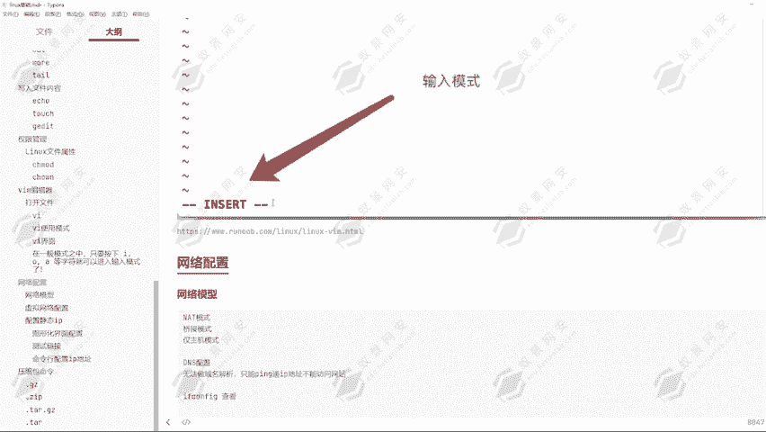

这就是对应的YM的几个模式。好，下面给大家去进行一个演示。

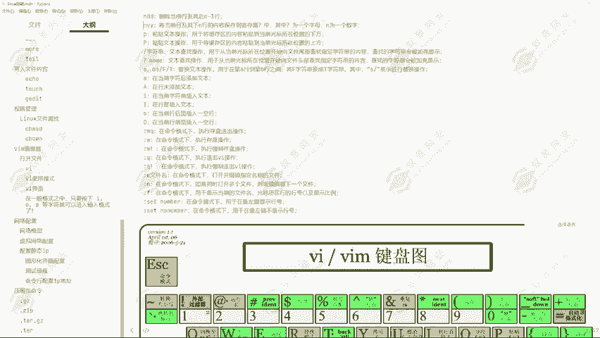

其实一般操作我们是用不到这么多的一个指令的嗯。好，进来之后，我们想要操作这一个一页点TSC这么一个文件，通过VI进入到这个文件里面，可以看到这个在闪烁的就是我们的一个光标。那我们现在这个光标在哪里？

我们就可以对哪个内容去进行一个操作。假设我们现在是在我们进现在是刚进入到这个文件，我们处在命令模式。然后在命密模式里面，我们可以输入到对应的一些指令。比如说滴滴删除这一行。比如说我按个A进入到插入模式。

那进入到这个输入模式之后，我要输入一个一页666。然后再给他输入一个张三，然后再给他输入一个李4。然后再给它输入一个一，那这里就是我们输入的这几个字符串，也就是在插入模式里面。

我们想要给它输入的对应的一个值。然后我们怎么退出插入模式呢？按住ESC键可以看到我们就退出了插入模式。然后在这里面我们可以按住滴滴给它删除一行，大D给它删除一行。

可以看到就通过这种方式然后去进行一个添加删除或者修改。然后我们还能够执行的操作，可以看到这里面能够执行操作啊是非常非常非常多的。MDD删除当前行及其后N减一行，也就是我们输入一个数字。

再按住两个DD删除当前。和后面的一个N减一行，就是从当前行来开始去进行一个个进行一个计算。而通过ctl的键，然后ctl加这一些指令键，我们就可以去对这一个文件去进行一个翻页的一个操作。好。

最这键就是命令模式下保存当前文件所做的修改后退出VI。

那这里也就是我们能够在命令模式里面执行的一个操作啊。然后这就是命令模式，然后插入模式就是按住I。嗯哼。😊，按住I。And卓。按住O可以看到我们都可以进入插入模式。

只是插入模式的一个插入的一个位置是不同的。按住A的话，我们可以看到现在我的光标是在L这里，按住A退到I。然后我按主哎可以看到就是在当前位置插入。然后我按主O可以看到它是在下一行插入。

这就是对应的不同的进入到。命令模式的一个方式。进入到输入模式的一个方式啊。然后现在我想要进入到底部命令模式，我们应该怎么进入呢？可以看到从插入模式，我要进入到底底部命令模式去进行一个保存。

在这里我们按住ESC键，然后按住一个shift加上冒号键，可以看到就切换到这里了，然后现在我想要去输入到保存命令W保存，可以看到已经保存完成了。然后现在我要输入保存退出，那可以看到就保存退出完成了。

然后我现在想要查找一下对应的一个。祖船。李四。可以看到他就会跳转到李四这里，那这就是查找的一个方式。这也是我们经常使用到的，然后还有WQ。

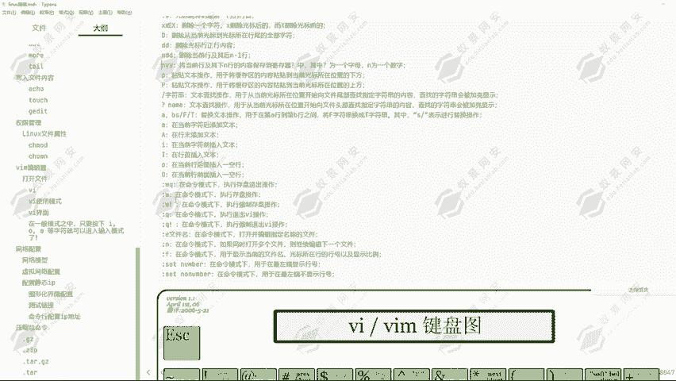

🤧感叹号键，也就是强制保存退出，强制保存。ふん。然后这是st sit，然后NU。MB呀那就显示行号。Sit。And you。哦，这里的一个指令不是记得很清楚啊。

MBR显示行号可以看到就可以显示出对应的一个行号，然后去去除行号，我们就可以在这里。SET。No， and you。M抵押。去除行号可以看到就通过这种方式，然后去显示和去除行号。

YIM它的一个功能性是非常强大的。一般我们在linux里面编辑文件的话，都是使用的YIM的一个方式，然后去进行一个编辑。可以看到这里的指令是非常非常多的，我们可以去一一的熟悉。

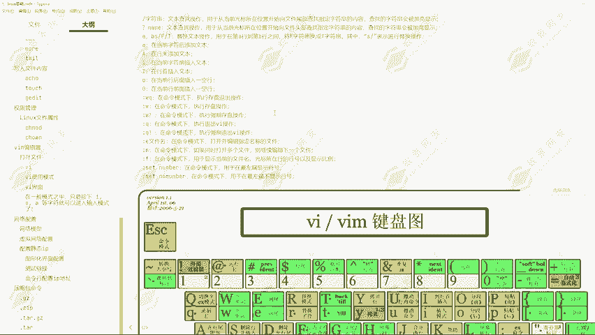

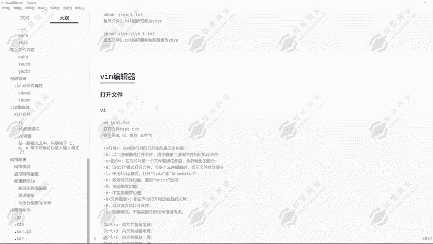

好的，那这就是VIM的一个基本使用。然后大家看一下这个文档，其实就能够很好的理解了。那下节课为大家讲解网络的一个配置。那我们这节课就讲到这里，大家在课后多去进行一个操作。

这后才能够更好的理解VIM的一个使用方式。还有这里它所有的一个操作指令。

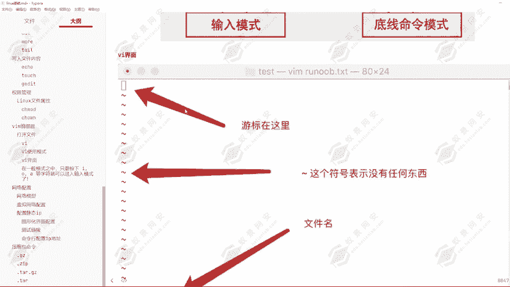

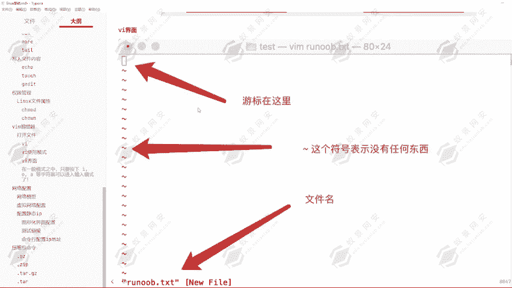

好的，那我们这课就讲到这里，大家。记得多去进行一个操作，多去熟悉。

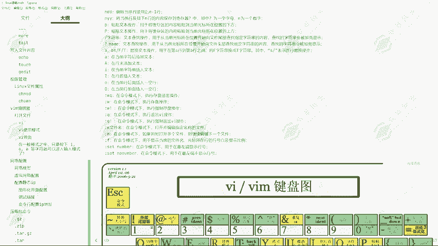