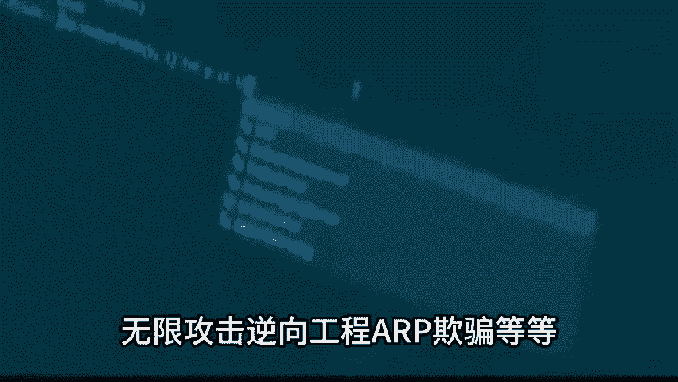
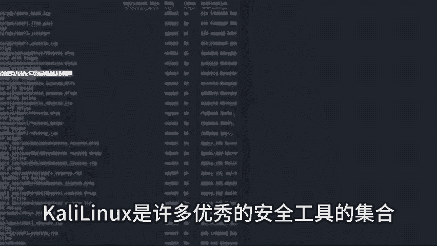

# 2024年最强Kali渗透教程／网络安全／kali破解／web安全／渗透测试／黑客教程 ／代码审计／DDoS攻击／漏洞挖掘／CTF - P1：Kali - 网络安全系统教学合集 - BV1Pe411C7Zb

Yeah。🎼如果你听到1个13岁的黑客吹嘘，他是多么的牛逼是有可能的，因为有collinlin存在。尽管有可能会被称为脚本小子。但是事实上，他如果玩明白了lin确实会有一定的危险。

是基于delinux发行版操作系统，一开始是用来进行数字取证，而且它拥有超过300个渗透测试工具。这些工具可以用于漏洞分析密码攻击无线攻击逆向工程二欺骗等等，还集成了600多种黑客工具。

而且这些工具本身就已经内置于系统之中，不需要开发人员开发直接就可以使用，并且它可不是玩具，它是真的能让你做出一些会产生真实伤害的危险是，那将给你带来很多真实的。

lin Linuxux是许多优秀的安全工具的基础。对于专业用户来说，它有难以置信的好处，但是对于一些不坏好的。😊。

🎼也可以产生很多大麻烦，小心的使用考力，充分利用它的巨大优势。如果不这样的话，你将在某个地方做过。

